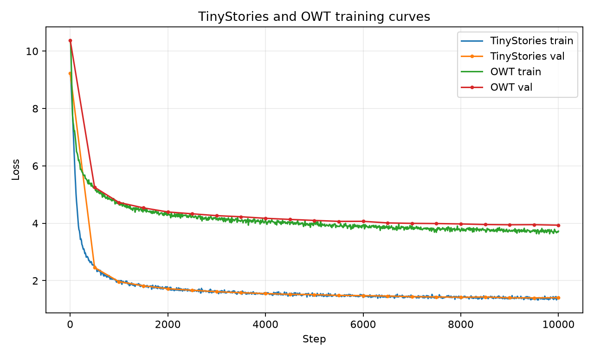

# A1 公开提交：何思洋

## 基本信息

- 作业题面版本：26.0.4
- 上游 starter commit：`a158843b20107949f1a8d7df1b05cd33b9166712`
- 本地工作仓库：`../assignment1-basics`
- 完成范围：tokenizer、Transformer LM、训练工具、checkpoint、训练脚本、编码脚本、生成脚本；TinyStories 和 OWT 实验均已跑完
- 未完成项：无
- 公开测试：47 passed，另有 1 个 xpass/xfail 项

## 书面题

`unicode1`：Unicode 是字符到码点的标准，UTF-8 是把码点写成字节序列的编码方式。比如一个中文字符在 Python 里 `len(text)` 可能是 1，但 `len(text.encode("utf-8"))` 往往是 3。byte-level tokenizer 从 256 个 byte 出发，所以不会有普通意义上的 OOV；代价是如果不做 BPE，序列会很长。

`unicode2`：直接按 Unicode code point 建初始词表不合适。Unicode 空间很大，真实文本又会混合 emoji、组合字符、罕见文字和坏编码片段，覆盖完整码点表会浪费词表；只覆盖训练集中出现过的码点又会在验证或生成时遇到没见过的字符。按 UTF-8 byte 做底层单位更稳，之后用 BPE merge 高频片段来压缩序列。

AdamW 的显存和计算量按参数量粗算如下。训练时每个 fp32 参数至少有 parameter、gradient、一阶矩 `m`、二阶矩 `v` 四份张量，也就是约 `16 * P` bytes；不含激活、临时 buffer 和 optimizer kernel 额外开销。

| 模型 | 参数量 | AdamW 相关显存 | 粗略 AdamW FLOPs/step |
| --- | ---: | ---: | ---: |
| TinyStories 10K vocab | 22,696,448 | 346 MiB | 0.36 GFLOPs |
| OWT 32K vocab | 45,224,448 | 690 MiB | 0.72 GFLOPs |

这里 FLOPs 用约 `16 * P` 标量操作估算，包括更新 `m/v`、weight decay 和参数更新。这个量级比 Transformer forward/backward 小很多；实际 wall-clock 主要花在矩阵乘、attention、数据取 batch 和验证。实测 TinyStories 10k steps 用 2790s，OWT 10k steps 用 3623s。

## 实现

主要实现放在 `submission/cs336_basics/`：

- `tokenizer.py`：byte-level BPE，包含 special token 处理、pair 统计、merge、encode/decode 和 tokenizer JSON 保存/加载。
- `model.py`：Linear、Embedding、RMSNorm、SwiGLU、RoPE、causal self-attention、Transformer block 和 TransformerLM。
- `training.py`：softmax、cross entropy、AdamW、cosine schedule、gradient clipping、batch 采样、checkpoint 保存/加载。
- `submission/scripts/`：下载、BPE 训练、tokenizer 指标、数据编码、LM 训练和文本生成入口。


## Tokenizer 实验

| Tokenizer | 评估文本 | vocab | merges | bytes/token | throughput | longest token |
| --- | --- | ---: | ---: | ---: | ---: | --- |
| TinyStories train 10K | TinyStories valid | 10,000 | 9,743 | 4.1204 | 153,984 tok/s | ` accomplishment`，15 bytes |
| OWT 64M 10K | OWT valid 10MiB | 10,000 | - | 3.8360 | 114,417 tok/s | `________________`，16 bytes |
| OWT full 32K | OWT valid 10MiB | 32,000 | 31,743 | 4.3369 | 118,572 tok/s | mojibake repeated token，64 bytes |

TinyStories 的文本更规整，10K 词表已经能把常见英文故事片段压得不错。OWT 更杂，有网页文本、符号和坏编码；32K 词表比 10K OWT tokenizer 明显提高压缩率，从 3.836 bytes/token 到 4.337 bytes/token。OWT 最长 token 是重复的 mojibake 字节串，这也说明网页语料里有不少脏文本，BPE 会把高频噪声也学进去。

## 训练结果



TinyStories baseline 配置：4 layers，`d_model=512`，`d_ff=1344`，16 heads，context length 256，batch size 128，vocab 10000，max lr `5e-4`，10,000 steps。

| Run | steps | batch | max lr | final train loss | final val loss | best val loss |
| --- | ---: | ---: | ---: | ---: | ---: | ---: |
| TinyStories baseline | 10,000 | 128 | 5e-4 | 1.3961 | 1.4061 | 1.4003 at step 9500 |
| OWT 512MiB full32K | 10,000 | 128 | 3e-3 | 3.7241 | 3.9342 | 3.9342 at step 10000 |

TinyStories 的曲线在前 3000 steps 下降最快，后面主要是缓慢改善；最后一步 val loss 比 step 9500 稍高一点，但差距很小。OWT 的 loss 一直降到最后，说明这个设置还没有明显收敛，继续训练或扩大训练 tokens 应该还有收益。

## TinyStories 扫参

学习率 sweep 的正常收敛部分都跑 3000 steps、batch size 128：

| max lr | final val loss |
| ---: | ---: |
| 1e-4 | 2.1874 |
| 3e-4 | 1.7680 |
| 5e-4 | 1.6151 |
| 1e-3 | 1.5236 |
| 3e-3 | 1.4590 |

在这个 3000-step 预算下，`3e-3` 最好。`5e-4` 是 baseline 的学习率，长训能到 1.40 左右，但短训时明显偏保守。

为了确认过大学习率确实会发散，我又补跑了一个 `max_lr=1.0` 的短 run。这个 run 用同一 TinyStories 数据、同一模型和 batch size，warmup 10 steps，跑 120 steps。它在 step 20 时 train loss 到 316.7、val loss 到 338.6，已经不是正常收敛曲线；后面虽然 cosine decay 把 LR 降下来，final val loss 仍有 28.0。对应日志为 `logs/lr_sweep/lr_1e0_diverged.jsonl`。

| max lr | steps | peak observed val loss | final val loss | 结论 |
| ---: | ---: | ---: | ---: | --- |
| 1.0 | 120 | 338.6428 at step 20 | 28.0294 | 发散/失稳 |

Batch size sweep 使用 `max_lr=3e-3`，跑 3000 steps：

| batch size | processed tokens | final val loss |
| ---: | ---: | ---: |
| 64 | 98.3M | 1.6667 |
| 128 | 98.3M | 1.4590 |
| 256 | 196.6M | 1.3922 |

这里 step 数固定，所以 batch size 256 实际看了两倍 token，结果最好并不意外。batch size 64 同样步数下 token 少，效果明显差。

四个 ablation 都基于 `max_lr=3e-3`、batch size 128、3000 steps：

| Ablation | final val loss | 备注 |
| --- | ---: | --- |
| no RMSNorm | NaN | step 500 左右开始发散 |
| post-norm | 1.4833 | 能训，但略差于 pre-norm |
| NoPE | 1.5586 | 去掉 RoPE 后位置建模变弱 |
| no SiLU | 1.4661 | 用 linear gate，接近 baseline sweep 但略差 |

最明显的是 RMSNorm：直接去掉后训练不稳定，loss 变成 NaN。RoPE 的影响也比较清楚，NoPE 在故事数据上仍能学到局部模式，但验证 loss 明显变高。Post-norm 没有发散，不过效果不如 pre-norm。

## OWT 实验

OWT 使用 full 32K tokenizer，训练集取前 512MiB 编码后得到 122,868,632 tokens；valid 全量编码后为 66,401,098 tokens。模型仍是 4 layers、`d_model=512`、`d_ff=1344`、16 heads、context length 256，但 vocab 变为 32000，参数量变成 45,224,448。

| 项目 | 数值 |
| --- | ---: |
| steps | 10,000 |
| batch size | 128 |
| processed tokens | 327,680,000 |
| total time | 3623.46s |
| final train loss | 3.7241 |
| final val loss | 3.9342 |

OWT 的 final val loss 高于 TinyStories，符合预期：语料更开放，tokenizer 也更大，512MiB 子集对 OWT 来说仍然很小。曲线最后还在下降，说明这次更像是确认 pipeline 跑通并得到一个可用 checkpoint，而不是把 OWT 训练到饱和。

## 文本生成

生成脚本为 `submission/scripts/generate.py`，使用 checkpoint 加载、prompt 编码、取最后 256 token 作为上下文，temperature 0.8、top-p 0.9 采样。

TinyStories prompt:

```text
Once upon a time, there was a little girl named Lily who found a magic key.
```

生成片段：

```text
The key could unlock a secret door in her house. Lily was very excited and wanted to see what was behind the door.
Lily unlocked the secret door and found a room full of toys and treats. She played and ate treats all day long. But then, something unexpected happened. The toys started to talk!
```

这段风格很像 TinyStories，故事完整，最后自然生成了 `<|endoftext|>`。缺点是情节比较模板化，惊喜和结尾都很常见。

OWT prompt:

```text
The future of artificial intelligence depends on
```

生成片段：

```text
the fact that the human condition, for example, is closely related to the biological processes involved in processing human physiological processes and social processes, and therefore the way we do not know.
```

OWT 样本有网页文章的语气，局部语法基本通顺，但反复使用 "human condition"、"human consciousness" 这类抽象短语，整体信息密度不高。这和 OWT val loss 还在 3.93 左右是一致的。

完整生成文本放在 `logs/generations/`。

## 复现说明

环境使用 assignment1-basics 的 `uv.lock`，本机运行时固定用：

```sh
conda run -n a1-basics uv run --no-sync ...
```

主要命令入口：

```sh
conda run -n a1-basics uv run --no-sync python scripts/train_bpe.py ...
conda run -n a1-basics uv run --no-sync python scripts/tokenizer_metrics.py ...
conda run -n a1-basics uv run --no-sync python scripts/encode_data.py ...
conda run -n a1-basics uv run --no-sync python scripts/train_lm.py ...
conda run -n a1-basics uv run --no-sync python scripts/generate.py ...
```

同步到本仓库：

```sh
conda run -n a1-basics uv run --no-sync python scripts/sync_a1_submission.py --name '何思洋'
```

配置文件：无单独的配置文件，实验参数记录在 `logs/**/*.json` 和 README 表格中。

## 实验日志

- 训练 JSONL 和 summary：`logs/tinystories_baseline/`、`logs/lr_sweep/`、`logs/batch_size/`、`logs/ablations/`、`logs/owt_512M_full32k/`
- tokenizer 指标：`logs/tokenizer/`
- 生成样本：`logs/generations/`
- 补充汇总：`logs/EXPERIMENT_SUMMARY.md`


## 飞书补充文档

- 链接：https://fudan-nlp.feishu.cn/wiki/FiYLwB88PiUOiXkSZBLcZKNsnqb
