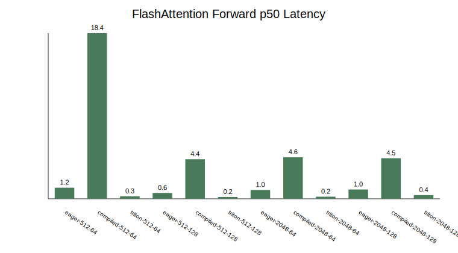
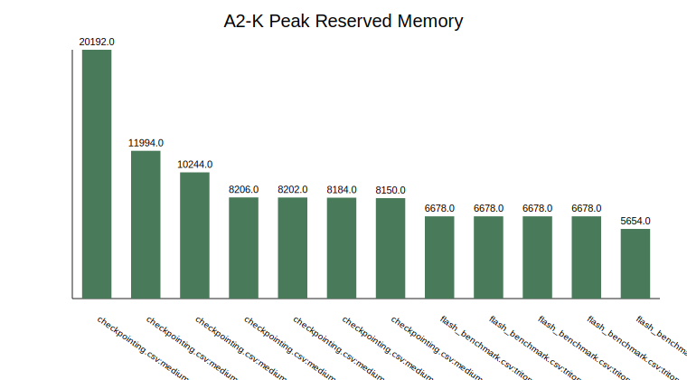

# A2-K 公开提交：何思洋

> 正式要求见 [`assignments/A2-K/README.md`](../../../../assignments/A2-K/README.md)，评分说明见
> [`assignments/A2-K/EVALUATION.md`](../../../../assignments/A2-K/EVALUATION.md)。

## 基本信息

- 作业题面版本：`26.1.4-k-rc.3`
- 上游 starter commit：`ca8bc81a59b70516f7ebb2da4808daade877c736`
- 完成范围：FlashAttention PyTorch/Triton forward、PyTorch 重计算 backward、官方 tests、扩展 correctness、attention benchmark 到 16384、checkpointing 1024 标准矩阵与 2048 边界、飞书补充文档链接
- 说明：当前物理 GPU 报告约 48GB，但正式脚本已设置 23552 MiB allocator 上限

## 环境与工具

| 项目 | 公开、脱敏的信息 |
| --- | --- |
| GPU | NVIDIA GeForce RTX 4090，当前机器报告 `49140 MiB` total |
| Driver / CUDA | Driver `570.195.03`，CUDA runtime `12.6` |
| PyTorch / Triton | PyTorch `2.11.0+cu126`，Triton `3.6.0` |
| Python | `../assignment1-basics/.venv/bin/python` |
| 结果有效性 | 当前物理 GPU 报告约 48GB；脚本在首次 CUDA allocation 前设置 23552 MiB allocator 上限，peak reserved 未超过 23552 MiB |

## 1. Activation Checkpointing

理论上，对 `N` 个 Transformer block，可保存每个 checkpoint 边界 activation，并在 backward 时重算边界之间的 blocks。非嵌套、block size 为 `b` 时，峰值 activation memory 近似由边界 activation 数量 `O(N/b)` 与单段重算中的 `O(b)` activation 共同决定；计算量会增加，因为 backward 期间需要重跑每个 checkpoint 段的 forward。最佳 `b` 不是越小越好：小 `b` 保存更多边界并增加调度开销，大 `b` 降低边界数量但单段重算峰值更高。

伪代码骨架：

```python
x = embeddings(tokens)
for start in range(0, num_layers, block_size):
    end = min(start + block_size, num_layers)
    x = checkpoint(sequential(layers[start:end]), x)
logits = lm_head(final_norm(x))
```

checkpointing 使用 medium、24 层、batch size 1、BF16 autocast、warmup 1、measurement 2；覆盖 context 1024 标准矩阵和 context 2048 baseline + 最低显存 checkpoint 配置。完整数据见 [`results/checkpointing.csv`](results/checkpointing.csv)。

| block size | p50 step ms | peak reserved MiB | status |
| --- | ---: | ---: | --- |
| none | 153.43 | 10244 | ok |
| 1 | 315.18 | 8150 | ok |
| 2 | 220.49 | 8202 | ok |
| 4 | 219.28 | 8184 | ok |
| 8 | 250.77 | 8206 | ok |
| none, ctx 2048 | 382.95 | 20192 | ok |
| 8, ctx 2048 | 541.34 | 11994 | ok |

1024 矩阵中 checkpointing 把 peak reserved 从约 10.0 GiB 降到约 8.0 GiB，但 step latency 明显增加。2048 边界中 block size 8 把 peak reserved 从约 19.7 GiB 降到约 11.7 GiB，代价是 p50 step time 从约 383 ms 增至约 541 ms。

## 2. PyTorch Attention 与 `torch.compile`

显式 eager baseline 使用 `QK^T`、scale、causal mask、softmax、`PV`，未调用
`scaled_dot_product_attention`。结果见 [`results/attention_baseline.csv`](results/attention_baseline.csv)。

`torch.compile` 对照来自同一 benchmark 表的 eager/compiled 子集，见
[`results/compile_comparison.csv`](results/compile_comparison.csv)。本地脚本把 compiled callable 在 warm-up 前创建，并把 warm-up 后的 steady-state measurement 写入 CSV；cold-start 编译成本没有计入 steady-state 行。

## 3. FlashAttention-2 Forward

实现位置：[`submission/cs336_systems/a2k/flash_attention.py`](submission/cs336_systems/a2k/flash_attention.py)。

PyTorch path 是 `torch.autograd.Function`，保存 `Q/K/V/O/L`，其中 `L` 是唯一 shape 为
`[batch, n_queries]` 的 log-sum-exp tensor。Triton path 使用学生编写的 `@triton.jit` tiled
forward kernel：

- query tile：`BLOCK_M=16`，`head_dim=128` 时降为 `8`
- key/value tile：`BLOCK_N=64`，`head_dim=128` 时降为 `32`
- accumulator、online softmax 的 `m_i/l_i` 状态使用 FP32
- 支持 causal 与 non-causal
- 保存 `O` 和 `L`

## 4. Backward

必做 backward 使用 PyTorch 重计算 attention，并接入 PyTorch 和 Triton 两个 autograd path。官方
tests 检查 `dQ/dK/dV`，结果见 [`results/unit_tests.txt`](results/unit_tests.txt)：

```text
6 passed
```

自定义 Triton backward 未实现。

## 5. Correctness

官方命令：

```bash
../assignment1-basics/.venv/bin/python -m pytest tests/test_attention.py -v
```

官方结果：6 passed，0 failed，0 skipped。

扩展 correctness 覆盖 3 个 seed、head dimension 32/64/128、causal/non-causal，以及 output、
log-sum-exp、`dQ/dK/dV`。至少一个 seed 使用 FP32，其余使用 BF16。完整数据见
[`results/correctness.json`](results/correctness.json)，18/18 cases 通过。

## 6. Performance Matrix

本地矩阵比较 eager、compiled、Triton 三种实现，sequence length 覆盖 512、2048、8192，并对 16384 边界比较 eager 与 Triton，
head dimension 覆盖 64、128，phase 覆盖 forward、backward、forward-backward。完整数据见
[`results/flash_benchmark.csv`](results/flash_benchmark.csv)，metadata 见
[`results/run_metadata.json`](results/run_metadata.json)。



示例本地结果：

| implementation | seq | dim | phase | p50 ms | status |
| --- | ---: | ---: | --- | ---: | --- |
| eager | 512 | 64 | forward | 1.23 | ok |
| compiled | 512 | 64 | forward | 18.37 | ok |
| triton | 512 | 64 | forward | 0.27 | ok |
| eager | 512 | 128 | forward | 0.65 | ok |
| triton | 512 | 128 | forward | 0.34 | ok |



`results/memory_evidence.json` 汇总了本地 run 的 PyTorch peak memory。脚本设置了 23552 MiB allocator 上限；`memory_evidence.json` 中最高 peak reserved 为 20192 MiB，`within_24gib` 为 `true`。

## 7. 复现命令

```bash
cd ../assignment2-systems

../assignment1-basics/.venv/bin/python -m pytest tests/test_attention.py -v

../assignment1-basics/.venv/bin/python student_scripts/a2k/correctness.py \
  --output local_results/a2k/correctness.json

../assignment1-basics/.venv/bin/python student_scripts/a2k/attention_benchmark.py \
  --output local_results/a2k/flash_benchmark_8192.csv \
  --metadata-output local_results/a2k/run_metadata_8192.json \
  --warmup 1 --steps 1 --max-seq 16384

../assignment1-basics/.venv/bin/python student_scripts/a2k/checkpointing.py \
  --output local_results/a2k/checkpointing.csv \
  --context-length 1024 --context-length 2048 --warmup 1 --steps 2
```

## 飞书补充文档

- 链接：https://fudan-nlp.feishu.cn/wiki/JdBCw9Rggi0GldkQyKucroxsnIc

## 自检

- [x] 固定 starter commit 正确，工作仓库位于 `../assignment2-systems`。
- [x] PyTorch baseline 是显式 attention。
- [x] pure PyTorch autograd path 保存 `L` 并返回正确梯度。
- [x] Triton forward 包含真实 `@triton.jit` kernel、online softmax 和 causal mask。
- [x] PyTorch/Triton 两个 autograd path 均通过官方 GPU tests。
- [x] 扩展 correctness 覆盖 seed、head dimension、causal/non-causal、output/L/grad。
- [x] README 中关键数字可以回到 `results/`。
- [x] 未提交 trace、cache、binary、权重、数据、压缩包或依赖环境。
- [x] 16384 长序列边界已记录 eager/Triton。
- [x] 2048 checkpointing 边界已记录 baseline 和 block size 8。
- [x] 已补充飞书文档链接。
