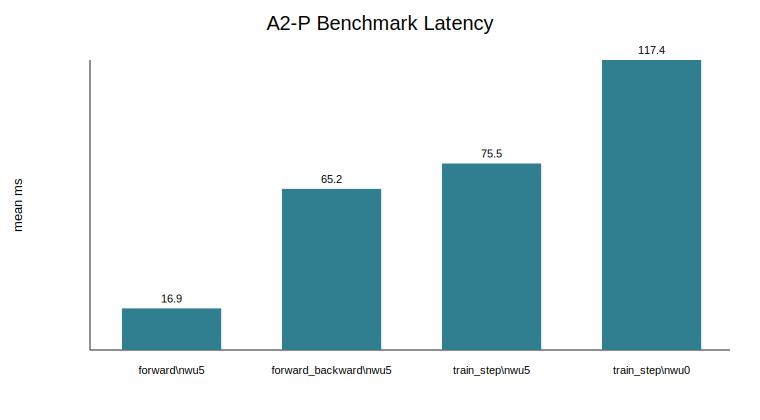
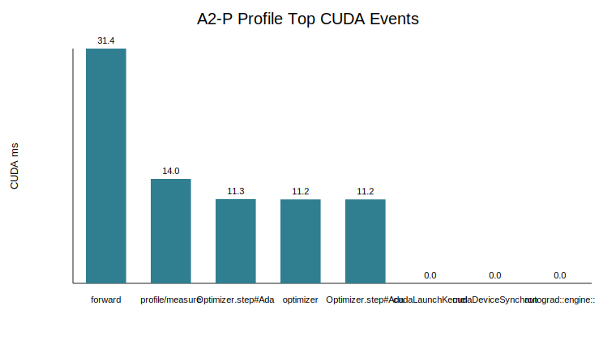
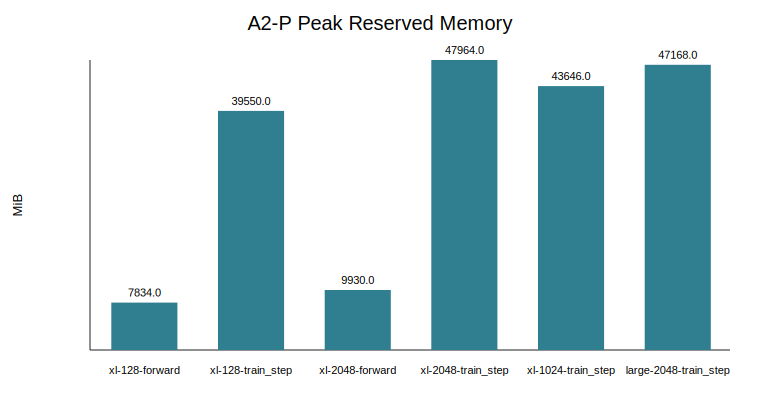

# A2-P 公开提交：何思洋

> 本文件和同目录代码、汇总、图片公开可见。大型 profiler trace 与 memory snapshot 只保留在本地
> `../assignment2-systems/local_results/a2p/`，没有进入 GitHub 提交目录。

> 正式要求见
> [`assignments/A2-P/README.md`](../../../../assignments/A2-P/README.md)，评分说明见
> [`assignments/A2-P/EVALUATION.md`](../../../../assignments/A2-P/EVALUATION.md)。

## 基本信息

- 作业题面版本：`26.1.4-rc.3`
- 完成范围：End-to-End Benchmark、Compute Profiling、Mixed Precision、Memory Profiling
- 未完成项：飞书补充文档链接待补充；memory visualizer 的原始 snapshot 未提交，仅提交轻量峰值表和公开图
- 上游 starter commit：`ca8bc81a59b70516f7ebb2da4808daade877c736`
- 本地工作仓库：`../assignment2-systems`

## 环境与工具

| 项目 | 公开、脱敏的信息 |
| --- | --- |
| GPU | NVIDIA GeForce RTX 4090，`49140 MiB` total，开跑前约 `48507 MiB` free |
| Driver / CUDA | Driver `570.195.03`，CUDA runtime `12.6` |
| PyTorch | `2.11.0+cu126` |
| Compute profiler | `torch.profiler`，CPU/CUDA activities，Chrome trace 本地保留 |
| 其他限制 | `uv` 不在当前 PATH；使用 `../assignment1-basics/.venv/bin/python` 运行 |

## 1. End-to-End Benchmark

### 复现命令与计时方法

统一配置为 small 模型、batch size 4、context length 512、FP32、seed 2026。输入、模型和
optimizer 在计时区间外构造；每个 CUDA step 后调用 `torch.cuda.synchronize()`；正式测量前
调用 `torch.cuda.reset_peak_memory_stats()`。

示例命令：

```bash
../assignment1-basics/.venv/bin/python profiling/benchmark.py \
  --model-size small --batch-size 4 --context-length 512 --dtype fp32 \
  --mode train_step --warmup 5 --steps 10 \
  --output local_results/a2p/benchmark.csv
```

### 结果

完整 raw timings 在 [`results/benchmark.csv`](results/benchmark.csv)。

| mode | warm-up | mean ms | std ms | CV | p50 ms | peak reserved MiB |
| --- | ---: | ---: | ---: | ---: | ---: | ---: |
| forward | 5 | 16.85 | 0.67 | 0.040 | 16.80 | 974 |
| forward_backward | 5 | 65.21 | 5.76 | 0.088 | 62.68 | 4268 |
| train_step | 5 | 75.49 | 4.42 | 0.059 | 74.13 | 5384 |
| train_step | 0 | 117.41 | 134.16 | 1.143 | 74.28 | 5288 |



### 分析

`forward_backward` 比 forward 增加了 loss 和反向图遍历，峰值显存从 974 MiB 增至 4268 MiB。
`train_step` 继续加入 AdamW optimizer state 和参数更新，峰值 reserved 到 5384 MiB。warm-up
为 0 时第一步包含 CUDA 初始化、kernel autotuning/cache 以及 allocator 扩张，导致均值和 CV
显著变差；p50 与 warm-up 5 的 p50 接近，说明主要异常集中在前几个 step。

## 2. Compute Profiling

### 六个 `train_step` trace 与命令

使用 `torch.profiler` 跑 2 个模型规模和 3 个 context，全部是完整 `train_step`，batch size 1，
FP32，warm-up 3，只捕获一个稳定 measurement step。

| run | model | context | tool | dtype |
| --- | --- | ---: | --- | --- |
| small_256 | small | 256 | torch.profiler | fp32 |
| small_512 | small | 512 | torch.profiler | fp32 |
| small_1024 | small | 1024 | torch.profiler | fp32 |
| medium_256 | medium | 256 | torch.profiler | fp32 |
| medium_512 | medium | 512 | torch.profiler | fp32 |
| medium_1024 | medium | 1024 | torch.profiler | fp32 |

脚本在 `profile/warmup`、`profile/measure`、`forward`、`backward`、`optimizer`、
`attention/scores`、`attention/softmax`、`attention/value` 上打了 profiler range。完整事件汇总在
[`results/profile/trace_summary.csv`](results/profile/trace_summary.csv)，metadata 在
[`results/profile/run_metadata.json`](results/profile/run_metadata.json)。



### Kernel、Calls 与时间线

代表性配置 `medium_1024` 中，`attention/scores` 有 24 次 calls，累计 CUDA 时间约 7.47 ms；
`attention/softmax` 与 `attention/value` 也出现在同一 run 的 trace summary 中。主要底层事件包括
`aten::bmm`、AdamW optimizer step、各类 autograd backward event 和 CUDA kernel launch。由于
本实现使用显式 PyTorch attention，score matrix、softmax 和 value projection 分别形成可见阶段，
而不是单个 fused attention kernel。

### 工具边界

本次选择 `torch.profiler` 而不是 Nsight Systems。它提供 PyTorch op、CUDA activity、recorded
range、shape 和 memory 视角，并导出了 Chrome trace 到本地；它不提供 nsys 那种 CUDA API 到
GPU kernel 的系统级关联报告，所以报告里没有伪造 nsys 专属字段。

## 3. Mixed Precision

### 四种累加实验

实际输出见 [`results/mixed_precision.json`](results/mixed_precision.json)。

| case | value |
| --- | ---: |
| fp32 input + fp32 sum | 1000.0000 |
| fp16 input + fp16 sum | 1000.0000 |
| fp16 input + fp32 sum | 999.7559 |
| fp32 input cast to fp16 + fp16 sum | 1000.0000 |

`fp16_input_fp32_sum` 暴露的是输入先量化后的表示误差：`0.1` 不能被 FP16 精确表示，即使用 FP32
累加也会保留输入误差。低精度累加器的误差还取决于 reduction 顺序、向量长度和硬件 kernel
实现；这里不能只用最终数值判断所有场景下 FP16 accumulation 都安全。

### FP32 与 BF16 autocast

ToyModel 使用 CUDA BF16 autocast。参数和梯度保持 FP32；BF16 autocast 下第一层输出和 logits
为 BF16，LayerNorm 与 loss 为 FP32。

| dtype | mean ms | p50 ms | peak reserved MiB | dtype observations |
| --- | ---: | ---: | ---: | --- |
| fp32 | 5.36 | 0.89 | 22 | parameters/output/loss/grad all FP32 |
| bf16 autocast | 4.06 | 1.20 | 22 | first layer/logits BF16，LayerNorm/loss/grad FP32 |

BF16 保留了较大的动态范围，适合 Tensor Core 路径；LayerNorm 和 loss 保持 FP32 有助于稳定
reduction。这个 ToyModel 很小，计时受启动和调度噪声影响明显，因此显存差异不大。

## 4. Memory Profiling

### 配置、峰值与 fallback

峰值表在 [`results/memory/peaks.csv`](results/memory/peaks.csv)，metadata 在
[`results/memory/run_metadata.json`](results/memory/run_metadata.json)。memory snapshot pickle
只保留本地，未提交。

| model | context | mode | status | peak allocated MiB | peak reserved MiB |
| --- | ---: | --- | --- | ---: | ---: |
| xl | 128 | forward | ok | 7826 | 7834 |
| xl | 128 | train_step | ok | 39037 | 39550 |
| xl | 2048 | forward | ok | 9492 | 9930 |
| xl | 2048 | train_step | oom | 47620 | 47964 |
| xl | 1024 | train_step | ok | 42288 | 43646 |
| large | 2048 | train_step | ok | 46434 | 47168 |



XL/context 2048 的完整 train step 在约 47.96 GiB reserved 时 OOM。按题面 fallback 顺序继续跑了
XL/context 1024 train_step 和 Large/context 2048 train_step，二者均成功。

### Timeline、allocation 与 residual/gradient


forward-only 主要保留参数、输入、activation 和 logits；train_step 额外需要 autograd saved
tensors、gradients、AdamW optimizer state 和更新过程中的临时张量，因此 XL/context 128 从约
7.8 GiB reserved 增至约 39.6 GiB。residual stream 理论大小近似为
`batch * context * d_model * bytes_per_element`；XL FP32 在 context 2048 下单个 residual stream
约 `1 * 2048 * 1600 * 4 = 12.5 MiB`，多层 saved residual、attention 中间量和 optimizer state
共同决定峰值，而不是单个 residual tensor。

## 5. 限制与复现

- 代码同步命令：`python3 scripts/sync_a2p_submission.py --name '何思洋'`
- 轻量结果目录：`results/`
- 未提交的本地大型原始文件：Chrome trace JSON 与 memory snapshot pickle，仅保留在
  `../assignment2-systems/local_results/a2p/`
- 已知限制：没有提交 memory visualizer 原始 snapshot；飞书补充文档链接待补充
- 最小复现步骤：

```bash
cd ../assignment2-systems
../assignment1-basics/.venv/bin/python profiling/benchmark.py --model-size small --batch-size 4 --context-length 512 --dtype fp32 --mode train_step --warmup 5 --steps 10 --output local_results/a2p/benchmark.csv
../assignment1-basics/.venv/bin/python profiling/nvtx_ranges.py --model-size medium --batch-size 1 --context-length 1024 --dtype fp32 --warmup 3 --output local_results/a2p/profile/medium_1024.json --trace-output local_results/a2p/profile/medium_1024_trace.json
../assignment1-basics/.venv/bin/python profiling/memory_snapshot.py --model-size xl --batch-size 1 --context-length 128 --dtype fp32 --mode train_step --warmup 2 --output local_results/a2p/memory/peaks.csv --snapshot-output local_results/a2p/memory/xl_128_train_step_snapshot.pickle
```

## 飞书补充文档

- 链接：https://fudan-nlp.feishu.cn/wiki/GMwBwM57xi9xDrkshtNcsqXznqd

该文档应设置为组织内公开，不开启互联网公开访问，只保存不能公开到 GitHub 但确有审核必要的
最小差量材料。

## 自检

- [x] 本 PR 只包含我本人本次 A2-P 的文件。
- [x] `README.md` 是 Markdown 主报告，所有图片使用相对路径和有意义的 alt text。
- [x] 每个关键数字都能回到命令、`results/` 或 metadata。
- [x] 已用 `torch.profiler` 完成六个 `train_step` trace，并提交轻量汇总。
- [x] 已提交 1 张 Compute Profile 关键图和至少 2 张 Memory/Benchmark 相关公开图。
- [x] `results/` 与 `assets/` 公开附件合计不超过 2 MiB。
- [x] 未提交 `.nsys-rep`、snapshot、完整 trace、权重、数据、压缩包或依赖环境。
- [x] GitHub 内容不含内部主机名、IP、账号、UUID、进程或凭据。
- [ ] 飞书补充文档链接待补充。
