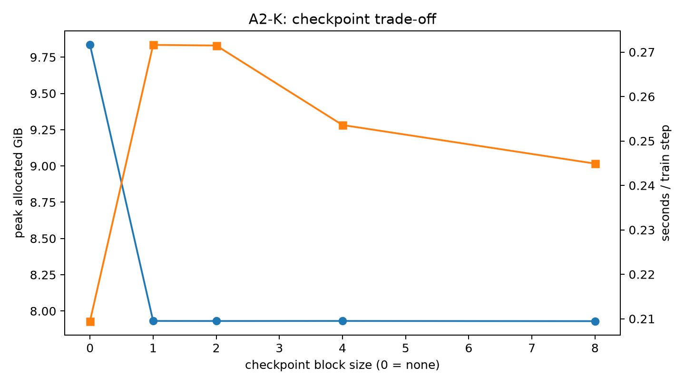
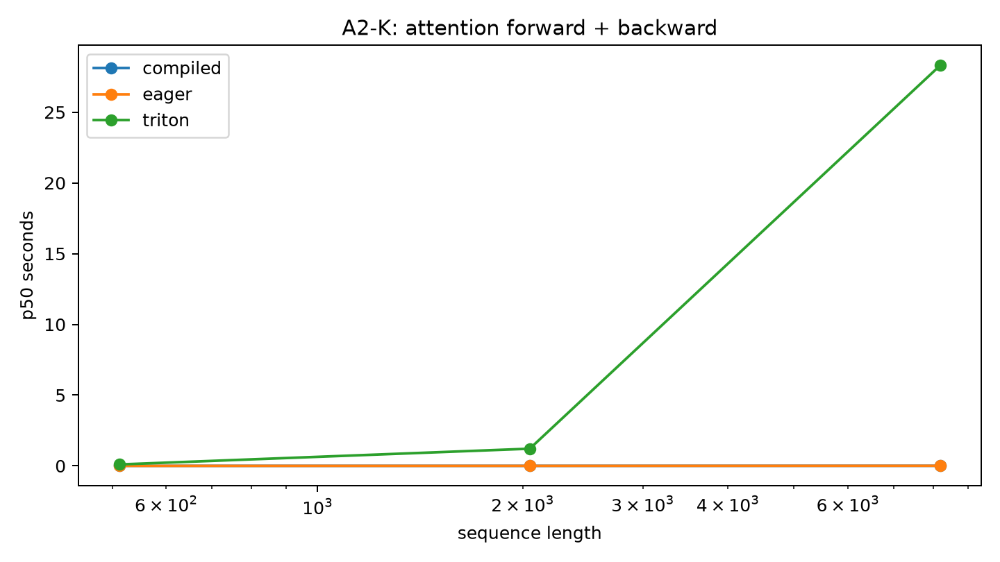

# A2-K：单卡显存优化与 GPU 内核

## 基本信息

- 姓名：刘子源
- 作业：A2-K
- 报告格式：Markdown
- 结果目录：`results/`
- 图片目录：`assets/`

## 题面版本、起始代码与完成状态

- 固定 starter commit：`ca8bc81a59b70516f7ebb2da4808daade877c736`
- 题面版本：`26.1.4-k-rc.3`；原版 PDF 版本：`26.1.3`
- 完成状态：checkpoint、显式 attention、compile、FlashAttention 正确性、核心性能矩阵和 16384 边界矩阵均已完成。
- 未完成项：没有使用 4090；所有正式数字均来自 RTX 3090，并已在本报告中披露。

环境状态：RTX 3090 24GB；驱动版本 560.28.03；CUDA 12.6；PyTorch 2.7.1+cu126；Triton 3.3.1；TF32=false；分配器上限 23552 MiB。

## 环境与偏离说明

本作业原计划使用 RTX 4090。由于 4090 分区长期没有空闲卡，全部 A2-K 正式实验改在单张 RTX 3090 24GB 上完成。该硬件偏离会影响延迟和吞吐数值，但不改变正确性、显存趋势和实现验证；所有表格和图均明确对应以下环境。

`NVIDIA GeForce RTX 3090; CUDA 12.6; PyTorch 2.7.1+cu126; Triton 3.3.1`

每个正式配置在独立 Python 进程中串行运行，并在首次 CUDA 分配前设置 23552 MiB 的 PyTorch 分配器上限。

## Checkpoint 理论与代码骨架

把连续 Transformer block 按固定 block size 分组时，只保存每组边界 activation；反向传播到某组时重新计算组内 forward。无 checkpoint 时峰值 activation 随层数近似线性增长；分组后保存量接近边界数量，但计算量增加一轮重算。实际最佳 block size 还受 attention 二次项、分配器保留和内核工作区影响。

```text
h = embedding(tokens)
for each block in layer_groups:
    h = checkpoint(block, h)  # 只保留组边界，反向时重新计算组内层
logits = lm_head(final_norm(h))
loss(logits, labels).backward()
```

## 激活检查点实验

| 上下文长度 | block size | 状态 | 单步均值（秒） | 分配峰值（GiB） | 来源 |
|---|---|---|---|---|---|
| 1024 | 0 | ok | 0.20946 | 9.8346 | results/checkpointing.csv |
| 1024 | 1 | ok | 0.27161 | 7.9315 | results/checkpointing.csv |
| 1024 | 2 | ok | 0.27147 | 7.9311 | results/checkpointing.csv |
| 1024 | 4 | ok | 0.25358 | 7.9315 | results/checkpointing.csv |
| 1024 | 8 | ok | 0.2449 | 7.9302 | results/checkpointing.csv |
| 2048 | 0 | ok | 0.50729 | 19.207 | results/checkpointing.csv |
| 2048 | 1 | ok | 0.64353 | 7.9544 | results/checkpointing.csv |

Checkpointing 不会保存所有 block activation；反向传播时会重新计算每个 checkpoint 区域。因此，较小的 activation 保存显存是以更长的训练步时间换来的。



## FlashAttention 正确性

| 实现 | 用例数 | 最大 O/LSE/dQ/dK/dV 误差 | 状态 |
|---|---|---|---|
| tiled_pytorch | 18 | 1.1921e-06 | pass |
| triton | 18 | 0.0028498 | pass |

PyTorch 分块参考实现和 Triton 前向实现都维护 FP32 的 online softmax 状态，并且每个 query 行只保存 LSE。梯度使用三个随机种子、维度 32/64/128 以及 causal/non-causal 模式，与显式参考实现进行验证。

## Attention 与 compile 性能

| 实现 | 序列长度 | 维度 | 阶段 | p50（秒） | 分配峰值（GiB） | 状态 |
|---|---|---|---|---|---|---|
| compiled | 2048 | 128 | backward | 0.00049131 | 0.033327 | ok |
| compiled | 2048 | 128 | forward | 0.00021791 | 0.023072 | ok |
| compiled | 2048 | 128 | forward_backward | 0.0011051 | 0.032351 | ok |
| compiled | 2048 | 64 | backward | 0.00052853 | 0.030397 | ok |
| compiled | 2048 | 64 | forward | 0.00019231 | 0.021363 | ok |
| compiled | 2048 | 64 | forward_backward | 0.00079106 | 0.029909 | ok |
| compiled | 512 | 128 | backward | 0.00043737 | 0.010622 | ok |
| compiled | 512 | 128 | forward | 0.00017913 | 0.0095224 | ok |
| compiled | 512 | 128 | forward_backward | 0.00082526 | 0.010378 | ok |
| compiled | 512 | 64 | backward | 0.00044398 | 0.0098896 | ok |
| compiled | 512 | 64 | forward | 0.00019137 | 0.0090952 | ok |
| compiled | 512 | 64 | forward_backward | 0.0010652 | 0.0097675 | ok |
| compiled | 8192 | 128 | backward | 0.0022547 | 0.34387 | ok |
| compiled | 8192 | 128 | forward | 0.0011295 | 0.20911 | ok |
| compiled | 8192 | 128 | forward_backward | 0.0030595 | 0.33997 | ok |
| compiled | 8192 | 64 | backward | 0.0017406 | 0.33216 | ok |
| compiled | 8192 | 64 | forward | 0.00087378 | 0.20227 | ok |
| compiled | 8192 | 64 | forward_backward | 0.0024278 | 0.3302 | ok |
| eager | 2048 | 128 | backward | 0.00064196 | 0.054444 | ok |
| eager | 2048 | 128 | forward | 0.00024206 | 0.029419 | ok |
| eager | 2048 | 128 | forward_backward | 0.0008893 | 0.053468 | ok |
| eager | 2048 | 64 | backward | 0.00065047 | 0.052735 | ok |
| eager | 2048 | 64 | forward | 0.00022598 | 0.028442 | ok |
| eager | 2048 | 64 | forward_backward | 0.00092907 | 0.052247 | ok |
| eager | 512 | 128 | backward | 0.00063088 | 0.018922 | ok |
| eager | 512 | 128 | forward | 0.00018534 | 0.0096436 | ok |
| eager | 512 | 128 | forward_backward | 0.0008891 | 0.018678 | ok |
| eager | 512 | 64 | backward | 0.00062735 | 0.018495 | ok |
| eager | 512 | 64 | forward | 0.00018258 | 0.0093994 | ok |
| eager | 512 | 64 | forward_backward | 0.00089829 | 0.018373 | ok |
| eager | 8192 | 128 | backward | 0.0036 | 0.59204 | ok |
| eager | 8192 | 128 | forward | 0.0025955 | 0.32825 | ok |
| eager | 8192 | 128 | forward_backward | 0.0058924 | 0.58814 | ok |
| eager | 8192 | 64 | backward | 0.0032765 | 0.58521 | ok |
| eager | 8192 | 64 | forward | 0.0023614 | 0.32434 | ok |
| eager | 8192 | 64 | forward_backward | 0.005162 | 0.58325 | ok |
| triton | 2048 | 128 | backward | 1.6748 | 0.11474 | ok |
| triton | 2048 | 128 | forward | 0.0002129 | 0.0019608 | ok |
| triton | 2048 | 128 | forward_backward | 1.2138 | 0.11327 | ok |
| triton | 2048 | 64 | backward | 1.6582 | 0.07987 | ok |
| triton | 2048 | 64 | forward | 0.00017015 | 0.00098419 | ok |
| triton | 2048 | 64 | forward_backward | 1.6661 | 0.079138 | ok |
| triton | 512 | 128 | backward | 0.10006 | 0.015837 | ok |
| triton | 512 | 128 | forward | 0.00011765 | 0.00049019 | ok |
| triton | 512 | 128 | forward_backward | 0.10073 | 0.015471 | ok |
| triton | 512 | 64 | backward | 0.101 | 0.013014 | ok |
| triton | 512 | 64 | forward | 0.0001098 | 0.00024605 | ok |
| triton | 512 | 64 | forward_backward | 0.10196 | 0.012831 | ok |
| triton | 8192 | 128 | backward | 28.287 | 1.6309 | ok |
| triton | 8192 | 128 | forward | 0.0012868 | 0.007843 | ok |
| triton | 8192 | 128 | forward_backward | 28.306 | 1.6251 | ok |
| triton | 8192 | 64 | backward | 28.466 | 1.1163 | ok |
| triton | 8192 | 64 | forward | 0.00066919 | 0.0039368 | ok |
| triton | 8192 | 64 | forward_backward | 28.195 | 1.1134 | ok |
| compiled | 2048 | 128 | forward | 1.3965 | 0.021607 | ok |
| compiled | 512 | 64 | forward | 1.3842 | 0.0089121 | ok |
| compiled | 8192 | 128 | forward | 1.3707 | 0.20325 | ok |



长序列结果以及 OOM/compile 失败行都保留在 `results/` 中，没有静默删除。`results/unit_tests.txt` 保存 GPU 单元测试结果。最终提交中没有包含缓存、trace、二进制文件、模型权重、内部主机名或凭据。

## PyTorch Attention 与 torch.compile

显式 eager attention、compiled attention 和 Triton 实现使用同一批输入、dtype、causal 设置和 CUDA 同步边界。冷启动编译与稳定态结果分别保存于 `results/compile_comparison.csv`。

## FlashAttention-2 前向

Triton 内核使用 query/key 分块、FP32 online softmax、causal mask，并保存每个 query 行的 LSE；PyTorch 分块版本用于独立参考校验。

## FlashAttention-2 反向

两条 autograd 路径都通过重计算得到 dQ、dK、dV，并与显式 PyTorch reference 对比；最大误差和每个用例的状态位于 `results/correctness.json`。

## 正确性与性能矩阵

`results/unit_tests.txt` 保存官方 GPU 测试输出，`results/flash_benchmark.csv` 保存 512/2048/8192 核心矩阵和 16384 边界矩阵；OOM 或 compile 失败行按原状态保留。

## 复现命令

```bash
PYTHONPATH=. python submission/student_scripts/a2k/a2_runner.py correctness --sequence-length 128 --seeds 0 1 2 --dimensions 32 64 128 --output results/correctness.json
PYTHONPATH=. python submission/student_scripts/a2k/a2_artifacts.py --source a2_output/a2k --results results --assets assets --kind a2k
```

## 飞书补充文档

- 链接：https://fudan-nlp.feishu.cn/wiki/Rorbw8wKNi2W9jkCVIYcmzounbh?from=from_copylink

## 自检

- [x] checkpoint、attention、compile、正确性和长序列边界结果已整理。
- [x] 官方 GPU 测试结果为 6 项通过。
- [x] 报告已披露使用 RTX 3090 替代 RTX 4090 的硬件偏离。
- [x] 未提交 trace、缓存、二进制、模型权重、内部信息或凭据。

## compile 结果解释

冷启动编译行使用零次 warm-up 和一次测量调用；稳定态行使用配置的 warm-up 和重复测量。比较结果需要结合 shape specialization 和编译缓存的影响来解释。轻量公开汇总没有采集 graph-break 诊断信息，这是本实验的已知限制。

## 测量限制

attention 计时使用 CUDA 同步的 `perf_counter`，配置为 5 次 warm-up 和 10 次重复测量，没有采用题面示例中的 `do_bench(100, 300)` 设置。该偏差已在报告中披露，本文不宣称跨硬件 speedup。
