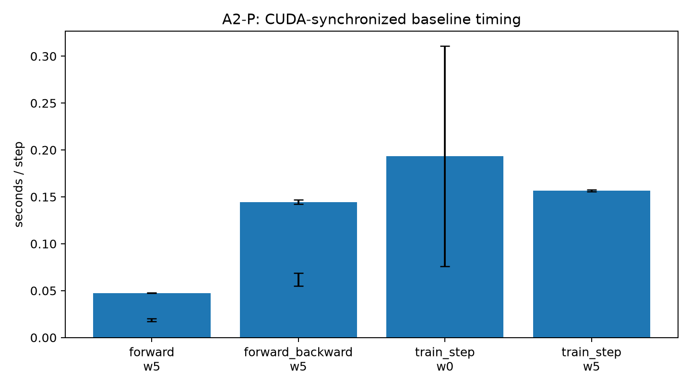
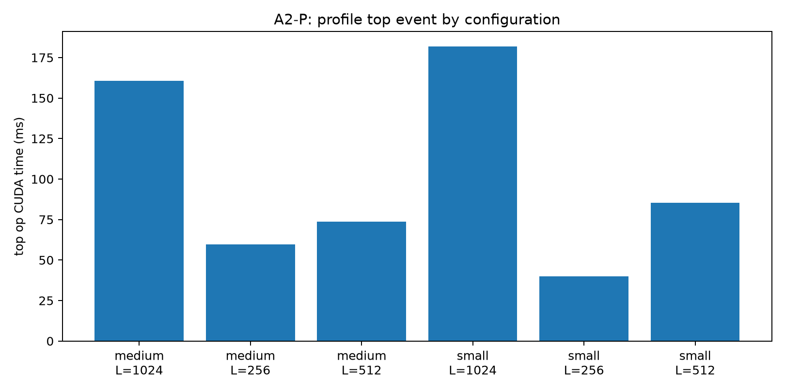
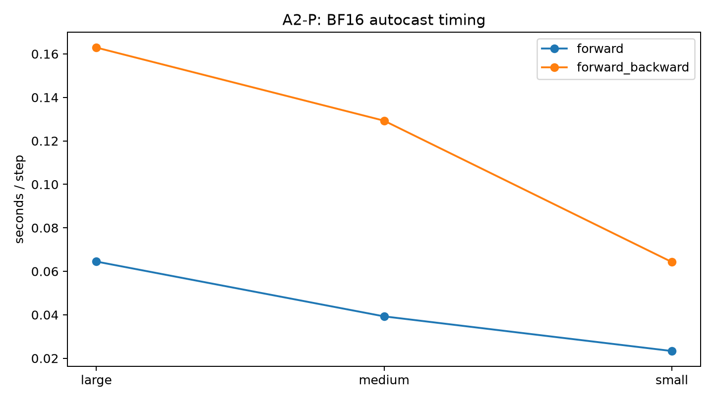
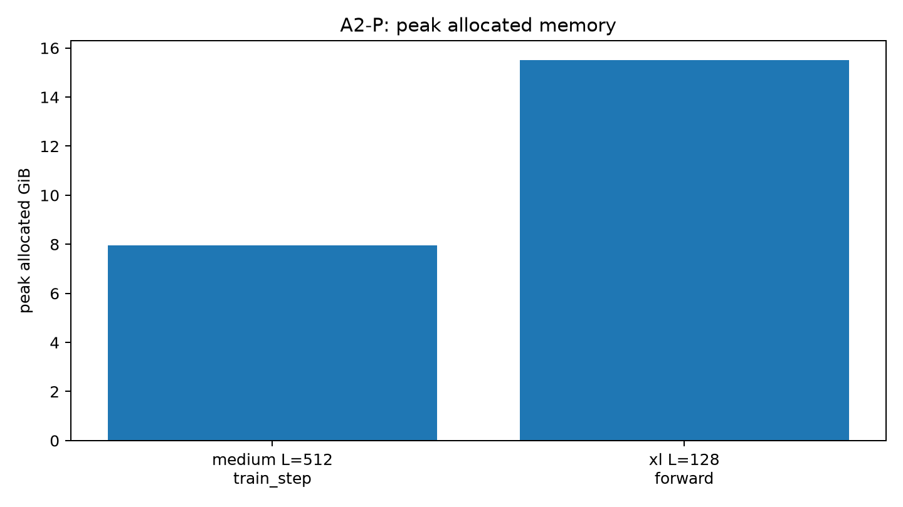
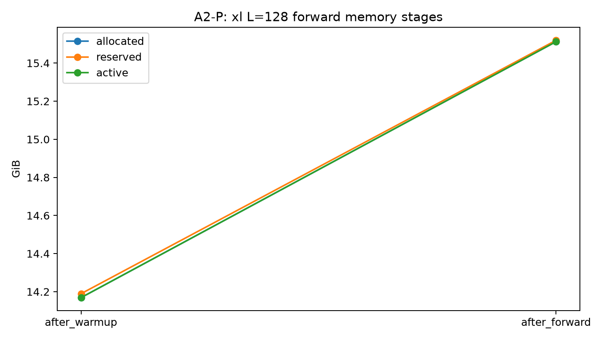
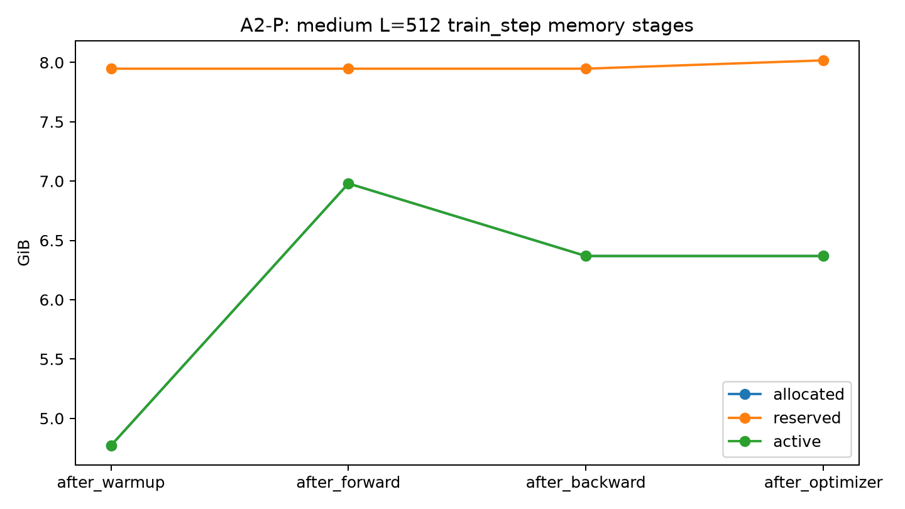

# A2-P：Profiling 与性能分析

## 基本信息

- 姓名：刘子源
- 作业：A2-P
- 报告格式：Markdown
- 结果目录：`results/`
- 图片目录：`assets/`

## 题面版本与完成状态

- 固定 starter commit：`ca8bc81a59b70516f7ebb2da4808daade877c736`
- 题面版本：`26.1.4-rc.3`；原版 PDF 版本：`26.1.3`
- 完成状态：benchmark、compute profiling、mixed precision 和 memory profiling 均已完成。
- 未完成项：未上传完整 nsys/Perfetto trace；XL/1024 fallback 进程未成功初始化 CUDA，Large/2048 fallback 已保留 OOM 行；本报告采用题面允许的 `torch.profiler` 轻量汇总。

环境状态：RTX 3090 24GB；驱动版本 560.28.03；Python 3.13；CUDA 12.6；PyTorch 2.7.1+cu126；Triton 3.3.1；使用 `torch.profiler`；TF32=false。

## 完成范围与环境

本报告对应本地 `assignment2-systems` 工作目录和结果目录中的轻量 JSON/CSV。所有 A2-P 正式测量来自单张 RTX 3090；GPU、CUDA 和库版本如下。

`NVIDIA GeForce RTX 3090; CUDA 12.6; PyTorch 2.7.1+cu126; Triton 3.3.1`

每次被测 CUDA step 在开始和结束处同步；初始化和随机数据创建不计入步耗时。每个 benchmark JSON 保留 raw timing、样本标准差和 CV。

## 端到端 benchmark

| 模式 | warm-up | 均值（秒） | 样本标准差（秒） | CV | 状态 | 来源 |
|---|---|---|---|---|---|---|
| forward | 5 | 0.047541 | 0.00014625 | 0.0030763 | ok | results/benchmark.csv |
| forward_backward | 5 | 0.14459 | 0.0021022 | 0.014539 | ok | results/benchmark.csv |
| train_step | 0 | 0.19353 | 0.11743 | 0.60677 | ok | results/benchmark.csv |
| train_step | 5 | 0.15654 | 0.00088792 | 0.0056722 | ok | results/benchmark.csv |



未 warm-up 的 train step 与稳态测量分开记录；首轮会额外包含 CUDA context、allocator 和 kernel 选择等冷启动开销，因此不能与充分 warm-up 的均值混为一谈。

## 计算性能分析

共完成两个模型规模、三个 context length 的 6 个完整 train-step profile。每个 profile 包含 `profile/measure`、`forward`、`backward`、`optimizer` 与 attention 的 score / softmax / value 标记；完整 trace 未进入提交目录。
| 模型 | batch | 上下文长度 | 主要 CUDA 操作 | CUDA 总时间（微秒） | 来源 |
|---|---|---|---|---|---|
| medium | 1 | 1024 | aten::bmm | 1.6076e+05 | results/profile/trace_summary.csv |
| medium | 1 | 256 | profile/measure | 59634 | results/profile/trace_summary.csv |
| medium | 1 | 512 | profile/measure | 73661 | results/profile/trace_summary.csv |
| small | 4 | 1024 | aten::bmm | 1.819e+05 | results/profile/trace_summary.csv |
| small | 4 | 256 | aten::bmm | 39858 | results/profile/trace_summary.csv |
| small | 4 | 512 | aten::bmm | 85311 | results/profile/trace_summary.csv |



## 混合精度

ToyModel 与固定累加实验保存在 `results/mixed_precision.json`。BF16 autocast 保持参数和梯度为 FP32，而矩阵乘输出可为 BF16；LayerNorm / loss 等数值敏感归约保持 FP32。



## FP32/BF16 benchmark 对照表

以下对照使用 batch 1、context 512，专门用于观察 dtype 趋势，不与 batch 4 的统一 baseline 混淆。

| 模型 | 模式 | dtype | 均值（秒） | 分配峰值（GiB） | 状态 |
|---|---|---|---:|---:|---|
| large | forward_backward | bfloat16 | 0.16292440444231032 | 8.3916 | ok |
| large | forward | bfloat16 | 0.06450123842805625 | 8.3066 | ok |
| large | forward_backward | float32 | 0.24770722799003125 | 7.9603 | ok |
| large | forward | float32 | 0.07896804176270962 | 7.8273 | ok |
| medium | forward_backward | bfloat16 | 0.12928120233118534 | 3.9021 | ok |
| medium | forward | bfloat16 | 0.03928010314702988 | 3.8472 | ok |
| medium | forward_backward | float32 | 0.12690901551395656 | 3.8857 | ok |
| medium | forward | float32 | 0.042177370935678485 | 3.7957 | ok |
| small | forward_backward | bfloat16 | 0.0642793046310544 | 1.3647 | ok |
| small | forward | bfloat16 | 0.023342190869152547 | 1.3381 | ok |
| small | forward_backward | float32 | 0.061949165910482405 | 1.4171 | ok |
| small | forward | float32 | 0.018600510060787202 | 1.362 | ok |

## 显存分析

| 模型 | 上下文长度 | 模式 | 状态 | 分配峰值（GiB） | 保留峰值（GiB） | 来源 |
|---|---|---|---|---|---|---|
| medium | 512 | train_step | ok | 7.9466 | 8.0176 | results/memory/peaks.csv |
| xl | 128 | forward | ok | 15.512 | 15.52 | results/memory/peaks.csv |
| xl | 128 | train_step | oom | 23.094 | 23.268 | results/memory/peaks.csv |
| xl | 2048 | forward | oom | 22.9 | 23.008 | results/memory/peaks.csv |
| xl | 2048 | train_step | oom | 22.9 | 23.008 | results/memory/peaks.csv |

XL / context 2048 及 XL 的训练步在 24GB GPU 上发生 OOM，保留了失败行和峰值，而没有用缩小 shape 替换。为提供完整的阶段轨迹，另运行并明确标记了 medium / 512 / train-step fallback。







## 可复现性与文件边界

原始轻量结果位于 `results/`；图片位于 `assets/`。未提交 trace、snapshot、模型权重、数据集、缓存、内部路径、账号或凭据。

## 复现命令

下面是结果生成器使用的相对路径示例；正式运行时需要在对应 GPU 节点设置 CUDA 环境：

```bash
PYTHONPATH=. python submission/profiling/a2_runner.py model --model-size small --batch-size 4 --context-length 512 --mode train_step --warmup 5 --steps 10 --output results/benchmark.json
PYTHONPATH=. python submission/profiling/a2_runner.py profile --model-size small --batch-size 4 --context-length 512 --warmup 5 --output results/profile.json
PYTHONPATH=. python submission/profiling/a2_artifacts.py --source a2_output/a2p --results results --assets assets --kind a2p
```

## 飞书补充文档

- 链接：https://fudan-nlp.feishu.cn/wiki/Rorbw8wKNi2W9jkCVIYcmzounbh?from=from_copylink

## 自检

- [x] 三种 benchmark 模式、warm-up、CUDA 同步和原始计时已记录。
- [x] 六个性能分析配置已完成，提交目录不含完整 trace。
- [x] 混合精度、显存峰值、fallback 和 OOM 行已保留。
- [x] 结果和图片体积受控，未包含内部路径、凭据、权重或缓存。

## 显存结果解释

residual stream 在 FP32 下的理论大小为 `batch × context × d_model × 4` 字节。实际峰值还包括 Q/K/V、attention scores、softmax、FFN 中间量、梯度和分配器保留显存。显存 CSV 与阶段时间线分别展示这些因素；XL 的 OOM 行只作为边界证据，不用于计算 speedup。
