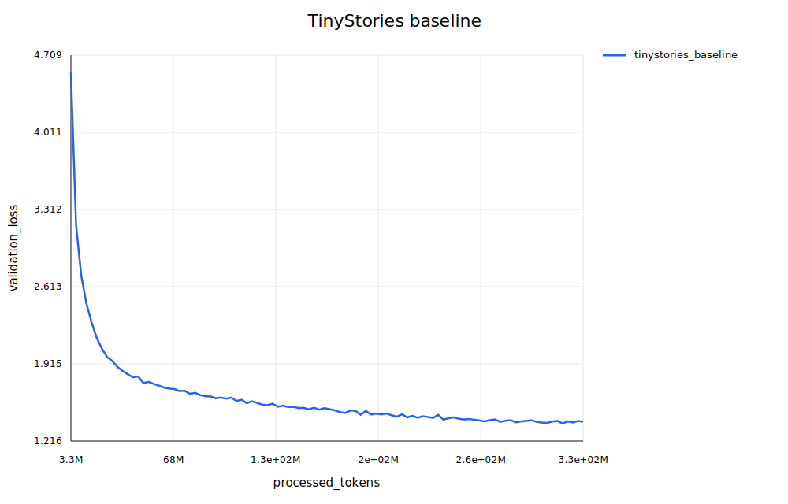
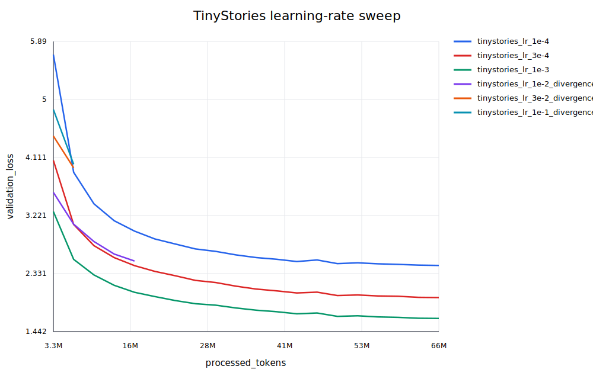
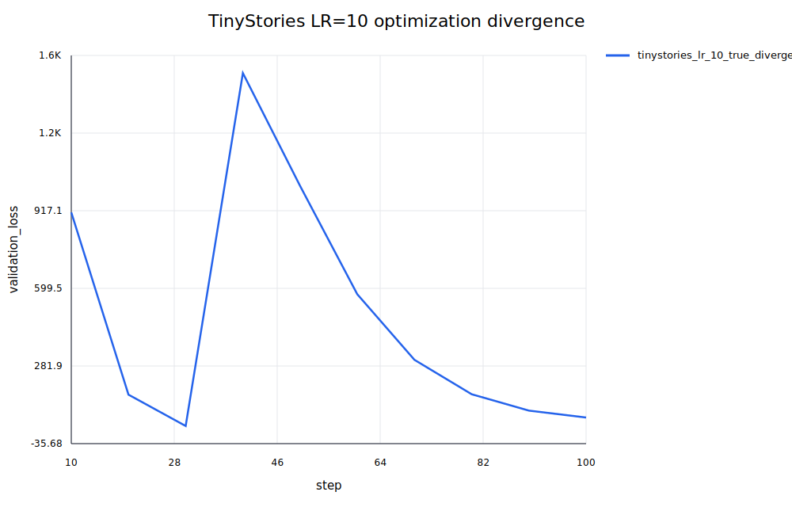
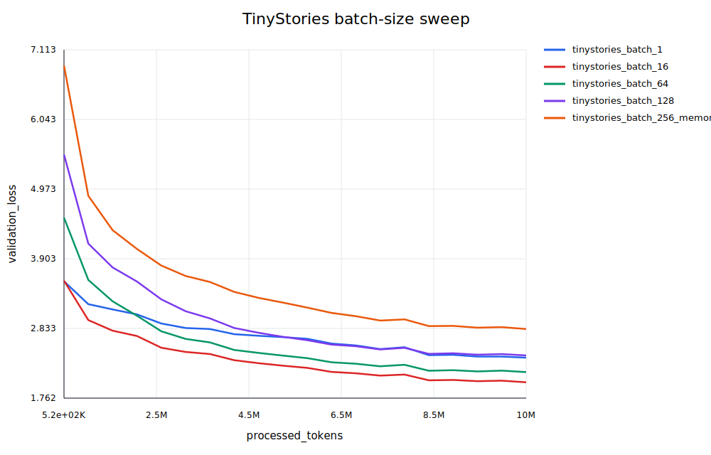
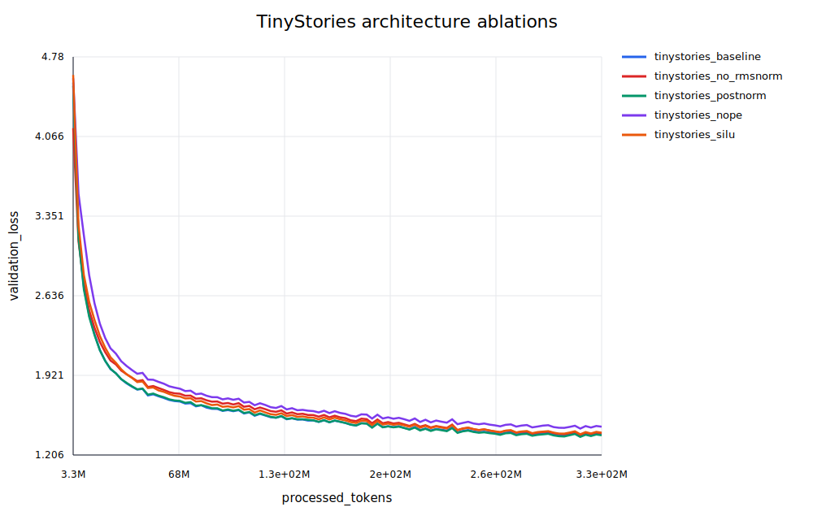
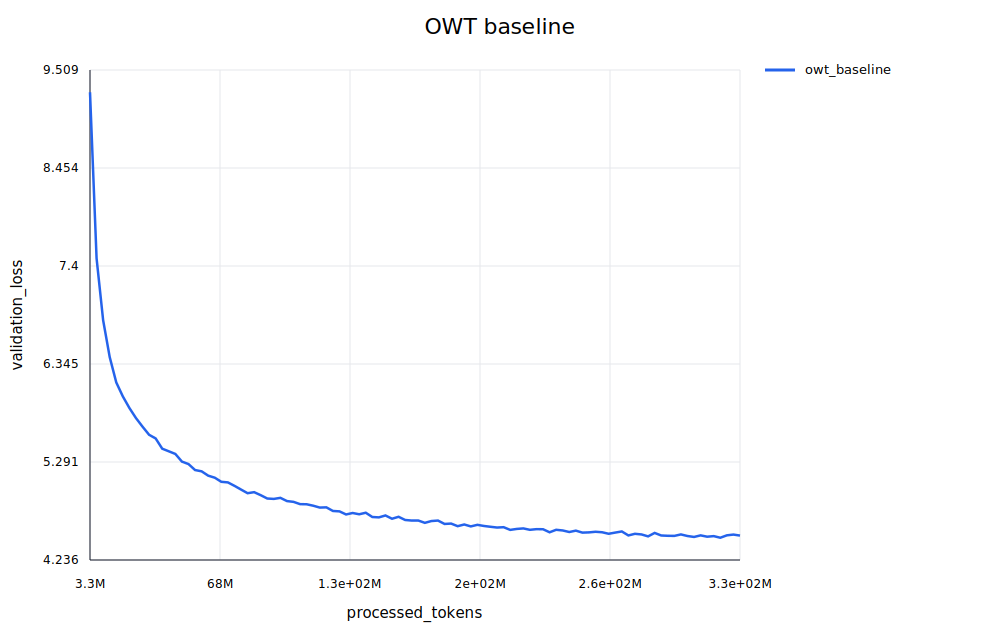

# A1 公开提交：吴乾奕

> 本报告、代码、脚本、配置和日志均按公开仓库规则脱敏。数据集、token 数组、模型权重、虚拟环境、主机名、内部绝对路径和凭据不在本目录中。

## 1. 基本信息与完成范围

- 作业题面版本：26.0.3
- 上游 starter commit：`a158843b20107949f1a8d7df1b05cd33b9166712`
- 完成范围：从零实现 byte-level BPE tokenizer、流式编码、Transformer LM、attention/RoPE、cross-entropy、AdamW、学习率调度、梯度裁剪、checkpoint/resume、训练/验证、采样生成和实验脚本；完成 TinyStories/OWT tokenizer、数据编码、TinyStories LR 与 batch sweep、真实 LM 发散诊断、四组架构消融、OWT 正式训练、评估和生成。
- 未完成项：无。初始 1e-2、3e-2、1e-1 probe 均正常完成，随后补充 `max_lr=10` 的诊断 run：一次 LR=10 更新后 train loss 从 9.263651 爆炸到 9263.390625，同时 gradient norm 变为非有限值，构成明确的 optimization divergence。由于 loss 本身仍为有限数，训练器最终记录为 `completed`；报告明确区分“程序状态”和“优化结果”。

代码和日志已经整理到本 A1 目录；最终分支、commit、push 和 PR 由本人执行。

## 2. From-scratch 实现说明

### 2.1 BPE tokenizer

词表从 256 个单 byte 开始，再加入 `<|endoftext|>` 和按频率合并产生的新 token。预分词使用题面指定的 GPT-2 风格 Unicode 正则；pair 只在同一 pre-token 内统计，不跨 pre-token 或 special-token 边界。实现用 `Counter`、受影响 word type 的反向索引和 lazy max-heap 增量维护 pair count；频率相同的 pair 按 bytes 字典序确定性决胜，因此不需要每轮扫描完整语料。

special token 先以 longest-match 分离，始终是单独 token，也是文档硬边界；左右两侧不能 merge。编码使用训练得到的 merge rank，不重新统计输入频率。解码先拼接 token bytes，再整体 UTF-8 decode，避免一个字符跨 token 时产生错误。`encode_iterable` 保留未决的 pre-token 和 partial special-token 前缀，因此 chunk 边界不会改变结果，也不会把整个语料载入内存。

### 2.2 Transformer 与 attention

模型输入为 `(B,T)` token IDs，输出 `(B,T,V)` logits，不在模型内部 softmax。核心模块均为自定义实现，没有使用 `nn.Linear`、`nn.Embedding`、`nn.RMSNorm`、`nn.LayerNorm`、`nn.MultiheadAttention`、`scaled_dot_product_attention`、`cross_entropy` 或 `torch.optim.AdamW`。

- Linear 权重形状为 `(d_out,d_in)`、无 bias；Embedding 直接索引自定义 Parameter。
- RMSNorm 在 float32 中计算平方均值和 rsqrt，再转回输入 dtype：$\operatorname{RMSNorm}(x)=x/\sqrt{\operatorname{mean}(x^2)+\epsilon}\odot g$。
- 默认 FFN 是 `SwiGLU(W2(SiLU(W1x) * W3x))`，TinyStories 使用 `d_ff=1344`；SiLU 消融使用未门控 FFN、`d_ff=2048`。
- RoPE 只旋转每个 head 的 Q/K，不旋转 V；sin/cos cache 是 non-persistent buffer。
- attention 使用 $\operatorname{softmax}(QK^T/\sqrt{d_k})V$，在 float32 中做稳定 softmax，先减最大值；mask 语义为 `True=允许查看`，causal mask 包含主对角线。
- 默认 block 是 Pre-Norm：`x + MHA(RMSNorm(x))`，再接 `z + FFN(RMSNorm(z))`，最后使用 RMSNorm 和 LM head。

### 2.3 Loss、优化器和训练循环

cross-entropy 使用稳定的 log-sum-exp：$\ell=\log\sum_j\exp(z_j-m)-(z_y-m)$，其中 $m=\max_jz_j$；低精度输入在 float32 中 reduction，perplexity 为 $\exp(\operatorname{mean\ loss})$。AdamW 保存 step、一阶矩和二阶矩，使用 bias correction，并以 $\theta_t=(1-\eta\lambda)\theta_{t-1}-\eta\hat m_t/(\sqrt{\hat v_t}+\epsilon)$ 实现 decoupled weight decay。学习率先线性 warmup，再按 cosine 从 max LR 降到 min LR；梯度裁剪先合并所有参数的 float32 L2 norm，再统一乘以 $\min(1,c/(\lVert g\rVert_2+10^{-6}))$。数据 loader 使用 `np.load(..., mmap_mode="r")`，随机抽取长度为 `T+1` 的窗口，输入和目标相差一位。

训练 checkpoint 除 model、optimizer 和 iteration 外，还保存 resolved config、best validation loss、processed tokens、wall-clock 和随机数状态。resume 会校验架构、数据、优化器、schedule、seed、dtype、batch 等不可安全改变的字段。训练日志使用 JSONL，记录 step、processed tokens、train/validation loss、LR、gradient norm、step time、tokens/s、峰值 CUDA memory 和状态事件。

### 2.4 生成

生成每步只取最后位置 logits，按 temperature 缩放后做 top-p 过滤并 multinomial 采样，遇到 EOS 或达到长度上限停止。正式结果统一使用 `seed=42`、`temperature=0.8`、`top_p=0.95`。

## 3. Tokenizer 与数据编码结果

训练时间和峰值 RSS 来自 tokenizer 的 `training_report.json`；bytes/token 和吞吐来自 10 个 validation 文档的 metrics。表中的“本域”指该 tokenizer 对应的训练语料，“跨域”指另一数据集。

| Tokenizer | Vocab | Train time | Peak RAM | Longest token | 本域 bytes/token | 跨域 bytes/token | Validation throughput |
| --- | ---: | ---: | ---: | --- | ---: | ---: | --- |
| TinyStories 10K | 10,000 | 453.749 s | 255.3 MiB | 15 bytes，` accomplishment` | 4.04449（TinyStories） | 3.41110（OWT） | 678,926 B/s（Tiny）；865,077 B/s（OWT） |
| OWT 32K | 32,000 | 2,783.274 s | 7.28 GiB | 64 bytes，重复的乱码序列 `ÃÂ...`（此处省略显示） | 4.51253（OWT） | 3.89989（TinyStories） | 777,875 B/s（OWT）；672,039 B/s（Tiny） |

四个 token 数组均使用 `uint16`，并在 special-token 硬边界处分片、按输入顺序合并。编码统计如下，具体脱敏摘要见 `logs/tokenizer_and_encoding_summary.jsonl`：

| 数据 | Token 数 | 编码时间 |
| --- | ---: | ---: |
| TinyStories train | 541,229,347 | 97.28 s |
| TinyStories valid | 5,465,883 | 1.13 s |
| OWT train | 2,727,241,853 | 719.64 s |
| OWT valid | 66,402,215 | 18.34 s |

## 4. 训练设置与 TinyStories baseline

TinyStories 正式模型为 vocab 10K、context 256、`d_model=512`、`d_ff=1344`、4 layers、16 heads。所有 TinyStories 正式组使用 effective batch 128、10,000 steps、每 step 32,768 tokens，总计 327,680,000 processed tokens；参数为 float32，矩阵计算为 bfloat16 autocast，`compile=false`，global clip=1.0。LR sweep 后正式 TinyStories 使用 `max_lr=1e-3`、`min_lr=1e-4`、warmup=500、cosine cycle=10,000。

公开环境摘要：CPU 预处理机器为 20 核、80 GB RAM；GPU 实验使用单张 NVIDIA H200。Python 3.12，PyTorch 2.11.0+cu128，CUDA runtime 12.8。这里只保留可复现的软件和硬件类别，不记录主机名、用户名或内部路径。

| Run | Best train-log val loss | Final train loss | Steps / tokens | Wall time | Peak step tokens/s | Peak VRAM |
| --- | ---: | ---: | ---: | ---: | ---: | ---: |
| TinyStories baseline | 1.374751 | 1.352861 | 10,000 / 327.68M | 893.666 s（14.89 min） | 404,429 | 12.13 GiB |

训练期间的 best validation 是每次 20 个 validation batches 的记录。对 `best.pt` 重新用 100 batches 独立评估得到 validation loss 1.384960、perplexity 3.994667、checkpoint step 9,600；两者采样批次不同，不是矛盾。该结果达到题面 1.45 目标。



## 5. Learning-rate sweep

第一轮 sweep 使用 2,000 steps、warmup=100、cycle=2,000；每组 min LR 为 max LR 的 0.1 倍，高值组是短 probe。`best validation loss` 是各自 JSONL 中的最低有限 validation loss。

| Max LR | Status | Best val loss | 结论 |
| ---: | --- | ---: | --- |
| 1e-4 | completed | 2.456213 | 太保守，下降慢 |
| 3e-4 | completed | 1.964068 | 明显改善 |
| 1e-3 | completed | 1.643947 | 最佳，作为正式训练起点 |
| 1e-2 | completed | 2.523919 | 明显变差，但没有非有限 loss |
| 3e-2 | completed | 3.952226 | 明显不稳定/质量差，但状态仍为 completed |
| 1e-1 | completed | 4.006975 | 质量最差，但未触发 divergence event |
| 1e1 | completed；optimization-divergent | 36.500684 | step 2→3 train loss 9.263651→9263.390625，gradient norm 非有限 |

因此正式 TinyStories 选择 `max_lr=1e-3`。warmup 和 cosine cycle 从 sweep 的 100/2,000 按 5 倍放大到 500/10,000。初始高 LR 组不能仅凭 `divergence_probe` 目录名判为发散；补充诊断使用 `max_lr=10`、`min_lr=1`、warmup=1、100 steps，并把 gradient clip 放宽到 1,000,000，近似移除常规保护。step 2 使用 LR=10，step 3 train loss 约放大 999.97 倍至 9263.390625，gradient norm 因非有限被 JSON 规范化为 `null`；step 10 validation loss=910.366315，step 40 达 1480.150226。虽然 100 步后事件为 `completed`，但这是明确的 loss explosion/optimization divergence。由于同时放宽了 clipping，该组是发散诊断，不作为只改变 LR 的公平性能比较。





## 6. Batch-size sweep

所有组固定 10,485,760 processed tokens、`max_lr=1e-3`、`min_lr=1e-4`，因此 steps 随 batch 变化。该表是固定 token 预算下的比较，不是等训练时长比较。

| Batch | Steps | Tokens | Status | Best val loss | Peak step tokens/s | Peak VRAM |
| ---: | ---: | ---: | --- | ---: | ---: | ---: |
| 1 | 40,960 | 10,485,760 | completed | 2.384012 | 23,213 | 0.823 GiB |
| 16 | 2,560 | 10,485,760 | completed | 2.005611 | 269,539 | 1.833 GiB |
| 64 | 640 | 10,485,760 | completed | 2.162245 | 376,223 | 6.243 GiB |
| 128 | 320 | 10,485,760 | completed | 2.418167 | 402,732 | 12.13 GiB |
| 256 | 160 | 10,485,760 | completed（memory probe） | 2.823779 | 421,439 | 23.90 GiB |

batch 16 在这个短预算和固定 LR 下验证 loss 最低；batch 256 成功完成，不能记录为 OOM。吞吐随 batch 增大而提高，但短预算下优化步数减少，最终 loss 不单调。



## 7. 架构消融

除明确的结构开关外，TinyStories 消融使用相同的 10,000 steps、327.68M tokens 和正式 LR。参数量来自每个 run 的 start event。

| Architecture | Parameters | Best val loss | Wall time | Peak step tokens/s | Peak VRAM | 结论 |
| --- | ---: | ---: | ---: | ---: | ---: | --- |
| Pre-Norm + RoPE + SwiGLU | 22,696,448 | 1.374751 | 893.666 s | 404,429 | 12.13 GiB | baseline |
| No RMSNorm | 22,691,840 | 1.384327 | 806.251 s | 439,529 | 11.00 GiB | 质量接近但略差，速度/显存最好 |
| Post-Norm | 22,696,448 | 1.368505 | 872.580 s | 403,882 | 12.13 GiB | 本次 seed 下略优于 baseline |
| NoPE | 22,696,448 | 1.443128 | 846.850 s | 418,470 | 12.13 GiB | 最差，接近 1.45 目标，说明位置编码重要 |
| SiLU FFN，`d_ff=2048` | 22,827,520 | 1.392347 | 863.176 s | 408,899 | 11.86 GiB | 参数略多但质量略差于 SwiGLU |

No RMSNorm 额外用 `max_lr=1e-4`、`min_lr=1e-5` 的低 LR 试验，完整 10,000 steps 后 best val loss=1.815717，仍明显差于正式 LR，说明仅降低 LR 没有恢复该结构的质量。



## 8. OWT 正式实验

OWT 使用 32K tokenizer、相同 Transformer 主体、context 256、batch 128、10,000 steps 和 327.68M tokens；由于数据和词表不同，使用 `max_lr=2e-4`、`min_lr=2e-5`、warmup=500、cycle=10,000。参数量为 45,224,448。

| Run | Best train-log val loss | Final train loss | Wall time | Peak step tokens/s | Peak VRAM |
| --- | ---: | ---: | ---: | ---: | ---: |
| OWT baseline | 4.476077 | 4.518208 | 1,506.887 s（25.11 min） | 297,913 | 17.79 GiB |

独立 100-batch evaluation 在 checkpoint step 9,700 得 validation loss=4.491183、perplexity=89.226924。不能把 4.49 与 TinyStories 的 1.38 直接解释为模型退化：OWT 使用 32K 词表，且其本域 validation 压缩率为 4.5125 bytes/token，数据内容更复杂、分布更宽，per-token loss 的尺度不同。



## 9. 生成结果

### TinyStories

- Prompt：`Once upon a time`
- checkpoint step：9,600
- seed / temperature / top-p：42 / 0.8 / 0.95
- 总 token 数：159；提前遇到 `<|endoftext|>`，符合“EOS 先到可少于 256”的要求。

```text
Once upon a time, there was a big, ugly dragon. He lived in a cave near a small house. The dragon liked to sit on the walls and look at the people in the house.
One day, a little girl named Lily saw the dragon. She was not scared of the dragon. She said, "Hello, Mr. Dragon! Can you help me? I want to see the people on my walls."
The dragon was happy to help. He climbed on Lily's back and gave her a big kiss. Lily smiled and said, "Thank you, Mr. Dragon! You are my friend."
From that day on, the dragon and Lily played together every day. They were very happy and never felt alone again. And they lived happily ever after.
<|endoftext|>
```

文本有完整的角色、事件和结尾，符合 TinyStories 的短故事风格。质量受训练步数、采样温度/top-p、prompt 分布和 checkpoint 选择影响；温度更高会增加多样性但可能降低连贯性，top-p 控制候选集合大小。

### OWT

- Prompt：`The development of modern technology`
- checkpoint step：9,700
- seed / temperature / top-p：42 / 0.8 / 0.95
- 总 token 数：261（prompt 5 + 新生成 256），未提前 EOS。

```text
The development of modern technology and technology can be used to provide technology and spacecraft cooperation with government of TARP. In addition to a more advanced development, Windows and Windows phones are a system of external significance.

Strails of development, but they often be used for the unique environment in the world. To be careful not to test whether the technology is going to be operating in the United States, but the fact is it is now possible to make it easier for the technology of the technology to enable us to deploy with AI technology, and even in the cloud, it can be useful to create new capabilities.

With on-demand, and design-based hardware tracking, we can use an interface to create a new interface that can result in the capability of the technology and what it will be effective.

The new tools we can use a integrated interface to the creative space we have on the other side.

While the bezel is working on constructing software, we can still install hardware-based software for new navigation systems for OS, we can now wait for us to install the prototype. It would be a good idea to install and sell the devices to the host Zantasy software development system.

The internet connection between the 1.2-kilometre and the
```

OWT 输出与 prompt 主题相关，但反复出现 `technology/interface`，有语法漂移和实体混杂，流畅度明显低于 TinyStories。影响因素包括训练语料本身更复杂、只训练 327.68M tokens、词表与 per-token loss 尺度不同，以及 temperature/top-p 和 checkpoint 选择。

## 10. Accounting 与 toy SGD

设词表大小为 `V`、层数为 `L`、模型维度为 `d`、FFN 维度为 `f`：

```text
P = 2 V d + L (4 d^2 + 3 d f + 2 d) + d
F = L (8 T d^2 + 4 T^2 d + 6 T d f) + 2 T d V
```

其中 `P` 是不 tying embedding/LM head 的参数量，`F` 是单条长度 `T` 序列的 forward matrix-multiply FLOPs。GPT-2 XL 代入题面形状得到：参数 1,640,452,800，fp32 参数 6,561,811,200 bytes（约 6.11 GiB）；`T=1024` 时 forward 约 3.517 TFLOPs，投影/attention matrix/FFN/LM head 占比约 28.62%/9.16%/57.53%/4.68%。`T=16384` 时约 133.578 TFLOPs，是 1024 的 37.99 倍，attention matrix 占比升到 61.73%，体现其二次复杂度。

按题面简化 activation 清单，参数、梯度和 AdamW 两组 moment 合计 `16P` bytes，activation 元素数为

```text
A = B [ L T (8d + 4f) + 2 L h T^2 + T d + 2 T V ]
M = 16P + 4A bytes
```

这是解析估计，不是 PyTorch allocator 实测；workspace、autocast、compile 和缓存会使实际峰值不同。GPT-2 XL 的固定部分约 24.445 GiB，每个 batch element 的简化 activation 约 15.249 GiB，在 80 GiB 下解析最大 batch 约为 3。按约 `14P FLOPs/step` 估算 AdamW 更新；H100、batch 1024、400K steps、495 TFLOP/s、50% MFU 的 GPT-2 XL 训练约 4,850.1 小时，即约 202 天（单卡假设）。完整 accounting JSON 的脱敏摘要见 `logs/accounting_summary.json`。

toy SGD 使用题面固定 seed 和 `lr/sqrt(t+1)`：`lr=10` 稳定下降，`lr=100` 很快接近 0，`lr=1000` 从 24.17 依次增长到约 `2.24e18`，状态为 `diverged`。它与第 5 节的真实 LM loss explosion 共同说明不同问题都存在明显的学习率稳定边界。

## 11. 日志、代码与图表

- 真实实现：`submission/cs336_basics/`
- 测试 adapter：`submission/tests/adapters.py`
- 训练、编码、评估、生成和汇总脚本：`submission/scripts/`
- 轻量配置：`submission/configs/`
- 脱敏实验摘要：`logs/`
- Loss curves：`assets/tinystories_baseline.svg`、`assets/lr_sweep.svg`、`assets/lr_10_divergence.svg`、`assets/batch_sweep.svg`、`assets/architecture_ablations.svg`、`assets/owt_baseline.svg`

日志文件与报告对应关系：

| 日志 | 内容 |
| --- | --- |
| `logs/tokenizer_and_encoding_summary.jsonl` | tokenizer 资源、bytes/token、吞吐和四个数据编码摘要 |
| `logs/lr_sweep_summary.jsonl` | 六个常规 LR 组和一个 LR=10 发散诊断的状态与关键指标 |
| `logs/batch_sweep_summary.jsonl` | batch 1/16/64/128/256 固定 token 预算结果 |
| `logs/formal_runs_summary.jsonl` | TinyStories baseline、四组消融和 OWT 正式结果 |
| `logs/evaluation_generation.jsonl` | 独立评估和生成元数据；完整生成文本已在本 README 给出 |
| `logs/toy_sgd.json` | toy SGD 三个 LR 的完整 10-step loss 序列 |
| `logs/accounting_summary.json` | accounting 公式对应的关键数值 |
| `logs/test_summary.json` | 公开测试数量与 PID namespace 特定 memory-test 说明 |
| `logs/runs/*.jsonl` | 19 个正式、LR、batch、发散诊断和消融 run 的完整 step/validation/event 日志 |

日志只保存相对 run 名称、数值和状态，不保存 raw dataset、`.npy`、checkpoint、主机名、内部路径或用户凭据。

公开测试的核心模块结果为 46 项通过；容器 PID namespace 下 `test_encode_iterable_memory_usage` 会因 `psutil.NoSuchProcess` 失效，这不是 tokenizer 数值断言失败，常规 Linux 进程环境的独立 streaming memory 检查已通过。CPU smoke test、GPU preflight、checkpoint 恢复、evaluate 和 generate 均已跑通。

## 12. 复现与发散诊断

公开代码工作区应与 `SummerQuest-2026` 保持兄弟目录关系。先在有网络环境准备依赖和数据，再在 GPU 机器使用同一共享目录；GPU 端不需要联网。最小复现顺序如下（数据下载命令按课程提供的数据源执行）：

```bash
cd ../assignment1-basics
# 仅在有网络的准备机执行依赖安装；离线 GPU 机直接使用已准备好的项目虚拟环境。
uv sync --frozen
uv run pytest tests

# tokenizer
uv run python scripts/train_tokenizer.py \
  --input data/TinyStoriesV2-GPT4-train.txt \
  --vocab-size 10000 --special-token '<|endoftext|>' \
  --output-dir artifacts/tokenizers/tinystories_10k
uv run python scripts/train_tokenizer.py \
  --input data/owt_train.txt \
  --vocab-size 32000 --special-token '<|endoftext|>' \
  --output-dir artifacts/tokenizers/owt_32k

# 在 20 核 CPU 上按 special-token 硬边界并行编码；valid 数据同样执行一次。
uv run python scripts/encode_dataset_parallel.py \
  --input data/TinyStoriesV2-GPT4-train.txt \
  --tokenizer-dir artifacts/tokenizers/tinystories_10k \
  --output data/tinystories_train_tokens.npy --dtype uint16 --workers 18
uv run python scripts/encode_dataset_parallel.py \
  --input data/TinyStoriesV2-GPT4-valid.txt \
  --tokenizer-dir artifacts/tokenizers/tinystories_10k \
  --output data/tinystories_valid_tokens.npy --dtype uint16 --workers 18
uv run python scripts/encode_dataset_parallel.py \
  --input data/owt_train.txt --tokenizer-dir artifacts/tokenizers/owt_32k \
  --output data/owt_train_tokens.npy --dtype uint16 --workers 18
uv run python scripts/encode_dataset_parallel.py \
  --input data/owt_valid.txt --tokenizer-dir artifacts/tokenizers/owt_32k \
  --output data/owt_valid_tokens.npy --dtype uint16 --workers 18

# TinyStories 正式训练
uv run python scripts/train_lm.py \
  --config configs/tinystories_baseline.json \
  --set run_name=tinystories_baseline \
  --set compile=false \
  --set optimizer.max_learning_rate=0.001 \
  --set optimizer.min_learning_rate=0.0001 \
  --set optimizer.warmup_iters=500 \
  --set optimizer.cosine_cycle_iters=10000 \
  --set training.max_steps=10000 \
  --set training.output_dir=artifacts/runs/tinystories_baseline

# 评估和生成
uv run python scripts/evaluate.py --config configs/tinystories_baseline.json \
  --checkpoint artifacts/runs/tinystories_baseline/best.pt --num-batches 100 \
  --set compile=false
uv run python scripts/generate.py --config configs/tinystories_baseline.json \
  --checkpoint artifacts/runs/tinystories_baseline/best.pt \
  --tokenizer-dir artifacts/tokenizers/tinystories_10k \
  --prompt 'Once upon a time' --max-new-tokens 256 \
  --temperature 0.8 --top-p 0.95 --seed 42 \
  --set compile=false

# OWT 使用同一主干结构和 10,000 steps；LR 由 owt_baseline.json 指定。
uv run python scripts/train_lm.py --config configs/owt_baseline.json --set compile=false
```

真实 LM 发散诊断已经在 GPU 上执行。以下命令使用独立目录，不覆盖原 sweep；这里保留它用于复现：

```bash
uv run python scripts/train_lm.py \
  --config configs/tinystories_baseline.json \
  --set run_name=tinystories_lr_10_true_divergence \
  --set compile=false \
  --set optimizer.max_learning_rate=10.0 \
  --set optimizer.min_learning_rate=1.0 \
  --set optimizer.warmup_iters=1 \
  --set optimizer.cosine_cycle_iters=100 \
  --set training.max_steps=100 \
  --set training.gradient_clip=1000000 \
  --set training.log_interval=1 \
  --set training.validation_interval=10 \
  --set training.checkpoint_interval=100 \
  --set training.output_dir=artifacts/runs/tinystories_lr_10_true_divergence
```

该 run 完成 100 steps、处理 3,276,800 tokens、耗时 17.601 s。最终 event 是 `completed`，best validation loss=36.500684；但 step 3 的 loss explosion、非有限 gradient norm，以及高达 1480.150226 的 validation loss 已提供真实 optimization divergence 证据。完整日志见 `logs/runs/tinystories_lr_10_true_divergence.jsonl`。

## 13. 最终提交步骤

以下命令在 `SummerQuest-2026` 仓库根目录执行。A1 PR 只能包含个人 A1 目录，因此必须先确认 A0 PR 已经合并到 upstream `main`；如果下面检查失败，立即停止，不能从当前 A0 分支直接创建 A1 PR。

```bash
git fetch upstream
if ! git cat-file -e 'upstream/main:students/吴乾奕/PROFILE.md' || \
   ! git cat-file -e 'upstream/main:students/吴乾奕/assignments/A0/README.md'; then
  echo 'A0 尚未合并到 upstream/main；先停止 A1 提交。' >&2
  exit 1
fi

if git show-ref --verify --quiet refs/heads/a1/WQY5100; then
  git switch a1/WQY5100
  git rebase upstream/main
else
  git switch main
  git merge --ff-only upstream/main
  git switch -c a1/WQY5100
fi
```

实现或脚本有变化时，先在兄弟工作区测试，再同步并校验：

```bash
git -C ../assignment1-basics merge-base --is-ancestor \
  a158843b20107949f1a8d7df1b05cd33b9166712 HEAD
python3 scripts/sync_a1_submission.py --name '吴乾奕'
python3 scripts/validate_repo.py
git status --short
git diff --check
```

当前 checkout 的全仓 validator 可能报告其他同学已有的 A0/Profile 问题；不要修改他人目录。必须确认输出中没有自己的 A1 错误，并检查本目录无数据、权重、虚拟环境、lock file、绝对路径、主机名、用户名或凭据。由于 A1 目前是新目录，先只暂存个人目录，再检查 cached diff：

```bash
git add students/吴乾奕/assignments/A1
git diff --cached --check
git diff --cached --stat
git diff --cached --name-only
git diff --cached
```

确认 cached diff 只包含个人 A1 目录后，由本人自行执行：

```bash
git commit -m "feat(a1): submit 吴乾奕 language model basics"
git push -u origin a1/WQY5100
```

随后在个人 Fork 向课程仓库 `main` 创建 PR，标题建议为：`[A1] 吴乾奕 - 完成语言模型基础实现与实验`。PR 不能修改其他同学目录；PR 创建和推送由本人完成，本助手不代执行。

## 14. 飞书补充文档

- A1 组织内补充文档：https://acnc6zeentra.feishu.cn/wiki/PX7IwEquoirPDOkFhJZc7XSdnTd

该文档已设置为组织内可读，并关闭组织外访问和外部协作者邀请；只保存组织内审核所需的最小差量信息，不复制 GitHub 完整报告。任何密钥、凭据、内部服务器信息和未脱敏数据都不进入飞书、GitHub 或本报告。
