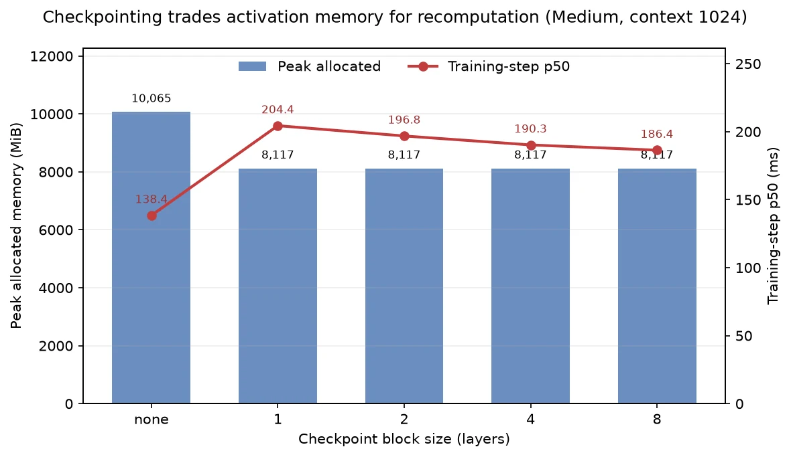
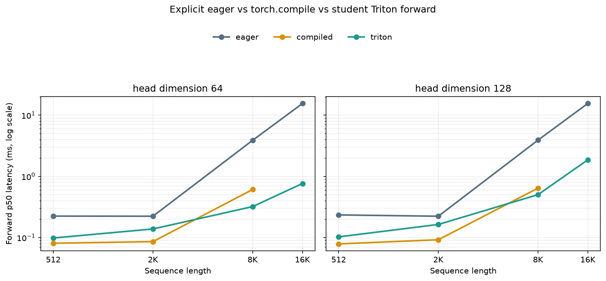

# A2-K 公开提交：吴家兴

本目录只包含允许公开且已脱敏的代码、结果与图片。正式要求见
[`assignments/A2-K/README.md`](../../../../assignments/A2-K/README.md)，评分说明见
[`assignments/A2-K/EVALUATION.md`](../../../../assignments/A2-K/EVALUATION.md)。

## 基本信息

- 作业题面版本：`26.1.4-k-rc.3`
- 完成范围：checkpointing、显式/compiled attention、Pure PyTorch tiled
  FlashAttention、Triton forward/backward、官方与扩展正确性及完整性能矩阵
- 未完成项：算法与矩阵无缺项；约 48 GiB 开发节点并非标准物理 24GB 环境，见限制说明
- 上游 starter commit：`ca8bc81a59b70516f7ebb2da4808daade877c736`

## 环境与工具

| 项目 | 公开、脱敏的信息 |
| --- | --- |
| GPU | NVIDIA GeForce RTX 4090；节点报告总显存 49140 MiB，按题面限制 allocator |
| 开跑前显存 | total/free 为 49140/48054 MiB；117 个正式进程最低起始 free 为 48233.125 MiB |
| Driver / CUDA | 550.163.01 / PyTorch compiled CUDA 12.4 |
| Python / PyTorch / Triton | 3.12.13 / 2.6.0+cu124 / 3.2.0 |
| power limit / P-state | 450 W / P0，未手动修改 |
| TF32 | BF16 性能矩阵不依赖 TF32；FP32 正确性用例关闭 TF32 |
| compile 配置 | `mode="reduce-overhead"`；attention 使用 `fullgraph=True` |
| allocator limit / fraction | 23552 MiB / 0.484217370466 |
| 计时 | steady-state 使用 CUDA events；compile/Triton cold start 单独用 wall time |

## 1. Activation Checkpointing

### 理论与代码骨架

忽略计算代价时，可递归二分连续层并嵌套 checkpoint。反向时只保留递归路径上的边界
activation，在叶子层物化单层 residual，因此峰值 activation memory 为 `O(log N)`，
总计算量为 `O(N log N)`。非嵌套、每 `k` 层一段时，峰值为
`O(N/k + k)`，在 `k≈sqrt(N)` 时为 `O(sqrt(N))`。

```python
from torch.utils.checkpoint import checkpoint

def nested_blocks(x, blocks, lo=0, hi=None):
    hi = len(blocks) if hi is None else hi
    if hi - lo == 1:
        return blocks[lo](x)                 # 叶子才保存单层 residual
    mid = (lo + hi) // 2
    def left(z):
        return nested_blocks(z, blocks, lo, mid)
    def right(z):
        return nested_blocks(z, blocks, mid, hi)
    x = checkpoint(left, x, use_reentrant=False)
    return checkpoint(right, x, use_reentrant=False)
```

固定实验只允许一次重算，所以我使用非嵌套分段。完整原始 step samples 在
[`results/checkpointing.csv`](results/checkpointing.csv)。

| context | block size | step p50 (ms) | peak allocated (MiB) | peak reserved (MiB) |
| ---: | ---: | ---: | ---: | ---: |
| 1024 | none | 138.432 | 10065.188 | 10244 |
| 1024 | 1 | 204.403 | 8116.536 | 8170 |
| 1024 | 2 | 196.833 | 8116.536 | 8162 |
| 1024 | 4 | 190.253 | 8117.473 | 8220 |
| 1024 | 8 | 186.392 | 8117.473 | 8178 |
| 2048 | none | 380.524 | 19664.138 | 20192 |
| 2048 | 2 | 486.041 | 8569.247 | 9948 |

1024 下 block 1 和 2 的 allocated 并列最低；我选择延迟和 reserved 更低的 block 2
运行 2048 边界。相对 baseline，它节省 56.42% allocated，step 延迟增加 27.73%。
峰值还受边界 activation、重算段 residual、allocator 粒度和 kernel workspace 影响，
所以不会随 block size 单调变化。7 行均成功，无 OOM 或 fallback。



## 2. PyTorch Attention 与 `torch.compile`

### 显式 PyTorch 基线

eager 基线显式执行 `QK^T / sqrt(d)`、causal mask、softmax 和 `PV`，未调用
`scaled_dot_product_attention` 或其他 fused attention。输入在计时区外创建，CUDA 区间
前后同步。下表为 BF16、batch 1、causal 的 forward-backward 结果，18 行完整数据见
[`results/attention_baseline.csv`](results/attention_baseline.csv)。

| sequence | d | p20 / p50 / p80 (ms) | peak alloc / reserved (MiB) |
| ---: | ---: | ---: | ---: |
| 512 | 64 | 0.5461 / 0.5508 / 0.5601 | 19.8 / 24 |
| 512 | 128 | 0.5764 / 0.5846 / 0.6093 | 20.1 / 24 |
| 2048 | 64 | 0.5522 / 0.5591 / 0.5683 | 69.5 / 92 |
| 2048 | 128 | 0.5386 / 0.5448 / 0.5543 | 70.8 / 94 |
| 8192 | 64 | 6.2536 / 6.2571 / 6.2598 | 853.3 / 926 |
| 8192 | 128 | 6.3078 / 6.3186 / 6.3346 | 858.3 / 1174 |

### Compile 对照

[`results/compile_comparison.csv`](results/compile_comparison.csv) 把首次调用 wall time 与
steady-state 分开。attention 的 forward-backward 结果如下：

| sequence, d | eager p50 (ms) | compiled p50 (ms) | compiled cold (ms) | graph breaks |
| --- | ---: | ---: | ---: | ---: |
| 512, 64 | 0.5540 | 0.2990 | 5390.84 | 0 |
| 2048, 128 | 0.5530 | 0.3095 | 5469.64 | 0 |
| 8192, 128 | 6.3266 | 1.7191 | 5203.70 | 0 |

small Transformer 的 eager/compiled forward-backward p50 为 47.084/9.379 ms，
training step 为 58.349/20.560 ms；compiled training cold start 为 32587.55 ms，
graph break 为 0。稳态融合收益明显，但短任务难以摊销编译，改变 shape 还会触发
specialization。每个正式 compiled row 使用新进程和新 cache，避免混淆 cold start。

## 3. FlashAttention-2 Forward

### Pure PyTorch tiled reference

Pure PyTorch 路径按 query/key tile 迭代，不构造完整 `S×S` score。每个 query tile 用
FP32 维护 running maximum `m`、normalizer `l` 和 output accumulator，通过
`alpha=exp(m_old-m_new)` 合并新 tile，最终只保存 `Q/K/V/O/LSE` 及必要的形状和 causal 信息。

### Triton kernel

`@triton.jit` forward 使用二维 grid（query tile × batch/head）。`d=32/64` 使用
64×64 tile，`d=128` 使用 32×32；均为 4 warps、1 stage。kernel 逐 key tile 做 online
softmax，以 FP32 累积 `m/l/O`，施加 causal 与越界 mask，并写出 output 和 FP32 LSE。
d=128 使用较小 tile 以控制寄存器压力。

## 4. Backward 与正确性

反向从 `Q/K/V/O/LSE` 重算 `P=exp(QK^T/sqrt(d)-LSE)`，再由
`D=sum(dO*O)` 和 `dS=P*(dP-D)` 得到 `dQ/dK/dV`。Pure PyTorch 路径使用 tiled
recompute；Triton 路径使用独立的 dQ 与 dK/dV kernels，均支持 causal/non-causal 和
d=32/64/128。

官方固定 GPU tests 见 [`results/unit_tests.txt`](results/unit_tests.txt)：**6 passed、0
failed、0 skipped**，pytest exit code 0。扩展正确性见
[`results/correctness.json`](results/correctness.json)：PyTorch/Triton × 3 seeds ×
d=32/64/128 × causal/non-causal BF16，加两个关闭 TF32 的 FP32 用例，共 **38/38
passed、0 failed、0 skipped**。

Triton BF16 的最大绝对误差为 `O 0.007708`、`LSE 9.54e-7`、`dQ 0.014857`、
`dK 0.012815`、`dV 0.013065`；FP32 不超过约 `1.4e-6`。接近零的参考值会放大相对误差，
因此按 dtype 使用 `atol + rtol*|expected|` 混合容差判定。

## 5. 性能矩阵

各行在独立进程中串行运行，先设置 23552 MiB allocator cap，再创建 CUDA tensor。
配置为 BF16、batch 1、causal；核心 shape 为
`sequence={512,2048,8192} × d={64,128}`，边界为 `16384 × {64,128}`。steady-state
使用 CUDA events，warm-up 100 ms、measurement 300 ms、quantiles 0.2/0.5/0.8。

从 SummerQuest 仓库根目录运行：

```bash
PYTHONPATH='students/吴家兴/assignments/A2-K/submission' \
  ../assignment2-systems/.venv/bin/python -B -m student_scripts.a2k.flash_benchmark \
  --output ../local_results/a2k/audit_flash.csv \
  --metadata ../local_results/a2k/audit_records.json \
  --seq-len 8192 --head-dim 64 --implementation triton \
  --phase forward-backward --warmup-ms 100 --rep-ms 300

PYTHONPATH='students/吴家兴/assignments/A2-K/submission' \
  ../assignment2-systems/.venv/bin/python -B -m student_scripts.a2k.validate_results \
  --assignment-dir 'students/吴家兴/assignments/A2-K'
```

完整 66 行（eager 24、compiled 18、Triton 24）见
[`results/flash_benchmark.csv`](results/flash_benchmark.csv)。下表为 forward-backward：

| sequence | d | eager p20/50/80 | compiled p20/50/80 | Triton p20/50/80 | Triton speedup |
| ---: | ---: | --- | --- | --- | ---: |
| 512 | 64 | .5589/.5644/.5765 | .3011/.3072/.3944 | .3587/.3615/.3662 | 1.56× |
| 512 | 128 | .5476/.5531/.5632 | .3103/.3133/.3185 | .3593/.3615/.3645 | 1.53× |
| 2048 | 64 | .5530/.5571/.5652 | .3011/.3050/.3123 | .3830/.3870/.3963 | 1.44× |
| 2048 | 128 | .5468/.5519/.5612 | .3113/.3154/.3246 | .4341/.4383/.4525 | 1.26× |
| 8192 | 64 | 6.2357/6.2392/6.2575 | 1.6447/1.6494/1.6537 | .9390/.9400/.9421 | 6.64× |
| 8192 | 128 | 6.3083/6.3145/6.3396 | 1.7315/1.7347/1.7398 | 1.6014/1.6063/1.6989 | 3.93× |
| 16384 | 64 | 24.998/25.055/25.076 | — | 2.960/2.967/3.153 | 8.44× |
| 16384 | 128 | 25.239/25.254/25.280 | — | 6.145/6.158/6.169 | 4.10× |



在 16384/d64，Triton 三个 phase 分别为 0.765/2.215/2.967 ms，对 eager 为
20.30×/4.27×/8.44×；combined allocated 从 3354.4 MiB 降到 16.1 MiB，d128 则从
3364.4 MiB 降到 32.1 MiB。短序列主要受 launch 和重算开销影响，例如 512/d64 的
Triton backward 只有 0.92× eager；长序列才更能体现 tiled 计算的优势。固定行均成功，
但这不代表任意 batch/head/shape 都不会 OOM。

## 6. 限制与复现

- 轻量结果目录：[`results/`](results/)
- 24 GiB 证据：[`results/memory_evidence.json`](results/memory_evidence.json) 汇总的最大
  peak allocated/reserved 为 19664.138/20192 MiB，allocator limit/fraction 为
  23552 MiB/0.484217370466，`within_24gib=true`
- 本地大型材料：临时 overlay、编译 cache 和逐进程原始记录不提交
- 硬件限制：节点报告约 48 GiB，并非标准物理 24GB 卡；所有正式进程都在首次 allocation
  前施加 23 GiB allocator 上限，但它不约束 CUDA context/driver，仍需助教在标准卡抽验
- 最小复现：固定 starter commit，安装其锁定环境，将 `submission/` 对应文件接入
  `cs336_systems/a2k`、`tests/adapters.py` 与 `student_scripts/a2k`，按上面三个入口依次跑
  correctness、单行 benchmark 和结果验证

## 飞书补充文档

- 链接：[A2-K Memory and Kernels 补充记录（吴家兴）](https://fudan-nlp.feishu.cn/docx/FQF2d94mrosSW7xUo2ZcIK8QnVc)

补充文档只保存组织内审核所需的差量证据，不上传 cache、binary、完整 trace 或凭据。

## 自检

- [x] 仅修改本人 A2-K；必交代码、结果、两张图和飞书链接齐全。
- [x] 正式脚本独立串行运行，并在首次 CUDA allocation 前设置 23552 MiB 上限。
- [x] 显式 baseline 未调用 fused attention；提交包含真实 `@triton.jit` kernel。
- [x] 官方测试为 6 passed、0 failed、0 skipped；关键数字均可追溯。
- [x] 附件未超限，不含 cache、binary、trace、权重、内部信息或凭据。
- [ ] 节点不是标准物理 24GB 卡，allocator guard 不能替代助教在标准卡上的抽验。
