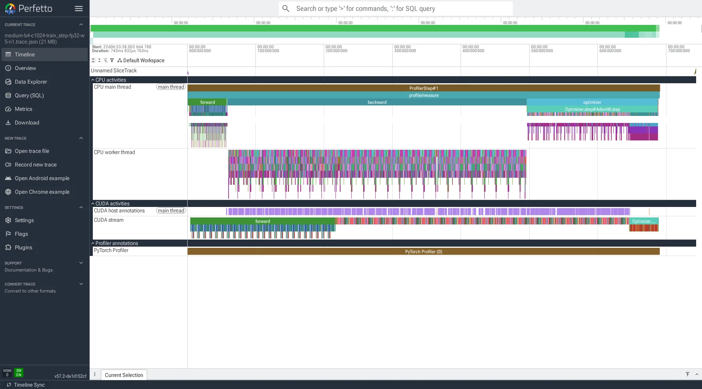
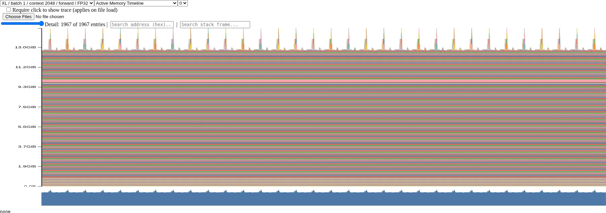
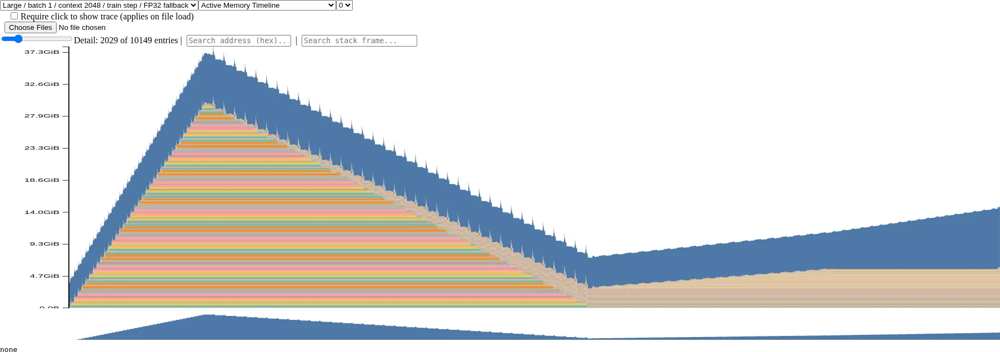

# A2-P 公开提交：吴家兴

本目录只包含允许公开且已经脱敏的代码、汇总和图片；完整 profiler trace、memory snapshot
和 MemoryViz HTML 留在本地。要求与评分说明见
[`README`](../../../../assignments/A2-P/README.md) 和
[`EVALUATION`](../../../../assignments/A2-P/EVALUATION.md)。上游实现固定为
[`ca8bc81a59b70516f7ebb2da4808daade877c736`](https://github.com/stanford-cs336/assignment2-systems/tree/ca8bc81a59b70516f7ebb2da4808daade877c736)，
原题见 [`PDF`](https://github.com/stanford-cs336/assignment2-systems/blob/ca8bc81a59b70516f7ebb2da4808daade877c736/cs336_assignment2_systems.pdf)。

## 基本信息

- 作业题面版本：`26.1.4-rc.3`
- 完成范围：A2-P 的五个 profiling 小题，即统一 benchmark、六个 compute trace、四种
  mixed-precision accumulation、BF16 autocast benchmark 和 memory profiling
- 未完成项：无；规定的 XL train step OOM 均按题面记录并执行 fallback
- starter：`../assignment2-systems`，固定 commit 如上，实验中未修改其跟踪文件
- 测量代码：[`submission/profiling/`](submission/profiling/)

## 环境与工具

| 项目 | 公开、脱敏的信息 |
| --- | --- |
| GPU | NVIDIA GeForce RTX 4090，48,639.31 MiB，compute capability 8.9 |
| Driver / CUDA | Driver 550.163.01；PyTorch compiled CUDA 12.4 |
| Python / PyTorch | Python 3.12.13；PyTorch 2.6.0+cu124 |
| Compute profiler | `torch.profiler` 2.6.0+cu124，CPU 与 CUDA activities |
| Memory profiler | `torch.cuda.memory._record_memory_history` 与官方 MemoryViz |
| 运行限制 | 无头机器；CPU perf sampling 因系统策略不可用，因此 compute 主工具统一使用 `torch.profiler` |
| 显存口径 | 使用平台提供的完整 48 GiB 4090，不施加 A2-K 的 24 GiB allocator 上限 |

正式实验前，真实 CUDA matmul、含 CPU/CUDA activity 的 profiler trace，以及 memory
history → snapshot → MemoryViz 三项 preflight 均通过。

## 1. End-to-End Benchmark

### 1.1 复现命令与计时边界

统一入口为 [`benchmark.py`](submission/profiling/benchmark.py)，step 边界见
[`common.py`](submission/profiling/common.py)：

```bash
../assignment2-systems/.venv/bin/python -B \
  -m students.吴家兴.assignments.A2-P.submission.profiling.benchmark \
  --suite required --steps 10 --seed 42 \
  --output students/吴家兴/assignments/A2-P/results/benchmark.csv \
  --metadata students/吴家兴/assignments/A2-P/results/benchmark_metadata.json
```

三种 mode 分别为：`forward` 在 `torch.no_grad()` 下只执行 forward；
`forward_backward` 执行 zero grad、forward、loss 和 backward；`train_step` 再加入
AdamW step。

模型初始化、随机 token/label 生成和 optimizer 构造均在计时区外。每个 warm-up step 后同步；
正式测量在 `perf_counter_ns()` 前和完整 step 后都调用 `torch.cuda.synchronize()`。基线均为
Small、batch 4、context 512、FP32、seed 42；每组 10 次正式测量，样本标准差使用
`n-1` 分母。

### 1.2 实测结果

完整数据和 raw timing 见 [`results/benchmark.csv`](results/benchmark.csv)：

| mode | warm-up | raw timings（ms） | mean（ms） | sample std（ms） | CV |
| --- | ---: | --- | ---: | ---: | ---: |
| `forward` | 5 | 24.7249, 24.7478, 24.7810, 24.8339, 24.7708, 24.7920, 24.8305, 24.8308, 24.8320, 24.7969 | 24.7941 | 0.0385 | 0.001554 |
| `forward_backward` | 5 | 83.0554, 83.0729, 83.3483, 83.4353, 83.1589, 83.3164, 83.1264, 83.1636, 83.4059, 83.4108 | 83.2494 | 0.1487 | 0.001786 |
| `train_step` | 5 | 92.6842, 92.7686, 92.6555, 92.5866, 92.7909, 92.6627, 92.7805, 93.1121, 92.7931, 92.7250 | 92.7559 | 0.1429 | 0.001541 |
| `train_step` | 0 | 889.0093, 93.1081, 93.0678, 93.0143, 92.4085, 92.4066, 92.6856, 92.9420, 92.6324, 92.5536 | 172.3828 | 251.7970 | 1.460685 |

预热后三组 CV 均低于 0.18%。零预热组首步为 889.0093 ms，随后回到约 92–93 ms，使十步
均值达到预热组的 1.858 倍；原因包括 CUDA 首次调用、AdamW state 创建和 allocator 扩容。
该对照只说明冷启动污染，不比较训练质量。

## 2. Compute Profiling

### 2.1 六个 `train_step` trace

Small / Medium 与 context 256 / 512 / 1024 组成六个配置，均固定 batch 4、FP32 和完整
`train_step`。实现见
[`compute_profile.py`](submission/profiling/compute_profile.py)，正式命令为：

```bash
../assignment2-systems/.venv/bin/python -B \
  -m students.吴家兴.assignments.A2-P.submission.profiling.compute_profile \
  --models small medium --contexts 256 512 1024 \
  --batch-size 4 --dtype fp32 --warmup 5 --seed 42 \
  --top-ops 15 --top-kernels 15 \
  --trace-dir ../local_results/profile/raw \
  --summary students/吴家兴/assignments/A2-P/results/profile/trace_summary.csv \
  --metadata students/吴家兴/assignments/A2-P/results/profile/run_metadata.json
```

每个配置先在 profiler 外执行五个完整 warm-up step；schedule 为
`wait=0, warmup=1, active=1, repeat=1`，只捕获一个稳定 step。trace 标记
`profile/measure`、`forward`、`backward`、`optimizer` 和三个 attention 子阶段；其中
`profile/warmup` 仅标记 profiler 边界，真实 warm-up 不进入 trace。starter 文件未修改。

| 模型 / context | 参数量 | forward CUDA（ms） | backward CUDA（ms） | optimizer CUDA（ms） | 完整 measure（ms） | peak allocated（MiB） |
| --- | ---: | ---: | ---: | ---: | ---: | ---: |
| Small / 256 | 128,625,408 | 27.5848 | 52.3067 | 30.2107 | 110.1021 | 3,094.9 |
| Small / 512 | 128,625,408 | 29.0078 | 56.4306 | 27.2184 | 112.6568 | 5,148.1 |
| Small / 1024 | 128,625,408 | 75.2577 | 153.9908 | 15.0548 | 244.3034 | 11,165.2 |
| Medium / 256 | 423,183,360 | 54.1798 | 106.0933 | 59.2764 | 219.5496 | 8,691.1 |
| Medium / 512 | 423,183,360 | 79.1414 | 158.7947 | 44.0642 | 282.0003 | 14,048.9 |
| Medium / 1024 | 423,183,360 | 213.6087 | 429.2606 | 42.8846 | 685.7539 | 29,619.2 |

六份 trace 的文件名、大小和 SHA-256 见
[`run_metadata.json`](results/profile/run_metadata.json)，234 行 stage/operator/kernel
汇总见 [`trace_summary.csv`](results/profile/trace_summary.csv)；原始 trace 不提交。

### 2.2 代表性 trace、Calls 与归因



代表配置 Medium/context 1024 的 CPU 总时长为 690.232 ms，CUDA stage 总时长为
685.754 ms；forward、backward、optimizer 分别占 31.15%、62.60%、6.25%。

该配置有 24 层，三个 attention 子区间均为 24 calls；scores、softmax、value 的累计
CUDA 时间分别为 32.492、55.934、10.749 ms。softmax 还需反复读写
`batch × heads × sequence²` 张量，因此 FLOPs 少不代表 wall time 更短。

按累计 CUDA 时间，主要 operator 包括：

| rank | operator | calls | CPU total（ms） | CUDA total（ms） |
| ---: | --- | ---: | ---: | ---: |
| 1 | `aten::bmm` | 651 | 112.383 | 281.066 |
| 2 | `autograd::engine::evaluate_function: BmmBackward0` | 217 | 110.631 | 174.481 |
| 3 | `aten::einsum` | 217 | 19.554 | 107.417 |
| 4 | `aten::mul` | 2,382 | 172.476 | 102.585 |
| 5 | `autograd::engine::evaluate_function: DivBackward0` | 48 | 9.824 | 98.565 |

最高累计 CUDA kernel 为 `ampere_sgemm_128x64_tn`（168 calls、86.853 ms）。operator
存在嵌套，GPU kernel 也可与 CPU dispatch 重叠，故 top-op 时间不能直接相加为 step wall
time。`torch.profiler` 支持本题所需的框架级归因，但不提供 nsys 的系统级 CUDA API ↔
kernel correlation。

## 3. Mixed Precision

实现与完整输出见 [`mixed_precision.py`](submission/profiling/mixed_precision.py) 和
[`mixed_precision.json`](results/mixed_precision.json)。

### 3.1 四种累加实验

按固定 PDF 的四段循环执行 1,000 次 `0.01` 累加：

| 输入 / accumulator | 实际结果 | 绝对误差 |
| --- | ---: | ---: |
| FP32 / FP32 | 10.0001335144 | 0.0001335144 |
| FP16 / FP16 | 9.953125 | 0.046875 |
| FP16 / FP32（隐式转换） | 10.0021362305 | 0.0021362305 |
| FP16 / FP32（显式转换） | 10.0021362305 | 0.0021362305 |

FP16 accumulator 每一步都会把部分和重新舍入，误差会反复累积，所以第二种最差。后两种虽然
用 FP32 accumulator 避免了低精度部分和的重复舍入，但 `0.01` 在进入 accumulator 前已经
被量化成 FP16，转换回 FP32 无法恢复丢失的输入信息，因此两者仍有相同的 0.002136 误差。

### 3.2 ToyModel CUDA BF16 autocast

参数初始为 FP32，并在 `torch.autocast(device_type="cuda", dtype=torch.bfloat16)` 内执行
forward；我用 module hook 记录了实际 dtype：

| 组件 | 实测 dtype |
| --- | --- |
| 参数 | FP32 |
| 第一层 Linear 输出 | BF16 |
| LayerNorm 输出 | FP32 |
| logits | BF16 |
| loss | FP32 |
| gradients | FP32 |

Linear 可使用 BF16 Tensor Core 路径；LayerNorm 的 reduction 对舍入敏感，因此保持 FP32。
BF16 动态范围优于 FP16，但尾数仍更短，敏感 reduction 保持 FP32 仍有价值。

### 3.3 Small 模型 FP32 与 BF16

两组均为 Small、batch 4、context 512、完整 `train_step`、warm-up 5、measurement 10、
seed 42：

| dtype | raw timings（ms） | mean（ms） | std（ms） | CV | peak allocated（MiB） | peak reserved（MiB） | first → last loss |
| --- | --- | ---: | ---: | ---: | ---: | ---: | --- |
| FP32 | 92.6704, 92.4159, 92.6410, 92.6460, 92.5811, 92.8248, 92.7884, 92.5941, 92.7040, 92.9536 | 92.6819 | 0.1482 | 0.001599 | 5,163.251 | 5,504 | 6.748353 → 5.544213 |
| BF16 | 68.4750, 69.1834, 68.3074, 69.2684, 69.6246, 68.5205, 70.4624, 69.3034, 68.7564, 68.9547 | 69.0856 | 0.6412 | 0.009281 | 4,309.463 | 4,592 | 6.749657 → 4.303311 |

BF16 加速 1.342×，peak allocated 降低 16.54%。参数、梯度和 AdamW state 仍为 FP32，
所以显存不会减半。两组短测均无数值爆炸，但不能据此推断收敛质量或最终精度。

## 4. Memory Profiling

### 4.1 配置、峰值与 fallback

实现见 [`memory_snapshot.py`](submission/profiling/memory_snapshot.py)。每个配置在 fresh
process 中先完成 forward-only warm-up，再开启 memory history，使 optimizer state 的首次
分配保留在 train step 内；独立 snapshot 和 MemoryViz HTML 均留在本地。

```bash
../assignment2-systems/.venv/bin/python -B \
  -m students.吴家兴.assignments.A2-P.submission.profiling.memory_snapshot \
  --suite required --batch-size 1 --dtype fp32 --warmup 1 --seed 42 \
  --max-entries 200000 --raw-dir ../local_results/memory/raw \
  --summary students/吴家兴/assignments/A2-P/results/memory/peaks.csv \
  --metadata students/吴家兴/assignments/A2-P/results/memory/run_metadata.json
```

完整数据见 [`peaks.csv`](results/memory/peaks.csv) 和
[`run_metadata.json`](results/memory/run_metadata.json)：

| 模型 / context / mode | 状态 / 阶段 | attempted | active peak | allocated peak | reserved peak | 最大 allocation |
| --- | --- | ---: | ---: | ---: | ---: | ---: |
| XL / 128 / forward | success | — | 13,154.051 | 13,154.051 | 13,168 | 5 |
| XL / 128 / train step | OOM / optimizer | 100 MiB | 47,739.459 | 47,739.459 | 48,068 | 100 |
| XL / 2048 / forward | success | — | 15,305.682 | 15,305.682 | 15,858 | 512 |
| XL / 2048 / train step | OOM / forward | 512 MiB | 46,857.502 | 46,857.502 | 47,616 | 512 |
| XL / 1024 / train step fallback | OOM / optimizer | 100 MiB | 47,373.793 | 47,373.793 | 48,062 | 128 |
| Large / 2048 / train step fallback | success | — | 39,116.438 | 39,116.438 | 39,498 | 320 |

XL/context 2048 在 batch 1 OOM 后，按题面继续尝试 XL/context 1024（optimizer OOM）和
Large/context 2048（成功），并保留原配置、失败阶段和峰值。

`allocated` 是 tensor 实际占用，`active` 是仍在使用或等待释放的 allocator block，
`reserved` 是 caching allocator 保留的 segment。本次 active 与 allocated peak 恰好相同。

### 4.2 Active Memory Timeline



XL/context 2048 forward 的 32 组规律峰对应逐层执行 TransformerBlock，peak allocated 为
15,305.682 MiB。最大新增 allocation 为 512 MiB，脱敏 stack 为
`functional.py:einsum → einops.py:einsum → model.py:scaled_dot_product_attention`。
它与 attention score tensor 的理论值完全一致：

```text
batch × heads × sequence² × 4 bytes
= 1 × 32 × 2048² × 4 / 2²⁰
= 512 MiB
```



Large/context 2048 fallback 中，allocated 从 3,814.669 MiB 上升到 forward 后的
38,114.513 MiB，backward 逐层释放 saved tensor 后降至 7,599.557 MiB，optimizer 创建
FP32 state 后升至 14,995.583 MiB；全程 peak 为 39,116.438 MiB。

Large attention 的 20 个 head 对应 320 MiB attention tensor，与 snapshot 最大
allocation 一致。截图保留了阶段形状和大 allocation。

### 4.3 Residual、saved tensor 与 gradient

单个 residual stream tensor 的理论大小是：

```text
batch × context × d_model × 4 bytes / 2²⁰
```

因此 XL/b1/c128、XL/b1/c2048、Large/b1/c2048 分别为 1.25、20、10 MiB，远小于
512/320 MiB attention matrix；长 context 下的关键是 `sequence²` intermediates。

Large fallback 的 forward 相对底座增加 34,299.844 MiB，按 36 层约 952.77 MiB/block；
这是包含 attention intermediates、saved tensors 和 logits 的阶段级上界。backward 后相对
底座仍多 3,784.888 MiB，平均 105.14 MiB/block。

从模型结构推导，一个 Large TransformerBlock 的 FP32 参数/gradient 约为：

```text
[4 × d_model² + 3 × d_model × d_ff + 2 × d_model] × 4 bytes
= [4 × 1280² + 3 × 1280 × 5120 + 2 × 1280] × 4 / 2²⁰
= 100.01 MiB
```

105.14 MiB 的端到端平均值还含 embedding、final norm 和 LM head gradient，但与
100.01 MiB/block 同量级。backward 中每层释放数百 MiB saved activation，同时产生约
100 MiB gradient，因此下降量不能直接解释为其中任何一项的大小。

## 5. 限制与复现

- 完整 trace、snapshot 和 MemoryViz HTML 留在本地；公开 metadata 只含 basename、大小和
  SHA-256。
- Compute Profile 使用 `torch.profiler`，不具备 nsys 的系统级 CUDA API correlation。
- 实验均为单机单卡、synthetic tokens、固定 seed 的短测，不外推至收敛或模型质量。

最小复现顺序：

```bash
git -C ../assignment2-systems rev-parse HEAD
../assignment2-systems/.venv/bin/python -B \
  -m students.吴家兴.assignments.A2-P.submission.profiling.preflight \
  --output-dir ../local_results/preflight
../assignment2-systems/.venv/bin/python -B \
  -m students.吴家兴.assignments.A2-P.submission.profiling.benchmark \
  --model-size small --batch-size 1 --context-length 128 \
  --mode train_step --warmup 1 --steps 2 \
  --output ../local_results/smoke.csv
```

## 飞书补充文档

- 链接：[A2-P Profiling 补充记录（吴家兴）](https://fudan-nlp.feishu.cn/docx/TFWwdQ3CcovQAQxkXU7cPBUDnJf)

## 自检

- [x] 六个 `train_step` trace、轻量汇总和三张关键图齐全。
- [x] 所有关键数字可追溯，附件合计低于 2 MiB。
- [x] 未提交完整 trace/snapshot、权重、数据、环境、内部信息或凭据。
- [x] 飞书补充文档组织内可读，未开启互联网链接访问。
