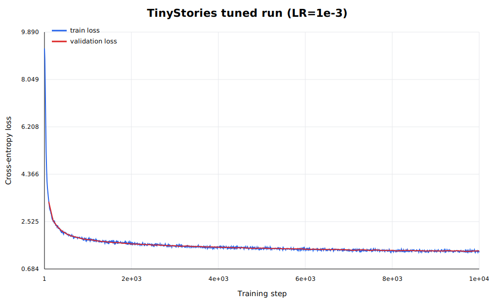
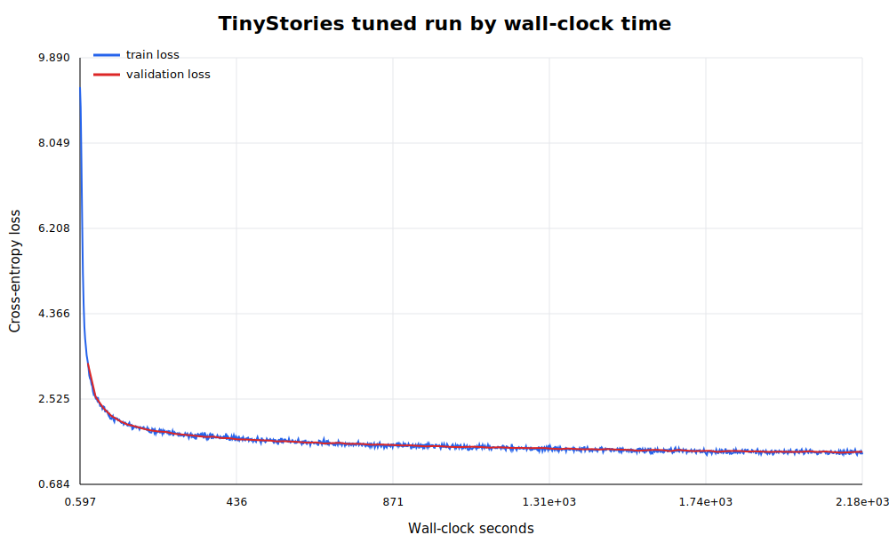
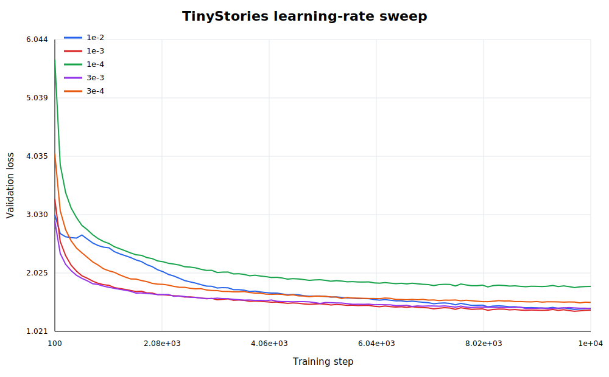
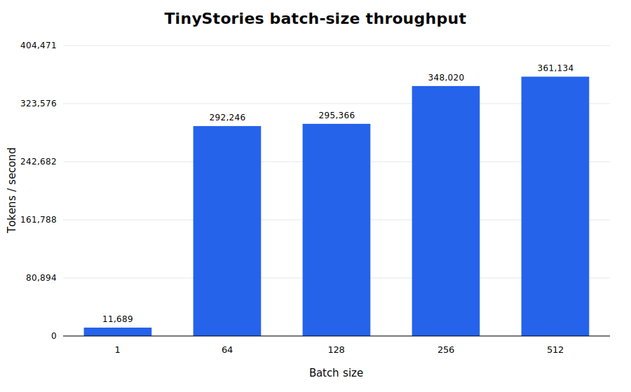
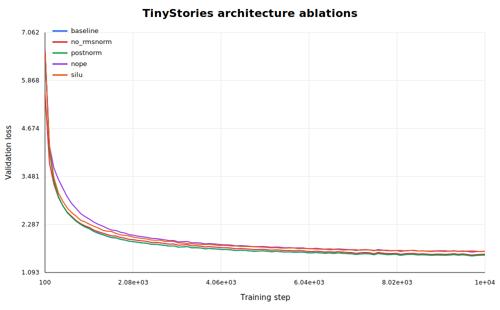

# A1 公开提交：姚寓骞

> 本文件和同目录代码公开可见，仅包含公开数据上的实验结果与脱敏后的复现信息。

## 基本信息

- 作业题面版本：26.0.4
- 上游 starter commit：`a158843b20107949f1a8d7df1b05cd33b9166712`
- 完成范围：byte-level BPE、Tokenizer、Transformer LM、AdamW 与训练工具；TinyStories 和 OWT tokenizer、数据编码、模型训练、学习率扫描、batch-size 扫描、四项架构消融及文本生成。
- 未完成项：寻找题面建议的发散 learning-rate run 未果，再额外设置感觉没什么意义。

## 书面题

### Unicode 1

1. `chr(0)` 返回 Unicode 码点 U+0000，即 NUL（null character）。
2. 它的 `repr` 是可见的转义形式 `'\x00'`，直接打印时没有可见字形，因此看起来像空字符。
3. NUL 可以正常存在于 Python 字符串内部，拼接和长度计算都会保留它；打印时两侧文本看似直接相连，但传入以 NUL 结尾的 C 接口时需要特别小心。

### Unicode 2

1. UTF-8 是互联网事实标准，ASCII 文本每字符只需一个 byte，且没有 UTF-16/UTF-32 的字节序和 BOM 问题；它同时能用固定的 256-byte 基础词表无损表示任意 Unicode 文本。
2. 错误函数逐 byte 解码，但 UTF-8 字符可能由多个 byte 共同组成。例如 `"牛".encode("utf-8") == b"\xe7\x89\x9b"`，三个 byte 单独解码都会失败，必须拼接后整体解码。
3. `b"\x80\x80"` 不能解码为 Unicode，因为两个 byte 都是 continuation byte，却没有合法的 leading byte。

### Transformer 参数量与 FLOPs

本实现不共享 token embedding 与 LM head。参数量为

$$
P=2Vd+L(4d^2+3dd_{ff}+2d)+d.
$$

GPT-2 XL 形状（$V=50{,}257,T=1024,L=48,d=1600,d_{ff}=4288$）共有
`1,640,452,800` 个参数；float32 权重需要约 6.56 GB（6.11 GiB）。

单序列 forward 中的主要矩阵乘法为：每层 Q/K/V 和输出投影 `8Td²`，QK 与 attention-value
乘法 `4T²d`，SwiGLU 三个投影 `6Tdd_ff`，最终 LM head `2TdV`。因此

$$
F_{forward}=L(8Td^2+4T^2d+6Tdd_{ff})+2TdV.
$$

| 规格 | 参数量 | Forward TFLOPs | QKV/O proj | Attention | FFN | LM head |
|---|---:|---:|---:|---:|---:|---:|
| small | 162,148,608 | 0.292 | 19.88% | 13.25% | 39.76% | 27.10% |
| medium | 406,539,264 | 0.830 | 24.83% | 12.42% | 50.05% | 12.70% |
| large | 833,591,040 | 1.769 | 27.32% | 10.93% | 54.30% | 7.45% |
| XL | 1,640,452,800 | 3.517 | 28.62% | 9.16% | 57.53% | 4.68% |

模型增大时 FFN 和层内投影占比上升，固定词表的 LM head 占比下降。在 $T=1024$ 时 FFN 是最大计算项；将 XL context length 提高到 16,384 后，forward 增至 133.58 TFLOPs（约 38 倍），attention 的二次项占比由 9.16% 上升至 61.73%。

### AdamW 资源核算

令 $B$ 为 batch size，并按题面仅统计列出的需要保存用于反向传播的激活，且
$d_{ff}=8d/3$。参数、梯度和优化器状态分别需要 $P$、$P$、$2P$ 个 float32；激活近似为

$$
A=B\left[L(8Td+4Td_{ff}+2hT^2)+Td+2TV\right].
$$

因此峰值内存近似为 $4(P+P+2P+A)=16P+4A$ bytes。代入 GPT-2 XL 得
`26.247 GB + 16.373 GB × B`，在题设 80GB 上最大整数 batch size 为 3。该结果是题面规定的、未使用 activation checkpointing 或混合精度的保守核算，不等同于实际优化训练配置。

逐参数 AdamW 更新约需要 14 次标量运算，因此 XL 一步 optimizer update 约为
$14P=22.97$ GFLOPs，相比模型 forward/backward 较小。若 backward FLOPs 为 forward 的两倍，400K steps、batch size 1024 的总计算量为
$3F_{forward}\times1024\times400{,}000$；单卡 H100 以 50% MFU 提供 247.5 TFLOP/s 时，约需 4,850 小时（202 天）。

## 实现说明

- Tokenizer：从 256 个 byte token 出发，使用 GPT-2 正则预分词；BPE 通过增量维护 pair count 和受影响 pre-token 集合加速，频率并列时选择字典序更大的 pair。编码严格按 merge rank，special token 使用最长优先匹配，解码先拼接 bytes 再统一 UTF-8 decode。
- Transformer：从零实现 Linear、Embedding、RMSNorm、RoPE、causal multi-head attention、SwiGLU、Pre-Norm block 和 LM head；head 维度拆分与合并使用 `einops.rearrange`。
- 训练：实现稳定 softmax/cross-entropy、AdamW、warmup-cosine schedule、global gradient clipping、mmap batch、checkpoint 恢复、JSONL 日志及 temperature/top-p 生成。
- 消融开关：支持关闭 RMSNorm、Post-Norm、NoPE，以及参数量匹配的两层 SiLU FFN。

## Tokenizer 实验

两个 tokenizer 都加入 `<|endoftext|>`。Compression ratio 定义为原始 UTF-8 bytes / encoded tokens；throughput 在相同的 10MiB validation prefix 上单进程测量。

| 数据 | Vocab | Train tokens | Bytes/token（全量 train） | 编码 bytes/s | 编码 tokens/s | 最长普通 token |
|---|---:|---:|---:|---:|---:|---|
| TinyStories | 10,000 | 540,796,778 | 4.119 | 442,822 | 107,547 | 15 bytes，` accomplishment` |
| OWT | 32,000 | 2,727,120,452 | 4.371 | 376,200 | 86,743 | 64 bytes，疑似重复编码产生的 mojibake byte 串 |

TinyStories tokenizer 训练计时日志为 49.72 秒；OWT 训练在集群任务中约耗时 2 小时，但原始 shell 计时由于中间集群相关问题未成功写入结构化日志，因此无法报告精确秒数。OWT 的更大词表带来更高压缩率，但 Web 文本的多样性、噪声与更多 merge 使训练和编码更慢；最长 token 也说明无清洗 Web 数据可能把编码异常吸收到词表中。

## TinyStories 主训练

模型配置为 vocab 10,000、context 256、$d=512$、$d_{ff}=1344$、4 层、16 heads、RoPE theta 10,000、batch size 128、10,000 steps，共处理 327,680,000 tokens。

原始 `3e-4` baseline 最终 validation loss 为 1.5251。学习率扫描中 `1e-3` 达到最佳 validation loss 1.3863，低于题面 1.45 目标，因此将其作为主结果。





## Learning-rate sweep

| Max LR | Final validation loss | 总时间（秒） | 结论 |
|---:|---:|---:|---|
| `1e-4` | 1.7956 | 2182.7 | 学习过慢，明显欠拟合 |
| `3e-4` | 1.5197 | 1011.2 | 稳定，但最终损失偏高 |
| `1e-3` | **1.3863** | 2177.9 | 本次最佳 |
| `3e-3` | 1.4111 | 2098.5 | 收敛较快，略逊于 `1e-3` |
| `1e-2` | 1.4181 | 3056.9 | 高 LR 下仍收敛，但速度和最终值没有优势 |



本次没有额外提交发散 run；现有五组均保持有限 loss 并完成训练，因此没有把 `1e-2` 错误标记为发散。

## Batch-size sweep

所有成功配置运行 100 steps；吞吐使用第 90 step 的累计 processed tokens / wall-clock time，避开最后一次 validation 的额外开销。

| Batch size | Tokens/s | 结果 |
|---:|---:|---|
| 1 | 11,689 | 成功 |
| 64 | 292,246 | 成功 |
| 128 | 295,366 | 成功 |
| 256 | 348,020 | 成功 |
| 512 | **361,134** | 成功，最大可运行值 |
| 1024 | — | OOM |



小 batch 无法充分利用矩阵乘法吞吐；增大到 256/512 后增益趋缓，而 1024 超出单卡内存。OOM 日志只以脱敏状态记录，不提交设备路径和完整 traceback。

## 架构消融

消融均保持相同数据、batch size、LR、训练步数和随机种子，只改变目标组件。SiLU FFN 使用
`d_ff=2016`，与 baseline SwiGLU 的模型总参数量同为 22,696,448。

| 架构 | Final validation loss | 相对同配置 baseline |
|---|---:|---:|
| 同配置 baseline（LR `3e-4`、warmup 500） | **1.5251** | — |
| 删除 RMSNorm | 1.5492 | +0.0241 |
| Post-Norm | 1.5274 | +0.0022 |
| NoPE | 1.6199 | +0.0948 |
| 参数匹配 SiLU | 1.6167 | +0.0916 |



四项改动均降低最终结果。NoPE 退化最大，说明长度 256 下位置信息仍然重要；参数匹配后 SiLU 仍明显落后，说明差异不只是参数量；删除 RMSNorm 有小幅退化，而 Post-Norm 与 baseline 非常接近，因此不能声称两者存在很大的质量差距。

## OWT 训练

OWT 使用 32K tokenizer，并保持 TinyStories baseline 的模型架构、batch size 128 和 10,000 iterations，共处理 327,680,000 tokens；最终 validation loss 为 4.2865，总训练时间 1452.9 秒。

OWT loss 不能与 TinyStories 的 per-token loss 直接横向比较，因为 tokenizer 和数据分布不同。OWT 内容更多样、长尾更强，在相同模型容量和训练预算下得到更高 loss 与较弱的生成连贯性，符合预期。

## 文本生成

生成统一使用 temperature 0.8、top-p 0.95，最多生成 256 tokens。

TinyStories 样本以 “Once upon a time” 开始，能维持人物、动作和童话语气，并在生成 `<|endoftext|>` 后停止；主要问题是 “danced” 等短语重复，说明模型容量和训练数据模式会导致局部循环。完整样本见 [`logs/generation_tinystories.txt`](logs/generation_tinystories.txt)。

OWT 样本能形成段落和局部语法结构，但语义跳跃明显，人物指代和叙事因果不稳定；temperature 增加多样性的同时会放大这种不一致，top-p 则避免长尾低概率 token 过多进入采样。完整样本见 [`logs/generation_owt.txt`](logs/generation_owt.txt)。

## 复现说明

环境由上游 `uv.lock` 固定，核心检查命令为：

```bash
uv sync --frozen
uv run pytest
```

当前受限容器中的完整结果为 `46 passed, 1 xfailed, 1 failed`。唯一 failure 发生在内存测试装饰器调用 `psutil.Process(os.getpid())` 时，PID namespace 使 psutil 在进入 `encode_iterable` 前抛出 `NoSuchProcess`；其余模型、优化器、checkpoint、Tokenizer 一致性、BPE 快照和速度测试均通过。该环境问题可用独立的 `psutil.Process(os.getpid())` 调用复现。

主要入口：

```bash
uv run python scripts/train_tokenizer.py --help
uv run python scripts/encode_dataset.py --help
uv run python scripts/train.py --config configs/experiments/tinystories_baseline.json
uv run python scripts/train.py --config configs/experiments/owt_baseline.json
uv run python scripts/generate.py --help
```

- 真实实现：`submission/cs336_basics/`
- 测试 adapter：`submission/tests/adapters.py`
- 训练、编码、生成和整理脚本：`submission/scripts/`
- 实验配置：`submission/configs/`
- 逐点日志和汇总：`logs/`
- 图表：`assets/`

## 实验日志

训练日志使用 JSONL，每条包含 `step`、`wall_clock_sec`、`train_loss`、`lr`、
`processed_tokens`，并定期包含 `val_loss`；每个完整 run 另有 `summary.json` 等价汇总。
`logs/experiment_index.json` 给出主实验索引。提交不包含数据、checkpoint、完整 console log 或内部资源信息。

## 飞书补充文档

本次提交不提供飞书补充文档；公开 README、代码、脱敏日志与图表构成本次提交材料。
