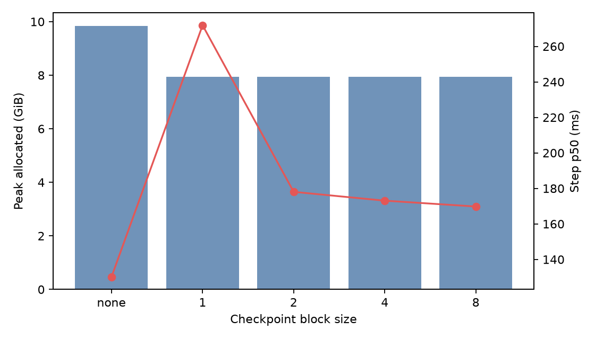
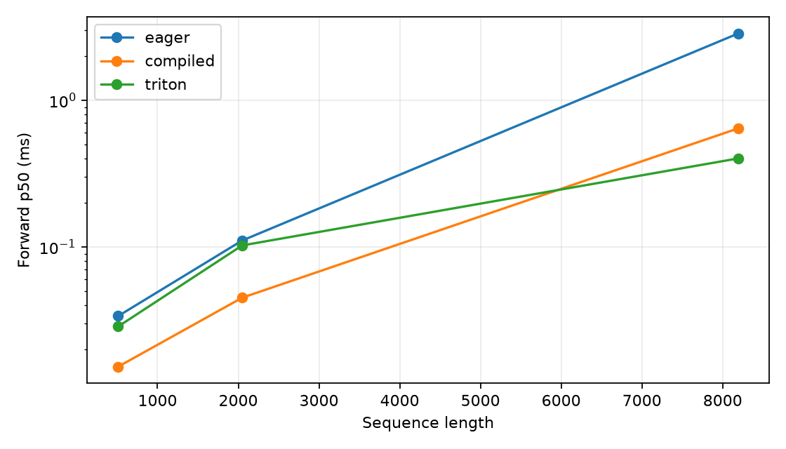

# A2-K Public Submission: 姚寓骞

## Basic Information

- 题面版本：`26.1.4-k-rc.3`
- 固定 starter commit：`ca8bc81a59b70516f7ebb2da4808daade877c736`
- 完成范围：Activation Checkpointing、显式 PyTorch Attention、`torch.compile` 对照、纯 PyTorch tiled attention、学生 Triton FlashAttention-2 forward、重计算 backward、官方与扩展正确性、核心与长序列性能矩阵。
- 未完成项：三组 compiled-only-backward microbenchmark 触发 `RuntimeError`，已保留失败行。
- 飞书补充文档：无

## Environment

实验使用单个 CUDA 可见设备，型号报告为 NVIDIA GeForce RTX 4090，Driver 550.163.01，CUDA Runtime 12.8，PyTorch 2.11.0+cu128，Triton 3.6.0，power limit 450 W，P-state P2。性能实验启用 PyTorch 默认 TF32；扩展 FP32 正确性用例显式关闭 TF32。正式脚本均在第一次 CUDA allocation 前调用 `torch.cuda.set_per_process_memory_fraction`，将 allocator 限制为 23552 MiB；最高 peak allocated 为 19685.64 MiB，最高 peak reserved 为 20164 MiB，均未越过限制。

环境有一项必须如实说明：PyTorch 报告总显存 48639.31 MiB、开跑前空闲 48237.69 MiB。虽然设备名称为 RTX 4090，且所有 PyTorch allocation 都受 23 GiB 上限约束，但它不严格等同题面要求的 RTX 4090 24GB。报告不把这一点隐藏为标准 24GB 结果。

## 1. Activation Checkpointing

设网络由 `N` 个顺序 Transformer blocks 构成。无 checkpoint 时，前向保存每层 backward 所需 activation，峰值 activation memory 为 `O(N)`，总计算量为 `O(N)`。将网络分为约 `sqrt(N)` 个连续分组，仅保存分组边界，反向进入某组时从边界重新执行组内前向，可将边界与单组内部 activation 的峰值控制为 `O(sqrt(N))`；每层至多额外重算一次，因此总计算量仍为 `O(N)`，但常数增加。递归嵌套可以继续降低内存，却会增加重算层次；固定实验使用非嵌套分组以控制变量。

代码骨架如下：

```python
def checkpointed_forward(blocks, x, block_size):
    if block_size is None:
        for layer in blocks:
            x = layer(x)
        return x
    for start in range(0, len(blocks), block_size):
        group = tuple(blocks[start : start + block_size])
        def run_group(hidden, layers=group):
            for layer in layers:
                hidden = layer(hidden)
            return hidden
        x = checkpoint(run_group, x, use_reentrant=False)
    return x
```

固定实验使用 Stanford medium、24 层、batch 1、BF16 autocast、FP32 参数与 AdamW；每组预热 3 步、测量 5 个完整 train steps。原始 step 时间位于 `results/checkpointing.csv`。

| Context | Block size | Step p50（ms） | Peak allocated（GiB） | Peak reserved（GiB） | 相对 baseline 显存变化 | 时间倍率 |
| ---: | --- | ---: | ---: | ---: | ---: | ---: |
| 1024 | none | 130.191 | 9.842 | 10.029 | — | 1.00× |
| 1024 | 1 | 271.870 | 7.933 | 7.977 | -19.4% | 2.09× |
| 1024 | 2 | 178.060 | 7.933 | 7.986 | -19.4% | 1.37× |
| 1024 | 4 | 173.098 | 7.932 | 8.037 | -19.4% | 1.33× |
| 1024 | 8 | 169.800 | 7.932 | 8.033 | -19.4% | 1.30× |
| 2048 | none | 394.015 | 19.224 | 19.691 | — | 1.00× |
| 2048 | 1 | 507.791 | 7.957 | 8.971 | -58.6% | 1.29× |
| 2048 | 2 | 509.315 | 8.381 | 9.742 | -56.4% | 1.29× |
| 2048 | 4 | 510.705 | 9.364 | 10.627 | -51.3% | 1.30× |
| 2048 | 8 | 510.563 | 11.336 | 11.656 | -41.0% | 1.30× |



context 1024 下，参数、梯度和 AdamW state 占据较大固定成本，因此不同 checkpoint block size 的 allocated 峰值接近，约为 7.93 GiB；block 8 在相同峰值下调度开销最低。context 2048 下 activation 比例增大，block 1 将 allocated 从 19.224 GiB 降至 7.957 GiB，节省 58.6%，代价是 step 慢 29%。最佳 block size 不是只由 checkpoint 数量决定：小 block 减少重算期间同时存活的组内 activation，却带来更多 checkpoint 调度；大 block 调度少，但重算时保存更多组内中间量。

## 2. Explicit PyTorch Attention

显式基线严格执行 `QK^T`、`1/sqrt(d)` 缩放、causal mask、FP32 softmax 和 `PV`，没有调用 `scaled_dot_product_attention` 或第三方 fused attention。固定 batch 1、BF16、causal，测量使用 `triton.testing.do_bench(warmup=100 ms, rep=300 ms, quantiles=[0.2,0.5,0.8])`。

| Sequence | Head dim | Forward p50（ms） | Backward p50（ms） | F+B p50（ms） | F+B allocated（GiB） |
| ---: | ---: | ---: | ---: | ---: | ---: |
| 512 | 64 | 0.032 | 0.056 | 0.391 | 0.270 |
| 512 | 128 | 0.034 | 0.046 | 0.301 | 0.271 |
| 2048 | 64 | 0.105 | 0.164 | 0.269 | 0.334 |
| 2048 | 128 | 0.111 | 0.177 | 0.277 | 0.335 |
| 8192 | 64 | 2.831 | 4.218 | 6.963 | 1.334 |
| 8192 | 128 | 2.850 | 4.244 | 7.028 | 1.340 |

从 sequence 2048 到 8192，forward 增长约 26 倍，allocated 也明显上升，符合显式物化 `[B,N,N]` score/probability 的二次复杂度。短序列主要受 launch 和固定开销影响，因此尚未呈现纯二次比例。完整 p20/p50/p80 和 reserved 数据位于 `results/attention_baseline.csv`。

## 3. torch.compile

首次 compile/cold-start 与 steady-state 分开记录。attention 和 small LM 的结果均来自独立进程，因此不会把前一 shape 的编译缓存当作下一 shape 的性能。

| 范围 | 配置 | 阶段 | Compiled cold start（ms） | Eager p50（ms） | Compiled p50（ms） | 稳态加速 |
| --- | --- | --- | ---: | ---: | ---: | ---: |
| Attention | N512/D64 | forward | 7285.7 | 0.0317 | 0.0133 | 2.38× |
| Attention | N512/D64 | forward-backward | 3485.3 | 0.4045 | 0.3256 | 1.24× |
| Attention | N2048/D128 | forward | 3628.2 | 0.1106 | 0.0420 | 2.63× |
| Attention | N2048/D128 | forward-backward | 2626.3 | 0.2668 | 0.3214 | 0.83× |
| Attention | N8192/D128 | forward | 4437.3 | 2.8529 | 0.6413 | 4.45× |
| Attention | N8192/D128 | forward-backward | 3983.1 | 7.0277 | 1.6814 | 4.18× |
| Small LM | forward | 17337.8 | 12.2670 | 3.3001 | 3.72× |
| Small LM | forward-backward | 30918.1 | 41.1322 | 12.7058 | 3.24× |
| Small LM | train step | 3525.9 | 54.8340 | 24.4397 | 2.24× |

compile 的收益随 shape 与阶段变化。N2048/D128 的 forward 得到 2.63× 加速，但 forward-backward 反而慢 17%；N8192 时融合和减少中间量的收益更明显，forward-backward 达到 4.18×。cold-start 为 2.6–30.9 秒，远大于稳态单步延迟，因此短任务未必能摊销编译成本。shape specialization、graph break 和缓存状态都会改变结果，不能简单概括成“compiled 总是更快”。完整数据见 `results/compile_comparison.csv`。

## 4. FlashAttention-2 Forward

纯 PyTorch reference 和学生 Triton kernel 都以 query tile 为外层单位，并在 kernel 内循环 key/value tiles。每行维护 FP32 running maximum `m`、normalizer `l` 与 output accumulator：

\[
m_{new}=\max(m,\max S_{tile}),\qquad
l_{new}=e^{m-m_{new}}l+\sum e^{S_{tile}-m_{new}}.
\]

output accumulator 使用相同的重标定因子更新，最后除以 `l`。这样不保存完整 `N×N` score/probability。causal 模式比较 tile 内的绝对 query/key 位置，将未来 token 和越界位置屏蔽。Triton forward 是学生编写的真实 `@triton.jit` kernel：一个 program instance 负责一个 query tile，配置为 `BLOCK_Q=64`、`BLOCK_K=64`、4 warps、2 stages；softmax 状态和 accumulator 为 FP32，输出回到输入 dtype。autograd context 只保存 `Q/K/V/O` 以及唯一一个 `[batch,n_queries]` 的 FP32 LSE。

核心矩阵的 p50 如下，单元格顺序均为 forward / backward / forward-backward；`ERR` 表示保留的 RuntimeError 行。

| Sequence | Dim | Eager（ms） | Compiled（ms） | Student Triton（ms） |
| ---: | ---: | --- | --- | --- |
| 512 | 64 | 0.032 / 0.043 / 0.253 | 0.014 / ERR / 0.330 | 0.015 / 3.045 / 2.989 |
| 512 | 128 | 0.034 / 0.046 / 0.267 | 0.015 / 0.032 / 0.200 | 0.029 / 3.100 / 3.115 |
| 2048 | 64 | 0.106 / 0.164 / 0.264 | 0.037 / 0.066 / 0.187 | 0.052 / 12.097 / 11.738 |
| 2048 | 128 | 0.111 / 0.176 / 0.237 | 0.045 / ERR / 0.204 | 0.102 / 11.782 / 11.771 |
| 8192 | 64 | 2.830 / 4.213 / 6.961 | 0.605 / 1.068 / 1.627 | 0.201 / 48.298 / 49.561 |
| 8192 | 128 | 2.853 / 4.247 / 7.031 | 0.643 / ERR / 1.682 | 0.401 / 48.319 / 48.844 |



学生 Triton forward 在长序列优势明显：N8192/D64 相对 eager 为 14.10×，allocated 从 972.25 MiB 降至 261.03 MiB；N8192/D128 为 7.11×，allocated 从 976.25 MiB 降至 266.03 MiB。短序列 D128 只有 1.18×，说明固定 launch 和 tile 利用率会限制收益。compiled 在短序列 forward 更快，而学生 Triton 在 N8192 超过 compiled，说明手工在线 softmax 对长序列的内存流量优化开始占主导。

## 5. Recomputed Backward

两个 autograd path 都从保存的 `Q/K/V/O/L` 分块重算概率：

\[
P=\exp(QK^T/\sqrt d-L),\quad
D=\operatorname{rowsum}(dO\odot O),\quad
dS=P\odot(dO V^T-D),
\]

\[
dQ=dS K/\sqrt d,\qquad dK=dS^TQ/\sqrt d,\qquad dV=P^TdO.
\]

causal mask 在重算 score 时再次应用。题面允许必做 backward 使用普通 PyTorch，因此当前 Triton autograd path 的 forward 是 Triton kernel，backward 是 Python 循环驱动的 PyTorch 分块重计算，而不是 optional 自定义 Triton backward。这个边界解释了结果：N8192/D64 backward 为 48.30 ms，只有 eager 的 0.087×；forward-backward 为 49.56 ms。它显著节省显存，但 Python 循环和大量小算子使 backward 很慢，不能将 forward 加速外推为完整训练加速。

三条 compiled-only-backward（N512/D64、N2048/D128、N8192/D128）触发 RuntimeError；对应 compiled forward-backward 仍成功。失败行保存在 `results/flash_benchmark.csv`，没有用其他 shape 替代或参与 speedup。

## 6. Correctness

官方真实 CUDA 测试共 6 项，结果为 6 passed、0 failed、0 skipped，覆盖 PyTorch/Triton forward、causal/non-causal Triton forward，以及两个 autograd path 的 backward。脱敏输出位于 `results/unit_tests.txt`。

扩展矩阵包含 36 行：3 个 seed、head dimension 32/64/128、causal/non-causal、PyTorch tiled/Triton 两种实现，验证 `O/L/dQ/dK/dV`，结果为 36 passed、0 failed。FP32 用例关闭 TF32，最大绝对误差如下：

| 实现与精度 | O | LSE | dQ | dK | dV |
| --- | ---: | ---: | ---: | ---: | ---: |
| PyTorch tiled FP32 | 5.07e-7 | 9.54e-7 | 5.36e-7 | 5.96e-7 | 1.19e-6 |
| Triton FP32 | 4.77e-7 | 4.77e-7 | 5.96e-7 | 8.34e-7 | 8.34e-7 |
| PyTorch tiled BF16 | 0.015625 | 4.77e-7 | 0.015625 | 0.015625 | 0.03125 |
| Triton BF16 | 0.015625 | 9.54e-7 | 0.015625 | 0.015625 | 0.03125 |

BF16 使用 `atol=0.04, rtol=0.02`，其最大 0.03125 对应这一量级数值的一个 BF16 representable step；接近零的元素相对误差会被放大，因此判定同时记录绝对与相对误差，而不只看相对值。逐 case 数据见 `results/correctness.json`。

## 7. Long-Sequence Boundary and Memory

N16384 边界实验全部成功，没有 OOM：

| Dim | 阶段 | Eager p50（ms） | Triton p50（ms） | Triton/Eager speedup | Eager allocated（GiB） | Triton allocated（GiB） |
| ---: | --- | ---: | ---: | ---: | ---: | ---: |
| 64 | forward | 11.303 | 0.531 | 21.27× | 3.016 | 0.260 |
| 64 | backward | 17.069 | 94.863 | 0.18× | 5.028 | 0.301 |
| 64 | forward-backward | 28.311 | 94.859 | 0.30× | 4.528 | 0.301 |
| 128 | forward | 11.362 | 1.547 | 7.34× | 3.024 | 0.270 |
| 128 | backward | 17.217 | 96.470 | 0.18× | 5.039 | 0.328 |
| 128 | forward-backward | 28.516 | 100.078 | 0.28× | 4.539 | 0.328 |

forward 体现 online softmax 的核心收益：D64 下延迟降低 21.27×，allocated 降低约 91.4%。重计算 backward 则用显存换取计算，allocated 仅约 eager 的 6.0%–6.5%，但 latency 明显更差。所有正式进程的峰值汇总于 `results/memory_evidence.json`；全实验最大 reserved 为 checkpoint baseline 的 20164 MiB，小于 23552 MiB，`within_24gib=true`。

## 8. Reproducibility and Limitations

最小复现入口如下；各正式配置由 `A2K_GPU_RUNBOOK.md` 所列命令在独立 Python 进程中串行执行：

```bash
python -m pytest tests/test_attention.py -v
python -m student_scripts.a2k.run_correctness --output local_results/a2k/correctness.json
python -m student_scripts.a2k.run_attention_benchmark \
  --sequence-length 8192 --head-dim 64 --implementation triton \
  --phase forward --output local_results/a2k/flash_benchmark.csv
```

- 性能统一使用 batch 1、BF16、causal、100 ms warm-up 与 300 ms measurement；p20/p50/p80 均保留在 CSV。
- 三条 compiled-only-backward RuntimeError 如实保留，没有记作 OOM 或 pass。
- Triton backward 并非 optional 自定义 Triton kernel，完整训练性能仍受 PyTorch 重计算限制。
- 设备报告的总显存不是标准 24GB；23 GiB allocator 证明 PyTorch reserved 未超限，但不能代替物理卡要求。
- 编译缓存、PTX/CUBIN、trace 和内部日志只保留在本地，公开目录仅包含允许的 Python、CSV、JSON、TXT 和两张结果图。
