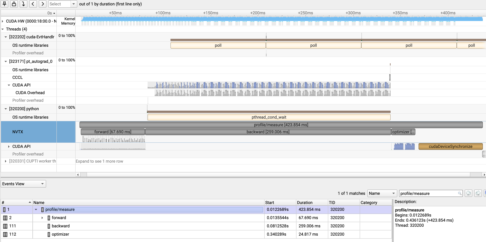
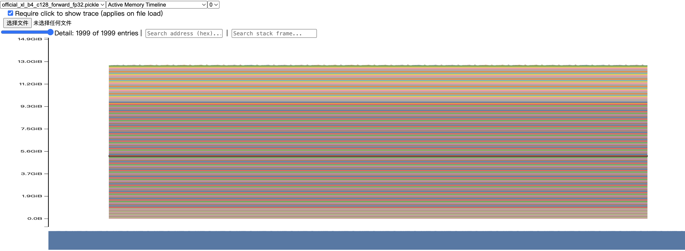
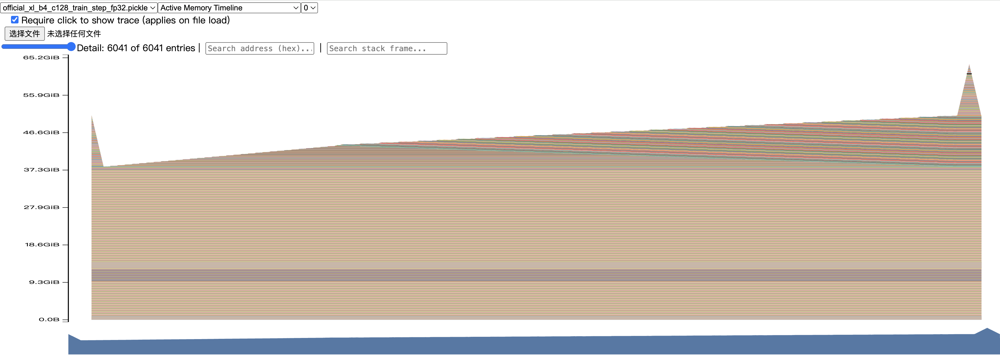

# A2-P Public Submission: 姚寓骞

## Basic Information

- 题面版本：`26.1.4-rc.3`
- 固定 starter commit：`ca8bc81a59b70516f7ebb2da4808daade877c736`
- 完成范围：End-to-End Benchmark、六组 Compute Profiling、Mixed Precision、Memory Profiling。
- 未完成项：无
- 飞书补充文档：无

## Environment

全部正式实验在单张 NVIDIA H100 80GB HBM3 上完成。环境为 Python 3.12.3、PyTorch 2.11.0+cu128、CUDA Runtime 12.8、NVIDIA Driver 570.124.06、Triton 3.6.0 与 Nsight Systems 2025.1.1.65。实验固定随机种子为 0，语言模型词表大小为 10,000。公开 metadata 只保留必要的硬件和软件版本，不含主机名、IP、用户名或内部路径。

## 1. End-to-End Benchmark

统一基线为 small 模型、batch size 4、context length 512、FP32。计时使用 `time.perf_counter()`；模型、优化器和随机 batch 均在计时前创建，每个 CUDA step 在计时结束前调用 `torch.cuda.synchronize()`。`forward` 使用 `torch.no_grad()`；`forward_backward` 包含清梯度、前向、loss 与反向；`train_step` 再包含 `optimizer.step()`。每组稳态实验先预热 5 步，再测量 10 步。

| 模式 | 精度 | 预热 | 均值（ms） | 样本标准差（ms） | CV |
| --- | --- | ---: | ---: | ---: | ---: |
| forward | FP32 | 5 | 12.072 | 0.074 | 0.0061 |
| forward_backward | FP32 | 5 | 39.721 | 0.471 | 0.0119 |
| train_step | FP32 | 5 | 48.136 | 2.983 | 0.0620 |
| train_step | FP32 | 0 | 94.323 | 146.963 | 1.5581 |
| train_step | BF16 autocast | 5 | 54.093 | 2.998 | 0.0554 |

FP32 基线的原始 10 次耗时如下，完整精度数据保存在 `results/benchmark.csv`。

| 模式与预热 | 原始耗时（ms） |
| --- | --- |
| forward，预热 5 | 12.248, 12.117, 12.064, 12.013, 12.076, 12.028, 12.002, 12.069, 12.001, 12.104 |
| forward_backward，预热 5 | 39.641, 39.586, 38.984, 39.212, 40.086, 40.390, 39.650, 39.317, 40.258, 40.086 |
| train_step，预热 5 | 46.313, 47.537, 46.117, 50.860, 52.702, 52.764, 48.049, 44.948, 44.685, 47.383 |
| train_step，预热 0 | 512.512, 51.464, 45.075, 45.373, 45.734, 52.368, 45.744, 46.049, 48.026, 50.880 |

不预热时首步达到 512.512 ms，后续回落到约 45–52 ms，导致均值接近翻倍且 CV 从 0.0620 升至 1.5581。首步包含 CUDA context、allocator 及库/kernel 的首次初始化，因此不能混入稳态性能。代表性复现命令为：

```bash
python profiling/benchmark.py --model-size small --batch-size 4 \
  --context-length 512 --mode train_step --warmup 5 --steps 10 \
  --dtype fp32 --output results/a2p_raw/benchmark.csv
```

## 2. Compute Profiling

主工具为 Nsight Systems。矩阵使用 small/large 两种模型、256/512/1024 三种 context，六组均为 batch size 4、FP32、完整 `train_step`；每组捕获 5 步预热后的 1 个 measurement step。代码标记了 `profile/warmup`、`profile/measure`、`forward`、`backward`、`optimizer`、`attention/scores`、`attention/softmax` 与 `attention/value`。六组轻量汇总和命令分别位于 `results/profile/trace_summary.csv` 与 `results/profile/run_metadata.json`。

| 模型 | Context | Step（ms） | Forward（ms） | Backward（ms） | Optimizer（ms） | Scores / Softmax / Value（ms） |
| --- | ---: | ---: | ---: | ---: | ---: | --- |
| small | 256 | 72.490 | 22.863 | 44.086 | 2.541 | 2.119 / 1.348 / 1.201 |
| small | 512 | 75.747 | 23.154 | 46.961 | 2.667 | 2.084 / 1.401 / 1.664 |
| small | 1024 | 84.704 | 25.341 | 36.111 | 2.446 | 2.491 / 1.528 / 1.711 |
| large | 256 | 215.710 | 64.765 | 118.570 | 7.640 | 5.910 / 4.013 / 3.657 |
| large | 512 | 216.846 | 66.756 | 111.048 | 9.948 | 6.433 / 4.090 / 4.312 |
| large | 1024 | 423.703 | 67.690 | 259.006 | 24.817 | 6.646 / 4.078 / 4.376 |



代表性的 large/context-1024 trace 中，`profile/measure` 的 NVTX CPU 区间为 423.854 ms，独立同步 step 计时为 423.703 ms；其中 backward 259.006 ms，明显高于 forward 67.690 ms 和 optimizer 24.817 ms。三个 attention 子阶段合计 15.099 ms。主要 GPU kernel 是 elementwise multiply，调用 580 次、累计 CUDA 时间 46.192 ms、占 kernel 时间 11.3%；主要 CUDA API 是 `cudaLaunchKernel`，调用 4,913 次、累计 CPU 时间 161.776 ms、占 API 时间 61.9%。naive attention 将 QK、mask、softmax 和 PV 分解成 GEMM、elementwise 与 reduction kernel，大量 launch 和中间显存读写正是后续融合优化的空间。

context 从 512 增至 1024 后，large 的 step 从 216.846 ms 增至 423.703 ms。该增长既来自 attention 的二次复杂度，也受到单步 profiler 扰动和同步开销影响；因此这里用于阶段归因，稳定 latency 结论仍以多步 benchmark 为准。

```bash
nsys profile --force-overwrite=true --trace=cuda,cudnn,cublas,osrt,nvtx \
  --output=results/a2p_raw/profile/large_c1024_train_step_fp32 -- \
  python profiling/benchmark.py --model-size large --batch-size 4 \
  --context-length 1024 --mode train_step --warmup 5 --steps 1 \
  --dtype fp32 --output results/a2p_raw/profile/large_c1024_train_step_fp32.json
```

## 3. Mixed Precision

### Accumulation Accuracy

严格按固定题面依次累加 1,000 次 0.01，期望值为 10.0。

| 写法 | 实际结果 | 绝对误差 |
| --- | ---: | ---: |
| FP32 累加器 + FP32 addend | 10.00013351 | 0.00013351 |
| FP16 累加器 + FP16 addend | 9.95312500 | 0.04687500 |
| FP32 累加器 + FP16 addend | 10.00213623 | 0.00213623 |
| FP16 addend 显式转回 FP32 后累加 | 10.00213623 | 0.00213623 |

FP16 addend 在累加前已经量化，之后转回 FP32 不能恢复丢失的信息，所以后两种写法仍有约 0.00214 的误差。FP16 累加器还会在每次相加时舍入，误差进一步扩大到 0.046875。reduction 顺序会改变舍入路径，FP32 累加器只能减少累加误差，不能消除输入量化误差。

### ToyModel and Language-Model Benchmark

ToyModel 的参数保持 FP32。BF16 autocast 下第一层输出和 logits 为 BF16，LayerNorm 输出、loss 和 gradient 为 FP32；这保护了数值敏感的归一化和 reduction，同时允许矩阵乘使用 BF16。相同 batch 4096、shape 4096×4096、预热 5 步、测量 10 步时，结果如下：

| 精度 | 均值（ms） | 标准差（ms） | 峰值 allocated（GiB） | 峰值 reserved（GiB） |
| --- | ---: | ---: | ---: | ---: |
| FP32 | 0.874 | 0.250 | 0.377 | 0.377 |
| BF16 autocast | 1.022 | 0.316 | 0.439 | 0.439 |

此 ToyModel 上 BF16 慢 16.9%，allocated 峰值高 16.6%，说明小型、未融合工作负载中的转换和调度开销可能超过 Tensor Core 收益。语言模型的 forward-backward 对照则显示规模效应：small 和 medium 的 BF16 分别慢 23.9% 与 17.2%，large 和 XL 的 BF16 分别快 12.1% 与 23.9%。因此不能从单一小模型外推混合精度收益；模型规模、kernel 形状、LayerNorm/reduction 和临时转换都会影响结果。全部 dtype、loss 序列和原始时间位于 `results/mixed_precision.json`。

## 4. Memory Profiling

memory history 在 warm-up 完成后开启。表中的 active/allocated 取 PyTorch allocator 的峰值；reserved 是 allocator 向 CUDA 保留的峰值，两种口径不混用。XL 配置为 `d_model=2560`、`d_ff=10240`、32 层、32 heads。

| 模型 | Batch | Context | 模式 | 状态/阶段 | Active/Allocated（GiB） | Reserved（GiB） |
| --- | ---: | ---: | --- | --- | ---: | ---: |
| XL | 4 | 128 | forward | 成功 | 12.931 | 12.947 |
| XL | 4 | 128 | train_step | 成功 | 64.109 | 64.416 |
| XL | 4 | 2048 | forward | 成功 | 21.323 | 23.477 |
| XL | 4 | 2048 | train_step | OOM，warm-up | 76.480 | — |
| XL | 1 | 2048 | train_step | OOM，warm-up | 77.058 | — |
| XL | 1 | 1024 | train_step | fallback 成功 | 64.057 | 64.490 |
| Large | 1 | 2048 | train_step | fallback 成功 | 45.458 | 46.084 |





forward timeline 中临时 attention allocation 随层出现后释放；train-step timeline 则在前向过程中逐层保留 backward 所需 activation，进入反向后 saved tensors 逐步释放，同时 parameter gradients 被建立，optimizer 阶段还会访问参数、梯度与状态，因此峰值显著高于 forward-only。

FP32 residual stream tensor 的理论大小为

\[
B\,T\,d_{model}\,4\ \text{bytes}.
\]

XL、batch 4 时，context 128 的单个 residual 为 5 MiB，context 2048 为 80 MiB。它远小于 context 2048 下每层 attention score：

\[
4\times32\times2048^2\times4\ \text{bytes}=2\ \text{GiB/层}.
\]

因此 XL/context-2048 train step 即使把 batch 降为 1 仍 OOM 并非静默配置错误；naive attention 和 backward 保存的中间量共同耗尽 80GB 显存。实验按题面顺序继续尝试 XL/context-1024 与 Large/context-2048，二者均成功。失败阶段、异常类型、active 峰值及成功 fallback 均保存在 `results/memory/peaks.csv` 和 `results/memory/run_metadata.json`。

代表性复现命令为：

```bash
python profiling/memory_snapshot.py --model-size xl --batch-size 4 \
  --context-length 2048 --mode train_step --dtype fp32 \
  --output results/a2p_raw/memory/xl_b4_c2048_train_step_fp32.pickle
```

## 5. Limitations and Reproducibility

- Nsight Systems trace 用于单个稳定 step 的归因，包含 profiler overhead；多步 benchmark 才用于稳态 latency。
- 完整 `.nsys-rep`、SQLite、pickle snapshot 和未裁剪 timeline 只保留在本地，不进入公开仓库。
- XL/context-2048 train step 的 batch 4 与 batch 1 均如实记录为 OOM，没有把 fallback 冒充原配置。
- 本实验选择 Nsight Systems 作为六组 trace 的统一主工具；题面允许其与 `torch.profiler` 二选一，因此未额外采集重复的 `torch.profiler` trace。
- 所有报告数字均可回溯到 `results/benchmark.csv`、`results/profile/`、`results/mixed_precision.json` 或 `results/memory/`。

轻量结果可由以下命令从本地原始导出重新生成：

```bash
python profiling/prepare_a2p_results.py \
  --raw-root results/a2p_raw --output results/a2p_submission
```
