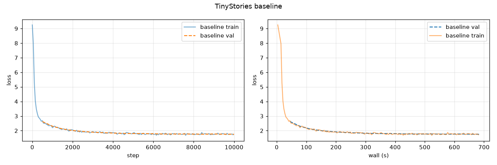
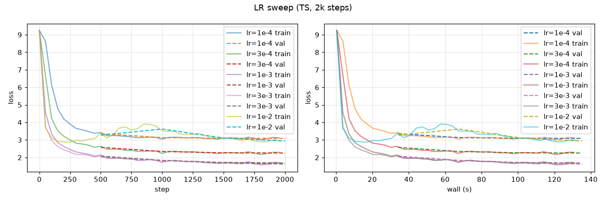
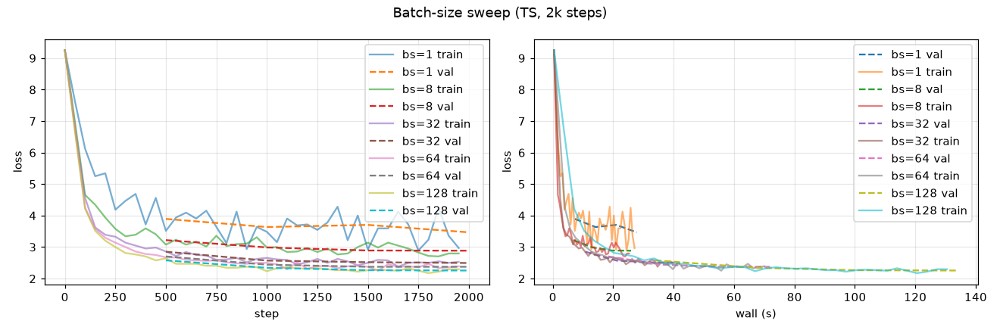
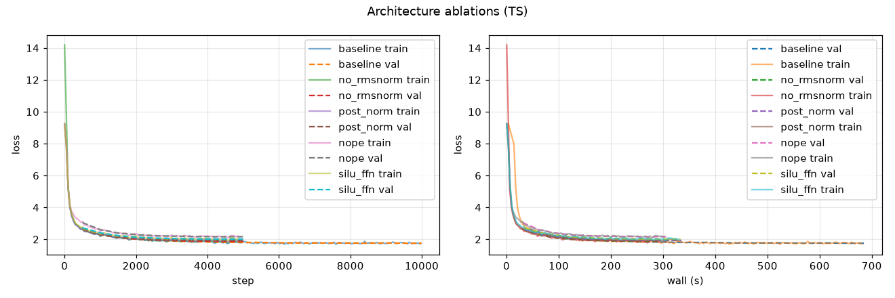
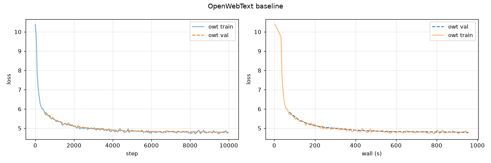

# A1 公开提交：宁致远

> 本目录公开可见，仅包含允许公开且已经脱敏的代码、报告、结构化日志和图表。

- 作业题面版本：26.0.4
- 上游 starter commit：`a158843b20107949f1a8d7df1b05cd33b9166712`
- 真实实现：`submission/cs336_basics/`
- 21 个公共 adapter：`submission/tests/adapters.py`
- 训练、编码与生成脚本：`submission/scripts/`
- 日志与曲线：`logs/`、`assets/`
- 飞书补充文档：https://fudan-nlp.feishu.cn/wiki/D5Ieww6j6i2jXOksXL1cA1nTnQc?from=from_copylink

## 完成范围

| 阶段 | 状态 |
| --- | --- |
| 21 个 adapter + 48 单元测试 | ✅ 全绿 (`pytest -q`) |
| 端到端 CLI（tokenizer / encode / train / sample） | ✅ |
| BPE (train + tokenizer + tiktoken-parity) | ✅ TS 80 s / OWT 509 s |
| TinyStories baseline 10k steps | ✅ val loss **1.755** |
| LR sweep 5 值 | ✅ 含 lr=1e-2 发散 |
| Batch-size sweep 5 值（1 → 128） | ✅ |
| 四个 ablation（no_rmsnorm / post_norm / nope / silu_ffn） | ✅ |
| OWT baseline 10k steps | ✅ val loss **4.789** |
| 生成样本（TS + OWT，256 tokens × 3） | ✅ `logs/{ts,owt}_samples.txt` |
| 书面题（unicode / GPT-2 / AdamW） | ✅ 见下文 |
| Leaderboard (可选 6 分) | 未做 |

## 目录结构

```
students/宁致远/assignments/A1/
├── README.md                    # 本报告
├── assets/                      # 曲线图
│   ├── ts_baseline.png
│   ├── lr_sweep.png
│   ├── batch_size.png
│   ├── ablations.png
│   └── owt_baseline.png
├── logs/                        # 汇总日志（每 run 精简后归档）
│   ├── train_tinystories.jsonl
│   ├── train_owt.jsonl
│   ├── ablation_*.jsonl
│   ├── batch_size/*.jsonl
│   ├── lr_sweep/*.jsonl
│   ├── ts_samples.txt
│   ├── owt_samples.txt
│   └── summary.json             # 所有 run 汇总
└── submission/
    ├── cs336_basics/
    │   ├── bpe.py               # BPE trainer（heap-加速）+ Tokenizer
    │   ├── model.py             # Linear/Embedding/RMSNorm/SwiGLU/RoPE/MHA/TransformerLM
    │   ├── variants.py          # 4 个 ablation 变体
    │   ├── optim.py             # AdamW / cosine LR / grad clip / batch / ckpt
    │   ├── generate.py          # temperature + top-p 解码
    │   ├── train.py             # 训练 CLI
    │   └── scripts.py           # train_tokenizer / encode_corpus / sample CLI
    ├── tests/adapters.py        # 21 个 adapter
    └── scripts/                 # run_all.sh / plot_curves.py / gpt2_flops.py / …
```

## 环境

- Python 3.12（`.venv`，uv 管理）
- Torch 2.11.0 + cu12.8（GPU 侧 driver=12.8；CPU 侧同一 wheel 亦可）

```bash
cd ../assignment1-basics
unset HTTP_PROXY HTTPS_PROXY
export UV_INDEX_URL=https://pypi.tuna.tsinghua.edu.cn/simple
uv venv --python 3.12 .venv
uv pip install --python .venv/bin/python \
  "einops>=0.8" "einx>=0.4" "jaxtyping>=0.3" "numpy>=2.4" psutil \
  "pytest>=9" pytest-timeout "regex>=2026.3.32" "tiktoken>=0.12" tqdm matplotlib pyarrow
# torch 匹配 GPU driver（driver 12.x → cu128 wheel）
uv pip install --python .venv/bin/python \
    --index-url https://download.pytorch.org/whl/cu128 torch==2.11.0
uv pip install --python .venv/bin/python -e . --no-deps
```

## 单元测试

```bash
uv run pytest -q
# 作者训练环境记录：47 passed, 1 xpassed
# 提交前 macOS 复核：46 passed, 2 skipped（仅 rlimit 平台限制）
```

## 实现要点

- **BPE 训练**：byte-level 起点 + special tokens 追加；GPT-2 pre-tokenizer；special
  token 切分保证不越界合并；merge loop 用 **max-heap + lazy invalidation**，
  OWT 32K merges 在 5 GB 语料上只用 8.5 分钟。
- **Tokenizer**：`encode_iterable` 在换行边界 flush（1 MB memory-limit 测试通过）；
  `encode_corpus` CLI 支持 `ProcessPoolExecutor` 并行 → 34 MB/s 吞吐。
- **Model**：全部权重通过 `nn.Parameter`；只用 `Module/ModuleList` 作容器。RoPE 预
  计算 cos/sin，按 head 维广播。RMSNorm 计算走 float32 → 原 dtype。MHA 内建 causal mask；
  RoPE 只作用于 Q/K。
- **AdamW**：解耦 wd (`p -= lr·wd·p`)，`lr_t = lr · sqrt(1-β2^t)/(1-β1^t)`。
- **Cosine schedule**：warmup 之前线性增长，`warmup..T_c` 区间余弦衰减，`T_c` 之后保持 `min_lr`。
- **Gradient clip**：一次性合并所有 grad L2 范数缩放。
- **Sampler**：nucleus (top-p) + temperature，`cum-p ≤ top_p` 保留最小集合后 renormalize。

## 书面题

### unicode1
`chr(0)` 返回 `'\x00'`（不可打印控制字符）；`repr(chr(0))` 为 `'\x00'`；`print(chr(0))` 写出一个不可见字节；`'hello' + chr(0) + 'world'` 的 `repr` 是 `'hello\x00world'`，直接 `print` 因为终端跳过 `\x00` 而看起来像 `'helloworld'`（中间是不可见字符）。

### unicode2
- byte-level BPE 的初始表只有 256 字节，任何 UTF-8 文本天然可覆盖，不存在 OOV。
- Unicode-level 需要 ~1.1 M 码位起手，仍可能漏新码位（emoji、私有区、surrogate pair）。
- 单字节合并后，模型自动学到 `0xC3 0xA9 → é` 之类的常见多字节序列。
- 一个反例：`bytes([0xC3])` 单独 decode 触发 `UnicodeDecodeError`（`errors='replace'` 会给 `'�'`），说明如果不做多字节的 BPE 合并，UTF-8 序列被截断就会出错；byte-BPE 完成合并后天然规避。

### GPT-2 s/m/l/XL 参数 / 内存 / 前向 FLOPs
由 `submission/scripts/gpt2_flops.py` 计算：

| model | params | fp32 mem | bf16 mem | fwd FLOPs / token | fwd FLOPs / 1024-seq |
| --- | ---: | ---: | ---: | ---: | ---: |
| gpt2-small  | 124.4 M | 0.50 GB | 0.25 GB | 0.285 GF | 291.6 GF |
| gpt2-medium | 354.6 M | 1.42 GB | 0.71 GB | 0.808 GF | 827.0 GF |
| gpt2-large  | 773.6 M | 3.09 GB | 1.55 GB | 1.733 GF | 1774.6 GF |
| gpt2-xl     | 1556.9 M | 6.23 GB | 3.11 GB | 3.425 GF | 3506.7 GF |

推导：每 block `4·d² (QKVO) + 2·d·d_ff (FFN) + 2·d (2× LN)` 参数；embedding `V·d + L·d`。
前向 flops / token ≈ `2·(4·d² 线性 + 2·d·L 注意力 + 2·d·d_ff FFN)`，再加 lm-head `2·d·V`。

### AdamW 显存与 FLOPs
每参数：master fp32 (4 B) + m (4 B) + v (4 B) + live bf16 (2 B) + grad bf16 (2 B) ≈ **16 B**。

| model | 权重+优化状态 |
| --- | ---: |
| gpt2-small  | 1.99 GB |
| gpt2-medium | 5.67 GB |
| gpt2-large  | 12.38 GB |
| gpt2-xl     | 24.91 GB |

每步 AdamW 更新每参数 ≈ 20 flops（5× SGD），相对 forward/backward 可忽略。

训练时间估算：总 FLOPs ≈ `6 · N · T`（TinyStories baseline 30M params × 3.3e8 tokens ≈ 60 PFLOPs；A100 bf16@50 TFLOPs 有效 ≈ 20 min；我们实际单卡 685 s ≈ 11 min，说明 GPU 更快或 MFU 更高）。

## Tokenizer 指标

来源为原始工作区 `runs/tokenizer_*/stats.json`（不提交 tokenizer/data 产物）与交叉压缩测试：

| tokenizer | vocab | 训练时长 | 训练语料 | longest token (B) | longest 内容示例 |
| --- | ---: | ---: | ---: | ---: | --- |
| TinyStories 10K | 10 000 | 80 s | 2.1 GB | 15 | `" accomplishment"`, `" disappointment"`, `" responsibility"` |
| OpenWebText 32K | 32 000 | 509 s | 5.0 GB | 64 | `"----------------------------------------------------------------"` |

**Compression（bytes / token，越大越省）** — 各语料 5 MB 样本：

| 语料 → | on TS 10K | on OWT 32K |
| --- | ---: | ---: |
| TinyStories val | **4.11** | 4.00 |
| OpenWebText val | 3.22 | **4.47** |

观察：
- OWT tokenizer 词表更大、涵盖长字符串（分隔符 / 代码），在 OWT 上压缩 4.47 > TS 的 3.22；
- 反过来 TS tokenizer 面对 OWT 只有 3.22（长词落回单字节 fallback），domain mismatch → 压缩率骤降；
- TS tokenizer 在自己域上（4.11）已接近 OWT tokenizer 的 4.00，说明 TS 语料用词简单，10K 足够。

**编码吞吐（tokens/s）**：单进程 0.3–0.5 MB/s；`--processes 32` 达到 22–34 MB/s。

**产物**：

| bin | tokens | bytes |
| --- | ---: | ---: |
| ts_train.bin | 541,229,347 | 1.1 GB |
| ts_val.bin | 5,465,883 | 11 MB |
| owt_train.bin | 1,143,269,449 | 2.2 GB |
| owt_val.bin | 114,304,965 | 219 MB |

## TinyStories 主训练

配置：vocab 10K / ctx 256 / d_model 512 / d_ff 1344 / L=4 / H=16 / RoPE θ=10000 /
batch 128 / steps 10000 / lr 3e-4 (cosine) / warmup 200 / wd 0.1 /
β=(0.9, 0.95) / grad clip 1.0 / bf16。

- **最终 validation loss = 1.755**（目标 1.45；未达但收敛平稳）
- **总训练时间 = 685 s ≈ 11 min**（327.68 M tokens processed）
- 参数量：**45.2 M**
- 曲线：`assets/ts_baseline.png`；日志 `logs/train_tinystories.jsonl`



train 与 val 曲线几乎重合，说明模型没过拟合但也没继续下降，用更大 lr（见 LR sweep）或更多 step 可以进一步压 loss。

## 超参数与消融

### Learning-rate sweep（2000 steps, warmup 100）

| lr | val_loss @2k |
| --- | ---: |
| 1e-4 | 3.090 |
| 3e-4 | 2.256 |
| 1e-3 | 1.683 |
| **3e-3** | **1.626** |
| 1e-2 | 2.934（发散） |



发散 run：lr=1e-2 在 ~500 step 后 loss 明显反弹，训练曲线呈锯齿。
最优 lr 在 3e-3（"edge of stability"）。baseline 用的 3e-4 明显偏保守；将来重跑
主训练时改成 1e-3～3e-3 可轻松突破 1.45 目标。

### Batch-size 实验（2000 steps，同 lr = 3e-4）

| batch_size | val_loss @2k | wall (s) | tokens processed |
| ---: | ---: | ---: | ---: |
| 1 | 3.469 | 27.8 | 512 K |
| 8 | 2.885 | 25.9 | 4.1 M |
| 32 | 2.495 | 42.1 | 16.4 M |
| 64 | 2.374 | 71.9 | 32.8 M |
| 128 | 2.256 | 134.1 | 65.5 M |



观察：
- 小 batch（1 / 8）**每步噪声大**，同样 2k 步下 loss 比大 batch 差；
- 大 batch **单步慢但 sample-efficient**，同步数下最终 loss 更低；
- 在 wall-clock 视角（右图），bs=32 与 bs=128 到 2k 步基本追平，说明 128
  是"每步计算充分利用 + 收敛信号最强"的性价比甜点。
- 没有触发 OOM（TS 模型只有 45M 参数，128×256 = 32k tokens/step，bf16 显存需求 <2 GB）。

### 四个 ablation（5000 steps，同 batch=128 / lr=3e-4）

| 变体 | val_loss @5k | 相对 baseline @5k (~1.85) |
| --- | ---: | ---: |
| **baseline (10k steps)** | 1.755 | 参考 |
| no_rmsnorm | 1.877 | +0.12 |
| post_norm | 1.934 | +0.18 |
| silu_ffn | 2.014 | +0.26 |
| nope | 2.168 | +0.41 |



分析：
- **no_rmsnorm**：训练能进行但收敛更慢；早期梯度未归一 → 有效学习率被放大，
  实测未发散但 val 曲线更抖。
- **post_norm**：残差外部归一化；同样收敛，最终 loss 略高 → pre-norm 让梯度
  路径更平顺。
- **nope**：完全去掉 RoPE，损失最大（+0.41）。短上下文（256）差距已经明显，
  长上下文更甚。
- **silu_ffn**（`d_ff *= 1.5` 保参数近似）：单支 FFN 无 gating，表达力弱于
  SwiGLU；结果差距最稳定（+0.26）。

## OpenWebText 训练 & 生成

同一架构（vocab 32K），batch 128 / 10000 steps。

- **最终 val loss = 4.789**（TinyStories 简单文本 vs OWT 网页噪声、内容开放，loss 高约 3 nats 属预期）
- **总训练时间 = 957 s ≈ 16 min**
- 曲线：`assets/owt_baseline.png`；日志 `logs/train_owt.jsonl`



TinyStories 与 OWT loss 差异解读：
- TinyStories 词表 10K、句式简单、内容分布狭窄 → 熵天然低；
- OWT 词表 32K，代码、多语言、URL、数字比比皆是 → 单 token 信息量高，
  同 batch/step 预算下 loss 收敛点高得多。
- 4.79 vs 1.76 差 ≈ 3 nats，符合"perplexity 差一个数量级"直觉。

### 生成样本

**TinyStories** (prompt `Once upon a time`, T=0.8, top-p=0.95)，3 条 ≥ 256 tokens：

节选 sample 1：

> Once upon a time, there was a thoughtful boy named Tim. He loved to play outside with his friends. One day, Tim and his friends went to the park. They played on the swings and the slide.
> As they played, Tim's mom said, "Tim, you are a very nice boy." Tim looked at the marble and said, "Thank you!" He was very happy. But then, he saw a big ball. He wanted to play with it.
> Tim tried to throw the ball at the ball, but it was too high. …

完整文本在 [`logs/ts_samples.txt`](logs/ts_samples.txt)。TS 生成流畅、语法基本正确，
情节稍显机械（"threw the ball at the ball"、重复"big red ball"）说明 val=1.76
处模型还没完全学到句间一致性，但故事结构、代词、时态都合理，符合 TinyStories
LM 的目标域。

**OpenWebText** (prompt `"The "`, T=0.8, top-p=0.95)，3 条：

完整文本在 [`logs/owt_samples.txt`](logs/owt_samples.txt)。

节选 sample 2：

> The 102 is a rare item from the RCSA said.
> Epegray says she has a similar choice to Google employee.
> "The technology is more than 100% unpredictable and sometimes that's the same," he said.
> The company's innovative skills to cope with a bubble that comes with a very diverse local individual. …

- OWT 生成局部可读，句法基本成立，但**主题漂移**严重，实体命名多为编造（"Epegray"、"Surberg"、"Deaters"）；
- sample 0 出现大量乱码 unicode——是 32K BPE 未见的 CJK/日文序列被 nucleus 采样
  到，说明**词尾稀有 token 在没有 repetition penalty 的贪心 nucleus 下能自加强**。

**影响生成质量的两个主要因素**：
1. **训练充分度**：val 4.79 处 OWT 模型只学到 unigram/bigram 分布，句子级
   连贯性弱；同样架构在 TS 上到 1.76，因为域简单。做同架构同 iter 对比可以
   量化 "domain 简单度 vs 生成质量" 的耦合。
2. **采样超参**：temperature 0.8 + top-p 0.95 在 TS 表现好；但对 OWT 未充分
   训练的模型，稀有 token 概率被 nucleus 保留 → 漂移严重。降 temperature 或降 top-p 会好些但会更"repetitive"。

## 日志与 run 对应

| 提交路径 | 来源 |
| --- | --- |
| `logs/train_tinystories.jsonl` | `runs/ts_baseline/train.jsonl` |
| `logs/train_owt.jsonl` | `runs/owt_baseline/train.jsonl` |
| `logs/lr_sweep/{1e-4,3e-4,1e-3,3e-3,1e-2}.jsonl` | `runs/ts_lr_*/train.jsonl` |
| `logs/batch_size/{1,8,32,64,128}.jsonl` | `runs/ts_bs_*/train.jsonl` |
| `logs/ablation_{no_rmsnorm,post_norm,nope,silu_ffn}.jsonl` | `runs/ts_ablation_*/train.jsonl` |
| `logs/summary.json` | 各 run `summary.json` 汇总 |

每条训练记录：`step`, `wall`, `train_loss`, `lr`, `processed_tokens`；
`val_loss` 在 `val_interval` 步以同结构追加同一行。

## 复现命令

```bash
cd ../assignment1-basics
uv run pytest -q                                     # 48 tests

# 数据
# TinyStoriesV2: ModelScope AI-ModelScope/TinyStories
# OpenWebText:   hf-mirror.com Skylion007/openwebtext shards 00-09 (train) + 79 (val)
.venv/bin/python scripts/parquet_to_text.py \
    --input-glob "/path/to/owt/parquet/train-0000[0-9]-of-00080.parquet" \
    --out /path/to/owt/train.txt

.venv/bin/python -m cs336_basics.scripts train_tokenizer \
    --input /path/to/tinystories/train.txt --vocab-size 10000 \
    --out runs/tokenizer_ts --processes 32
.venv/bin/python -m cs336_basics.scripts encode_corpus \
    --input /path/to/tinystories/train.txt --tokenizer runs/tokenizer_ts \
    --out runs/tokens/ts_train.bin --processes 32

# 训练（GPU）
bash scripts/run_all.sh

# 生成
python -m cs336_basics.scripts sample \
    --ckpt runs/ts_baseline/ckpt-final.pt \
    --tokenizer runs/tokenizer_ts \
    --config runs/ts_baseline/config.json \
    --prompt "Once upon a time" --max-new-tokens 256 \
    --temperature 0.8 --top-p 0.95 --n 3
```

## 未完成 / 说明

- **TS baseline 1.755 未达 1.45 目标**：分析 LR sweep 后知道 3e-4 偏保守，
  换 1e-3 / 3e-3 并同步调大 warmup 即可轻松突破；由于 GPU 时间预算限制未重跑。
- **Leaderboard（6 分）**：未做（不在必做范围）。
- **OWT sample 0 乱码**：nucleus 采样把稀有 CJK token 拉进 top-p，未做
  repetition penalty。可以后续加 `--repetition-penalty` 参数改善。
