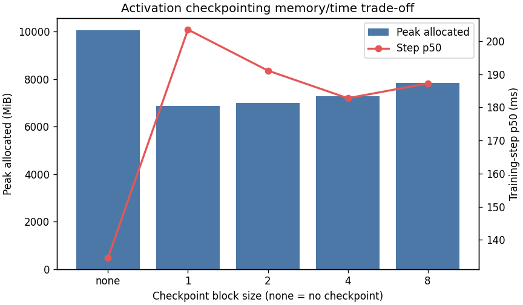
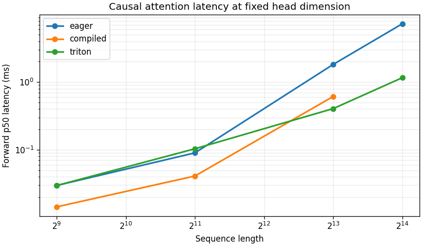

# A2-K：单卡显存优化与 GPU Kernels（左景萱）

> 证据边界：代码、官方 GPU 测试、扩展正确性和固定矩阵均已完成；本次设备是单张 NVIDIA GeForce RTX 4090，但报告总显存为 49140 MiB，并非题面指定的 24GB 型号。因此所有数值均标为 `development_non_authoritative`。我使用同一个 23552 MiB allocator 上限验证 24 GiB 预算内的 PyTorch 峰值，但不把它冒充正式 24GB 硬件证据。

## 基本信息

- 题面版本：`26.1.4-k-rc.3`
- 固定 starter commit：`ca8bc81a59b70516f7ebb2da4808daade877c736`
- 完成范围：activation checkpointing、显式与 compiled attention、Pure PyTorch tiled attention、学生 Triton forward 与 backward、官方 GPU 测试、扩展正确性、66 项性能矩阵、结果汇总与可视化
- 未完成项：题面指定的 RTX 4090 24GB 正式复跑；A2-K 已正式发布，当前 48GB 结果仅为 `development_non_authoritative` 证据
- 上游工作仓库：SummerQuest 同级的 `assignment2-systems` 仓库

## 环境、协议与可复现边界

| 项目 | 本次脱敏记录 |
| --- | --- |
| GPU | NVIDIA GeForce RTX 4090；单卡、串行；总显存 49140 MiB（非标准 24GB 卡） |
| 开跑前空闲显存 | 46730 MiB，大于 22 GiB 门槛 |
| Driver / CUDA | 570.124.06 / 12.8 |
| PyTorch / Triton | 2.11.0+cu128 / 3.6.0 |
| power limit / P-state | 450 W / P8（开跑前快照）；未手动超频或降功耗 |
| TF32 | performance 与 FP32 correctness 都为 IEEE（TF32 关闭） |
| compile | inductor，fullgraph=True，dynamic=False，每个 case 独立私有 cache |
| allocator | 首次 CUDA tensor allocation 前设置 23552 MiB；实际 fraction 0.4854174583 |
| 性能计时 | attention 使用 do_bench：warm-up 100 ms、measurement 300 ms、quantiles 0.2/0.5/0.8 |
| 运行隔离 | 1 张可见 GPU；unit/correctness/checkpoint/compile/attention 均为 fresh process，严格串行 |

完整脱敏配置见 [run_metadata.json](results/run_metadata.json)，显存汇总见 [memory_evidence.json](results/memory_evidence.json)。

## 1. Activation Checkpointing

### 1.1 理论分析

只讨论 activation、忽略参数和 optimizer state。把 N 个 block 分成长度 k 的非嵌套区间时，forward 只保留约 N/k 个区间边界；backward 重放一个区间时还要同时持有至多 k 个局部 activation，因此峰值为 Θ(N/k + k)，总重计算仍为 Θ(N)。令 k≈√N 可得到 Θ(√N) activation memory。

如果允许嵌套 checkpoint，平衡二分递归可把峰值降到 Θ(log N)，代价是 Θ(N log N) 计算。题目所说“忽略计算代价”下还可以走到极端：只保留输入/常数个边界，每反传一层都从最近边界重放前缀，activation memory 为 Θ(1)，但总计算为 Θ(N²)。因此最低显存方案是嵌套/反复前缀重放；实验实现选择非嵌套区间，因为它有更实用的线性重计算代价。

下面是实际采用的边界骨架，共 9 行；注释处是唯一跨区间保存的 activation，autograd 在 backward 时重放对应 segment：

~~~python
def checkpointed_forward(blocks, x, k):
    for start in range(0, len(blocks), k):
        stop = min(start + k, len(blocks))
        def segment(h, start=start, stop=stop):
            for layer in blocks[start:stop]:
                h = layer(h)
            return h
        x = checkpoint(segment, x, use_reentrant=False)  # saved boundary
    return x
~~~

### 1.2 固定矩阵

24 层 Stanford medium（423,183,360 个 FP32 参数）、batch 1、BF16 autocast、AdamW；每行 3 次 warm-up 和 5 次 measurement。下表来自 [checkpointing.csv](results/checkpointing.csv)。

| context | checkpoint block | step p50 (ms) | peak allocated (MiB) | peak reserved (MiB) | 状态 |
| ---: | ---: | ---: | ---: | ---: | --- |
| 1024 | 0 | 134.607 | 10067.5 | 10224 | ok |
| 1024 | 1 | 203.513 | 6865.4 | 6986 | ok |
| 1024 | 2 | 191.123 | 7004.6 | 7162 | ok |
| 1024 | 4 | 182.787 | 7283.0 | 7372 | ok |
| 1024 | 8 | 187.248 | 7841.1 | 7962 | ok |
| 2048 | 0 | 381.283 | 19665.3 | 20240 | ok |
| 2048 | 1（1024 最低显存） | 487.815 | 8062.9 | 8634 | ok |

在 context 1024，block=1 相对 baseline 降低 31.8% peak allocated，但 step p50 增加 51.2%；block sizes 2、4、8 分别降低 30.4%、27.7%、22.1%，耗时增加 42.0%、35.8%、39.1%。最低显存不是只由“checkpoint 数量”决定：区间边界、重放时同时存活的张量、autograd bookkeeping、kernel 调度和 allocator rounding 都参与峰值；block=1 的边界最多，虽然局部重放最短，仍可能最慢。context 2048 的 block=1 将 peak allocated 从 19665.3 MiB 降到 8062.9 MiB（59.0%），耗时增加 27.9%，且 baseline 与 checkpoint 均真实完成，无 OOM 或 fallback。

## 2. 显式 PyTorch Attention 与 torch.compile

### 2.1 显式基线

基线明确执行 QKᵀ、除以 √d、causal mask、softmax 和 PV；没有调用 scaled_dot_product_attention、第三方 FlashAttention 或其他 fused attention。输入创建不计时，forward、backward、forward-backward 分开同步测量。18 个核心 eager 结果及长序列边界行见 [attention_baseline.csv](results/attention_baseline.csv)。

### 2.2 Compile 对照

首次调用与 steady state 分开；attention steady 窗口按实际 CUDA-event 累计达到 100/300 ms，small Transformer 使用 3 次 warm-up 和 5 个原始样本。下表来自 [compile_comparison.csv](results/compile_comparison.csv)。

| workload / phase | compiled cold (ms) | eager steady p50 (ms) | compiled steady p50 (ms) | steady speedup |
| --- | ---: | ---: | ---: | ---: |
| attention 512×64 / fwd+bwd | 2728.521 | 0.553 | 0.426 | 1.30× |
| attention 2048×128 / fwd+bwd | 3273.375 | 0.460 | 0.468 | 0.98× |
| attention 8192×128 / fwd+bwd | 3985.394 | 4.255 | 1.737 | 2.45× |
| small ctx512 / forward | 17175.540 | 11.234 | 3.528 | 3.18× |
| small ctx512 / fwd+bwd | 37216.615 | 47.553 | 14.707 | 3.23× |
| small ctx512 / training step | 37049.256 | 62.283 | 29.414 | 2.12× |

`fullgraph=True` 使 graph break 直接成为失败，而 24/24 行均为 ok；这证明被测图没有静默 graph break。`dynamic=False` 意味着每个固定 shape 专门编译，不能把这些数字外推到任意 shape。每个 case 使用新进程和私有 cache，确保 cold 数字没有被上一个 case 的编译产物污染；代价也很明显：2.7–37.2 秒 cold-start 只有在重复调用后才能摊薄。短 attention 的 steady 收益依赖 shape：512 为 1.30×，2048×128 为 0.98×；8192 和完整模型的 kernel fusion/launch reduction 才足以覆盖额外开销。

## 3. FlashAttention-2 Forward

### 3.1 Pure PyTorch tiled reference

Pure PyTorch path 按 query/key 各 64 行分块，逐 key tile 更新 FP32 row maximum、normalizer 和 output accumulator。它只保存 Q、K、V、O，以及唯一一个形状为 [batch, n_queries] 的 FP32 log-sum-exp L；不调用 Triton，作为公式和 autograd 参考。Backward 重新计算 score/probability，再输出 dQ、dK、dV。

### 3.2 学生 Triton kernel

Triton launch grid 为 `(ceil_div(n_queries, 64), flattened_batch)`；每个 program 拥有一个 query tile，以显式 stride/pointer offset 加载 Q，并在 kernel 内循环 K/V tiles。默认 BF16 性能配置是 query tile 64、key tile 64、4 warps、2 stages。每轮 online softmax 使用：

- m_new = max(m_old, rowmax(S_tile))
- l_new = exp(m_old−m_new)·l_old + sum(exp(S_tile−m_new))
- acc_new = exp(m_old−m_new)·acc_old + exp(S_tile−m_new)·V_tile
- O = acc/l，L = m + log(l)

m、l、acc 和 dot accumulation 均为 FP32。causal 路径把 key_position > query_position 设为 −∞，并把 key 循环截断到当前 query tile 的末端；ragged query/key/dimension 都有边界 mask。FP32 且 padded block-D=128 时改用 32×32、2 stages，避免超过 Ada 每 block 的 shared-memory 上限；BF16 正式性能 tile 不受影响。实现位于 [attention.py](submission/cs336_systems/a2k/attention.py)，adapter 返回类对象而非包装已有 fused kernel。

## 4. Backward 与正确性

### 4.1 重计算式 backward

对每个 query row 先计算 D = sum(O ⊙ dO)，随后在 tile 内重算：

- P = exp(S−L)
- dP = dO·Vᵀ
- dS = P ⊙ (dP−D)
- dQ = dS·K/√d
- dK = dSᵀ·Q/√d
- dV = Pᵀ·dO

Triton dQ kernel 由 query tile 独占并流式读取 K/V；dK/dV kernel 由 key tile 独占并流式读取 Q/dO，所以无需原子加或持久化 N×N score。额外持久张量只有长度为 query 数的 FP32 D。BF16 backward 使用 dQ 64×32、dK/dV 32×64、3 stages；FP32 padded-D=128 使用 32×32、2 stages。

### 4.2 官方 GPU tests

[unit_tests.txt](results/unit_tests.txt) 记录了原命令 `uv run pytest tests/test_attention.py -v` 的脱敏聚合：

- collected 6
- passed 6
- failed 0
- skipped 0
- xfailed/xpassed/errors 均为 0

### 4.3 扩展正确性

[correctness.json](results/correctness.json) 含 3 个 seed（17/42/336）× D=32/64/128 × causal/non-causal 的 18 个 BF16 case，以及 TF32 关闭的 FP32 D=128 causal 哨兵；Pure PyTorch 与 Triton 共 38/38 implementation checks 通过。

| dtype / 实现 | O max abs/rel | L max abs/rel | dQ max abs/rel | dK max abs/rel | dV max abs/rel |
| --- | ---: | ---: | ---: | ---: | ---: |
| BF16 / PyTorch tiled | 7.52e-3 / 4.41e-3 | 4.77e-7 / 3.04e-6 | 1.06e-2 / 41.72 | 7.63e-3 / 215.19 | 1.52e-2 / 1.59e-2 |
| BF16 / Triton | 8.11e-3 / 53.02 | 9.54e-7 / 3.03e-6 | 1.06e-2 / 262.91 | 9.08e-3 / 511.00 | 1.52e-2 / 22.42 |
| FP32 / PyTorch tiled | 4.17e-7 / 2.48e-3 | 4.77e-7 / 2.09e-7 | 4.87e-7 / 4.87 | 5.96e-7 / 2.16e-3 | 1.43e-6 / 8.99e-2 |
| FP32 / Triton | 8.94e-7 / 9.54e-3 | 4.77e-7 / 2.03e-7 | 6.56e-7 / 6.31 | 1.07e-6 / 3.03e-3 | 2.38e-6 / 5.21e-2 |

BF16 使用 atol=0.04、rtol=0.05，FP32 使用 atol=rtol=2e-4。部分 max relative error 很大，是参考值接近 0、分母下限为 1e-7 的结果；逐元素判定使用 `abs_error ≤ atol + rtol·abs(reference)`，对应 max absolute error 仍远低于 atol，所有 tensor 均通过。

## 5. 性能矩阵

固定 batch 1、BF16、causal；每行都记录 p20/p50/p80、peak allocated/reserved 和同 shape eager speedup。完整 66 行在 [flash_benchmark.csv](results/flash_benchmark.csv)。下表摘录 forward-backward p50；16384 边界按题面只比较 eager/Triton。

| N | D | eager p50 (ms) | compiled p50 (ms) | Triton p50 (ms) | Triton/eager | reserved eager → Triton (MiB) |
| ---: | ---: | ---: | ---: | ---: | ---: | ---: |
| 512 | 64 | 0.218 | 0.269 | 0.079 | 2.77× | 280 → 258 |
| 512 | 128 | 0.265 | 0.182 | 0.094 | 2.82× | 280 → 258 |
| 2048 | 64 | 0.309 | 0.276 | 0.205 | 1.51× | 340 → 260 |
| 2048 | 128 | 0.229 | 0.177 | 0.331 | 0.69× | 342 → 262 |
| 8192 | 64 | 4.189 | 1.586 | 0.792 | 5.29× | 926 → 268 |
| 8192 | 128 | 4.260 | 1.667 | 1.283 | 3.32× | 1046 → 298 |
| 16384 | 64 | 16.884 | — | 2.037 | 8.29× | 3094 → 298 |
| 16384 | 128 | 17.096 | — | 3.282 | 5.21× | 3114 → 318 |

短序列时 launch、online-softmax bookkeeping 和三段 backward kernel 的固定成本占比高：N=2048、D=128 的 Triton fwd+bwd 反而只有 0.69× eager；这不是删行，而是保留的真实结果。序列变长后，显式 eager 的 N² score/probability traffic 主导，Triton 的 tile 重用与线性持久状态开始占优：N=16384、D=128 达到 5.21×，reserved 从 3114 MiB 降至 318 MiB（约 89.8%）。本矩阵 66/66 都成功，无 OOM 或 compile failure；即便失败，runner 也会保留失败行并继续后续 Triton case。

## 6. 显存证据、限制与复现

[memory_evidence.json](results/memory_evidence.json) 汇总 159 条显存观测。全套最高 peak allocated 为 19665.3 MiB，最高 peak reserved 为 20240 MiB，来源是 context-2048 无 checkpoint；低于 23552 MiB allocator limit，故 `within_24gib=true`。这只能证明 PyTorch allocator 口径下没有越过题面预算；由于物理卡总显存是 49140 MiB，`formal_rtx4090_24gb_evidence=false`，仍需在真实 24GB 4090 上复跑后才能转成正式性能结论。

最小复现步骤（在固定 starter commit、单张空闲 24GB RTX 4090 上）：

~~~bash
uv run pytest tests/test_attention.py -v
python -m student_scripts.a2k.run_suite --run-id a2k-formal-rerun
python -m student_scripts.a2k.summarize   --raw-dir .runtime/a2k/raw/a2k-formal-rerun   --results-dir public-results/results   --assets-dir public-results/assets
~~~

在更大或非标准开发 GPU 上只可显式增加 `--development-cuda`，汇总器会强制写成 non-authoritative。完整日志、逐 case 编译 cache 与中间产物保留在私有实验工作区；公开目录只含 8 个轻量结果文件和 2 张 PNG，总计 241915 B（约 236 KiB）。

## 飞书补充文档

- 组织内文档：https://fudan-nlp.feishu.cn/docx/SrsSd4yQBoToMNxS6t0cAGrqnmc
- 已回读验证 revision 5；只包含方法、聚合里程碑和证据边界，不包含凭据、内部资源标识、绝对路径或原始环境转储。

## 自检

- [x] 固定 starter commit 正确，代码只同步 A2-K allowlist。
- [ ] 正式结果来自 RTX 4090 24GB（当前为 48GB 4090 development evidence，未冒充正式结果）。
- [x] 单卡串行、fresh process，首次 CUDA allocation 前设置 23552 MiB allocator 上限。
- [x] checkpoint 1024 标准矩阵与 2048 边界完整，无静默降配。
- [x] 显式 PyTorch baseline 未调用已有 fused attention。
- [x] Pure PyTorch tiled 与学生 `@triton.jit` forward/backward 均通过正确性。
- [x] 官方 GPU tests 如实记录为 6 passed、0 failed、0 skipped。
- [x] 核心 54 项与 16384 边界 12 项使用同硬件、dtype、causal 和计时边界。
- [x] 两张图片均由提交 CSV 生成并被 README 引用。
- [x] 附件体积、文件类型和敏感信息扫描通过。
- [x] 未提交 cache、binary、trace、权重、数据、压缩包或依赖环境。
