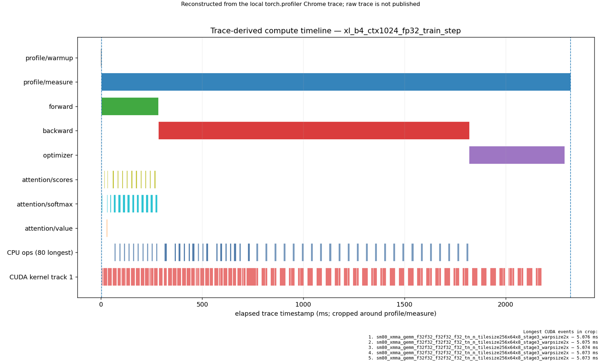
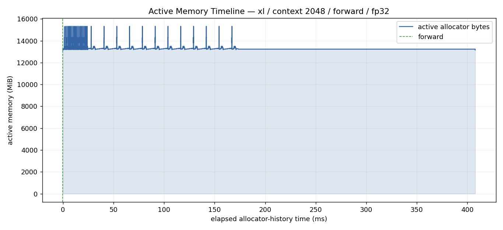
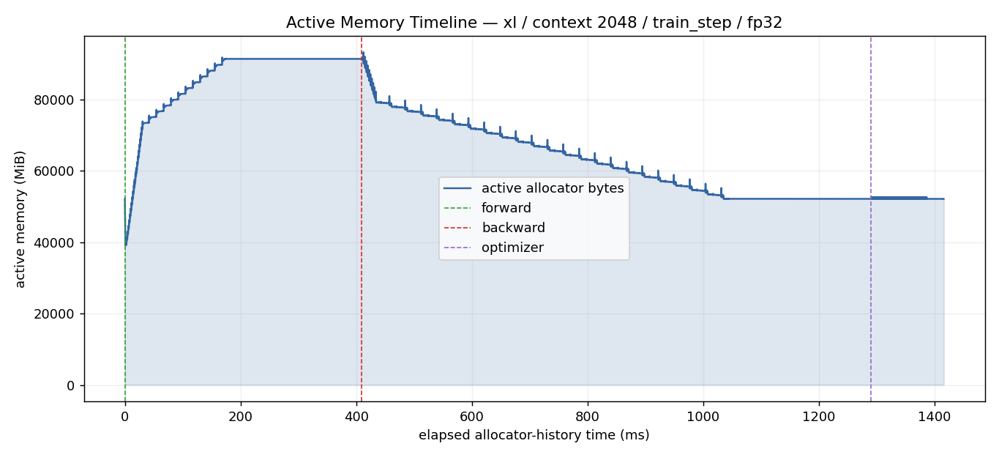

# A2-P：Profiling 与性能分析——左景萱

> 本目录公开可见，只包含脱敏后的代码、轻量汇总和关键图片。完整 Chrome trace、memory
> snapshot 与 MemoryViz HTML 仅在受控环境中保留，不进入 GitHub 或飞书正文。

正式要求见 [`assignments/A2-P/README.md`](../../../../assignments/A2-P/README.md)，评分说明见
[`assignments/A2-P/EVALUATION.md`](../../../../assignments/A2-P/EVALUATION.md)。实验基于
[starter commit `ca8bc81a59b70516f7ebb2da4808daade877c736`](https://github.com/stanford-cs336/assignment2-systems/commit/ca8bc81a59b70516f7ebb2da4808daade877c736)
及其[固定版本 PDF](https://github.com/stanford-cs336/assignment2-systems/blob/ca8bc81a59b70516f7ebb2da4808daade877c736/cs336_assignment2_systems.pdf)。

## 基本信息

- 题面版本：`26.1.4-rc.3`（已发布，可提交）。
- 完成范围：End-to-End Benchmark、六个 Compute Profile、四种累加实验、ToyModel、五种规模
  的 FP32/BF16 benchmark，以及规定的八个 XL memory case。
- 未完成项：无。
- OOM / fallback：八个规定 memory case 均为 `ok`，`is_fallback=False`，没有触发 fallback。
- 提交状态：题面已发布；本次 PR 仅提交本目录。

## 环境与工具

环境字段可回溯到 `results/profile/run_metadata.json` 与
`results/mixed_precision.json`。

| 项目 | 公开、脱敏的信息 |
| --- | --- |
| GPU | NVIDIA H200，compute capability 9.0 |
| Driver / CUDA | Driver 570.124.06；CUDA runtime 12.8 |
| Python / PyTorch | Python 3.13.9；PyTorch 2.11.0+cu128 |
| Compute profiler | `torch.profiler`，同时启用 CPU 与 CUDA activities |
| Memory profiler | `torch.cuda.memory._record_memory_history`、snapshot、PyTorch MemoryViz |
| 随机种子 | 42 |

## 1. End-to-End Benchmark

### 1.1 计时口径与命令

统一基线是 small、batch 4、context 512、FP32。下面命令中的 `MODE` 依次替换为
`forward`、`forward_backward` 和 `train_step`：

```bash
python profiling/benchmark.py \
  --model-size small --batch-size 4 --context-length 512 \
  --mode MODE --warmup 5 --steps 10 --dtype fp32 --seed 42 \
  --device cuda --output results/benchmark/result.json
```

`forward` 在 `no_grad` 下只做前向；`forward_backward` 在每步开始清梯度，再做 forward、loss
和 backward；`train_step` 还包含 optimizer step。数据生成、模型构造和初始化均在计时区间外。
总时间使用 `time.perf_counter`，在每个 CUDA step 的起止边界同步；各阶段使用 CUDA Event，
不会为了阶段计时额外插入逐阶段同步。统计量使用 10 个 raw sample、样本标准差（分母 `n-1`）
和 `CV = sample_std / mean`。完整逐样本数据在 `results/benchmark.csv`。

### 1.2 结果

| mode | warm-up | raw total time (ms) | mean (ms) | sample std (ms) | CV |
| --- | ---: | --- | ---: | ---: | ---: |
| forward | 5 | 19.324, 19.324, 19.287, 19.276, 19.287, 19.335, 19.294, 19.339, 19.274, 19.315 | 19.306 | 0.025 | 0.127% |
| forward_backward | 5 | 58.425, 58.378, 58.331, 58.380, 58.513, 58.400, 58.382, 58.505, 58.408, 58.388 | 58.411 | 0.057 | 0.098% |
| train_step | 5 | 66.054, 66.007, 66.106, 66.057, 66.394, 66.098, 66.071, 66.174, 66.035, 66.012 | 66.101 | 0.114 | 0.173% |
| train_step | 0 | 897.638, 68.237, 66.279, 66.340, 66.285, 66.495, 66.225, 66.390, 66.305, 69.490 | 149.968 | 262.706 | 175.175% |

`forward_backward - forward = 39.106 ms`，主要是 loss 与反向传播；完整 train step 再增加
`7.690 ms`，对应梯度清理与 optimizer。五次预热后各 mode 的 CV 都低于 0.2%。零预热时首个
sample 为 897.638 ms，而随后九个 sample 已回到 66.225–69.490 ms；首次 CUDA context、
kernel/module loading 与 allocator 建立被纳入第一个 measurement，因而把均值抬高到
149.968 ms。这说明 warm-up 必须和正式 measurement 明确分离。

## 2. Compute Profiling

### 2.1 六个 `train_step` trace

六个 case 都使用 FP32、batch 4、5 次预热和 1 个稳定 measurement step：

```bash
python profiling/benchmark.py \
  --model-size MODEL --batch-size 4 --context-length CONTEXT \
  --mode train_step --warmup 5 --steps 1 --dtype fp32 --seed 42 \
  --device cuda --profile torch --output results/profile/result.json
```

`MODEL ∈ {small, xl}`，`CONTEXT ∈ {256, 512, 1024}`。每个 trace 都含
`profile/warmup`、`profile/measure`、`forward`、`backward`、`optimizer`、
`attention/scores`、`attention/softmax` 和 `attention/value`。完整配置和本地 trace 文件名记录在
`results/profile/run_metadata.json`；公开仓库只保留 `trace_summary.csv` 与下面的重建图。
实际五次 warm-up 发生在 profiler collection 之前；trace 中的 `profile/warmup` 仅标记其后的
同步边界，因此不会污染唯一的 measurement step 聚合。

| model | context | 公开 Top-40 kernel Calls | Top-40 kernel CUDA time (ms) |
| --- | ---: | ---: | ---: |
| small | 256 | 3,673 | 34.904 |
| small | 512 | 3,639 | 61.535 |
| small | 1024 | 3,664 | 126.996 |
| xl | 256 | 9,514 | 649.491 |
| xl | 512 | 9,515 | 1,155.190 |
| xl | 1024 | 9,450 | 2,297.906 |

Calls 与时间来自每个 Chrome trace 的 `cat=kernel` 事件，并按 kernel 名聚合；表中只统计公开的
Top 40 kernel 名，不代表把所有 CUDA 时间互斥相加。context 翻倍时 small 的公开 kernel
CUDA 时间约翻倍；XL 从 256 到 1024 增至约 3.54 倍，attention 的二次复杂度与更大的 GEMM
共同改变了占比。

### 2.2 代表性归因

代表 case 为 `xl_b4_ctx1024_fp32_train_step`。同步 wall-clock 总时间 2,316.877 ms，其中
forward 736.403 ms、backward 1,455.581 ms、optimizer 123.688 ms、loss 0.133 ms；backward
约占总时间 62.8%，是首要优化对象。attention 子范围每个各有 32 Calls；native aggregate
中 scores、softmax、value 的 CPU/CUDA 时间分别为 47.487/43.487 ms、100.691/61.661 ms、
4.590/23.301 ms。公开 CSV 对每个命名范围仅保留 CPU 侧 `record_function` 聚合及其关联的 CUDA
时间；配对的 GPU annotation mirror 只留在私有 trace 中，不进入可加和的公开行。

真实 trace kernel 的前三项是两个 CUTLASS GEMM 与一个 cuBLAS SM80 GEMM：Calls 分别为
224、193、129，累计 CUDA 时间分别为 553.824、437.945、311.103 ms。矩阵乘占据前三名，
与 Transformer 的线性层和 attention 投影相符；大量 elementwise kernel 的单次时间较短，
但 Calls 多，形成可见的 launch/带宽开销。



图由本地 Chrome trace 在 `profile/measure` 区间重建，包含阶段范围、80 个最长 CPU op 与一条
CUDA kernel track；原始 trace 未发布。`torch.profiler` 能提供 framework op、CUDA kernel、
stream 与阶段标记，但不具备 Nsight Systems 完整的 CUDA API→kernel 系统级关联。因此本报告
只陈述 profiler/trace 能直接支持的归因，没有伪造 nsys 专属字段。CPU、CUDA aggregate 可能
异步重叠，也不应简单求和当作 wall-clock。

## 3. Mixed Precision

### 3.1 四种累加实验

四段代码按固定 PDF 原样执行，目标数学值均为 10：

| input | accumulator | 实际值 | 绝对误差 |
| --- | --- | ---: | ---: |
| FP32 | FP32 | 10.0001335144 | 0.0001335144 |
| FP16 | FP16 | 9.9531250000 | 0.0468750000 |
| FP16 | FP32（隐式转换） | 10.0021362305 | 0.0021362305 |
| FP16 | FP32（显式转换） | 10.0021362305 | 0.0021362305 |

FP16 输入在进入累加前已把 `0.01` 量化；即使提升到 FP32 accumulator，也无法恢复这部分输入
误差，因此后两种写法得到同一结果。FP16 accumulator 还会在每次加法后舍入，误差继续累积，
所以偏差最大。reduction 是否使用 FP32 accumulator 与输入量化是两个独立问题。

### 3.2 ToyModel dtype

ToyModel 在 CUDA BF16 autocast 下运行。参数与所有 gradient 是 FP32，`fc1` 输出和 logits 是
BF16，LayerNorm 输出和 loss 是 FP32，loss 实测为 2.12890625。线性层可利用 Tensor Core，
而 LayerNorm/reduction 保留 FP32 有利于数值稳定；BF16 的指数范围接近 FP32，也比 FP16
更不易 overflow，但 7-bit 尾数仍会带来量化差异。

### 3.3 五种语言模型规模

每种模型均使用 batch 4、context 512、5 次 warm-up、10 次 measurement；边界为 forward、
loss、backward，不含 optimizer，梯度清理在计时外。FP32 与 BF16 使用相同输入和种子。

| model | FP32 mean (ms) | BF16 mean (ms) | speedup | FP32/BF16 peak allocated (GiB) | FP32/BF16 peak reserved (GiB) | final loss abs diff |
| --- | ---: | ---: | ---: | ---: | ---: | ---: |
| small | 59.340 | 43.748 | 1.356× | 4.184 / 3.250 | 4.383 / 3.396 | 0.0005169 |
| medium | 162.512 | 86.696 | 1.875× | 10.687 / 8.449 | 11.102 / 8.676 | 0.0001974 |
| large | 372.378 | 129.340 | 2.879× | 20.388 / 16.698 | 20.584 / 17.273 | 0.0000973 |
| xl | 1,047.175 | 214.404 | 4.884× | 40.278 / 37.370 | 41.537 / 43.391 | 0.0008745 |
| 10b | 3,663.986 | 593.239 | 6.176× | 104.221 / 109.971 | 137.070 / 123.318 | 0.0000134 |

规模越大，GEMM 在总时间中的比例越高，BF16 Tensor Core 的吞吐优势越充分，speedup 从
1.356× 增至 6.176×。数值均有限，本矩阵中的最大 loss 差异约为 0.0008745。显存则不是单调
规律：small–xl 的 BF16 peak allocated 较低，但 10b 的 BF16 allocated 反而约高
5.75 GiB；同时它的 reserved 低 13.752 GiB。模型参数和 gradient 仍是 FP32，autocast 的
cast cache、临时张量生命周期与 allocator reservation 共同决定峰值，所以不能笼统断言
“BF16 总会降低所有显存指标”。完整 raw timing、loss 与 logits 统计在
`results/mixed_precision.json`。

## 4. Memory Profiling

### 4.1 规定矩阵与峰值

每个 case 都在 5 次 warm-up 之后才开启 memory history，只测 1 step；batch 为 1，模型为
XL。`active` 是 allocator 中仍活跃的 block，`allocated` 是 PyTorch 已分配张量字节，
`reserved` 是 caching allocator 向 CUDA 保留的 segment；reserved 通常不小于前两者，三者
不能混用。原始字节值在 `results/memory/peaks.csv`。

| context | mode | dtype | elapsed (ms) | peak active (GiB) | peak allocated (GiB) | peak reserved (GiB) | max single allocation |
| ---: | --- | --- | ---: | ---: | ---: | ---: | ---: |
| 128 | forward | FP32 | 75.332 | 12.869 | 12.869 | 12.891 | 5 MiB |
| 128 | forward | BF16 | 46.091 | 12.908 | 12.908 | 12.922 | 50 MiB |
| 128 | train_step | FP32 | 264.958 | 51.442 | 51.442 | 53.273 | 100 MiB |
| 128 | train_step | BF16 | 288.849 | 51.442 | 51.442 | 55.793 | 100 MiB |
| 2048 | forward | FP32 | 408.112 | 14.970 | 14.970 | 15.508 | 512 MiB |
| 2048 | forward | BF16 | 122.001 | 14.461 | 14.461 | 15.000 | 512 MiB |
| 2048 | train_step | FP32 | 1,416.544 | 91.137 | 91.137 | 93.051 | 512 MiB |
| 2048 | train_step | BF16 | 509.671 | 82.504 | 82.504 | 83.861 | 512 MiB |

全部八个 case 成功，无 OOM、CUPTI 阻塞或 fallback。ctx2048 FP32 的 timestamp timeline 还能
与阶段边界对齐：forward-only 的 active peak 为 15,329.56 MiB；train step 的 forward、
backward、optimizer 阶段峰值分别为 91,845.69、93,312.35、52,677.13 MiB，整体 counter
峰值为 93,324.67 MiB。backward 略高于 forward，optimizer 后大量 activation/gradient
临时量已释放，符合下面时间线的下降趋势。

### 4.2 Active Memory Timeline



forward 图中的长期底座主要是模型参数与常驻 buffer；每层 attention/FFN 的短生命周期分配
在顶部形成重复尖峰，step 结束后回落。



train-step 图先在 forward 保存 activation，active bytes 上升到约 89.69 GiB；随后 backward
逐层读取并释放 saved tensor，同时生成 gradient，该阶段峰值约 91.13 GiB；optimizer 阶段
峰值约 51.44 GiB，此时 activation 已大幅释放。两图均由
相应私有 snapshot 生成的官方 PyTorch MemoryViz HTML 离线截取；公开的只是裁剪 PNG，HTML
和 snapshot 均未发布。

### 4.3 最大 allocation、residual 与 gradient

XL 的 `D=2560`。ctx2048 的 FP32 residual stream 理论大小为
`B×T×D×bytes = 1×2048×2560×4 = 20 MiB`；只有 residual 张量本身以 BF16 存储时才是
10 MiB。本 starter 在 autocast 下仍保留 FP32 参数与 skip，因此 BF16 case 的 residual 通常也
保持 FP32。无论哪一种都远小于实测最大单次 allocation 512 MiB。512 MiB 恰好对应 FP32
attention score `B×H×T×T×4 = 1×32×2048×2048×4`。ctx2048 的公开 stack 在模型 forward 包装层截断，
没有直接解析到具体 `bmm` 调用；因此 attention score 归因是由 allocation 尺寸与模型结构共同
支持的推断，而不是 stack 的独立证明。整体峰值并非由单个 residual stream 决定，而是二次方
attention 中间量、全模型 activation 与 gradient 共同叠加。

对一个 XL TransformerBlock 的独立 saved-tensor 分析记录了 48 次保存事件（排除 9 次参数
保存）、23 个唯一 storage、17 个 operation 和 39 次 backward retrieval/release opportunity；
唯一 saved storage 合计 43,623,424 bytes。FFN 的 SiLU/线性路径是最大的 saved-tensor 来源。
一次 block 的 FP32 参数 gradient 理论值
`(4D² + 3D·D_ff + 2D)×4 = 419,450,880 bytes`，与实测完全一致。retrieval 是“可以释放”的
语义证据，不等同于 allocator 当场归还 segment；这也解释了 active 会下降而 reserved 仍然
较高。以上计数、top operation 和逐阶段 peak 都可在
`results/memory/run_metadata.json` 回溯。

## 5. 限制与复现

- Compute 采用 `torch.profiler`，没有 nsys 的系统级 CUDA API 关联；公开 kernel 表是每个 run
  的 Top 40 聚合，完整 Chrome trace 只在受控本地保留。
- Memory snapshot 与完整 MemoryViz HTML 同样只在受控本地保留；GitHub 和飞书不上传大型
  原始文件、权重、数据、压缩包或环境。
- 题面 `26.1.4-rc.3` 已正式发布；本报告按该正式题面验收。
- 同步提交代码：`python3 scripts/sync_a2p_submission.py --name '左景萱'`。
- 最小复现：在固定 starter commit 安装 PyTorch 后，依次运行上文 benchmark/profile 命令，
  再运行 `profiling/mixed_precision.py` 与 `profiling/memory_snapshot.py` 的公开命令；最后用
  `python -m profiling.summarize --raw-root results/local-suite --public-root "$A2P_PUBLIC_OUTPUT"`
  生成轻量汇总。`A2P_PUBLIC_OUTPUT` 表示本机个人 A2-P 输出目录，具体路径不在公开报告中记录。
  每条实际命令及配置也保存在对应 metadata。

## 飞书补充文档

- 链接：https://fudan-nlp.feishu.cn/docx/R6KHdaH47o74UBxeaWMceVLmncc

该文档仅作组织内审核补充，记录原始证据的受控保留策略和验收状态；未开启互联网公开访问，
也不复制 credentials 或内部基础设施信息。

## 自检

- [x] 本地待提交范围只包含本人 `A2-P` 目录。
- [x] 主报告是 Markdown；三张图片均使用相对路径和有意义的 alt text。
- [x] 每个关键数字都能回到明确命令、`results/` 的一行或 metadata 字段。
- [x] 六个 `train_step` trace 均含 CPU/CUDA activities、阶段标记与真实 kernel 汇总。
- [x] Mixed precision 覆盖四种累加、ToyModel dtype、五模型时间/显存/数值。
- [x] Memory profiling 覆盖完整八 case、两张官方 Active Memory Timeline、allocation stack、
  residual、saved tensor 和 gradient 分析。
- [x] `results/` 与 `assets/` 合计小于 2 MiB。
- [x] 未提交完整 trace、snapshot、MemoryViz HTML、权重、数据、压缩包、依赖环境或凭据。
- [x] 报告不含主机名、IP、账号、内部路径、UUID、进程或私有镜像信息。
- [x] 飞书补充文档将保持组织内可见，不开启互联网公开访问。
