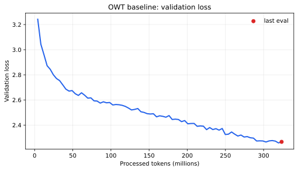

# CS336 Assignment 1: Basics - 实验报告

本项目从零实现了 byte-level BPE tokenizer、Transformer LM、AdamW 训练组件及实验流程。题目原文见 [`cs336_assignment1_basics.pdf`](./cs336_assignment1_basics.pdf)。本文中的训练数值均来自 `logs/**/config.json` 与 `metrics.jsonl`；除特别说明外，“最终 validation loss”指最后一次记录的验证结果，而不是未执行验证的 `final.pt` 时刻。

## 1. 实验环境与基准配置

- 平台：Inspire Studio，单张 NVIDIA H100；20 CPU，200 GiB 内存。
- TinyStories 基准模型：`vocab_size=10,000`，`context_length=256`，`d_model=512`，`d_ff=1,344`，4 层、16 头，RoPE、Pre-Norm、SwiGLU。
- 优化器：AdamW，`betas=(0.9, 0.95)`，`weight_decay=0.1`，cosine decay with warmup。
- 基准 checkpoint 含 22,704,640 个模型参数（包括当前 attention 线性层的 bias）。
- 训练曲线以 processed tokens 为横轴，避免不同 batch size/step 数导致横轴不可比。

## 2. 书面题

### 2.1 `unicode1`

1. `chr(0)` 返回 Unicode 码点 U+0000，即 NUL（null character）。
2. 它的 `repr` 是可见的转义形式 `\x00`，而 `print` 会写出实际的零字节，因此终端上通常看起来是空白。
3. NUL 仍是 Python 字符串中的一个正常字符，会计入长度并保留在中间；打印时不可见，但传给以 NUL 结尾的 C 接口时可能被解释为字符串终止符。

### 2.2 `unicode2`

1. UTF-8 对 ASCII 文本只用 1 byte/character，通常比 UTF-16/UTF-32 更紧凑，同时与 ASCII 兼容、无端序/BOM 歧义，且是 Web 与现有文本工具的主流编码。
2. 错误函数逐 byte 解码，但一个 Unicode 字符的 UTF-8 表示可能跨多个 bytes；例如 `"牛".encode("utf-8") == b'\xe7\x89\x9b'`，单独解码第一个 byte 就会抛出 `UnicodeDecodeError`。
3. `b'\xc0\x80'` 不能解码为合法 UTF-8，因为它是 U+0000 的 overlong encoding，而 UTF-8 明确禁止 overlong 序列。

### 2.3 AdamW 显存、FLOPs 与训练时间

记 batch size 为 $B$，context length 为 $T$，层数为 $L$，隐藏维度为 $D$，头数为 $H$，词表大小为 $V$，SwiGLU 隐层为 $F=\frac{8}{3}D$。忽略 bias，并假设输入、参数和所有中间张量均为 float32。

模型参数量为

$$
P = 2VD + L(4D^2 + 3DF + 2D) + D.
$$

其中两份 $VD$ 分别来自 token embedding 与未绑定权重的 LM head；每层包含 Q/K/V/O 四个 $D\times D$ 矩阵、SwiGLU 三个投影矩阵和两个 RMSNorm，最后还有一个 RMSNorm。

各类显存为：

| 项目 | float32 显存 |
| --- | ---: |
| 参数 | $4P$ bytes |
| 梯度 | $4P$ bytes |
| AdamW 一阶、二阶矩 | $8P$ bytes |
| 激活 | $4A$ bytes |

按题目列出的中间结果逐项保存，激活元素数可写为

$$
A = B\left[L\left(T(8D+4F)+2HT^2\right)+TD+2TV\right].
$$

每层的 $2HT^2$ 对应 attention score 与 softmax probability；$8TD+4TF$ 汇总两个 RMSNorm、QKV、attention value/output 以及 SwiGLU 中间结果；模型末尾还保存 final RMSNorm 和两份 vocab-sized logits/cross-entropy 中间量。因此峰值显存近似为

$$
M_{peak}=16P+4A\quad\text{bytes}.
$$

对 GPT-2 XL 形状（$V=50,257,T=1,024,L=48,D=1,600,H=25,F=4,288$）：

- $P=1,640,452,800$；参数、梯度、optimizer state 分别约为 6.562 GB、6.562 GB、13.124 GB。
- $M_{peak}\approx 16.373\,B+26.247$ GB，按 80 GB 十进制容量计算最大理论 batch size 为 3。实际还需给 CUDA context、allocator fragmentation 与临时 kernel workspace 留余量。

AdamW 对每个参数的逐元素开销可分为：weight decay 2 FLOPs、更新一阶矩 3 FLOPs、更新二阶矩 4 FLOPs、归一化参数更新 5 FLOPs，共约

$$
F_{AdamW}=14P.
$$

GPT-2 XL 的一次 optimizer step 因此约为 $2.297\times10^{10}$ FLOPs。模型单条长度为 $T$ 的序列前向传播（只计主要矩阵乘）为

$$
F_{fwd}=L(8TD^2+4T^2D+6TDF)+2TDV.
$$

反向传播按前向的 2 倍估计，则 batch 为 $B$ 时一次训练 step 约为 $3B F_{fwd}+14P$。GPT-2 XL 在 $B=1,024$、400K steps 时总计算量约为 $4.32\times10^{21}$ FLOPs；H100 理论 495 TFLOP/s、50% MFU 对应 247.5 TFLOP/s，有效训练时间约 4,850 小时，即约 202 天（单卡，未计通信与额外系统开销）。

## 3. Tokenizer 实验

### 3.1 实验口径

TinyStories 与 OWT tokenizer 的词表大小分别为 10K 与 32K。以下抽取各训练集前 10 个非空、由 `<|endoftext|>` 分隔的文档；compression ratio 定义为原始 UTF-8 bytes/token。Throughput 是当前 Python 实现在 Notebook CPU 上的单进程、单次计时，825 GB 按十进制字节估算，因此更适合作为数量级而不是稳定 benchmark。

| Tokenizer / 文本 | bytes | tokens | bytes/token | throughput | 825 GB 估时 |
| --- | ---: | ---: | ---: | ---: | ---: |
| TinyStories / TinyStories | 7,552 | 4,032 | 1.873 | 0.621 MB/s | 368.8 h（15.4 d） |
| OWT / OWT | 31,604 | 13,374 | 2.363 | 0.488 MB/s | 469.6 h（19.6 d） |
| TinyStories / OWT | 31,604 | 17,240 | 1.833 | 0.549 MB/s | 417.3 h（17.4 d） |

完整训练产物提供了一个独立 sanity check：TinyStories 为 2,227,753,162 raw bytes / 1,203,141,379 tokens = **1.852 bytes/token**；OWT 为 11,920,511,059 raw bytes / 5,242,922,862 tokens = **2.274 bytes/token**，与 10-document 样本趋势一致。

### 3.2 最长 token

- TinyStories 最长普通 token 是 `b' responsibility'`，共 15 bytes。这符合儿童故事中常见单词被完整合并的预期。
- OWT 最长 token 是 64 个连续连字符，共 64 bytes。这反映了网页语料中的分隔线、排版或 markup 痕迹；它在该语域中高频，但语义价值有限。
- 在同一批 OWT 文本上，TinyStories tokenizer 比 OWT tokenizer 多产生 28.9% tokens（17,240 vs. 13,374）。OWT 词表更大、训练域更匹配，因此能覆盖网页中的长单词、专名、数字和格式片段，compression 更好；代价是当前朴素 BPE encode 的词表/merge 查找仍较慢。

## 4. TinyStories 训练

TinyStories 基线采用 batch 32、40,000 steps、max/min LR $3\times10^{-4}/3\times10^{-5}$，计划处理 327.68M tokens。训练脚本最后一次验证发生在 step 39,000，因此以下“最终”均指该验证点。

| 指标 | 结果 |
| --- | ---: |
| best validation loss（step 38,000） | **0.7644** |
| 最后 validation loss（step 39,000） | **0.7680** |
| 最后 train loss | 0.7938 |
| perplexity | 2.1554 |
| 已处理 tokens | 319,496,192 |
| 日志 wall-clock | 1,463.1 s（24.4 min） |

前期 loss 快速下降，后期随 cosine decay 缓慢改善；最低验证损失出现在 step 38,000，最后一个验证点仅回升 0.0036，没有明显的持续过拟合。最终 validation loss 低于题目给出的 1.45 目标。

## 5. 学习率与 batch size

### 5.1 学习率扫描与不稳定 run

补充扫描统一使用 batch 32、5,000 steps、context length 256、warmup 200；每组最后一次验证都在 step 4,500。表中的“峰值 val loss”用于展示训练过程中的不稳定程度。

| max LR / min LR | 最后 val loss | perplexity | 峰值 val loss（step） | wall-clock |
| --- | ---: | ---: | ---: | ---: |
| $10^{-3}$ / $10^{-4}$ | **0.9161** | 2.4996 | 1.3750（500） | 205.7 s |
| $10^{-2}$ / $10^{-3}$ | 1.0030 | 2.7265 | 1.7524（500） | 187.0 s |
| $10^{-1}$ / $10^{-2}$ | 1.7139 | 5.5508 | 3.0913（1,500） | 186.3 s |
| $5\times10^{-1}$ / $10^{-1}$ | 3.0457 | 21.0240 | **45.7380（500）** | 180.4 s |
| $5\times10^{-1}$ / $4\times10^{-1}$ | 3.5830 | 35.9801 | **23.8707（2,000）** | 181.9 s |

$10^{-3}$ 是这组受控扫描中最好的点；升到 $10^{-2}$ 后最终 loss 已变差，$10^{-1}$ 进一步退化。$5\times10^{-1}/4\times10^{-1}$ 是真实的明显不稳定 run：validation loss 从 3.7621（step 1,000）跳到 16.0233（1,500）和 23.8707（2,000），随后回落，又在 step 3,500 升到 17.2368。它虽然最终部分恢复，但多次出现数量级波动，已越过稳定训练区间，不能仅根据最后一点判断。

### 5.2 Batch size

首先在固定 40.96M-token 预算下比较 batch 32/64/128；三组均使用 max LR $3\times10^{-3}$，并相应调整 steps。

| batch | steps | 最后验证 step | validation loss | perplexity | wall-clock |
| ---: | ---: | ---: | ---: | ---: | ---: |
| 32 | 5,000 | 4,500 | **0.8937** | 2.4442 | 193.6 s |
| 64 | 2,500 | 2,250 | 0.9016 | 2.4636 | 206.0 s |
| 128 | 1,250 | 1,125 | 0.9170 | 2.5017 | 225.5 s |

在固定 token budget 下，batch 32 最好。较小 batch 完成了更多 optimizer updates，并带来更强的梯度噪声；三组也没有分别重调学习率，所以该结果不代表 batch 越小总是越优。

另做显存可运行性扫描；这里的目标只是判断能否完成一次训练 step，不能用不同训练预算下的 loss 比较模型质量。

| batch | 结果 | 说明 |
| ---: | --- | --- |
| 1 | 成功 | 完成 5,000-step run |
| 64 | 成功 | 完成固定-token run |
| 128 | 成功 | 完成 5,000-step run |
| 256 | 成功 | 完成 1-step forward/backward/update 探测 |
| 512 | 成功 | 完成 1-step forward/backward/update 探测，为最大成功值 |
| 1,024 | **OOM** | 第一个训练 step 的 cross-entropy 阶段申请额外 9.77 GiB 时显存不足 |

因此按倍增档位得到的实际显存边界是 **batch 512 成功、下一档 batch 1,024 OOM**。早先 batch 512 目录只有配置而没有 metrics，不能据此判定 OOM；本次重新执行了完整的单步 forward/backward/update，纠正了该记录。训练时间还会受到验证 batch 数、编译和 allocator 状态影响，不能仅凭 wall-clock 推断峰值显存。

## 6. 架构消融

模型结构均为 4 层、`d_model=512`、16 头、context 256；训练均为 batch 32、40,000 steps。前三个消融与 SwiGLU 对照使用 max LR $3\times10^{-4}$；修正后的 SiLU run 使用预先设定的 max LR $3\times10^{-3}$，因此表中单列学习率并在分析中说明这一差异。

| 变体 | `d_ff` | 参数量 | max LR | best val | 最后 val | perplexity |
| --- | ---: | ---: | ---: | ---: | ---: | ---: |
| Pre-Norm + RoPE + SwiGLU（对照） | 1,344 | 22,704,640 | $3\times10^{-4}$ | 0.7644 | 0.7680 | 2.1554 |
| 删除 RMSNorm | 1,344 | - | $3\times10^{-4}$ | **0.7629** | **0.7629** | 2.1445 |
| Post-Norm | 1,344 | - | $3\times10^{-4}$ | 0.7700 | 0.7706 | 2.1610 |
| NoPE | 1,344 | - | $3\times10^{-4}$ | 0.8042 | 0.8042 | 2.2350 |
| SiLU（无门控，参数匹配） | **2,048** | **22,835,712** | $3\times10^{-3}$ | **0.7506** | **0.7506** | 2.1182 |

分析如下：

- **删除 RMSNorm**：在 $3\times10^{-4}$ 下训练稳定，最后 loss 比对照低 0.0051；差距很小，只能说明该浅层模型在此设置下没有依赖 RMSNorm 才能收敛。
- **Post-Norm**：最后 loss 比 Pre-Norm 高 0.0026，差距很小；更深模型或更激进学习率下，Pre-/Post-Norm 的优化差异可能更明显。
- **NoPE**：最后 loss 增加 0.0363，是前三个同学习率消融中退化最大的，说明显式 RoPE 对利用相对位置信息有明显帮助。
- **SiLU**：两层无门控 FFN 按题意把隐藏维度改为约 $4d_{model}=2,048$。checkpoint 含 22,835,712 个参数，只比 SwiGLU 对照多 131,072（0.58%），已消除旧版 `d_ff=1,344` 少 12.1% 参数的容量混杂。该 run 最后 loss 为 0.7506；由于它使用 $3\times10^{-3}$ 而对照使用 $3\times10^{-4}$，不能把全部差异只归因于门控机制，但参数量对照本身已经修正。

## 7. OWT 训练结果与分析

本次重新训练直接使用 `data/owt/owt_train.npy`、`data/owt/owt_valid.npy` 与 OWT 32K tokenizer；`vocab_size=32,000`。模型与 TinyStories 40K 基线保持相同的 context 256、`d_model=512`、`d_ff=1,344`、4 层、16 头、Pre-Norm、RoPE 和三投影 SwiGLU，并同样使用 batch 32、40,000 steps；max/min LR 为 $3\times10^{-3}/3\times10^{-4}$。final checkpoint 审计得到 39 个状态张量、45,232,640 个参数，每层均含 `ffn.w1`、`ffn.w3`、`ffn.w2`，因此不是此前误跑的两层 SiLU 模型。参数量高于 TinyStories 的原因是词表从 10K 增至 32K。

| 指标 | 结果 |
| --- | ---: |
| best validation loss（step 39,000） | **2.2580** |
| 最后 validation loss（step 39,500） | **2.2666** |
| 最后 train loss | 2.2209 |
| 最后 perplexity | 9.6467 |
| 已处理 tokens | 323,592,192 |
| 日志 wall-clock | 1,753.3 s（29.2 min） |

validation loss 从 step 500 的 3.2427 持续降到约 2.26，best 出现在倒数第二个验证点，最后仅回升 0.0086；尚未出现持续过拟合，继续增加训练预算仍可能改善。OWT 的最终 loss 明显高于 TinyStories 的 0.7680，符合网页语料主题、写作风格与长尾实体更复杂的预期；但两者词表大小和学习率也不同，因此不能把 loss 差值完全解释为语料难度。更大的 32K 输出词表还使 OWT 模型参数量和 softmax 计算量显著增加。

## 8. 文本生成样本

### 8.1 TinyStories

使用 TinyStories checkpoint，prompt 为 `Once upon a time`，seed 336，temperature 0.8，top-p 0.9：

> Once upon a time, there was a little boy named Tim. Tim had a big, blue eye that he loved very much. One day, he found a little pebble in his yard. It was very pretty and he wanted to show it to his friend, Sam.<|endoftext|>

样本语法通顺，人物与事件在短距离内保持一致，并具有 TinyStories 典型的简单叙事结构；不足是情节较浅、结尾突然，`a big, blue eye` 也略显生硬。

### 8.2 OWT

使用 OWT final checkpoint，prompt 为 `The future of artificial intelligence`，seed 336，temperature 0.8，top-p 0.9。生成达到 **256 个新 tokens** 的上限，未提前遇到 EOS：

> The future of artificial intelligence, the treatment of all other organizations, the narrative and ideas of our resource, the world and the world it is in different ways and across the world.
>
> The poet that wants to publish The Storm is a fairy-tale and completely out-of-the-box blog – is exactly how it becomes the most important thing to do and is not yet free to publish.
>
> We don’t need to be shown here in the UK that we are going to sit down and check if the work is done or not. Instead, we need to be aware of the work that we are able to provide in a world where "

样本在局部句法上基本通顺，也呈现出网页文章常见的段落结构；但主题从人工智能漂移到诗歌、博客和英国，`world` 等词重复较多，最后因达到 token 上限而停在未闭合引号处。相比 TinyStories 样本，它的题材更多样，但长程语义一致性更弱，这与 OWT 语料更复杂以及当前小模型/有限训练预算相符。

## 9. 结论

在 TinyStories 上，40K-step 基线最终 validation loss 为 0.7680。学习率扫描补到了真实不稳定区间：$5\times10^{-1}$ 多次出现 validation loss 数量级尖峰。固定 token budget 下 batch 32 略优于 64/128；显存扫描记录了 batch 1 到实际上限以及下一档 OOM。四项消融中 NoPE 在同学习率对照下退化最明显；修正后的 SiLU 使用 `d_ff=2,048`，与 SwiGLU 参数量只差 0.58%。OWT 结果表明其网页语料复杂度显著高于 TinyStories，具体数值与生成样本见上文。

## 10. 飞书补充文档

- 组织内公开入口：https://fudan-nlp.feishu.cn/wiki/XGIBwVQ2iiE78gktIXOcXVannlg
