# CS336 Assignment 1: Basics - 实验报告

本项目从零实现了 byte-level BPE tokenizer、Transformer LM、AdamW 训练组件及实验流程。题目原文见 [`cs336_assignment1_basics.pdf`](./cs336_assignment1_basics.pdf)。本文中的训练数值均来自 `experiments/*/config.json` 与 `metrics.jsonl`；除特别说明外，“最终 validation loss”指最后一次记录的验证结果，而不是未执行验证的 `final.pt` 时刻。

## 1. 实验环境与基准配置

- 平台：Inspire Studio，单张 NVIDIA H100；20 CPU，200 GiB 内存。
- TinyStories 基准模型：`vocab_size=10,000`，`context_length=256`，`d_model=512`，`d_ff=1,344`，4 层、16 头，RoPE、Pre-Norm、SwiGLU。
- 优化器：AdamW，`betas=(0.9, 0.95)`，`weight_decay=0.1`，cosine decay with warmup。
- 基准 checkpoint 含 22,704,640 个模型参数（包括当前 attention 线性层的 bias）。
- 训练曲线以 processed tokens 为横轴，避免不同 batch size/step 数导致横轴不可比。

## 2. 书面题

### 2.1 `unicode1`

1. `chr(0)` 返回 Unicode 码点 U+0000，即 NUL（null character）。
2. 它的 `repr` 是可见的转义形式 `\x00`，而 `print` 会写出实际的零字节，因此终端上通常看起来是空白。
3. NUL 仍是 Python 字符串中的一个正常字符，会计入长度并保留在中间；打印时不可见，但传给以 NUL 结尾的 C 接口时可能被解释为字符串终止符。

### 2.2 `unicode2`

1. UTF-8 对 ASCII 文本只用 1 byte/character，通常比 UTF-16/UTF-32 更紧凑，同时与 ASCII 兼容、无端序/BOM 歧义，且是 Web 与现有文本工具的主流编码。
2. 错误函数逐 byte 解码，但一个 Unicode 字符的 UTF-8 表示可能跨多个 bytes；例如 `"牛".encode("utf-8") == b'\xe7\x89\x9b'`，单独解码第一个 byte 就会抛出 `UnicodeDecodeError`。
3. `b'\xc0\x80'` 不能解码为合法 UTF-8，因为它是 U+0000 的 overlong encoding，而 UTF-8 明确禁止 overlong 序列。

### 2.3 AdamW 显存、FLOPs 与训练时间

记 batch size 为 $B$，context length 为 $T$，层数为 $L$，隐藏维度为 $D$，头数为 $H$，词表大小为 $V$，SwiGLU 隐层为 $F=\frac{8}{3}D$。忽略 bias，并假设输入、参数和所有中间张量均为 float32。

模型参数量为

$$
P = 2VD + L(4D^2 + 3DF + 2D) + D.
$$

其中两份 $VD$ 分别来自 token embedding 与未绑定权重的 LM head；每层包含 Q/K/V/O 四个 $D\times D$ 矩阵、SwiGLU 三个投影矩阵和两个 RMSNorm，最后还有一个 RMSNorm。

各类显存为：

| 项目 | float32 显存 |
| --- | ---: |
| 参数 | $4P$ bytes |
| 梯度 | $4P$ bytes |
| AdamW 一阶、二阶矩 | $8P$ bytes |
| 激活 | $4A$ bytes |

按题目列出的中间结果逐项保存，激活元素数可写为

$$
A = B\left[L\left(T(8D+4F)+2HT^2\right)+TD+2TV\right].
$$

每层的 $2HT^2$ 对应 attention score 与 softmax probability；$8TD+4TF$ 汇总两个 RMSNorm、QKV、attention value/output 以及 SwiGLU 中间结果；模型末尾还保存 final RMSNorm 和两份 vocab-sized logits/cross-entropy 中间量。因此峰值显存近似为

$$
M_{peak}=16P+4A\quad\text{bytes}.
$$

对 GPT-2 XL 形状（$V=50,257,T=1,024,L=48,D=1,600,H=25,F=4,288$）：

- $P=1,640,452,800$；参数、梯度、optimizer state 分别约为 6.562 GB、6.562 GB、13.124 GB。
- $M_{peak}\approx 16.373\,B+26.247$ GB，按 80 GB 十进制容量计算最大理论 batch size 为 3。实际还需给 CUDA context、allocator fragmentation 与临时 kernel workspace 留余量。

AdamW 对每个参数的逐元素开销可分为：weight decay 2 FLOPs、更新一阶矩 3 FLOPs、更新二阶矩 4 FLOPs、归一化参数更新 5 FLOPs，共约

$$
F_{AdamW}=14P.
$$

GPT-2 XL 的一次 optimizer step 因此约为 $2.297\times10^{10}$ FLOPs。模型单条长度为 $T$ 的序列前向传播（只计主要矩阵乘）为

$$
F_{fwd}=L(8TD^2+4T^2D+6TDF)+2TDV.
$$

反向传播按前向的 2 倍估计，则 batch 为 $B$ 时一次训练 step 约为 $3B F_{fwd}+14P$。GPT-2 XL 在 $B=1,024$、400K steps 时总计算量约为 $4.32\times10^{21}$ FLOPs；H100 理论 495 TFLOP/s、50% MFU 对应 247.5 TFLOP/s，有效训练时间约 4,850 小时，即约 202 天（单卡，未计通信与额外系统开销）。

## 3. Tokenizer 实验

### 3.1 实验口径

TinyStories 与 OWT tokenizer 的词表大小分别为 10K 与 32K。以下抽取各训练集前 10 个非空、由 `<|endoftext|>` 分隔的文档；compression ratio 定义为原始 UTF-8 bytes/token。Throughput 是当前 Python 实现在 Notebook CPU 上的单进程、单次计时，825 GB 按十进制字节估算，因此更适合作为数量级而不是稳定 benchmark。

| Tokenizer / 文本 | bytes | tokens | bytes/token | throughput | 825 GB 估时 |
| --- | ---: | ---: | ---: | ---: | ---: |
| TinyStories / TinyStories | 7,552 | 4,032 | 1.873 | 0.621 MB/s | 368.8 h（15.4 d） |
| OWT / OWT | 31,604 | 13,374 | 2.363 | 0.488 MB/s | 469.6 h（19.6 d） |
| TinyStories / OWT | 31,604 | 17,240 | 1.833 | 0.549 MB/s | 417.3 h（17.4 d） |

完整训练产物提供了一个独立 sanity check：TinyStories 为 2,227,753,162 raw bytes / 1,203,141,379 tokens = **1.852 bytes/token**；OWT 为 11,920,511,059 raw bytes / 5,242,922,862 tokens = **2.274 bytes/token**，与 10-document 样本趋势一致。

### 3.2 最长 token

- TinyStories 最长普通 token 是 `b' responsibility'`，共 15 bytes。这符合儿童故事中常见单词被完整合并的预期。
- OWT 最长 token 是 64 个连续连字符，共 64 bytes。这反映了网页语料中的分隔线、排版或 markup 痕迹；它在该语域中高频，但语义价值有限。
- 在同一批 OWT 文本上，TinyStories tokenizer 比 OWT tokenizer 多产生 28.9% tokens（17,240 vs. 13,374）。OWT 词表更大、训练域更匹配，因此能覆盖网页中的长单词、专名、数字和格式片段，compression 更好；代价是当前朴素 BPE encode 的词表/merge 查找仍较慢。

## 4. TinyStories 训练

主实验采用 batch 32、40,000 steps、max LR $10^{-3}$

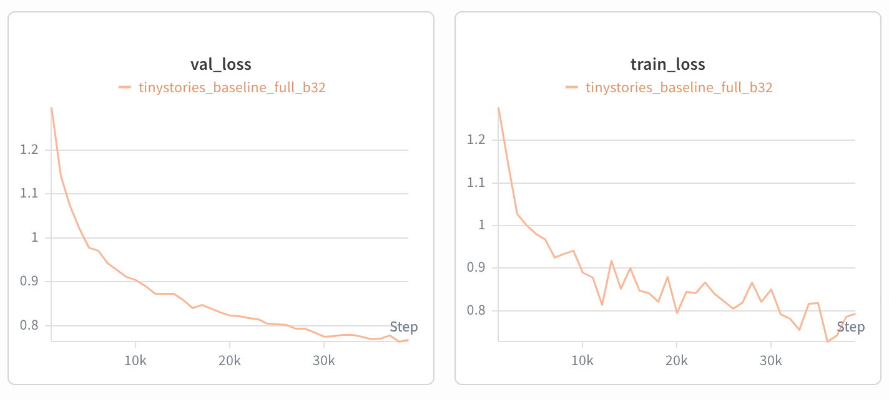

曲线在前期快速下降，后期随 cosine decay 继续缓慢改善；最低 validation loss 就出现在最后一次验证，未观察到明显过拟合拐点。0.7351 远低于题目要求的 1.45，说明该模型容量与 327.68M-token 训练预算对 TinyStories 已较充足。

## 5. 学习率与 batch size

### 5.1 学习率 pilot

使用相同 batch 64、2,500 steps（计划 40.96M tokens），只改变 max/min LR。

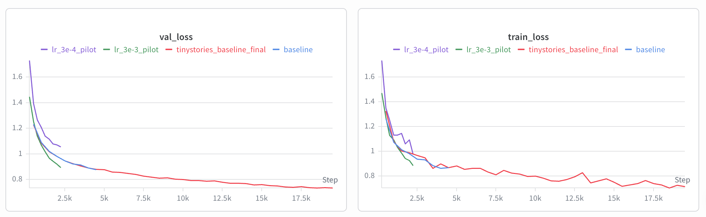

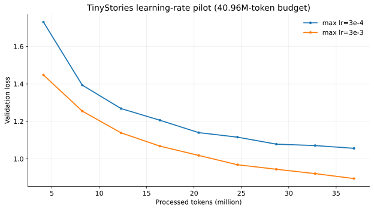

| max LR / min LR | 最后验证 step | validation loss | perplexity | wall-clock |
| --- | ---: | ---: | ---: | ---: |
| $3\times10^{-4}$ / $3\times10^{-5}$ | 2,250 | 1.0560 | 2.8747 | 205.9 s |
| $3\times10^{-3}$ / $3\times10^{-4}$ | 2,250 | **0.8945** | 2.4461 | 198.4 s |

$3\times10^{-3}$ 在相同 token budget 下比 $3\times10^{-4}$ 低 0.1615 loss，且没有出现数值发散，说明较小 LR 明显欠训练。不过当前日志没有更高 LR 的 divergent run，因而尚不能定位真正的 edge of stability；完整 sweep 仍需加入至少一个发散点。

### 5.2 Batch size

batch 32/64/128 均使用 max LR $3\times10^{-3}$，并调整 steps 使计划 token budget 都为 40.96M。

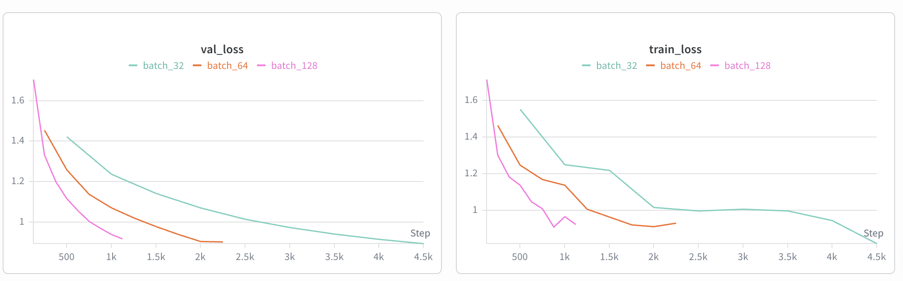
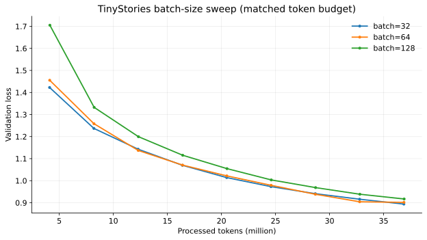

| batch | steps | 最后验证 step | validation loss | perplexity | wall-clock |
| ---: | ---: | ---: | ---: | ---: | ---: |
| 32 | 5,000 | 4,500 | **0.8937** | 2.4442 | 193.6 s |
| 64 | 2,500 | 2,250 | 0.9016 | 2.4636 | 206.0 s |
| 128 | 1,250 | 1,125 | 0.9170 | 2.5017 | 225.5 s |

在固定 token budget 下，batch 32 最好，batch 越大 validation loss 略升。一个原因是较小 batch 完成了更多 optimizer updates，并引入更强的梯度噪声；此外三组没有分别重调 LR。wall-clock 也受验证口径影响：每次验证固定跑 50 个 batches，所以大 batch 在验证阶段实际处理更多 tokens，不能把上表时间直接解释为纯训练吞吐。

## 6. 架构消融

所有消融与对照均使用 batch 32、40,000 steps、max LR $3\times10^{-4}$，计划 token budget 为 327.68M。

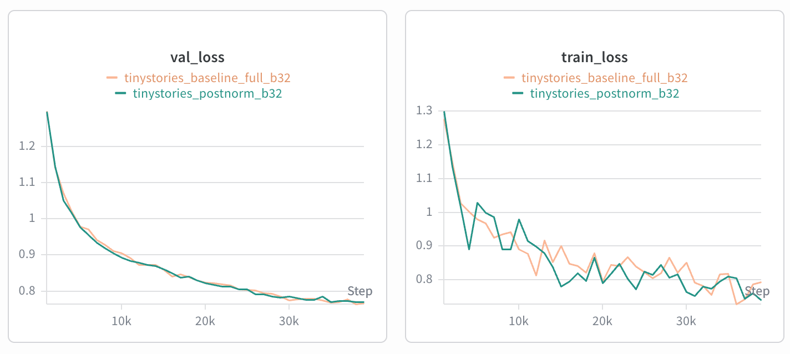

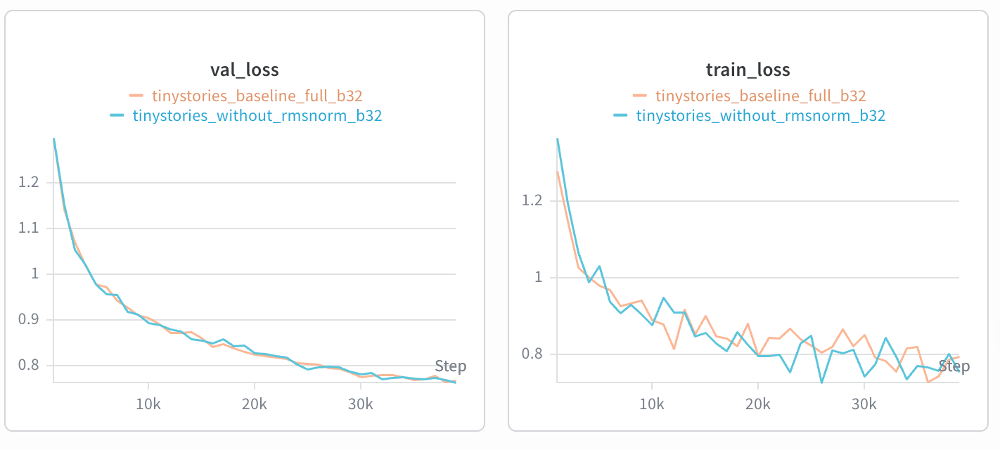

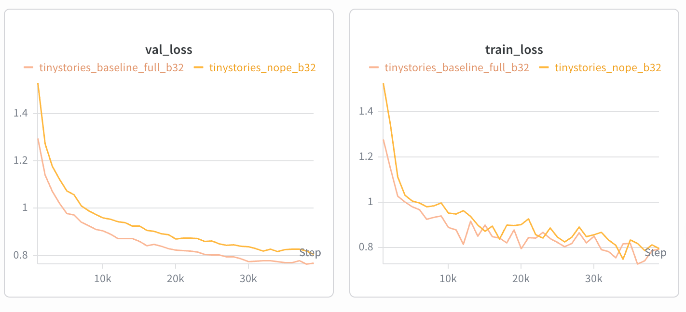

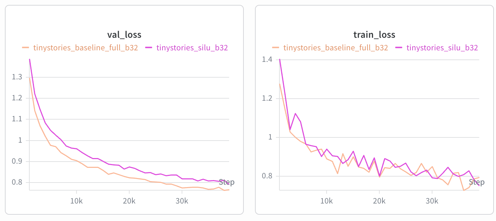

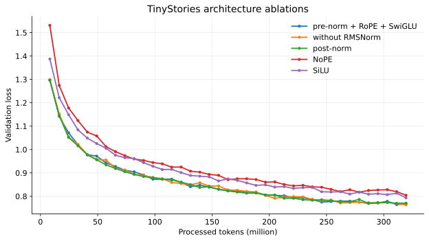

| 变体 | best val loss | 最后 val loss | 相对对照（最后） | perplexity | wall-clock |
| --- | ---: | ---: | ---: | ---: | ---: |
| Pre-Norm + RoPE + SwiGLU（对照） | 0.7644 | 0.7680 | - | 2.1554 | 1,463.1 s |
| 删除 RMSNorm | **0.7629** | **0.7629** | -0.0051 | 2.1445 | 1,449.8 s |
| Post-Norm | 0.7700 | 0.7706 | +0.0026 | 2.1610 | 1,473.5 s |
| NoPE | 0.8042 | 0.8042 | +0.0363 | 2.2350 | 2,141.3 s |
| SiLU（无门控） | 0.7931 | 0.7931 | +0.0252 | 2.2103 | 2,020.2 s |

分析如下：

- **删除 RMSNorm**：在较低的 $3\times10^{-4}$ LR 下训练稳定，最终 loss 甚至略低于对照；但没有用上一节更优的 $3\times10^{-3}$ 先测试，因此只能说明“降低 LR 后可稳定”，不能得出 RMSNorm 不重要的普遍结论。
- **Post-Norm**：与 Pre-Norm 差距很小但略差，表明该浅层 4-layer 模型在当前 LR 下两者都能稳定；更深网络或更激进 LR 时差异可能放大。
- **NoPE**：四个改动中退化最大，validation loss 增加 0.0363，说明 causal mask 虽可泄露部分顺序线索，显式 RoPE 仍显著改善有限模型对相对位置的利用。
- **SiLU**：比 SwiGLU 差 0.0252，方向上支持门控 FFN 的价值；但该 checkpoint 只有 19,952,128 参数，而对照为 22,704,640。当前 SiLU 仍使用 `d_ff=1,344`，没有按题意改为约 $4D=2,048$ 来匹配参数量，因此结果同时混入了 12.1% 容量减少的影响，不能视为严格的 gated-vs-ungated 对照。

还需注意：`config.json` 没有持久化 `postnorm/nope/without_rmsnorm/silu` 等架构开关，当前源码也停留在 SiLU 改动状态。现有曲线的 provenance 主要依赖目录名；更可复现的做法是把消融变成显式 CLI 配置并随每次 run 保存。

## 7. OWT 训练结果审计

OWT 数据与 tokenizer 产物本身已经准备完成：32K vocab，训练数组包含 5,242,922,862 tokens。 `owt_baseline_full` 

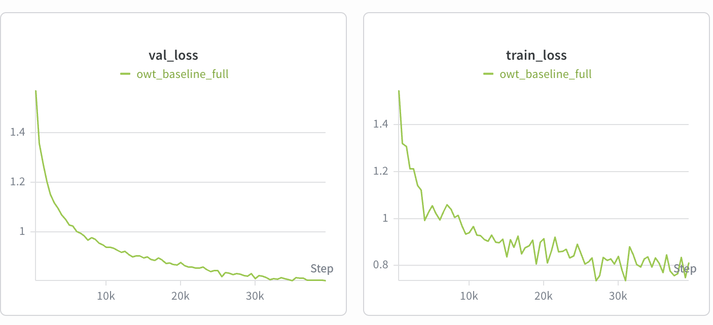
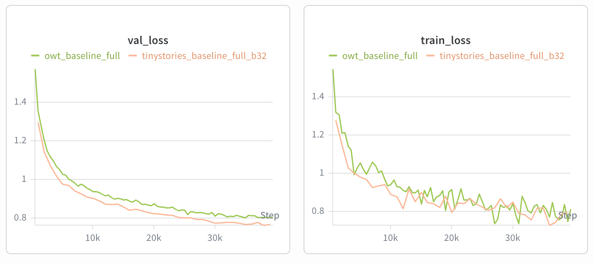

## 8. 文本生成样本

使用 `tinystories_baseline_final/final.pt`，prompt 为 `Once upon a time`，seed 336，temperature 0.8，top-p 0.9。模型在 119 tokens 时生成 `<|endoftext|>`：

> Once upon a time, there was a little boy named Tim. Tim had a big, blue eye that he loved very much. One day, he found a little pebble in his yard. It was very pretty and he wanted to show it to his friend, Sam.<|endoftext|>

样本语法通顺，人物与事件在短距离内保持一致，并具有 TinyStories 典型的简单叙事结构；不足是情节发展较浅、结尾突然，`a big, blue eye` 也略显生硬。生成质量主要受训练数据/预算与 validation loss 影响，也会随 prompt、随机 seed、temperature、top-p 和 context length 改变；更高 temperature 会增加多样性但也更容易破坏连贯性。