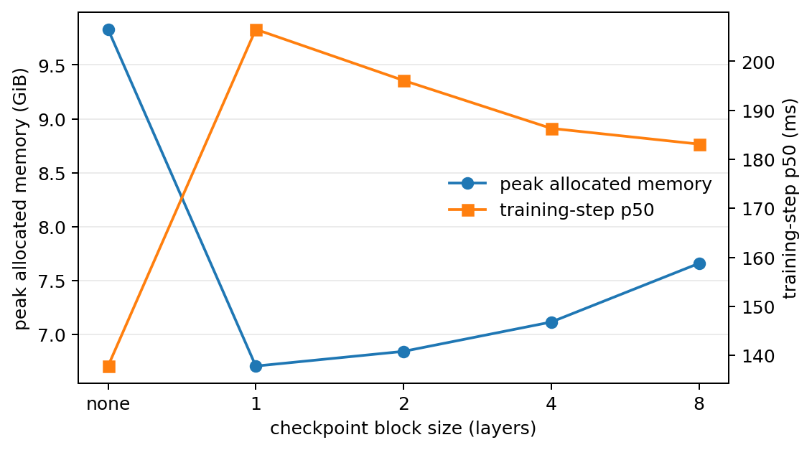
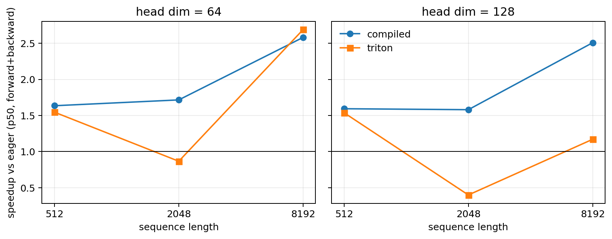

# A2-K 公开提交：张俊鹏

本提交只包含可公开、脱敏的实现、汇总结果和图片；完整原始 benchmark CSV、编译缓存和 trace 未提交。

## 基本信息

- 题面版本：`26.1.4-k-rc.3`
- 上游 starter commit：`ca8bc81a59b70516f7ebb2da4808daade877c736`
- 完成范围：activation checkpointing、显式 attention、`torch.compile`、PyTorch/Triton FlashAttention 前向与反向、正确性与性能矩阵。
- 未完成项：没有物理 24GB RTX 4090 上的正式复跑；原因和影响见“环境与限制”。

## 环境与限制

| 项目 | 脱敏信息 |
| --- | --- |
| GPU | NVIDIA GeForce RTX 4090，实际可见总显存 49140 MiB |
| 采集时空闲显存 | 48626 MiB |
| Driver / CUDA | 550.163.01 / 12.4 |
| PyTorch / Triton | 2.6.0+cu124 / 3.2.0 |
| power limit / P-state | 450 W / P8（采集时） |
| allocator | 23552 MiB；fraction 0.4842173705 |
| 性能 dtype | BF16；正确性另含关闭 TF32 的 FP32 配置 |
| compile | `torch.compile(..., backend="inductor", fullgraph=False)` |

每个正式进程在第一次 CUDA allocation 前设置 23 GiB allocator 上限，且独立串行执行。`memory_evidence.json` 的全局最高值为 allocated **19664.23 MiB**、reserved **20192 MiB**，在该预算内。

重要披露：此开发实例报告的是约 48 GiB 的 RTX 4090，而非题目要求的物理 24GB 版本。因此，这些结果证明了 23 GiB allocator 预算下的行为，但**不能声明为物理 24GB 硬件合规的正式矩阵**。详见 `results/run_metadata.json` 与 `results/memory_evidence.json`。

## 1. Activation Checkpointing

对 N 个相同 block，采用非嵌套的连续分段 checkpoint：只保存每段输入 activation，反向到达该段时重算一次前向。若段大小为 k，保存边界数量约为 `N/k`；忽略固定项时 activation 峰值从 O(N) 降为 O(N/k + k)，总前向计算量从约 1 倍增加到约 2 倍（每段最多重算一次）。在理论上的最优 k 约为 √N；实际还受 block 规模、allocator 与 kernel 临时张量影响。

```python
for start in range(0, len(blocks), block_size):
    end = min(start + block_size, len(blocks))
    def segment(x, start=start, end=end):
        for block in blocks[start:end]:
            x = block(x)
        return x
    x = checkpoint(segment, x, use_reentrant=False)
```

`results/checkpointing.csv` 使用 24-layer Stanford medium、batch 1、FP32 参数/BF16 autocast、3 次 warm-up 和 5 次测量。context 1024 时：无 checkpoint 为 **137.84 ms / 10066.59 MiB**；block size 1 为 **206.53 ms / 6865.41 MiB**；2、4、8 分别为 **196.11/7005.06**、**186.33/7283.91**、**183.12/7841.59**（ms/MiB）。block size 1 的 peak 最低，因此用于 context 2048：baseline 为 **381.35 ms / 19664.23 MiB**，block 1 为 **487.87 ms / 8065.55 MiB**。最小显存并非仅由 checkpoint 数量决定：更细粒度的分段减少被保存 activation，但带来更多函数边界、重算和 allocator 行为；block 4/8 虽更快，保存区间更大。



## 2. 显式 Attention 与 `torch.compile`

`explicit_attention.py` 严格执行 `QK^T → scale → causal mask → softmax → PV`，没有调用 SDPA、FlashAttention 或 xFormers。`results/attention_baseline.csv` 记录 batch 1、BF16、causal、6 个 shape 的 forward/backward/forward+backward p20/p50/p80 和峰值显存。

`results/compile_comparison.csv` 同时保存三组指定 attention shape 的 eager/compiled 对照，以及 Stanford small（d_model 768、12 layers、12 heads、context 512）对照。small 模型稳定态 p50：forward 从 **17.83 ms** 降至 **4.89 ms**（3.65×）；forward+backward 从 **46.73 ms** 降至 **13.71 ms**（3.41×）；完整 training step 从 **61.70 ms** 降至 **29.20 ms**（2.11×）。对应 compiled cold start 为 22.83、25.46、16.52 秒，单独记录、不混入稳定态。固定 batch/context 促成 shape specialization；三个 compiled small-model 实验均记录 `graph_break_count=0`。完整 step 的加速较低，因为 AdamW 状态读写不像模型计算那样充分融合。

## 3. FlashAttention-2

`flash_attention.py` 是 tiled PyTorch reference：按 query/key tile 维护 running max、running sum 和 running output，保存 `Q,K,V,O,LSE`，其中 LSE 的 shape 为 `[batch, sequence]`。online softmax 更新为：

`m_new=max(m_old,m_tile)`，`l_new=exp(m_old-m_new)l_old+sum(exp(S_tile-m_new))`，并用同一缩放更新输出累积器；因此不需物化完整 attention matrix。

`flash_attention_triton.py` 是学生编写的 `@triton.jit` 实现。一个 program 负责一个 query tile，在 kernel 内遍历 key/value tile；FP32 用于 online-softmax 状态和累积。D=64 的 forward 用 64×64、4 warps、2 stages；D=128 使用 32×32、4 warps、1 stage。causal mask 以全局 query/key 位置比较实现。反向重算概率 `P=exp(S-L)`，使用 `D=sum(dO*O)`，再计算 `dS=P*(dP-D)`，由此得到 `dQ=dS K / sqrt(d)`、`dK=dS^T Q / sqrt(d)`、`dV=P^T dO`。为修复 BF16 下 64×64 transpose-dot 的 dK/dV 边界错误，反向统一使用经过扩展测试验证的 32×32、1-stage tile。

## 4. 正确性

官方 CUDA 测试命令为：

```bash
./.venv-a2k-cu124/bin/python -m pytest tests/test_attention.py -v
```

结果见 `results/unit_tests.txt`：**6 passed，0 failed，0 skipped**。扩展检查见 `results/correctness.json`：3 个 seed、D=32/64/128、causal/non-causal，逐项比较 output、LSE、dQ、dK、dV；18/18 配置通过。最大绝对误差为 FP32 0.002625、BF16 0.015625；相对误差在参考值接近零处会放大，因此 pass 判定使用预先记录的绝对容差（FP32 1e-2、BF16 2e-2）。

## 5. 性能矩阵

attention microbenchmark 用 `triton.testing.do_bench(warmup=100, rep=300, quantiles=[.2,.5,.8])`；随机输入和 dO 均在计时区间外创建，区间前后 CUDA synchronize，测量前 reset peak memory stats。`results/flash_benchmark.csv` 包含核心 54 行（eager、compiled、Triton；512/2048/8192；D=64/128；三阶段）和 16384 边界 12 行（eager、Triton）。speedup 仅对所有非 implementation 条件一致且成功的行计算。

16384、D=64 的 forward+backward 是代表性边界：eager **16.48 ms / 3358.25 MiB**，Triton **5.42 ms / 274.13 MiB**，约 **3.04×** 加速且显存显著更低。D=128 也完成且无 OOM。Triton 的优势随序列变长更明显，因为它避免把 O(N²) attention score/probability 矩阵写回 HBM；短序列时 launch 与调度固定成本会削弱优势。没有将 compile failure 或 OOM 静默删除；最终矩阵所有配置均成功。



## 6. 复现与提交边界

从兄弟目录的 `assignment2-systems` 运行：

```bash
./.venv-a2k-cu124/bin/python -m pytest tests/test_attention.py -v
./.venv-a2k-cu124/bin/python student_scripts/a2k/attention_benchmark.py --implementation triton --sequence-length 8192 --head-dim 64 --output local_results/a2k/attention/example.csv
./.venv-a2k-cu124/bin/python student_scripts/a2k/correctness.py
./.venv-a2k-cu124/bin/python student_scripts/a2k/plot_results.py
```

代码同步：`python3 scripts/sync_a2k_submission.py --name '张俊鹏'`。公开附件仅包含 `results/` 和 `assets/` 的轻量汇总；原始逐次测量、编译缓存、trace、环境和上游仓库均留在个人工作目录，不提交。

## 飞书补充文档

- 链接：暂无。若补充材料需要组织内审核，将另建组织内公开、未开启互联网公开的文档。

## 自检

- [x] checkpoint、baseline、compile、正确性和 Flash benchmark 结果齐全。
- [x] 公开 CUDA tests 的 pass/fail/skip 如实记录。
- [x] 使用学生实现的真实 Triton `@triton.jit` forward kernel。
- [x] 图片均为相对路径，且结果与 assets 总体积低于 2 MiB。
- [x] 未提交缓存、二进制、trace、权重、内部路径、账号或凭据。
- [ ] 正式结果来自物理 24GB RTX 4090：未满足；当前开发卡为 49140 MiB，已如实披露。
