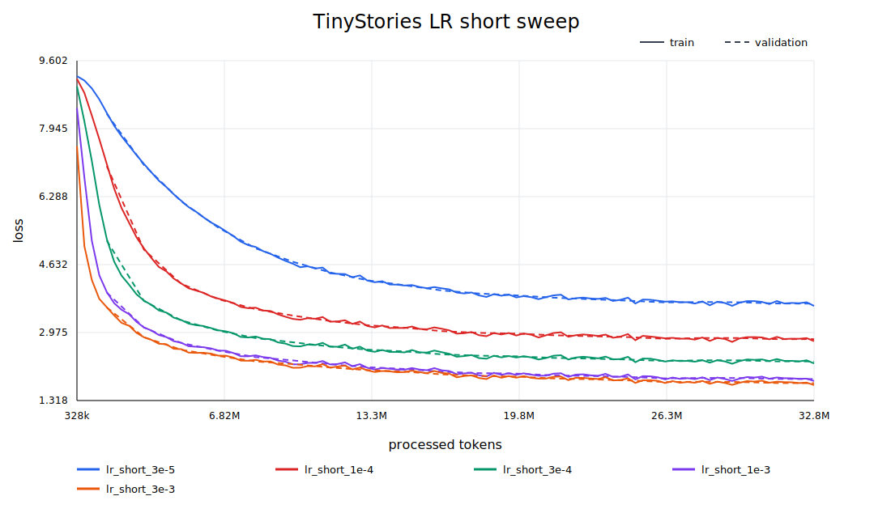
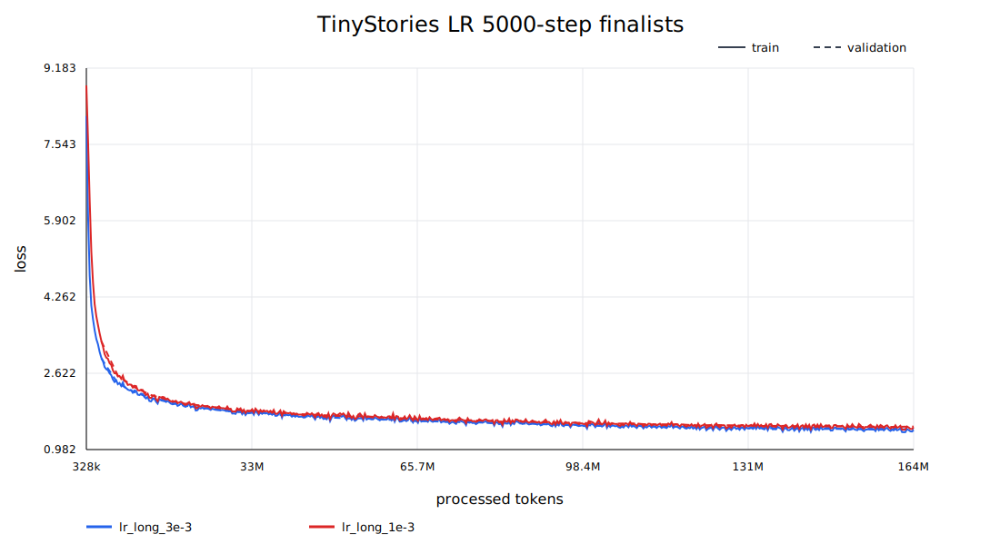
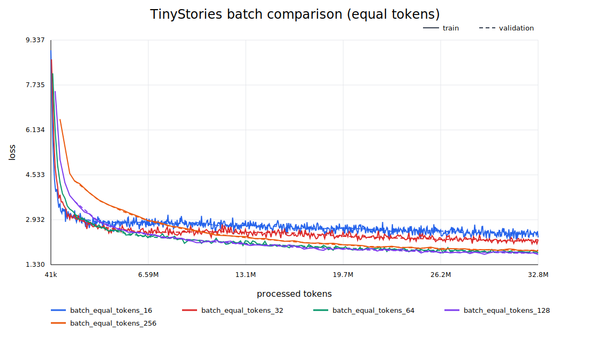
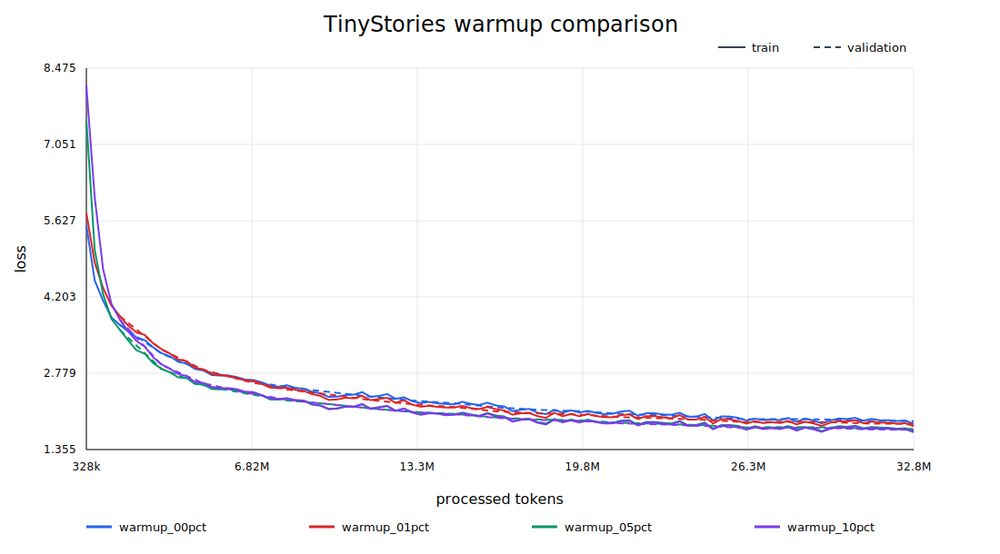
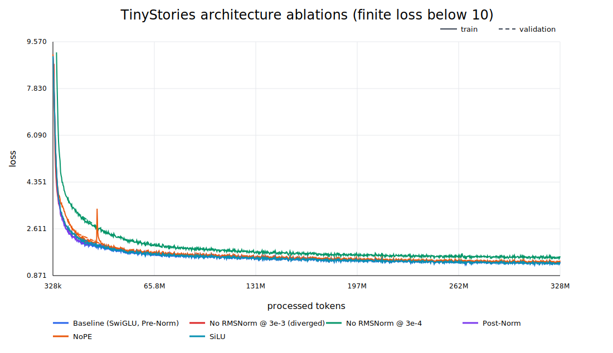
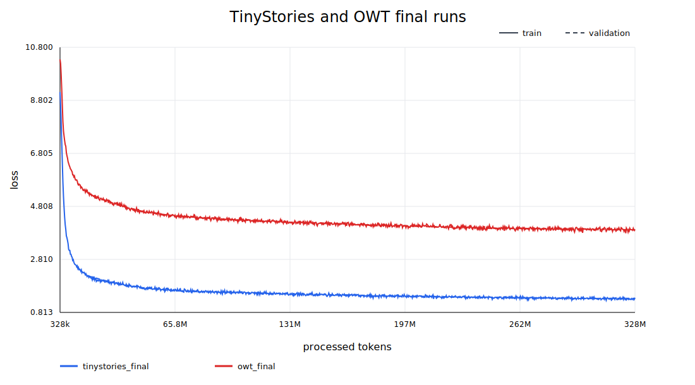

# A1 公开提交：曹庆棚

> 本文件和同目录代码公开可见，只包含公开数据上的实现、脱敏实验摘要和可公开图表。
> 数据集、tokenizer 资源、模型权重、checkpoint、完整控制台日志和运行环境均未提交。

> 评分标准与评测方式见 [`assignments/A1/EVALUATION.md`](../../../../assignments/A1/EVALUATION.md)；
> 日志格式见 [`assignments/A1/README.md` 的《实验日志格式》](../../../../assignments/A1/README.md#实验日志格式)。

## 基本信息

- 完成范围：21 个 adapter 对应实现、BPE tokenizer、Transformer LM、AdamW、训练与恢复、
  TinyStories/OWT tokenizer 和编码、超参数实验、四项架构消融、两套最终训练及文本生成
- 上游 starter commit：`a158843b20107949f1a8d7df1b05cd33b9166712`
- 本地工作仓库：与本仓库同级的 `assignment1-basics`
- 最终公共测试：`47 passed, 1 xfailed, 1 warning`

## 结果摘要

| 项目 | 结果 |
| --- | ---: |
| TinyStories tokenizer | 10,000 vocab，9,743 merges |
| OWT tokenizer | 32,000 vocab，31,743 merges |
| TinyStories 最终 best validation loss | **1.33444**（step 9,000） |
| TinyStories 最终 validation perplexity | 约 **3.798** |
| OWT 最终 validation loss | **3.92687**（step 10,000） |
| 最终选择 | LR `3e-3`，batch 128，10% warmup |
| 最终训练预算 | 每套模型 10,000 steps，327.68M tokens |
| 代码质量 | Ruff check/format 通过，pytest 无普通失败 |

完整脱敏汇总见 [`logs/summary.json`](logs/summary.json)，tokenizer 指标见
[`logs/tokenizer_summary.json`](logs/tokenizer_summary.json)。

## 书面题

### Unicode 1：理解 Unicode

1. `chr(0)` 返回 Unicode 码点 `U+0000`，即空字符 NUL（Null Character）。
2. 它的 `repr` 是 `\x00` 的转义形式，便于明确表示这个不可见字符；直接 `print` 时没有
   可见字形。
3. NUL 仍是 Python 字符串中的正常字符，会占据一个字符位置并保留在拼接结果中，只是
   终端显示时通常不可见；传给依赖 C 风格字符串的外部系统时还可能被解释成终止符。

### Unicode 2：Unicode 编码

1. UTF-8 对 ASCII 只使用 1 byte，通常比至少使用 2 bytes 的 UTF-16 和固定使用 4 bytes
   的 UTF-32 更紧凑；它也是网页文本的主流编码，而且没有 UTF-16/32 的字节序问题，适合
   面向互联网文本训练 byte-level tokenizer。
2. 逐 byte 调用 UTF-8 decode 是错误的，因为一个非 ASCII 字符通常由多个 byte 共同编码。
   例如 `"牛".encode("utf-8") == b"\xe7\x89\x9b"`，只有一次性解码完整三字节序列才合法；
   单独解码 `b"\xe7"`、`b"\x89"` 或 `b"\x9b"` 会抛出 `UnicodeDecodeError`。
3. `b"\xc0\x80"` 是一个不能解码为合法 Unicode 文本的两字节序列：它试图使用 UTF-8
   明确禁止的 overlong encoding 表示 `U+0000`，Python 会抛出 `UnicodeDecodeError`。

### AdamW 资源核算

以下记词表大小为 $V$，上下文长度为 $T$，层数为 $L$，模型维度为 $d$，注意力头数为
$H$，batch size 为 $B$；题目指定 $d_{\mathrm{ff}}=\frac{8}{3}d$。本实现无 Linear bias，
输入 embedding 与 LM head 不共享权重。

模型参数量为：

$$
P=2Vd+L(4d^2+3d d_{\mathrm{ff}}+2d)+d
 =2Vd+L(12d^2+2d)+d.
$$

全部 tensor 使用 FP32 时：

- 参数：$4P$ bytes；
- 梯度：$4P$ bytes；
- AdamW 一阶矩和二阶矩：$8P$ bytes。

按题目指定的激活逐项计数，每层保留两个 RMSNorm 输出、Q/K/V、attention score、
softmax probability、weighted values、attention output、SwiGLU 两个升维输出、SiLU、门控
乘积和降维输出。再加最终 RMSNorm、LM head logits 和交叉熵的一份 logits-size 中间量：

$$
M_{\mathrm{act}}
=4BT\left[L\left(\frac{56}{3}d+2HT\right)+d+2V\right]\ \text{bytes}.
$$

因此题目简化假设下的峰值为：

$$
\boxed{
M_{\mathrm{peak}}
=16P+4BT\left[L\left(\frac{56}{3}d+2HT\right)+d+2V\right]
}\ \text{bytes}.
$$

对 GPT-2 XL 形状（$V=50257,T=1024,L=48,d=1600,H=25$）代入严格的
$d_{\mathrm{ff}}=\frac83d$，得到：

$$
P=1{,}635{,}537{,}600,
$$

$$
M_{\mathrm{peak}}\approx 16.3566B+26.1686\ \text{GB}.
$$

所以在十进制 80 GB 中，简化模型给出的最大 batch size 为：

$$
B_{\max}=\left\lfloor\frac{80-26.1686}{16.3566}\right\rfloor=3.
$$

该估算没有计入 CUDA allocator、临时工作区、碎片和框架元数据，也没有采用 activation
checkpointing 或 fused cross-entropy，因此主要用于理解各项的数量级。

一次 AdamW 更新对每个参数元素约需要：weight decay 2 FLOPs、一阶矩 3 FLOPs、二阶矩
4 FLOPs、归一化更新 5 FLOPs，因此：

$$
\boxed{F_{\mathrm{AdamW}}\approx14P}.
$$

用于训练时间估算的 GPT-2 XL assignment architecture 取
$d_{\mathrm{ff}}=4288$，此时参数量记为
$P_{\mathrm{XL}}=1{,}640{,}452{,}800$。长度 1024 的单序列前向矩阵乘 FLOPs 为：

$$
F_{\mathrm{fwd}}
=L(8Td^2+4T^2d+6Td d_{\mathrm{ff}})+2TdV
=3.51677\ \text{TFLOPs}.
$$

H100 题设峰值为 495 TFLOP/s，50% MFU 即 247.5 TFLOP/s；反向传播按前向的两倍计算。
400,000 steps、batch size 1024 的时间为：

$$
t=\frac{400000\left(3\times1024\times F_{\mathrm{fwd}}+14P_{\mathrm{XL}}\right)}
{247.5\times10^{12}}
\approx4850.1\ \text{hours}\approx202.1\ \text{days}.
$$

AdamW 本身的 $14P_{\mathrm{XL}}\approx22.97$ GFLOPs/step，相比每步约 10.8 PFLOPs 的
模型 forward+backward 很小。
以上是纯计算时间，不包含验证、checkpoint 和数据读取开销。

## 实现说明

### Byte-level BPE 和 Tokenizer

- 使用 GPT-2 风格正则做 pre-tokenization；special token 先分离并作为文档硬边界。
- 初始词表为 256 个单 byte token，频率并列时选择字典序更大的 pair。
- BPE merge 阶段维护全局 pair counts、pair 到 word ID 的倒排索引和带惰性失效检查的 heap，
  每轮只更新真正受该 merge 影响的 pre-token。
- 大文件 pre-token 统计按 `<|endoftext|>` 对齐切块并使用多进程，不跨文档或 pre-token 合并。
- `Tokenizer.encode` 严格按训练 merge rank 编码；`decode` 先拼接 bytes，再整体 UTF-8 decode。
- `encode_iterable` 面向流式输入，避免把大文本一次性读入内存。
- tokenizer 资源以 JSON 序列化，支持重新加载、benchmark 和流式编码为 `uint16` NumPy 数组。

### Transformer LM

- 从零实现 Linear、Embedding、SiLU、RMSNorm、SwiGLU、RoPE、masked scaled dot-product
  attention、causal multi-head self-attention、Transformer block 和完整 decoder-only LM。
- 默认结构为 Pre-Norm；消融入口支持删除 RMSNorm、Post-Norm、NoPE 和参数量近似匹配的
  SiLU FFN。
- softmax 和 cross-entropy 使用减最大值等数值稳定处理；模型 forward 返回 logits，不提前
  softmax。
- attention 的布尔 mask 中 `True` 表示允许注意；RoPE 只作用于 Q/K，不作用于 V。

### 训练与生成

- 从零实现 AdamW、linear warmup + cosine decay、global gradient clipping。
- 训练数据通过 `np.load(..., mmap_mode="r")` 读取，input 与 target 相差一个 token。
- 训练脚本支持 JSON 配置继承、随机种子、bf16、定期验证、JSONL 日志、普通/best checkpoint、
  optimizer state 恢复和安全 resume。
- 生成脚本加载 checkpoint 和 tokenizer，支持 temperature 与 top-p，遇到
  `<|endoftext|>` 或最大生成长度时停止。

## Tokenizer 实验

### 训练与编码指标

这里的 compression 指标统一使用 `bytes/token`，数值越大表示相同文本需要的 token 越少。

| 项目 | TinyStories 10K | OWT 32K |
| --- | ---: | ---: |
| vocab / merges | 10,000 / 9,743 | 32,000 / 31,743 |
| tokenizer training time | 749.59 s | cached BPE merge run 474.97 s |
| CPU peak RSS | 小于 9.0 GB 的运行级上界 | 约 8.0 GB |
| validation bytes/token | 4.12044 | 4.36738 |
| validation tokens/sec | 219,675 | 2,149,120（8 workers） |
| longest ordinary token | ` accomplishment`，15 bytes | 64-byte 重复非 ASCII byte 模式 |
| encoded train tokens | 540,796,778 | 2,727,120,452 |
| encoded validation tokens | 5,461,210 | 66,401,098 |
| encoded dtype | `uint16` | `uint16` |

TinyStories 最长 token 是带前导空格的常见长词，符合简单故事语料分布；OWT 最长 token
来自网页文本中的重复编码噪声，说明更开放的网页语料既能学到常见词片段，也可能把高频
乱码模式合并成长 token。profile 和缓存复验显示，增量 BPE merge/index 维护是主要耗时，
大文件 pre-tokenization 则适合并行化和缓存。

### 跨数据域比较

从两个训练集分别近似均匀抽取 10 篇文档：

| 数据域 | TinyStories 10K bytes/token | OWT 32K bytes/token |
| --- | ---: | ---: |
| TinyStories | 4.0468 | 3.9633 |
| OWT | 3.2138 | 4.2931 |

TinyStories tokenizer 在本域样本略优，OWT tokenizer 在 OWT 样本明显更优，说明较大词表和
训练域都会影响压缩率。基于各自 8-worker benchmark 吞吐率外推 825 GB 文本，TinyStories
tokenizer 约需 69.06 小时，OWT tokenizer 约需 24.42 小时；这是当前实现和 benchmark 条件
下的工程估计，不是跨机器固定性能。

## TinyStories 训练与超参数实验

### 固定模型与比较原则

```text
vocab_size=10000, context_length=256
d_model=512, num_layers=4, num_heads=16, d_ff=1344
seed=42, bf16, max_grad_norm=1.0
```

- LR 短程实验统一为 batch 128、1,000 steps、32.768M tokens，并让 cosine schedule 在
  1,000 steps 内完整结束。
- batch 效果实验统一 processed tokens，而不是统一 steps。
- warmup 实验只改变 warmup 比例。
- 架构消融除注明的 no-RMSNorm 低 LR 恢复实验外，只改变一个结构变量。

### Learning-rate sweep

第一阶段：

| max LR | final validation loss |
| ---: | ---: |
| `3e-5` | 3.6802 |
| `1e-4` | 2.8138 |
| `3e-4` | 2.2709 |
| `1e-3` | 1.8424 |
| `3e-3` | **1.7403** |



第二阶段将前两名延长到 5,000 steps：

| max LR | final validation loss | best validation loss |
| ---: | ---: | ---: |
| `3e-3` | **1.4223** | **1.4086** |
| `1e-3` | 1.4768 | 1.4647 |



因此最终选择 `max_lr=3e-3`、`min_lr=3e-4`。额外运行 `max_lr=0.1`：它没有产生 NaN，
但 validation loss 在 step 300 达到阶段最低值 3.8827 后反向上升，最终达到 4.2681，
因此将其视为优化发散 run。gradient clipping 等机制阻止了数值彻底崩溃，但这个学习率已
越过有效稳定区间。短程/长程结果共同说明最佳点位于测试区间高端，但再提高两个数量级会
显著退化。

### Batch size

先用短程运行测量单设备吞吐和显存：batch 512 可以完成，峰值显存约 50.8 GiB；batch 768
在 backward 阶段 OOM。吞吐率在 batch 384--512 附近约 206--207K tokens/sec，继续增大已
进入平台区。

模型效果比较固定为 32.768M processed tokens：

| batch | steps | final validation loss |
| ---: | ---: | ---: |
| 16 | 8,000 | 2.4123 |
| 32 | 4,000 | 2.2210 |
| 64 | 2,000 | 1.7822 |
| 128 | 1,000 | **1.7403** |
| 256 | 500 | 1.8449 |



在该固定 token 预算下 batch 128 最好，因此用于最终训练。这个结论只针对当前模型、优化器
和短程预算；batch 变动也改变梯度噪声与 optimizer update 次数，不能只根据吞吐判断质量。

### Warmup

| warmup ratio | warmup / total steps | final validation loss |
| ---: | ---: | ---: |
| 0% | 0 / 1,000 | 1.8847 |
| 1% | 10 / 1,000 | 1.8347 |
| 5% | 50 / 1,000 | 1.7403 |
| 10% | 100 / 1,000 | **1.7252** |



短程实验中 10% warmup 最好，因此最终 10,000-step 训练使用 1,000 warmup steps。较长
warmup 缓解了训练初期直接进入大 LR 的不稳定，但本实验没有继续搜索 10% 以上比例，结论
只覆盖表中的四个候选。

### TinyStories 最终训练

最终配置：

```text
batch_size=128, steps=10000, processed_tokens=327.68M
max_lr=3e-3, min_lr=3e-4
warmup_iters=1000, cosine_cycle_iters=10000
eval_interval=500, eval_batches=20
```

| 指标 | 结果 |
| --- | ---: |
| final train loss | 1.36529 |
| final validation loss | 1.34288 |
| best validation loss | **1.33444** |
| best step | 9,000 |
| validation perplexity at best | 约 3.798 |
| wall-clock time | 1,618.50 s |
| throughput | 202.46K tokens/sec |
| peak GPU memory | 12.93 GiB |

## 架构消融

| 实验 | 状态 | final validation loss | best validation loss |
| --- | --- | ---: | ---: |
| baseline：RMSNorm + Pre-Norm + RoPE + SwiGLU | completed | **1.34288** | **1.33444** |
| 删除 RMSNorm，LR `3e-3` | diverged | N/A | 2.29965 @ step 500 |
| 删除 RMSNorm，LR `3e-4` | completed | 1.56275 | 1.55201 |
| Post-Norm | completed | 1.36498 | 1.35908 |
| NoPE | completed | 1.39674 | 1.38996 |
| SiLU FFN | completed | 1.34914 | 1.34172 |



- 删除 RMSNorm 且保持 `3e-3` 时首次在 step 730 出现 NaN，并在确认持续异常后于 step 1,250
  停止；降低到 `3e-4` 后可以完成，但仍明显差于 baseline，说明归一化显著扩大稳定学习率
  范围并改善优化。
- Post-Norm 可以稳定训练，但 best loss 比 Pre-Norm baseline 高约 0.025，当前规模下 Pre-Norm
  更容易优化。
- NoPE 比 baseline 高约 0.056，说明长度 256 的简单故事仍受益于显式相对位置信息。
- 参数量近似匹配的 SiLU FFN 与 baseline 最接近，但 best loss 仍高约 0.0073；本预算下
  SwiGLU 略优。

## OWT 最终训练

OWT 使用同一模型架构、相同 10,000 iterations、batch、LR 与 warmup，只把词表和编码数据
替换为 OWT 32K tokenizer/corpus：

| 指标 | 结果 |
| --- | ---: |
| processed tokens | 327.68M |
| final train loss | 3.94224 |
| final / best validation loss | **3.92687** |
| best step | 10,000 |
| wall-clock time | 1,999.95 s |
| throughput | 163.84K tokens/sec |
| peak GPU memory | 21.26 GiB |



OWT loss 更高并不表示实现失败：它的数据域更开放、词表为 32K，而且每 token loss 会受到
tokenizer 切分影响，不能与 TinyStories 的 per-token loss 做完全等价的横向比较。训练曲线
仍持续下降，best 出现在最后一步，说明同等 327.68M-token 预算下 OWT 模型仍明显欠训练。

## 文本生成

采样统一使用 temperature 0.8、top-p 0.9，最多生成 256 个新 token。

### TinyStories

模型生成 161 个 token 后遇到 `<|endoftext|>`，满足“生成至少 256 tokens，除非先遇到 EOT”
的要求：

> Once upon a time, in a big forest, there lived a little girl named Lily. She had a very important job
> to do. She had to protect her family's home. Every day, she would go out and look for food.
>
> One day, Lily met a new friend, a small bird named Blue. Blue was sad because he had no food to eat.
> Lily asked, "Why are you sad, Blue?" Blue said, "I am hungry, and I can't find any food." Lily wanted
> to help Blue.
>
> Lily had an idea. She said, "I will help you find food. We can look together." Blue was happy, and they
> looked for food together. They found some seeds and shared them with Blue. Blue was not hungry anymore,
> and they became best friends.
> `<|endoftext|>`

样本有人物、问题、行动和结尾，局部重复较少，说明模型已经学到 TinyStories 的简单叙事结构。

### OWT

OWT 样本生成满 256 tokens，完整文本见
[`logs/generations/owt_t08_p09.json`](logs/generations/owt_t08_p09.json)。开头为：

> The development of language models that make a better use of the language are not intended to be
> taken into account. This is a case in which the topic is expressed on the main web page...

它具有基本英文句法和段落结构，但后半部分反复围绕 “language” 自我重复，长程语义明显弱于
TinyStories。生成质量受到训练 token 数、数据域难度、词表大小、模型容量以及 temperature/
top-p 的共同影响；当前小模型与短预算足以验证完整生成链路，但不足以形成高质量通用 LM。

## 复现说明

### 环境与数据

- Python 3.12，依赖由固定上游仓库的 `uv.lock` 提供；公开提交中不重复添加依赖文件。
- 训练使用 PyTorch bf16 和单张 NVIDIA GPU；tokenizer 训练与数据编码使用 CPU。
- 公开数据来源：Hugging Face `roneneldan/TinyStories` 与
  `stanford-cs336/owt-sample`，文件名按题面保持不变。
- 数据、tokenizer JSON、编码后的 `.npy` 和 checkpoint 不提交，复现者需要按公开题面准备。

从兄弟工作仓库运行：

```bash
cd ../assignment1-basics
uv sync --frozen
uv run pytest
```

### Tokenizer 与数据编码

TinyStories：

```bash
uv run python scripts/train_tokenizer.py \
  --input data/TinyStoriesV2-GPT4-train.txt \
  --vocab-size 10000 \
  --special-token '<|endoftext|>' \
  --output artifacts/tinystories_tokenizer.json \
  --summary artifacts/tinystories_tokenizer_summary.json \
  --progress

uv run python scripts/encode_dataset.py \
  --tokenizer artifacts/tinystories_tokenizer.json \
  --input data/TinyStoriesV2-GPT4-train.txt \
  --output data/tinystories_train.npy \
  --summary artifacts/tinystories_train_encoding.json \
  --progress

uv run python scripts/encode_dataset.py \
  --tokenizer artifacts/tinystories_tokenizer.json \
  --input data/TinyStoriesV2-GPT4-valid.txt \
  --output data/tinystories_validation.npy \
  --summary artifacts/tinystories_validation_encoding.json \
  --progress
```

OWT 使用相同入口，把输入、输出和 `--vocab-size` 分别改为 OWT 文件、OWT 资源路径和
`32000`。大文件可显式加 `--workers 8 --chunk-size-mb 256`；`run_owt_postprocess.sh` 是在
TinyStories tokenizer/benchmark、OWT tokenizer 和三份原始文本均已准备后使用的可恢复后处理
入口，不是原始数据的一键下载脚本。

### 配置、训练与生成

生成本报告采用的比较配置：

```bash
uv run python scripts/create_experiment_configs.py \
  --selected-lr 3e-3 \
  --selected-batch-size 128 \
  --selected-warmup-ratio 0.10
```

最终训练：

```bash
uv run python scripts/train_lm.py \
  --config configs/generated/tinystories_final.json \
  --progress

uv run python scripts/train_lm.py \
  --config configs/generated/owt_final.json \
  --progress
```

从 checkpoint 恢复时使用 `--resume runs/<run_name>/checkpoint_<step>.pt`。生成示例：

```bash
uv run python scripts/generate.py \
  --config configs/generated/tinystories_final.json \
  --checkpoint runs/tinystories_final/checkpoint_best.pt \
  --tokenizer artifacts/tinystories_tokenizer.json \
  --prompt 'Once upon a time' \
  --max-new-tokens 256 \
  --temperature 0.8 \
  --top-p 0.9 \
  --output runs/tinystories_final/generation_t08_p09.json
```

公开配置优先使用 `submission/configs/generated/` 中与报告同名的文件。目录中部分未被本报告
运行的候选配置只表示搜索空间；实际运行证据以 `logs/summary.json` 和对应 JSONL 为准。

## 代码与脚本

- 真实实现：`submission/cs336_basics/`
- 测试 adapter：`submission/tests/adapters.py`
- tokenizer、编码、训练、生成、绘图与汇总：`submission/scripts/`
- 公开配置：`submission/configs/`
- 官方同步命令：`python3 scripts/sync_a1_submission.py --name '曹庆棚'`

`tests/adapters.py` 仅保留 21 个稳定测试接口，真实逻辑均位于 `cs336_basics/`。同步目录不含
公共 tests/fixtures、数据、模型权重、虚拟环境、缓存或依赖锁。

## 实验日志与图表

- 总汇总：[`logs/summary.json`](logs/summary.json)
- Tokenizer：[`logs/tokenizer_summary.json`](logs/tokenizer_summary.json)
- TinyStories 最终训练：[`logs/train_tinystories.jsonl`](logs/train_tinystories.jsonl)
- OWT 最终训练：[`logs/train_owt.jsonl`](logs/train_owt.jsonl)
- LR：[`logs/lr_sweep/`](logs/lr_sweep/)
- Batch：[`logs/batch_size/`](logs/batch_size/)
- Warmup：[`logs/warmup/`](logs/warmup/)
- 消融：[`logs/ablations/`](logs/ablations/)
- 生成样本：[`logs/generations/`](logs/generations/)
- 图表：[`assets/`](assets/)

所有训练 JSONL 均逐点保留 `step`、`wall_clock_sec`、`train_loss`、`lr`，并周期性记录
`val_loss`。公开汇总删除了 checkpoint 路径、resume 路径和会话元数据；no-RMSNorm 的非有限
loss 使用标准 JSON `null` 表示，同时在 summary 中保留发散 step 和最后有限验证结果。

## 最终验证

```text
ruff check:        All checks passed
ruff format check: all submitted source files formatted
pytest:            47 passed, 1 xfailed, 1 warning
```

- `xfailed` 是题面明确标记的 `Tokenizer.encode` 非流式内存预期失败；
  `Tokenizer.encode_iterable` 的低内存测试通过。
- warning 来自无 GPU 测试环境中的 CUDA 驱动提示，不是实现或测试失败；实际训练已在 GPU
  环境完成。
- 所有公开文件均小于 5 MiB；未提交 `.npy`、checkpoint、模型权重或完整终端日志。

## 飞书补充文档

- 链接：https://fudan-nlp.feishu.cn/wiki/DUPswMUq7irIVfkmNYScqjD0ncc?from=from_copylink
- 权限状态：组织内公开，互联网公开访问已关闭
