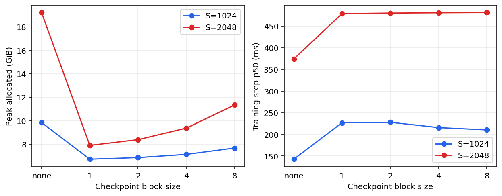
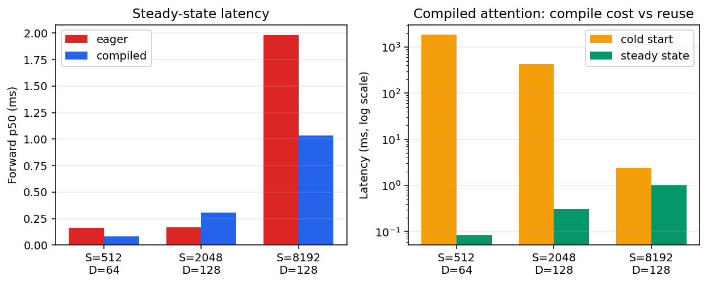
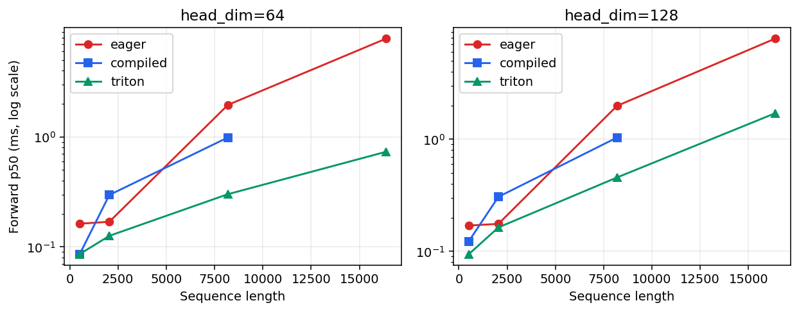
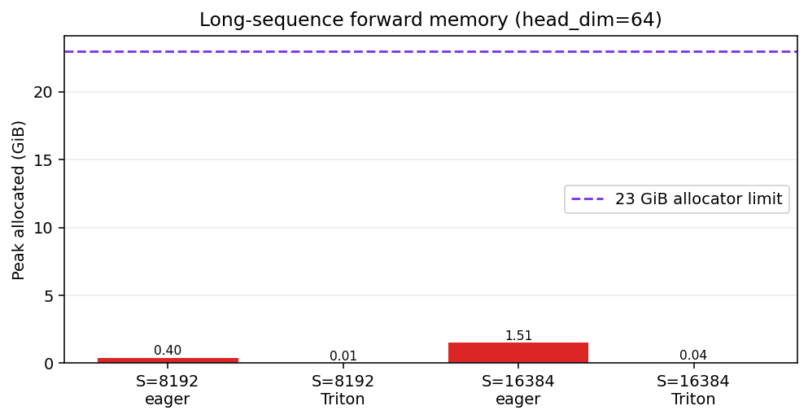

# A2-K 公开提交：曹庆棚

> 本文件和同目录代码、汇总、图片公开可见。只提交允许公开且已经脱敏的内容；上游仓库、
> 编译缓存、完整 trace 和大型原始文件留在个人工作目录。密钥和访问凭据不进入任何提交
> 材料。

## 基本信息

- 作业题面版本：`26.1.4-k-rc.3`
- 完成范围：A2-K attention 代码、纯 PyTorch tiled 与 Triton FlashAttention forward/backward、官方 GPU attention tests、扩展 correctness、checkpoint、attention、compile 与 Flash 正式性能矩阵。
- 未完成项：题面允许选做的自定义 Triton backward 和 leaderboard 未实现；必做的 PyTorch tiled 重计算 backward、PyTorch/Triton 两条 autograd path、正确性与性能矩阵均已完成。
- 上游 starter commit：`ca8bc81a59b70516f7ebb2da4808daade877c736`
- 工作代码基于公开 starter 仓库固定 commit：[starter commit](https://github.com/stanford-cs336/assignment2-systems/tree/ca8bc81a59b70516f7ebb2da4808daade877c736)

## 环境与工具

| 项目 | 公开、脱敏的信息 |
| --- | --- |
| GPU | NVIDIA GeForce RTX 4090 24GB |
| 开跑前显存 | `nvidia-smi`: 24564 MiB total，23718 MiB free（一次正式启动快照；每次运行仍需重新检查） |
| Driver / CUDA | Driver 560.28.03；PyTorch CUDA runtime 12.4 |
| PyTorch | 2.6.0+cu124（A2-K 独立 venv） |
| Triton | 3.2.0 |
| power limit / P-state | 450 W / P0；使用默认设置 |
| TF32 | performance 使用 BF16；correctness 的 FP32 matmul 与 cuDNN TF32 均关闭 |
| compile 配置 | `torch.compile(mode=reduce-overhead)`；cold 与 steady 分开 |
| allocator limit / fraction | 23552 MiB / `0.9768130293` |
| 提交状态 | 已完成最终自检，可提交 A2-K 分支和 PR |

## 1. Activation Checkpointing

### 理论与代码骨架

对 24 个相同 Transformer block，非嵌套 checkpoint 将连续的 block 分成长度为 `k` 的段，只保存每段入口 activation；反向时逐段重算并释放中间 activation。保存边界约为 `O(N/k)`，当前重算段内部的 activation 约为 `O(k)`，因此峰值近似为 `O(N/k + k)`，理想渐近折中在 `k≈√N` 附近。重计算使前向/重算部分从约 `O(N)` 增至接近 `O(2N)`（另加正常反向），而 `k` 越小还会增加 checkpoint 调度开销。嵌套 checkpoint 会在段内再建立层级边界、进一步改变峰值和重算范围；本题固定矩阵只要求非嵌套，峰值通常出现在边界 activation 仍驻留且当前段被重算时。

```python
x = embedding(tokens)
for start in range(0, N, k):
    end = min(start + k, N)
    x = checkpoint(lambda z, s=start, e=end: run_blocks(z, s, e), x)
loss = head(norm(x)).float().mean()
loss.backward()
```

固定矩阵已完成：Stanford medium、24 层、B=1、BF16 autocast、FP32 参数、AdamW，S=1024/2048，warmup=3、measurement=5；原始样本和 p50/peak 字段见 `results/checkpointing.csv`。

### 固定实验

固定矩阵已完成，结果见 `results/checkpointing.csv`；S=1024 与 S=2048 均包含 baseline 和 block size 1/2/4/8，所有正式行状态为 `ok`。

### 分析

S=1024 时 baseline peak allocated 约 9.84 GiB、p50 142.53 ms；checkpoint block 1–8 将 peak allocated 降至约 6.71–7.66 GiB，p50 为 210.21–227.83 ms。S=2048 baseline peak allocated 约 19.21 GiB、p50 374.04 ms；block 1 最省显存，约 7.89 GiB，p50 478.60 ms，block 8 则约 11.34 GiB、481.00 ms。下图直接读取 `checkpointing.csv`：左图展示显存收益，右图展示重计算延迟；因此最佳 block size 不只由 checkpoint 数量决定，还受边界 activation、重算次数、kernel 粒度和调度开销共同影响。



图 1：activation checkpointing 的显存—时间权衡。横轴是非嵌套 checkpoint block size（`none` 为 baseline），纵轴分别是 peak allocated 和训练 step p50；两条线对应 S=1024/2048。数值来自 [`results/checkpointing.csv`](results/checkpointing.csv)，不是截图读数。

## 2. PyTorch Attention 与 `torch.compile`

### 显式 PyTorch 基线

显式基线实现 QK^T、scale、causal mask、softmax、PV，未调用 SDPA 或第三方 fused attention；结果见 [`results/attention_baseline.csv`](results/attention_baseline.csv)。

### Compile 对照

结果见 [`results/compile_comparison.csv`](results/compile_comparison.csv)；本轮 24/24 行均为 `ok`。cold-start 与 steady-state 分开，首次调用包含 graph capture、shape specialization 和代码生成，steady-state 只统计已编译图的同步计时。不同 shape 会生成专门化图，重复运行则复用进程内编译缓存；测量脚本在每次 backward 后清空梯度，并消费 cold-start backward，避免 CUDAGraph 输出被后续运行覆盖。下图左侧比较 eager 与 compiled 稳态 p50，右侧把 compiled 的 cold-start 与稳态延迟放在对数轴上，直观显示“编译一次、重复复用”的代价结构。Stanford-small eager/compiled 的 forward、forward-backward、train-step 也全部完成。



图 2：`torch.compile` 的稳态延迟与冷启动开销。三个 attention shape 与题面一致；稳态柱来自 `p50_ms`，冷启动柱来自 `cold_start_ms`，完整原始字段见 [`results/compile_comparison.csv`](results/compile_comparison.csv)。

## 3. FlashAttention-2 Forward

### Pure PyTorch tiled reference

纯 PyTorch tiled 实现保存 Q/K/V/O 与唯一 `[B,Nq]` LSE，使用 FP32 online-softmax 状态；通过 adapter 暴露。

### Triton kernel

Triton kernel 为真实 `@triton.jit` 实现；每个 program 负责一个 `BLOCK_M=32` 的 query tile，在 kernel 内循环 `BLOCK_N=64` 的 key/value tile，并使用 `num_stages=1` 以满足 RTX 4090 的 shared-memory 限制。Q/K/V 使用显式 stride 指针和边界 mask，causal 分支按 query/key 坐标屏蔽未来 token；`m/l/acc` 均为 FP32，逐 tile 更新 online softmax，并写回 O 与 `[B,NQ]` LSE。修订后 RTX 4090 官方 GPU tests 为 6 passed、0 failed、0 skipped，扩展 CUDA correctness 为 36/36。

## 4. Backward 与正确性

### 重计算式 backward

Backward 通过重计算得到 dQ/dK/dV，PyTorch/Triton 两个 autograd path 均已接入；官方 GPU tests 和扩展 correctness 已覆盖 causal/non-causal。

### 官方 GPU tests

[`results/unit_tests.txt`](results/unit_tests.txt)：6 passed、0 failed、0 skipped；GPU 型号为 RTX 4090，命令为 `uv run pytest tests/test_attention.py -v`。

### 扩展正确性

[`results/correctness.json`](results/correctness.json) 覆盖 36/36 cases，3 seeds、D=32/64/128、causal/non-causal、PyTorch/Triton、O/L/dQ/dK/dV；每行记录绝对误差、相对误差、`atol`/`rtol`。FP32 correctness 关闭 TF32，并在 Triton dot 中使用 IEEE FP32；36/36 通过，最大绝对误差约 `1.61e-6`，使用 `atol=rtol=1e-3`。

## 5. 性能矩阵

### 配置与命令

已在单张 RTX 4090 24GB、B=1、BF16、causal 下运行完整核心矩阵与 16384 边界；每行使用 warmup=100、rep=300 的同步计时流程。正式汇总见 [`results/flash_benchmark.csv`](results/flash_benchmark.csv)。

### 结果与图

正式核心矩阵已汇总到 [`results/flash_benchmark.csv`](results/flash_benchmark.csv)：66 行，覆盖 eager/compiled/Triton 的 S=512/2048/8192 核心矩阵，以及 eager/Triton 的 S=16384 边界，D=64/128、三种 phase。speedup 仅在同 shape、同 phase、同 dtype 且两行成功时计算；本轮正式行均为 `ok`，脚本仍会如实保留未来的 error/OOM 行。

### 分析

Flash benchmark 的 eager 路径与显式 PyTorch baseline 共用同一个 QKᵀ→mask→softmax→PV 实现，三种实现按 shape/phase 使用同一 seed 和等价输入。S=8192 forward 时，D=64 eager/compiled/Triton p50 分别约 1.96/0.99/0.30 ms，Triton 相对 eager 约 6.49×；D=128 分别约 1.99/1.04/0.46 ms，Triton 约 4.35×。S=16384 forward 时，D=64 eager/Triton 为 7.85/0.73 ms（10.69×），D=128 为 7.89/1.71 ms（4.63×）。下图展示核心矩阵的 forward p50 随序列长度的变化，使用对数纵轴以同时容纳 eager、compiled 和 Triton；长序列显存差异另见下方显存图。必做 backward 采用普通 PyTorch tiled 重计算，因此在长序列明显慢于 eager；自定义 Triton backward 属于可选项，不将该限制伪装为加速结果。



图 3：FlashAttention forward p50。左右面板分别为 D=64/128，横轴为 sequence length，纵轴为毫秒（对数轴）；同 shape、同 dtype、同 causal 设置下比较 eager/compiled/Triton，数据来自 [`results/flash_benchmark.csv`](results/flash_benchmark.csv)。



图 4：长序列（D=64）forward 的 peak allocated 显存。绿色为 Triton、红色为 eager，紫色虚线为 23 GiB allocator 上限；数据来自同一份 `flash_benchmark.csv`，上限来自 [`results/memory_evidence.json`](results/memory_evidence.json)。

## 5.1 图表索引

以上四幅图均由公开 CSV/JSON 生成，图注说明了坐标、比较边界和数据来源；没有使用内部路径、主机名或完整运行日志。

## 6. 限制与复现

- 代码同步命令：`python3 scripts/sync_a2k_submission.py --name '曹庆棚'`
- 轻量结果目录：`results/`
- 24G 显存证据：[`results/memory_evidence.json`](results/memory_evidence.json) 汇总最终正式矩阵的最高 peak allocated/reserved；当前最高约 19674/20760 MiB，allocator 上限 23552 MiB，`within_24gib=true`。
- 未公开的大型原始文件：完整日志、缓存与环境仅保存在受控工作目录，不进入公开提交。
- 已知限制：必做 backward 是普通 PyTorch tiled 重计算而非自定义 Triton backward，因此长序列性能低于 eager；正确性、显存和接口要求均已满足。
- 最小复现步骤：在固定 starter commit 的公开仓库中安装 A2-K 依赖，设置 23 GiB allocator guard，运行 `uv run pytest tests/test_attention.py -v`；正式命令索引见 [`results/run_metadata.json`](results/run_metadata.json)，完整原始日志不进入公开提交。

## 飞书补充文档

- 链接：https://fudan-nlp.feishu.cn/wiki/NmGlw9i4OiLUfAkjlHNcfw2ynLf?from=from_copylink
- 权限状态：组织内公开，互联网公开访问已关闭

## 自检

- [x] 本 PR 只包含我本人本次 A2-K 的文件。
- [x] 正式结果全部来自单张 RTX 4090 24GB，且开跑前可用显存不少于 22 GiB。
- [x] 每个正式脚本独立、串行执行，首次 CUDA allocation 前设置 23552 MiB allocator 上限。
- [x] README 是 Markdown 主报告，所有图片使用相对路径和有意义的 alt text。
- [x] checkpoint、baseline、compile、正确性与 Flash benchmark 的轻量结果文件齐全；本轮正式行状态已核对，脚本会保留 error/OOM 行。
- [x] PyTorch baseline 没有调用已有 fused attention。
- [x] 提交包含学生自己编写的真实 `@triton.jit` forward kernel。
- [x] 官方 CUDA tests 的 pass/fail/skip 如实记录。
- [x] 每个关键数字都能回到命令、`results/` 或 metadata。
- [x] `results/` 与 `assets/` 附件合计不超过 2 MiB，README 和单文件均未超限。
- [x] 未提交 compile cache、PTX/CUBIN、binary、完整 trace、上游仓库或依赖环境。
- [x] GitHub 内容不含内部主机名、IP、账号、路径、UUID、进程或未公开项目。
- [x] GitHub 和飞书正文都不含 Secret、Token、Cookie、密码或私钥。
- [x] 飞书补充文档为组织内公开，且未开启互联网公开访问。
