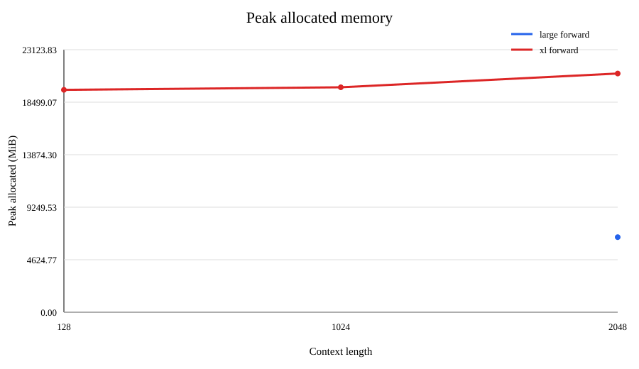

# A2-K：单 GPU 显存与 GPU Kernel

## 1. 基本信息与完成范围

- 题面版本：`26.1.4-k-rc.3`
- 完成范围：任务一至任务五，包括 activation checkpointing、显式 PyTorch attention、
  `torch.compile` 对照、纯 PyTorch tiled FlashAttention-2、Triton forward、重计算式
  backward、官方 GPU tests、扩展正确性矩阵和正式性能矩阵。
- 未完成项：无。
- Starter commit：`ca8bc81a59b70516f7ebb2da4808daade877c736`
- 正式实验工作树 commit：`ec070562f565aa63495930ac9845e94d51b3fee9`

所有公开数值均来自 `results/` 中的轻量结果文件；未提交上游仓库、缓存、完整 trace、
memory snapshot、binary、模型权重、数据集或依赖环境。

## 2. 环境、测量边界与可复现性

| 项目 | 正式设置 |
| --- | --- |
| GPU | NVIDIA GeForce RTX 4090 |
| 显存总量 | 24564 MiB |
| 开跑前可用显存 | 24108 MiB |
| Driver | 560.28.03 |
| CUDA | 12.6 |
| PyTorch | 2.11.0+cu126 |
| Triton | 3.4.0 |
| Power limit / P-state | 450.00 W / P8，默认设置 |
| TF32 | `false`；correctness 使用 FP32，正式性能使用 BF16 |
| PyTorch allocator | 23552 MiB |
| allocator fraction | 0.9768130292889415 |
| CUDA 计时 | CUDA events，测量前后 `torch.cuda.synchronize()` |
| Attention benchmark | warm-up 100、measurement 300、p20/p50/p80 |
| Checkpoint benchmark | warm-up 3、measurement 5 |
| Compile | 每个配置独立进程，cold-start 与 steady-state 分开记录 |

每个正式进程在第一次 CUDA allocation 前设置 23 GiB PyTorch allocator 上限。模型、输入、
随机数据和 optimizer 在计时区间外创建；显存测量前重置 peak memory stats。性能矩阵统一
使用 batch size 1、BF16、causal attention。

## 3. Activation Checkpointing

### 3.1 理论与代码骨架

对于由 `N` 个 Transformer block 组成的序列，每隔 `B` 个 block 设置一个 checkpoint
边界，只保存边界处的 hidden state。反向时，从前一个边界重新计算当前区间，再计算该
区间的局部梯度。这里使用非嵌套 checkpoint；嵌套 checkpoint 会增加边界管理和 kernel
启动开销，且在均匀 block 上没有必要。

若每个 block 的 activation 成本记为 `A`，简单均匀分块的峰值 activation memory
近似为：

```text
O((N / B + B) * A)
```

其中 `N/B` 来自保存的边界 activation，`B` 来自反向重计算一个 block group 时的组内
峰值。总工作量包含一次正常 forward、一次 backward，以及 checkpoint 区间的 forward
重计算，因此相对普通训练仍为 `O(N)`，但常数项增加。

```python
hidden = embedding(tokens)
for start in range(0, N, B):
    hidden = checkpoint(run_blocks[start:start + B], hidden)
loss = head(norm(hidden))
loss.backward()
```

### 3.2 固定矩阵

模型为 Stanford medium、24 层、batch size 1、BF16 autocast、FP32 参数和 AdamW。结果
来自 `results/checkpointing.csv`，每行包含 5 个 measurement samples、p20/p50/p80、
peak allocated、peak reserved 和状态。

| 配置 | ctx | block | p20 ms | p50 ms | p80 ms | allocated MiB | reserved MiB | 状态 |
| --- | ---: | ---: | ---: | ---: | ---: | ---: | ---: | --- |
| g0 | 1024 | 0 | 143.482 | 143.608 | 143.873 | 10064.2 | 10320 | ok |
| g1 | 1024 | 1 | 217.800 | 218.648 | 241.789 | 8116.5 | 8178 | ok |
| g2 | 1024 | 2 | 197.471 | 199.272 | 221.371 | 8117.5 | 8202 | ok |
| g4 | 1024 | 4 | 194.227 | 195.852 | 219.873 | 8117.5 | 8220 | ok |
| g8 | 1024 | 8 | 198.636 | 199.582 | 224.244 | 8117.5 | 8178 | ok |
| g0 | 2048 | 0 | 379.808 | 379.865 | 380.063 | 19661.6 | 20048 | ok |
| g1 | 2048 | 1 | 483.567 | 483.594 | 495.342 | 8136.8 | 9690 | ok |
| g2 | 2048 | 2 | 485.177 | 485.210 | 501.742 | 8568.3 | 9948 | ok |
| g4 | 2048 | 4 | 485.900 | 485.990 | 496.393 | 9575.2 | 10476 | ok |
| g8 | 2048 | 8 | 486.571 | 486.620 | 498.380 | 11594.2 | 11942 | ok |

在 context 1024 上，g4 是 checkpoint 配置中 p50 最低的配置（195.852 ms），相对
无 checkpoint 的 143.608 ms 增加约 36.4%，但 peak allocated 从 10064.2 MiB 降至
8117.5 MiB，约降低 19.3%。最佳 block size 不只由 checkpoint 数量决定，还受组内峰值、
重计算 FLOPs、kernel launch、allocator fragmentation、边界 activation 和读写带宽影响。

在 context 2048 上，g1 的 peak allocated 最低（8136.8 MiB），而无 checkpoint 为
19661.6 MiB；g1 的 p50 为 483.594 ms，比无 checkpoint 的 379.865 ms 增加约 27.3%。
这说明较小 block 可以获得更低显存，但会引入更多边界和重计算开销。

## 4. 显式 PyTorch Attention 与 `torch.compile`

### 4.1 显式 eager baseline

显式 baseline 依次执行：

1. `QK^T`；
2. 除以 `sqrt(head_dim)`；
3. causal mask；
4. softmax；
5. `PV`。

实现不调用 `torch.nn.functional.scaled_dot_product_attention`、第三方 flash-attn、
xFormers 或其他 fused attention 接口。`results/attention_baseline.csv` 包含 18 行：
3 个 sequence length（512/2048/8192）× 2 个 head dimension（64/128）× 3 个阶段
（forward/backward/forward-backward），每行包含 p20/p50/p80、峰值显存、samples 和
状态，18 行全部为 `ok`。

### 4.2 Compile 对照

`results/compile_comparison.csv` 包含 42 行：

- attention eager/compile：3 个 sequence length × 2 个 head dimension × 3 个阶段；
- Stanford small、batch size 1、context 512 的完整模型：forward、
  forward-backward、train_step 的 eager/compiled 对照；
- compile cold-start 和 steady-state 分开记录。

整体状态为 `37 ok`、`5 error`。5 个 error 是 compiled backward 的 donated-buffer
限制，错误文本被原样保留，没有被改写成成功。完整模型的 steady-state p50 对比如下：

| 阶段 | eager p50 ms | compiled p50 ms |
| --- | ---: | ---: |
| forward | 16.151 | 3.175 |
| forward-backward | 49.297 | 12.962 |
| train_step | 60.938 | 24.175 |

attention microbenchmark 上，compile 的 cold-start 会显著影响短序列；例如 sequence
512、head 64 的 forward compile cold-start 为约 2342 ms，steady-state p50 为 0.270 ms，
而 eager p50 为 0.189 ms。sequence 8192、head 64 时 compiled p50 为 0.644 ms，eager
p50 为 1.647 ms。不同 sequence/head 配置在独立进程中分别编译，因而会产生 shape
specialization；cold-start 没有混入 steady-state。编译失败和 backward donated-buffer
问题均保留在结果表中。

## 5. FlashAttention-2 Forward

### 5.1 纯 PyTorch tiled reference

`FlashAttentionPyTorch` 使用纯 PyTorch `torch.autograd.Function`，不调用 Triton。它以
query tile 和 key/value tile 循环计算 online softmax，使用 FP32 的 running max、running
sum 和 output accumulator，输出 `O`，并保存 `Q`、`K`、`V`、`O` 以及唯一的
`[batch, n_queries]` 形状的 log-sum-exp `L`。接口的 `is_causal` 默认值为 `False`，
并通过 adapter 暴露给官方 tests。

### 5.2 学生 Triton forward kernel

`FlashAttentionTriton` 使用真实的 `@triton.jit` forward kernel：

- launch grid 为 `(ceil(n_queries / query_tile_size), batch)`；
- 一个 program instance 负责一个 query tile；
- kernel 内循环处理 key/value tiles；
- query、key、value 的边界使用 pointer stride 和 mask；
- online softmax 使用 FP32 `running_max`、`running_sum`；
- accumulator 使用 FP32；
- causal mask 在每个 key tile 内按 query/key position 处理；
- 输出 O 和 LSE 分别写回；
- BF16 正式性能矩阵使用 query/key tile 64、`num_warps=4`、`num_stages=2`；
- FP32 且 head dimension 较大时，代码会选择更小的 tile 以控制寄存器压力。

## 6. 重计算式 Backward 与官方测试

反向使用：

```text
D  = sum(O * dO, dim=-1)
dP = dO @ V^T
dS = P * (dP - D)
dQ = dS @ K * scale
dK = dS^T @ Q * scale
dV = P^T @ dO
```

其中 `P` 不跨 tile 保存，而是使用 Q、K、V、O 和 LSE 重计算。PyTorch 和 Triton
autograd Function 都连接到同一套重计算式梯度路径；CUDA 上优先使用
`torch.compile(fullgraph=True)` 的 backward helper，编译失败时保留普通 PyTorch
重计算路径。两个路径都支持 causal 和 non-causal。

官方命令：

```bash
uv run pytest tests/test_attention.py -v
```

运行环境为 NVIDIA GeForce RTX 4090，starter commit 为
`ca8bc81a59b70516f7ebb2da4808daade877c736`。结果见 `results/unit_tests.txt`：

```text
passed: 6
failed: 0
skipped: 0
```

## 7. 扩展正确性

`results/correctness.json` 覆盖 3 个 seed、head dimension 32/64/128、causal 与
non-causal，并分别检查 output、logsumexp、dQ、dK、dV。所有 36 行均为 `pass`，且
包含 FP32 配置。

全矩阵最大误差如下；相对误差在接近零的参考梯度位置会被放大，因此同时报告绝对误差：

| 检查项 | 最大绝对误差 | 最大相对误差 |
| --- | ---: | ---: |
| output | 0.00284934 | 768.03174 |
| logsumexp | 0.00255036 | 0.0205952 |
| dQ | 0.00489032 | 3399855616.0 |
| dK | 0.00527680 | 68.5993 |
| dV | 0.00598240 | 23.5455 |

上述相对误差异常大的行对应参考值接近零，但所有配置均在设定的绝对/相对容差下通过。

## 8. 正式性能矩阵

### 8.1 配置与测量

正式矩阵固定为单张 RTX 4090、batch size 1、BF16、causal attention，比较显式 eager、
compiled PyTorch 和学生 Triton。核心矩阵为 sequence 512/2048/8192、head dimension
64/128、forward/backward/forward-backward；16384 边界矩阵为 head dimension 64/128、
三个阶段。每行均记录 p20/p50/p80、peak allocated、peak reserved、samples、Triton
tile/warps/stages、speedup 和 status。只有相同 shape/dtype/causal/phase 且两行都成功时
才计算 speedup。

`results/flash_benchmark.csv` 共 72 行：

- eager：24 行，全部 `ok`；
- compile：24 行，17 行 `ok`、7 行 `error`；
- flash-triton：24 行，全部 `ok`。

16384 边界上 eager 和 flash-triton 的 12 行全部成功；compiled backward 的错误行被保留。

### 8.2 代表性 forward 结果

| 实现 | seq | head | p20 ms | p50 ms | p80 ms | allocated MiB | reserved MiB | speedup |
| --- | ---: | ---: | ---: | ---: | ---: | ---: | ---: | ---: |
| eager | 512 | 64 | 0.1802 | 0.1812 | 0.1874 | 9.63 | 22 | 1.00x |
| flash-triton | 512 | 64 | 0.1239 | 0.1239 | 0.1260 | 16.56 | 3270 | 1.46x |
| eager | 8192 | 64 | 1.6456 | 1.6466 | 1.6478 | 340.38 | 450 | 1.00x |
| flash-triton | 8192 | 64 | 0.2988 | 0.2990 | 0.3011 | 21.28 | 3270 | 5.51x |
| eager | 16384 | 64 | 6.5157 | 6.5182 | 6.5210 | 1304.5 | 2246 | 1.00x |
| flash-triton | 16384 | 64 | 0.6451 | 0.6461 | 0.6492 | 26.31 | 3270 | 10.09x |
| eager | 16384 | 128 | 6.5638 | 6.5659 | 6.5690 | 1312.5 | 3270 | 1.00x |
| flash-triton | 16384 | 128 | 1.7111 | 1.7152 | 1.7193 | 36.31 | 3270 | 3.83x |

短序列上 kernel launch 和 Triton dispatch 开销会降低收益；长序列上避免显式
`QK^T`/attention probability 矩阵，使 Triton 路径同时取得更低的 peak allocated 和更高
的 forward speedup。Triton 的 reserved memory 受到编译器/allocator 工作区影响，因此
同时报告 allocated 和 reserved，不能只比较单一显存指标。

## 9. 显存证据与复现

`results/memory_evidence.json` 汇总正式进程：

| 项目 | 数值 |
| --- | ---: |
| PyTorch peak allocated | 21021.666 MiB |
| PyTorch peak reserved | 22032 MiB |
| allocator limit | 23552 MiB |
| allocator fraction | 0.9768130292889415 |
| 24 GiB hard limit | 24576 MiB |
| within_24gib | `true` |

公开复现入口：

```bash
python scripts/run_a2k_checkpoint_matrix.py
python scripts/a2k_correctness.py --output results/correctness.json
python scripts/attention_benchmark.py --output results/flash_benchmark.csv
uv run pytest tests/test_attention.py -v
```

结果文件：

- `results/run_metadata.json`
- `results/checkpointing.csv`
- `results/attention_baseline.csv`
- `results/compile_comparison.csv`
- `results/flash_benchmark.csv`
- `results/correctness.json`
- `results/unit_tests.txt`
- `results/memory_evidence.json`

报告图片：

- 
- 
- 

飞书补充文档（组织内公开，不开启互联网公开访问）：

https://fudan-nlp.feishu.cn/wiki/J2mvwOwo4iwxvlksa5WcQ0cJnrd

## 10. 提交自检

- [x] 完成范围、未完成项、题面版本和 starter commit 已记录。
- [x] 正式结果来自单张 RTX 4090 24GB，开跑前可用显存不少于 22 GiB。
- [x] 正式进程设置 23552 MiB allocator 上限并记录 fraction。
- [x] Checkpoint 1024 矩阵和 2048 边界完整。
- [x] 显式 PyTorch baseline 未调用 fused attention。
- [x] 纯 PyTorch tiled 和学生 Triton forward 均通过正确性测试。
- [x] Triton kernel 包含 online softmax、FP32 accumulator 和 causal mask。
- [x] PyTorch/Triton 两个 autograd path 均覆盖 dQ/dK/dV。
- [x] 官方测试明确记录 passed/failed/skipped。
- [x] 正确性矩阵覆盖 output/LSE/dQ/dK/dV、3 seeds、3 head dimensions 和两种 causal 设置。
- [x] 核心性能矩阵和 16384 边界矩阵完整，compile error 行保留。
- [x] README 中的关键数字均可追溯到 `results/`。
- [x] `memory_evidence.json` 证明 peak reserved 不超过 23552 MiB。
- [x] 三张图片均被 README 引用。
- [x] 未提交缓存、binary、trace、权重、数据、压缩包、内部信息或凭据。
