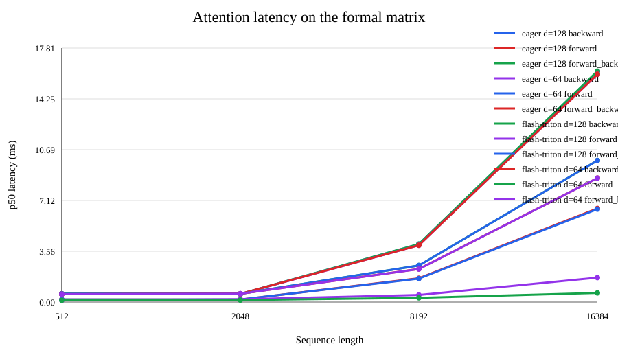
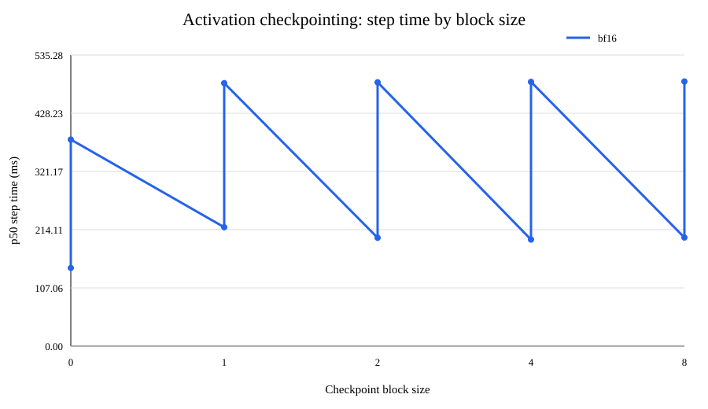

# A2-P：性能分析与性能评估

## 范围与实验环境

本报告使用与 A2-K 相同的、已经脱敏的公开 metadata：GPU 为
**NVIDIA GeForce RTX 4090**，PyTorch 版本为 2.11.0+cu126，CUDA
版本为 12.6。计时使用 CUDA event，并在每个测量步骤前后同步 CUDA。
模型构造、optimizer 构造和输入生成均不计入测量区间。

课程补充文档：https://fudan-nlp.feishu.cn/wiki/OGctwjk0RimDmskRbA6cHEyenLh

## 端到端 benchmark

每种模式分别执行 warm-up 和 measurement 循环，并保存原始样本、均值、
标准差、CV、p20/p50/p80、seed、dtype 和显存峰值。特意保留
`train_step` 的 warm-up 为零的行，用于和 warm-up 为五的行对比。

Benchmark 状态：**ok=4**。

| 模式 | warm-up 步数 | 测量步数 | 均值_ms | 标准差_ms | CV | p50_ms | 状态 |
| --- | --- | --- | --- | --- | --- | --- | --- |
| forward | 5 | 10 | 24.46535201743245 | 0.02473876479375732 | 0.0010111755095994553 | 24.470085743814707 | ok |
| forward_backward | 5 | 10 | 79.6188086271286 | 0.154586254937314 | 0.0019415796041519977 | 79.5632153749466 | ok |
| train_step | 5 | 10 | 89.92820251733065 | 0.12647760954378667 | 0.0014064287509740045 | 89.92770733311772 | ok |
| train_step | 0 | 10 | 124.24290245398879 | 102.5683539793889 | 0.8255469886287735 | 89.90750042721629 | ok |

## 计算性能分析

六个配置由 small/medium 两种模型规模与 256/512/1024 三种 context
长度交叉组成。全部使用 `torch.profiler`，并在 warm-up 之后选择一个
稳定的测量步骤。插桩范围包括 `profile/warmup`、`profile/measure`、
`forward`、`backward`、`optimizer`、`attention/scores`、
`attention/softmax` 和 `attention/value`。完整 trace 不放入公开提交；
轻量级算子汇总位于 `results/profile/trace_summary.csv`。

Profile 状态：**ok=1056，oom=1**。

| 模型规模 | 上下文长度 | 阶段 | 算子或 kernel | 调用次数 | CUDA 总时间_us |
| --- | --- | --- | --- | --- | --- |
| small | 256 |  | ProfilerStep* | 1 | 21714.046000000053 |
| small | 256 |  | profile/measure/train_step/0 | 1 | 21714.046000000053 |
| small | 256 | optimizer | Optimizer.zero_grad#AdamW.zero_grad | 1 | 0 |
| small | 256 | forward | forward | 1 | 10475.99400000004 |
| small | 256 |  | Unrecognized | 1 | 0 |
| small | 256 |  | aten::index | 1 | 5.791999999999916 |
| small | 256 |  | aten::as_strided | 2015 | 0 |
| small | 256 |  | aten::reshape | 800 | 404.1560000000027 |
| small | 256 |  | aten::view | 802 | 0 |
| small | 256 |  | cudaLaunchKernel | 1903 | 0 |
| small | 256 | forward | forward | 1 | 31657.543 |
| small | 256 |  | void at::native::vectorized_gather_kernel[16,long](...) | 1 | 5.791999999999916 |

_这里只展示 1057 行中的 12 行，完整表格见 `results/`。_

## 混合精度

累加实验位于 `results/accumulation.json`。四种写法的实际输出如下：

| 写法 | 实际输出 |
| --- | ---: |
| FP16 accumulator + FP16 value | 9.953125 |
| FP32 accumulator + cast FP16 value | 10.00213623046875 |
| FP32 accumulator + FP16 value | 10.00213623046875 |
| FP32 accumulator + FP32 value | 10.000133514404297 |

FP16 accumulator 在每次加法后都会发生低精度舍入，因此误差最大。将
accumulator 改为 FP32 后，累加误差显著降低；当输入仍为 FP16 时，剩余误差
主要来自输入量化，而不是累加器。FP32 输入与 FP32 accumulator 的结果最接近
高精度参考值。

混合精度实验记录了参数存储
类型、第一层输出、LayerNorm 输出、logits、loss、梯度 dtype、原始计时
样本和 loss 变化趋势，完整结果位于 `results/mixed_precision.json`。
FP32 累加可以避免反复低精度舍入；BF16 autocast 在保持敏感归约使用
稳定 dtype 的同时，利用 Tensor Core 提高吞吐。

```json
{
  "comparison": {
    "bf16_or_fp16_speedup_vs_fp32": 0.8340234918812485,
    "loss_delta_last_step": -4.988908767700195e-05
  },
  "cuda": "12.6",
  "runs": [
    {
      "cv": 0.37978856286480517,
      "dtype": "fp32",
      "gradient_dtype": "float32",
      "loss_dtype": "float32",
      "loss_samples": [
        0.7090997695922852,
        0.6928342580795288,
        0.6774356365203857,
        0.6629805564880371,
        0.6495684385299683,
        0.6370103359222412,
        0.6252819895744324,
        0.6143155694007874,
        0.6040103435516357,
        0.5942488312721252
      ],
      "max_ms": 2.042164094746113,
      "mean_ms": 0.9554375894367695,
      "min_ms": 0.8169887587428093,
      "observed_dtypes": {
        "first_layer_output": "float32",
        "layer_norm_output": "float32",
        "logits": "float32"
      },
      "p20_ms": 0.8173583075404167,
      "p50_ms": 0.8307760581374168,
      "p80_ms": 0.8640937507152557,
      "parameter_storage": "float32",
      "peak_allocated_mib": 16.2666015625,
      "peak_reserved_mib": 22.0,
      "std_ms": 0.36286426899920443,
      "step_time_ms_samples": [
        2.042164094746113,
        0.8867867290973663,
        0.8584205061197281,
        0.8314726874232292,
        0.8169887587428093,
        0.8300794288516045,
        0.8359765633940697,
        0.8178157731890678,
        0.8172979578375816,
        0.8173733949661255
      ]
    },
    {
      "cv": 0.012939783358621459,
      "dtype": "bf16",
      "gradient_dtype": "float32",
      "loss_dtype": "float32",
      "loss_samples": [
        0.7099848389625549,
        0.6923202276229858,
        0.6784254312515259,
        0.6628485918045044,
        0.651110053062439,
        0.6375415921211243,
        0.6253066062927246,
        0.6148054003715515,
        0.604495108127594,
        0.5941989421844482
      ],
      "max_ms": 1.0212548077106476,
      "mean_ms": 0.9990650229156017,
      "min_ms": 0.9805532172322273,
      "observed_dtypes": {
        "first_layer_output": "bfloat16",
        "layer_norm_output": "float32",
        "logits": "bfloat16"
      },
      "p20_ms": 0.9874368086457253,
      "p50_ms": 0.9961063042283058,
      "p80_ms": 1.0138316079974174,
      "parameter_storage": "float32",
      "peak_allocated_mib": 16.26708984375,
      "peak_reserved_mib": 22.0,
      "std_ms": 0.012927684957704069,
      "step_time_ms_samples": [
        1.0212548077106476,
        1.0135797783732414,
        1.0148389264941216,
        0.9805532172322273,
        0.9878957644104958,
        0.9977677837014198,
        1.0019280016422272,
        0.9856009855866432,
        0.9944448247551918,
        0.9927861392498016
      ]
    }
  ],
  "torch": "2.11.0+cu126"
}
```

## 显存分析

显存历史记录从 warm-up 之后开始；每个配置都使用独立 snapshot。
要求中的 XL/context 2048 行在 OOM 时仍然保留；XL/context 1024 和
Large/context 2048 被标记为 fallback 行，而不是用来替换失败配置。

显存状态：**ok=4，oom=2**。

| 模型规模 | 上下文长度 | 模式 | 峰值已分配显存 MiB | 峰值 reserved 显存 MiB | 状态 |
| --- | --- | --- | --- | --- | --- |
| xl | 128 | forward | 19587.4443359375 | 19798.0 | ok |
| xl | 128 | train_step |  |  | oom |
| xl | 2048 | forward | 21021.666015625 | 22032.0 | ok |
| xl | 2048 | train_step |  |  | oom |
| xl | 1024 | forward | 19814.212890625 | 20162.0 | ok |
| large | 2048 | forward | 6611.7001953125 | 6840.0 | ok |

公开图表为轻量级 SVG：

- 
- 
- 

## 证据与复现实验命令

- `results/benchmark.csv`
- `results/profile/trace_summary.csv`
- `results/profile/run_metadata.json`
- `results/accumulation.json`
- `results/mixed_precision.json`
- `results/memory/peaks.csv`
- `results/memory/run_metadata.json`

```bash
python scripts/run_a2p_benchmark_matrix.py
python scripts/profile_training.py --model-sizes small,medium --context-lengths 256,512,1024
python scripts/run_a2p_memory_matrix.py --output-dir results/memory
```
