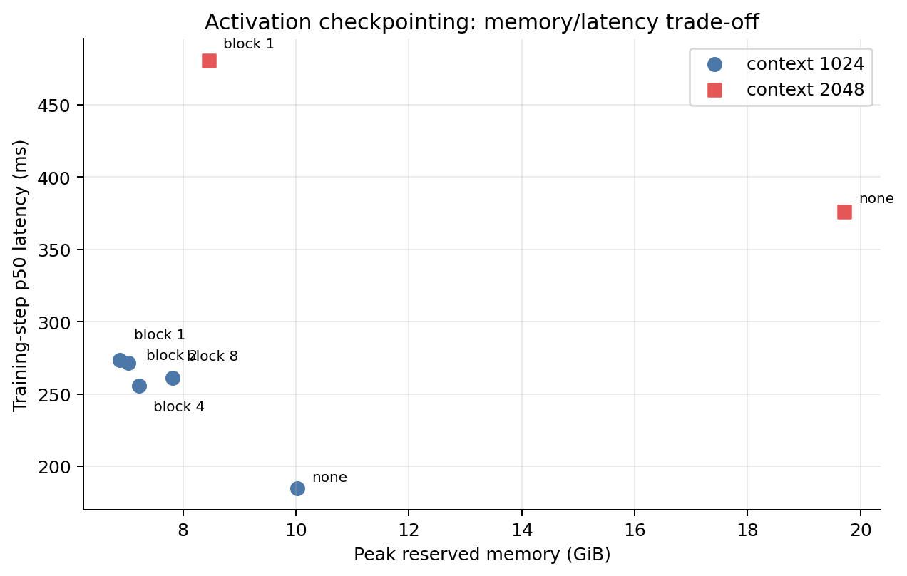
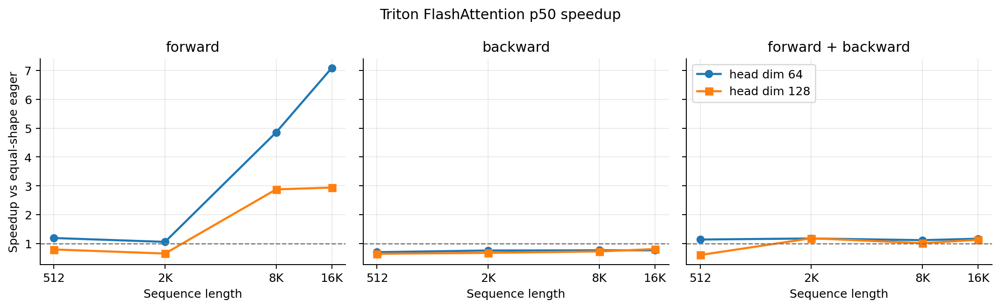
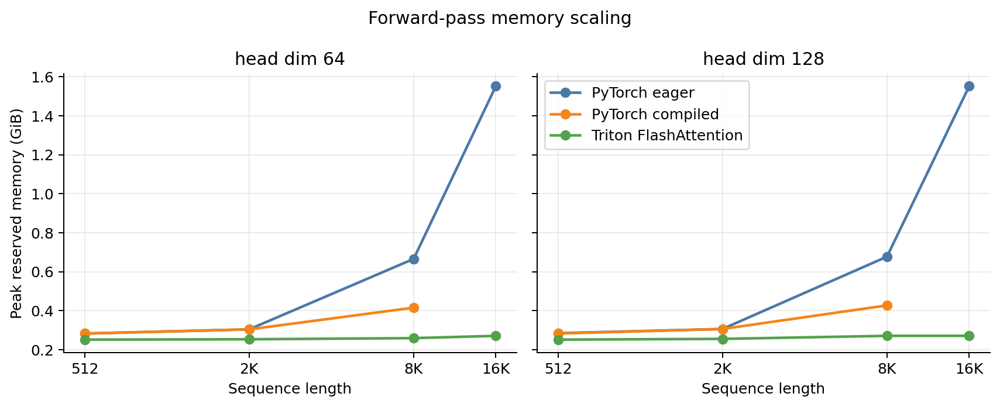

# A2-K 公开提交：李哲涵

> 本目录只包含允许公开且已经脱敏的实现、轻量结果和图片。上游工作仓库、虚拟环境、
> 编译缓存和完整运行日志不进入公开提交。
>
> 正式要求见
> [`assignments/A2-K/README.md`](../../../../assignments/A2-K/README.md)，评分说明见
> [`assignments/A2-K/EVALUATION.md`](../../../../assignments/A2-K/EVALUATION.md)。

## 基本信息

- 作业题面版本：`26.1.4-k-rc.3`
- 完成范围：Activation Checkpointing、显式 PyTorch Attention、`torch.compile`、
  FlashAttention-2 tiled PyTorch/Triton forward、重计算 backward、官方 GPU tests、
  扩展正确性和完整 RTX 4090 性能矩阵
- 未完成项：无；可选的 Triton fused backward 与 compiled 16384 矩阵未纳入必做范围
- 上游 starter commit：`ca8bc81a59b70516f7ebb2da4808daade877c736`
- 实验代码在题面要求的独立上游工作区运行；公开提交不包含上游仓库本身
- 正式性能源码指纹：
  `source-sha256:e40fed193b834f4ca7db0e26709f8cb841ce9cdeee303cf2f1869d8d56d338ed`
- TF32-off 正确性修订指纹：
  `source-sha256:cb13704307cdc3228f336975f22a43142f243b8ec48cc5f615e8f2fc5f824cd5`

## 环境与工具

| 项目 | 公开、脱敏的信息 |
| --- | --- |
| GPU | 单张 NVIDIA GeForce RTX 4090 24GB |
| 开跑前显存 | PyTorch allocator 可见总量 24111.062 MiB；80 个正式进程中的最低起始空闲显存 23717.75 MiB |
| Driver / CUDA | Driver 560.28.03；CUDA 12.6 |
| Python / PyTorch | Python 3.13.14；PyTorch 2.7.1+cu126 |
| Triton | 3.3.1 |
| power limit / P-state | 默认 450 W；P0；未超频、未降功耗 |
| TF32 | 性能矩阵允许 TF32；扩展 FP32 correctness 的 matmul 与 cuDNN TF32 均关闭 |
| compile 配置 | `torch.compile` 默认后端；cold-start 与 steady-state 分开记录，每个 shape 独立进程 |
| allocator limit / fraction | 23552 MiB / 0.9768130293 |
| 计时器 | Attention 使用 `triton.testing.do_bench` CUDA events；模型实验使用 CUDA 同步包围的 `time.perf_counter` |
| 其他限制 | 无 OOM、无编译失败；正式矩阵串行运行，每个配置使用新的 Python 进程 |

硬件、软件、命令、seed 和测量协议见
[`results/run_metadata.json`](results/run_metadata.json)，24 GiB 证据见
[`results/memory_evidence.json`](results/memory_evidence.json)。

## 1. Activation Checkpointing

### 理论与代码骨架

若忽略重计算成本，可以对连续的 `N` 个 block 做递归、嵌套 checkpoint：最外层保存整段
输入，在区间中点递归划分左右子区间，直到叶子只包含一个 block。反向时每层递归只保留
当前区间边界并重算子区间，因此峰值 activation memory 为 `O(log N)`，总 block 计算量为
`O(N log N)`。如果不允许嵌套、只用长度为 `k` 的连续块，则粗略峰值为
`O(N / k + k)`，均匀代价假设下在 `k ≈ sqrt(N)` 附近最小；真实 Transformer 中不同
activation 的尺寸和生命周期并不相同，所以最优 `k` 仍需实测。

不超过 20 行的递归骨架如下：

```python
def run_segment(blocks, lo, hi, x):
    if hi - lo == 1:
        return blocks[lo](x)
    mid = (lo + hi) // 2

    def recompute_interval(boundary):
        hidden = run_segment(blocks, lo, mid, boundary)
        return run_segment(blocks, mid, hi, hidden)

    return checkpoint(
        recompute_interval,
        x,
        use_reentrant=False,
    )
```

正式固定矩阵使用更便于控制和复现的**非嵌套连续 block checkpoint**。模型、输入、loss、
optimizer 和 seed 在各行保持相同；每行 3 次 warm-up、5 次 measurement，完整原始
step timings 在 [`results/checkpointing.csv`](results/checkpointing.csv)。

### 固定实验

| context | checkpoint block | p50 step (ms) | peak allocated (MiB) | peak reserved (MiB) | status |
| ---: | ---: | ---: | ---: | ---: | --- |
| 1024 | none | 184.95 | 10114.00 | 10272 | success |
| 1024 | 1 | 273.55 | 6914.09 | 7046 | success |
| 1024 | 2 | 271.70 | 7053.75 | 7206 | success |
| 1024 | 4 | 255.92 | 7332.59 | 7400 | success |
| 1024 | 8 | 261.12 | 7888.88 | 8006 | success |
| 2048 | none | 376.17 | 19712.61 | 20192 | success |
| 2048 | 1 | 480.51 | 8111.80 | 8666 | success |



### 分析

- context 1024 下，block 1 的 peak reserved 比 baseline 下降 **31.41%**，但 p50
  延迟增加 **47.90%**；它是标准矩阵中的最低显存配置。
- block 4 在 checkpoint 配置中最快：相对 baseline 节省 **27.96%** peak reserved，
  延迟增加 **38.37%**。这说明“checkpoint 数越多越好”并不成立；更细的边界会增加
  Python/autograd 调度和重复计算，而更粗的边界又会在重算时同时物化更多 activation。
- context 2048 下，block 1 将 peak reserved 从 20192 MiB 降到 8666 MiB，下降
  **57.08%**，代价是 p50 增加 **27.74%**。该行说明 checkpoint 在接近显存边界时的
  价值明显高于短 context；本次 baseline 也在 23 GiB allocator 预算内成功，因此没有
  fallback 或被删除的 OOM 行。

## 2. PyTorch Attention 与 `torch.compile`

### 显式 PyTorch 基线

基线明确执行 `Q @ K^T`、`1/sqrt(d)` scale、causal mask、softmax 和 `P @ V`，没有调用
`scaled_dot_product_attention` 或第三方 fused attention。输入在计时区间外创建，forward、
backward 和 forward-backward 均在区间两端同步 GPU；完整 `512/2048/8192 × 64/128 ×
3 phases` 数据在
[`results/attention_baseline.csv`](results/attention_baseline.csv)。

所有 18 个 eager 核心配置都成功。以 head dim 64 为例，forward p50 从 sequence 512 的
0.0256 ms 增长到 sequence 8192 的 1.3425 ms；forward peak reserved 从 290 MiB 增长到
682 MiB。二次方 score/probability 中间量在长序列上逐渐主导显存。

### Compile 对照

Attention 的代表 shape 结果如下；cold-start 包含首次 graph capture/code generation，
steady-state p50 不包含首次编译。

| shape | phase | eager p50 (ms) | compiled p50 (ms) | steady speedup | compiled cold-start (ms) |
| --- | --- | ---: | ---: | ---: | ---: |
| 512 × 64 | forward | 0.0256 | 0.0143 | 1.79x | 1936.46 |
| 512 × 64 | forward-backward | 0.6523 | 2.3388 | 0.28x | 1260.59 |
| 2048 × 128 | forward | 0.0788 | 0.0430 | 1.83x | 1689.11 |
| 2048 × 128 | forward-backward | 0.6687 | 0.5878 | 1.14x | 1198.64 |
| 8192 × 128 | forward | 1.3609 | 0.6113 | 2.23x | 1699.22 |
| 8192 × 128 | forward-backward | 3.4488 | 1.6451 | 2.10x | 1190.37 |

Stanford small 模型的完整对照：

| mode | eager p50 (ms) | compiled p50 (ms) | steady speedup | compiled cold-start (ms) |
| --- | ---: | ---: | ---: | ---: |
| forward | 22.18 | 8.52 | 2.61x | 11994.7 |
| forward-backward | 80.93 | 48.54 | 1.67x | 23610.7 |
| train step | 100.85 | 45.14 | 2.23x | 13268.0 |

完整数据见 [`results/compile_comparison.csv`](results/compile_comparison.csv)。结果表明：

1. 编译收益随工作量增大而更容易覆盖 launch/调度开销；512 × 64 的完整
   forward-backward 反而显著变慢。
2. 每个正式 shape 都在独立进程中编译，避免把上一 shape 的缓存误算为 cold-start；
   代价是必须为 shape specialization 分别支付首次编译成本。
3. 本实验没有导出额外 graph-break counter，因此不声称“完全没有 graph break”；
   可确认的是所有固定配置均成功编译并完成 steady-state 测量。
4. 对只运行少量 step 的任务，1.2–23.6 秒 cold-start 可能超过 steady-state 节省；
   对重复训练 step，2.23x 的完整模型收益才有机会摊销编译成本。

## 3. FlashAttention-2 Forward

### Pure PyTorch tiled reference

纯 PyTorch `FlashAttentionPytorch` 使用 64 × 64 query/key tile，不物化完整 attention
矩阵。每个 query tile 维护 FP32 `running_max`、`running_sum` 和 output accumulator，
逐个扫描 key/value tile 并合并 online softmax 状态。forward 输出 `O`，并保存
`Q/K/V/O` 与唯一一个 `[batch, n_queries]` FP32 log-sum-exp 张量 `L`。接口
`is_causal=False`，adapter 返回类对象而不是实例或已有 fused 实现。

### Triton kernel

正式路径的 `FlashAttentionTriton` 使用学生编写的 `@triton.jit` forward kernel：

- launch grid 为 `(batch, ceil(n_queries / BLOCK_Q))`，一个 program 负责一个 query tile；
- BF16 性能矩阵使用 `BLOCK_Q=64`、`BLOCK_K=64`、`num_warps=4`、
  `num_stages=2`；
- query tile 常驻，kernel 内循环加载 key/value tile；
- `m_i`、`l_i` 和 `acc_o` 使用 FP32，执行数值稳定的 online softmax；
- causal mask 使用全局 query/key 位置比较，越界 key 和未来 token 都被置为 `-inf`；
- 输出 BF16 `O` 和 FP32 `L`，保存内容与 PyTorch tiled path 一致。

没有调用 PyTorch SDPA、第三方 flash-attn 或 xFormers。正式 CUDA tests 和性能矩阵执行的
正是 adapter 暴露的该 Triton forward。

## 4. Backward 与正确性

### 重计算式 backward

必做 backward 在 forward 保存的 `Q/K/V/O/L` 上重计算：

```text
P  = exp(S - L)
D  = rowsum(O * dO)
dP = dO @ V^T
dS = P * (dP - D)
dQ = dS @ K / sqrt(d)
dK = dS^T @ Q / sqrt(d)
dV = P^T @ dO
```

PyTorch tiled 和 Triton forward 两个 `autograd.Function` 都接入该重计算路径；Triton
forward 的必做 backward 使用 `torch.compile` 编译的普通 PyTorch 函数。仓库中还保留了
一个实验性的 Triton backward 类，但 adapter 和正式矩阵**没有**用它替换必做路径，
因此本文不把它计作必做性能结果。

### 官方 GPU tests

在真实 RTX 4090 CUDA 环境运行：

```bash
python -m pytest tests/test_attention.py -v
```

[`results/unit_tests.txt`](results/unit_tests.txt) 中记录为 **6 passed、0 failed、
0 skipped**。其中包含 PyTorch forward/backward、Triton causal/non-causal forward 和
Triton causal/non-causal backward。

### 扩展正确性

扩展矩阵覆盖两个实现、3 个 seed、head dim 32/64/128、causal/non-causal、BF16，以及
额外的 FP32 + TF32-off 配置，共 **38/38 passed**。逐行 shape、容差和
`O/L/dQ/dK/dV` 误差见
[`results/correctness.json`](results/correctness.json)。

| implementation | tensor | 最大绝对误差 | 最大相对误差 |
| --- | --- | ---: | ---: |
| PyTorch tiled | O | 7.70e-3 | 2.73e1 |
| PyTorch tiled | L | 4.77e-7 | 1.04e-7 |
| PyTorch tiled | dQ / dK / dV | 7.81e-3 / 1.56e-2 / 3.13e-2 | 3.89e1 / 3.17e1 / 2.43e1 |
| Triton | O | 8.22e-3 | 2.48e2 |
| Triton | L | 1.40e-3 | 2.39e-4 |
| Triton | dQ / dK / dV | 7.81e-3 / 7.81e-3 / 1.95e-3 | 2.55e2 / 5.58e1 / 1.13e1 |

相对误差在 reference 接近零时会被放大，因此不能脱离绝对误差和 `allclose` 容差解读；
所有行同时满足各自记录的 `atol/rtol`。TF32-off 修订只改变正确性初始化顺序，没有改动
正式性能 kernel；两个源码指纹都保存在
[`results/run_metadata.json`](results/run_metadata.json)。

## 5. 性能矩阵

### 配置与命令

- 单张 RTX 4090 24GB，batch size 1，BF16，causal attention；
- 核心矩阵：sequence 512/2048/8192，head dim 64/128，forward/backward/
  forward-backward，eager/compiled/Triton 三种实现；
- 长序列边界：sequence 16384，head dim 64/128，三种 phase，eager 与 Triton；
- 每行独立 Python 进程、串行执行；最低起始空闲显存 23717.75 MiB；
- 每个进程首次创建 CUDA tensor/模型前设置 23552 MiB allocator 上限；
- `triton.testing.do_bench(warmup=100, rep=300, quantiles=[0.2, 0.5, 0.8])`；
- 输入创建、随机数生成、首次 compile 和显存统计初始化均在正式计时区间外。

最小入口：

```bash
python student_scripts/a2k/run_formal_matrix.py \
  --root local_results/a2k \
  --categories all
```

完整 66 行 p20/p50/p80、显存、tile 和 speedup 在
[`results/flash_benchmark.csv`](results/flash_benchmark.csv)。

### 结果与图





代表性 p50 结果：

| seq | head dim | phase | eager (ms) | compiled (ms) | Triton (ms) | Triton / eager |
| ---: | ---: | --- | ---: | ---: | ---: | ---: |
| 512 | 64 | forward | 0.0256 | 0.0143 | 0.0215 | 1.19x |
| 8192 | 64 | forward | 1.3425 | 0.5847 | 0.2765 | 4.86x |
| 16384 | 64 | forward | 5.2838 | optional/not run | 0.7455 | 7.09x |
| 16384 | 128 | forward | 5.3330 | optional/not run | 1.8135 | 2.94x |
| 8192 | 64 | backward | 2.1238 | 1.0609 | 2.7781 | 0.76x |
| 16384 | 64 | forward-backward | 13.6054 | optional/not run | 11.6633 | 1.17x |
| 16384 | 128 | forward-backward | 13.8112 | optional/not run | 12.2194 | 1.13x |

Forward 显存边界：

| seq | head dim | eager peak reserved (MiB) | Triton peak reserved (MiB) | Triton 节省 |
| ---: | ---: | ---: | ---: | ---: |
| 8192 | 64 | 682 | 266 | 61.0% |
| 8192 | 128 | 694 | 278 | 59.9% |
| 16384 | 64 | 1590 | 278 | 82.5% |
| 16384 | 128 | 1590 | 278 | 82.5% |

### 分析

1. **短序列有固定开销。** 512/2048、head dim 128 的 Triton forward 分别只有
   0.79x/0.65x eager speedup；tile launch、mask 和 online-softmax bookkeeping 尚未被
   `O(S^2)` 工作量摊销。
2. **长序列 forward 获益明显。** sequence 16384、head dim 64 达到 7.09x，且 peak
   reserved 从 1590 MiB 降到 278 MiB。Triton forward 不保存二次方 score/probability，
   显存曲线近似保持平坦。
3. **head dim 会改变算术强度与 tile 效率。** 同为 16384，head dim 128 的 forward
   speedup 为 2.94x，低于 head dim 64 的 7.09x；当前统一 64 × 64 tile 并非所有 D 的
   全局最优配置。
4. **必做 backward 不是 fused Triton backward。** 它使用 `torch.compile` 的重计算式
   PyTorch 实现，所以 backward speedup 范围只有 0.64x–0.81x，并在长序列产生额外临时
   张量；例如 16384 × 64 backward 的 Triton path peak reserved 为 4242 MiB，高于 eager
   的 3126 MiB。forward 的 kernel 优势仍使多数中长序列 forward-backward 达到约
   1.01x–1.18x，但这也是当前最主要的优化空间。
5. **没有静默删除失败行。** 7 个 checkpoint、6 个模型 compile 和 66 个 attention 配置
   均成功，没有 OOM 或编译失败。compiled 16384 是题面可选项，本次明确标记为未运行，
   没有用其他 shape 代替。

## 6. 限制与复现

- 代码同步命令：`python3 scripts/sync_a2k_submission.py --name '李哲涵'`
- 轻量结果目录：`results/`
- 24G 显存证据：最高 peak allocated **19712.61 MiB**，最高 peak reserved
  **20192 MiB**，allocator limit **23552 MiB**，hard limit **24576 MiB**，
  `within_24gib=true`
- 正式结果进程：80 个成功，0 个 OOM/失败；GPU 起始空闲显存最小值
  23717.75 MiB
- 未提交的本地大型原始文件：逐配置 JSON、子进程日志和编译缓存仅保留在个人工作区；
  不进入公开仓库
- 已知限制：
  1. 必做 backward 使用 compiled PyTorch 重计算，不是自定义 Triton backward；
  2. 没有额外提交 `nvidia-smi` 进程级峰值采样，显存证据使用 PyTorch
     max allocated/reserved；
  3. compiled 16384 是题面可选项，本次未运行，也没有用其他 shape 代替
- 最小复现步骤：

```bash
python -m pytest tests/test_attention.py -v
python student_scripts/a2k/correctness.py \
  --output local_results/a2k/results/correctness.json
python student_scripts/a2k/run_formal_matrix.py \
  --root local_results/a2k \
  --categories checkpoint compile attention
python student_scripts/a2k/render_assets.py \
  --results local_results/a2k/results \
  --assets local_results/a2k/assets
```

## 飞书补充文档

- 链接：https://fudan-nlp.feishu.cn/wiki/I1hAw9jswiF58mkPddWcgA1xnHg?from=from_copylink
- 当前用途：组织内公开的 A2-K 补充文档，保存助教审核所需的最小差量信息

补充文档只保存公开仓库不适合承载、但助教确有审核需要的最小差量信息；不会上传编译缓存、
完整 trace、binary、内部资源信息或凭据。

## 自检

- [x] 本目录只包含本人本次 A2-K 的文件。
- [x] 正式结果全部来自单张 RTX 4090 24GB，且开跑前可用显存不少于 22 GiB。
- [x] 每个正式脚本独立、串行执行，首次 CUDA allocation 前设置 23552 MiB allocator 上限。
- [x] README 是 Markdown 主报告，所有图片使用相对路径和有意义的 alt text。
- [x] checkpoint、baseline、compile、正确性与 Flash benchmark 的必交结果齐全。
- [x] PyTorch baseline 没有调用已有 fused attention。
- [x] 提交包含学生自己编写的真实 `@triton.jit` forward kernel。
- [x] 官方 CUDA tests 的 pass/fail/skip 如实记录。
- [x] 每个关键数字都能回到命令、`results/` 或 metadata。
- [x] `results/` 与 `assets/` 附件合计不超过 2 MiB，README 和单文件均未超限。
- [x] 未提交 compile cache、PTX/CUBIN、binary、完整 trace、上游仓库或依赖环境。
- [x] GitHub 内容不含内部主机名、IP、账号、路径、UUID、进程或未公开项目。
- [x] GitHub 和飞书正文都不含 Secret、Token、Cookie、密码或私钥。
- [x] 已确认飞书补充文档为组织内公开，且未开启互联网公开访问。
