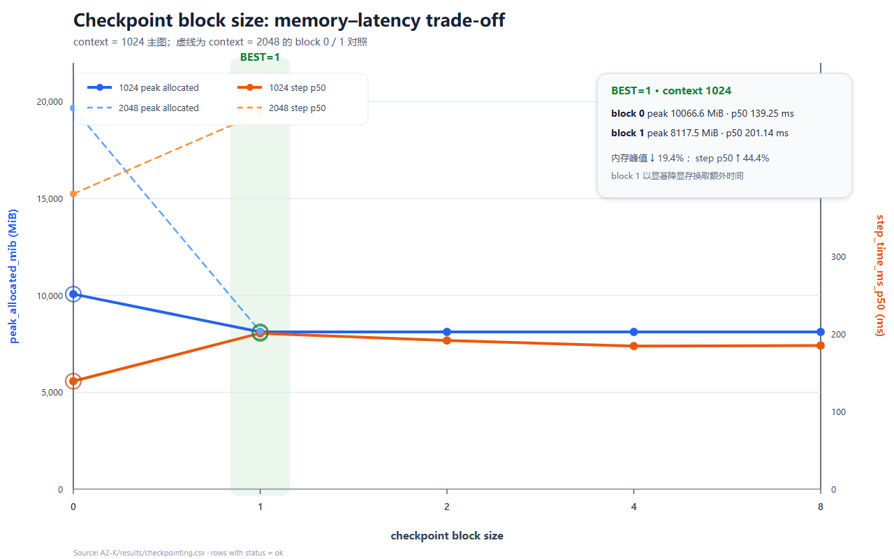
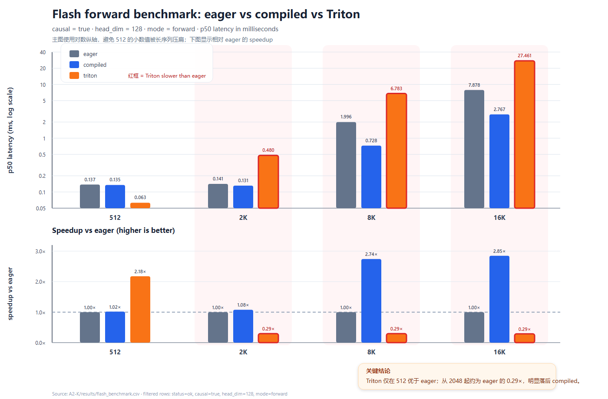
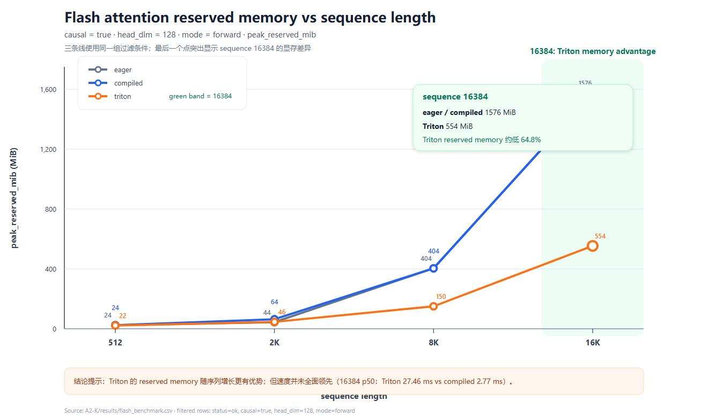

# A2-K 公开提交：李畅松

GPU 操作步骤见 [`docs/li-changsong-a2-gpu-manual.md`](../../../../docs/li-changsong-a2-gpu-manual.md)。公开提交只包含学生实现、轻量汇总与压缩图片，不包含编译缓存、完整 trace 或上游仓库。

## 基本信息

- 作业题面版本：`26.1.4-k-rc.3`
- 完成范围：activation checkpointing、显式/compiled attention、PyTorch tiled reference、Triton forward/backward、官方测试、108 组扩展正确性、核心与 16384 性能矩阵
- 未完成项：飞书链接待手动补充
- 上游 starter commit：`ca8bc81a59b70516f7ebb2da4808daade877c736`

## 环境与工具

| 项目 | 公开、脱敏的信息 |
| --- | --- |
| GPU | NVIDIA GeForce RTX 4090 |
| 开跑前显存 | 48626 MiB free / 49140 MiB total |
| Driver | 550.163.01 |
| CUDA / PyTorch | CUDA 12.4 / PyTorch 2.5.1+cu124 |
| Triton | 3.1.0（Python 3.12 compiled/最终矩阵）；早期 kernel 实验为 3.6.0 |
| TF32 | 扩展 FP32 correctness 中关闭；性能矩阵使用 BF16 |
| compile | `torch.compile(..., fullgraph=True)`，cold start 与 steady-state 分开 |
| allocator budget | 23552 MiB；汇总峰值见 `memory_evidence.json` |
| power/P-state | 450.00 W / P8 |

## 1. Activation Checkpointing

非嵌套 checkpoint 将连续 TransformerBlock 分组；forward 只保存组边界 activation，backward 时重算组内 forward。理想化地选择约 `sqrt(N)` 个边界可使保存 activation 与重算区间均为 `O(sqrt(N))`，总计算仍为 `O(N)` 但常数增加。

固定实验见 [`results/checkpointing.csv`](results/checkpointing.csv)：

| context | block | p50 ms | peak allocated MiB | peak reserved MiB |
| ---: | ---: | ---: | ---: | ---: |
| 1024 | 0 | 139.25 | 10066.6 | 10252 |
| 1024 | 1 | 201.14 | 8117.5 | 8162 |
| 1024 | 2 | 191.84 | 8118.4 | 8162 |
| 1024 | 4 | 184.55 | 8117.5 | 8220 |
| 1024 | 8 | 185.21 | 8118.4 | 8222 |
| 2048 | 0 | 381.03 | 19664.1 | 20192 |
| 2048 | 1 | 485.44 | 8137.7 | 9414 |

按严格最低 peak allocated 选择 `BEST=1`。在 context 2048 下，它将 allocated peak 降低约 58.6%，代价是 p50 增加约 27.4%。block 4 在 1024 下时间更好但 allocated 高 0.0005 MiB，因此最佳配置取决于主目标是严格最低显存还是延迟/显存折中。



## 2. PyTorch Attention 与 `torch.compile`

显式 eager 基线实现 `QK^T -> scale -> causal mask -> softmax -> PV`，没有调用 fused SDPA。六组核心结果见 [`results/attention_baseline.csv`](results/attention_baseline.csv)。三个代表配置的 compiled 结果见 [`results/compile_comparison.csv`](results/compile_comparison.csv)。

| sequence / dim | compile cold start ms | steady forward-backward p50 ms |
| --- | ---: | ---: |
| 512 / 64 | 32636.58 | 0.3953 |
| 2048 / 128 | 2878.71 | 0.3830 |
| 8192 / 128 | 3210.55 | 1.8446 |

另补采 Stanford small Transformer、batch 1、context 512、BF16、5 步 warm-up、10 步测量：

| mode | eager p50 (ms) | compiled p50 (ms) | compiled cold start (ms) | compiled/eager speedup |
| --- | ---: | ---: | ---: | ---: |
| forward | 13.179 | 3.674 | 39704.92 | 3.59× |
| forward_backward | 45.685 | 13.983 | 32759.77 | 3.27× |
| train_step | 57.377 | 25.653 | 28.12 | 2.24× |

该对照结果已追加到 [`results/compile_comparison.csv`](results/compile_comparison.csv)。

cold start 明显大于微基准 steady-state，必须单独报告。compiled graph 对 shape 专门化；更换 shape 可能触发新编译，缓存后的 p50 才适合与 eager 比较。

## 3. FlashAttention-2 Forward

PyTorch reference 对 query/key 轴分 tile，维护 row maximum `m`、normalizer `z` 和 FP32 value accumulator，不分配完整 `N×N` probability matrix。autograd 保存 Q/K/V/O 和唯一一个 `[batch, sequence]` 的 log-sum-exp L。

学生 Triton kernel 以一个 query row/program 为 grid，在 kernel 内循环 key/value block；使用 online softmax、FP32 accumulator、causal mask，支持 head dimension 32/64/128。实现通过 `tests/adapters.py` 暴露，不调用第三方 FlashAttention。

## 4. Backward 与正确性

Backward 使用保存的 L/O 重算 probability tile，并利用 `D_i = dot(dO_i, O_i)` 计算 dS，再得到 dQ/dK/dV。官方测试记录见 [`results/unit_tests.txt`](results/unit_tests.txt)：

```text
6 passed, 0 failed, 0 skipped
```

扩展正确性见 [`results/correctness.json`](results/correctness.json)，覆盖 3 seeds、FP32/BF16、causal/non-causal、head dim 32/64/128、sequence 128/512/2048，共 108 组，状态为 `ok`。全矩阵最大绝对误差：O 0.0078125、dQ 0.015625、dK 0.015625、dV 0.03125。

## 5. 性能矩阵

性能结果见 [`results/flash_benchmark.csv`](results/flash_benchmark.csv)，统一 batch 1、BF16、100 ms warm-up、300 ms repetition，并报告 p20/p50/p80、allocated/reserved 与 speedup。核心 12 组和 sequence 16384 的 4 组边界配置均包含 eager、compiled 与 Triton。

以 causal、head dim 128、forward p50 为例：

| sequence | eager ms | compiled ms | Triton ms | Triton reserved MiB |
| ---: | ---: | ---: | ---: | ---: |
| 512 | 0.1374 | 0.1352 | 0.0631 | 22 |
| 2048 | 0.1413 | 0.1312 | 0.4802 | 46 |
| 8192 | 1.9958 | 0.7281 | 6.7834 | 150 |
| 16384 | 7.8781 | 2.7668 | 27.4613 | 554 |

当前学生 kernel 在 512 上 forward 约 2.18× faster than eager，但在更长序列上受逐 row program、循环与 backward atomic accumulation 限制，速度落后于 compiled；优势主要体现在长序列 reserved memory，例如 16384 时 Triton 约 554 MiB，而 eager/compiled 约 1576 MiB。结果如实保留，没有只展示有利 shape。





## 6. 限制与复现

- 轻量显存证据见 [`results/memory_evidence.json`](results/memory_evidence.json)，所有汇总峰值低于 23552 MiB
- 大型编译缓存和本地原始日志未提交
- 已知限制：无；硬件元数据来自正式运行前 `nvidia-smi` 采样
- 最小复现：激活 Python 3.12/CUDA 12.4 环境后执行 `./run_all_missing_a2_gpu.sh`
- 代码同步：`python3 scripts/sync_a2k_submission.py --name '李畅松'`

## 飞书补充文档

- 链接：[A2-P / A2-K GPU 补充材料](https://fudan-nlp.feishu.cn/wiki/QvEmwHImPibuSMkYxbucPKzOn0e)

## 自检

- [x] Checkpoint、baseline、compile、正确性和 Flash 核心/边界结果均为 RTX 4090 实测
- [x] 官方 CUDA tests 为 6 passed、0 skipped
- [x] 提交包含学生 `@triton.jit` kernel 与两个 autograd path
- [x] 未提交 compile cache、PTX/CUBIN、完整 trace、binary 或依赖环境
- [x] 已放置 checkpointing、Flash latency/speedup 和 Flash memory 三张压缩图片
- [x] 补充 Driver、开跑前显存和 power/P-state
- [ ] 补充飞书链接
