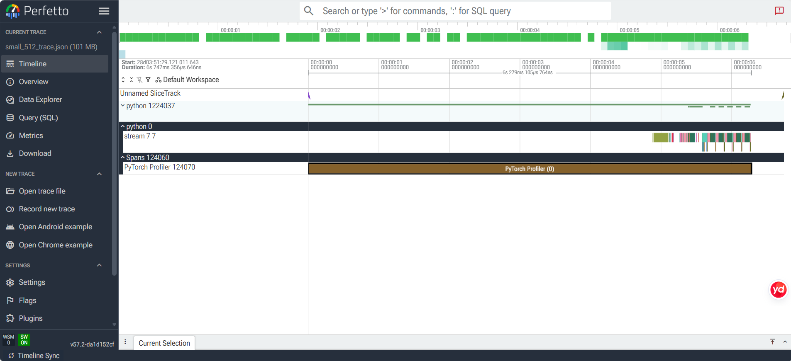
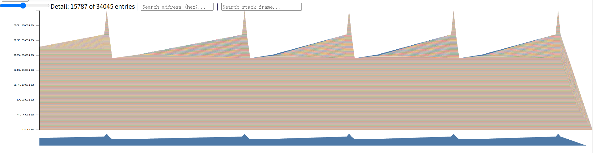
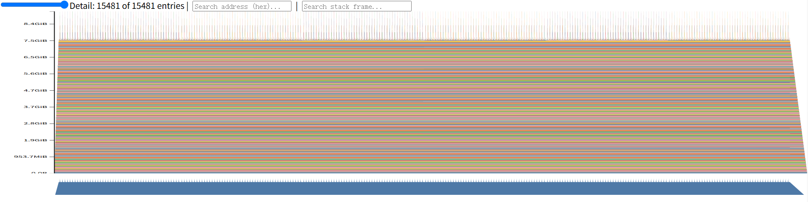

# A2-P 公开提交：李畅松

GPU 操作步骤见 [`docs/li-changsong-a2-gpu-manual.md`](../../../../docs/li-changsong-a2-gpu-manual.md)。大型 Chrome trace 和 allocator snapshot 只保留在个人工作区，公开提交仅包含轻量、脱敏汇总。

## 基本信息

- 作业题面版本：`26.1.4-rc.3`
- 完成范围：端到端 benchmark、六组 CUDA profile、混合精度 benchmark、XL memory snapshot 与 OOM 边界记录
- 未完成项：飞书链接待手动补充
- 上游 starter commit：`ca8bc81a59b70516f7ebb2da4808daade877c736`

## 环境与工具

| 项目 | 公开、脱敏的信息 |
| --- | --- |
| GPU | NVIDIA GeForce RTX 4090 |
| Driver | 550.163.01 |
| 开跑前显存 | 48626 MiB free / 49140 MiB total |
| CUDA / PyTorch | CUDA 12.4 / PyTorch 2.5.1+cu124 |
| Compute profiler | `torch.profiler`，CPU/CUDA activities，Chrome trace/Perfetto |
| Python | 3.12.13（重跑 benchmark/profile）；部分较早的 mixed/memory 为 3.13.14 |

## 1. End-to-End Benchmark

统一配置为 small、batch 4、context 512、FP32。模型和随机 batch 在计时前创建；warm-up 与 measurement 分离，每个 CUDA 测量区间前后同步。三种 mode 分别为 forward、forward+backward 和完整 train step。完整原始 timing、均值、样本标准差和 CV 见 [`results/benchmark.csv`](results/benchmark.csv)。

| mode | warm-up | mean ms | std ms | CV |
| --- | ---: | ---: | ---: | ---: |
| forward | 5 | 24.276 | 0.443 | 0.0183 |
| forward+backward | 5 | 79.893 | 0.604 | 0.00756 |
| train step | 5 | 89.271 | 0.129 | 0.00145 |
| train step | 0 | 121.738 | 99.745 | 0.8193 |

无 warm-up 时首步为 405.58 ms，包含 CUDA context、allocator 和 lazy initialization 开销；5 步 warm-up 后十次测量稳定在约 89.27 ms。forward+backward 与完整 step 的差约 9.38 ms，主要对应 AdamW update。

## 2. Compute Profiling

六组实验使用 small/medium 与 context 256/512/1024 的笛卡尔积，batch 1、BF16、完整 train step、5 步 warm-up 和 1 个 measurement step。轻量 op/event、calls 与累计 CPU/CUDA 时间见 [`results/profile/trace_summary.csv`](results/profile/trace_summary.csv)，配置与环境见 [`results/profile/run_metadata.json`](results/profile/run_metadata.json)。完整 trace 未提交。

代表性 trace 应在 Perfetto 中裁剪到 measurement step，保留 forward、backward、optimizer、CUDA kernel 与 stream。`torch.profiler` 能关联框架 op、autograd 与 CUDA activity，但不等价于 Nsight Systems 的完整 CUDA API/系统时间线证据。

## 3. Mixed Precision

四种累加结果见 [`results/mixed_precision.json`](results/mixed_precision.json)：FP16 输入在进入 FP32 accumulator 前已经量化，1000 个 0.1 得到 99.9755859375；提高 accumulator 精度不能恢复输入阶段丢失的信息。低精度 accumulator 还会引入逐步舍入，显示为 100.0 只是本例的最终舍入结果。

ToyModel dtype trace 已在 Python 3.12/CUDA 上补采。FP32 下三层输出、loss 和 gradient 均为 FP32；BF16 autocast 下三层输出为 BF16，而参数、loss 和 gradient 仍为 FP32。峰值 allocated 分别为 16.27 MiB 和 17.26 MiB。

相同 small/batch 4/context 512/train-step 配置下：

| dtype | mean ms | std ms | last loss |
| --- | ---: | ---: | ---: |
| FP32 | 89.521 | 0.129 | 5.01833 |
| BF16 autocast | 60.063 | 0.683 | 5.01782 |

BF16 autocast 的端到端时间约为 FP32 的 67.1%，即约 1.49× speedup。参数/optimizer master state 仍为 FP32，eligible matmul 使用 BF16，reduction 和归一化等敏感计算可保留 FP32。

## 4. Memory Profiling

峰值由 allocator snapshot 的事件轨迹汇总，见 [`results/memory/peaks.csv`](results/memory/peaks.csv) 和 [`results/memory/run_metadata.json`](results/memory/run_metadata.json)。

| 配置 | mode | peak allocated MiB | peak reserved MiB | 状态 |
| --- | --- | ---: | ---: | --- |
| XL / 128 / FP32 | forward | 7644.1 | 7834 | ok |
| XL / 128 / FP32 | train step | 38134.5 | 40074 | ok |
| XL / 2048 / FP32 | forward | 9310.5 | 9930 | ok |
| XL / 2048 / FP32 | train step | — | — | OOM |

对 XL（width 1600、batch 1），单个 FP32 residual tensor 理论大小为 `B*T*D*4`：context 128 为 0.78125 MiB，context 2048 为 12.5 MiB。训练峰值远大于单个 residual，因为 autograd 保存各 TransformerBlock 输入并在 backward 产生梯度和 optimizer state。XL/2048 train step 保留真实 CUDA OOM 日志，没有将较小配置冒充原配置。

## 5. 限制与复现

- 代码同步：`python3 scripts/sync_a2p_submission.py --name '李畅松'`
- 大型原始文件：六个 Chrome trace 和三个 allocator snapshot 仅本地保留
- 已知限制：无；开跑前显存为正式运行前 `nvidia-smi` 采样值
- 最小复现：激活 Python 3.12/CUDA 12.4 环境后运行 `./run_all_missing_a2_gpu.sh`

## 飞书补充文档

- 链接：[A2-P / A2-K GPU 补充材料](https://fudan-nlp.feishu.cn/wiki/QvEmwHImPibuSMkYxbucPKzOn0e)

## 自检

- [x] Benchmark、profile、mixed precision 和 memory 轻量结果均可追溯
- [x] 正式 benchmark/profile 均来自 RTX 4090 CUDA 运行
- [x] 未提交完整 trace、snapshot、pickle、权重或依赖环境
- [x] 已放置 1 张 profile 图和 2 张 memory timeline 图（PNG，总附件约 0.45 MiB）
- [x] 补充 Driver 与开跑前显存
- [ ] 补充飞书链接
