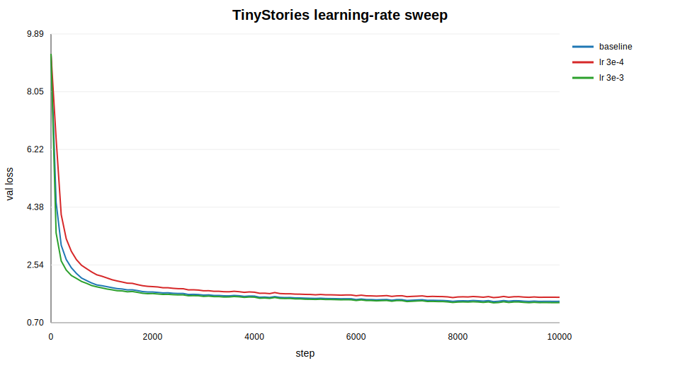
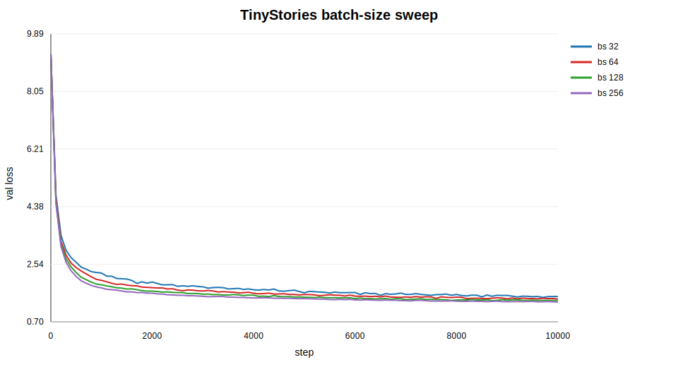
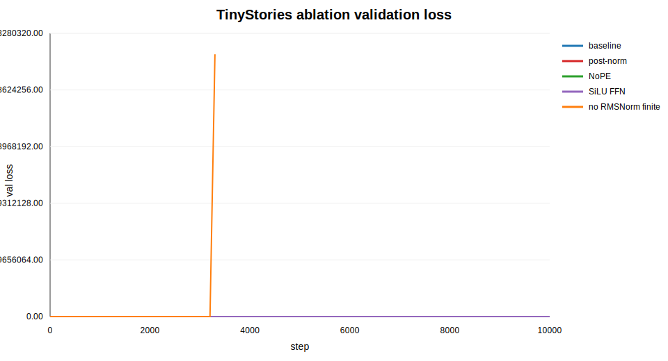
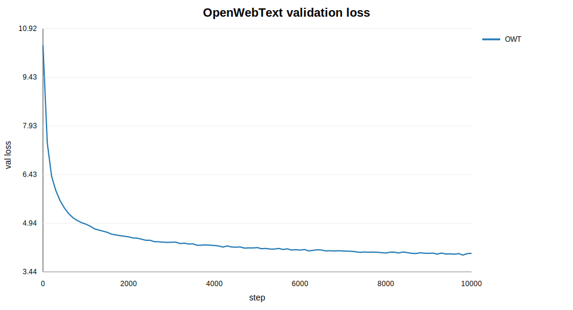
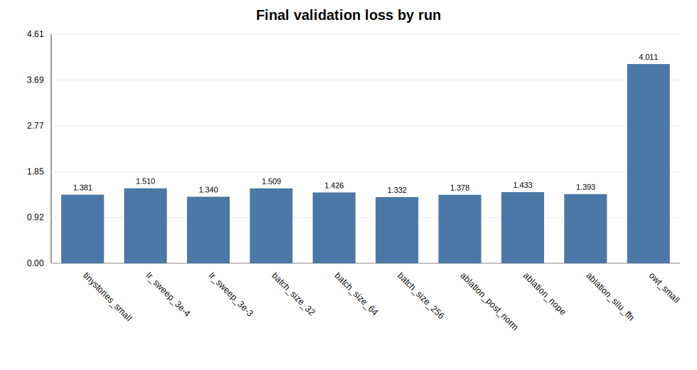

# A1 公开提交：杨枢栋

> 本文件和同目录代码公开可见。提交内容只包含公开代码、轻量配置、实验日志和图表；数据集、
> checkpoint、虚拟环境、内部服务器路径和访问凭据不进入 GitHub。

## 基本信息

- 作业题面版本：26.0.4
- 完成范围：BPE tokenizer、Transformer LM、训练工具、checkpoint、生成脚本、TinyStories/OWT 数据编码与训练、学习率 sweep（含高 LR 发散 run）、batch size sweep（含 batch size 1、64、128 和显存上限探测）、四个消融、日志和图表。
- 未完成项：无。`ablation_no_rmsnorm` 已运行但在原超参数下发散为 NaN，作为消融失败结果如实记录。
- 上游 starter commit：`a158843b20107949f1a8d7df1b05cd33b9166712`
- 本地工作仓库：`../assignment1-basics`
- 测试结果：非沙箱环境运行 `python -m pytest -q`，结果为 `47 passed, 1 xpassed`。

## 书面题

### Unicode 与 UTF-8

Unicode 码点是字符的抽象编号，UTF-8 是把码点写成 byte 序列的编码方式。例如 `"牛"` 是一个
Unicode 字符，码点为 `U+725B`，UTF-8 bytes 为 `E7 89 9B`。Python 中遍历 `bytes` 得到的是
`0..255` 的整数，不一定对应完整字符。

Byte-level BPE 先把文本编码成 bytes，因此基础词表只需要覆盖 256 个 byte value，就不会出现
OOV。BPE 再通过高频 pair merge 把常见 byte 序列压成更长 token，从而降低序列长度。

Unicode 还存在“显示相同但 byte 不同”的情况，例如预组合字符 `é` 和 `e` 加 combining acute
accent。两者视觉上接近，但 UTF-8 bytes 不同，未经 normalization 时 tokenizer 会得到不同
token 序列。因此 tokenizer 实现必须明确以输入原始 bytes 为准，decode 时把 token bytes 拼接后
整体 UTF-8 解码，不能逐 token 单独解码。

### AdamW 显存、FLOPs 与训练时间核算

本实验主模型配置为 `d_model=512`、`num_layers=4`、`num_heads=16`、`d_ff=1344`、
`context_length=256`。参数量由实现模型直接统计：

| 词表 | 参数量 | 参数 fp32 | AdamW 训练状态估算 |
| --- | ---: | ---: | ---: |
| TinyStories 10K | 22.70M | 86.58 MiB | 346.32 MiB |
| OWT 32K | 45.22M | 172.52 MiB | 690.07 MiB |

AdamW 训练状态按 `param + grad + first moment + second moment` 估算，即 fp32 下约
`4 * 4 bytes * num_params`。该表不包含 activation、CUDA workspace、data loader 和临时张量。

FLOPs 使用常见近似：每个线性层 multiply-add 计 2 FLOPs，训练约为 forward 的 3 倍。
TinyStories 10K 词表下 forward 约 `37M FLOPs/token`，训练约 `112M FLOPs/token`；
OWT 32K 词表因 LM head 更大，forward 约 `60M FLOPs/token`，训练约 `179M FLOPs/token`。
每次训练处理 `10000 * 128 * 256 = 327.68M` tokens，因此 TinyStories 主训练约 `36.6 PFLOPs`，
OWT 训练约 `58.7 PFLOPs`。实际墙钟时间分别为 1628.2 秒和 2271.6 秒。

## 实现说明

真实实现位于 `submission/cs336_basics/`，adapter 只负责把公开测试接口转发到真实实现。

- `tokenizer.py`：实现 byte-level BPE 训练、special token 处理、encode/decode 和
  `encode_iterable`。训练时按 GPT-2 风格正则预分词，pair 频率并列时使用确定性 tie-break。
- `model.py`：实现 Linear、Embedding、RMSNorm、RoPE、scaled dot-product attention、
  multi-head self-attention、SwiGLU/SiLU FFN、Transformer block 和 Transformer LM。
- `nn_utils.py`：实现数值稳定 softmax、cross entropy 和 gradient clipping。
- `training.py`：实现 batch sampler、AdamW、cosine schedule、checkpoint save/load。
- `scripts/prepare_data.py`：训练 tokenizer 并把文本编码成 NumPy token IDs。
- `scripts/train_lm.py`：读取 JSON config，训练、验证、保存 checkpoint 和 sample；高学习率诊断 run 检测到非有限 loss 或验证 loss 爆炸后会写出 summary 并提前结束。
- `scripts/run_a1_experiments.py`：顺序运行本报告中的实验，支持 `--only`、`--start-from`、
  `--skip-existing`。
- `scripts/probe_batch_memory.py`：对 batch size 做一次 forward/backward 显存探测，记录最大可运行 batch 和首次 OOM。

## Tokenizer 实验

| 数据集 | vocab | merges | train tokens | valid tokens | train bytes/token | valid bytes/token | throughput | 最长 token |
| --- | ---: | ---: | ---: | ---: | ---: | ---: | ---: | --- |
| TinyStories | 10000 | 9743 | 540,796,778 | 5,461,210 | 4.1194 | 4.1204 | 1,006,154 tok/s | `" accomplishment"` |
| OWT | 32000 | 31743 | 2,727,120,452 | 66,401,098 | 4.3711 | 4.3674 | 354,959 tok/s | 64-byte repeated UTF-8 artifact |

TinyStories 的文本风格更简单，10K vocab 已能取得约 4.12 bytes/token。OWT 语料更大且噪声更多，
32K vocab 下 compression ratio 约 4.37 bytes/token；最长 token 是重复编码痕迹，反映 OWT 中存在
网页噪声。OWT BPE 训练和编码耗时约 9.9 小时，TinyStories 约 9.1 分钟。

Tokenizer 日志：

- `logs/tokenizers/tinystories_10k_summary.json`
- `logs/tokenizers/owt_32k_summary.json`

## 训练结果

### TinyStories 主训练

基础配置：10K vocab、4 层、512 hidden、16 heads、SwiGLU、RMSNorm、RoPE、batch size 128、
context length 256、10000 steps。

| run | final val loss | time |
| --- | ---: | ---: |
| `tinystories_small` | 1.3806 | 1628.2 s |

生成样本节选：

> Once upon a time, there was a little boy named Tim. Tim loved to play outside. One day, he found a big stick in the park.

文本已经能形成 TinyStories 风格的短故事，人物、动作和简单因果关系基本连贯。

### 学习率 sweep



| run | max lr | final val loss | time |
| --- | ---: | ---: | ---: |
| `lr_sweep_3e-4` | 3e-4 | 1.5102 | 1622.4 s |
| `tinystories_small` | 1e-3 | 1.3806 | 1628.2 s |
| `lr_sweep_3e-3` | 3e-3 | 1.3402 | 1620.8 s |
| `lr_sweep_1e1_diverge` | 1e1 | 29227.3773 | 4.6 s |

`3e-4` 收敛偏慢；`1e-3` 稳定；`3e-3` 在本模型上没有发散，最终 loss 最低。为了满足 A1 5.3
对高学习率发散 run 的要求，额外补跑 `max_lr=10`、`warmup_iters=1` 的诊断实验。该 run 保持
baseline 架构不变，只改变学习率设置；step 10 时 train loss 达到 `27444.29`，validation loss
达到 `29227.38`，被记录为 `diverged_loss_explosion` 并提前停止。这说明最佳学习率需要靠近但
不能越过稳定性边界；`ablation_no_rmsnorm` 的 NaN 属于架构消融，不用于替代该学习率发散证据。

### Batch size sweep



| run | batch size | final val loss | time |
| --- | ---: | ---: | ---: |
| `batch_size_1` | 1 | 2.7052 | 186.5 s |
| `batch_size_32` | 32 | 1.5092 | 460.4 s |
| `batch_size_64` | 64 | 1.4256 | 854.5 s |
| `tinystories_small` | 128 | 1.3806 | 1628.2 s |
| `batch_size_256` | 256 | 1.3316 | 3229.7 s |

这里固定训练 step 数，因此更大的 batch size 实际看到更多 token，final loss 随 batch size 增大而
下降；代价是墙钟时间也增加。`batch_size=1` 由于每步只看 256 个 token，10000 steps 后仍明显欠
优化，final validation loss 为 2.7052。若要严格比较 batch 本身，需要固定总 token budget 或加入
gradient accumulation，本实验按作业配置记录现象。

显存上限探测使用相同 TinyStories baseline 模型做单次 forward/backward：

| batch size | 状态 | peak memory |
| ---: | --- | ---: |
| 1 | ok | 0.27 GiB |
| 64 | ok | 7.59 GiB |
| 128 | ok | 15.03 GiB |
| 256 | ok | 29.90 GiB |
| 512 | ok | 59.66 GiB |
| 1024 | OOM | - |

在 H100 80GB 上，本探测中最大成功 batch size 为 512，首次 OOM 为 1024。完整记录见
`logs/training/batch_size/memory_probe/summary.json`。

### 架构消融



| run | 改动 | final val loss | 结论 |
| --- | --- | ---: | --- |
| `tinystories_small` | baseline | 1.3806 | 稳定收敛 |
| `ablation_post_norm` | pre-norm 改 post-norm | 1.3780 | 本设置下与 baseline 接近 |
| `ablation_nope` | 去掉 RoPE | 1.4328 | 位置编码缺失带来退化 |
| `ablation_silu_ffn` | SwiGLU 改普通 SiLU FFN | 1.3927 | 略弱于 baseline |
| `ablation_no_rmsnorm` | 去掉 RMSNorm | failed NaN | 训练发散 |

`ablation_no_rmsnorm` 重跑后仍然发散。日志中最后一个 finite 点在 step 3300，`val_loss` 已达到
`1.43e29`，step 3400 首次记录 NaN。这个结果说明 normalization 对稳定 Transformer 训练非常
关键；CUDA assert 出现在最终 sampling 阶段，是 logits/probability 已经 NaN 的后果，不是根因。

### OWT 训练



| run | vocab | final val loss | time |
| --- | ---: | ---: | ---: |
| `owt_small` | 32000 | 4.0112 | 2271.6 s |

OWT 数据更复杂、词表更大，最终 loss 明显高于 TinyStories 是预期结果。生成样本能输出英文段落，
但重复和语义空转较明显：

> The meaning of life is that the view of life is only just as reflected in the way that it may be as a parent...

这说明小模型在 10000 steps 下学到了局部语言模式，但还不足以在开放网页语料上形成稳定长程语义。

### 总览



所有训练日志都位于 `logs/training/`，汇总文件为 `logs/experiments_summary.json`。

## 复现说明

环境与依赖：

- Python 3.12 conda 环境
- PyTorch `2.11.0+cu128`
- GPU 实验使用 NVIDIA H100 80GB
- 公开测试命令：`python -m pytest -q`

数据准备：

```bash
cd ../assignment1-basics
python scripts/prepare_data.py \
  --train-text data/raw/TinyStoriesV2-GPT4-train.txt \
  --valid-text data/raw/TinyStoriesV2-GPT4-valid.txt \
  --out-dir data/tinystories_10k \
  --vocab-size 10000

python scripts/prepare_data.py \
  --train-text data/raw/owt_train.txt \
  --valid-text data/raw/owt_valid.txt \
  --out-dir data/owt_32k \
  --vocab-size 32000
```

训练：

```bash
python scripts/run_a1_experiments.py --skip-existing
python scripts/run_a1_experiments.py --only owt_small
python scripts/run_a1_experiments.py --only lr_sweep_1e1_diverge batch_size_1
python scripts/probe_batch_memory.py
```

单独生成：

```bash
python scripts/generate.py --config configs/tinystories_small.json --checkpoint runs/tinystories_small/checkpoint.pt
```

同步命令：

```bash
cd ../SummerQuest-2026
python3 scripts/sync_a1_submission.py --name '杨枢栋'
```

配置文件：

- `submission/configs/tinystories_small.json`
- `submission/configs/lr_sweep_3e-4.json`
- `submission/configs/lr_sweep_3e-3.json`
- `submission/configs/lr_sweep_1e1_diverge.json`
- `submission/configs/batch_size_1.json`
- `submission/configs/batch_size_32.json`
- `submission/configs/batch_size_64.json`
- `submission/configs/batch_size_256.json`
- `submission/configs/ablation_no_rmsnorm.json`
- `submission/configs/ablation_post_norm.json`
- `submission/configs/ablation_nope.json`
- `submission/configs/ablation_silu_ffn.json`
- `submission/configs/owt_small.json`

## 代码与脚本

- 真实实现：`submission/cs336_basics/`
- 测试 adapter：`submission/tests/adapters.py`
- 训练、数据编码与生成脚本：`submission/scripts/`
- 轻量配置：`submission/configs/`

`submission/` 由 `../assignment1-basics` 同步得到，不包含公共 tests、fixtures、数据、模型权重、
虚拟环境或依赖锁。

## 实验日志

- Tokenizer：`logs/tokenizers/`
- TinyStories：`logs/training/tiny_stories/`
- 学习率 sweep：`logs/training/lr_sweep/`
- Batch size：`logs/training/batch_size/`
- 消融：`logs/training/ablations/`
- OWT：`logs/training/owt/`
- 汇总：`logs/experiments_summary.json`
- 图表：`assets/*.svg`

JSONL 日志包含 `step`、`wall_clock_sec`、`train_loss`、`val_loss` 和 `lr`；`summary.json` 包含最终
validation loss、总训练时间和关键模型配置。

## 飞书补充文档

- 链接：无。本次提交材料均为可公开内容，没有额外组织内补充文档。
