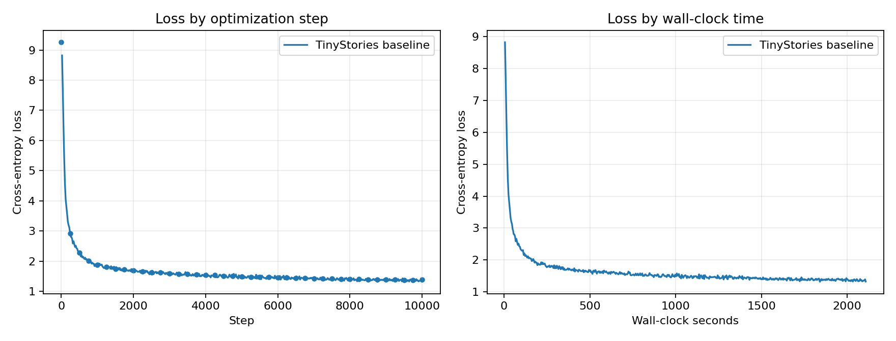
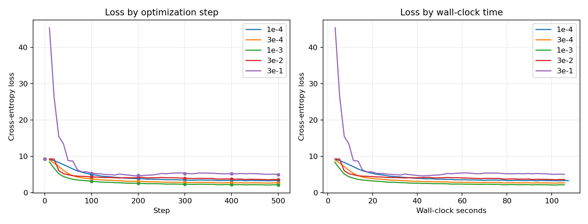
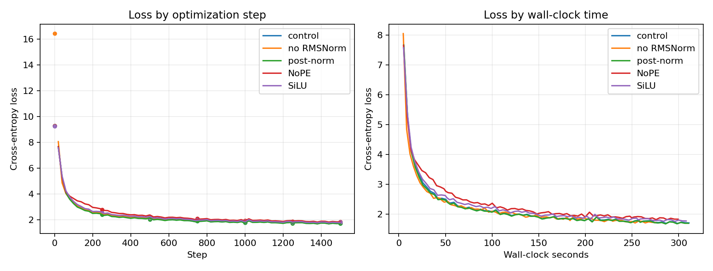
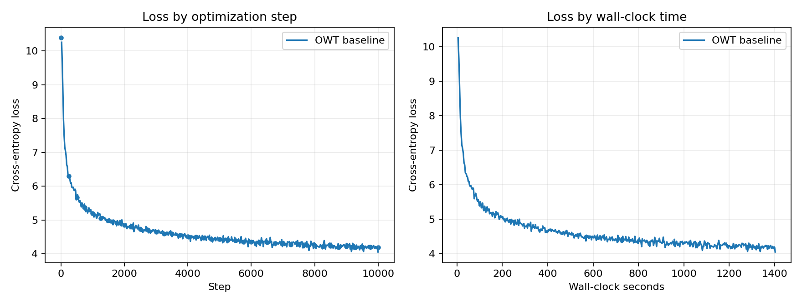

# A1 公开提交：杨永卓

> 本文件与同目录代码公开可见。实验记录仅包含公开数据集、公开配置和脱敏结果，不包含服务器地址、账号、内部路径或凭据。

## 基本信息

- 完成范围：21 个 adapter 接口、Tokenizer、Transformer LM、训练组件、TinyStories/OWT 训练、学习率与 batch size 实验、四个架构消融、文本生成
- 未完成项：无
- 上游 starter commit：`a158843b20107949f1a8d7df1b05cd33b9166712`
- 本地工作仓库：`../assignment1-basics`

## 1. 实现概览

实现位于 `submission/cs336_basics/`，adapter 只负责构造对象、加载给定权重并转发参数。核心组件均从零实现，没有调用 `nn.Linear`、`nn.Embedding`、现成 Attention、现成 AdamW 或现成 cross-entropy。

- `model.py`：Linear、Embedding、RMSNorm、SwiGLU、RoPE、causal multi-head attention、Transformer block 与 Transformer LM。
- `tokenizer.py`：byte-level BPE 训练、special token 边界、编码、解码与流式编码。
- `training.py`：稳定 softmax/cross-entropy、随机 batch、全局梯度裁剪、AdamW、cosine schedule 与 checkpoint。
- `experiment.py`：模型配置、消融开关、随机种子与实验辅助函数。
- `submission/scripts/`：数据下载、tokenizer 训练、编码、训练、生成、batch size 扫描和画图入口。

官方测试结果：本地 `46 passed, 2 skipped`；Linux 流式内存测试单独通过。macOS 跳过的两项是仅在 Linux 上启用的 `rlimit` 测试。

## 2. Unicode 书面题

### 2.1 `unicode1`

1. `chr(0)` 返回 Unicode 空字符 `U+0000`（NUL）。
2. 它的 `repr` 是可见的转义形式 `'\x00'`，而直接 `print` 时该控制字符本身不可见。
3. NUL 会真实保留在 Python 字符串中，长度也会计入；终端打印看起来像两侧文本直接相连，但与某些把 NUL 当作字符串终止符的外部接口交互时需要特别小心。

### 2.2 `unicode2`

1. UTF-8 对 ASCII 完全兼容，英文与常见网络文本通常比 UTF-16/UTF-32 更紧凑，并且没有字节序与 BOM 处理负担，因此适合以 256 个 byte value 作为稳定的基础词表。
2. 错误函数逐 byte 解码，而一个 UTF-8 字符可能由多个 byte 共同编码。例如 `"牛".encode("utf-8") == b'\xe7\x89\x9b'`，单独解码第一个 byte 就会抛出 `UnicodeDecodeError`；正确做法是先拼接完整 byte sequence，再整体解码。
3. `b'\xff\xff'` 无法解码为 UTF-8，因为 `0xff` 不是合法的 UTF-8 起始或续接 byte。

## 3. Transformer 资源核算

设序列长度为 `T`、层数为 `L`、隐藏维为 `d`、FFN 维为 `f`、词表大小为 `V`。本作业架构不共享输入 embedding 与 LM head 权重，因此参数量为：

```text
P = 2*V*d + L*(4*d^2 + 3*d*f + 2*d) + d
```

GPT-2 XL 配置 `(V, T, L, d, f) = (50257, 1024, 48, 1600, 4288)`，得到 `1,640,452,800` 个参数，float32 权重约为 6.11 GiB（6.56 GB）。

一次单序列 forward 中主要矩阵乘法为：

- 每层 Q/K/V 与 output projection：`8*T*d^2` FLOPs；
- 每层 `QK^T` 与 attention-weighted values：`4*T^2*d` FLOPs；
- 每层 SwiGLU 三个线性映射：`6*T*d*f` FLOPs；
- 最终 LM head：`2*T*d*V` FLOPs。

总 FLOPs 为

```text
F_forward = L*(8*T*d^2 + 4*T^2*d + 6*T*d*f) + 2*T*d*V
```

| 模型 | Attention 投影 | Attention 矩阵 | SwiGLU | LM head | 总计 |
|---|---:|---:|---:|---:|---:|
| GPT-2 small | 0.058 TF (19.9%) | 0.039 TF (13.3%) | 0.116 TF (39.8%) | 0.079 TF (27.1%) | 0.292 TF |
| GPT-2 medium | 0.206 TF (24.8%) | 0.103 TF (12.4%) | 0.416 TF (50.1%) | 0.105 TF (12.7%) | 0.830 TF |
| GPT-2 large | 0.483 TF (27.3%) | 0.193 TF (10.9%) | 0.960 TF (54.3%) | 0.132 TF (7.4%) | 1.769 TF |
| GPT-2 XL | 1.007 TF (28.6%) | 0.322 TF (9.2%) | 2.023 TF (57.5%) | 0.165 TF (4.7%) | 3.517 TF |

模型增大时，SwiGLU 和投影矩阵的占比上升，固定词表 LM head 的占比显著下降；在 `T = 1024` 时 FFN 是最大计算来源。GPT-2 XL 将 context length 增至 16,384 后，单次 forward 增至 133.58 TF，约为原来的 37.98 倍，其中二次增长的 attention 矩阵乘法占比升至 61.7%。

## 4. AdamW 资源核算

令 batch size 为 `B`，并按题目假设 `f = (8/3)*d`。参数、梯度和两份 optimizer moment 分别占 `4P`、`4P`、`8P` bytes。按题目指定的 activation 范围，activation 元素数估计为：

```text
A = B * [L*(8*T*d + 4*T*f + 2*H*T^2) + T*d + 2*T*V]
```

因此总峰值内存近似为

```text
M = 16*P + 4*A bytes
```

对 GPT-2 XL 代入后约为

```text
M(B) = 26.17 + 16.36*B GB
```

所以在 80 GB 内按该简化模型最多取 batch size 3（实际框架缓存、临时张量与碎片会进一步压缩余量）。

AdamW 对每个参数执行 weight decay、两阶 moment 更新和归一化更新，计算复杂度为 `Theta(P)`，按加/乘/除/平方根作为基本操作约为 `14P` 次标量运算，外加可忽略的每步标量 bias-correction 计算。

GPT-2 XL 单序列 forward 约为 `3.517e12` FLOPs；按 backward 为 forward 的 2 倍，batch 1024、400K steps 的总训练量约为 `4.321e21` FLOPs。H100 在 50% MFU 时有效吞吐为 247.5 TFLOP/s，因此单卡训练约需 4,850 小时（约 202.1 天）。

## 5. Tokenizer 实验

### 5.1 训练与编码

| 数据集 | 词表 | BPE 时间 | 训练集 tokens | 验证集 tokens |
|---|---:|---:|---:|---:|
| TinyStories | 10,000 | 535.71 s | 540,796,778 | 5,461,210 |
| OWT | 32,000 | 230.72 s | 2,729,406,441 | 66,457,464 |

### 5.2 压缩率、最长 token 与吞吐

| 10 MB 样本 | Tokenizer | bytes/token | 最长 token | 单进程吞吐 |
|---|---|---:|---|---:|
| TinyStories valid | TinyStories 10K | **4.1176** | ` accomplishment`（15 bytes） | 609,169 bytes/s |
| TinyStories valid | OWT 32K | 4.0194 | 64 个连续下划线（64 bytes） | 588,330 bytes/s |
| OWT valid | TinyStories 10K | 3.1550 | ` accomplishment`（15 bytes） | 534,431 bytes/s |
| OWT valid | OWT 32K | **4.3298** | 64 个连续下划线（64 bytes） | 496,271 bytes/s |

分析：语料匹配比单纯扩大词表更重要。TinyStories 10K tokenizer 在故事验证集上略优，而 OWT 32K tokenizer 在 OWT 上把压缩率从 3.155 提升到 4.330 bytes/token。OWT 中代码、分隔线等网页文本使 32K 词表学到 64-byte 下划线 token。纯 Python 单进程编码约 0.50 至 0.61 MB/s；完整文件使用 8 个 worker 后，OWT train 吞吐为 3.81 MB/s，TinyStories train 为 4.29 MB/s。

## 6. TinyStories 主训练

配置：`d_model=512`、`d_ff=1344`、4 层、16 heads、context 256、batch 128、10,000 steps。

| 指标 | 结果 |
|---|---:|
| 参数量 | 22,696,448 |
| processed tokens | 327,680,000 |
| final validation loss | 1.3814 |
| best validation loss | 1.3791 |
| 总训练时间 | 2,109.79 s（35.16 min） |
| 平均 tokens/s | 155,314 |



分析：训练 loss 在前 1,000 步快速下降，之后稳定缓慢改善，10,000 步时仍未出现验证集反弹。最终与最佳验证 loss 仅相差 0.0023，说明训练后段基本收敛且没有明显过拟合。单卡吞吐约 15.5 万 tokens/s，峰值显存约 10.93 GiB。

## 7. Learning Rate Sweep

| max LR | steps | final val loss | best val loss | 时间 |
|---:|---:|---:|---:|---:|
| `1e-4` | 500 | 3.3071 | 3.2978 | 108.50 s |
| `3e-4` | 500 | 2.6686 | 2.6563 | 107.12 s |
| `1e-3` | 500 | **2.1494** | **2.1341** | 106.68 s |
| `3e-2` | 500 | 3.5842 | 3.5705 | 106.86 s |
| `3e-1` | 500 | 5.0068 | 4.7529 | 106.71 s |



其中 `3e-1` 为明确发散 run，早期 train loss 一度达到 45.42。`1e-4` 和 `3e-4` 在固定 500 步预算下学习过慢，`3e-2` 已出现不稳定，而 `1e-3` 同时取得最低最终与最佳验证 loss，因此主训练和消融采用 max LR `1e-3`、min LR `1e-4`。

## 8. Batch Size

| batch size | 状态 | 峰值显存 | tokens/s |
|---:|---|---:|---:|
| 1 | 成功 | 0.40 GiB | 1,985 |
| 8 | 成功 | 0.98 GiB | 83,106 |
| 16 | 成功 | 1.64 GiB | 139,947 |
| 32 | 成功 | 2.97 GiB | 101,929 |
| 64 | 成功 | 5.62 GiB | 85,058 |
| 128 | 成功 | 10.93 GiB | 146,149 |
| 256 | 成功 | 21.56 GiB | **151,100** |
| 512 | 成功 | 42.80 GiB | 145,998 |
| 640 | OOM | - | - |

分析：显存随 batch size 近似线性增长，512 已接近 48 GiB 卡的可用上限，640 实际 OOM。短探针中 256 吞吐最高，但主训练选择 128，以保留验证、临时张量和不同词表规模带来的显存余量；该设置仍达到约 14.6 万 tokens/s。

## 9. 架构消融

| 实验 | 参数量 | steps | processed tokens | final val loss | 时间 |
|---|---:|---:|---:|---:|---:|
| Baseline 对照 | 22,696,448 | 1,500 | 49,152,000 | 1.7293 | 312.30 s |
| 删除 RMSNorm | 22,691,840 | 1,500 | 49,152,000 | 1.7474 | 276.25 s |
| Post-Norm | 22,696,448 | 1,500 | 49,152,000 | **1.7173** | 311.61 s |
| NoPE | 22,696,448 | 1,500 | 49,152,000 | 1.8612 | 300.52 s |
| SiLU FFN | 22,696,448 | 1,500 | 49,152,000 | 1.7974 | 309.11 s |



分析：NoPE 的退化最大，说明即使在 256-token context 下位置信息仍然关键。参数匹配的 SiLU FFN 比 SwiGLU 差约 0.068 validation loss；删除 RMSNorm 也略有退化。Post-Norm 在这次 1,500 步短实验中略优于对照，但差距只有约 0.012，不能据此推断其在更深模型或长训练中仍更稳定。

## 10. OpenWebText

OWT 使用相同的 Transformer 架构和 10,000 training iterations，词表改为 32K，batch size 根据显存探针设为 64。

| 指标 | 结果 |
|---|---:|
| 参数量 | 45,224,448 |
| processed tokens | 163,840,000 |
| final validation loss | 4.1992 |
| best validation loss | 4.1885 |
| 总训练时间 | 1,404.29 s（23.40 min） |



分析：OWT validation loss 在 10,000 步内持续下降，最终值与最佳值相差仅 0.0107，没有明显过拟合。相比 TinyStories，OWT 的语料熵、词表和领域复杂度更高，且 batch 64 使总 processed tokens 只有 TinyStories 的一半，因此 validation loss 更高。平均吞吐约 116,671 tokens/s，峰值显存约 9.92 GiB。

## 11. 文本生成

生成配置：temperature=0.8，top-p=0.95，最多 256 个新 tokens。

### 11.1 TinyStories 样本

```text
Once upon a time, there was a friendly little dog named Spot. Spot loved to play with his friends in the park. One day, Spot saw a big tree with a little bird on it. The little bird was very happy and said, "Hi, Spot! I am a friendly bird. Can we play?"
Spot and the little bird played all day. They ran and jumped around the tree. They had so much fun. But then, they started to feel tired. They found a big, soft nest in the tree. Spot said, "Let's settle in the nest and rest."
As they rested, a big wind came. It blew the nest down. Spot and the little bird were scared. They tried to go home, but they could not. The little bird was stuck in the nest. Spot and the little bird were sad. They had to leave the big tree and stay in the nest.
<|endoftext|>
```

### 11.2 OWT 样本

```text
Language models are too large to hold in the soil of what the “pension” superlative is and how it all becomes more adept to try and force users into their own personal experiences.

In its first attempt to create “cutely” technologies, the international community must obtain and apply a dynamic, own, and compelling solution. The local community can be transformed into a ‘transform’ of “the environment” that fosters the whole world of technology. The role of employees, the public, the person, the emotional, the police, the public, the media, the public, the public, the media, the public, the public, the public, the media, the public, the media, the media, the media, the media, the media, the media, the media, the media, the media, the media, the media, the media, the media, the media, the media, the media, the media, the media, the media, the media, the media and the media.

The media, the media, the media, and the media are all to break the news. The media and the media have become the media of the media, which is the media coverage of the media and so, in a new era
```

简评：TinyStories 样本有明确角色、事件顺序和结尾，童话域的语法与局部连贯性较好。OWT 样本已学到网页文本的局部句式，但语义衔接较弱，后段出现 `the media` 重复，说明当前 45M 参数模型和训练预算下的长程建模仍不充分。

## 12. 复现说明

- 环境：实现由 starter `uv.lock` 固定并通过完整测试；TinyStories 实验使用 Python 3.12 / PyTorch 2.9，OWT 续训环境使用 Python 3.10 / PyTorch 2.10，均为 CUDA BF16。
- 数据：公开 TinyStories 与 Stanford CS336 OWT sample；公开报告不记录内部服务器路径。
- Tokenizer：`python scripts/prepare_data.py`。TinyStories tokenizer 使用完整训练集；OWT tokenizer 为控制内存和运行时间，在已打乱的公开训练语料前 512 MiB（占 4.50%）上学习 32K BPE merges，再用该 tokenizer 编码完整 train/validation 文件。
- 训练：`python scripts/train_lm.py --config configs/tinystories_baseline.json`；OWT 对应使用 `configs/owt_baseline.json`。
- 生成：`python scripts/generate.py --config ... --checkpoint ... --tokenizer ... --output ...`。
- 同步：`python3 scripts/sync_a1_submission.py --name '杨永卓'`。

## 13. 实验日志

公开 `logs/` 保存逐点 JSONL 和 summary JSON；每个训练 run 包含 `step`、`wall_clock_sec`、`train_loss`、`lr`、定期 `val_loss`、processed tokens、最终验证 loss、总时间与关键模型配置。checkpoint 与数据不提交。

## 飞书补充文档

- 链接：https://fudan-nlp.feishu.cn/wiki/REzewTTfRidafnk2fcocEo8Wnub?renamingWikiNode=false
- 权限：设置为组织内获得链接的人可阅读，不开启互联网公开访问
