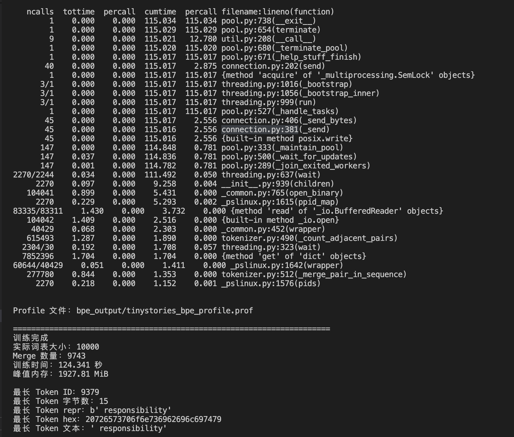
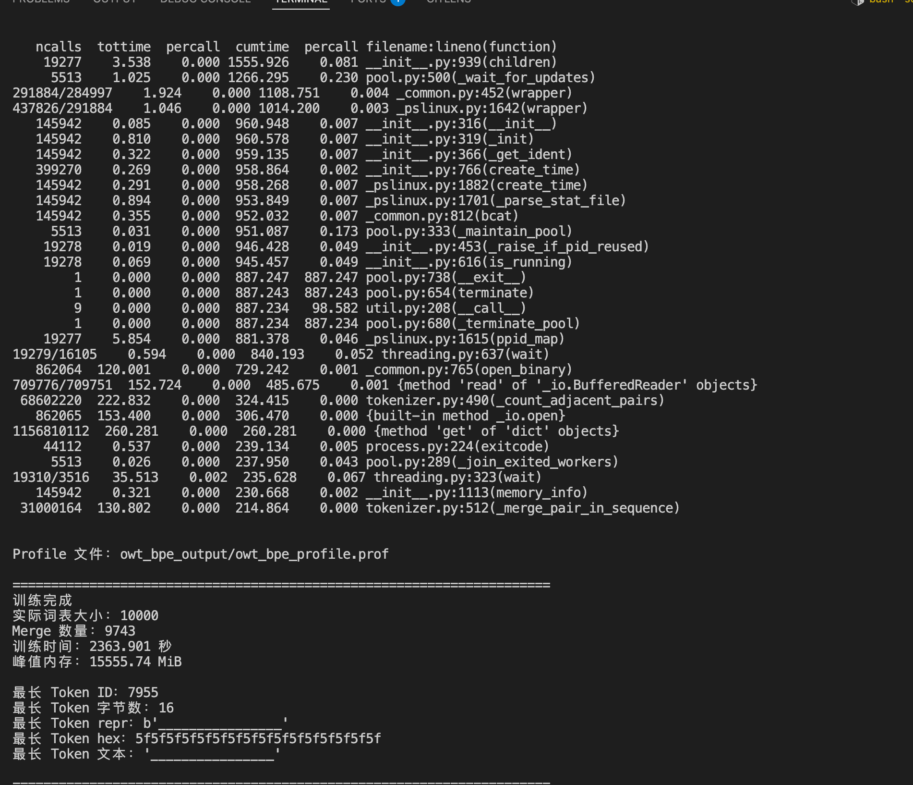
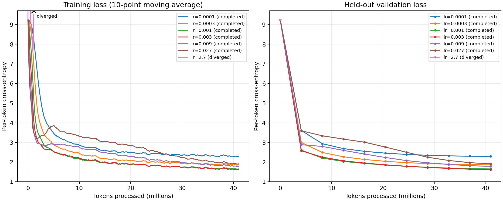
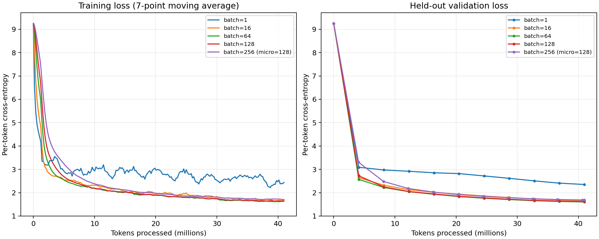
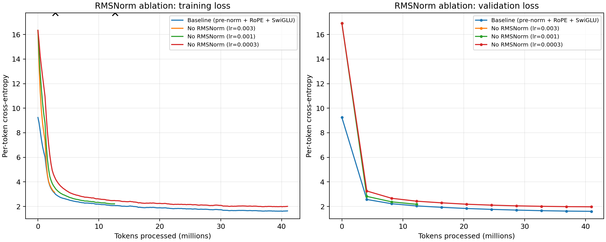
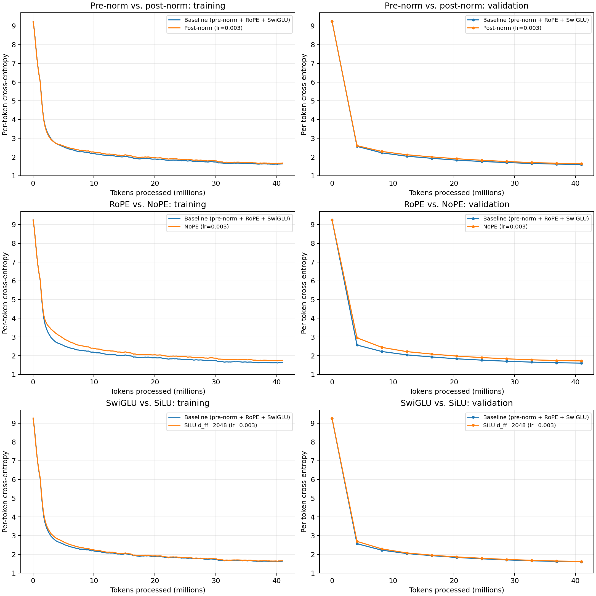
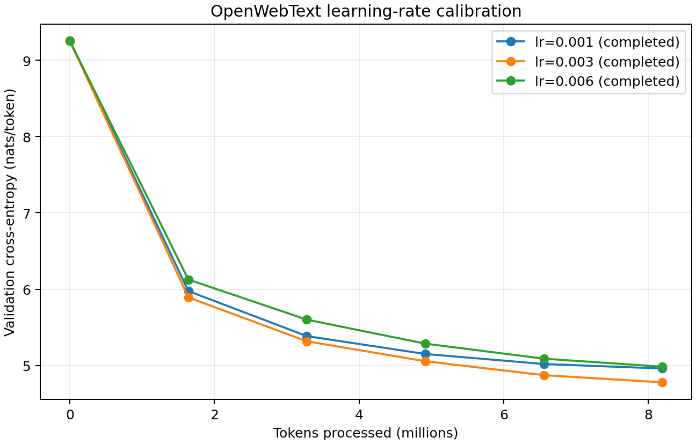
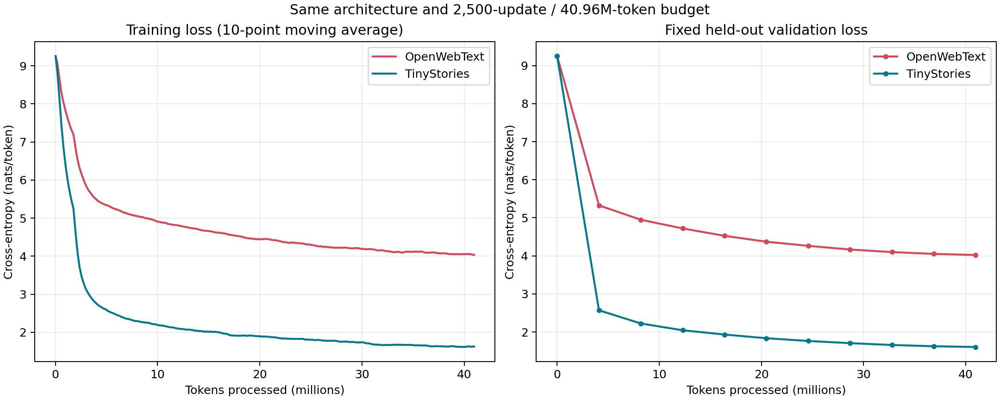

# A1 公开提交：杭瑞文

> 本文件和同目录代码公开可见。这里只记录公开、脱敏且实际完成的内容；数据、模型权重、 完整终端输出和本地运行路径不进入提交。


## 基本信息

- 作业题面版本：26.0.3
- 上游 starter commit：a158843b20107949f1a8d7df1b05cd33b9166712
- 完成范围：cs336_assignment1_basics 内实验
- 未完成项：无

## Markdown 报告

### Understanding Unicode
(a) What Unicode character does chr(0) return?
> 在 Unicode 标准中，它的定义如下：
> - Unicode 码位：U+0000
> - 字符名称：NULL

(b) How does this character’s string representation (repr()) differ from its printed  representation?
> - print(s) 的表现： 输出结果通常是不可见的。
> - repr(s) 的表现： 输出结果是 '\x00'。

(c) What happens when this character occurs in text? 
> - chr(0)（在交互式解释器中直接执行）：输出 '\x00'。Python 会将该不可见字符以转义形式显示出来。
> - print(chr(0))：终端什么都不显示。
> - this is a test" + chr(0) + "string"：生成一个完整的字符串 'this is a test\x00string'。
> - print("this is a test" + chr(0) + "string")：屏幕输出会是 this is a teststring

### Unicode Encodings
(a) What are some reasons to prefer training our tokenizer on UTF-8 encoded bytes, rather than  UTF-16 or UTF-32? 
> 1. 稀疏性更低：由于 UTF-8 的变长特性，常用的高频字符（英文、标点）占用空间小，Tokenizer 可以更有效地通过 BPE 合并这些高频字节，形成更符合语言统计学规律的 Token，这有助于模型更好地理解语言语义。
>
> 2. 端序无关性 ：UTF-8 没有字节顺序问题，这使得从不同来源获取的数据不需要额外的转码预处理，保证了数据流的鲁棒性。
>
> 3. 与主流框架高度集成：Python 的 str 类型在内部处理中已经高度优化了 UTF-8 兼容性，主流的深度学习库在底层处理数据流时，默认即是基于字节序列的。

(b) Why is this function incorrect? Provide an example of an input byte  string that yields incorrect results.
> 错误示例：bytestring_input = "牛".encode("utf-8")，会直接抛出 UnicodeDecodeError 异常。
>
> 原因是它试图将 UTF-8 编码的每一个单字节分别进行解码，但 UTF-8 是一种变长编码，中文字符或表情符号等非 ASCII 字符是由 2 到 4 个字节共同组合表示的，单独解码其中的任意一个多字节组件都会因为不符合单字节 UTF-8 编码规则而导致解码失败。

(c) Give a two-byte sequence that does not decode to any Unicode character(s).

```python
bytestring_input = b'\xc0\xaf'
bytestring_input.decode('utf-8')
```
在 UTF-8 规范中，起始字节 0xc0 指示了一个两字节字符的开始，但它所包含的有效载荷太小，属于被严格禁止的超长编码，且其后续字节 0xaf 也没有以法定的 10 开头。

### BPE Training on TinyStories 
<table border="1" cellpadding="8" style="border-collapse: collapse; text-align: left;">
  <thead>
    <tr>
      <th>数据集</th>
      <th>词表大小</th>
      <th>训练耗时</th>
      <th>内存消耗</th>
      <th>最长的token</th>
    </tr>
  </thead>
  <tbody>
    <tr>
      <td>TinyStories</td>
      <td>10000</td>
      <td>124.341s</td>
      <td>1927.81 MB peak RSS</td>
      <td>responsibility(15 bytes)</td>
    </tr>
  </tbody>
</table>


> 性能分析：从这份 cProfile 结果看，耗时最多的是并行预分词阶段占总运行时间约 93%；而真正的 BPE 合并阶段 仅约 2 秒。
### Experiment on OWT

<table border="1" cellpadding="8" style="border-collapse: collapse; text-align: left;">
  <thead>
    <tr>
      <th>数据集</th>
      <th>词表大小</th>
      <th>训练耗时</th>
      <th>内存消耗</th>
      <th>最长的token</th>
    </tr>
  </thead>
  <tbody>
    <tr>
      <td>OWT</td>
      <td>10000</td>
      <td>2286.82s</td>
      <td>15684.36 MB peak RSS</td>
      <td>'________________' (16 bytes)</td>
    </tr>
  </tbody>
</table>




### Experiments with tokenizers
(a) What is each tokenizer’s compression ratio?
> TinyStories (10K) 压缩率: 4.15 bytes/token
> 
> OpenWebText (32K) 压缩率: 4.06 bytes/token

(b) How long would it take to  tokenize the Pile dataset (825GB of text)?
> 吞吐量: 0.63 MB/s，处理 825GB Pile 数据集预计耗时: 371.28 小时

(c) Why is uint16 an appropriate choice?
> 验证 NumPy 数组数据类型: uint16，最大 Token ID: 8871
> 
> uint16 能表示 0~65535 的整数，验证的最大 ID 仅为 8871，且两个分词器的词汇量均远小于 65535，因此完全不会发生数据溢出。
### Tune the learning rate

| Peak LR | 状态 | 最终验证损失 |
|---------|------|-------------|
| 0.0001  | 完成 | 2.2858      |
| 0.0003  | 完成 | 1.859       |
| 0.001   | 完成 | 1.6489      |
| 0.003   | 完成/最佳 | 1.62    |
| 0.009   | 完成 | 1.7815      |
| 0.027   | 完成 | 1.9091      |
| 2.7     | 发散 | 第 141 步损失升至 32.5253 |

> **结论：**
> 最佳学习率为 3×10⁻³，最终验证损失 1.6200。
> 1×10⁻³ 与 3×10⁻³ 均在首次记录的 16.384M tokens 处达到 loss ≤ 2.00。

### Batch size variations
<table border="1" cellpadding="8" style="border-collapse: collapse; text-align: left;">
  <thead>
    <tr>
      <th>Batch</th>
      <th>最终验证 loss</th>
      <th>Tokens/s</th>
      <th>达到 loss ≤ 2.00</th>
    </tr>
  </thead>
  <tbody>
    <tr>
      <td>1</td>
      <td>2.3511</td>
      <td>13,814</td>
      <td>未达到</td>
    </tr>
    <tr>
      <td>16</td>
      <td>1.6650</td>
      <td>23,207</td>
      <td>20.48M</td>
    </tr>
    <tr>
      <td>64</td>
      <td>1.6039</td>
      <td>23,314</td>
      <td>16.384M</td>
    </tr>
    <tr>
      <td>128</td>
      <td>1.6191</td>
      <td>17,761</td>
      <td>16.384M</td>
    </tr>
    <tr>
      <td>256</td>
      <td>1.6858</td>
      <td>22,014</td>
      <td>20.316M</td>
    </tr>
  </tbody>
</table>



> 实验结果：
> batch=1 梯度噪声非常明显；沿用 LR=0.003 过于激进，若实际使用 batch 1，应重新调低学习率。
>
> batch=64 同时取得最低验证 loss 和最高吞吐，batch 128 产生明显内存压力，吞吐反而降低。
>
> 从 64 增大到 128/256 后，最终质量开始下降。固定 token 预算下，大 batch 的优化器更新次数更少。

### Ablations
所有对比实验均使用 64 的 batch size，峰值学习率设为 0.003，并使用了 40,960,000 个训练 token。
MSNorm 消融实验






#### RMSNorm 消融实验
> 无 RMSNorm发生发散：在第 176 步时，训练损失 68.7268 超出了 50.7703 的阈值。
最稳定的无 RMSNorm 实验使用了 0.0003 的学习率，最终损失为 1.9725，而包含归一化的基线为 1.6039。
因此，移除 RMSNorm 会同时改变在相同 token 预算下的稳定性范围和可达到的损失。

#### Pre-norm 与 post-norm 对比
> Post-norm最终验证损失为 1.6448。
在相同的数据和学习率调度下，pre-norm 基线的最终结果为 1.6039，这展示了将相同的归一化操作移至残差分支之后所产生的影响。

#### RoPE 与 NoPE 对比
> NoPE最终验证损失为 1.7212。
RoPE 基线的最终结果为 1.6039。由于因果掩码以及所有其他可训练参数均保持完全一致，这一差异体现了显式位置信息的作用。

SwiGLU 与 SiLU 对比
> SiLU 最终验证损失为 1.6254。
SiLU 模型使用了 d_ff=2048 以及 22,827,520 个参数，与拥有 22,696,448 个参数的 SwiGLU 基线相比差异仅为 +0.58%。这在去除了门控机制的同时，使对比保持了大致相等的参数量。

### Experiment on OWT
OpenWebText 和 TinyStories 的运行使用了相同的 4 层、16 头、带有 RoPE 和 SwiGLU 的 pre-norm Transformer 架构，相同的 10,000 词表大小，256 的上下文长度，64 的 batch size，随机种子 42，执行了 2,500 次优化器更新。

#### 学习率


| Peak LR | Status | Pilot updates | Final train loss | Final validation loss |
|---:|:---|---:|---:|---:|
| 0.001 | completed | 500 | 4.8374 | 4.9604 |
| 0.003 | completed | 500 | 4.6468 | 4.7788 |
| 0.006 | completed | 500 | 4.8567 | 4.9842 |

#### 实验结果


| Dataset | Updates | Tokens | Final train loss | Final validation loss | Validation perplexity |
|:---|---:|---:|---:|---:|---:|
| TinyStories | 2,500 | 40,960,000 | 1.6202 | 1.6039 | 4.97 |
| OpenWebText | 2,500 | 40,960,000 | 4.0489 | 4.0223 | 55.83 |


在相同的模型和token预算下，OWT 的验证损失相对于 TinyStories 高出 2.4183 nats/token。这种较高的损失是符合预期的：网络文本在主题、风格、词汇、事实和文档结构方面具有大得多的多样性，此外还包含爬取噪声。一个仅具有 1700 万非嵌入参数的模型，在只见过 4096 万个 token 的情况下，无法像在刻意简化的 TinyStories 语料库上那样，频繁地重复和巩固那些长尾模式。

#### 生成文本与流畅度
| 数据集 | 样本 | 新 tokens | 终止原因 |
|---|---:|---:|---|
| OWT | 1 | 256 | 达到 `max_new_tokens` |
| OWT | 2 | 256 | 达到 `max_new_tokens` |
| OWT | 3 | 72 | `<\|endoftext\|>` |
| TinyStories | 1 | 194 | `<\|endoftext\|>` |
| TinyStories | 2 | 199 | `<\|endoftext\|>` |
| TinyStories | 3 | 153 | `<\|endoftext\|>` |


三个无条件生成的 OWT 样本以及相匹配的 TinyStories 样本保存在 logs/trainowt/owt_generated_samples.md 和 logs/trainowt/tinystories_generated_samples.md 文件中。它们均使用 0.8 的温度和 top-k 50 的设定，并采用相同的随机种子。


OWT 样本展现出局部较为流畅的英语语法和可识别的格式，但文档级别的连贯性较弱。样本 1 在语义发生漂移的同时反复出现“节目”和“有趣”等通用词汇；样本 2 类似于政治新闻，但混杂了缺乏依据的实体和不规范的短语；样本 3 捏造了名字，并在套路化的研究声明后戛然而止。样本 1 和 2 还在句子中间异常终止。相同的算力在 TinyStories 上的效果要好得多，因为其简短的句子、狭小的语义空间、重复的叙事模板和有限的词汇量，为每种模式提供了有效得多的示例。OWT 需要大幅增加的数据暴露量、模型容量，通常还需要更长的上下文，才能达到类似的文档级流畅度。

## 复现说明

数据准备：
```
python scripts/prepare_data.py \
  --train-text data/TinyStoriesV2-GPT4-train.txt \
  --valid-text data/TinyStoriesV2-GPT4-valid.txt \
  --output-dir artifacts/tinystories_10k \
  --vocab-size 10000
```
tokenizer 实验：
```
python scripts/tokenizer_experiments.py

```

learning rate 实验：
```
python scripts/lr_sweep.py --config configs/tinystories_lr_sweep.json
```
batch_size 实验：
```
python scripts/architecture_ablation_sweep.py --config configs/tinystories_architecture_ablations.json
```
消融实验：
```
python scripts/batch_size_sweep.py --config configs/tinystories_batch_size.json
```

OWT 实验：
```
python scripts/owt_main_experiment.py \
  --config configs/owt_main_experiment.json
```

## 代码与脚本

- 真实实现：`submission/cs336_basics/`
- 测试 adapter：`submission/tests/adapters.py`
- 训练、数据编码与生成脚本：`submission/scripts/`
- 实验配置：`submission/configs/`
- 日志信息：`logs/`

真实实现先在兄弟目录 `../assignment1-basics` 中完成并通过官方测试，再使用同步命令复制
到本目录。不要手工复制公共 tests、fixtures、数据、模型权重、虚拟环境或依赖锁。

## 实验日志

日志目录：`logs/`

训练类 run 逐点记录 step、wall_clock_sec（墙钟秒）、train_loss、 lr，并定期记录 val_loss；另外给出最终 val loss、总训练时间和关键配置（d_model、 层数、头数、context length、batch size、总步数）。推荐用 JSONL（每行一个 JSON 对象） 承载逐点信息，用 summary.json 承载汇总。


## 飞书补充文档

该文档设置为组织内公开，不得开启互联网公开访问，只保存不能公开到 GitHub 但确有
审核必要的最小差量材料。
