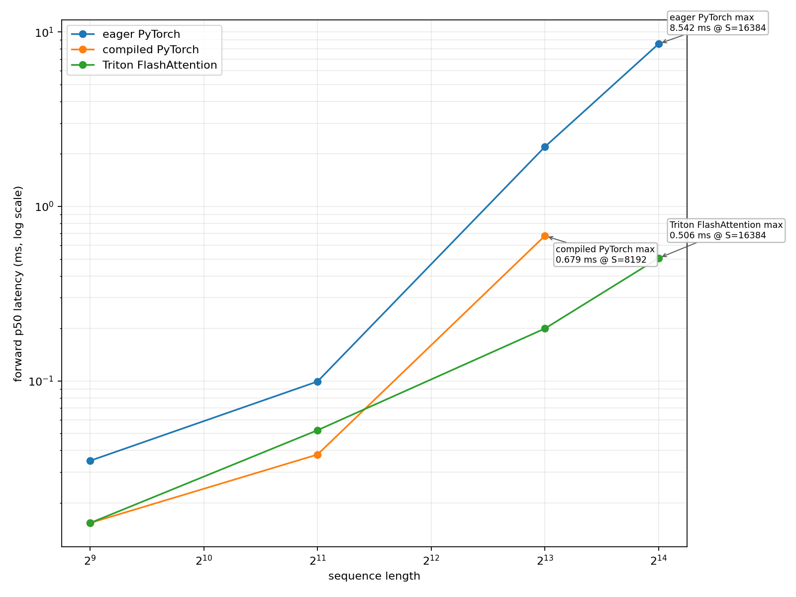
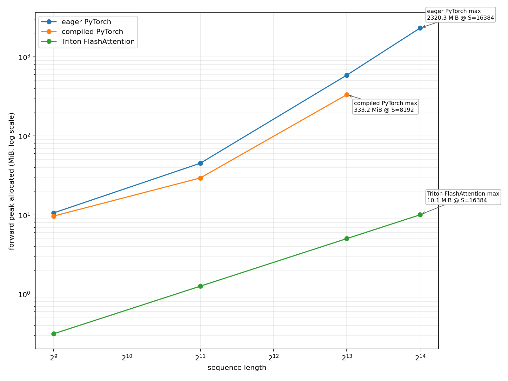

# A2-K 公开提交：栾效睿

> 本文件和同目录代码、汇总、图片公开可见。只提交允许公开且已经脱敏的内容；上游仓库、
> 编译缓存、完整 trace 和大型原始文件留在个人工作目录。密钥和访问凭据不进入任何提交
> 材料。

> 正式要求见
> [`assignments/A2-K/README.md`](../../../../assignments/A2-K/README.md)，评分说明见
> [`assignments/A2-K/EVALUATION.md`](../../../../assignments/A2-K/EVALUATION.md)。

## 基本信息

- 作业题面版本：`26.1.4-k-rc.3`
- 完成范围：任务一至任务五全部完成：activation checkpointing、显式 PyTorch attention、`torch.compile` 对照、纯 PyTorch tiled FlashAttention-2、学生自写 Triton FlashAttention-2 前向/重计算反向，以及正确性和性能矩阵。
- 未完成项：无
- 上游 starter commit：`ca8bc81a59b70516f7ebb2da4808daade877c736`
- 学生实现入口：`submission/cs336_systems/a2k/attention.py`
- 结果、命令和环境证据：`results/`

## 环境与工具

| 项目 | 公开、脱敏的信息 |
| --- | --- |
| GPU | 单张 NVIDIA GeForce RTX 4090（compute capability 8.9） |
| 开跑前显存 | `memory.total=49140 MiB`、`memory.free=48126 MiB`（metadata 精确值 `48125.8125 MiB`，约 47 GiB） |
| Driver / CUDA | Driver `570.124.06` / CUDA `12.8` |
| PyTorch / Python | PyTorch `2.11.0+cu128` / Python `3.12.3` |
| Triton | `3.6.0` |
| power limit / P-state | `450 W` / `P5`；使用默认设置 |
| TF32 | `torch.backends.cuda.matmul.allow_tf32=False`，`torch.backends.cudnn.allow_tf32=False` |
| allocator limit / fraction | `23552 MiB`（23 GiB）/ `0.4854174583443363`；在首次 CUDA allocation 前设置 |
| 计时 | attention/Flash 使用 `triton.testing.do_bench(warmup=100, rep=300, quantiles=[0.2, 0.5, 0.8])`；checkpoint/model 使用 CUDA Event |
| 其他限制 | batch size 1、单进程串行运行、每个配置独立 Python 子进程；无 CPU/NVMe offload、无多卡、无其他计算任务 |

## 1. Activation Checkpointing

### 理论与代码骨架

对于忽略重计算代价、由 `N` 个 block 组成的网络，采用平衡递归并在每层递归的左右子区间
边界调用 `checkpoint`，直到叶子区间只含一个 block。反向进入叶子时，活跃内存主要是递归
路径上的边界 activation 加当前叶子的 residual，因此峰值 activation memory 为
`O(log N)`；每层递归使全部 block 总体再执行常数次，计算量为 `O(N log N)`。峰值出现在最深
叶子反向重算阶段。代码骨架如下（9 行，checkpoint 边界已标出）：

```python
from torch.utils.checkpoint import checkpoint

def nested_forward(blocks, lo, hi, x):
    if hi - lo == 1:
        return blocks[lo](x)
    mid = (lo + hi) // 2
    x = checkpoint(lambda z: nested_forward(blocks, lo, mid, z), x,
                   use_reentrant=False)  # 左边界
    x = checkpoint(lambda z: nested_forward(blocks, mid, hi, z), x,
                   use_reentrant=False)  # 右边界
    return x
```

固定实验要求使用一次重计算且禁止嵌套的 block checkpoint。若 block size 为 `B`，峰值可近似
写为 `M_peak(B) ≈ (N/B)A + BR`；`A` 为区间入口 activation、`R` 为一层 residual。两者同阶
时理论平衡点为 `B=Θ(sqrt(N))`，总计算量为 `Θ(N)`。本实验 `N=24`，因此比较了题目规定的
`B∈{1,2,4,8}`，不预先假定最优值。

### 固定实验

Stanford medium 配置为 vocab `10000`、`d_model=1024`、`d_ff=4096`、24 层、16 heads、
batch size 1、FP32 参数、BF16 autocast、AdamW；每个配置 3 个 warm-up step、5 个测量 step。
以下来自 [`results/checkpointing.csv`](results/checkpointing.csv)，时间为 5 次测量的 p50。

| 配置 | p50 step (ms) | peak allocated (MiB) | peak reserved (MiB) | status |
|---|---:|---:|---:|---|
| context 1024, no checkpoint | 140.78 | 10046.13 | 10204 | success |
| context 1024, block 1 | 210.00 | 8096.54 | 8162 | success |
| context 1024, block 2 | 197.77 | 8096.54 | 8166 | success |
| context 1024, block 4 | 191.71 | 8096.54 | 8152 | success |
| context 1024, block 8 | 188.85 | 8096.54 | 8182 | success |
| context 2048, no checkpoint | 389.03 | 19623.67 | 19936 | success |
| context 2048, block 1（最低显存配置） | 494.85 | 8094.93 | 9398 | success |

context 1024 中四个 checkpoint block 的 `peak_allocated` 完全并列，因此脚本按 `min` 的
tie-break 选择 block 1 做 context 2048 边界实验；这不表示 block 1 比其他 block 更省显存。
context 2048 中 block 1 将 peak allocated 从 `19623.67` 降到 `8094.93 MiB`（约减少 58.7%），
但 p50 从 `389.03` 增到 `494.85 ms`（约增加 27.2%）。context 1024 中 block 8 的 p50 最低，
仍比无 checkpoint 慢约 34%，体现了重计算开销与保存边界数量、临时 residual 生命周期共同决定
最佳配置。

复现命令：

```bash
python -m student_scripts.a2k.benchmark_checkpointing
```

## 2. PyTorch Attention 与 `torch.compile`

### 显式 PyTorch 基线

`student_scripts/a2k/benchmark_attention.py` 调用提交中的显式实现，依次计算 `QK^T`、
`1/sqrt(d)` scale、causal mask、softmax 和 `PV`，没有调用
`torch.nn.functional.scaled_dot_product_attention` 或第三方 fused attention。输入为
`[batch, sequence_length, head_dim]`，batch 1、BF16、causal，覆盖
`sequence_length∈{512,2048,8192}` 和 `head_dim∈{64,128}`。输入和 mask 在计时外创建；
backward-only 复用保留的前向图，forward-backward 每次创建新图。p20/p50/p80 和显存均来自
[`results/attention_baseline.csv`](results/attention_baseline.csv)：

| sequence | head dim | forward p20/p50/p80 (ms) | backward p20/p50/p80 (ms) | forward-backward p20/p50/p80 (ms) | peak alloc/reserved (MiB) |
|---:|---:|---:|---:|---:|---:|
| 512 | 64 | 0.0335 / 0.0348 / 0.0358 | 0.2006 / 0.2056 / 0.2540 | 0.4956 / 0.5888 / 0.6062 | 19.88 / 26 |
| 512 | 128 | 0.0367 / 0.0369 / 0.0369 | 0.1845 / 0.1894 / 0.2028 | 0.4782 / 0.6021 / 0.6171 | 20.25 / 26 |
| 2048 | 64 | 0.1014 / 0.1024 / 0.1034 | 0.1916 / 0.1946 / 0.2007 | 0.4566 / 0.4752 / 0.5761 | 69.77 / 84 |
| 2048 | 128 | 0.1044 / 0.1085 / 0.1096 | 0.1964 / 0.1966 / 0.1976 | 0.4424 / 0.4474 / 0.4557 | 71.27 / 86 |
| 8192 | 64 | 2.1885 / 2.1903 / 2.1975 | 4.8333 / 4.8353 / 4.8377 | 6.9426 / 6.9448 / 6.9478 | 854.33 / 862 |
| 8192 | 128 | 2.2139 / 2.2221 / 2.2252 | 4.8753 / 4.8783 / 4.8794 | 7.0205 / 7.0236 / 7.0267 | 860.33 / 982 |

sequence 从 2048 增到 8192 时，显式 attention 的 forward-backward 从约 0.45 ms 增到约
7.0 ms，reserved memory 从 84--86 MiB 增到 862--982 MiB，符合显式 score/softmax 中间量
随序列长度二次增长的预期；head dimension 的影响相对较小。

复现命令：

```bash
python -m student_scripts.a2k.benchmark_attention
```

### Compile 对照

attention 对照固定为 `(512,64)`、`(2048,128)`、`(8192,128)`；compiled 使用
`torch.compile(backend="inductor", fullgraph=True, dynamic=False)`。首次 compiled forward
和 backward 分开同步计时，steady-state 使用与 eager 相同的 `do_bench` 设置；每个 compiled
子进程使用独立的 `TORCHINDUCTOR_CACHE_DIR` 和 `TRITON_CACHE_DIR`。模型对照使用 Stanford
small：vocab `10000`、`d_model=768`、`d_ff=3072`、12 层、12 heads、context 512、batch 1、
FP32 参数和 BF16 autocast；模型 compiled 使用 `fullgraph=False`，以记录实际 graph break。

以下为 [`results/compile_comparison.csv`](results/compile_comparison.csv) 的 p50：

| shape / implementation | cold-start total (s) | forward (ms) | backward (ms) | forward-backward (ms) | training step (ms) | peak reserved (MiB) |
|---|---:|---:|---:|---:|---:|---:|
| attention 512×64 eager | — | 0.0349 | 0.1833 | 0.4588 | — | 26 |
| attention 512×64 compiled | 27.916 | 0.0154 | 0.0320 | 0.2683 | — | 24 |
| attention 2048×128 eager | — | 0.1055 | 0.2406 | 0.5715 | — | 86 |
| attention 2048×128 compiled | 3.484 | 0.0471 | 0.1014 | 0.2612 | — | 66 |
| attention 8192×128 eager | — | 2.2149 | 4.8765 | 7.0236 | — | 982 |
| attention 8192×128 compiled | 3.903 | 0.7117 | 1.9392 | 2.5989 | — | 542 |
| Stanford small eager | — | 17.108 | 28.681 | 48.220 | 59.173 | 2822 |
| Stanford small compiled | 36.090 | 5.135 | 7.529 | 13.342 | 26.295 | 2774 |

attention compiled steady-state forward-backward 相对 eager 分别约为 `1.71×`、`2.19×`、
`2.70×`；但 512×64 的首次编译约 27.92 s。整模型 training step 从 59.173 降到 26.295 ms，
约 `2.25×`，收益小于部分 attention microbenchmark，因为模型反向和 AdamW step 仍有额外
边界。8/8 行成功，BF16 一致性使用 `rtol=0.01`、`atol=0.015`；Dynamo counters 为
`graph_break_count=0`、`unique_graph_count=1`。这些数字针对固定 shape、`dynamic=False` 和
独立缓存，不能外推到动态 shape 或首次调用延迟。

复现命令：

```bash
python -m student_scripts.a2k.benchmark_compile
```

## 3. FlashAttention-2 Forward

实现位于 `submission/cs336_systems/a2k/attention.py`，adapter 暴露
`FlashAttentionPyTorch` 和 `FlashAttentionTriton` 两个 `torch.autograd.Function`。接口为
`apply(Q, K, V, is_causal=False)`，支持 `[batch, sequence, head_dim]`、causal/non-causal。
两条路径都保存 `Q/K/V/O` 和唯一一个 `[batch, n_queries]` 的 FP32 log-sum-exp `L`。

### Pure PyTorch tiled reference

纯 PyTorch 参考实现使用 `128×128` tile，在 FP32 中维护每个 query 行的 running maximum
`m`、normalizer `l` 和 output accumulator：

```text
m' = max(m, rowmax(S)); P̃ = exp(S - m')
l' = exp(m - m')l + rowsum(P̃)
O' = exp(m - m')O + P̃V; L = m' + log(l')
```

因此不会在保存的 autograd state 中保留完整 attention probability matrix；输出转换回输入
dtype，`L` 保持 FP32。

### Triton kernel

学生自写的 `@triton.jit flash_fwd_kernel` 让一个 program instance 负责一个 query tile 和
batch，kernel 内循环 key/value tiles；`m/l/accumulator` 全部使用 FP32。BF16 性能路径使用
query/key tile `64/64`、`num_warps=4`、`num_stages=2`；FP32 correctness 路径为避免 d=128
时 shared-memory 超限，自动使用 `32/32`、`num_warps=2`、`num_stages=1`。causal mask 由全局
query/key index 比较，非法 score 使用 `-1e6`。launch grid 为
`(ceil(n_queries/block_m), batch)`，并保存输出和 `L`。

## 4. Backward 与正确性

### 重计算式 backward

纯 PyTorch 和 Triton 两条 autograd path 都只依赖保存的 `Q/K/V/O/L`，按以下公式重算局部
概率，不保存完整 `P`：

```text
D = rowsum(O ⊙ dO); P = exp(QKᵀ / √d - L)
dV = PᵀdO; dS = P ⊙ (dOVᵀ - D)
dQ = dSK / √d; dK = dSᵀQ / √d
```

Triton backward 由 `D`、`dK/dV`、`dQ` 三个自写 kernel 构成：key-tile program 独立累加并写回
`dK/dV`，query-tile program 独立写回 `dQ`，不需要跨 program 同步或 atomic；causal backward
复用前向 mask，返回梯度顺序为 `Q/K/V/is_causal`。

### 官方 GPU tests

命令：`python -m pytest tests/test_attention.py -v`（远端 runner 也以 `uv run pytest` 执行）。
[`results/unit_tests.txt`](results/unit_tests.txt) 显示 6 项测试、**6 passed，0 failed，0 skipped**，
耗时 9.04 s；PyTorch/Triton forward 和 backward 的 causal/non-causal 测试均通过。

### 扩展正确性

[`results/correctness.json`](results/correctness.json) 共 36/36 pass（2 implementations × 3 seeds ×
3 head dimensions × 2 mask settings），FP32、`rtol=atol=0.01`。最大误差汇总如下；相对误差
较大的位置对应接近零的参考梯度，故同时报告绝对误差和 allclose 状态：

| implementation | max abs over all checks | max rel over all checks | status |
|---|---:|---:|---|
| PyTorch tiled | `1.91e-6` | `0.363` | 18/18 pass |
| Triton FlashAttention | `3.52e-3` | `1326.154` | 18/18 pass |

Triton 的 `dQ/dK/dV` 最大绝对误差分别为 `3.33e-3`、`3.45e-3`、`3.52e-3`，均低于
`atol=0.01`。完整的每个 seed、shape、mask 以及 `O/L/dQ/dK/dV` 误差保留在 JSON 中。

## 5. 性能矩阵

### 配置与命令

正式矩阵在单张 RTX 4090 24GB 上运行，开跑前空闲显存约 47 GiB；batch size 1、BF16、causal。
核心 shape 为 `sequence×head_dim∈{512,2048,8192}×{64,128}`，边界 shape 为
`16384×{64,128}`。核心矩阵比较 explicit PyTorch eager、compiled PyTorch 和学生 Triton；
16384 边界比较 eager 与 Triton。每个 implementation/shape/phase 使用独立子进程，测量
forward、backward、forward-backward，`do_bench(warmup=100, rep=300, quantiles=[0.2,0.5,0.8])`，
并记录 peak allocated/reserved、p20/p50/p80、launch 参数和状态。所有 66 行 success、无 OOM。

```bash
python -m student_scripts.a2k.benchmark_flash_attention
```

### 结果与图

完整结果见 [`results/flash_benchmark.csv`](results/flash_benchmark.csv)。下表为
forward-backward p50，显存列为 peak reserved MiB，speedup 相对同 shape 的 eager 行：

| sequence × head dim | eager ms / MiB | compiled ms / MiB | Triton ms / MiB | Triton speedup |
|---|---:|---:|---:|---:|
| 512×64 | 0.5652 / 26 | 0.2683 / 24 | 0.0492 / 2 | 11.50× |
| 512×128 | 0.4659 / 26 | 0.3000 / 24 | 0.1516 / 2 | 3.07× |
| 2048×64 | 0.5316 / 84 | 0.3635 / 64 | 0.1679 / 4 | 3.17× |
| 2048×128 | 0.4772 / 86 | 0.2632 / 66 | 0.3215 / 6 | 1.48× |
| 8192×64 | 6.9407 / 862 | 2.5293 / 478 | 0.6492 / 10 | 10.69× |
| 8192×128 | 7.0246 / 982 | 2.5999 / 490 | 1.2595 / 22 | 5.58× |

16384 边界的 forward-backward p50 如下：

| shape | eager ms / MiB | Triton ms / MiB | Triton speedup |
|---|---:|---:|---:|
| 16384×64 | 27.5840 / 3862 | 2.0879 / 22 | 13.21× |
| 16384×128 | 27.7719 / 3882 | 4.9254 / 42 | 5.64× |

完整三阶段的 p20/p50/p80、峰值 allocated/reserved 和每行状态均在 CSV；两张图来自同一结果：





### 分析

- 短序列中 Triton 仍需承担 kernel launch 和 tile 边界开销，但 fused tiled 路径避免了显式
  `S/P` 物化；512×64 的 forward-backward 仍达到 11.50×，而 2048×128 因 head dimension
  和 tile 计算更重，优势收窄到 1.48×。
- 长序列的主要差距来自显存：16384×64 的 eager peak reserved 为 3862 MiB，Triton 仅 22 MiB；
  16384×128 为 3882 对 42 MiB。Triton 只保留 tile 级 score/probability 和 `L`，避免二次方
  attention matrix。
- BF16 使用 `64×64/4 warps/2 stages`；FP32 correctness 使用 `32×32/2 warps/1 stage`，
  这是 d=128 shared-memory 限制下的可复现折中。固定 tile 和固定 shape 也意味着结果不能
  直接外推到动态长度、其他 dtype 或其他 GPU。
- 本次 66/66 行均 success，没有 OOM 或 compile failure；因此没有隐藏失败行或因失败而缩小
  shape。p20/p80 与 p50 的差异很小但不是零，短序列绝对延迟极低时，kernel launch、GPU
  调度和独立子进程隔离会放大相对不确定性。

## 6. 限制与复现

- 代码同步命令：`python3 scripts/sync_a2k_submission.py --name '栾效睿'`
- 轻量结果目录：[`results/`](results/)
- 24G 显存证据：[`results/memory_evidence.json`](results/memory_evidence.json)；全正式进程的最高 peak allocated/reserved 为 `19623.67 / 19936.00 MiB`，allocator 上限为 `23552 MiB`、fraction `0.4854174583443363`，`within_24gib=true`。
- 未提交的本地大型原始文件：上游工作仓库中的虚拟环境、编译缓存、PTX/CUBIN、完整 trace 和原始 benchmark 日志；仅保留脱敏 CSV/JSON、测试摘要和压缩图片用于复核。
- 已知限制：结果针对固定 RTX 4090、固定 shape、BF16 causal attention、固定 Triton tile 和 Inductor `dynamic=False`；不能外推到动态 shape、其他 GPU/dtype、首次编译延迟或不同并发环境。correctness 的最大相对误差受接近零的梯度元素影响，应结合绝对误差与 allclose 容差解读。
- 最小复现步骤：
  1. 在上游 starter commit 对应的 GPU 工作仓库同步 `submission/` 中的 A2-K 代码和 adapter。
  2. 确认单张 RTX 4090、开始前空闲显存不少于 22 GiB，并在首次 CUDA allocation 前设置 23552 MiB allocator 上限。
  3. 依次运行 `python -m student_scripts.a2k.benchmark_checkpointing`、`python -m student_scripts.a2k.benchmark_attention`、`python -m student_scripts.a2k.benchmark_compile`、`python -m student_scripts.a2k.check_flash_attention`、`python -m student_scripts.a2k.benchmark_flash_attention`；官方测试运行 `python -m pytest tests/test_attention.py -v`。
  4. 将输出与本目录 `results/` 中对应 CSV/JSON/TXT 及两张图片对照；所有正式脚本应串行、独立进程执行。

## 飞书补充文档

- 链接：https://fudan-nlp.feishu.cn/wiki/GxurwYrHlidvquk5x8Tc6bCjnrd

## 自检

- [x] 本 PR 只包含我本人本次 A2-K 的文件。
- [ ] 正式结果来自单张 RTX 4090 24GB，且开跑前可用显存不少于 22 GiB。
- [x] 每个正式脚本独立、串行执行，首次 CUDA allocation 前设置 23552 MiB allocator 上限。
- [x] README 是 Markdown 主报告，所有图片使用相对路径和有意义的 alt text。
- [x] checkpoint、baseline、compile、正确性与 Flash benchmark 的必交结果齐全。
- [x] PyTorch baseline 没有调用已有 fused attention。
- [x] 提交包含学生自己编写的真实 `@triton.jit` forward kernel。
- [x] 官方 CUDA tests 的 pass/fail/skip 如实记录为 6/0/0。
- [x] 每个关键数字都能回到命令、`results/` 或 metadata。
- [x] `results/` 与 `assets/` 附件合计不超过 2 MiB，README 和单文件均未超限。
- [x] 未提交 compile cache、PTX/CUBIN、binary、完整 trace、上游仓库或依赖环境。
- [x] GitHub 内容不含内部主机名、IP、账号、路径、UUID、进程或未公开项目。
- [x] GitHub 和飞书正文都不含 Secret、Token、Cookie、密码或私钥。
- [x] 飞书补充文档为组织内公开，且未开启互联网公开访问。
