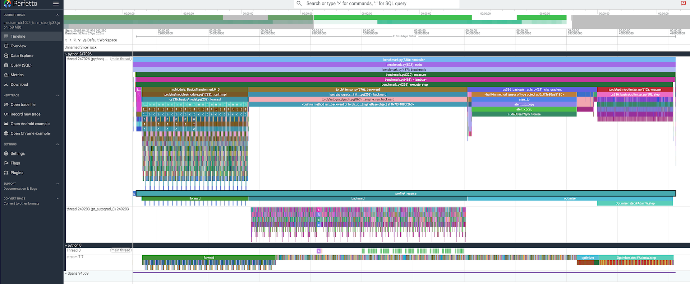
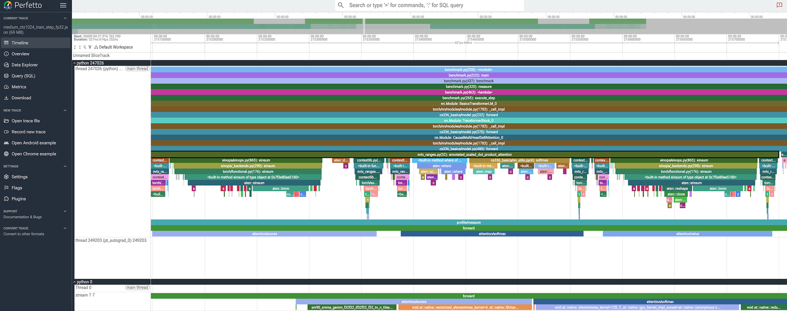
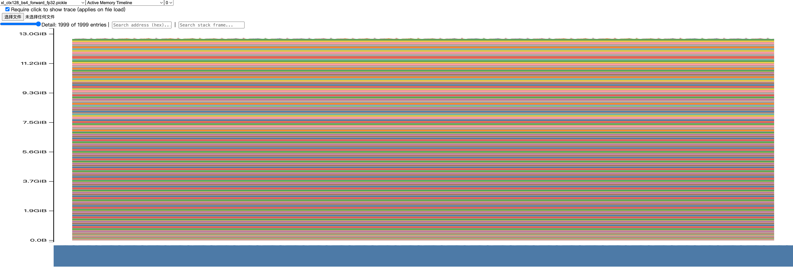
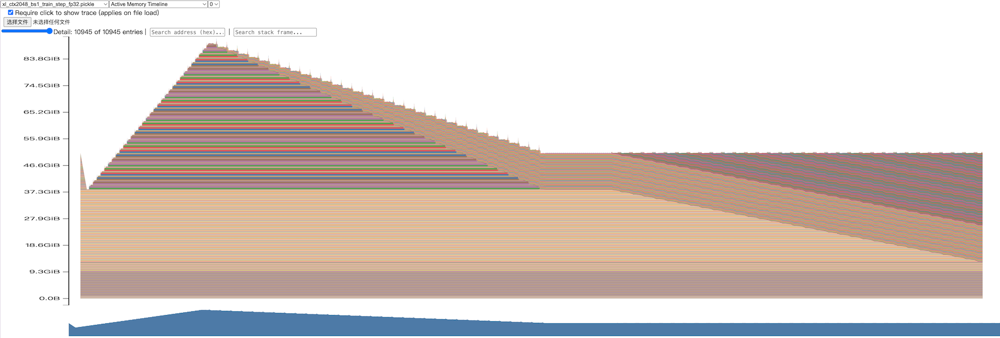

# A2-P：Profiling 与性能分析

作者：栾效睿  
题面版本：`26.1.4-rc.3`  
上游 starter commit：`ca8bc81a59b70516f7ebb2da4808daade877c736`

本报告的所有数值均来自同目录的轻量汇总文件；完整 Chrome trace 与 PyTorch memory-history snapshot 只保留在本地，不作为公开提交物。作业要求见[课程 A2-P 说明](../../../../assignments/A2-P/README.md)。

## 完成范围与证据边界

已完成并有公开汇总证据的部分：

- small 模型的三种端到端 benchmark，以及 `train_step` 的 warm-up 对照；
- small/medium × context 256/512/1024 的六个 FP32 `train_step` `torch.profiler` trace；
- 四种累加写法、ToyModel BF16 autocast dtype 观察，以及 10 步 FP32/BF16 数值趋势；
- small、medium、large、XL、10B 五个模型规模在 FP32/BF16 autocast 下的时间与峰值显存对照；
- XL 模型在 context 128 与 2048、forward 与 `train_step` 上的 memory-history 峰值统计和时间线。

以下内容在当前 `results/`、`assets/` 中没有可追溯证据，因而不补写结论：
- 最大 allocation，也没有展示 stack trace; 相关描述补充在飞书文档

## 环境与测量口径

| 项目 | 公开、脱敏的信息                                              |
| --- |---------------------------------------------------------------|
| GPU | NVIDIA H200                                                   |
| CUDA | 12.8                                                          |
| PyTorch | `2.11.0+cu128`                                                |
| Python | 3.12.3                                                        |
| Driver 版本 | `570.124.06`（NVIDIA-SMI `570.124.06`）                       |
| Compute profiler | `torch.profiler`（CPU/CUDA activities）与 Perfetto 阅读 trace |
| Memory profiler | PyTorch memory history / Memory Visualizer                    |

除非另有说明，随机种子为 0。small 模型的配置为 `d_model=768`、`d_ff=3072`、12 层、12 个 heads、词表大小 10,000；XL 模型为 `d_model=2560`、`d_ff=10240`、32 层、32 个 heads。所有表中的 GiB 均按 `2^30` bytes 换算。

## 1. End-to-End Benchmark

### 方法与复现命令

基准的统一配置为 small、batch size 4、context length 512、FP32、seed 0。计时器是 `torch.cuda.Event.elapsed_time`：在当前 CUDA stream 上记录 start event，执行一个被测 step，再记录 end event，并在读取 elapsed time 前调用 `torch.cuda.synchronize()`。模型构造、optimizer 构造和随机 batch 生成发生在计时之外。每个 warm-up step 也会同步，避免其异步工作泄漏进正式测量。

`forward` 在 `torch.no_grad()` 下只执行前向；`forward_backward` 执行前向、loss 和 `backward()`；`train_step` 还包含 `zero_grad(set_to_none=True)`、gradient clipping、学习率更新及 AdamW `step()`。对应的命令形态如下（每条实际命令也保存于 [`results/benchmark.csv`](results/benchmark.csv) 的 `command` 列）：

```bash
python profiling/benchmark.py --model-size small --batch-size 4 --context-length 512 \
  --mode forward --dtype fp32 --seed 0 --warmup 5 --steps 10

python profiling/benchmark.py --model-size small --batch-size 4 --context-length 512 \
  --mode forward_backward --dtype fp32 --seed 0 --warmup 5 --steps 10

python profiling/benchmark.py --model-size small --batch-size 4 --context-length 512 \
  --mode train_step --dtype fp32 --seed 0 --warmup 5 --steps 10

python profiling/benchmark.py --model-size small --batch-size 4 --context-length 512 \
  --mode train_step --dtype fp32 --seed 0 --warmup 0 --steps 10
```

### 结果

| mode | warm-up | 测量次数 | 均值 (ms) | 样本标准差 (ms) | CV | 10 次 raw timing (ms) |
| --- | ---: | ---: | ---: | ---: | ---: | --- |
| forward | 5 | 10 | 8.732 | 0.022 | 0.0026 | 8.716, 8.691, 8.715, 8.729, 8.719, 8.765, 8.739, 8.756, 8.745, 8.748 |
| forward_backward | 5 | 10 | 30.983 | 0.073 | 0.0024 | 30.950, 30.865, 30.997, 31.011, 31.033, 30.921, 31.091, 31.038, 31.037, 30.890 |
| train_step | 5 | 10 | 41.769 | 0.882 | 0.0211 | 41.787, 41.230, 41.314, 41.936, 41.406, 41.638, 41.476, 44.195, 41.431, 41.275 |
| train_step | 0 | 10 | 63.491 | 68.226 | 1.0746 | 257.622, 46.044, 41.788, 41.442, 41.575, 41.552, 41.444, 41.190, 41.135, 41.119 |

数据来源：[`results/benchmark.csv`](results/benchmark.csv)。参数量为 128,625,408；`mean_ms`、`std_ms` 和 CV 均直接使用该文件的统计结果。

### 分析

三种 mode 的均值依次为 8.732、30.983 和 41.769 ms，符合 `forward_backward` 增加反向传播、`train_step` 再增加 gradient clipping 与 AdamW 更新的计时边界。预热后的 `train_step` CV 为 2.11%，其中第 8 个观测值 44.195 ms 是相对较高但仍处于同一量级的样本。

不进行 warm-up 时，第一个 `train_step` 为 257.622 ms，约为预热后均值的 6.17 倍，导致均值升至 63.491 ms、CV 达 107.46%。其余九个样本约为 41–46 ms，说明首次 CUDA/库执行和缓存建立的开销会严重污染首个样本；这也是将 warm-up 与正式测量分开的原因。

## 2. Compute Profiling

### 采集协议与六个 trace

六组 trace 均使用完整 FP32 `train_step`、batch size 4、seed 0、5 个 warm-up step 和 1 个测量 step。主工具为 `torch.profiler`，启用 CPU/CUDA activities、shape 记录和 Python stack 记录。5 个 warm-up 中有 4 个在 profiler 外完成，最后 1 个在 profiler 内但标为 `profile/warmup`；轻量汇总仅保留 `profile/measure` 内的记录，因此没有把 warm-up 的 op 或 kernel 混入结果。

每个 trace 都具有 `profile/warmup`、`profile/measure`、`forward`、`backward`、`optimizer`、`attention/scores`、`attention/softmax` 和 `attention/value` 标记。原始 trace 文件未提交；六个 trace 的命令、配置和本地 trace 文件名见 [`results/profile/run_metadata.json`](results/profile/run_metadata.json)。

| run name | 模型 | context | dtype | 预热划分 | 测量 step | 本地 trace 文件名 |
| --- | --- | ---: | --- | --- | ---: | --- |
| `small_ctx256_train_step_fp32` | small | 256 | FP32 | 4 外部 + 1 内部 | 1 | `small_ctx256_train_step_fp32.json` |
| `small_ctx512_train_step_fp32` | small | 512 | FP32 | 4 外部 + 1 内部 | 1 | `small_ctx512_train_step_fp32.json` |
| `small_ctx1024_train_step_fp32` | small | 1024 | FP32 | 4 外部 + 1 内部 | 1 | `small_ctx1024_train_step_fp32.json` |
| `medium_ctx256_train_step_fp32` | medium | 256 | FP32 | 4 外部 + 1 内部 | 1 | `medium_ctx256_train_step_fp32.json` |
| `medium_ctx512_train_step_fp32` | medium | 512 | FP32 | 4 外部 + 1 内部 | 1 | `medium_ctx512_train_step_fp32.json` |
| `medium_ctx1024_train_step_fp32` | medium | 1024 | FP32 | 4 外部 + 1 内部 | 1 | `medium_ctx1024_train_step_fp32.json` |

### 阶段范围与 CUDA activity 汇总

下表从 [`results/profile/trace_summary.csv`](results/profile/trace_summary.csv) 汇总而来。`measure`、`forward`、`backward`、`optimizer` 是 `record_function` 的**包容 CPU range**；后三列不能相加，因为它们与嵌套 annotation 有重叠，也不等价于 GPU wall-clock。`CUDA activity` 是该测量窗口中 kernel/memcpy/memset 的物理 GPU duration 之和，且同样不是 GPU wall-clock；`kernel calls` 为这些 activity 的调用数。

| run | measure CPU range (ms) | forward CPU range (ms) | backward CPU range (ms) | optimizer CPU range (ms) | CUDA activity (ms) | kernel calls |
| --- | ---: | ---: | ---: | ---: | ---: | ---: |
| small, ctx 256 | 76.371 | 1.543 | 31.831 | 20.989 | 22.206 | 4,152 |
| small, ctx 512 | 74.234 | 1.668 | 31.284 | 20.335 | 34.741 | 4,152 |
| small, ctx 1024 | 90.863 | 1.807 | 32.456 | 35.077 | 71.072 | 4,155 |
| medium, ctx 256 | 142.971 | 2.595 | 63.266 | 38.439 | 55.402 | 8,088 |
| medium, ctx 512 | 145.290 | 2.748 | 63.720 | 38.889 | 87.862 | 8,088 |
| medium, ctx 1024 | 210.675 | 3.220 | 85.446 | 80.330 | 184.104 | 8,187 |

small 与 medium 的 kernel 调用数分别约为 4.15k 和 8.09k，模型从 12 层扩展到 24 层带来更多重复 kernel。context 从 256 加倍到 1024 时，CUDA activity 增长明显，尤其是 medium 从 55.402 ms 增至 184.104 ms；这与 attention 中随序列长度增大的矩阵计算相一致。

### 代表性 trace：medium / context 1024



在这个配置中，按阶段归属的 CUDA activity 汇总为：forward 49.371 ms / 1,265 calls，backward 113.683 ms / 2,537 calls，optimizer 21.051 ms / 4,385 calls。backward 占最大的物理 GPU duration；optimizer 的总 GPU 时间较小但 kernel 数最多，说明这里存在大量较短的逐元素更新 kernel。该分解用于归因，不将三个阶段的 GPU 时间解释成无重叠的端到端 wall-clock。

| 类型 | stage | 代表性 op/kernel（`trace_summary.csv` 中保留完整名） | Calls | CPU 或 CUDA total (ms) |
| --- | --- | --- | ---: | ---: |
| CPU op | forward | `aten::einsum` | 217 | 14.070 CPU |
| CPU op | backward | `BmmBackward0` | 217 | 12.451 CPU |
| CUDA kernel | backward | elementwise `DivFunctor<float>` kernel | 72 | 16.613 CUDA |
| CUDA kernel | backward | vectorized elementwise `MulFunctor<float>` kernel | 340 | 15.433 CUDA |
| CUDA kernel | backward | `sm90_xmma_gemm_f32f32_tf32f32...`（NT） | 72 | 10.006 CUDA |
| CUDA kernel | forward | `sm90_xmma_gemm_f32f32_tf32f32...`（TN） | 168 | 9.033 CUDA |
| CUDA kernel | optimizer | vectorized elementwise unary `MulFunctor<float>` kernel | 1,315 | 6.469 CUDA |

`cpu_op` 的时间包含嵌套框架调用，表中不对它们求和。attention 三个子区间均位于 forward 内：`attention/scores`、`attention/softmax`、`attention/value` 分别有 24 次调用，包容 CPU range 分别为 3.612、3.551、3.220 ms。因此它们只是 forward 的嵌套分解，不能再加到 forward 总时间上。



### 工具边界

`torch.profiler` 提供了本报告使用的 CPU/CUDA activity、`record_function` 阶段范围、op/kernel calls 与物理 CUDA duration；Chrome trace 在 Perfetto 中用于读取线程、CUDA stream 和阶段的相对关系。它不提供 Nsight Systems 那种 CUDA API 到 GPU kernel 的完整系统级因果关联，因此本报告不伪造 nsys 专有字段，也不把 CPU annotation 的时间当作 CUDA API 时间。

## 3. Mixed Precision

### 四种累加实验

四种写法均累加 1,000 次 `0.01`，理论结果为 10。实际结果如下，来源为 [`results/mixed_precision.json`](results/mixed_precision.json)。

| 输入 dtype | 累加器 dtype | 写法 | 结果 | 相对 10 的绝对误差 |
| --- | --- | --- | ---: | ---: |
| FP32 | FP32 | `fp32_accumulator_fp32_input` | 10.000133514 | 0.000133514 |
| FP16 | FP16 | `fp16_accumulator_fp16_input` | 9.953125000 | 0.046875000 |
| FP16 | FP32 | `fp32_accumulator_fp16_input` | 10.002136230 | 0.002136230 |
| FP16，显式转 FP32 | FP32 | `fp32_accumulator_explicit_cast_fp16_input` | 10.002136230 | 0.002136230 |

`0.01` 先量化为 FP16 时已经引入误差；因此即使后续用 FP32 累加，仍保留 0.002136230 的误差。FP16 累加器还会在每次加法后再次舍入，误差扩大到 0.046875。显式将已量化的 FP16 输入转回 FP32 不会恢复丢失的信息，故最后两种结果相同。FP32 输入/FP32 累加器仍有很小误差，是十进制小数在二进制浮点中不能精确表示所致。

这也说明应区分输入量化与 reduction accumulator 精度：前者决定进入 reduction 的值，后者决定大量相加时的累计舍入。对训练而言，LayerNorm/reduction 常保持较高精度；BF16 的指数范围接近 FP32，动态范围优于 FP16，而 H200 可对适合的 BF16 矩阵运算使用 Tensor Core。下文给出本次实测的端到端时间与峰值显存；本段仅解释其可能的数值与硬件机制，不把机制本身当作因果证明。

### ToyModel BF16 autocast dtype

ToyModel 在 CUDA `torch.autocast(device_type="cuda", dtype=torch.bfloat16)` 下的实际观测如下：

| 对象 | 实际 dtype |
| --- | --- |
| 参数 | `torch.float32` |
| 第一层 `fc1` 输出 | `torch.bfloat16` |
| LayerNorm 输出 | `torch.float32` |
| logits | `torch.bfloat16` |
| loss | `torch.float32` |
| `fc1.weight.grad` | `torch.float32` |

这表明 autocast 并非将所有张量永久转换成 BF16：线性层输出和 logits 使用 BF16，而 LayerNorm、loss、参数和梯度保留 FP32，以兼顾性能与数值稳定性。

### FP32 与 BF16 数值趋势

使用共享的初始 CPU FP32 state dict、相同的固定 token/target、独立但参数相同的 AdamW，在 optimizer update 前观察 small、batch size 4、context 512 的 10 个测量 step（每侧均先 warm-up 5 步）。所有 10 步的 FP32/BF16 logits 和 loss 均为有限值。

| 指标 | 最小值 | 均值 | 最大值 |
| --- | ---: | ---: | ---: |
| FP32 loss | 1.094847 | 3.030346 | 6.024629 |
| BF16 loss | 1.092791 | 3.024743 | 6.016376 |
| loss 绝对差 | 0.002056 | 0.006207 | 0.019165 |
| loss 相对差 | 0.000668 | 0.002130 | 0.003504 |
| logits 最大绝对差 | 0.045511 | 0.081171 | 0.140000 |
| logits 相对 L2 误差 | 0.007295 | 0.016056 | 0.027759 |
| top-1 agreement | 0.996094 | 0.999268 | 1.000000 |

在这个短诊断中，BF16 与 FP32 有可测但较小的差异，top-1 agreement 平均为 99.9268%，且没有出现非有限值。由于两条轨迹各自使用 optimizer 并经过多步更新，差异可能同时来自 autocast 算子舍入和训练轨迹的逐步分叉，不能把它归结为单一算子误差。

### FP32 与 BF16 autocast 的时间和峰值显存

使用相同的 batch size 4、context length 512、seed 0、5 个 warm-up step 和 10 个 measurement step，对五种模型规模分别运行 `forward` 与 `forward_backward`。BF16 使用 CUDA BF16 autocast；每次运行均记录 raw timing、均值、样本标准差、CV 以及 allocator 的 active/allocated/reserved 峰值。完整原始样本和命令见 [`results/mixed_precision_benchmark.csv`](results/mixed_precision_benchmark.csv)。

| 模型 | mode | FP32 均值 (ms) | BF16 均值 (ms) | FP32/BF16 speedup | BF16 时间变化 |
| --- | --- | ---: | ---: | ---: | ---: |
| small | forward | 8.678 | 8.361 | 1.038× | -3.66% |
| small | forward_backward | 30.952 | 27.955 | 1.107× | -9.68% |
| medium | forward | 21.207 | 20.771 | 1.021× | -2.05% |
| medium | forward_backward | 72.832 | 63.061 | 1.155× | -13.42% |
| large | forward | 40.214 | 38.180 | 1.053× | -5.06% |
| large | forward_backward | 143.735 | 116.668 | 1.232× | -18.83% |
| XL | forward | 79.706 | 65.408 | 1.219× | -17.94% |
| XL | forward_backward | 289.756 | 214.580 | 1.350× | -25.94% |
| 10B | forward | 235.512 | 174.502 | 1.350× | -25.91% |
| 10B | forward_backward | 874.425 | 597.212 | 1.464× | -31.70% |

`peak_active_bytes` 与 `peak_allocated_bytes` 在这些记录中相同，故合并列示；单位为 GiB。`reserved` 是 allocator 保留的内存，不能与 active/allocated 混为同一口径。

| 模型 | mode | FP32 peak active / allocated | BF16 peak active / allocated | BF16 active 峰值变化 | FP32 / BF16 peak reserved |
| --- | --- | ---: | ---: | ---: | ---: |
| small | forward | 0.735 | 0.912 | +24.12% | 0.885 / 0.947 |
| small | forward_backward | 4.107 | 3.289 | -19.94% | 4.258 / 3.523 |
| medium | forward | 1.907 | 2.565 | +34.52% | 2.018 / 2.627 |
| medium | forward_backward | 10.611 | 8.469 | -20.18% | 11.023 / 8.730 |
| large | forward | 4.120 | 5.767 | +39.99% | 4.279 / 6.008 |
| large | forward_backward | 20.312 | 16.646 | -18.04% | 20.506 / 17.244 |
| XL | forward | 13.466 | 19.426 | +44.26% | 13.631 / 19.912 |
| XL | forward_backward | 40.201 | 37.335 | -7.13% | 41.537 / 43.305 |
| 10B | forward | 48.807 | 72.024 | +47.57% | 49.020 / 78.496 |
| 10B | forward_backward | 104.145 | 109.933 | +5.56% | 136.859 / 122.971 |

在这组固定配置中，BF16 的 10 组测量均快于 FP32，speedup 为 1.021×–1.464×；模型规模越大、且包含 backward 时，时间收益更明显，10B `forward_backward` 的均值从 874.425 ms 降至 597.212 ms。显存峰值并不单调：所有 forward 配置的 BF16 peak active 更高，而 small/medium/large/XL 的 `forward_backward` 更低，10B `forward_backward` 则略高 5.56%。参数和 optimizer state 仍可能保留 FP32，且 kernel workspace 与 caching allocator 的选择会改变峰值；因此不能仅根据 dtype 推断峰值显存必然减半，必须按同一模型和 mode 的测量结果比较。

## 4. Memory Profiling

### 采集方法与峰值表

每个记录均先完成 5 个 warm-up step，随后重置 peak memory stats 并开启 PyTorch memory history，只采集 1 个 measurement step。`active` 是 allocator 的 active allocation，`allocated` 是 PyTorch 当前分配量，`reserved` 是 caching allocator 已保留的量；三者及其峰值不能混用。当前结果中 `active` 与 `allocated` 数值相同，但仍按不同口径列出。

| dtype | mode | batch | context | active / allocated (GiB) | peak active / allocated (GiB) | reserved (GiB) | peak reserved (GiB) |
| --- | --- | ---: | ---: | ---: | ---: | ---: | ---: |
| FP32 | forward | 4 | 128 | 12.85 / 12.85 | 12.93 / 12.93 | 12.95 | 12.95 |
| FP32 | train_step | 4 | 128 | 50.95 / 50.95 | 51.46 / 51.46 | 57.46 | 57.46 |
| FP32 | forward | 4 | 2048 | 12.85 / 12.85 | 21.32 / 21.32 | 23.48 | 23.48 |
| FP32 | train_step | 1 | 2048 | 50.95 / 50.95 | 91.21 / 91.21 | 93.05 | 93.05 |
| BF16 | forward | 4 | 128 | 12.85 / 12.85 | 19.17 / 19.17 | 19.40 | 19.40 |
| BF16 | train_step | 4 | 128 | 50.95 / 50.95 | 51.45 / 51.45 | 58.39 | 58.39 |
| BF16 | forward | 4 | 2048 | 12.85 / 12.85 | 25.38 / 25.38 | 27.48 | 27.48 |
| BF16 | train_step | 1 | 2048 | 50.96 / 50.96 | 82.55 / 82.55 | 84.31 | 84.31 |

数据来源：[`results/memory/peaks.csv`](results/memory/peaks.csv)；每条成功命令、warm-up 数和 snapshot 文件名见 [`results/memory/run_metadata.json`](results/memory/run_metadata.json)，失败遥测见 [`results/memory/failures.jsonl`](results/memory/failures.jsonl)。XL/context 2048 的 forward 保持 batch size 4；`train_step` 的成功记录为 batch size 1，不能与 batch size 4 混为同一配置。

XL/context 2048、batch size 4 的完整 `train_step` 已明确记录为 OOM，而非静默缩小配置。两种 dtype 均在 warm-up 的 forward 阶段失败，申请额外 2.00 GiB 时可用显存不足；之后才使用 batch size 1 完成相应的成功采集。

| dtype | 失败阶段 | 请求 allocation | 失败时空闲显存 | peak active | peak reserved | GPU 总显存 |
| --- | --- | ---: | ---: | ---: | ---: | ---: |
| FP32 | warm-up / forward | 2.00 GiB | 1.61 GiB | 135.98 GiB | 137.57 GiB | 139.81 GiB |
| BF16 | warm-up / forward | 2.00 GiB | 0.44 GiB | 138.36 GiB | 138.70 GiB | 139.81 GiB |

从已记录的数值看，FP32 的 context 128 forward 峰值为 12.93 GiB，而 context 2048 forward 增至 21.32 GiB；完整 `train_step` 还需保存反向传播所需的中间量和 optimizer 状态，context 2048、batch size 1 时峰值为 91.21 GiB。BF16 记录的峰值并非在每个配置都更低（例如两个 forward 记录较高），但在 context 2048 的 `train_step` 中为 82.55 GiB，低于 FP32 的 91.21 GiB。由于这些记录只是一轮 memory-history 测量，且包含 allocator/临时 workspace 行为，不应据此概括所有 BF16 配置都必然节省相同显存。

### Active Memory Timeline





第一张图对应短 context 的 forward，峰值与表中的 12.93 GiB 一致，主要为模型和该步执行期间的活跃 allocation。第二张图对应长 context 的完整训练 step，曲线在步骤中显著爬升，之后回落到约 50.95 GiB 的执行后 active/allocated 水平；这与 forward 保存激活、backward 产生梯度并释放一部分 saved activation 的一般训练过程相符。不过，截图未显示阶段标记和单项 allocation 的 stack trace，因此不能把曲线的每一段精确标到某个 TransformerBlock 调用。

### Residual stream 的理论大小与限制

XL 的 `d_model=2560`。单个 FP32 residual stream tensor 的理论大小为：

```text
bytes = batch_size × context_length × 2560 × 4
```

| 配置 | 单个 FP32 residual stream | 若 32 个 block 各保留一个此大小张量的简单小计 |
| --- | ---: | ---: |
| batch 4, context 128 | 5 MiB | 160 MiB |
| batch 4, context 2048 | 80 MiB | 2.50 GiB |
| batch 1, context 2048 | 20 MiB | 640 MiB |

这只是 residual stream 的量级估计，不能与 allocator 的最大 allocation 或总峰值直接画等号：实际峰值还包括参数、AdamW 状态、其他 activation、attention 临时张量、梯度及内核 workspace；BF16 autocast 下某些 activation 的元素大小也会不同。当前截图没有选中最大 allocation 或显示 stack trace，因此本次只能用理论大小与总峰值做量级比较，不能完成“最大 allocation → 源码栈 → 具体 residual/gradient”这一精确归因。该缺口保留为未完成项。

## 5. 复现、限制与补充材料

### 最小复现步骤

在固定 starter commit 的上游工作仓库中，使用同一 CUDA 环境运行以下命令；命令参数与提交的 metadata 保持一致。

```bash
# 端到端基准（替换 --mode 为 forward、forward_backward、train_step）
python profiling/benchmark.py --model-size small --batch-size 4 --context-length 512 \
  --mode train_step --dtype fp32 --seed 0 --warmup 5 --steps 10

# 六个 profiler 配置的批量采集与轻量汇总
python profiling/collect_profiles.py

# 累加、ToyModel dtype 与 FP32/BF16 数值趋势
python profiling/mixed_precision.py accumulation
python profiling/mixed_precision.py toy --dtype bf16
python profiling/mixed_precision.py numeric-trend

# 五种模型规模、FP32/BF16 的时间与峰值显存对照
python profiling/collect_mixed_precision.py

# XL 的 memory-history 采集；snapshot 仅本地保留
python profiling/collect_memory.py
```


### 已知限制

- 提交文件不能溯源最大 allocation 详情和 stack trace，无法进行精确的 allocation 归因。详细描述见飞书文档。
- `torch.profiler` 不能替代 nsys 的系统级 CUDA API ↔ kernel 关联。

### 飞书补充文档

- 链接：https://fudan-nlp.feishu.cn/wiki/T55bwt94Si4mUrkh91Kc3DX4nyf  

- 该文档设置为组织内公开，不得开启互联网公开访问，只保存不能公开到 GitHub 但确有审核必要 的最小差量材料；不要机械复制公开报告，也不要随意上传大型 trace、snapshot 或凭据。


