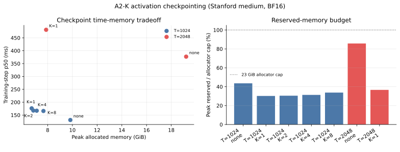
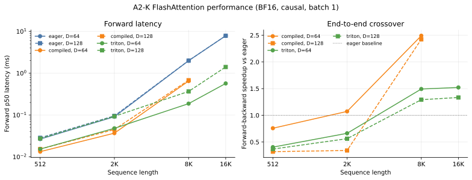

# A2-K 公开提交：王惟易

> 本文件和同目录代码、汇总、图片公开可见。这里只提交允许公开且已经脱敏的内容；完整原始输出、编译缓存和大型中间产物不进入 Git 仓库。

> 正式要求见 [`assignments/A2-K/README.md`](../../../../assignments/A2-K/README.md)，评分说明见 [`assignments/A2-K/EVALUATION.md`](../../../../assignments/A2-K/EVALUATION.md)。

## 基本信息

- 作业题面版本：`26.1.4-k-rc.3`
- 完成范围：Activation Checkpointing、显式 PyTorch Attention、`torch.compile` 对照、pure PyTorch tiled FlashAttention、学生编写的 Triton forward，以及重计算式 backward 均已实现；扩展正确性与 66 行 FlashAttention 性能矩阵已在正式 GPU 环境中完成。
- 未完成项：无。
- 上游 starter commit：`ca8bc81a59b70516f7ebb2da4808daade877c736`
- 工作仓库：与本仓库同级的固定 starter checkout

## 环境与工具

| 项目 | 公开、脱敏的信息 |
| --- | --- |
| GPU | NVIDIA GeForce RTX 4090；平台报告总显存 49140 MiB，经允许在更大显存实例上使用统一 23 GiB allocator 上限 |
| 开跑前显存 | `memory.total=49140 MiB`，`memory.free=48510 MiB` |
| Driver / CUDA | Driver `570.195.03` / CUDA runtime `12.8` |
| PyTorch | `2.11.0+cu128`，cuDNN `91900` |
| Triton | `3.6.0` |
| power limit / P-state | 默认 450 W；各独立进程采集时为 P8/P5/P3，未手动修改频率或 power limit |
| TF32 | 性能矩阵的 attention 输入为 BF16；脚本同时设置 `allow_tf32=False` 和 `float32_matmul_precision="highest"`，FP32 correctness 中还为 Triton `tl.dot` 显式指定 `input_precision="ieee"` |
| compile 配置 | `torch.compile(..., fullgraph=True)`；cold-start 与 steady-state 分开测量 |
| allocator limit / fraction | `23552 MiB` / `0.48542746322568014` |
| 运行方式 | 单进程、单张可见 GPU、各配置串行且使用独立 Python 进程 |

## 1. Activation Checkpointing

### 理论与代码骨架

对于由 `N` 个相同 Transformer block 构成的顺序网络，如果每 `K` 层保存一个边界 activation，那么前向结束时需要保存约 `N / K` 个边界；反向重计算某一段时，段内又会暂存约 `K` 层 activation。忽略各张量常数差异后，峰值 activation memory 近似为 `M(K) = O(N / K + K)`，在 `K` 取 `sqrt(N)` 数量级时达到 `O(sqrt(N))`。

如果完全忽略计算代价，还可以对区间递归地嵌套 checkpoint。平衡二分时递归深度为 `O(log N)`，因而可把 activation memory 继续降到 `O(log N)`；代价是不同层在不同递归层级被重复计算，总计算量上升到 `O(N log N)`。本作业的固定实验使用非嵌套分段，以便直接观察 block size 对真实峰值显存和 step latency 的影响。

实现沿 `BasicsTransformerLM.layers` 的顺序 `ModuleList` 切分区间，并使用非 reentrant checkpoint：

```python
def run_layers(layers, x, block_size):
    if block_size is None:
        return run_segment(x, layers=layers, start=0, end=len(layers))
    for start in range(0, len(layers), block_size):
        end = min(start + block_size, len(layers))
        segment = partial(run_segment, layers=layers, start=start, end=end)
        x = checkpoint(segment, x, use_reentrant=False)
    return x
```

checkpoint 只保存每段输入边界。反向进入一段时重新执行该段 forward，临时重建计算梯度所需的内部 activation，然后释放该段中间结果并继续向前一段传播。

### 固定实验

正式实验固定使用 Stanford medium、24 层、batch size 1、BF16 autocast、FP32 参数和 AdamW。context length 1024 比较无 checkpoint 与 block size `1/2/4/8`；随后在 context length 2048 比较 baseline 与 1024 矩阵中 peak allocated 最低的 checkpoint 配置。每个配置使用至少 3 个 warm-up step 和 5 个 measurement step，并记录五个原始 step latency、p50、peak allocated、peak reserved、OOM 和 allocator 判定。

全部 7 行均成功：

| context | block size | step p50 ms | peak allocated MiB | peak reserved MiB | 相对 baseline |
| ---: | ---: | ---: | ---: | ---: | --- |
| 1024 | none | 130.88 | 10068.47 | 10272 | baseline |
| 1024 | 1 | 176.12 | 6865.41 | 7114 | time +34.56%, allocated −31.81% |
| 1024 | 2 | 167.55 | 7005.53 | 7178 | time +28.01%, allocated −30.42% |
| 1024 | 4 | 167.01 | 7283.91 | 7380 | time +27.60%, allocated −27.66% |
| 1024 | 8 | 165.81 | 7840.66 | 7954 | time +26.68%, allocated −22.13% |
| 2048 | none | 376.89 | 19664.61 | 20192 | baseline |
| 2048 | 1 | 481.22 | 8063.68 | 8634 | time +27.68%, allocated −58.99% |

完整五次 latency 原始值、allocator fraction 和状态见 [`results/checkpointing.csv`](results/checkpointing.csv)。



### 分析框架

较小的 block 保存更多边界 activation，但每次重计算的段更短；较大的 block 减少边界数量，却会在反向的段内同时保留更多中间 activation。本次 24 层模型中，block size 1 的边界 activation 代价仍小于更大分段在反向时恢复的段内 activation，因而取得最低 peak allocated；但它的频繁 checkpoint 边界与重计算调度也使它成为 T=1024 下最慢的 checkpoint 配置。block size 8 则是 checkpoint 配置中最快、但节省显存最少的一个。

这也说明最佳 block size 取决于目标：如果为了将更长序列放入固定预算，block size 1 的显存优势最大；如果 baseline 本已可容纳，block size 8 提供了较小的时间惩罚。T=2048 baseline 虽然没有 OOM，但已占用 20192 MiB reserved；block size 1 将其降到 8634 MiB，大幅增加了显存余量。

## 2. PyTorch Attention 与 `torch.compile`

### 显式 PyTorch 基线

基线按定义显式执行 `S = Q @ K.T / sqrt(D)`、causal mask、`P = softmax(S)` 和 `O = P @ V`，没有调用 `scaled_dot_product_attention` 或其他 fused attention。mask 在 softmax 前把未来位置设为负无穷，因此被禁止位置既不参与归一化，也不向输出传递信息。

性能实验固定 batch size 1、BF16、causal，并覆盖 sequence length `512/2048/8192`、head dimension `64/128` 和三个测量边界：

- `forward`：只计一次前向。
- `backward`：先在计时区间外构造 forward graph，再只计反向。
- `forward_backward`：在同一个计时区间内重新前向并反向。

输入创建和随机生成均在计时外。每个配置使用 `triton.testing.do_bench(warmup=100, rep=300, quantiles=[0.2, 0.5, 0.8])`，同步后另测一次 steady-state invocation 的 peak allocated 与 peak reserved。

结果文件：[`results/attention_baseline.csv`](results/attention_baseline.csv)。18/18 行均成功，这些行与 Flash 核心矩阵中的 eager 对照共用同一批原始测量，避免重复运行后因 GPU 状态波动产生两份“基线”。

### Compile 对照

`torch.compile` 对照使用 `fullgraph=True`。这样 graph break 不会被静默隐藏：如果无法形成完整图，实验会直接失败并保留错误，而不是悄悄回退到 eager。首次调用单独记录为 cold-start；正式 p20/p50/p80 只来自编译完成后的 steady state。

attention 对照固定使用 `(T=512,D=64)`、`(T=2048,D=128)`、`(T=8192,D=128)`，并比较三个 attention phase。完整模型对照使用 Stanford small、batch size 1、context length 512、BF16，比较 forward、forward-backward 和包含梯度清零与 AdamW update 的完整 train step。不同 shape、是否需要梯度、causal 布尔值与 autocast 状态都可能触发 specialization。每个 case 使用新 Python 进程，但未主动清空跨进程磁盘 compile cache；因此本报告中的 cold-start 严格指“该进程首次调用”，不声称是空磁盘 cache 下的纯编译时间。

全部 24 行均成功。attention 结果为：

| T | D | phase | eager p50 ms | compiled p50 ms | speedup | cold-start s |
| ---: | ---: | --- | ---: | ---: | ---: | ---: |
| 512 | 64 | forward | 0.027 | 0.013 | 2.01x | 4.89 |
| 512 | 64 | backward | 0.036 | 0.029 | 1.25x | 2.80 |
| 512 | 64 | forward-backward | 0.100 | 0.125 | 0.80x | 2.86 |
| 2048 | 128 | forward | 0.099 | 0.043 | 2.31x | 2.94 |
| 2048 | 128 | backward | 0.111 | 0.074 | 1.50x | 2.51 |
| 2048 | 128 | forward-backward | 0.190 | 0.141 | 1.35x | 1.72 |
| 8192 | 128 | forward | 1.998 | 0.683 | 2.93x | 1.51 |
| 8192 | 128 | backward | 2.454 | 1.166 | 2.10x | 2.95 |
| 8192 | 128 | forward-backward | 4.370 | 1.807 | 2.42x | 4.37 |

完整 Transformer 对照为：

| phase | eager p50 ms | compiled p50 ms | speedup | cold-start s |
| --- | ---: | ---: | ---: | ---: |
| forward | 10.601 | 2.690 | 3.94x | 18.61 |
| forward-backward | 37.150 | 12.729 | 2.92x | 33.13 |
| train step | 52.826 | 25.182 | 2.10x | 17.64 |

steady-state 上，compile 收益随 workload 增大而更稳定；最短 attention 的 forward-backward 反而只有 0.80x，说明图融合不能消除调度与启动成本。对完整 Transformer，compiled 的三个 phase 都更快，但 17.64–33.13 s 的 cold-start 与毫秒级 steady-state 不在同一数量级；只有在 shape 稳定且反复执行时才能摊薄编译成本。

两次独立矩阵中，绝大多数重复 attention case 的 p50 差异不超过 5%，但微秒级的两个 compiled case 有明显波动。其中 T=2048、D=128 的 forward-backward 在 compile 专项矩阵中为 0.141 ms，而 Flash 矩阵中的 0.559 ms 是离群值。本节使用专项矩阵作为 compile 结论的主数据，同时保留 Flash CSV 中的原始值而不事后替换。完整 p20/p50/p80、measurement count、显存和 cold-start 见 [`results/compile_comparison.csv`](results/compile_comparison.csv)。

## 3. FlashAttention-2 Forward

### Pure PyTorch tiled reference

参考实现先沿 query 维切 tile，再让每个 query tile 依次扫描全部 key/value tile。对于当前 score tile `S_tile`，每个 query row 只维护 running maximum `m`、以 `m` 为基准的指数和 `l`，以及尚未归一化的输出分子 `O_acc`：

```text
m_new = max(m_old, rowmax(S_tile))
alpha = exp(m_old - m_new)
P_tile = exp(S_tile - m_new)
l_new = alpha * l_old + rowsum(P_tile)
O_acc_new = alpha * O_acc_old + P_tile @ V_tile
```

扫描完成后计算 `O = O_acc / l` 和 `L = m + log(l)`。当新的 tile 提高 row maximum 时，`alpha` 把旧分母和旧分子同时换算到新的指数基准，因此不需要保存完整 score 或 probability matrix。causal mask 使用全局 query/key position，而不是 tile 内局部坐标。

自定义 `torch.autograd.Function` 的 forward 保存 `Q/K/V/O/L`。其中只有 `L` 的 shape 是 `[batch, n_queries]`，既满足测试接口，也足以让 backward 重建 softmax probability。

### Triton kernel

Triton launch grid 为 `(ceil_div(Nq, Bq), batch)`：每个 program instance 固定一个 batch index 和一个 query tile。Q tile 只加载一次；K 和 V 使用 block pointer 在 kernel 内按 key tile 逐段推进。K 的 block pointer 以逻辑转置视图组织为 `[D, Bk]`，从而直接供 `tl.dot(Q_tile, K_tile)` 使用，不产生显式转置副本。

当前 launch 参数为 query tile `64`、key tile `64`、`num_warps=4`、`num_stages=3`。`num_stages` 是 K/V load 与计算的软件流水线深度，不是 key tile 数量。尾部 key 先由 block pointer 做越界 padding，再在 score 上显式写入负无穷；仅把 K/V padding 为零不足以阻止无效 key 参与 softmax。causal 模式进一步加入 `key_position <= query_position` 条件。

running maximum、normalizer 和 output accumulator 均使用 FP32；输出再转换回输入 dtype，L 保持 FP32。FP32 correctness 下两个 `tl.dot` 都显式使用 IEEE input precision，避免 Triton 自身的 TF32 默认值绕过 PyTorch 的 TF32 开关；性能矩阵使用 BF16，该选项对 BF16 输入不生效。

## 4. Backward 与正确性

### 重计算式 backward

Backward 不保存 `N x N` probability matrix，而是通过 `Q/K/L` 重计算：

```text
S  = scale * Q @ K.T
P  = exp(S - L[:, :, None])
dV = P.T @ dO
dP = dO @ V.T
D  = rowsum(dO * O)
dS = P * (dP - D)
dQ = scale * dS @ K
dK = scale * dS.T @ Q
```

`D` 等价于 `rowsum(P * dP)`；使用 `rowsum(dO * O)` 可以直接复用 forward 保存的输出。梯度先在 FP32 中计算，再转换回对应输入 dtype。这个普通 PyTorch backward 使用 `torch.compile(..., fullgraph=True)`，同时接入 pure PyTorch 和 Triton 两个 autograd path；前者使用 tiled PyTorch forward，后者使用学生编写的 Triton forward。

必做 backward 仍会重建完整 `S/P`，因此时间和临时显存是二次于序列长度的。自定义 tiled Triton backward 属于可选扩展，本提交未实现；这项限制尤其会影响长序列 backward 与 forward-backward 的显存和性能。

### 官方 GPU tests

正式命令为：

```bash
uv run pytest tests/test_attention.py -v
```

正式 RTX 4090 环境共收集 6 项测试：6 passed、0 failed、0 skipped，总耗时 22.90 s。PyTorch tiled 的 forward/backward 各通过 1 项；Triton 的 causal/non-causal forward 和 backward 各通过 2 项，因此这不是无 CUDA 环境中的 skip。完整脱敏输出见 [`results/unit_tests.txt`](results/unit_tests.txt)。

### 扩展正确性

扩展矩阵使用 3 个随机 seed、head dimension `32/64/128`、causal/non-causal，并同时检查 pure PyTorch tiled 与 Triton 两条路径的 `O/L/dQ/dK/dV`。BF16 tolerance 为 `rtol=atol=2e-2`；另有关闭 TF32 的 FP32 配置，tolerance 为 `rtol=atol=1e-2`。最大相对误差的分母以 `atol` 为下限，避免接近零的参考值让该指标失去解释性；最终 pass/fail 仍按逐元素 `atol + rtol * abs(reference)` 判断。

正式矩阵共 38 个 case，38 个通过、0 个失败。其中每条实现各包含 18 个 BF16 case 和 1 个 FP32 case：

| 实现 | dtype | case 数 | `O/L/dQ/dK/dV` 中最大绝对误差 | 状态 |
| --- | --- | ---: | ---: | --- |
| PyTorch tiled | BF16 | 18 | 0.0138879 | 18/18 passed |
| Triton | BF16 | 18 | 0.0138879 | 18/18 passed |
| PyTorch tiled | FP32 | 1 | 4.768e-7 | passed |
| Triton | FP32 | 1 | 4.768e-7 | passed |

BF16 中最大相对误差出现在接近零的梯度元素上；因此这一汇总值不能脱离 `atol` 解读。逐元素 pass/fail 仍使用 `atol + rtol * abs(reference)`，完整指标见 [`results/correctness.json`](results/correctness.json)。

## 5. 性能矩阵

### 配置与命令

正式矩阵固定 batch size 1、BF16、causal，在同一张 GPU 和同一 allocator 预算下比较：

1. 显式 eager PyTorch attention；
2. compiled PyTorch attention；
3. 学生 Triton FlashAttention-2。

核心矩阵覆盖 sequence length `512/2048/8192`、head dimension `64/128` 和 forward/backward/forward-backward，共 54 行。长序列边界使用 sequence length 16384、head dimension `64/128` 和三个 phase，比较 eager 与 Triton，共 12 行。每一行由独立 Python 进程运行；OOM 保留为结果行，其他真实错误直接中止矩阵。

```bash
CUDA_VISIBLE_DEVICES=0 uv run python student_scripts/a2k/run_flash_benchmark_matrix.py --output-dir /tmp/a2k-flash-benchmark --resume
```

每个成功行记录 p20/p50/p80、measurement count、peak allocated、peak reserved、allocator fraction 和 Triton launch 参数。只有除 implementation 外所有条件相同、且 eager 与目标实现都成功时，才计算 `speedup = eager_p50 / implementation_p50`。

### 结果与图

全部 66 行均成功，无 OOM 或 compile 失败。下表摘要展示 eager 与 Triton 的 forward 和 forward-backward p50；完整 eager/compiled/Triton 数据见 [`results/flash_benchmark.csv`](results/flash_benchmark.csv)。

| T | D | eager F ms | Triton F ms | F speedup | eager F+B ms | Triton F+B ms | F+B speedup | Triton F / F+B reserved MiB |
| ---: | ---: | ---: | ---: | ---: | ---: | ---: | ---: | ---: |
| 512 | 64 | 0.027 | 0.015 | 1.73x | 0.099 | 0.246 | 0.40x | 258 / 282 |
| 512 | 128 | 0.029 | 0.027 | 1.04x | 0.117 | 0.318 | 0.37x | 258 / 282 |
| 2048 | 64 | 0.091 | 0.048 | 1.89x | 0.167 | 0.252 | 0.66x | 258 / 330 |
| 2048 | 128 | 0.095 | 0.093 | 1.02x | 0.190 | 0.339 | 0.56x | 260 / 334 |
| 8192 | 64 | 1.993 | 0.187 | 10.64x | 4.318 | 2.893 | 1.49x | 262 / 1056 |
| 8192 | 128 | 1.997 | 0.367 | 5.45x | 4.370 | 3.381 | 1.29x | 278 / 1066 |
| 16384 | 64 | 7.861 | 0.569 | 13.81x | 17.285 | 11.359 | 1.52x | 278 / 4138 |
| 16384 | 128 | 7.880 | 1.411 | 5.58x | 17.499 | 13.123 | 1.33x | 278 / 4178 |



### 分析框架

数据已呈现明确的交叉点。在 T=512/2048 上，launch、索引、mask 和 online-softmax bookkeeping 的固定开销掩盖了端到端收益，Triton forward-backward 只有 eager 的 0.37–0.66x。当 T 增长到 8192/16384 时，显式 attention 对 score/probability 的二次物化成本上升，Triton forward 达到 5.45–13.81x，forward-backward 也达到 1.29–1.52x。

单独的 Triton backward 在所有 shape 上都比 eager 慢，speedup 只有 0.43–0.89x。这与实现边界一致：Triton 只融合 forward，backward 仍重建完整 `S/P`。在 T=16384、D=128 的 backward 中，全矩阵最高 peak reserved 为 4282 MiB，仍显著低于 23552 MiB 上限；但它不能代表 tiled backward 的显存复杂度。

固定 `64 x 64` tile 没有经过 autotune。它在实现复杂度、尾部处理、寄存器压力与并行 program 数量之间取了一个统一基线，但不保证对所有 head dimension 和 sequence length 最优；正式结果中的异常点会结合这一限制解释。

## 6. 限制与复现

### 已知限制

- Triton 只实现 fused tiled forward；backward 由 compiled PyTorch dense recomputation 完成。
- Triton launch 参数固定，没有针对不同 shape autotune。
- 首次 compile 对 cache 状态敏感；实验使用新进程，但没有清空跨进程磁盘 cache，cold-start 不是严格的 clean-cache 编译基准。
- allocator fraction 只限制 PyTorch allocator，不覆盖 CUDA context 和驱动开销，因此仍需报告开跑前整卡空闲显存并核对 peak reserved。
- 完整逐次日志与编译缓存只保留用于复核；公开仓库只包含脱敏后的轻量聚合结果。

### 结果与命令对应关系

| 结果文件 | 生成入口 |
| --- | --- |
| `results/checkpointing.csv` | `student_scripts/a2k/run_checkpoint_matrix.py --output-dir /tmp/a2k-checkpointing` |
| `results/attention_baseline.csv` | `student_scripts/a2k/run_attention_baseline_matrix.py --output-dir /tmp/a2k-attention-baseline` |
| `results/compile_comparison.csv` | `student_scripts/a2k/run_compile_comparison.py --output-dir /tmp/a2k-compile-comparison` |
| `results/unit_tests.txt` | `uv run pytest tests/test_attention.py -v` |
| `results/correctness.json` | `student_scripts/a2k/flash_correctness.py --output /tmp/a2k-correctness.json` |
| `results/flash_benchmark.csv` | `student_scripts/a2k/run_flash_benchmark_matrix.py --output-dir /tmp/a2k-flash-benchmark` |
| `results/run_metadata.json` | `student_scripts/a2k/build_a2k_report.py` |
| `results/memory_evidence.json` | `student_scripts/a2k/build_a2k_report.py` |

代码同步命令：

```bash
python3 scripts/sync_a2k_submission.py --name '王惟易'
```

24 GiB 可复现性由 [`results/memory_evidence.json`](results/memory_evidence.json) 汇总。在 97 行独立性能进程中，最高 peak allocated 为 19664.61 MiB，最高 peak reserved 为 20192 MiB，两者都来自 T=2048 的无 checkpoint baseline。所有行都低于 23552 MiB allocator 上限，`within_24gib=true`。环境、命令、seed 和测量协议见 [`results/run_metadata.json`](results/run_metadata.json)。

### 最小复现步骤

在固定 starter commit 的工作仓库中，只暴露一张 GPU，并串行执行：

```bash
CUDA_VISIBLE_DEVICES=0 uv run pytest tests/test_attention.py -v
CUDA_VISIBLE_DEVICES=0 uv run python student_scripts/a2k/run_checkpoint_matrix.py --output-dir /tmp/a2k-checkpointing
CUDA_VISIBLE_DEVICES=0 uv run python student_scripts/a2k/run_attention_baseline_matrix.py --output-dir /tmp/a2k-attention-baseline
CUDA_VISIBLE_DEVICES=0 uv run python student_scripts/a2k/run_compile_comparison.py --output-dir /tmp/a2k-compile-comparison
CUDA_VISIBLE_DEVICES=0 uv run python student_scripts/a2k/flash_correctness.py --output /tmp/a2k-correctness.json
CUDA_VISIBLE_DEVICES=0 uv run python student_scripts/a2k/run_flash_benchmark_matrix.py --output-dir /tmp/a2k-flash-benchmark
```

各入口在第一次 CUDA allocation 前检查可见设备数、开跑前空闲显存，并设置 23552 MiB allocator 上限。不同实现或 shape 均由矩阵 runner 启动独立 Python 进程，避免编译缓存、allocator 和存活张量跨配置污染。

## 飞书补充文档

- 链接：https://fudan-nlp.feishu.cn/wiki/MyC8wtMoGibeZBkkMt0cKmvAnGf

本次作业没有必须仅在组织内保存的敏感材料。补充文档仅简要登记完成范围、正式实验边界和结果摘要，不重复 GitHub README；链接分享范围为组织内可阅读，未开启互联网公开链接。

## 自检

- [x] 本 PR 只包含我本人本次 A2-K 的文件。
- [x] 正式结果全部来自获准的单张 RTX 4090 环境，且开跑前可用显存不少于 22 GiB。
- [x] 每个正式脚本独立、串行执行，首次 CUDA allocation 前设置 23552 MiB allocator 上限。
- [x] README 是 Markdown 主报告，所有图片使用相对路径和有意义的 alt text。
- [x] checkpoint、baseline、compile、正确性与 Flash benchmark 的必交结果齐全。
- [x] PyTorch baseline 没有调用已有 fused attention。
- [x] 提交包含学生自己编写的真实 `@triton.jit` forward kernel。
- [x] 官方 CUDA tests 的 pass/fail/skip 如实记录。
- [x] 每个关键数字都能回到命令、`results/` 或 metadata。
- [x] `results/` 与 `assets/` 附件合计不超过 2 MiB，README 和单文件均未超限。
- [x] 未提交 compile cache、PTX/CUBIN、binary、完整 trace、上游仓库或依赖环境。
- [x] GitHub 内容不含内部主机名、IP、账号、路径、UUID、进程或未公开项目。
- [x] GitHub 正文不含 Secret、Token、Cookie、密码或私钥。
- [x] 飞书补充文档已创建并设置为组织内可阅读；本次没有额外的敏感差量材料。
