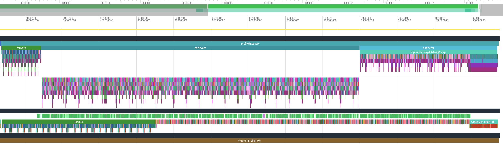
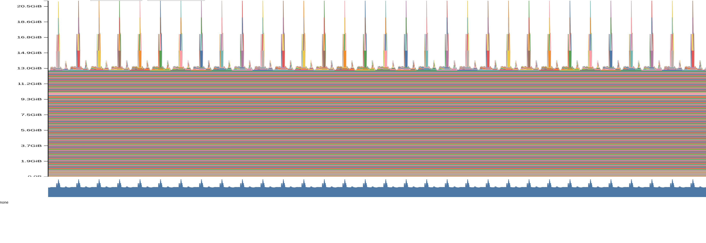
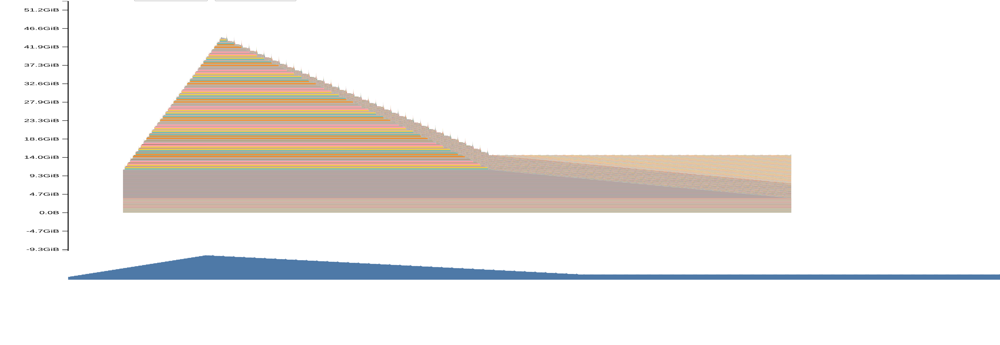

# A2-P：Profiling 与性能分析

> 本报告和同目录代码、汇总、图片公开可见。完整 Chrome trace 与 memory snapshot 体积较大，仅在本地保留，不进入公开仓库。

正式要求见 [`assignments/A2-P/README.md`](../../../../assignments/A2-P/README.md)，评分说明见 [`assignments/A2-P/EVALUATION.md`](../../../../assignments/A2-P/EVALUATION.md)。

## 基本信息

- 作业题面版本：`26.1.4-rc.3`
- 完成范围：A2-P 全部五个小题，包括 end-to-end benchmark、六组 compute profile、mixed-precision accumulation、BF16 autocast benchmark 与 memory profiling
- 未完成项：无
- 上游 starter commit：[`ca8bc81a59b70516f7ebb2da4808daade877c736`](https://github.com/stanford-cs336/assignment2-systems/commit/ca8bc81a59b70516f7ebb2da4808daade877c736)
- 组织内操作指南：[CS336 Assignment 2 Systems：Profiling（性能分析）实验指南](https://acnc6zeentra.feishu.cn/docx/D3omdgl6NocdKNxNvc5cW7KJnHd)

## 环境与工具

| 项目 | 公开、脱敏的信息 |
| --- | --- |
| GPU | NVIDIA GeForce RTX 4090，device-reported memory 48519 MiB，compute capability 8.9 |
| Driver / CUDA / cuDNN | Driver 570.124.06，CUDA runtime 12.8，cuDNN 91900 |
| Python / PyTorch | Python 3.12.3，PyTorch 2.11.0+cu128 |
| Compute profiler | `torch.profiler`，CPU 与 CUDA activities；Perfetto 查看 Chrome trace |
| Memory profiler | PyTorch CUDA memory history；PyTorch Memory Visualizer |
| 其他限制 | 未使用 Nsight Systems；10B 配置在模型搬到 GPU 时 OOM |

## 1. End-to-End Benchmark

### 1.1 配置与计时边界

统一配置为 small 模型（`d_model=768`、`d_ff=3072`、12 层、12 头）、vocabulary size 10000、batch size 4、context length 512、FP32、seed 0。运行与汇总命令为：

```bash
uv run python profiling/run_benchmarks.py --output-dir results/benchmark/final --model-size small --batch-size 4 --context-length 512 --steps 10 --dtype fp32 --seed 0 --learning-rate 0.001 --device cuda
uv run python profiling/summarize.py --input-dir results/benchmark/final --output results/benchmark/final.csv
```

计时器使用 `timeit.default_timer()`。模型、optimizer、输入和 targets 均在计时前创建；每个 measured step 在启动计时前和停止计时前分别调用 `torch.cuda.synchronize()`，因此测量的是 GPU 已完成该 step 后的 wall-clock latency。`forward` 在 `torch.no_grad()` 下只包含模型前向；`forward_backward` 每步先以 `zero_grad(set_to_none=True)` 清梯度，再包含 forward、cross entropy 和 backward；`train_step` 还包含自身的 zero grad 与 optimizer step。正式配置先执行 5 个 warm-up step，再重置峰值显存统计并测量 10 次。

### 1.2 结果

完整行与原始样本见 [`results/benchmark.csv`](results/benchmark.csv)。

| Mode | Warm-up | Mean ms | Sample stdev ms | CV | Peak allocated MiB | Peak reserved MiB |
| --- | ---: | ---: | ---: | ---: | ---: | ---: |
| `forward` | 5 | 24.597 | 0.073 | 0.298% | 728.702 | 894 |
| `forward_backward` | 5 | 81.297 | 0.195 | 0.240% | 4157.589 | 4288 |
| `train_step` | 5 | 91.332 | 0.143 | 0.157% | 5156.439 | 5524 |
| `train_step` | 0 | 126.197 | 109.967 | 87.139% | 5152.533 | 5524 |

原始 timing（ms）：

```text
forward, w5: 24.795, 24.604, 24.613, 24.589, 24.581, 24.574, 24.552, 24.536, 24.564, 24.562
forward_backward, w5: 81.136, 81.170, 81.652, 81.295, 81.177, 81.291, 81.652, 81.204, 81.150, 81.241
train_step, w5: 91.015, 91.158, 91.347, 91.309, 91.499, 91.373, 91.385, 91.425, 91.384, 91.428
train_step, w0: 439.166, 92.152, 91.105, 91.154, 91.456, 91.123, 91.309, 91.265, 91.682, 91.557
```

### 1.3 分析

`forward_backward` 比 `forward` 多出 loss 和 autograd backward；`train_step` 再多出梯度清理和参数更新，因此三者的计时边界逐级扩大。它们运行于独立进程，不能把均值之差当成某阶段的严格独立计时，但差值仍与后续 trace 中的阶段占比一致。

没有 warm-up 时，第一步达到 439.166 ms，是稳定 `train_step` 均值的 4.81 倍；它将 w0 均值提高到 w5 的 1.382 倍，并使 CV 从 0.157% 上升至 87.139%。第一步除了正常训练计算，还承担 CUDA library/kernel 的首次使用、caching allocator 扩容以及 Adam moment 的 lazy initialization。完成 warm-up 后，十个样本均稳定在约 91 ms，说明正式比较必须排除冷启动。

## 2. Compute Profiling

### 2.1 六个 `train_step` trace

六个配置均使用 batch size 4、FP32、seed 0 和 5 个 warm-up step。每个独立进程先完成普通 warm-up，再在 `torch.profiler` 中捕获一个 `profile/warmup` step 与一个稳定的 `profile/measure` step；汇总只分析后者。模型阶段标记为 `zero_grad`、`forward`、`loss`、`backward`、`optimizer`，attention 子阶段标记为 `attention/scores`、`attention/softmax`、`attention/value`。

```bash
uv run python profiling/run_compute_profiles.py --output-dir results/profiler/final --batch-size 4 --warmup 5 --seed 0 --learning-rate 0.001
uv run python profiling/summarize_compute_profiles.py --input-dir results/profiler/final --profiles-csv results/profiler/final/trace_summary.csv --attention-csv results/profiler/final/attention_summary.csv --markdown results/profiler/final/compute_summary.md
```

运行配置、命令和保留的 trace 文件名见 [`results/profile/run_metadata.json`](results/profile/run_metadata.json)，逐阶段数据见 [`results/profile/trace_summary.csv`](results/profile/trace_summary.csv)，attention 子阶段见 [`results/profile/attention_summary.csv`](results/profile/attention_summary.csv)。

| Model | Context | CPU span ms | CUDA kernel span ms | Kernel calls | Kernel cumulative ms | Matmul share |
| --- | ---: | ---: | ---: | ---: | ---: | ---: |
| small | 256 | 105.317 | 104.908 | 3691 | 41.686 | 53.46% |
| small | 512 | 107.924 | 106.891 | 3655 | 87.286 | 48.87% |
| small | 1024 | 239.051 | 238.532 | 3658 | 232.806 | 38.21% |
| medium | 256 | 199.355 | 198.400 | 7207 | 118.417 | 51.28% |
| medium | 512 | 270.160 | 269.464 | 7207 | 257.326 | 47.38% |
| medium | 1024 | 668.430 | 666.515 | 7210 | 653.559 | 40.95% |

`CPU span` 是 CPU annotation 的 wall-clock 区间；`CUDA kernel span` 是第一个到最后一个相关 kernel 的跨度；`Kernel cumulative` 是逐 kernel duration 求和。CUDA 异步提交与不同 stream 的重叠意味着这些列不能直接相加，也不能与未启用 profiler 的 benchmark latency 混作同一口径。

### 2.2 代表性时间线与阶段归因



代表性配置选择 medium、context 1024：

| Phase | CPU span ms | CUDA kernel span ms | Kernel calls | Kernel cumulative ms | Matmul share |
| --- | ---: | ---: | ---: | ---: | ---: |
| `train_step` | 668.430 | 666.515 | 7210 | 653.559 | 40.95% |
| `zero_grad` | 0.426 | 0.000 | 0 | 0.000 | 0.00% |
| `forward` | 52.710 | 205.983 | 1256 | 204.273 | 49.98% |
| `loss` | 0.352 | 1.777 | 9 | 1.772 | 0.00% |
| `backward` | 427.441 | 420.150 | 2441 | 416.518 | 39.74% |
| `optimizer` | 185.191 | 38.603 | 3504 | 30.996 | 0.00% |

CPU annotation 上 backward 最长，其次 optimizer，forward 最短；按 CUDA kernel cumulative time 则是 backward、forward、optimizer。forward 的 CPU 线程较快完成 kernel 提交，而相关 kernel 继续在 GPU 上执行，所以其 CUDA span 可以长于 CPU span。optimizer 在 Python 侧逐参数调度 3504 个小型逐元素 kernel，没有矩阵乘法；大量 launch 与调度使 CPU span 很长，但 GPU cumulative time 只有 30.996 ms。反向传播同时包含矩阵乘法梯度和大量逐元素梯度 kernel，因此同时主导 CPU 与 GPU 时间。

在六个完整 step 中，matmul share 随 context 增长而下降。例如 small 从 53.46% 降至 38.21%，medium 从 51.28% 降至 40.95%。模型宽度固定时，线性投影和 FFN 的主要成本近似随 context 线性增长，而 attention score、softmax 和 value mixing 具有二次增长项，因此较长 context 会把占比推向 attention 与逐元素/reduction kernel。

### 2.3 Attention 子阶段

| Model | Context | Scores cumulative ms | Softmax cumulative ms | Value cumulative ms | Softmax / scores | Softmax / value |
| --- | ---: | ---: | ---: | ---: | ---: | ---: |
| small | 256 | 0.175 | 0.455 | 0.363 | 2.60 | 1.25 |
| small | 512 | 0.583 | 2.724 | 1.184 | 4.67 | 2.30 |
| small | 1024 | 2.849 | 20.997 | 4.164 | 7.37 | 5.04 |
| medium | 256 | 0.423 | 1.143 | 0.782 | 2.70 | 1.46 |
| medium | 512 | 1.639 | 11.439 | 2.824 | 6.98 | 4.05 |
| medium | 1024 | 7.798 | 55.863 | 10.456 | 7.16 | 5.34 |

scores 与 value 都能落到高度优化的 GEMM kernel。相较之下，当前自写 softmax 会拆成 max/reduction、减法、exp、求和和除法等多个 kernel；每个 kernel 都要重新读写较大的 `B × H × T × T` 张量，算术强度低且要承受多次 launch，因而更受显存带宽和启动开销限制。在 context 1024 时，softmax 的累计 kernel 时间已经约为 scores 的 7 倍，也解释了长 context 下 matmul share 的下降。

### 2.4 工具边界

`torch.profiler` 提供框架 operator、`record_function` annotation、CPU activity 和 CUDA kernel activity；导出的 Chrome trace 可在 Perfetto 中沿 CPU thread 和 CUDA stream 观察异步提交与执行。阶段归因通过 trace 中的 external correlation id 将 CUDA kernel 映射回 CPU operator。它不提供 Nsight Systems 完整的 CUDA API、OS runtime 与系统级队列证据，因此报告只使用 profiler 确实采集到的 operator、annotation 和 kernel 数据，不伪造 nsys 专属字段。profiler 本身还会增加记账、同步和 trace 序列化开销，所以这里关注相对归因，而正式 latency 使用第一节的轻量 benchmark。

## 3. Mixed Precision

### 3.1 四种累加实验

数学上的精确结果为 10。固定实验的实际输出为：

| 输入 / accumulator | 实际输出 |
| --- | ---: |
| FP32 输入，FP32 accumulator | 10.0010 |
| FP16 输入，FP16 accumulator | 9.9531 |
| FP16 输入，FP32 accumulator | 10.0021 |
| FP16 输入先 cast 回 FP32，FP32 accumulator | 10.0021 |

FP16 accumulator 在每次加法后都以较少尾数位舍入，中间误差会持续累积，因此第二种写法误差最大。FP32 accumulator 消除了低精度累加过程，但 FP16 输入在进入 accumulator 前已经把 `0.01` 量化；把这个已量化值重新 cast 成 FP32 只会扩大表示位宽，无法恢复丢失的信息，所以最后两种写法相同且仍不等于数学精确值。

### 3.2 ToyModel BF16 autocast

实际 dtype：

| 位置 | Dtype |
| --- | --- |
| 参数 | FP32 |
| 第一层 Linear 输出 | BF16 |
| LayerNorm 输出 | FP32 |
| logits | BF16 |
| loss | FP32 |
| 参数 gradient | FP32 |

Autocast 将适合 Tensor Core 的 Linear 输出降为 BF16，但让数值敏感的 LayerNorm/reduction 和 loss 保持 FP32；参数仍是 FP32，因此累加进 `.grad` 的梯度也回到 FP32。BF16 与 FP16 同为 16 bit，但 BF16 保留与 FP32 相同数量的指数位，动态范围更适合训练；代价是更少的尾数精度。

### 3.3 FP32 与 BF16 benchmark

完整样本见 [`results/mixed_precision.csv`](results/mixed_precision.csv)，结构化结论与 ToyModel dtype 见 [`results/mixed_precision.json`](results/mixed_precision.json)。所有配置均为 batch size 4、context 512、`forward_backward`、5 个 warm-up 与 10 个 measured step。

| Model | FP32 mean ms | BF16 mean ms | Speedup | FP32 peak allocated MiB | BF16 peak allocated MiB | Allocated reduction | Absolute loss delta |
| --- | ---: | ---: | ---: | ---: | ---: | ---: | ---: |
| small | 81.220 | 49.788 | 1.63× | 4157.589 | 3319.231 | 20.16% | 0.000118 |
| medium | 233.288 | 124.601 | 1.87× | 10817.333 | 8624.044 | 20.28% | 0.000088 |
| large | 518.786 | 266.960 | 1.94× | 20751.404 | 17000.875 | 18.07% | 0.000082 |
| XL | 1292.760 | 649.584 | 1.99× | 41118.367 | 38182.804 | 7.14% | 0.000108 |

模型变大后 GEMM 在总工作中的占比增大，固定的 Python、launch 和非 Tensor-Core 运算占比下降，因此 BF16 speedup 从 1.63× 接近 1.99×。显存不会减半，因为参数和 gradient 仍为 FP32，只有 autocast 覆盖的中间激活与矩阵输入降为 BF16；XL 的 persistent FP32 部分最大，所以 peak allocated 只下降 7.14%。`reserved` 是 caching allocator 持有的 segment，不等同于 live tensor；XL BF16 的 peak reserved 为 44322 MiB，反而高于 FP32 的 42512 MiB，不能据此否定 allocated 的下降。四组初始 loss 的绝对差都低于 `1.2e-4`，符合 BF16 舍入带来的小幅数值扰动。

10B 配置有 12,832,823,808 个参数，单独的 FP32 参数理论上约需 47.806 GiB；在可用容量和 runtime overhead 计入后，模型在 `model.to(device)` 阶段即 OOM。因此没有把静默缩小的模型标成 10B，也没有报告虚构的 timing。

## 4. Memory Profiling

### 4.1 测量方法

每个 case 在独立进程中执行 1 个 warm-up step，随后 `zero_grad(set_to_none=True)`、同步并重置 peak stats，再开启 PyTorch CUDA memory history，捕获 1 个 measured step 并写出独立 snapshot。OOM case 仍保存失败阶段、异常类型和进程截至失败时的显存摘要。

```bash
uv run python profiling/run_memory_profiles.py --suite primary --output-dir results/memory/formal --warmup 1 --max-entries 1000000 --seed 0 --learning-rate 0.001
uv run python profiling/run_memory_profiles.py --suite fallback --output-dir results/memory/formal --warmup 1 --max-entries 1000000 --seed 0 --learning-rate 0.001
uv run python profiling/summarize_memory.py --input-dir results/memory/formal --output results/memory/formal.csv
```

完整轻量数据见 [`results/memory/peaks.csv`](results/memory/peaks.csv)，采集口径与 case 状态见 [`results/memory/run_metadata.json`](results/memory/run_metadata.json)。`active` 表示 caching allocator 中仍活跃的 block，`allocated` 表示 PyTorch tensor 当前占用的 bytes，`reserved` 表示 allocator 已向 CUDA 申请且仍保留的 segment；reserved 包含当前未被 tensor 使用但可复用的缓存，因此通常不小于 allocated。

### 4.2 XL 主矩阵

| Context | Mode | Dtype | Status | Current active MiB | Peak active MiB | Peak allocated MiB | Peak reserved MiB |
| ---: | --- | --- | --- | ---: | ---: | ---: | ---: |
| 128 | `forward` | FP32 | ok | 13132.807 | 13217.807 | 13217.807 | 13246 |
| 128 | `forward` | BF16 | ok | 19604.135 | 19604.135 | 19604.135 | 19848 |
| 128 | `train_step` | FP32 | OOM in warm-up | 47334.582 | 47654.583 | 47654.583 | 47972 |
| 128 | `train_step` | BF16 | OOM in warm-up | 47334.582 | 47744.348 | 47744.348 | 48000 |
| 2048 | `forward` | FP32 | ok | 13133.510 | 21810.525 | 21810.525 | 24028 |
| 2048 | `forward` | BF16 | ok | 25961.025 | 25961.025 | 25961.025 | 28118 |
| 2048 | `train_step` | FP32 | OOM in warm-up | 13133.510 | 45776.807 | 45776.807 | 46640 |
| 2048 | `train_step` | BF16 | OOM in warm-up | 13133.510 | 46470.432 | 46470.432 | 46764 |

成功 case 的峰值统计只覆盖 warm-up 后的 measurement；OOM 在 warm-up 内发生，表中对应数值是进程截至失败时的 `process_until_failure` 统计，不能与成功 measurement 当作完全相同的口径。

XL 的 FP32 forward 在 context 128 只有 13217.807 MiB peak allocated，而 context 2048 达到 21810.525 MiB。BF16 forward 的峰值反而更高：autocast 保留 FP32 master parameters，同时在 forward 内缓存 BF16 parameter copies；context 2048 虽能缩小部分 activation，但附加的低精度权重副本仍使 peak allocated 达到 25961.025 MiB。混合精度是否节省显存取决于 measurement mode、persistent state 和 cache 生命周期，不能只按 element size 推断为二分之一。

### 4.3 Fallback

题面规定的 XL、batch size 1、context 2048 仍 OOM，因此继续尝试 XL/context 1024；两种 dtype 仍在 warm-up OOM。最终按规定使用 Large、batch size 1、context 2048，FP32 与 BF16 均成功完成 train step 和 snapshot。

| Model | Batch | Context | Dtype | Status | Peak allocated MiB | Peak reserved MiB |
| --- | ---: | ---: | --- | --- | ---: | ---: |
| XL | 1 | 2048 | FP32 | OOM in warm-up | 47369.502 | 47636 |
| XL | 1 | 2048 | BF16 | OOM in warm-up | 47423.205 | 47702 |
| XL | 1 | 1024 | FP32 | OOM in warm-up | 47373.793 | 47982 |
| XL | 1 | 1024 | BF16 | OOM in warm-up | 46854.137 | 48032 |
| Large | 1 | 2048 | FP32 | ok | 46496.447 | 47188 |
| Large | 1 | 2048 | BF16 | ok | 38627.197 | 39368 |

在可完成的 Large fallback 上，BF16 将 peak allocated 降低 16.92%，同时初始 loss 只从 8.531733 变为 8.532152。

### 4.4 Forward timeline 与最大 allocation



forward 不需要为 backward 保留整条激活链，因此 timeline 以约 13 GiB 的参数基线为主，在每层 attention 临时出现相似峰值，完成后回落。对 XL、batch 4、32 heads、context 2048 的 FP32 attention matrix：

```text
B × H × T × T × 4 bytes
= 4 × 32 × 2048 × 2048 × 4
= 2,147,483,648 bytes
= 2048 MiB
```

Memory Visualizer 中最大的单次 allocation 正是 2 GiB，stack trace 落在 `scaled_dot_product_attention`。同一配置的一份 residual stream 为：

```text
B × T × d_model × 4 bytes
= 4 × 2048 × 2560 × 4
= 83,886,080 bytes
= 80 MiB
```

attention matrix 是 residual stream 的 25.6 倍，并随 context 按平方增长；这解释了 context 2048 forward 中逐层尖峰远高于其余线性大小的激活。

### 4.5 Train-step timeline、saved activation 与 gradient



Large fallback 的 timeline 先随 36 层 forward 持续保存 backward 所需 activation，形成上升斜坡；进入 backward 后，从最后一层向前逐层释放 saved activation，形成下降斜坡。该配置的 attention matrix 理论大小为：

```text
1 × 20 × 2048 × 2048 × 4 bytes = 335,544,320 bytes = 320 MiB
```

这与 Visualizer 中最大的单次 allocation 一致。与 forward-only 不同，train step 的显存不会在 backward 结束后回到最初基线：activation 被释放的同时，各参数的 FP32 gradient 首次产生并保留在 `.grad` 中，而 `optimizer.step()` 不负责清空 gradient。warm-up 还使 Adam 的两个 moment state 已经存在；optimizer 更新期间旧 moment、更新后的 moment 与逐元素临时量发生释放和分配，persistent optimizer state 的净大小基本不变，但 timeline 会显示一部分 allocation 减少、另一部分增加。下一个 step 的 `zero_grad(set_to_none=True)` 才会释放这些 gradient tensor。

## 5. 限制与复现

- 计算 profile 使用 `torch.profiler` 而非 Nsight Systems，因此没有系统级 CUDA API 与 OS runtime 证据。
- Profiler trace 和 memory history 都有观察开销；正式 latency 只取自不开 profiler 的 benchmark。
- 六个完整 Chrome trace、成功 snapshot 和 OOM 诊断仅在本地保留，公开仓库只提交轻量 CSV/JSON 与三张关键截图。
- XL train step 在 batch size 1、context 2048 和 1024 均 OOM，报告按题面保留失败配置并使用 Large/context 2048 fallback。
- 10B 模型在参数搬到 GPU 时 OOM，未产生 timing。

最小复现顺序：

```bash
uv run python profiling/run_benchmarks.py --output-dir results/benchmark/reproduction
uv run python profiling/run_compute_profiles.py --output-dir results/profiler/reproduction
uv run python profiling/run_memory_profiles.py --suite primary --output-dir results/memory/reproduction
uv run python profiling/run_memory_profiles.py --suite fallback --output-dir results/memory/reproduction
```

## 组织内补充材料

无。本作业的实验配置、轻量结果、分析与脱敏截图均适合公开，README 已包含完整报告，因此不另建与 README 重复的飞书补充文档。

## 自检

- [x] 本提交只包含本人本次 A2-P 的文件。
- [x] `README.md` 是 Markdown 主报告，所有图片使用相对路径和有意义的 alt text。
- [x] 每个关键数字都能回到命令、`results/` metadata 或截图。
- [x] 仓库外源码引用使用固定 commit 的 GitHub HTTPS 绝对 URL，未写入本机绝对路径或 `file://`。
- [x] 已用 `torch.profiler` 完成六个 `train_step` trace，并提交轻量汇总。
- [x] 已准备 1 张 Compute Profile 关键图和 2 张 Memory Timeline。
- [x] 未提交完整 trace、snapshot、权重、数据、压缩包或依赖环境。
- [x] Compute Profile 截图不含内部主机名、IP、账号、路径、UUID、进程或凭据。
- [x] 本作业没有仅限组织内的差量材料，无需另建重复的飞书补充文档。
