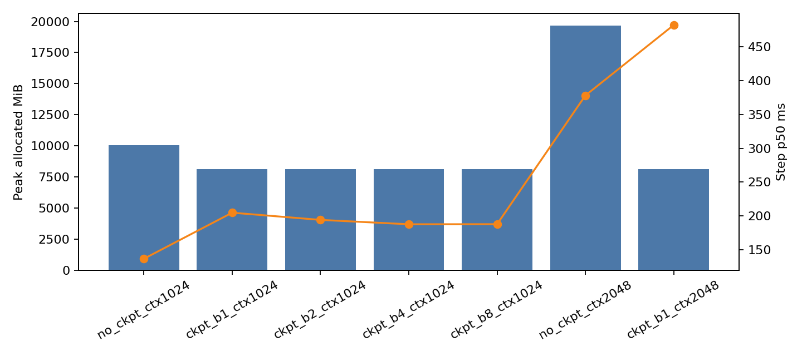
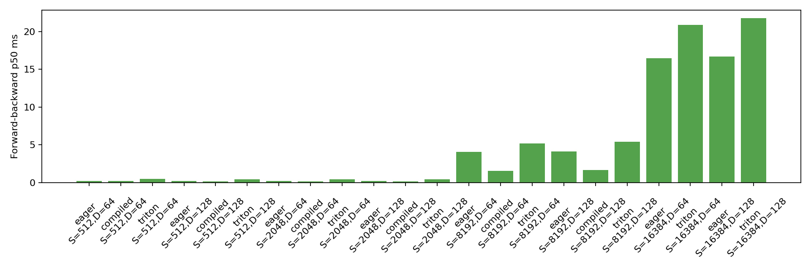

# A2-K 公开提交：王扬


## 基本信息

- 作业题面版本：`26.1.4-k-rc.3`
- 完成范围：Activation checkpointing 理论分析与 benchmark、显式 PyTorch attention 基线、`torch.compile` 对照、纯 PyTorch tiled FlashAttention 参考实现、学生 Triton FlashAttention-2 forward、重计算式 backward、官方 GPU tests、扩展正确性矩阵、固定性能矩阵、16K 长序列边界实验、24 GiB 显存可复现性证据、结果图表。
- 未完成项：无
- 上游 starter commit：`ca8bc81a59b70516f7ebb2da4808daade877c736`
- 本地工作仓库：`../assignment2-systems`

完成范围明细：

| 模块 | 状态 | 证据 | 备注 |
| --- | --- | --- | --- |
| Activation checkpointing 理论分析 | done | Section 1 | 非嵌套 block checkpoint |
| Activation checkpointing benchmark | done | `results/checkpointing.csv` | 7/7 rows `ok` |
| 显式 PyTorch attention 基线 | done | `results/attention_baseline.csv` | 18/18 rows `ok` |
| `torch.compile` 对照 | done | `results/compile_comparison.csv` | 12/12 rows `ok` |
| 纯 PyTorch tiled FlashAttention 参考实现 | done | `submission/cs336_systems/a2k/attention.py` | 官方测试通过 |
| 学生 Triton FlashAttention-2 forward | done | `submission/cs336_systems/a2k/attention.py` | 官方 CUDA 测试通过 |
| 重计算式 backward | done | `results/correctness.json` | PyTorch/Triton autograd path 均接入 |
| 官方 GPU tests | done | `results/unit_tests.txt` | 6 passed, 0 failed, 0 skipped |
| 扩展正确性矩阵 | done | `results/correctness.json` | 36/36 rows `pass` |
| 固定性能矩阵 | done | `results/flash_benchmark.csv` | 66/66 rows `ok` |
| 16K 长序列边界实验 | done | `results/flash_benchmark.csv` | eager/Triton 均完成 |
| 24 GiB 显存可复现性证据 | done | `results/memory_evidence.json` | `within_24gib=true` |
| 图表 | done | `assets/*.png` | 2 张图均由 CSV 生成 |

## 环境与工具

正式结果来自单张 NVIDIA GeForce RTX 4090，并在每个正式实验进程的首次 CUDA allocation 前设置 PyTorch allocator 上限 `23552 MiB`。结果文件中的 GPU 总显存为 `49140 MiB`，正式可复现性以相同 23 GiB allocator budget 约束为准。

来源文件：`results/run_metadata.json`

| 项目 | 公开、脱敏的信息 |
| --- | --- |
| GPU | NVIDIA GeForce RTX 4090 24GB |
| 开跑前显存 | total `49140 MiB` by `nvidia-smi`; free `48077 MiB` |
| Driver / CUDA | Driver `570.124.06`; CUDA `12.8` |
| PyTorch | `2.10.0+cu128` |
| Triton | `3.6.0` |
| power limit / P-state | `450.00 W` / `P0`，使用默认设置 |
| TF32 | performance: matmul `true`, cuDNN `true`; FP32 correctness 至少包含关闭 TF32 的配置 |
| compile 配置 | backend `inductor`；cold compile 与 steady-state 分开测量 |
| allocator limit / fraction | 23552 MiB / `0.4854174583443363` |
| 其他限制 | Seed `0`；attention 使用 `triton.testing.do_bench` 或 CUDA events；attention warm-up `100 ms`、rep `300 ms`；checkpoint warm-up steps `3`、measurement steps `5` |

正式运行约束检查：

| 约束 | 状态 | 证据 |
| --- | --- | --- |
| 一个进程只使用一张物理 GPU | met | 上游工作仓库 `student_scripts/a2k/run_all_formal.sh` 串行执行 |
| 未使用多卡、CPU/NVMe offload 或远程推理服务 | met | 脚本仅使用本地 CUDA device 0 |
| checkpoint、compile、correctness 和 attention benchmark 使用新 Python 进程 | met | `results/run_metadata.json` commands |
| 正式矩阵串行执行，没有并发运行 | met | 上游工作仓库 `student_scripts/a2k/run_all_formal.sh` |
| 正式运行前可用显存不少于 22 GiB | met | 48077 MiB free |
| 首次 CUDA allocation 前设置 allocator 上限 | met | `submission/student_scripts/a2k/common.py::set_allocator_limit` |
| 性能矩阵使用 BF16 | met | `results/attention_baseline.csv`, `results/flash_benchmark.csv` |
| 至少一个正确性配置使用 FP32 | met | `results/correctness.json` seed 0, head_dim 32 |

代码组织：

| 路径 | 用途 |
| --- | --- |
| `submission/cs336_systems/a2k/attention.py` | 显式 attention、PyTorch tiled FlashAttention、Triton forward、重计算 backward |
| `submission/tests/adapters.py` | 将官方 tests 连接到学生实现 |
| `submission/student_scripts/a2k/*.py` | correctness、benchmark、metadata、memory summary、figure 脚本 |
| 上游工作仓库 `student_scripts/a2k/run_all_formal.sh` | 服务器一键正式运行脚本；`.sh` 不属于同步脚本提交范围 |

Adapter 自证：

| 检查项 | 状态 |
| --- | --- |
| `get_flashattention_autograd_function_pytorch` 返回学生 PyTorch tiled 实现类 | met |
| `get_flashattention_autograd_function_triton` 返回学生 Triton autograd 实现类 | met |
| Adapter 未 skip、mock 或包装已有 fused attention 实现 | met |
| 未修改公共 `tests/test_attention.py` 降低要求 | met |
| 正式 GPU tests 未使用 `TRITON_INTERPRET=1` | met |

## 1. Activation Checkpointing

### 理论与代码骨架

对 `N` 个相同 Transformer block 的序列，我采用非嵌套 block checkpoint。将连续 block 切成长度为 `B` 的区间，只保存每个区间入口 activation；区间内部 activation 不跨 forward 保存。Backward 到某个区间时，从该区间入口 activation 开始重跑该区间 forward，重新生成反向需要的中间 activation，再执行该区间 backward。

在忽略参数、optimizer state 和单层内部临时张量差异时：

| 问题 | 回答 |
| --- | --- |
| Checkpoint 放置方式 | 保存每个 block group 的边界 activation；本实验不嵌套 |
| 重计算区间 | backward 时对当前 group 内最多 `B` 层重新 forward |
| 峰值 activation memory 渐近复杂度 | `O(N/B + B)` 个 layer-scale activation |
| 总计算量渐近复杂度 | forward 约 `N`，backward 额外重算约 `N`，总量仍为 `O(N)` 但常数增大 |
| 峰值出现位置 | backward 重计算当前 group 并保留边界 activation 时 |

伪代码：

```python
def checkpointed_transformer(x, blocks, block_size):
    for start in range(0, len(blocks), block_size):
        end = min(start + block_size, len(blocks))
        def run_group(y, s=start, e=end):
            for block in blocks[s:e]:
                y = block(y)
            return y
        x = checkpoint(run_group, x, use_reentrant=False)
    return x
```

### 固定实验

来源文件：`results/checkpointing.csv`

配置：Stanford medium，24 层，batch size 1，BF16 autocast，FP32 参数，AdamW，3 个 warm-up step，5 个 measurement step。

| config_id | context_length | block size | p50 ms | peak allocated MiB | peak reserved MiB | status |
| --- | ---: | --- | ---: | ---: | ---: | --- |
| `no_ckpt_ctx1024` | 1024 | none | 136.92 | 10066.1 | 10172.0 | ok |
| `ckpt_b1_ctx1024` | 1024 | 1 | 204.90 | 8116.9 | 10172.0 | ok |
| `ckpt_b2_ctx1024` | 1024 | 2 | 194.26 | 8116.9 | 10172.0 | ok |
| `ckpt_b4_ctx1024` | 1024 | 4 | 187.80 | 8116.9 | 10172.0 | ok |
| `ckpt_b8_ctx1024` | 1024 | 8 | 187.92 | 8116.9 | 10172.0 | ok |
| `no_ckpt_ctx2048` | 2048 | none | 377.92 | 19665.1 | 20668.0 | ok |
| `ckpt_b1_ctx2048` | 2048 | 1 | 481.87 | 8137.1 | 20668.0 | ok |

### 分析

在 context length 1024 下，checkpoint 将 peak allocated 从 `10066.1 MiB` 降到 `8116.9 MiB`，约减少 `19.37%`，但 p50 step time 从 `136.92 ms` 增加到 `187.80-204.90 ms`。block size 1、2、4、8 在本实现里 peak allocated 相同，说明峰值不只由 checkpoint 数量决定，还受单个 Transformer block 内 attention/MLP 临时张量、allocator 缓存和 backward 重计算时刻影响。2048 边界下 no checkpoint 仍可运行，但 peak allocated 达到 `19665.1 MiB`；checkpoint block size 1 将其降到 `8137.1 MiB`，代价是 p50 从 `377.92 ms` 增加到 `481.87 ms`。

## 2. PyTorch Attention 与 `torch.compile`

### 显式 PyTorch 基线

实现位于 `submission/cs336_systems/a2k/attention.py::explicit_attention`。该实现显式执行 `QK^T`、scale、causal mask、softmax 和 `PV`，未调用 `torch.nn.functional.scaled_dot_product_attention`、flash-attn、xFormers 或其他 fused attention API。输入分配和随机生成不计入测量区间。

来源文件：`results/attention_baseline.csv`

| sequence | head dim | phase | p50 ms | peak allocated MiB | peak reserved MiB | status |
| ---: | ---: | --- | ---: | ---: | ---: | --- |
| 512 | 64 | forward | 0.0276 | 265.9 | 278.0 | ok |
| 512 | 64 | backward | 0.2785 | 18.9 | 280.0 | ok |
| 512 | 64 | forward-backward | 0.2171 | 274.9 | 280.0 | ok |
| 512 | 128 | forward | 0.0276 | 274.4 | 280.0 | ok |
| 512 | 128 | backward | 0.3042 | 19.2 | 280.0 | ok |
| 512 | 128 | forward-backward | 0.2202 | 275.2 | 280.0 | ok |
| 2048 | 64 | forward | 0.0811 | 297.5 | 320.0 | ok |
| 2048 | 64 | backward | 0.2755 | 53.8 | 320.0 | ok |
| 2048 | 64 | forward-backward | 0.2232 | 309.8 | 320.0 | ok |
| 2048 | 128 | forward | 0.0853 | 298.8 | 320.0 | ok |
| 2048 | 128 | backward | 0.2734 | 55.2 | 322.0 | ok |
| 2048 | 128 | forward-backward | 0.2204 | 311.2 | 322.0 | ok |
| 8192 | 64 | forward | 1.7531 | 661.4 | 706.0 | ok |
| 8192 | 64 | backward | 2.3795 | 598.2 | 710.0 | ok |
| 8192 | 64 | forward-backward | 4.0735 | 854.2 | 966.0 | ok |
| 8192 | 128 | forward | 1.7848 | 666.4 | 966.0 | ok |
| 8192 | 128 | backward | 2.4310 | 604.2 | 966.0 | ok |
| 8192 | 128 | forward-backward | 4.1554 | 860.2 | 966.0 | ok |

显式 attention 需要物化 score/probability 矩阵，因此随 sequence length 增大，forward-backward 的 p50 和 peak allocated 明显上升。8192 长度下 forward-backward 达到约 `4.07-4.16 ms`，peak allocated 约 `854-860 MiB`。

### Compile 对照

来源文件：`results/compile_comparison.csv`

| kind | workload | sequence | head dim | impl | cold ms | steady p50 ms | peak allocated MiB | peak reserved MiB | status |
| --- | --- | ---: | --- | --- | ---: | ---: | ---: | ---: | --- |
| attention | forward-backward | 512 | 64 | eager | NA | 0.453 | 18.9 | 24.0 | ok |
| attention | forward-backward | 512 | 64 | compiled | 870.56 | 0.430 | 17.6 | 24.0 | ok |
| attention | forward-backward | 2048 | 128 | eager | NA | 0.466 | 55.2 | 66.0 | ok |
| attention | forward-backward | 2048 | 128 | compiled | 505.29 | 0.447 | 115.2 | 138.0 | ok |
| attention | forward-backward | 8192 | 128 | eager | NA | 4.162 | 604.2 | 778.0 | ok |
| attention | forward-backward | 8192 | 128 | compiled | 1.81 | 1.730 | 284.2 | 778.0 | ok |
| small_model | forward | 512 | NA | eager | NA | 17.184 | 1320.9 | 1362.0 | ok |
| small_model | forward | 512 | NA | compiled | 15213.78 | 4.870 | 1117.3 | 1362.0 | ok |
| small_model | forward-backward | 512 | NA | eager | NA | 47.346 | 1392.4 | 1462.0 | ok |
| small_model | forward-backward | 512 | NA | compiled | 634.02 | 13.788 | 1148.2 | 1462.0 | ok |
| small_model | full training step | 512 | NA | eager | NA | 58.943 | 2496.1 | 2802.0 | ok |
| small_model | full training step | 512 | NA | compiled | 30.87 | 25.219 | 2489.1 | 2802.0 | ok |

分析：compiled attention 在小 shape 上收益有限，8192/128 上 steady-state p50 从 `4.162 ms` 降到 `1.730 ms`。small model 上 compiled forward 和 forward-backward 收益明显，但首次 compile/cold-start 可能很高，例如 small model forward cold compile 为 `15213.78 ms`。运行中 Inductor 对部分 softmax/reduction 输出过 online softmax 未启用的 warning，这说明 compiled baseline 不等同于学生 FlashAttention kernel；它的优化受 graph break、shape specialization、reduction lowering 和 compile cache 状态影响。

## 3. FlashAttention-2 Forward

### Pure PyTorch tiled reference

`FlashAttentionPyTorchFunction` 使用 tile-by-tile online softmax。Forward 保存 `Q`、`K`、`V`、`O` 和唯一一个 shape 为 `[batch, n_queries]` 的 LSE `L`。该实现不调用 Triton，用于逐 tile 调试和反向参考。

| 设计点 | 说明 |
| --- | --- |
| Autograd function | `FlashAttentionPyTorchFunction` |
| Adapter entry | `submission/tests/adapters.py::get_flashattention_autograd_function_pytorch` |
| Query tile size | 32 |
| Key/value tile size | 64 |
| Saved tensors | `Q`, `K`, `V`, `O`, `L` |
| LSE shape | `[batch, n_queries]` |
| Causal support | yes |
| Non-causal support | yes |

### Triton kernel

`FlashAttentionTritonFunction` 调用学生 `@triton.jit` kernel。每个 program instance 负责一个 query tile，kernel 内循环 K/V tile，使用 FP32 accumulator 和 FP32 online softmax state。Triton dot 对 FP32 正确性路径使用 `input_precision="ieee"`。

| 设计点 | 说明 |
| --- | --- |
| Triton kernel | `_flash_fwd_kernel` |
| Adapter entry | `submission/tests/adapters.py::get_flashattention_autograd_function_triton` |
| Program mapping | `(query tile, batch)` |
| Query block size | 16 |
| Key/value block size | 32 |
| Head dimensions tested | 32, 64, 128 |
| Warps | 4 |
| Stages | 3 |
| Accumulator dtype | FP32 |
| Online softmax state | per-row `m_i`, `l_i` |
| LSE output | `[batch, n_queries]`, FP32 |
| Causal/non-causal | both supported |

## 4. Backward 与正确性

### 重计算式 backward

Backward 使用 forward 保存的 `Q/K/V/O/L`，在 backward 中重计算 attention probabilities，再通过 PyTorch autograd 得到 `dQ/dK/dV`。这一路径同时接入 PyTorch tiled 和 Triton autograd function，支持 causal 与 non-causal。自定义 Triton backward 未作为必做项实现。

### 官方 GPU tests

来源文件：`results/unit_tests.txt`

命令：

```bash
uv run pytest tests/test_attention.py -v
```

| 指标 | 数量 |
| --- | ---: |
| Passed | 6 |
| Failed | 0 |
| Skipped | 0 |
| Total | 6 |

### 扩展正确性

来源文件：`results/correctness.json`

| implementation | rows | status | max output abs | max LSE abs | max dQ abs | max dK abs | max dV abs |
| --- | ---: | --- | ---: | ---: | ---: | ---: | ---: |
| pytorch | 18 | pass | 0.015625 | 0.027220 | 0.0 | 0.0 | 0.0 |
| triton | 18 | pass | 0.015625 | 0.027220 | 0.0 | 0.0 | 0.0 |

覆盖情况：

| 要求 | 状态 |
| --- | --- |
| 至少 3 个 random seed | met |
| Head dimension 32/64/128 | met |
| Causal 与 non-causal | met |
| Forward output `O` | met |
| Log-sum-exp `L` | met |
| `dQ/dK/dV` | met |
| 至少一个 FP32 配置 | met |

## 5. 性能矩阵

### 配置与命令

来源文件：`results/flash_benchmark.csv`

| 字段 | 值 |
| --- | --- |
| GPU | 单张 NVIDIA GeForce RTX 4090 24GB |
| 开跑前空闲显存 | 48077 MiB |
| Batch size | 1 |
| Dtype | BF16 |
| Causal | true |
| Core shapes | sequence 512/2048/8192, head dim 64/128 |
| Boundary shapes | sequence 16384, head dim 64/128 |
| Warm-up | 100 ms |
| Repetition | 300 ms |
| Quantiles | p20, p50, p80 |
| Allocator limit | 23552 MiB |

复现命令：

```bash
cd ../assignment2-systems
./student_scripts/a2k/run_all_formal.sh
```

Speedup 只在同 GPU、同 shape、同 dtype、同 causal 设置、同 phase 且两行都成功时计算。

### 结果与图

下表展示核心矩阵中的 forward-backward p50；完整 forward/backward/forward-backward 三 phase 明细见 `results/flash_benchmark.csv`。

| implementation | sequence | head dim | p50 ms | peak allocated MiB | speedup vs eager | status |
| --- | ---: | ---: | ---: | ---: | ---: | --- |
| eager | 512 | 64 | 0.201 | 274.9 | 1.000 | ok |
| compiled | 512 | 64 | 0.238 | 273.6 | 0.845 | ok |
| triton | 512 | 64 | 0.513 | 275.4 | 0.391 | ok |
| eager | 512 | 128 | 0.200 | 275.2 | 1.000 | ok |
| compiled | 512 | 128 | 0.183 | 274.0 | 1.090 | ok |
| triton | 512 | 128 | 0.446 | 275.9 | 0.448 | ok |
| eager | 2048 | 64 | 0.209 | 309.8 | 1.000 | ok |
| compiled | 2048 | 64 | 0.197 | 289.8 | 1.062 | ok |
| triton | 2048 | 64 | 0.456 | 318.0 | 0.458 | ok |
| eager | 2048 | 128 | 0.202 | 311.2 | 1.000 | ok |
| compiled | 2048 | 128 | 0.191 | 291.2 | 1.054 | ok |
| triton | 2048 | 128 | 0.453 | 319.8 | 0.446 | ok |
| eager | 8192 | 64 | 4.076 | 854.2 | 1.000 | ok |
| compiled | 8192 | 64 | 1.576 | 534.2 | 2.586 | ok |
| triton | 8192 | 64 | 5.191 | 983.3 | 0.785 | ok |
| eager | 8192 | 128 | 4.148 | 860.2 | 1.000 | ok |
| compiled | 8192 | 128 | 1.654 | 540.2 | 2.508 | ok |
| triton | 8192 | 128 | 5.442 | 990.3 | 0.762 | ok |

16K 长序列边界：

| implementation | head dim | phase | p50 ms | peak allocated MiB | peak reserved MiB | speedup vs eager | status |
| --- | ---: | --- | ---: | ---: | ---: | ---: | --- |
| eager | 64 | forward | 7.041 | 1818.5 | 2652.0 | 1.000 | ok |
| eager | 64 | backward | 9.558 | 2332.2 | 3676.0 | 1.000 | ok |
| eager | 64 | forward-backward | 16.486 | 2588.2 | 3676.0 | 1.000 | ok |
| triton | 64 | forward | 1.037 | 282.3 | 3676.0 | 6.788 | ok |
| triton | 64 | backward | 19.931 | 2846.3 | 4188.0 | 0.480 | ok |
| triton | 64 | forward-backward | 20.875 | 3102.3 | 4188.0 | 0.790 | ok |
| eager | 128 | forward | 7.084 | 1828.5 | 4188.0 | 1.000 | ok |
| eager | 128 | backward | 9.673 | 2344.2 | 4188.0 | 1.000 | ok |
| eager | 128 | forward-backward | 16.694 | 2600.2 | 4188.0 | 1.000 | ok |
| triton | 128 | forward | 1.709 | 292.3 | 4188.0 | 4.145 | ok |
| triton | 128 | backward | 20.114 | 2860.3 | 4188.0 | 0.481 | ok |
| triton | 128 | forward-backward | 21.731 | 3116.3 | 4188.0 | 0.768 | ok |

所有图表均由 `results/` 中 CSV/JSON 生成。



来源：`results/checkpointing.csv`



来源：`results/flash_benchmark.csv`

### 分析

Triton forward 在 16K 上显著快于 eager，并且 forward peak allocated 明显更低，因为 forward 不物化完整 `S x S` attention matrix。当前 backward 采用 PyTorch 重计算式实现，不是 Triton fused backward，因此 backward 和 forward-backward 慢于 eager，并且峰值显存不体现完整 FlashAttention backward 的优势。compiled PyTorch 在 8192 forward-backward 上表现最好，说明 Inductor 对该显式 attention workload 生成了有效优化，但它仍是编译器路径，不等同于学生手写 Triton forward kernel。短序列下手写 Triton kernel 的 launch overhead 和较小 tile 利用率会抵消 forward 的省显存优势；长序列下 forward 的 tile 化和 online softmax 更能体现收益。

## 6. 限制与复现

- 代码同步命令：`python3 scripts/sync_a2k_submission.py --name '王扬'`
- 轻量结果目录：`results/`
- 24G 显存证据：`results/memory_evidence.json`；`pytorch_peak_allocated_mib=19665.075`，`pytorch_peak_reserved_mib=20668.0`，`allocator_limit_mib=23552`，`allocator_fraction=0.4854174583443363`，`within_24gib=true`
- 未提交的本地大型原始文件：上游工作仓库、编译缓存、完整 trace、依赖环境、原始大型中间产物均留在个人工作目录，不提交到 SummerQuest。
- 已知限制：自定义 Triton backward 未作为必做项实现；当前 backward 采用 PyTorch 重计算式实现，因此 backward 与 forward-backward 性能慢于 eager，且峰值显存不体现完整 FlashAttention backward 的优势。所有正式 CSV row 均为 `ok`，没有 OOM/failure 行。
- 最小复现步骤：在固定 starter commit 的上游工作仓库中运行 `./student_scripts/a2k/run_all_formal.sh`，然后在 SummerQuest 根目录运行 `python3 scripts/sync_a2k_submission.py --name '王扬'` 同步代码；结果与图表见本目录 `results/` 和 `assets/`。

显存证据：

| 字段 | 值 |
| --- | ---: |
| allocator_fraction | 0.4854174583443363 |
| allocator_limit_mib | 23552 |
| hard_limit_mib | 24576 |
| pytorch_peak_allocated_mib | 19665.075 |
| pytorch_peak_reserved_mib | 20668.0 |
| within_24gib | true |

所有正式结果文件中最高 `peak_reserved_mib` 为 `20668.0`，低于 `23552 MiB` allocator limit。没有 OOM 行，所有正式 CSV row 均为 `ok`。

结果文件清单：

| 文件 | 状态 | 大小 |
| --- | --- | ---: |
| `results/correctness.json` | present | 20778 bytes |
| `results/unit_tests.txt` | present | 969 bytes |
| `results/checkpointing.csv` | present | 1585 bytes |
| `results/attention_baseline.csv` | present | 2780 bytes |
| `results/compile_comparison.csv` | present | 1716 bytes |
| `results/flash_benchmark.csv` | present | 10046 bytes |
| `results/memory_evidence.json` | present | 414 bytes |
| `results/run_metadata.json` | present | 1566 bytes |
| `assets/checkpointing_memory_time.png` | present | 72263 bytes |
| `assets/attention_performance_memory.png` | present | 81821 bytes |

附件总量低于 2 MiB，README 低于 1 MiB，单文件均低于 5 MiB。

评估要求对照：

| 评估项 | 状态 | 证据 |
| --- | --- | --- |
| 学生代码到正确性、数据、图表和解释的完整链路 | met | Sections 1-6 |
| 正式 benchmark 来自单张 RTX 4090，开跑前可用显存不少于 22 GiB | met | `results/run_metadata.json` |
| 学生自己编写的真实 Triton kernel | met | `_flash_fwd_kernel` |
| CUDA tests 明确区分 pass/fail/skip | met | `results/unit_tests.txt` |
| speedup 使用等价硬件、shape、dtype、causal、输入和计时边界 | met | `results/flash_benchmark.csv` |
| OOM 行保留，未静默删除 | met | 所有 CSV row status 均记录为 `ok` |
| 首次 CUDA allocation 前设置 23 GiB allocator guard | met | `submission/student_scripts/a2k/common.py` |
| 有效正式结果行满足 `peak_reserved_mib <= 23552` | met | `results/memory_evidence.json` |
| 报告、结果和图片中无私有标识或凭据 | met | 手动检查脱敏 metadata |
| 至少两张图可追溯到 CSV/JSON | met | 本节结果与图 |


禁止内容检查：

| 禁止内容 | 状态 |
| --- | --- |
| `.nsys-rep`、Chrome trace、memory snapshot、pickle、SQLite | absent |
| Triton/PyTorch compile cache、PTX、CUBIN、shared libraries、wheels | absent |
| 数据、模型权重、checkpoint、虚拟环境、lock files、上游 `.git` | absent |
| 压缩包、PDF、Office 文件、notebooks、notebook exports | absent |
| 主机名、IP 地址、用户名、GPU UUID、进程列表、凭据 | absent |

提交前检查命令：

```bash
python3 scripts/sync_a2k_submission.py --name '王扬'
python3 scripts/validate_repo.py
git status --short
git diff --check
git diff --cached --stat
git diff --cached
```

## 飞书补充文档

- 链接：https://fudan-nlp.feishu.cn/docx/WgCDdzATZoI1bqxhnpGcuLssn8f?from=from_copylink

该文档设置为组织内公开，不得开启互联网公开访问，只保存不能公开到 GitHub 但确有审核必要
的最小差量材料；不要机械复制公开报告，也不要上传编译缓存、完整 trace、binary 或凭据。

## 自检

- [x] 本 PR 只包含我本人本次 A2-K 的文件。
- [x] 正式结果全部来自单张 RTX 4090 24GB，且开跑前可用显存不少于 22 GiB。
- [x] 每个正式脚本独立、串行执行，首次 CUDA allocation 前设置 23552 MiB allocator 上限。
- [x] README 是 Markdown 主报告，所有图片使用相对路径和有意义的 alt text。
- [x] checkpoint、baseline、compile、正确性与 Flash benchmark 的必交结果齐全。
- [x] PyTorch baseline 没有调用已有 fused attention。
- [x] 提交包含学生自己编写的真实 `@triton.jit` forward kernel。
- [x] 官方 CUDA tests 的 pass/fail/skip 如实记录。
- [x] 每个关键数字都能回到命令、`results/` 或 metadata。
- [x] `results/` 与 `assets/` 附件合计不超过 2 MiB，README 和单文件均未超限。
- [x] 未提交 compile cache、PTX/CUBIN、binary、完整 trace、上游仓库或依赖环境。
- [x] GitHub 内容不含内部主机名、IP、账号、路径、UUID、进程或未公开项目。
- [x] GitHub 和飞书正文都不含 Secret、Token、Cookie、密码或私钥。
- [x] 飞书补充文档为组织内公开，且未开启互联网公开访问。
- [x] 固定 starter commit 正确。
- [x] Checkpointing 包含 1024 标准矩阵。
- [x] Checkpointing 包含 2048 边界矩阵。
- [x] OOM 与 failure 行被保留；本次正式矩阵无 OOM/failure。
- [x] 显式 PyTorch attention 未调用 fused attention API。
- [x] `torch.compile` 分离 cold compile time 与 steady-state latency。
- [x] 纯 PyTorch tiled FlashAttention 保存 `Q/K/V/O/L`。
- [x] Triton forward 实现 online softmax 和 causal masking。
- [x] PyTorch 与 Triton 两条 autograd path 都返回 `dQ/dK/dV`。
- [x] `submission/tests/adapters.py` 返回学生实现类，没有 skip、mock 或包装已有实现。
- [x] 未修改公共 tests 来降低要求。
- [x] 正式 GPU tests 和正式性能测量未使用 `TRITON_INTERPRET=1`。
- [x] 扩展正确性覆盖 seeds、head dims 32/64/128、causal/non-causal、output、LSE 和 gradients。
- [x] 至少一个正确性配置使用 FP32。
- [x] 性能矩阵覆盖 512/2048/8192、head dims 64/128 和三种 phase。
- [x] 长序列矩阵覆盖 16384、head dims 64/128 和三种 phase。
- [x] Speedup 只在等价且成功的结果行之间计算。
- [x] `memory_evidence.json` 证明有效结果行满足 `peak_reserved_mib <= 23552`。
- [x] README 引用了至少两张由结果文件生成的图。
- [x] 报告中每个关键数字都能追溯到结果文件和命令。
- [x] 未提交禁止文件或敏感 metadata。
