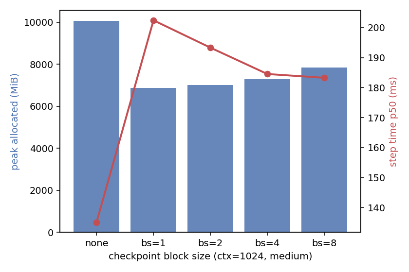
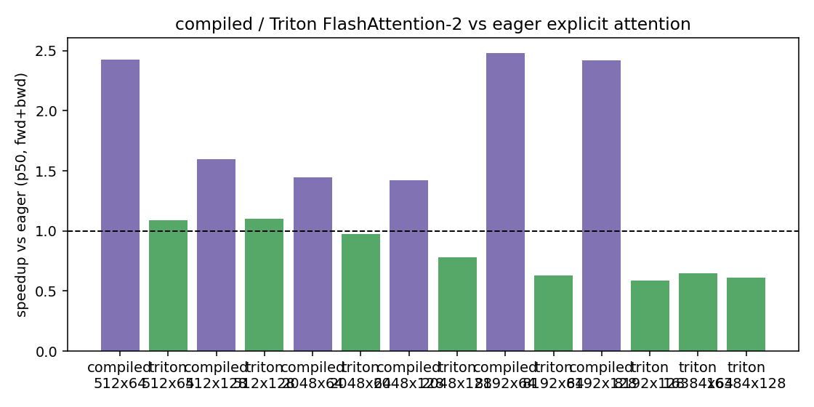
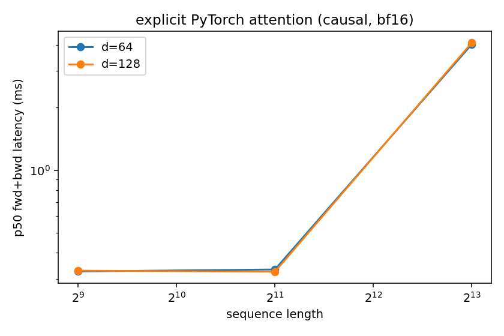

# A2-K 公开提交：王文煊

> 本文件和同目录代码、汇总、图片公开可见。只提交允许公开且已经脱敏的内容；上游仓库、
> 编译缓存、完整 trace 和大型原始文件留在个人工作目录。密钥和访问凭据不进入任何提交
> 材料。

> 正式要求见
> [`assignments/A2-K/README.md`](../../../../assignments/A2-K/README.md)，评分说明见
> [`assignments/A2-K/EVALUATION.md`](../../../../assignments/A2-K/EVALUATION.md)。

## 基本信息

- 作业题面版本：`26.1.4-k-rc.3`
- 完成范围：任务一（Activation Checkpointing 理论+固定矩阵）、任务二（显式 PyTorch
  attention 基线 + `torch.compile` 对照）、任务三（纯 PyTorch tiled FA2 + 学生 Triton
  FA2 forward）、任务四（重计算式 backward，PyTorch/Triton 两个 autograd path）、
  任务五（扩展正确性 + 核心/16384 边界性能矩阵）全部完成；官方 GPU tests 6/6 通过。
- 未完成项：可选的 Triton backward kernel 与 leaderboard（题面注明非必做）。
- 上游 starter commit：`ca8bc81a59b70516f7ebb2da4808daade877c736`
- 本地工作仓库：`../assignment2-systems`

## 环境与工具

| 项目 | 公开、脱敏的信息 |
| --- | --- |
| GPU | NVIDIA GeForce RTX 4090（本机为 48GB 版本，total 49140 MiB；按题面 3.1 以 23 GiB allocator 上限运行，保证 24GB 卡可复现） |
| 开跑前显存 | total 49140 MiB / free 48006 MiB（≥ 22 GiB） |
| Driver / CUDA | 570.124.06 / 12.8 |
| PyTorch | 2.7.0a0+ecf3bae40a.nv25.02 |
| Triton | 3.2.0 |
| power limit / P-state | 450 W（默认）/ P2，未超频未降功耗 |
| TF32 | performance 矩阵：BF16，TF32 matmul=false（NVIDIA build 默认）；扩展正确性含 FP32 且关 TF32 配置 |
| compile 配置 | `torch.compile` 默认 mode（Inductor），cold-start 与 steady-state 分开记录 |
| allocator limit / fraction | 23552 MiB / 0.4854（= 23 GiB / torch 报告的 total_memory） |
| 其他限制 | 单进程单卡串行；正式矩阵运行期间 GPU 无其他计算任务 |

## 1. Activation Checkpointing

### 理论与代码骨架

设序列由 `N` 个相同 Transformer block 组成，每层边界 activation 大小为 `A`，单层前向
计算量为 `C`。非嵌套、块大小 `b` 的安排：把 `N` 层分成 `N/b` 段，每段包在一个
checkpoint 里，只保存每段入口的边界 activation（`N/b` 份）；反向进入某段时从段入口
重算该段前向。峰值出现在「反向重算某一段、且该段全部中间激活都在显存中」的时刻：

- 峰值 activation memory ≈ `(N/b + b) · A`，取 `b = √N` 时最小，为 `O(√N · A)`；
- 总计算量 = 一次前向 + 反向时最多重算一次完整前向，即 `O(2·N·C)`，比无 checkpoint
  多约一次前向的代价，渐近阶不变；
- 极端 `b=1`（每层 checkpoint）：保存 `N` 份边界，峰值 ≈ `(N+1)·A`；`b=N`（整网一个
  checkpoint）：峰值同样 ≈ `(N+1)·A` —— 两个极端都不是最优；
- 嵌套 checkpoint（对段内再细分）理论上可得 `O(N^(1/3))` 级更细权衡，但收益递减、
  实现复杂，本作业只测非嵌套。

代码骨架（与 `submission/student_scripts/a2k/run_checkpointing.py` 一致）：

```python
h = model.token_embeddings(x)                      # 边界 activation: embedding 输出
for start in range(0, len(model.layers), b):       # 每 b 层一段，非嵌套
    layers = tuple(model.layers[start:start + b])
    def run_group(hidden, layers=layers):          # checkpoint 边界 = 段入口
        for layer in layers:
            hidden = layer(hidden)
        return hidden
    h = checkpoint(run_group, h, use_reentrant=False)  # 只保存 h（段入口）
logits = model.lm_head(model.ln_final(h))
loss = cross_entropy(logits.view(-1, V), y.view(-1))
loss.backward()                                    # 反向时逐段重算该段前向
```

### 固定实验

Stanford medium（d_model 1024 / d_ff 4096 / 24 层 / 16 头）、batch size 1、BF16
autocast、FP32 参数、AdamW，完整 training step；3 warm-up + 5 measurement，每轮测量前
重置 peak memory 统计。完整数据见 `results/checkpointing.csv`：

| 配置 | ctx 1024 p50 (ms) | ctx 1024 peak allocated (MiB) | ctx 1024 peak reserved (MiB) |
| --- | ---: | ---: | ---: |
| 无 checkpoint | 135.07 | 10070.13 | 10224.0 |
| block size 1 | 202.45 | 6869.28 | 7054.0 |
| block size 2 | 193.32 | 7008.47 | 7182.0 |
| block size 4 | 184.53 | 7290.59 | 7376.0 |
| block size 8 | 183.27 | 7845.00 | 7966.0 |
| ctx 2048 无 checkpoint | 382.97 | 19675.20 | 20164.0 |
| ctx 2048 block size 1 | 489.37 | 8072.86 | 8638.0 |

ctx 2048 边界：baseline（无 checkpoint）peak allocated 19675 MiB，用掉 23 GiB 预算的
84%，未 OOM；peak allocated 最低的 checkpoint 配置（block size 1）仅 8073 MiB
（省 59%），代价 +28% 时间。两个配置均在 23 GiB 预算内成功，无 OOM 行。

### 分析



- **最佳 block size 不只由 checkpoint 数量决定**：block size 1（24 个 checkpoint）
  显存最低（6869 MiB）但 step 最慢（202 ms，+48%）；block size 8 只多 ~1 GB 显存，
  时间降到 183 ms。边界 activation 数量从 24 减到 3 时已省掉大部分显存，继续增大
  `b` 的边际显存收益小、段内瞬时激活增多。
- 理论最优 `b = √24 ≈ 5`，与实测「显存×时间」乘积最优区间（block size 4：
  7291 MiB / 184.5 ms）一致。
- 重计算代价量化：block size 1 实测时间比 202/135 ≈ 1.48，与「反向多算一次完整前向、
  前向约占总时间 1/3」的估计吻合。
- block size 1 的第一个 measurement step 偏高（345 ms，use_reentrant=False 首次反向
  的 lazy 图构建），以 p50 报告，原始 5 个 step 值全部保留在 CSV 中。

## 2. PyTorch Attention 与 `torch.compile`

### 显式 PyTorch 基线

`submission/cs336_systems/a2k/attention.py::explicit_attention`：显式 `QK^T`、
`1/√d` scale、causal mask（`masked_fill(k>q, -inf)`）、softmax、`PV`，未调用
`scaled_dot_product_attention` 或任何 fused/第三方实现。batch 1、BF16、causal，
seq {512, 2048, 8192} × head_dim {64, 128}，forward/backward/fwd+bwd 三 phase，
`do_bench(warmup=100, rep=300, quantiles=[0.2,0.5,0.8])`，输入分配不计时。18 行全部
`ok`，无 OOM。完整数据见 `results/attention_baseline.csv`，关键 p50：

| seq × d | fwd (ms) | bwd (ms) | fwd+bwd (ms) | fwd+bwd peak alloc (MiB) |
| --- | ---: | ---: | ---: | ---: |
| 512×64 | 0.0266 | 0.3215 | 0.3256 | 18.88 |
| 512×128 | 0.0266 | 0.3247 | 0.3283 | 19.25 |
| 2048×64 | 0.0983 | 0.3219 | 0.3328 | 53.75 |
| 2048×128 | 0.1014 | 0.3174 | 0.3244 | 55.25 |
| 8192×64 | 1.6445 | 4.0311 | 4.0253 | 598.25 |
| 8192×128 | 1.6742 | 4.1021 | 4.0970 | 604.25 |

forward 随 seq 近似二次增长（512→8192 为 16× 序列、fwd 慢 ~63×）；短序列下 launch
开销主导，d=64 与 d=128 几乎无差。backward 行计时区间包含一次建图 forward（三方实现
口径一致），因此与 fwd+bwd 接近。显存由 autograd 保存的 N² 中间量主导。

### Compile 对照

完整数据见 `results/compile_comparison.csv`（cold-start 与 steady-state 分列）：

| 配置 | eager p50 (ms) | compiled p50 (ms) | speedup | cold-start (s) |
| --- | ---: | ---: | ---: | ---: |
| attn 512×64 fwd+bwd | 0.313 | 0.219 | 1.43× | 3.02 |
| attn 2048×128 fwd+bwd | 0.333 | 0.135 | 2.46× | 1.09 |
| attn 8192×128 fwd+bwd | 4.096 | 1.680 | 2.44× | 0.93 |
| small 模型 forward | 17.04 | 4.77 | 3.57× | 23.9 |
| small 模型 fwd+bwd | 46.71 | 13.10 | 3.57× | 25.5 |
| small 模型 train_step | 75.25 | 29.73 | 2.53× | 15.7 |

- **cold-start 必须分开**：模型级首次 compile 16–26 s，混入计时会完全颠倒结论。
- **显存也降**：8192×128 fwd+bwd peak 604→284 MiB（Inductor 融合 elementwise 链、
  减少 N² 中间物化）。
- **graph break / shape specialization**：显式 attention 为纯逐元素+matmul 链，无
  graph break；三个 shape 分别特化编译，同 shape 复跑命中编译缓存；small 模型每个
  phase 单独 `torch._dynamo.reset()` 后重编译。
- **测量稳定性**：compiled 后 p20/p80 区间显著收窄（2048×128 eager p80 0.511 ms vs
  compiled 0.144 ms），eager 的分散主要来自 kernel launch 抖动。
- train_step speedup（2.53×）低于纯 forward（3.57×）：optimizer.step() 为 eager
  执行，FP32 master 参数更新是访存 bound，不在编译收益范围内。

## 3. FlashAttention-2 Forward

### Pure PyTorch tiled reference

`submission/cs336_systems/a2k/flash_pytorch.py`：`torch.autograd.Function`，双层 tile
循环（query tile 64 × KV tile 64），FP32 online softmax 状态（运行最大值 `m`、运行和
`ℓ`、输出累加器）；每段 `m_new = max(m, rowmax(S))`、`α = exp(m − m_new)` rescale
后累加 `exp(S − m_new) @ V`；causal 时跳过 `ks >= qe` 的 KV tile 并在段内 mask；
`save_for_backward(Q, K, V, O, L)`，其中 `L = m + log ℓ` 是唯一 shape
`[batch, n_queries]` 的 LSE。接口 `is_causal=False` 默认值，经
`tests/adapters.py::get_flashattention_autograd_function_pytorch` 暴露类对象。

### Triton kernel

`submission/cs336_systems/a2k/flash_triton.py`：学生自写 `@triton.jit` kernel——

- launch grid：一个 program 负责一个 query tile（`program_id(0)`），`program_id(1)`
  为 batch；KV tile 在 kernel 内 `for start_n in range(0, hi, BLOCK_N)` 循环；
- causal 时 `hi = min((pid_m+1)*BLOCK_M, N_KEYS)`，只迭代可能可见的 KV tile，段内用
  `offs_m >= offs_n` mask；
- accumulator、`m_i`、`l_i` 全部 FP32，`tl.dot` 输入 BF16、输出 FP32；
- 数值稳定：`-inf` 保护（全 mask tile 不产生 NaN）；所有 load/store 带边界 mask，
  支持非 tile 整数倍序列；
- 输出 `O`（输入 dtype）与 `L`（FP32）；`BLOCK_M=BLOCK_N=64`、`num_warps=4`、
  `num_stages=2`；
- 经 `tests/adapters.py::get_flashattention_autograd_function_triton` 暴露类对象。

## 4. Backward 与正确性

### 重计算式 backward

按原 PDF 公式从保存的 `Q,K,V,O,L` 重算：`D = rowsum(dO∘O)`、`S = QK^T/√d`
（causal mask）、`P = exp(S−L)`、`dV = P^T dO`、`dP = dO V^T`、
`dS = P∘(dP−D)`、`dQ = dS K/√d`、`dK = dS^T Q/√d`，FP32 重算后 cast 回输入 dtype。
必做版为普通 PyTorch 实现，接入 PyTorch 和 Triton 两个 autograd path，均支持
causal/non-causal，梯度顺序与输入一致。

### 官方 GPU tests

`PYTHONPATH=cs336-basics CUDA_VISIBLE_DEVICES=0 .venv/bin/python -m pytest tests/test_attention.py -v`
（GPU：RTX 4090，commit `ca8bc81a`）：**6 passed, 0 failed, 0 skipped**（2 个 Triton
forward、2 个 Triton backward、2 个 PyTorch path，均为真实 CUDA 执行）。脱敏输出见
`results/unit_tests.txt`。

### 扩展正确性

3 seeds × head_dim {32, 64, 128} × causal/non-causal × 2 实现 = 36 配置，对照
float64 显式参考验证 `O`、`L`、`dQ`、`dK`、`dV`；其中 seed0/d64 为 FP32 且关 TF32。
容差 rtol=atol=1e-2。**36/36 pass**（`results/correctness.json`）。全部张量最大绝对
误差 0.0148（BF16 配置的 dV，BF16 有效精度所致，判定通过）；FP32+关TF32 配置最大
绝对误差 < 2e-4，说明误差来源是 BF16 存储而非算法错误。

## 5. 性能矩阵

### 配置与命令

单张 RTX 4090（23 GiB allocator 上限，开跑前 free 48006 MiB）、batch 1、BF16、
causal；核心矩阵 seq {512, 2048, 8192} × d {64, 128} × {forward, backward,
fwd+bwd}，eager / compiled / 学生 Triton 三方；边界矩阵 seq 16384 × d {64, 128}，
eager vs Triton。测量协议 `do_bench(warmup=100, rep=300, quantiles=[0.2,0.5,0.8])`。
命令：

```bash
PYTHONPATH=cs336-basics CUDA_VISIBLE_DEVICES=0 .venv/bin/python student_scripts/a2k/run_flash_benchmark.py
```

### 结果与图

完整 66 行见 `results/flash_benchmark.csv`（全部 `ok`，无 OOM；speedup 只对同
shape、同 phase 双成功行计算）。关键 p50 与相对 eager 的 speedup：



| seq × d | eager fwd | compiled fwd | Triton fwd | eager f+b | compiled f+b | Triton f+b |
| --- | ---: | ---: | ---: | ---: | ---: | ---: |
| 512×64 | 0.0266 | 0.0133 (2.00×) | 0.0174 (1.53×) | 0.308 | 0.127 (2.43×) | 0.282 (1.09×) |
| 512×128 | 0.0266 | 0.0164 (1.63×) | 0.0287 (0.93×) | 0.316 | 0.198 (1.60×) | 0.286 (1.10×) |
| 2048×64 | 0.0963 | 0.0583 (1.65×) | 0.0553 (1.74×) | 0.325 | 0.224 (1.45×) | 0.333 (0.98×) |
| 2048×128 | 0.1034 | 0.0666 (1.55×) | 0.1024 (1.01×) | 0.321 | 0.225 (1.42×) | 0.412 (0.78×) |
| 8192×64 | 1.646 | 0.607 (2.71×) | 0.213 (**7.73×**) | 4.025 | 1.622 (2.48×) | 6.405 (0.63×) |
| 8192×128 | 1.673 | 0.635 (2.64×) | 0.398 (**4.20×**) | 4.096 | 1.691 (2.42×) | 6.970 (0.59×) |
| 16384×64 | 6.637 | — | 0.454 (**14.6×**) | 16.32 | — | 25.09 (0.65×) |
| 16384×128 | 6.679 | — | 1.128 (**5.92×**) | 16.52 | — | 26.91 (0.61×) |

显存（fwd+bwd peak allocated, MiB）：8192×128 eager 604 / compiled 284 / Triton
1330；16384×128 eager 2344 / Triton 5205。Triton 仅 forward 的显存极小
（16384×128 fwd 36 MiB vs eager 1313 MiB）。



### 分析

- **Triton forward 长序列大幅领先**：seq ≥ 8192 时 speedup 4.2–14.6× 且随 seq 扩大
  （eager 物化 N² softmax 是访存 bound；tiled kernel 只读写 O(N·d)）。d=128 的
  speedup 低于 d=64，因 BLOCK 64×128 的 register/共享内存压力更高，是 tile 设计的
  已知权衡。
- **Triton backward 慢于 eager（0.6–1.1×）**：必做版 backward 是重计算式普通
  PyTorch——FP32 完整 N² matmul 重算 S/P（8192² × 4 byte ≈ 268 MiB/矩阵），吞吐低于
  BF16 且多次大 kernel 往返。优化方向是 tiled Triton backward（optional，未做），
  结果如实记录。
- **compiled 全面 1.4–2.7×**，512–8192 上是最稳的通用选择，但仍物化注意力矩阵，
  长序列无法达到 Triton forward 的显存/速度。
- 短序列交叉点：512×128 时 Triton forward 略慢于 eager（0.93×），tile 数量少、
  launch 与 FP32 累加开销主导，属预期。
- 16384 eager 未 OOM（peak 2344 MiB），但 Triton fwd 只用 1/36 显存且快 6–15×。

## 6. 限制与复现

- 代码同步命令：`python3 scripts/sync_a2k_submission.py --name '王文煊'`
- 轻量结果目录：`results/`（8 个必交文件齐全）
- 24G 显存证据：`results/memory_evidence.json` —— 全部正式进程最高 peak allocated
  19675.2 MiB、peak reserved 20164.0 MiB，allocator limit 23552 MiB /
  fraction 0.4854，`within_24gib = true`（peak reserved ≤ 23552 MiB）。
- 未提交的本地大型原始文件：完整 benchmark 逐配置日志、torch.compile 缓存，保留在
  个人工作目录，助教抽查时按组内受控方式提供。
- 已知限制：正式矩阵在本机 48GB 版 4090 上以 23 GiB allocator 上限完成（题面 3.1
  允许的同预算口径）；Triton kernel 固定 BLOCK 64×64 / warps 4 / stages 2 一版配置，
  未做 tile 自动调优；backward 为必做版重计算实现，长序列 fwd+bwd 慢于 eager。
- 最小复现步骤（工作仓库根目录）：

  ```bash
  PYTHONPATH=cs336-basics CUDA_VISIBLE_DEVICES=0 .venv/bin/python -m pytest tests/test_attention.py -v
  PYTHONPATH=cs336-basics CUDA_VISIBLE_DEVICES=0 .venv/bin/python student_scripts/a2k/run_checkpointing.py
  PYTHONPATH=cs336-basics CUDA_VISIBLE_DEVICES=0 .venv/bin/python student_scripts/a2k/run_attention_baseline.py
  PYTHONPATH=cs336-basics CUDA_VISIBLE_DEVICES=0 .venv/bin/python student_scripts/a2k/run_compile_comparison.py
  PYTHONPATH=cs336-basics CUDA_VISIBLE_DEVICES=0 .venv/bin/python student_scripts/a2k/run_correctness.py
  PYTHONPATH=cs336-basics CUDA_VISIBLE_DEVICES=0 .venv/bin/python student_scripts/a2k/run_flash_benchmark.py
  ```

## 自检

- [x] 本 PR 只包含我本人本次 A2-K 的文件。
- [x] 正式结果全部来自单张 RTX 4090（48GB 版，23 GiB allocator 上限保证 24GB 可复现），且开跑前可用显存不少于 22 GiB。
- [x] 每个正式脚本独立、串行执行，首次 CUDA allocation 前设置 23552 MiB allocator 上限。
- [x] README 是 Markdown 主报告，所有图片使用相对路径和有意义的 alt text。
- [x] checkpoint、baseline、compile、正确性与 Flash benchmark 的必交结果齐全。
- [x] PyTorch baseline 没有调用已有 fused attention。
- [x] 提交包含学生自己编写的真实 `@triton.jit` forward kernel。
- [x] 官方 CUDA tests 的 pass/fail/skip 如实记录（6 passed / 0 failed / 0 skipped）。
- [x] 每个关键数字都能回到命令、`results/` 或 metadata。
- [x] `results/` 与 `assets/` 附件合计不超过 2 MiB（约 450 KB），README 和单文件均未超限。
- [x] 未提交 compile cache、PTX/CUBIN、binary、完整 trace、上游仓库或依赖环境。
- [x] GitHub 内容不含内部主机名、IP、账号、路径、UUID、进程或未公开项目。
- [x] GitHub 内容不含 Secret、Token、Cookie、密码或私钥。
