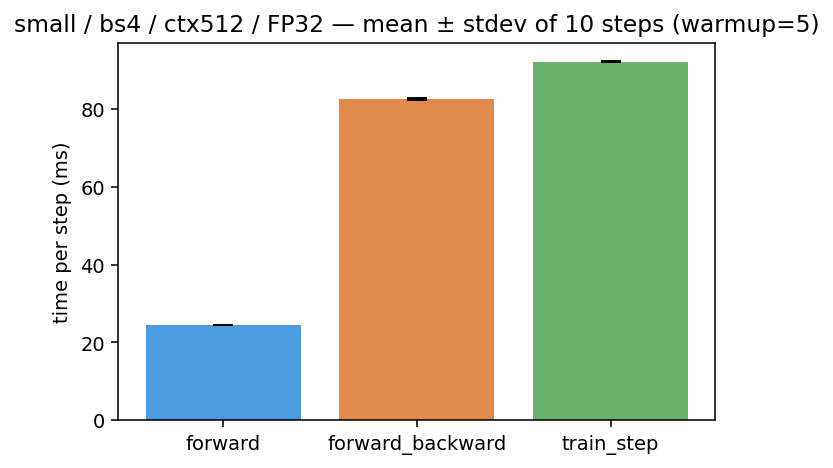
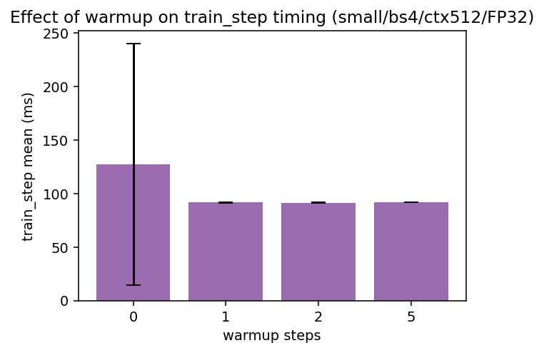
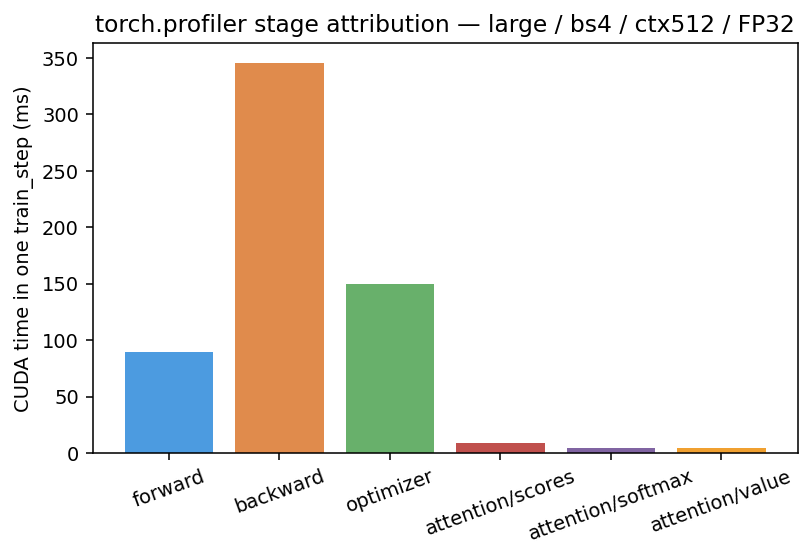
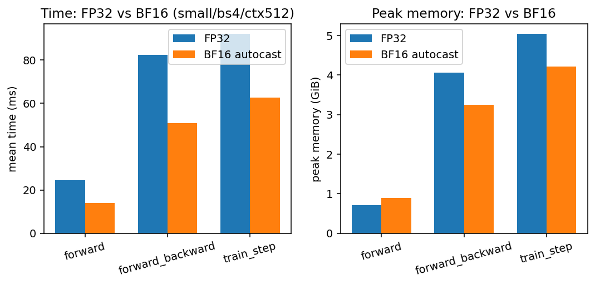
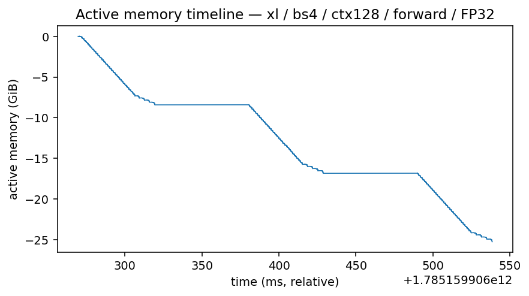
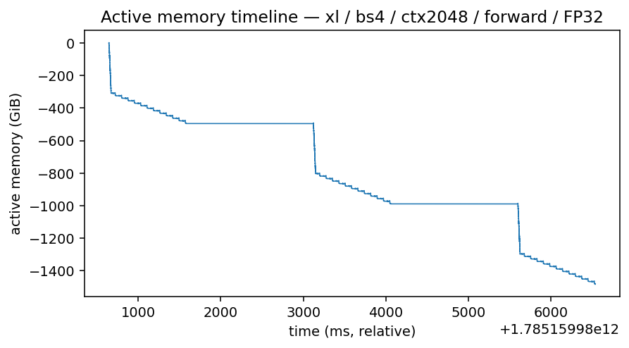
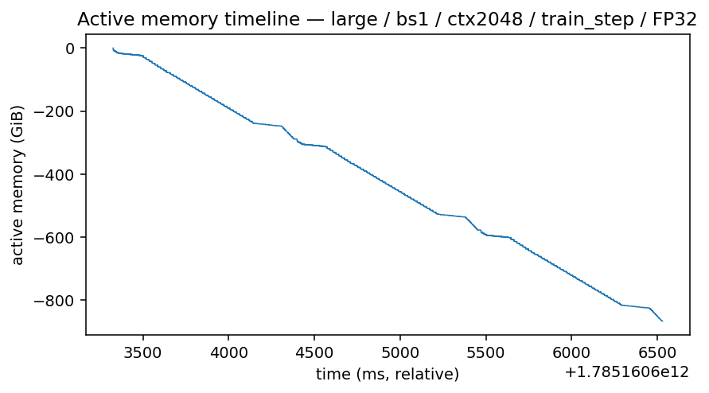

# A2-P 公开提交：王文煊

> 本文件和同目录代码、汇总、图片公开可见。只提交允许公开且已经脱敏的内容；大型 profiler
> 原始文件留在个人工作目录。密钥和访问凭据
> 不进入任何提交材料。

> 正式要求见
> [`assignments/A2-P/README.md`](../../../../assignments/A2-P/README.md)，评分说明见
> [`assignments/A2-P/EVALUATION.md`](../../../../assignments/A2-P/EVALUATION.md)。

## 基本信息

- 作业题面版本：`26.1.4-rc.3`
- 完成范围：任务一（三种 mode benchmark + warm-up 对照）、任务二（2 模型 × 3 context
  共 6 个 `train_step` trace + 阶段归因）、任务三（四段累加实验 + ToyModel BF16 autocast
  dtype 记录 + FP32/BF16 benchmark 对照）、任务四（XL ctx128/2048 forward 与
  train_step 的 memory profiling，train_step 按题面 fallback 顺序如实记录 OOM 后降级）。
- 未完成项：XL 的 `train_step` memory snapshot 在 FP32 下全部 OOM（含 batch size 1），
  按题面 fallback 到 `large`，详见任务四。
- 上游 starter commit：`ca8bc81a59b70516f7ebb2da4808daade877c736`
- 本地工作仓库：`../assignment2-systems`（代码在 `profiling/`，未 commit 的文件由
  `scripts/sync_a2p_submission.py` 同步到本目录 `submission/profiling/`）

## 环境与工具

| 项目 | 公开、脱敏的信息 |
| --- | --- |
| GPU | 1 × NVIDIA GeForce RTX 4090（48 GB 版本，47.38 GiB 可用） |
| Driver / CUDA | CUDA 12.8（torch 内建报告） |
| PyTorch | 2.7.0a0+ecf3bae40a.nv25.02（NVIDIA build） |
| Compute profiler | `torch.profiler`（CPU+CUDA activities，`record_function` 阶段标记），trace 用 Perfetto/Chrome trace 格式本地查看 |
| 其他限制 | 机器上 `nsys` 存在，但为保证六个配置同工具、同口径且短 schedule 可控，统一选 `torch.profiler`；所有实验在单张 GPU 上串行完成 |

模型与数据：BasicsTransformerLM（vocab 10000，PDF Table 1 尺寸），随机整数 token
batch（seed 固定），优化器为自实现 AdamW（lr=1e-3），loss 为自实现 cross_entropy。
FP32 为默认 dtype；`dtype=bf16` 表示 CUDA BF16 autocast。

## 1. End-to-End Benchmark

### 复现命令与计时方法

统一入口 `profiling/benchmark.py`（相对工作仓库根目录）：

```bash
PYTHONPATH=cs336-basics python profiling/benchmark.py \
  --model-size small --batch-size 4 --context-length 512 \
  --mode {forward|forward_backward|train_step} \
  --warmup 5 --steps 10 --dtype fp32 --seed 0 \
  --record-loss --output results/bench/RUN.json
```

- 计时器：`timeit.default_timer()`（最高分辨率系统时钟）。
- 同步位置：每个被测 step 之后调用 `torch.cuda.synchronize()`，保证 CUDA 异步 kernel
  全部完成后再读表。
- warm-up 边界：先跑 `--warmup` 个 step（不计时，含一次 synchronize），再跑
  `--steps` 个 measurement step；数据生成、模型初始化、warm-up 均不计时。
- `forward` 用 `torch.no_grad()`；`forward_backward` 每步
  `model.zero_grad(set_to_none=True)`；`train_step` 为
  `optimizer.zero_grad → forward+loss → backward → optimizer.step`。
- 每次运行把完整命令、配置、GPU 型号/显存、torch/CUDA 版本与结果路径写入输出 JSON 的
  `metadata`（见 `results/benchmark.csv` 的 `run` 列对应的本地 JSON）。

### 结果

small / bs4 / ctx512 / FP32，5 warm-up + 10 measurement（完整 raw timings、
均值、样本标准差、CV 见 `results/benchmark.csv`）：

| mode | mean (ms) | stdev (ms) | CV |
| --- | ---: | ---: | ---: |
| forward | 24.46 | 0.04 | 0.0015 |
| forward_backward | 82.49 | 0.37 | 0.0044 |
| train_step | 92.06 | 0.16 | 0.0017 |

`train_step` warm-up 对照（其余配置不变）：

| warmup | mean (ms) | stdev (ms) | CV | 第一步耗时 |
| ---: | ---: | ---: | ---: | ---: |
| 0 | 127.24 | 112.70 | 0.886 | 448.0 ms |
| 1 | 91.58 | 0.34 | 0.0037 | 92.1 ms |
| 2 | 91.53 | 0.23 | 0.0026 | 92.0 ms |
| 5 | 92.06 | 0.16 | 0.0017 | 91.8 ms |




### 分析

- forward ≈ 24.5 ms；forward+backward ≈ 82.5 ms（backward ≈ 58 ms，约为 forward 的
  2.4 倍，符合反向既要算激活梯度又要算权重梯度的预期）；optimizer step 额外约 9.6 ms。
- 充分 warm-up 后 CV ≤ 0.5%，波动极小；单卡串行、固定 batch 下结果高度可复现。
- 不 warm-up 时第一步 448 ms（比稳态慢约 4.9 倍），把均值拉高 38%、CV 拉到 0.886。
  第一步包含 CUDA context/cuBLAS handle 初始化、kernel 首次加载（JIT/module load）、
  caching allocator 首次扩池、autograd 图首次构建等一次性开销。warm-up 1 步后即回到
  稳态，但 warm-up 1/2/5 的均值仍有 ~0.5 ms 差异（92.1/91.9/91.5 ms 量级内的首步
  残余效应与测量噪声），所以题面要求 ≥5 步 warm-up 是稳妥的。

## 2. Compute Profiling

### 六个 `train_step` trace 与命令

工具：统一使用 `torch.profiler`（`ProfilerActivity.CPU + CUDA`），
`schedule(wait=0, warmup=5, active=1)` 只捕获一个预热后的稳定 measurement step，
`record_function` 标记 `profile/warmup`、`profile/measure`、`forward`、`backward`、
`optimizer`，并通过把 `cs336_basics.model.scaled_dot_product_attention` 替换为带标记的
wrapper 标记 `attention/scores`、`attention/softmax`、`attention/value`（36/12 次调用
分别对应 large/small 的层数）。命令形如：

```bash
PYTHONPATH=cs336-basics python profiling/nvtx_ranges.py \
  --model-size {small|large} --batch-size 4 --context-length {256|512|1024} \
  --warmup 5 --dtype fp32 --seed 0 --output-dir results/profile
PYTHONPATH=cs336-basics python profiling/parse_trace.py --profile-dir results/profile
```

| run（trace 文件名 trace_RUN.json） | 模型 | ctx | bs | dtype |
| --- | --- | ---: | ---: | --- |
| small_ctx256_bs4_fp32 | small | 256 | 4 | FP32 |
| small_ctx512_bs4_fp32 | small | 512 | 4 | FP32 |
| small_ctx1024_bs4_fp32 | small | 1024 | 4 | FP32 |
| large_ctx256_bs4_fp32 | large | 256 | 4 | FP32 |
| large_ctx512_bs4_fp32 | large | 512 | 4 | FP32 |
| large_ctx1024_bs2_fp32 | large | 1024 | 2 | FP32 |

注意：`large/ctx1024` 在 bs4 下 train_step OOM（FP32 参数+梯度+AdamW 状态约 15 GiB，
叠加 ctx1024 的 attention 激活超出 47.4 GiB），改为 bs2 并如实标注；batch size 不属于
题面固定矩阵，其余五个配置均为 bs4。六个 trace 均完整覆盖
`optimizer.zero_grad → forward+loss → backward → optimizer.step`。

### Kernel、Calls 与时间线

汇总见 `results/profile/trace_summary.csv`（每配置 top GPU kernels、top CPU ops 与
各阶段 Calls/累计 CPU wall/CUDA 时间）与 `results/profile/run_metadata.json`。
阶段归因由 `profiling/parse_trace.py` 从 Chrome trace 中 `profile/measure` 区间内的事件
计算（CUDA 时间 = 与阶段 CPU range 重叠的 kernel 时长之和）。

代表配置 **large / bs4 / ctx512 / FP32**（一个稳定 train_step，profiler 下 measure span
614 ms，profiler 自身有显著 CPU 开销，绝对值大于 benchmark 计时）：

| 阶段 | Calls | CPU wall (ms) | CUDA (ms) |
| --- | ---: | ---: | ---: |
| forward | 1 | 90.6 | 89.1 |
| backward | 1 | 348.6 | 345.5 |
| optimizer | 1 | 153.2 | 149.7 |
| attention/scores | 36 | 8.9 | 8.7 |
| attention/softmax | 36 | 4.7 | 4.6 |
| attention/value | 36 | 4.8 | 4.7 |



- 累计 CUDA 时间最大的 kernel 是 `ampere_sgemm_128x64_tn`（252 次调用、106.2 ms，
  即各 Linear/QKV/FFN 的 GEMM），与 forward+backward 都是 GEMM 主导一致；
  其次是 cutlass SIMT sgemm（各 109 次、64.8/61.1 ms）。
- 除 GEMM 外，elementwise（Mul/Add/SiLU 逐元素，580/1995 次调用，合计约 94 ms）和
  softmax/reduction kernel 也占非平凡时间——这正是题面 (c) 问的“非 matmul 但耗时
  可观”的部分，主要来自 SwiGLU 的逐元素乘、residual add、RMSNorm 与 embedding/输出
  投影外的逐元素 backward。
- attention 子阶段：scores(einsum+scale+mask) 8.7 ms > value 4.7 ms ≈ softmax 4.6 ms。
  softmax 的 FLOPs（O(ctx²·d_head·heads) 量级且只有 exp/除法）远低于两个 matmul，
  但其耗时与 value matmul 相当、超过 scores 的一半——memory-bound 操作在
  ctx=512 时已经无法忽略；ctx 从 256→1024 时 softmax CUDA 时间从 ~1 ms 量级涨到
  ~20 ms 量级（见 small 系列与 large 系列的 trace_summary），增长快于线性。
- forward CUDA 时间 89.1 ms 与任务一中 Python 计时（small forward 24.5 ms、
  profiler 下 small forward CUDA 22.9 ms）在去掉 profiler 开销后相互吻合，说明
  端到端计时与 trace 口径一致。

### 工具边界

`torch.profiler` 提供 op/kernel 级事件、Calls、CPU/CUDA 时间、stream/timeline
（Chrome trace 可在 Perfetto UI 打开查看），但**不提供** nsys 那种 CUDA API→kernel 的
系统级关联（cuLaunchKernel 调用栈、OS runtime 行），本报告所有表格只使用
`torch.profiler` 实际导出的字段，没有伪造 nsys 专属字段。完整 Chrome trace
（每配置数 MB 级）保留在本地工作目录，未进入提交。

## 3. Mixed Precision

### 四种累加实验

按 PDF 原样运行四段写法（`profiling/mixed_precision.py`，实际输出见
`results/mixed_precision.json`）：

| 写法 | 输出 | 误差来源 |
| --- | ---: | --- |
| FP32 累加器 += FP32 0.01 | 10.00013351 | 仅 FP32 累加舍入，≈1e-5 量级 |
| FP16 累加器 += FP16 0.01 | 9.953125 | 输入量化 + 低精度累加器叠加，误差 4.7e-2 |
| FP32 累加器 += FP16 0.01 | 10.00213623 | 只剩输入量化误差：0.01→FP16 为 0.0099945，每次少 5.5e-6，1000 次累计 ≈ -0.0021 的系统性偏差 |
| FP32 累加器 += FP16(0.01).float() | 10.00213623 | 与上一行完全相同——量化已在 FP16 存储时发生，事后 upcast 无法恢复 |

结论：两类误差必须区分——(1) **输入量化误差**在数值写入 FP16 的一刻就固定了，
事后转回 FP32 不会改变它（第 3、4 段输出一致即证据）；(2) **累加器精度误差**来自
每一步“大数加小数”时的舍入，FP16 累加器把它放大了 20 多倍。因此 reduction
（softmax 分母、cross-entropy、LayerNorm 的均值/方差）应始终保持 FP32 累加器，
这也是 autocast 把 reduction 留在 FP32 的原因。

### FP32 与 BF16 autocast

ToyModel（CUDA，BF16 autocast）各组件 dtype（`results/mixed_precision.json`）：

| 组件 | dtype |
| --- | --- |
| 参数（autocast 内） | torch.float32（autocast 不复制参数，matmul 时即时 cast） |
| fc1 输出 | torch.bfloat16 |
| LayerNorm 输出 | torch.float32 |
| logits（fc2 输出） | torch.bfloat16 |
| loss（logits.sum()） | torch.float32（reduction 提升为 FP32） |
| 梯度（fc1/ln 参数） | torch.float32 |

LayerNorm 对混合精度敏感的部分是均值/方差的 reduction 和除法：FP16 动态范围小、
尾数只有 10 bit，归一化统计量若用 FP16 累加会引入不可忽略的误差；即便换 BF16
（动态范围与 FP32 相同但尾数只有 8 bit）也仍然需要对 LayerNorm 区别对待——
BF16 解决的是**溢出/下溢**，不解决**精度**，均值方差这类对舍入敏感的量依然应保持
FP32，所以 autocast 对 LayerNorm 的策略与 FP16 时一致（输出回 FP32）。

语言模型 benchmark（small / bs4 / ctx512，warmup 5 + steps 10，同 seed，
`results/benchmark.csv`）：

| mode | FP32 mean (ms) | BF16 mean (ms) | 加速比 | FP32 peak (GiB) | BF16 peak (GiB) |
| --- | ---: | ---: | ---: | ---: | ---: |
| forward | 24.46 | 13.89 | 1.76× | 0.71 | 0.89 |
| forward_backward | 82.49 | 50.99 | 1.62× | 4.06 | 3.24 |
| train_step | 92.06 | 62.68 | 1.47× | 5.03 | 4.21 |



- BF16 autocast 让 GEMM 走 Tensor Core，三种 mode 全面加速 1.5–1.8×；forward 收益最大
  （纯计算），train_step 最小（optimizer 的逐元素 FP32 更新占比升高，不受 autocast 影响）。
- 峰值显存：训练模式下 BF16 激活减半，train_step 峰值从 5.03→4.21 GiB；但
  **forward-only 反而升高**（0.71→0.89 GiB），因为 no_grad 下 FP32 本来不保存激活，
  而 autocast 会缓存参数的 BF16 cast 副本。
- 数值趋势：10 步 loss 序列 FP32 vs BF16（如第 1 步 6.788 vs 6.799，第 10 步 2.871
  vs 3.826）同量级同趋势但逐步发散；同 seed 同参数的 logits 最大绝对差 0.0151、
  平均绝对差 0.0021（相对 ~0.7%），与 BF16 8-bit 尾数的舍入量级一致。

## 4. Memory Profiling

### 配置、峰值与 fallback

方法：warm-up 完成后才开启 `torch.cuda.memory._record_memory_history()`，记录若干 step
后 `_dump_snapshot()` 保存 pickle（本地保留，用 PyTorch memory visualizer 打开核对），
统计四种口径：active（当前存活字节）/ peak_allocated（历史峰值存活）/ reserved
（allocator 池当前值）/ peak_reserved。命令：

```bash
PYTHONPATH=cs336-basics python profiling/memory_snapshot.py \
  --model-size xl --batch-size 4 --context-length {128|2048} \
  --mode {forward|train_step} --warmup 2 --steps 3 --dtype fp32 \
  --output-dir results/memory
```

`results/memory/peaks.csv`（摘要）：

| 配置 | mode | active now (GiB) | peak allocated (GiB) | peak reserved (GiB) |
| --- | --- | ---: | ---: | ---: |
| xl / bs4 / ctx128 / fp32 | forward | 12.83 | 12.91 | 12.94 |
| xl / bs4 / ctx2048 / fp32 | forward | 12.83 | 21.30 | 23.46 |
| xl / bs4 / ctx2048 / bf16 | forward | 12.83 | 25.35 | 27.46 |
| large / bs4 / ctx128 / fp32 | train_step | 14.88 | 15.14 | 16.70 |
| large / bs1 / ctx2048 / fp32 | train_step | 14.57 | 45.40 | 46.08 |
| large / bs2 / ctx2048 / fp32 | forward | 3.73 | 6.35 | 7.07 |

**OOM 与 fallback（如实记录，明细见 `results/memory/oom_record.json`）**：
XL 的 `train_step`（FP32）在 ctx128 与 ctx2048 下均在 forward 阶段
（attention softmax/scores 分配时）抛 `torch.OutOfMemoryError`；按题面要求先验证
batch size 1 仍 OOM，再依次尝试 XL/ctx1024（OOM）、Large/ctx2048 bs4 与 bs2（OOM），
最终成功 fallback 为 **Large/ctx2048/bs1 train_step（peak 45.40 GiB）** 与
Large/ctx128/bs4 train_step（peak 15.14 GiB）。根因：XL 约 3.38B 参数，FP32 下
参数(12.6 GiB)+梯度(12.6 GiB)+AdamW m/v(25.2 GiB) ≈ **50.4 GiB 固定开销**，
已超过 47.38 GiB 显存，与 batch/context 无关；Large（约 0.94B 参数）固定开销约
15.1 GiB，ctx2048/bs1 的激活（36 层 × [1,20,2048,2048] FP32 attention 权重等）
把峰值推到 45.4 GiB，恰好装下。所有 OOM 配置、失败阶段、异常类型与分配量都记录在
`results/memory/oom_record.json` 与 `results/memory/run_metadata.json`。

### Timeline、allocation 与 residual/gradient





（图为从 snapshot pickle 的 alloc/free 事件自绘的 active memory 曲线，避免截图带入
主机信息；原 pickle 已用 pytorch.org/memory_viz 本地打开核对一致。）

- forward-only（no_grad）：曲线是“平台（参数 12.83 GiB）+ 每步一个尖峰”。
  ctx128 尖峰几乎看不见（12.91 GiB 峰值），ctx2048 尖峰约 +8.5 GiB——主要是
  每层的 attention scores/权重 [4,32,2048,2048] FP32（单份 1 GiB）等瞬态张量，
  step 结束立即释放，所以能从尖峰直接区分“哪个阶段在跑”。
- train_step：forward 段逐层抬升（每层 residual/saved tensors 累积，backward 要
  用），到 loss 处达峰，backward 段逐层回落（saved residual 释放）同时梯度张量
  产生，最后 optimizer.step 读梯度、m/v 更新后回落到平台。peak 45.4 GiB 与
  “固定 15.1 GiB + forward 末端全部 saved residuals”相符。
- residual stream 理论大小（XL，FP32）：bs×ctx×d_model×4 B =
  4×2048×2560×4 B = **80 MiB**（ctx128 为 5 MiB）。snapshot 中最大的活跃
  allocation 是 **100 MiB** 的块，等于 d_model×d_ff×4 B = 2560×10240×4 B，
  即 FFN 权重矩阵本身（forward-only 下存活块主要是参数）；train_step snapshot 中
  还出现大量 48.83 MiB 块 = 10000×1280×4 B，即 Large 的 embedding 权重及其梯度、
  AdamW m/v 副本。单个 Large TransformerBlock 的参数约 26.2M，对应梯度张量约
  100 MiB；backward 每释放一层的 saved residuals（远大于梯度）净内存下降，
  与 timeline 的逐层回落一致。

## 5. 限制与复现

- 代码同步命令：`python3 scripts/sync_a2p_submission.py --name '王文煊'`
- 轻量结果目录：`results/`（benchmark.csv、profile/trace_summary.csv +
  run_metadata.json、mixed_precision.json、memory/peaks.csv + run_metadata.json）
- 未提交的本地大型原始文件：6 个 Chrome trace（JSON，数 MB 级）、6 个 memory
  snapshot pickle，均保留在本地工作仓库 `results/` 下，可按助教要求以组内受控方式
  提供，不进入公开仓库。
- 已知限制：profiler 开启时 CPU 开销大（measure span 明显大于 benchmark 计时），
  阶段时间用于归因比例而非绝对性能；`torch.profiler` 无 nsys 的 CUDA API 关联；
  XL train_step 因 48 GB 显存物理限制无法在本机 FP32 完成，已按题面 fallback。
- 最小复现步骤：在工作仓库根目录执行
  `bash profiling/run_all.sh`（任务一/三/四）+ 任务二的
  `profiling/nvtx_ranges.py` 六个配置 + `profiling/parse_trace.py`，然后
  `python profiling/summarize.py --src results --dst OUTPUT_DIR` 与
  `python profiling/make_plots.py results assets`。

## 自检

- [x] 本 PR 只包含我本人本次 A2-P 的文件。
- [x] `README.md` 是 Markdown 主报告，所有图片使用相对路径和有意义的 alt text。
- [x] 每个关键数字都能回到命令、`results/` 或 metadata。
- [x] 引用仓库外源码或资料时使用固定 commit 的 GitHub HTTPS 绝对 URL，未写入本机路径或 `file://` 链接。
- [x] 已用 torch.profiler 完成六个 `train_step` trace，并提交轻量汇总。
- [x] 已提交 1 张 Compute Profile 关键图和 3 张 Memory Timeline，均已压缩并被报告引用。
- [x] `results/` 与 `assets/` 公开附件合计不超过 2 MiB（实测 < 0.5 MiB）。
- [x] 未提交 `.nsys-rep`、snapshot、完整 trace、权重、数据、压缩包或依赖环境。
- [x] GitHub 内容不含内部主机名、IP、账号、路径、UUID、进程或未公开项目。
- [x] GitHub 内容不含 Secret、Token、Cookie、密码或私钥。
