# A1 公开提交：王昱邦

> 本文件和同目录代码公开可见。只提交允许公开且已经脱敏的内容；组织内材料放在下方
> 登记的飞书补充文档中，密钥和访问凭据不进入任何提交材料。

> 评分标准与评测方式见 [`assignments/A1/EVALUATION.md`](../../../../assignments/A1/EVALUATION.md)；日志格式见 [`assignments/A1/README.md` 的《实验日志格式》](../../../../assignments/A1/README.md#实验日志格式)。
> 本模板固定报告、代码、脚本、日志和图表的提交位置；各部分照下方占位填写即可。

## 基本信息

- 作业题面版本：26.0.4
- 完成范围：byte-level BPE 训练与编解码、测试 adapter、TinyStories/OWT 正式 tokenizer、压缩率与吞吐量实验、四份语料的 `uint16` 编码、第 3 章 Transformer 组件、第 4 章训练组件、第 5 章训练系统、第 6 章 decoder、第 7.1 节实验追踪，以及第 7.2 节 TinyStories 性能测试、learning-rate 调优、327.68M-token 正式训练、batch-size 实验和正式文本生成、第 7.3 节架构消融和第 7.4 节 OWT 正式训练与生成分析
- 未完成项：无
- 上游 starter commit：`a158843b20107949f1a8d7df1b05cd33b9166712`
- 本地工作仓库：`../assignment1-basics`（必须与 `SummerQuest-2026` 同级）

## Markdown 报告

### 2.1 Unicode Standard

`chr(0)` 返回 Unicode 的 U+0000 NULL 字符。它的 `repr` 是可见的转义形式 `"\\x00"`，而直接
`print` 时不会显示可见字形；出现在字符串中时，它仍然是一个真实的控制字符，会保留在文本
数据里，但通常表现为空白位置而不是可见符号。

### 2.2 Unicode Encodings

我选择 UTF-8 是因为它只需要 256 个基础 byte token、与 ASCII 完全兼容，并且对英文和网页中
常见的 ASCII 内容保持紧凑；UTF-16 和 UTF-32 使用更宽的编码单元，存在端序/BOM 处理问题，
对 ASCII 文本还会引入额外的零字节。UTF-8 对非 ASCII 字符使用 2--4 个 byte，仍然可以覆盖
所有 Unicode code point，而且 byte-level tokenizer 不会产生 out-of-vocabulary 字符。

下面的实现错误地把每个 byte 当成一个独立的 UTF-8 字符解码。例如
`"é".encode("utf-8") == b"\\xc3\\xa9"`；函数会在单独解码 `b"\\xc3"` 时抛出
`UnicodeDecodeError`，因为一个多字节 UTF-8 字符必须把完整的 byte sequence 一起解码，而不能
逐 byte 拼接解码。

一个不对应任何 Unicode 字符的两字节序列是 `b"\\xc0\\x80"`。它试图用 overlong encoding
表示 U+0000，而现代 UTF-8 明确禁止 overlong forms，因此解码时会抛出
`UnicodeDecodeError`。

### Byte-level BPE 训练

我实现了 byte-level BPE 训练流程。初始词表包含 256 个单字节 token，并在其后加入
`<|endoftext|>`。预分词使用题目给定的 GPT-2 风格正则表达式；特殊 token 先作为硬边界
切分，因此相邻文档之间不会产生 merge。训练按“频率优先、字典序打破平局”的规则选择
pair，并按创建顺序保存 merge。`tests/test_train_bpe.py` 中的速度、基础正确性和特殊 token
三项测试均已通过。

为处理大文件，我在 `<|endoftext|>` 开头寻找安全的 byte boundary，将语料分块后交给最多
8 个进程执行 pre-tokenization；小于 1 MB 的文件保留串行路径，避免进程启动成本影响单元
测试。各 worker 返回局部 `Counter`，主进程将相同 pre-token 的频率相加。小文件、包含
中英文和特殊 token 的人工语料上，并行与串行结果完全一致。

初版 merge 每轮重新统计全部 pair，并重新扫描、重建所有 pre-token。优化版为每个不同的
pre-token 分配稳定 `word_id`，维护全局 `pair_counts` 与 `pair_positions` 反向索引；合并后的
右位置保留为 `None` tombstone。选出 `best_pair` 后，程序只访问该 pair 的具体位置，删除
`(previous, left)`、`(left, right)`、`(right, next)` 的旧贡献，再加入
`(previous, merged)` 和 `(merged, next)`。位置按 `word_id` 和下标排序后从左到右处理，
因此 `aaa`、`aaaa` 等重叠情形与朴素实现保持相同的非重叠 merge 语义。

### TinyStories-valid 下采样实验

正式 TinyStories tokenizer 必须在训练集上学习。为在处理约 2.23 GB 的训练文件前验证
实现与评估运行成本，我按照题面建议，先在约 22.5 MB 的验证集上进行了一系列回归
实验。所有实验均加入 `<|endoftext|>`，在 CPU 上运行；下表的时间来自未开启 profiler
的墙钟计时。

| 实现 | 目标词表 | Merge 数 | 墙钟时间 | 相对同规模初版 |
| --- | ---: | ---: | ---: | ---: |
| 初版：串行预分词、全量重新计数与 merge | 300 | 43 | 5.54 s | 1.00x |
| 并行预分词、原始 merge | 300 | 43 | 1.47 s | 3.77x |
| 初版：串行预分词、全量重新计数与 merge | 1,000 | 743 | 17.06 s | 1.00x |
| 并行预分词、原始 merge | 1,000 | 743 | 11.65 s | 1.46x |
| 并行预分词、位置索引 merge | 1,000 | 743 | 1.09 s | 15.68x |
| 初版：串行预分词、全量重新计数与 merge | 10,000 | 9,743 | 108.31 s | 1.00x |
| 并行预分词、位置索引 merge | 10,000 | 9,743 | 7.29 s | 14.87x |
| 并行预分词、位置索引 merge、最大堆选 pair | 10,000 | 9,743 | 0.865 s | 125.20x |

10,000 词表实验得到 9,743 条 merge，等于目标词表大小减去 256 个初始字节 token 和一个
特殊 token。词表中最长的 token 是 `b' accomplishment'`，长度为 15 bytes。该结果合理：
它对应一个完整英文单词，并保留了 GPT 风格预分词中常见的前导空格。这些数字用于验证
实现与定位瓶颈；TinyStories 训练集上的正式结果单独报告在后文。

所有回归实验均对完整 pickle 产物进行比较；索引版与初版的 vocabulary、merge 内容和
merge 顺序逐项相同。脚本通过必填 `--run-name` 将每次 run 写入独立目录，并在同名目录
存在时于训练前拒绝运行，避免覆盖历史结果。并行 run 中通过 `ru_maxrss` 记录的数值只
覆盖主进程，不能作为整个进程树的总峰值内存，因此上表不报告不可比的内存数字。

### BPE 性能分析

我使用 `cProfile` 分析了 TinyStories-valid、1,000 词表的运行。Profile 共记录约
2.00 亿次函数调用，带 instrumentation 的总时间为 39.87 秒。`merge_pair` 的累计时间为
22.03 秒，约占 55%；`pre_tokenize` 为 9.89 秒，约占 25%；`count_pairs` 为 6.84 秒，
约占 17%。主要瓶颈是迭代合并：当前 `merge_pair` 在每一轮 merge 后重新扫描所有不同的
pre-token。Profile 本身显著增加运行时间，因此性能占比采用 profile 数据，正式墙钟时间
采用未开启 profiler 的独立运行。

位置索引消除了训练循环中的全量 `count_pairs`，并将 merge 更新限制在受影响位置。对
TinyStories-valid 训练 10,000 词表时，`merge_indexed_pair` 在新 profile 中累计仅用
0.302 秒，`build_merge_index` 用 0.061 秒；正常运行时间从 108.31 秒降到 7.29 秒，
加速 14.87 倍。新 profile 共记录约 1.01 亿次函数调用，instrumentation 后总时间为
16.03 秒，其中 `find_best_pair` 累计占 14.31 秒（约 89.3%）。其 lambda 被调用约
9,966 万次，说明瓶颈已经从“全量重新计数和 merge”转移到“每轮使用 `max` 扫描全部
候选 pair”。

我随后用最大堆维护候选 pair。堆元素保存入堆时的频次和 pair；每次局部 merge 后，只将
频次发生变化的 pair 重新压入堆。旧条目不立即删除，而是在弹出时与当前 `pair_counts`
核对，频次不一致的条目视为失效并丢弃。这种 lazy invalidation 避免了 Python 堆不支持
原地更新的问题。比较规则同时保留题目要求的行为：频次更高的 pair 优先，频次相同则
选择字典序更大的 pair。

在 TinyStories-valid、10,000 词表回归实验中，堆优化将未开启 profiler 的时间从位置索引
版的 7.29 秒降至 0.865 秒，相对位置索引版再加速 8.42 倍，相对 108.31 秒的初版加速
125.20 倍。完整 vocabulary 和 9,743 条 merge 与初版逐项相同。新的 profile 记录约
226 万次函数调用，总时间为 1.884 秒：`parallel_pre_tokenize` 累计 1.302 秒，
`merge_indexed_pair` 为 0.321 秒，`pop_best_pair` 为 0.084 秒。训练共执行 9,743 次有效
merge 和 29,542 次 `heappop`，平均每次有效 merge 弹出约 3.03 个条目。瓶颈已从每轮
扫描全部候选 pair 转移到语料预分词及多进程调度。

### TinyStories-train 正式训练结果

在回归结果完全一致后，我使用 2,227,753,162-byte 的 TinyStories 训练集正式训练
10,000 大小的词表。初始词表由 256 个单字节 token 和 `<|endoftext|>` 组成，因此训练
执行 9,743 次 merge。运行用时 60.55 秒，满足题目规定的 30 分钟上限。产物检查确认
最终词表含 10,000 项、特殊 token 的编号为 256，并且对每个 `i`，编号 `257 + i` 的
token 都等于第 `i` 条 merge 的左右 token 拼接结果。

训练期间，我每 50 ms 对主进程及其递归子进程的 RSS 求和。采样到的主进程峰值为
132.13 MiB，进程树聚合峰值为 10,499.50 MiB（约 10.25 GiB），低于题目规定的 30 GB
上限。聚合 RSS 会把多进程间共享的物理页分别计入各进程，因此这是保守的进程树内存
指标，不等同于机器实际新增的物理内存占用。

正式词表中最长 token 的长度为 15 bytes，共有三个并列结果：
`b' accomplishment'`、`b' disappointment'` 和 `b' responsibility'`。它们都是带前导
空格的完整英文单词，符合 GPT-2 风格预分词将空格与后续单词放在同一 pre-token 中的
规律。训练集与验证集学习到的 merge 序列并不相同；两者第一次差异出现在第 6 次 merge，
说明正式 tokenizer 必须使用训练集统计，验证集实验只能用于调试和性能回归。

### OpenWebText-train 正式训练结果

我在 11,920,511,059-byte 的 OpenWebText 训练集上训练了 32,000 大小的
byte-level BPE 词表。训练执行 31,743 次 merge，用时 403.20 秒（约 6 分
43 秒），主进程与进程树峰值均为 9,886.65 MiB（约 9.65 GiB），低于题面
规定的 12 小时和 100 GB 上限。产物检查确认 token ID 连续为
0--31,999，256 个基础字节与 ID 256 的 `<|endoftext|>` 均保持不变。

词表中最长 token 为 64 bytes，其字节表示是重复的 `c383c382` 序列。这与
TinyStories 中最长的完整英文单词不同：OpenWebText 包含网页抽取产生的编码噪声，
byte-level BPE 只根据字节对频率学习，不保证每个 token 都是人类可读的 Unicode
字符串。因此该结果在算法上合法，也反映了 OWT 与经清洗儿童故事之间的语料
差异。

### Tokenizer 编码与解码

我实现了 `Tokenizer.__init__`、`from_files`、`encode`、`encode_iterable` 和 `decode`。
初始化阶段建立 `bytes -> token_id` 反向词表，并用 merge 在训练过程中的创建下标作为
rank。编码时先用训练阶段相同的 GPT-2 正则表达式进行 pre-tokenization；每个 pre-token
从 UTF-8 单字节序列开始，反复选择当前相邻 pair 中 rank 最小的一项，再从左到右合并其
所有非重叠出现位置。该过程只查询当前存在的相邻 pair，不遍历完整 merge 列表。

用户提供的特殊 token 在词表中不存在时会获得新的 ID，已经存在时沿用原 ID。编码前将
特殊 token 按字符串长度降序排列，再构造转义后的正则分支，因此重叠候选遵循最长优先
匹配。例如同时注册 `<|endoftext|>` 和两个该字符串的连续拼接时，连续形式保持为一个
token，而不会被拆成两个较短 token。普通文本片段仍独立执行 GPT-2 预分词和 BPE。

`encode_iterable` 逐个读取 iterable 产生的字符串并惰性 `yield` token ID，没有将完整
文件拼接进内存。官方 5 MB fixture 的 1 MB 额外内存限制测试通过，逐行编码结果也与整篇
GPT-2/tiktoken 编码逐项相同。解码先按 ID 查找 byte token 并连接完整 byte sequence，再
执行 UTF-8 解码；`errors="replace"` 将不完整或非法序列替换为 `U+FFFD`，同时保证跨多个
token 的中文和 emoji 能在 byte 拼接后正确恢复。

`tests/test_tokenizer.py` 的结果为 24 passed、1 xfailed；唯一 xfail 是题目明确标记为预期
超出 1 MB 的普通 `encode` 内存测试。随后使用 TinyStories-train 正式产物中的
`vocab.pkl` 和 `merges.pkl` 验证 `from_files`：加载后词表大小为 10,000、merge 数为
9,743、`<|endoftext|>` 的 ID 为 256。包含英文、中文、中文标点、emoji、换行和特殊 token
的测试文本编码为 35 个 ID，特殊 token 出现一次，decode 后与输入逐字符一致。

### Tokenizer 实验

我在 TinyStories-valid 和 OWT-valid 上使用固定随机种子 336 执行蓄水池
抽样，从每个验证集均匀抽取 10 篇文档。TinyStories 样本含 9,060 bytes，用
10K TinyStories tokenizer 编码为 2,157 tokens，压缩率为 4.200 bytes/token。
OWT 样本含 32,949 bytes，用 32K OWT tokenizer 编码为 7,389 tokens，压缩率
为 4.459 bytes/token。

对同一批 OWT 样本改用 TinyStories tokenizer 后，token 数从 7,389 增至 9,866，
序列长度增加 33.5%；压缩率降至 3.340 bytes/token。该实验同时改变了
训练语料域和词表大小，因此不能将降幅单独归因于域偏移；结果表明，在
OWT 上训练的更大词表能用更少 token 表示同一批网页文本。

吞吐量实验在一次预热后分别编码约 5 MB 的同域样本，计时只包含
`encode`。TinyStories tokenizer 达到 1,686,249 bytes/s，按十进制 825 GB 外推
需 135.90 小时（约 5.66 天）；OWT tokenizer 达到 1,452,353 bytes/s，外推需
157.79 小时（约 6.57 天）。这是当前纯 Python 单进程实现的近似值，实际
825 GB 语料的文本分布和 I/O 会改变总时间。

最后，我将两个数据集的 train/valid 文件按文档边界流式编码为小端
`uint16` 序列：TinyStories-train 和 valid 分别包含 541,229,347 和
5,465,883 tokens，OWT-train 和 valid 分别包含 2,727,120,452 和
66,401,098 tokens。四份文件均通过 `np.memmap` 检查：文件大小等于
token 数乘 2，最大 ID 分别为 9,999 和 31,999，特殊 token 数与原语料
边界一致。`uint16` 可表示 0--65,535，因此足以容纳 10K 和 32K 词表，
且每个 ID 只占 2 bytes。这些约 6.2 GiB 的本地数据仅用于后续训练，不进入
Git 提交。

### 3.3 Linear 与 Embedding

我在 `cs336_basics/model.py` 中实现了无 bias 的 `Linear` 和词向量查表的
`Embedding`。`Linear.weight` 保存为 `(out_features, in_features)`，forward 使用
`torch.einsum("...i,oi->...o", x, weight)`，因此支持任意前置的 batch-like 维度，只对
最后的 input-feature 维度做线性变换。`Embedding.weight` 保存为
`(num_embeddings, embedding_dim)`，forward 直接使用 `weight[token_ids]` 返回对应的词向量。

参数初始化遵循题面：Linear 使用方差 `2/(d_in+d_out)` 的零均值截断正态
分布，截断边界为 `±3σ`；Embedding 使用标准差 1 并截断到 `[-3,3]`。两个 module 都接受
`device` 和 `dtype`，参数保存为 `nn.Parameter`，且没有 bias。

`uv run pytest -k 'test_linear or test_embedding' -q` 的结果为 `2 passed`。另外对
`(d_in,)`、`(batch,d_in)` 和 `(batch,sequence,d_in)` 三种 Linear 输入形状进行了形状
检查，并验证 Embedding 输出的每个位置与对应权重行一致。

### 3.4.1 RMSNorm

我在 `cs336_basics/model.py` 中实现了 RMSNorm。它只在最后的
`d_model` 维度计算平方均值和 RMS，不像 LayerNorm 那样先减去均值；可学习
gain `weight` 初始化为全 1。为了防止 `float16`/`bfloat16` 下平方操作溢出，forward
先将输入 upcast 到 `float32`，完成归一化与 gain 缩放后再恢复原 dtype。
输出形状与输入形状一致，可支持任意前置 batch-like 维度。

`uv run pytest -k test_rmsnorm -q` 的结果为 `1 passed`，并额外用 `float16` 大数输入检查了输出 dtype、有限性与公式正确性。

### 3.4.2 SwiGLU 位置前馈网络

我实现了无 bias 的 `SwiGLU`，使用三个 Linear 投影：`w1` 和 `w3` 将
`d_model` 投影到 `d_ff`，`w2` 将逐元素门控结果投回 `d_model`。forward 为
`w2(silu(w1(x)) * w3(x))`，其中 `*` 是逐元素乘法，而不是矩阵乘法。
`PositionWiseFeedForward` 作为同一实现的描述性别名，供后续 TransformerBlock 使用。

由于 SwiGLU 有三组权重，不直接沿用 ReLU FFN 的 `4*d_model` 内部维度；按题面
使用约 `(8/3)*d_model`，并可调整为 64 的倍数，以保持近似的参数量。
`uv run pytest -k test_swiglu -q` 的结果为 `1 passed`，额外用显式公式对同一组权重进行了数值与输出形状检查。

### 3.4.3 RoPE

我实现了无可学习参数的 `RotaryPositionalEmbedding`。初始化时预计算
`max_seq_len` 个位置和 `d_k/2` 个二维旋转 pair 的 sine/cosine，并使用
`register_buffer(persistent=False)` 保存，因此缓存会随 module 移动设备但不参与参数更新。
forward 将最后一维相邻元素分成 even/odd 两支，执行二维旋转后交错写回原形状。

`token_positions` 可以是 `(sequence_length,)` 并广播到 batch，也可以包含任意前置 batch-like 维度；
位置缓存通过索引获取，不构造完整 `d_k × d_k` 旋转矩阵。
`uv run pytest -k test_rope -q` 的结果为 `1 passed`，并验证了位置 0 旋转不变、输出形状不变和非连续位置编号。

### 3.4.4 Softmax

我实现了可沿任意维度计算的数值稳定 Softmax。计算时先沿指定维度取最大值，再从
输入中减去该最大值后求指数，最后除以同维度的指数和。这利用 Softmax 的整体平移不变性，防止大正数输入导致 `exp` 溢出。半精度输入在 `float32` 中计算后恢复原 dtype。

`uv run pytest -k test_softmax_matches_pytorch -q` 的结果为 `1 passed`。另外检查了多个 `dim`、每个归一化维度之和为 1、整体平移不变性、半精度 dtype 恢复与大值输入有限性。

### 3.4.4 Scaled Dot-Product Attention

我实现了支持任意前置 batch-like 维度的 Scaled Dot-Product Attention。对
`Q (..., queries, d_k)`、`K (..., keys, d_k)` 和 `V (..., keys, d_v)`，先用 einsum 计算
`QK^T`，除以 `sqrt(d_k)` 后调用数值稳定 Softmax，最后用注意力权重对 `V` 做加权求和，输出形状为
`(..., queries, d_v)`。布尔 mask 遵循题面约定：`True` 表示允许关注，`False` 的 score 在 Softmax 前设为 `-inf`，因此对应权重为 0。

`uv run pytest -k 'test_scaled_dot_product_attention or test_4d_scaled_dot_product_attention' -q` 的结果为 `2 passed`。额外验证了 causal 形状 mask、未来位置不会影响当前 query、四维 head-like 输入和全 False mask 行的有限输出。

### 3.4.5 Causal Multi-Head Self-Attention

我实现了 `CausalMultiHeadSelfAttention`：对输入只用三次矩阵乘分别生成 Q/K/V，再将最后一维重排为
`(heads, d_head)`。每个 head 独立执行 attention，但通过 batch-like 维度一次计算；RoPE 仅应用于 Q 和 K，V 保持原始内容。因果 mask 使用 `key_position <= query_position` 的下三角布局，阻止位置看到未来 token；所有 head 拼接后再经过 output projection 混合信息。

`uv run pytest -k 'test_multihead_self_attention' -q` 的结果为 `2 passed`，同时额外将未来位置改为大值，验证了前面位置的输出不受未来输入影响。参数中使用 `use_rope=False` 可复现题面不含 RoPE 的对照测试，实际模型默认使用 RoPE。

### 3.5 TransformerBlock

我将前面的模块组合为 pre-norm `TransformerBlock`。第一个子层执行
`x = x + attn(ln1(x))`，第二个子层执行 `x = x + ffn(ln2(x))`；两次 residual 都保持
`(..., sequence_length, d_model)` 形状。`token_positions` 从 block 传给 attention，再传给
RoPE，而 FFN 不需要位置信息。

`uv run pytest -k test_transformer_block -q` 的结果为 `1 passed`。adapter 使用题面提供的固定权重加载 block，并使用序列位置生成 causal RoPE 的 `token_positions`。

### 3.5 TransformerLM

我在 `cs336_basics/model.py` 中实现了完整的 decoder-only `TransformerLM`。模型先将整数 token ID
通过 `token_embeddings` 查表为 `(batch, sequence, d_model)` 表示，再依次经过由
`nn.ModuleList` 注册的多个 pre-norm `TransformerBlock`。每个 block 共享同一段连续位置编号给
RoPE；模型末端执行 `ln_final`，再由无 bias 的 `lm_head` 将每个位置投影到整个词表，输出形状为
`(batch, sequence, vocab_size)` 的未归一化 logits。forward 明确拒绝超过 `context_length` 的输入，
但允许截断后的短序列独立运行。

测试 adapter 从题目提供的 state dict 权重 dtype 和 device 创建模型，并加载
`token_embeddings`、各层 attention/FFN、两次 block RMSNorm、`ln_final` 以及 `lm_head` 权重；
RoPE 的非持久缓存不属于需要加载的参数。`tests/test_model.py` 中完整输入和截断输入两项
`TransformerLM` 测试均通过；随后运行整个模型测试文件得到 `13 passed`。

### 4.1 Cross-Entropy

我实现了支持任意前置 batch-like 维度的平均 Cross-Entropy。对 logits
`(..., vocab_size)` 和 targets `(...)`，实现先在词表维度减去每个位置的最大 logit，再计算
`log(sum(exp(shifted_logits)))`；随后用 `gather` 取出 target token 对应的平移后 logit，二者之差
即为逐位置负对数似然。该实现没有显式构造 Softmax 概率，避免了大 logits 的指数溢出和极小概率
先下溢为零的问题；`float16` 与 `bfloat16` 输入先在 `float32` 中完成关键运算。

`uv run pytest -k test_cross_entropy -q` 的结果为 `1 passed`，包括将输入 logits 放大 1,000 倍的
数值稳定性测试。额外使用 `(2, 3, 5)` logits 和 `(2, 3)` targets 验证了多维 batch 输入：结果与
PyTorch `F.cross_entropy` 一致，反向传播得到形状为 `(2, 3, 5)` 的有限梯度。

### 4.2 SGD 学习率实验

我使用固定随机种子 336 初始化同一份 `10 × 10` 参数矩阵，并按照题面给出的
`lr / sqrt(t + 1)` SGD 更新，对 `lr=1e1`、`1e2` 和 `1e3` 分别运行 10 步。三组实验的初始
loss 均为 24.9364；10 次更新后的 loss 分别为 2.9408、`2.61e-24` 和 `6.55e19`。

**作业简答：** `lr=1e1` 时 loss 从 24.9364 稳定降至 2.9408；`lr=1e2` 的第一步保持 loss
不变，随后迅速收敛至接近零。`lr=1e3` 使 loss 从第一步开始持续增大，10 步后达到
`6.55e19`，说明学习率过大导致训练发散。

这里 `lr=1e2` 的第一步不变可以由目标函数直接解释：对于
`loss = mean(weights**2)` 和 100 个参数，梯度是 `0.02 * weights`，第一步有效学习率为 100，
因此更新得到 `weights_new = weights - 100 * 0.02 * weights = -weights`；参数符号翻转但平方均值
不变。随着 `1/sqrt(t+1)` 衰减生效，后续更新的振幅缩小并快速到达零点附近。

### 4.3 AdamW

我在 `cs336_basics/optimizer.py` 中实现了继承 `torch.optim.Optimizer` 的 AdamW。每个参数在
首次收到梯度时初始化 `step`、一阶矩 `exp_avg` 和二阶矩 `exp_avg_sq`；没有梯度的参数直接跳过，
不创建无用状态。每一步先执行解耦 weight decay
`parameter *= 1 - learning_rate * weight_decay`，再更新梯度及梯度平方的指数移动平均。偏差修正
通过 `step_size = learning_rate * sqrt(1 - beta2**step) / (1 - beta1**step)` 合并进有效步长，
最终按 `exp_avg / (sqrt(exp_avg_sq) + eps)` 更新参数。Weight decay 不进入一阶矩或二阶矩，
因此与自适应梯度更新保持解耦。

`uv run pytest -k test_adamw -q` 的结果为 `1 passed`。单参数检查使用 `parameter=2`、
`gradient=0.5`、`lr=0.1`、`weight_decay=0.01` 和 `eps=0`：weight decay 先将参数变为 1.998，
第一步偏差修正后的 Adam 更新再减去 0.1，最终得到 1.898，与手算一致。Optimizer
`state_dict` 还能恢复 `step=1`、`exp_avg=0.05` 和 `exp_avg_sq=0.00025`。

#### AdamW 资源估算：峰值内存

令 batch size、context length、层数、模型维度、head 数、FFN 维度和词表大小分别为
`B, T, L, D, H, F, V`。本题按 float32 计算，每个元素占 4 bytes；activation 只统计题面列出的
RMSNorm、Q/K/V 投影、attention score、Softmax、value 加权和、output projection、SwiGLU、
final RMSNorm、LM head logits 与 Cross-Entropy 中间量。估算忽略 residual add、RoPE cache、
causal mask、CUDA workspace、allocator cache、内存碎片和 activation checkpointing，因此它是题面
指定的理论口径，不是实际 CUDA 峰值的精确预测。

本作业没有绑定 token embedding 与 LM head 权重。模型参数量为

\[
P=2VD+L(4D^2+3DF+2D)+D.
\]

当按题面假设取 \(F=\frac{8}{3}D\) 时，参数量可化为

\[
P=2VD+L(12D^2+2D)+D.
\]

参数、梯度和 AdamW 的一阶/二阶矩分别占 `4P`、`4P` 和 `8P` bytes，因此与 batch size
无关的固定内存为

\[
M_{\mathrm{fixed}}=16P.
\]

按每个列出操作的输出保存一份 activation 计数，一个 Transformer block 需要

\[
A_{\mathrm{block}}
=8BTD+4BTF+2BHT^2
\]

个 float32 元素。前两项来自两个 RMSNorm、Q/K/V、value 加权和、attention output projection
与 SwiGLU 的中间结果；`2BHT^2` 分别对应 attention score 和 Softmax。加上 final RMSNorm、
LM head logits 和 Cross-Entropy 后，总 activation 内存为

\[
M_{\mathrm{activations}}
=4\left[L(8BTD+4BTF+2BHT^2)+BTD+2BTV\right].
\]

因此总峰值内存为

\[
M_{\mathrm{peak}}
=16\left[2VD+L(4D^2+3DF+2D)+D\right]
+4\left[L(8BTD+4BTF+2BHT^2)+BTD+2BTV\right]
\quad\text{bytes}.
\]

#### AdamW 资源估算：GPT-2 XL

对题面给出的 GPT-2 XL-shaped assignment model，使用
`V=50,257, T=1,024, L=48, D=1,600, H=25, F=4,288`。这里采用明确给出的
`F=4,288`，而不是 \(\frac{8}{3}D\) 的近似值。代入后得到

\[
P=1{,}640{,}452{,}800.
\]

float32 参数和梯度各占 6.5618112 GB，AdamW 的两份 moment state 占 13.1236224 GB；
三者合计为 26.2472448 GB。每增加一个 batch 样本，题目指定的 activation 增加
4,093,347,840 个 float32 元素，即 16.37339136 GB。因此

\[
\boxed{M_{\mathrm{peak}}(B)=16.37339136B+26.2472448\ \text{GB}}.
\]

按十进制 80 GB 容量计算，`B=3` 需要 75.36741888 GB，而 `B=4` 需要
91.74081024 GB，所以该简化模型下的最大 batch size 为

\[
\boxed{B_{\max}=3}.
\]

若将容量解释为 80 GiB，结论仍为 3；不过真实训练还需要 CUDA workspace、allocator cache
和临时张量等未计入开销，因此工程上通常要保留额外余量。

#### AdamW 资源估算：optimizer step FLOPs

这里只计算已经得到梯度之后的一次 AdamW 参数更新，不包含模型 forward、Cross-Entropy 或
backward。按一次标量加、减、乘、除或平方根各计 1 FLOP，并将 parameter-group 级别的偏差修正
标量运算记为相对参数量可忽略的 `O(1)`。对每个参数元素，解耦 weight decay
`theta <- theta - alpha * lambda * theta` 需要一次乘法和一次减法，共 2 FLOPs；一阶矩更新需要
两次乘法和一次加法，共 3 FLOPs；二阶矩更新包括梯度平方、两次缩放和一次加法，共 4 FLOPs；
最终 `theta <- theta - alpha_t * m / (sqrt(v) + epsilon)` 需要平方根、加法、除法、乘法和减法，
共 5 FLOPs。因此一次 AdamW step 的算法级计算量为

\[
\boxed{\operatorname{FLOPs}_{\mathrm{AdamW}}=14P+O(1)\approx14P},
\]

其中

\[
P=2VD+L(4D^2+3DF+2D)+D.
\]

若使用 \(F=\frac83D\)，则

\[
\operatorname{FLOPs}_{\mathrm{AdamW}}
=14\left[2VD+L(12D^2+2D)+D\right].
\]

对参数量为 1,640,452,800 的 GPT-2 XL-shaped assignment model，代入得到

\[
\operatorname{FLOPs}_{\mathrm{AdamW}}
=14\times1{,}640{,}452{,}800
=22{,}966{,}339{,}200,
\]

即每次 optimizer step 约 22.97 GFLOPs。若实现提前计算
`decay_factor = 1 - learning_rate * weight_decay`，再执行融合的 `parameter *= decay_factor`，
weight decay 在 kernel 级可只表现为一次逐元素乘法，得到约 `13P` 的实现级计数；本答案采用题面
数学更新对应的 `14P` 算法级口径。AdamW 的实际瓶颈通常是读写参数、梯度和两份 moment state
的内存带宽，而不是这约 22.97 GFLOPs 的算术量。

#### AdamW 资源估算：单张 H100 训练时间

对一条长度 1,024 的序列，GPT-2 XL-shaped assignment model 的 Q/K/V 与 attention output
投影、两次 attention 矩阵乘法、三次 SwiGLU 投影和 LM head 共需

\[
F_{\mathrm{forward}}=3{,}516{,}769{,}894{,}400
\]

FLOPs，即 3.51677 TFLOPs。题面假设 backward 的 FLOPs 是 forward 的两倍，因此一条序列的
forward 加 backward 需要

\[
3F_{\mathrm{forward}}=10{,}550{,}309{,}683{,}200
\]

FLOPs。batch size 为 1,024 时，每个训练 step 需要

\[
F_{\mathrm{step}}
=3F_{\mathrm{forward}}\times1{,}024
=1.08035171155968\times10^{16}
\]

FLOPs；400,000 steps 的总计算量为

\[
F_{\mathrm{total}}
=4.32140684623872\times10^{21}\ \text{FLOPs}.
\]

H100 的题面峰值为 495 TFLOP/s；50% MFU 对应 247.5 TFLOP/s 的有效吞吐量。因此理论训练时间为

\[
t
=\frac{4.32140684623872\times10^{21}}
{247.5\times10^{12}}
=17{,}460{,}229.68\ \text{s}
\approx\boxed{4{,}850.06\ \text{hours}},
\]

即约 202.09 天或 0.554 年。AdamW 自身每步约 22.97 GFLOPs，只占该 batch 的
forward-plus-backward FLOPs 的 `2.13e-6`；即使按同一峰值吞吐折算，400,000 步也只增加约
37.12 秒，因此主答案中忽略 optimizer FLOPs。

该结果是计算吞吐量估算，不表示单张 80 GB H100 能一次容纳 batch size 1,024。前一小问的
float32 简化内存模型给出单卡最大物理 batch size 为 3；实际实现 global batch 1,024 需要
gradient accumulation、混合精度、activation checkpointing 或多卡并行。

### 4.4 Cosine Learning-Rate Schedule

我在 `cs336_basics/optimizer.py` 中实现了带 linear warmup 的 cosine learning-rate schedule。
当前 optimizer iteration 为 \(t\)，warmup 和 cosine 结束位置为 \(T_w,T_c\)，最大与最小学习率
为 \(\alpha_{\max},\alpha_{\min}\) 时，函数按下式返回当前学习率：

\[
\alpha_t=
\begin{cases}
\frac{t}{T_w}\alpha_{\max}, & t<T_w,\\[4pt]
\alpha_{\min}+\frac12\left[1+\cos\left(\pi\frac{t-T_w}{T_c-T_w}\right)\right]
(\alpha_{\max}-\alpha_{\min}), & T_w\le t\le T_c,\\[6pt]
\alpha_{\min}, & t>T_c.
\end{cases}
\]

实现检查 iteration、learning-rate 范围和 `T_c > T_w`，并允许 `T_w=0` 表示没有 warmup；此时
`t=0` 直接从 cosine 分支返回 \(\alpha_{\max}\)。测试参数
`alpha_max=1, alpha_min=0.1, T_w=7, T_c=21` 下，关键边界分别为
`alpha_0=0`、`alpha_7=1`、`alpha_14=0.55`、`alpha_21=0.1`，且之后保持 0.1。

`uv run pytest -k test_get_lr_cosine_schedule -q` 的结果为 `1 passed`；运行完整
`tests/test_optimizer.py` 得到 `2 passed`，同时覆盖 AdamW 和 schedule。训练循环应在每次
`optimizer.step()` 前计算当前 learning rate，并写入每个 `optimizer.param_groups` 的 `lr`；
使用 gradient accumulation 时，schedule 的 iteration 对应 optimizer update 数，而不是
micro-batch 数。

### 4.5 Gradient Clipping

我在 `cs336_basics/optimizer.py` 中实现了全局 L2 gradient-norm clipping。函数先收集所有
`parameter.grad is not None` 的梯度，并用 `float32` 累计平方和：

\[
\lVert g\rVert_2
=\sqrt{\sum_p\sum_i g_{p,i}^2}.
\]

随后计算统一缩放系数

\[
c=\min\left(1,\frac{M}{\lVert g\rVert_2+10^{-6}}\right),
\]

并对每个梯度原地执行 `gradient *= c`。所有参数共享同一个正缩放因子，因此裁剪只缩短全局
梯度向量，不改变其方向或不同参数之间的相对比例。没有梯度的参数被跳过；函数先将梯度收集为
列表，所以传入只能遍历一次的 `model.parameters()` 也能安全完成 norm 计算和第二遍缩放。

`uv run pytest -k test_gradient_clipping -q` 的结果为 `1 passed`；完整
`tests/test_nn_utils.py` 得到 `3 passed`。额外人工检查使用梯度 `[3,4]` 和 `[0,12]`：原全局
norm 为 13，`max_l2_norm=5` 后降为 4.9999995，两组梯度的缩放系数均为 0.38461533；norm
原本为 0.5 的梯度在阈值 1 下保持不变，没有任何梯度时函数安全返回。

训练循环中，gradient clipping 必须位于 `loss.backward()` 之后、`optimizer.step()` 之前，
从而在异常梯度进入 AdamW 的一阶矩和二阶矩前将其限制。若采用 gradient accumulation，应在
所有 micro-batch 的梯度累积完成后统一裁剪一次。

### 5.1 Data Loader

我在 `cs336_basics/data.py` 中实现了从一维 token stream 随机采样语言模型 batch 的
`get_batch`。对长度为 \(n\) 的 dataset 和 context length \(T\)，每个训练样本需要连续读取
\(T+1\) 个 token，因此合法起点共有 \(n-T\) 个：`0` 到 `n-T-1`。函数通过
`np.random.randint(0, n-T, size=batch_size)` 均匀、有放回地选择起点；每个起点读取一段连续
窗口，再按

\[
x=\mathrm{window}[:-1],\qquad y=\mathrm{window}[1:]
\]

构造 next-token inputs 和 targets。返回值均为指定 device 上、形状为
`(batch_size, context_length)` 的 `torch.long` Tensor。

实现兼容普通 NumPy array 与只读 `np.memmap`。完整数据继续以 `uint16` 留在磁盘，函数只将当前
batch 的 `batch_size × (context_length+1)` 个 token 堆叠并转换为 `torch.long`，不会把整个数据集
展开为 int64。每行窗口内部保持原 token 顺序，随机性只来自窗口起点；不同 batch 行可以重复
采到同一起点。

`uv run pytest -k test_get_batch -q` 的结果为 `1 passed`。官方测试验证了输出形状、targets
向右错开一个 token、93 个合法起点的近似均匀覆盖，以及无效 CUDA device 会产生错误。真实数据
检查将 1,082,458,694-byte 的 TinyStories-train 文件映射为 541,229,347 个 `<u2` token，并只
采样 `(4,16)` batch；返回 dtype 为 `torch.int64`，`x[:,1:] == y[:,:-1]`，抽样 ID 范围为
10--5,162，均小于 10,000 词表上界。

### 5.2 Checkpointing

我在 `cs336_basics/checkpoint.py` 中实现了训练状态的保存与恢复。checkpoint 字典包含
`model.state_dict()`、`optimizer.state_dict()` 和已完成的 iteration 数；`torch.save` 同时接受
文件路径与二进制 file-like object。加载时，调用方先创建结构相同的模型，并用该模型的参数创建
optimizer；`load_checkpoint` 再原地恢复两份 state dict，并返回保存的 iteration。AdamW 的
`step`、`exp_avg` 和 `exp_avg_sq` 因而能够随模型参数一同恢复，训练不会以清空动量的 optimizer
重新开始。

`uv run pytest -k test_checkpointing -q` 的结果为 `1 passed`。额外测试将 checkpoint 写入
`io.BytesIO`，恢复结果的 iteration 为 17；原模型与恢复模型随后使用相同 batch 各执行一次
AdamW update，全部参数逐项相等。测试生成的 `.pt` 文件只位于临时目录，未加入公开提交。

### 5.3 Training Loop

我在 `scripts/train_lm.py` 中组装了完整的语言模型训练循环。训练集和验证集均以只读
`np.memmap` 打开，磁盘上的 token 保持 `uint16` 等紧凑整数类型；`get_batch` 只把本轮采样窗口
转换为 device 上的 `torch.long`。每次 optimizer iteration 按以下顺序执行：设置 warmup-cosine
learning rate、采样 batch、清空梯度、Transformer 前向、交叉熵、反向传播、全局 L2 gradient
clipping、AdamW update。保存时使用 `iteration + 1`，所以 checkpoint 中的数字始终表示已经
完整完成的参数更新次数，恢复后直接从下一次更新继续。

验证函数使用 `torch.no_grad()` 与 `model.eval()`，在若干个随机 validation batch 上计算平均
loss，结束后恢复原来的 train/eval 状态。脚本把 train loss、validation loss、learning rate 和
tokens/s 写入 `metrics.jsonl` 并同步输出到终端；模型结构、AdamW、schedule、验证频率、日志频率
和 checkpoint 频率均可通过命令行配置。每个 `--run-name` 对应独立目录，新实验拒绝覆盖同名
目录；checkpoint 采用包含八位 iteration 的文件名并再次检查是否重名。

端到端 CPU smoke test 使用 322,608 参数的微型 Transformer、batch size 2、context length 8，
在真实 TinyStories memmap 上完成 3 次更新。前两次更新生成
`checkpoint_00000001.pt` 和 `checkpoint_00000002.pt`；第二次运行加载后报告
`starting iteration: 2`，完成第 3 次更新并生成 `checkpoint_00000003.pt`。训练和验证日志各有
3 条，说明 data loading、forward/backward、schedule、validation、logging 和 checkpoint resume
已经形成可执行闭环。模型、optimizer、NN utilities 与 serialization 的相关回归测试共
19 项，结果为 `19 passed`；正式语言模型训练尚未在本节启动。

### 6 Generating Text

我在 `cs336_basics/generation.py` 中将 decoding 分成三个层次。`apply_top_p` 先对一维概率归一化并
降序排列，保留“加入当前 token 之前的累计概率仍小于 (p)”的所有候选；这个条件会包含第一个
使累计质量达到或超过 (p) 的 token。`sample_next_token` 对 logits 除以 temperature、执行稳定
softmax、应用 top-p 并用 `torch.multinomial` 采样；`temperature=0` 被显式定义为 argmax，避免
除零。`generate_token_ids` 则只取 `logits[0,-1,:]`，把采样结果追加到前文，并在 EOS 或
`max_new_tokens` 到达时停止。

当 prompt 与生成结果超过模型的 `context_length` 时，decoder 只向模型提供最近一个 context
window。生成过程在 `torch.inference_mode()` 和 eval mode 下执行，结束后恢复调用前的
train/eval 状态。EOS ID 从 `tokenizer.special_token_to_id["<|endoftext|>"]` 读取，不依赖
TinyStories 中的具体编号；采到的 EOS 作为停止标志，不加入返回文本。

人工概率 `[0.50,0.25,0.15,0.07,0.03]` 在 `top_p=0.8` 时正确保留前三项，并归一化为约
`[0.556,0.278,0.167,0,0]`。脚本化假模型依次输出 token 3、4 和 EOS 时，decoder 返回
`[0,1,2,3,4]`，模型看到的三个长度为 3 的窗口依次为 `[0,1,2]`、`[1,2,3]` 和
`[2,3,4]`；固定 `torch.Generator` 种子得到完全相同的采样序列。

`scripts/generate_text.py` 能从训练 run 的 `config.json`、`.pt` checkpoint、vocab 与 merges 重建
推理链路。使用第 5.3 节只训练 3 steps 的 322,608 参数 smoke checkpoint 时，CLI 成功读取
`iteration=3`，对 `Once upon a time` 生成 4 个新 token。该输出只验证 checkpoint 到文本的接口，
不用于评价流畅度；第 7 章将在正式训练完成后生成至少 256 tokens 的作业样本。加入 decoder 后，
完整官方测试结果为 `47 passed, 1 xfailed`，xfail 是 starter 已标记的 tokenizer 内存测试。

### 7.1 Experiment Tracking Infrastructure

我扩展了 `scripts/train_lm.py` 的逐点记录。每条 train/validation 记录现在同时包含
`step`、累计 `wall_clock_sec`、`tokens_processed`、cross-entropy loss、perplexity 与 learning
rate；训练记录还包含裁剪前的全局 gradient norm、区间 tokens/s 和区间耗时。字段同时保留旧版
`iteration`、`loss` 与 `learning_rate` 名称，因此前期实验日志仍可由同一分析程序读取。每次 run
结束时，脚本原子写入 `summary.json`，汇总最终 train/validation loss、validation perplexity、
总 tokens、累计 wall time、参数量和完整配置。

恢复训练时，脚本扫描已有 `metrics.jsonl` 中最大的 `wall_clock_sec` 作为新 session 的时间 offset，
并写入 `session_start` 和 `session_end` 记录。微型 resume 检查从 step 100 的 checkpoint 恢复到
step 110，tokens 从 1,600 连续增长到 1,760，累计 wall time 从 0.4057 s 增长到 0.4497 s，未被
重置为零。若 loss 或 gradient norm 变为非有限值，脚本会在 optimizer update 前写入
`divergence` 记录和 `status: diverged` 的 summary，再终止该 run；学习率 sweep 因而能够保留
发散实验，而不是只留下异常输出。

`--overfit-single-batch` 模式在训练开始时固定采样一个 batch，并在后续每个 step 重用该输入和
target。我用真实 TinyStories token stream、322,608 参数的微型 Transformer、batch size 2 和
context length 8 运行 100 steps：记录点上的 train loss 从 step 10 的 7.8658 降到 step 100 的
0.0858，裁剪前 gradient norm 从 1.2864 降到 0.1537。同期 validation loss 为 10.2900；这一差距
符合调试目的，因为模型只记忆了 16 个固定 next-token 目标，没有对随机 validation windows
进行优化。固定 batch 能被拟合到接近零，说明 data shift、前向、反向、梯度裁剪与 AdamW update
已经形成有效训练链路。

我新增 `scripts/plot_learning_curves.py`，直接读取一个或多个 `metrics.jsonl`，将多个 run 的 train
和 validation loss 叠加绘制为三个 SVG：`loss_vs_step.svg`、`loss_vs_wall_time.svg` 和
`loss_vs_tokens.svg`。脚本只依赖 Python 标准库，不新增绘图库；输出文件存在时拒绝覆盖。微型
overfit 日志成功生成三张约 3.5 KiB 的 SVG。实验基础设施完成后的完整官方回归结果仍为
`47 passed, 1 xfailed`，尚未启动学习率 sweep 或正式 TinyStories 训练。

### 7.2 TinyStories：性能基线与 Learning-Rate 调优

我将项目环境固定为 `torch 2.11.0+cu128`，在 NVIDIA RTX 5090 上测试题面给定的基准模型：
`vocab_size=10000`、`context_length=256`、`d_model=512`、4 层、16 heads、`d_ff=1344`，总参数
量为 22,696,448。完整 float32 训练 step 包含 memmap sampling、host-to-device copy、forward、
cross-entropy、backward、全局 gradient clipping 和 AdamW update。使用默认 `highest` matmul
precision 时，batch size 1、8、32、64、128 和 160 的吞吐分别为 7.5k、47.6k、87.3k、
104.1k、112.7k 和 117.4k tokens/s；对应 peak reserved memory 为 0.46、1.50、5.49、10.81、
21.46 和 23.74 GiB。batch 160 在当前共享 GPU 上只剩约 3 GiB 动态余量，因此后续实验选择
batch 128。

在 batch 128 上将 `torch.set_float32_matmul_precision` 从 `highest` 改为 `high`，吞吐从
112.7k 提升到 125.9k tokens/s，短测 loss 和 gradient norm 保持一致。训练脚本的 50-step
端到端运行得到平均 117.3k tokens/s；5 个 validation batches 用时约 0.40 s，包含模型、两份
AdamW moment 和 iteration 的 checkpoint 大小为 272,397,465 bytes。按该吞吐估算，40.96M
tokens 需要约 5.8 分钟纯训练时间，327.68M tokens 需要约 46.6 分钟。性能测试产物与 checkpoint
均位于本地 `artifacts` 或 `/tmp`，未进入提交。

随后固定模型、batch size 128、seed 336、AdamW `(beta1,beta2)=(0.9,0.999)`、weight decay
0.01、gradient clipping 1.0 和 `matmul_precision=high`，只改变最大 learning rate。每个 run 先
warmup 20 steps，再保持 constant learning rate 到 step 250；每次处理 8,192,000 tokens，并在
steps 50、100、150、200 和 250 上用 10 个 validation batches 评估。粗扫的五个学习率为
`1e-4`、`3e-4`、`1e-3`、`3e-3` 和 `1e-2`；由于 `1e-2` 未产生非有限数值，我按预先设定的
分支补测了 `3e-2`。六个 run 共处理 49,152,000 tokens，累计 run wall time 为 412.64 s，均未
保存 checkpoint。

| Learning rate | Val@50 | Val@100 | Val@150 | Val@200 | Val@250 | 最佳 val |
| ---: | ---: | ---: | ---: | ---: | ---: | ---: |
| `1e-4` | 6.2573 | 4.6707 | 4.0116 | 3.6770 | 3.4539 | 3.4539 |
| `3e-4` | 4.5312 | 3.6025 | 3.2169 | 2.9625 | 2.7904 | 2.7904 |
| `1e-3` | 3.7188 | 3.0692 | 2.7166 | 2.5128 | **2.3702** | **2.3702** |
| `3e-3` | **3.6591** | **3.0299** | **2.7122** | 2.5146 | 2.3780 | 2.3780 |
| `1e-2` | 4.2652 | 3.7553 | 3.6424 | 3.7605 | 3.6602 | 3.6424 |
| `3e-2` | 4.5226 | 4.1146 | 3.9780 | 3.8835 | 3.8683 | 3.8683 |

`1e-4` 和 `3e-4` 均稳定，但 250-step 预算下收敛较慢。`1e-3` 与 `3e-3` 的曲线几乎重合：
`3e-3` 在 steps 50--150 略低，`1e-3` 在 step 250 以 2.3702 对 2.3780 小幅领先；0.0077 的差值
不足以只凭一次短跑确定最终最优值，因此下一阶段应在 `1e-3`--`3e-3` 区间细扫并运行更长的
warmup-cosine 训练。`1e-2` 的最佳 validation loss 出现在 step 150，随后反弹；step 250 的
gradient norm 也升至 2.678。`3e-2` 没有出现 NaN/inf，但 validation loss 长期停留在约 4.0，
表明训练质量已显著退化。这里应区分数值发散与优化失效：本轮没有 non-finite run，却已经清楚
定位到 `1e-2` 以上的有害学习率区域。

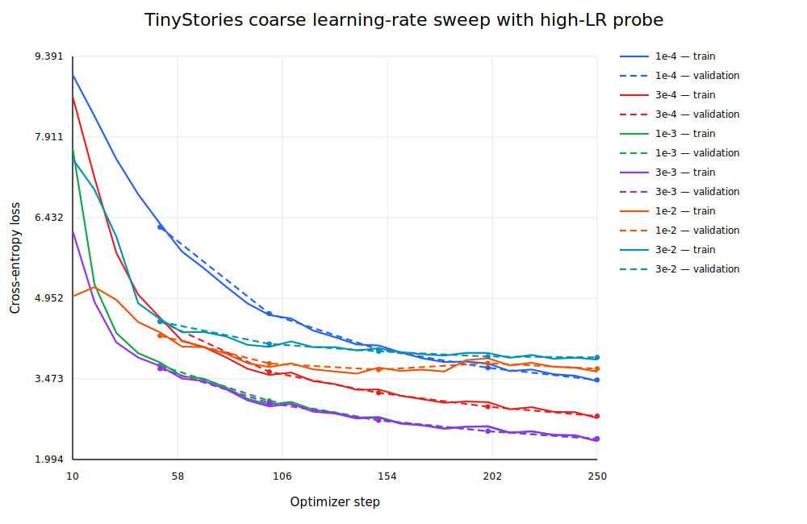

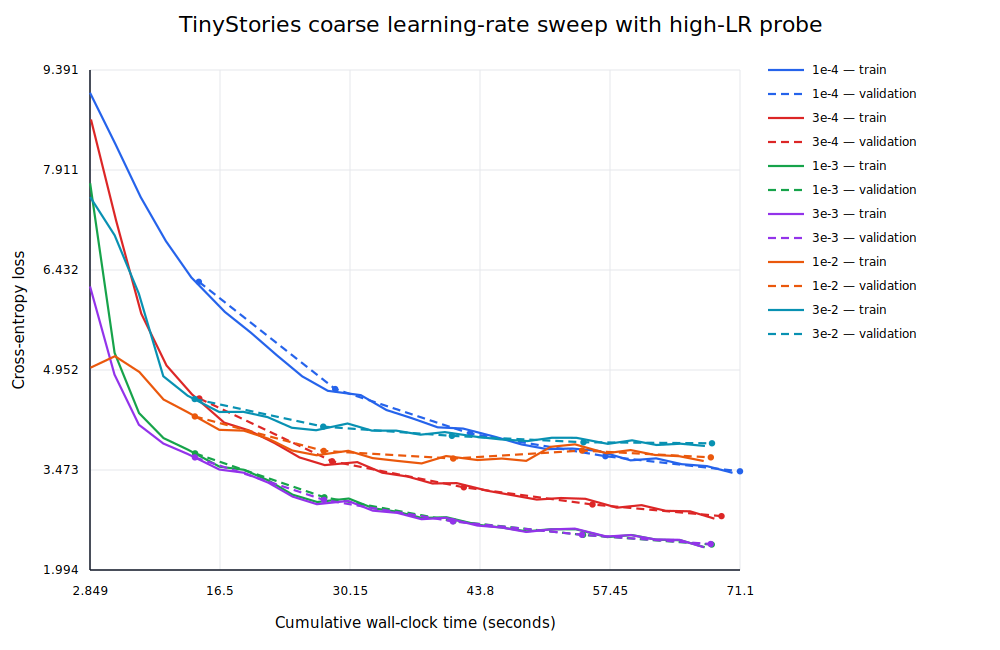

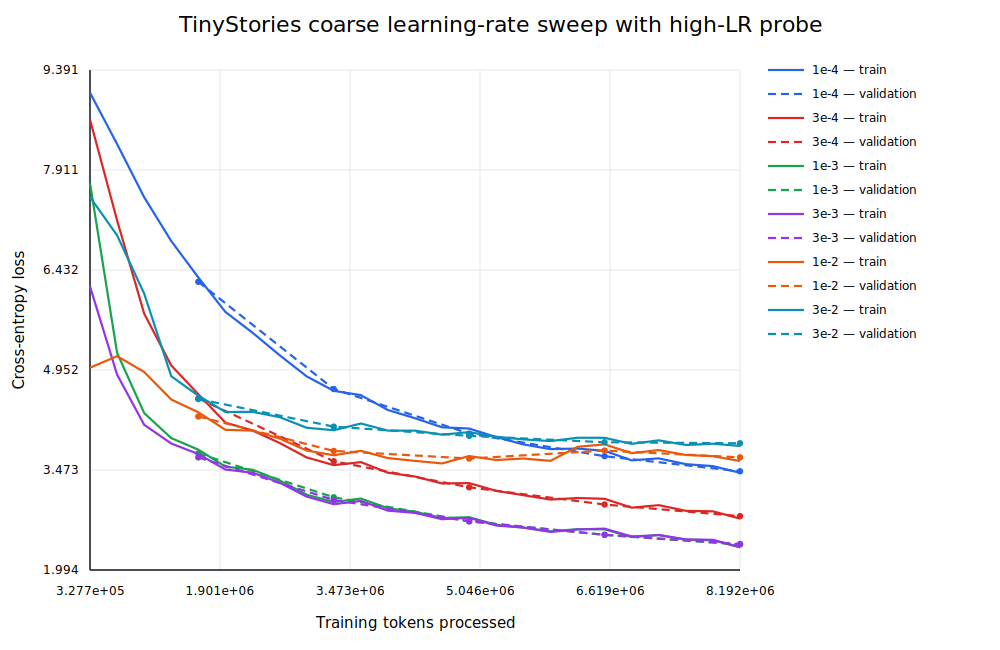

#### 250-step 细扫

粗扫将有效区间定位在 `1e-3`--`3e-3`。我保持模型、batch size、seed、optimizer、20-step
warmup、constant-LR schedule 和验证方式不变，补测 `1.5e-3`、`2e-3` 和 `2.5e-3`。下表同时
列出粗扫的两个区间端点；每个 run 仍只处理 8,192,000 tokens。

| Learning rate | Val@50 | Val@100 | Val@150 | Val@200 | Val@250 | 最终 PPL |
| ---: | ---: | ---: | ---: | ---: | ---: | ---: |
| `1e-3` | 3.7188 | 3.0692 | 2.7166 | 2.5128 | 2.3702 | 10.6998 |
| **`1.5e-3`** | 3.6197 | 2.9593 | 2.6293 | **2.4294** | **2.2935** | **9.9091** |
| `2e-3` | 3.6373 | 2.9981 | 2.6569 | 2.4520 | 2.3081 | 10.0551 |
| `2.5e-3` | **3.5578** | **2.9179** | **2.6160** | 2.4315 | 2.3015 | 9.9893 |
| `3e-3` | 3.6591 | 3.0299 | 2.7122 | 2.5146 | 2.3780 | 10.7830 |

`2.5e-3` 在 steps 50--150 下降最快，`1.5e-3` 则在 step 200 后取得最低 loss。两者在
step 250 只差 0.0081，单次短跑不足以判断这种差异能否延续，因此我没有直接将短跑胜者用于
最终训练，而是让两个候选接受相同的 40.96M-token 中程比较。三个新增 run 的累计墙钟时间为
204.96 s，均未出现 non-finite loss 或 gradient norm。

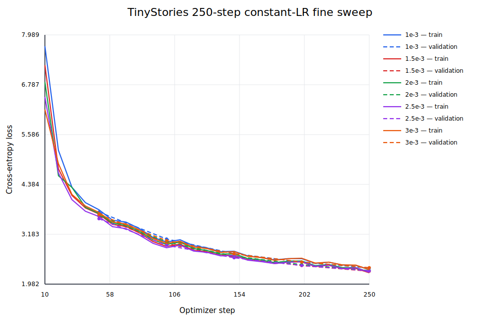

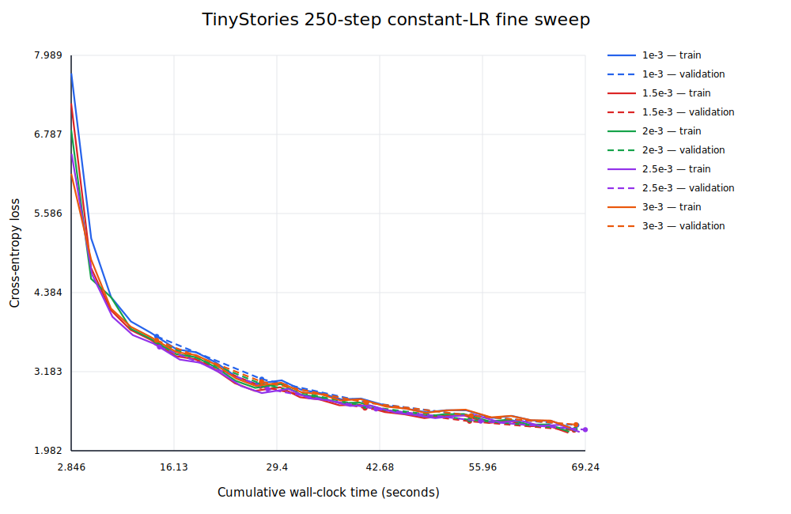

#### 40.96M-token 中程比较

两个中程 run 各执行 1,250 steps，即
`128 batch × 256 context × 1,250 steps = 40,960,000 tokens`。为隔离学习率本身的影响，
两者都在 20-step warmup 后保持 constant LR，使用 seed 336，并每 100 steps 用 10 个随机
validation batches 评估。验证调用会消耗同一随机数生成器的状态，因此这些数值不能与验证频率
不同的 250-step run 逐点配对；两个中程 run 的验证频率和 seed 完全相同，彼此之间仍是公平
对照。

| Step | `1.5e-3` val | `2.5e-3` val | 较低者 |
| ---: | ---: | ---: | :--- |
| 100 | 2.9925 | **2.9473** | `2.5e-3` |
| 300 | **2.2102** | 2.2180 | `1.5e-3` |
| 500 | **1.9836** | 1.9972 | `1.5e-3` |
| 700 | **1.8899** | 1.8976 | `1.5e-3` |
| 900 | 1.8177 | **1.8175** | `2.5e-3` |
| 1,100 | **1.7612** | 1.7620 | `1.5e-3` |
| 1,250 | 1.7262 | **1.7223** | `2.5e-3` |

`1.5e-3` 在 steps 300--800 的多数评估点略低，`2.5e-3` 在最终点以 1.7223 对 1.7262
领先 0.00395。这个差值小于相邻随机验证点的常见波动，不能据此声称 `2.5e-3` 显著优于
`1.5e-3`。在相同预算下，`2.5e-3` 确实给出了最低最终估计；正式训练又会使用 cosine decay
降低后期步长，因此我将 `2.5e-3` 选为 peak learning rate。两个中程 run 分别耗时 330.51 s
和 330.56 s，均稳定完成。

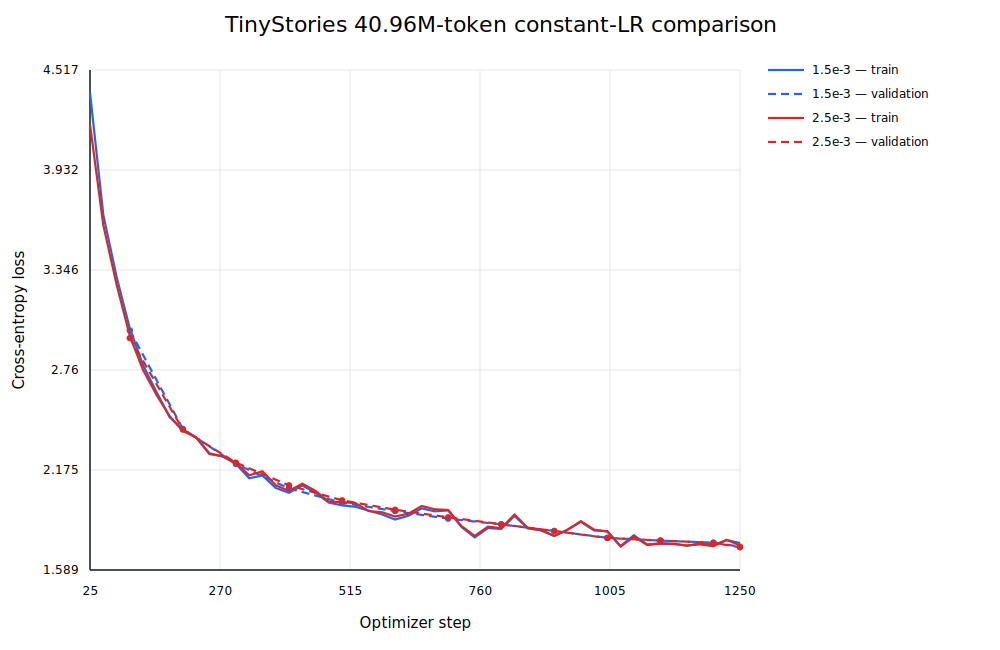

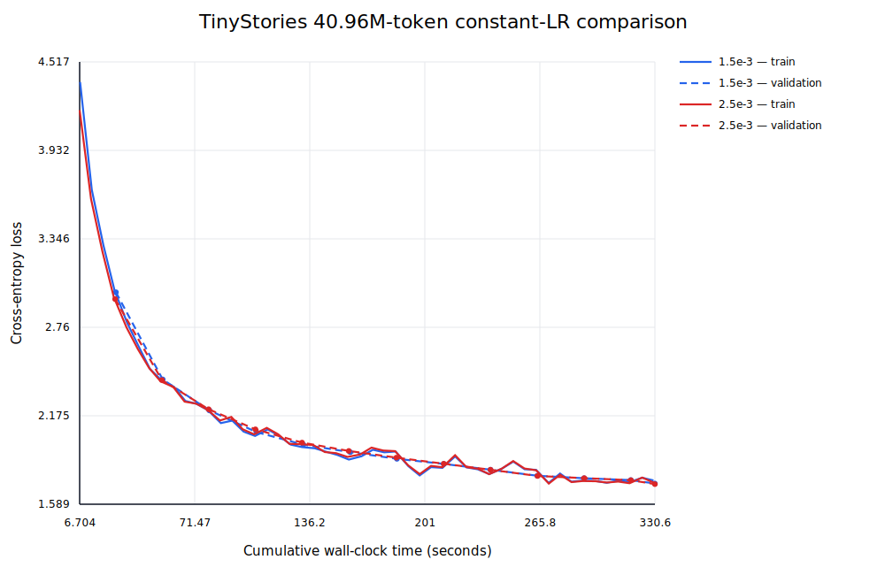

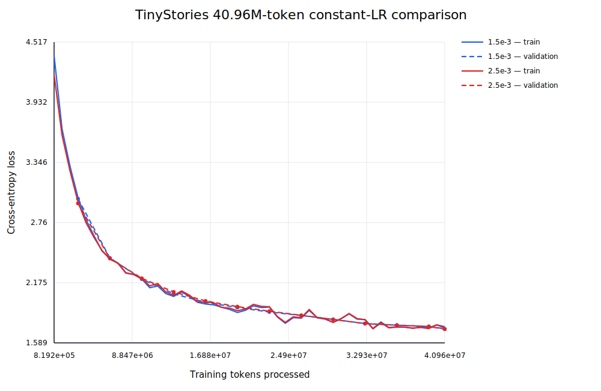

#### 327.68M-token 正式训练

正式模型执行 10,000 optimizer steps：
`128 batch × 256 context × 10,000 steps = 327,680,000 tokens`，与题面规定的总 token
预算一致。模型含 22,696,448 个参数。AdamW 使用
`(beta1,beta2)=(0.9,0.999)`、`epsilon=1e-8`、weight decay 0.01，并将全局 gradient norm
裁剪到 1.0。Learning rate 在前 100 steps 线性 warmup 到 `2.5e-3`，随后进行 cosine decay，
在 step 10,000 到达 `2.5e-4`。训练每 250 steps 使用 10 个随机 validation batches 评估，
每 2,000 steps 保存可恢复 checkpoint。

| 指标 | 结果 |
| :--- | ---: |
| 总 optimizer steps | 10,000 |
| 总 tokens | 327,680,000 |
| 墙钟时间 | 2,657.92 s（44.30 min） |
| 最终 train loss | 1.2641 |
| 最终 validation loss | **1.3442** |
| 最终 validation perplexity | 3.8352 |
| 最佳采样 validation loss | **1.3379**（step 9,500） |
| 最佳采样 validation perplexity | 3.8109 |

模型在 step 5,250 首次达到 validation loss 1.4466，低于题目要求的 1.45；此后最近的多个
验证点继续低于门槛。最终 checkpoint 的 validation loss 为 1.3442，而全程最低的随机验证估计
为 step 9,500 的 1.3379。报告同时保留这两个数字：前者对应实际提交 checkpoint，后者描述训练
曲线中的最佳观测值。完整日志包含 100 个 train records、40 个 validation records、一个
session start 和一个 session end，没有 divergence、NaN 或 infinity 记录。五个约 260 MiB 的
checkpoint 和原始训练日志只保存在本地 `artifacts`，不进入 Git 提交。

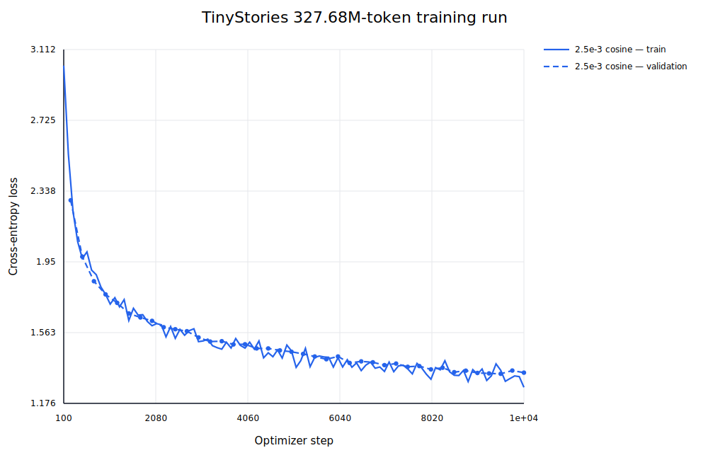

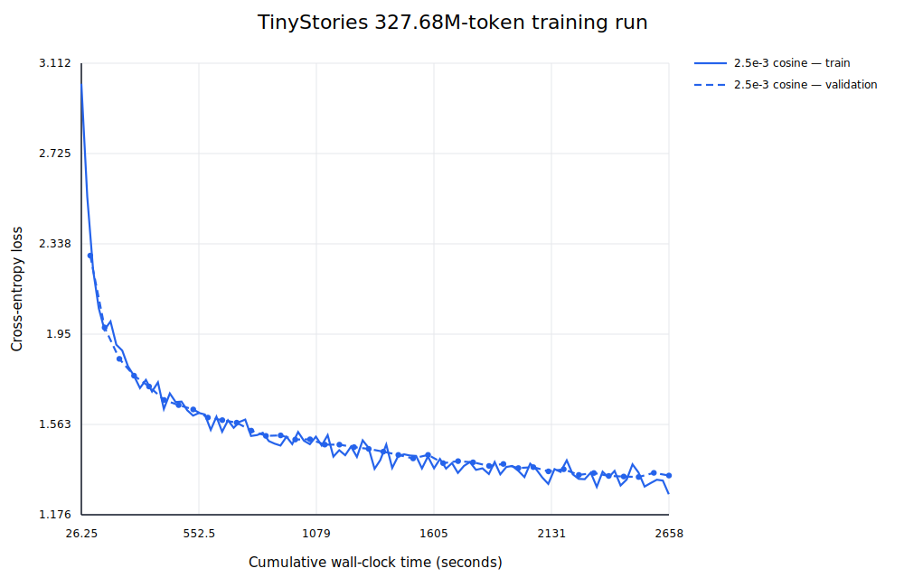

#### 稳定性边界与发散实验

为回答题目关于 “edge of stability” 的问题，我在相同的 250-step、20-step warmup、
constant-LR 设置下继续提高学习率。这里将“发散”定义为优化轨迹的 loss 爆炸，而不是只将
NaN/inf 视为发散；gradient clipping 可以让数值保持有限，却不能把已经失控的优化轨迹变回
收敛轨迹。

| Learning rate | Val@50 | Val@100 | Val@150 | Val@200 | Val@250 | 最大裁剪前 gradient norm | 行为 |
| ---: | ---: | ---: | ---: | ---: | ---: | ---: | :--- |
| `3e-2` | 4.5226 | 4.1146 | 3.9780 | 3.8835 | 3.8683 | 4.14 | 高 loss 平台 |
| `1e-1` | 5.3351 | 4.8528 | 4.6498 | 4.5293 | 4.5687 | 13.18 | 严重退化 |
| `3e-1` | 13.4112 | 8.4285 | 6.8093 | 6.0641 | 5.7044 | 26.44 | 严重退化 |
| `1e0` | 623.6078 | 248.0167 | 438.8826 | 462.4288 | 233.2550 | 291.76 | **优化发散** |
| `3e0` | 1901.5251 | 3777.4842 | 2764.2842 | 2349.7269 | 2163.3935 | 662.77 | **优化发散** |

`1.0` 和 `3.0` 的 loss 相对正常训练高出两到三个数量级，且不随训练步数稳定下降；`3.0` 的
validation perplexity 已超过 double-precision `exp` 的可表示范围。两条曲线都构成明确的
divergent runs，尽管全局 norm clipping 使参数更新保持有限，没有生成 NaN/inf。

本模型的最佳 peak LR 为 `2.5e-3`。当 LR 增加到 `1e-2` 时，最终 loss 已从约 2.30 恶化到
3.66；`3e-2`--`3e-1` 落入更差的平台，`1.0` 以上才出现 loss 爆炸。因此最佳 LR 位于稳定
区域的高端，但不是紧贴我们观测到的数值发散点。实验中的梯度裁剪把“浮点数变成非有限值”的
边界推得很远，同时并未消除过大 LR 带来的优化失效。这说明 edge of stability 取决于 optimizer、
warmup 和 clipping 等完整训练配置，不能只用一个裸学习率比值描述。

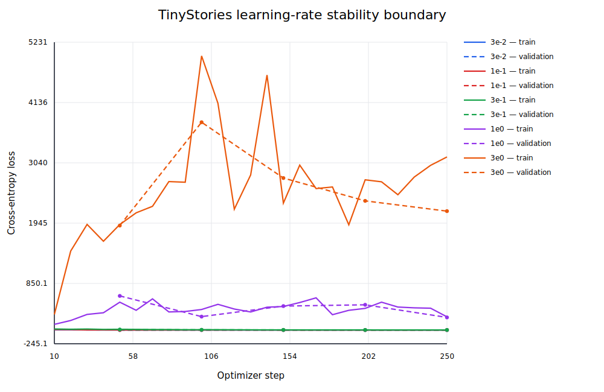

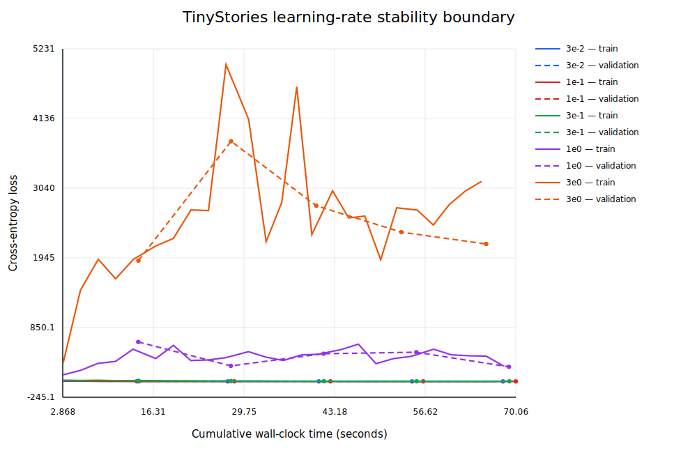

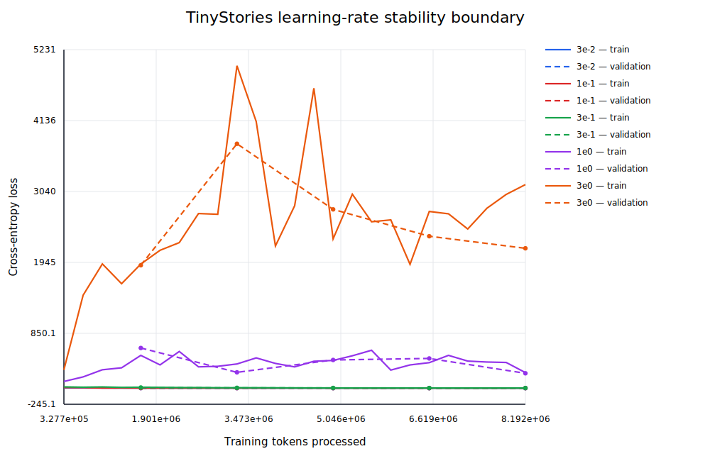

#### Batch-size experiment：阶段一、二与三

我将 batch-size 实验拆成三个阶段，并把每个 run 的训练 token 预算固定为
8,192,000，而不是让所有 batch 都跑相同的 optimizer steps。这样 batch 1、8、32、64、128
和 160 在比较 validation loss 时都看过相同数量的训练数据。训练集和验证集使用不同的随机
数生成器；验证固定使用 batch size 128、10 个 batches 和 seed 2026，因此不同训练 batch
在同一 processed-token 位置评估的是完全相同的 validation windows。

阶段一固定使用 `LR=2.5e-3`。每个 run 的 steps 分别为 32,000、4,000、1,000、500、250
和 200；验证点按 processed tokens 对齐。结果如下：

| Batch size | Steps | Tokens/s | Val@1.6384M | Val@3.2768M | Val@4.9152M | Val@6.5536M | Val@8.192M |
| ---: | ---: | ---: | ---: | ---: | ---: | ---: | ---: |
| 1 | 32,000 | 11,270 | 3.4297 | 3.3388 | 3.2125 | 3.1536 | 3.0371 |
| 8 | 4,000 | 63,289 | 3.0232 | 2.8869 | 2.8112 | 2.7844 | 2.7535 |
| 32 | 1,000 | 117,360 | 2.9210 | 2.6277 | 2.5151 | 2.4372 | 2.4078 |
| 64 | 500 | 139,668 | 3.0886 | 2.6480 | 2.4680 | 2.3486 | **2.2535** |
| 128 | 250 | **146,997** | 3.5611 | 2.9312 | 2.6106 | 2.4332 | 2.3046 |
| 160 | 200 | 138,017 | 3.9359 | 3.3159 | 2.9050 | 2.6510 | 2.4753 |

固定 LR 下，batch 64 在相同 token 预算中取得最低最终 loss。batch 1 的吞吐只有
11,270 tokens/s，batch 128 达到 146,997 tokens/s；batch 160 反而下降到 138,017，说明
当前 GPU 上 batch 128 已接近完整训练链路的吞吐甜点。validation loss 没有随 batch 单调
下降：batch 128/160 每个 epoch 的 optimizer update 更少，在 8.192M-token 短预算内没有
充分利用较稳定的梯度。

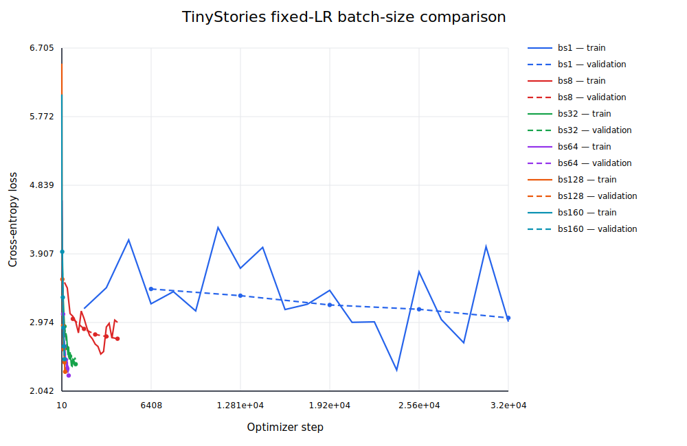

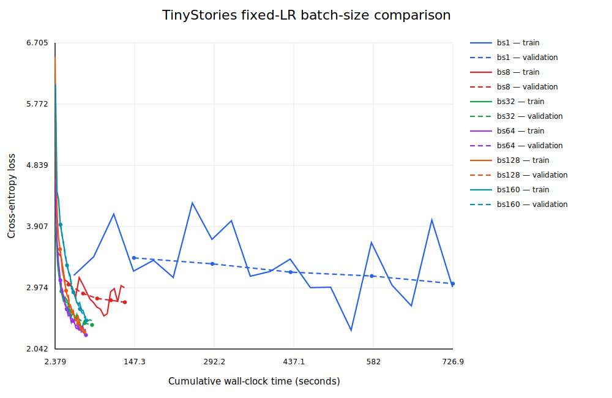

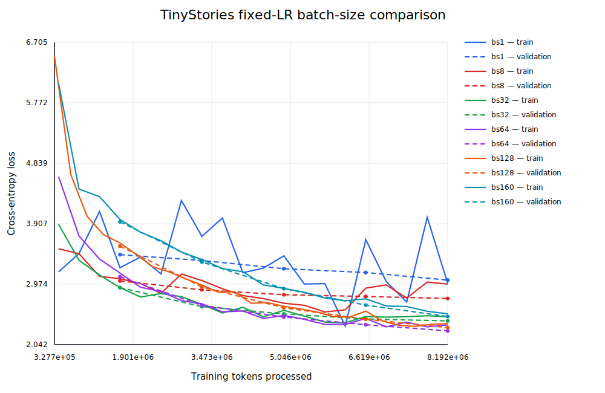

阶段二只对异常的 batch 1 做局部学习率 scout，每个 run 处理 1,638,400 tokens：

| Batch | LR | Val@1.6384M | 最大裁剪前 gradient norm |
| ---: | ---: | ---: | ---: |
| 1 | `2.5e-3` | 3.4297 | 123.29 |
| 1 | `1.25e-3` | 3.1786 | 3.93 |
| 1 | `6.25e-4` | **2.8633** | 2.13 |

降低 batch 1 的 LR 显著改善结果，并消除了频繁的梯度尖峰。这个结果说明阶段一中 batch 1
的劣势不能简单解释为“小 batch 天生更差”；学习率与梯度噪声的失配是重要原因。

阶段三检验两种正向 learning-rate scaling rule。以 batch 128、`2.5e-3` 为锚点：

\[
\eta_{\mathrm{sqrt}}(B)=2.5\times10^{-3}\sqrt{B/128},\qquad
\eta_{\mathrm{linear}}(B)=2.5\times10^{-3}(B/128).
\]

| Batch | Rule | LR | Val@1.6384M | Val@3.2768M | Val@4.9152M | Val@6.5536M | Val@8.192M |
| ---: | :--- | ---: | ---: | ---: | ---: | ---: | ---: |
| 8 | fixed | `2.5e-3` | 3.0232 | 2.8869 | 2.8112 | 2.7844 | 2.7535 |
| 8 | sqrt | `6.25e-4` | 2.7467 | 2.4424 | 2.2807 | 2.1871 | **2.1061** |
| 8 | linear | `1.5625e-4` | 3.0846 | 2.6864 | 2.4982 | 2.3717 | 2.2734 |
| 32 | fixed | `2.5e-3` | 2.9210 | 2.6277 | 2.5151 | 2.4372 | 2.4078 |
| 32 | sqrt | `1.25e-3` | 2.8755 | 2.5135 | 2.3377 | 2.2297 | 2.1449 |
| 32 | linear | `6.25e-4` | 3.0273 | 2.5941 | 2.3956 | 2.2712 | 2.1701 |

平方根缩放在两个代表性 batch 上都优于固定 LR 和线性缩放：batch 8 的最终 loss 从
2.7535 降至 2.1061，batch 32 从 2.4078 降至 2.1449。线性缩放也改善了固定 LR，但在
batch 8 上仍比平方根规则高 0.1673；它把学习率降得过低，更新过于保守。对于当前
mean-reduced cross-entropy 和 AdamW，这组结果支持平方根缩放作为比线性缩放更实用的起点，
但不构成对所有模型规模的普适定律。

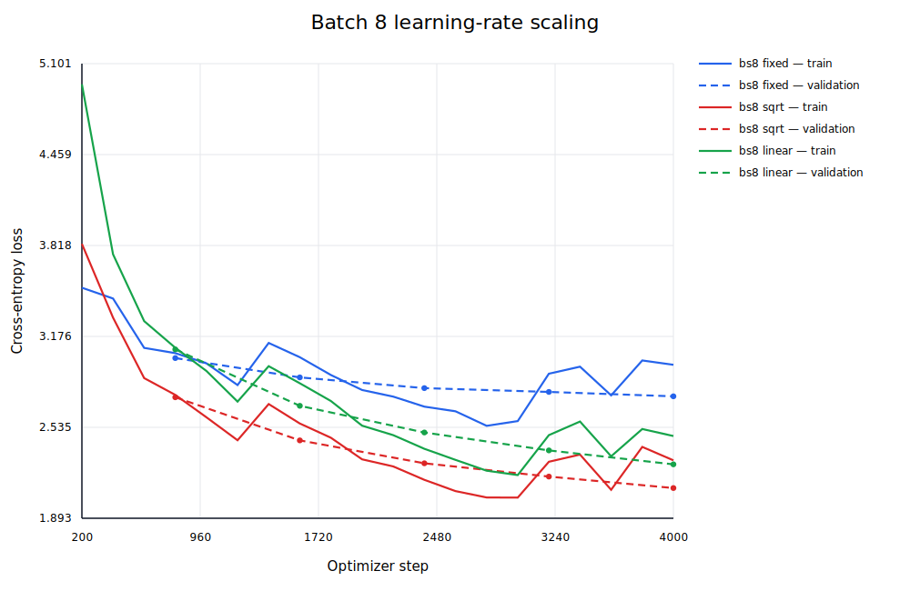

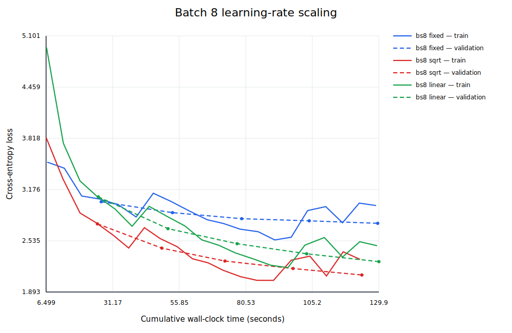

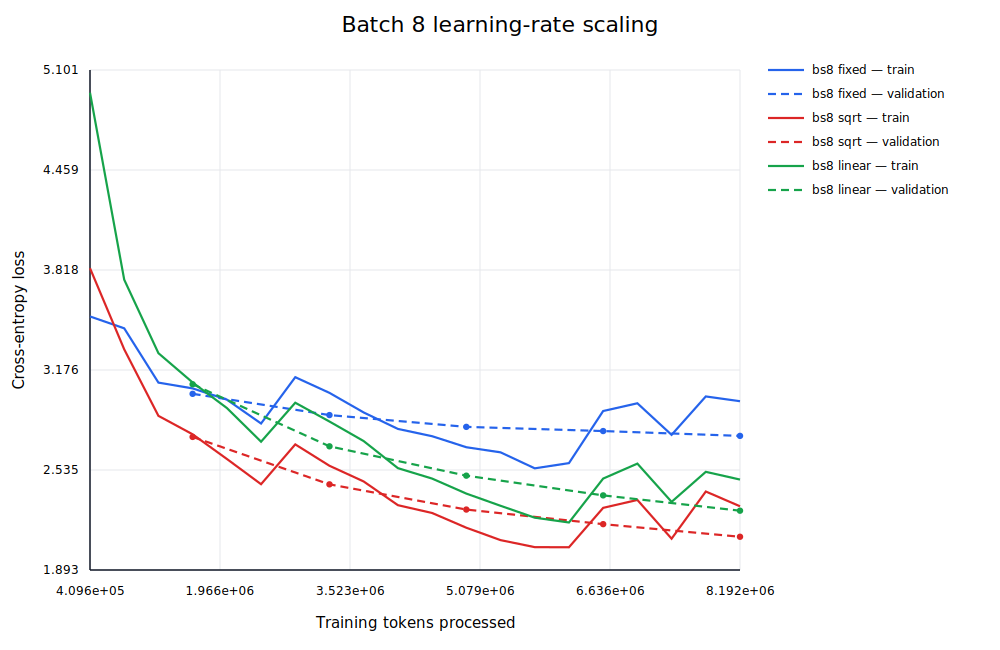

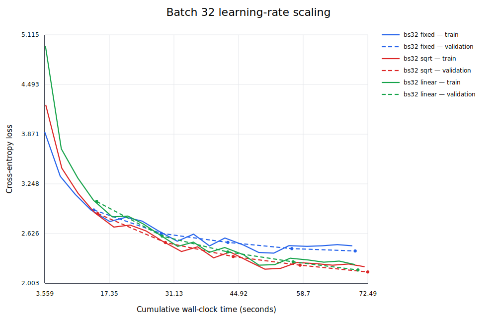

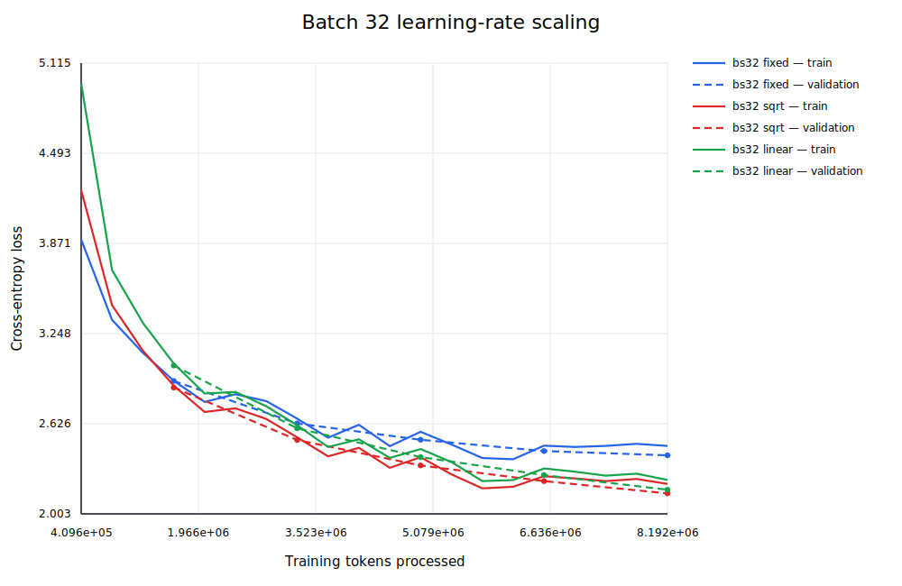

三阶段共运行 12 个新实验，累计 wall time 为 1,790.52 s（约 29.84 min）。这组实验的结论需要
区分两个目标：若只追求固定 LR 和固定 token 预算下的最终 loss，batch 64 最好；若同时考虑
小 batch 的学习率重调，batch 8 的 sqrt scaling 在 8.192M tokens 后达到 2.1061；若追求
硬件吞吐，batch 128 最快，但它在短 token 预算中的 validation loss 并非最低。大 batch 的
优势主要体现在矩阵乘法效率和梯度方差，而不是在任何固定 token 预算下都必然得到更低 loss。

### 7.3.1 RMSNorm 消融

基线模型使用 pre-norm Transformer，并在每个 block 的 attention、FFN 前以及模型输出端
使用 RMSNorm。为了完成题目要求的 layer-normalization ablation，我在
`TransformerBlock` 和 `TransformerLM` 中加入 `use_rmsnorm` 开关；`--no-rmsnorm` 模式会
真正移除所有 RMSNorm 参数，而不是保留层后将输出置零。基线参数量为 22,696,448；移除
4 层 × 2 个 block norm 和 1 个 final norm 后，no-RMSNorm 参数量为 22,691,840，恰好少
4,608 个参数。

我在 TinyStories 上进行 40.96M-token 对照，固定 batch size 128、seed 336、验证 batch
size 128、验证 seed 2026、100-step warmup 和 1,250-step cosine decay。先使用前一节找到的
peak LR `2.5e-3`，再对 no-RMSNorm 尝试 `1e-3` 和 `3e-4`。

| Model | Peak LR | Status | Divergence step | Final validation loss | 最大裁剪前 gradient norm |
| :--- | ---: | :--- | ---: | ---: | ---: |
| Baseline + RMSNorm | `2.5e-3` | completed | — | **1.6635** | 1.19 |
| No RMSNorm | `2.5e-3` | **diverged** | **193** | — | 278,494.66 |
| No RMSNorm | `1e-3` | completed | — | 1.8089 | 14.04 |
| No RMSNorm | `3e-4` | completed | — | 2.1537 | 10.13 |

在原先对 baseline 稳定的 `2.5e-3` 下，no-RMSNorm 在 step 150 时 train loss 仍为 2.6543，
到 step 175 突然升至 1,368.98，裁剪前 gradient norm 达到 278,494.66，最终在 step 193
记录 non-finite gradient norm 并终止。Gradient clipping 限制了实际参数更新，但无法阻止
没有归一化的 residual stream 继续放大；因此“梯度被裁剪”不等于“训练已经稳定”。

降低 peak LR 到 `1e-3` 后，no-RMSNorm 完整跑过 40.96M tokens，最终 validation loss
为 1.8089；这比 baseline 高 0.1454，但比 `3e-4` 的 2.1537 低 0.3448。`3e-4` 没有
发散，却在相同 token 预算内学习过慢。这个结果回答了题面两个问题：删除 RMSNorm 会显著
缩小可用学习率范围，而降低 LR 可以恢复数值稳定性，但不能完全恢复 baseline 的收敛效率。

RMSNorm 的作用不是简单增加参数。它在每个 residual 子层前控制 activation scale，使 Q/K
的幅度、attention logits、SwiGLU 输入和反向梯度处于更容易优化的范围。保留 RMSNorm 的
模型可以在 `2.5e-3` 下稳定训练；删除它后必须退到约 `1e-3` 才能保持稳定，而且最终 loss
仍然更高。这个对照把“稳定性”和“表达能力”区分开来：no-RMSNorm 不是完全没有学习能力，
而是失去了原架构提供的尺度控制。

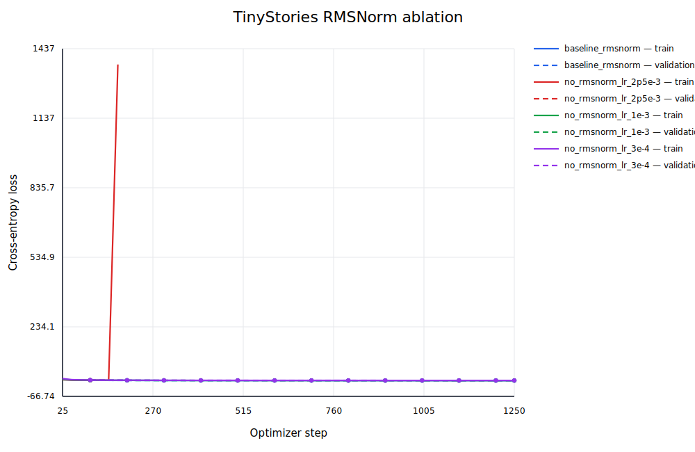

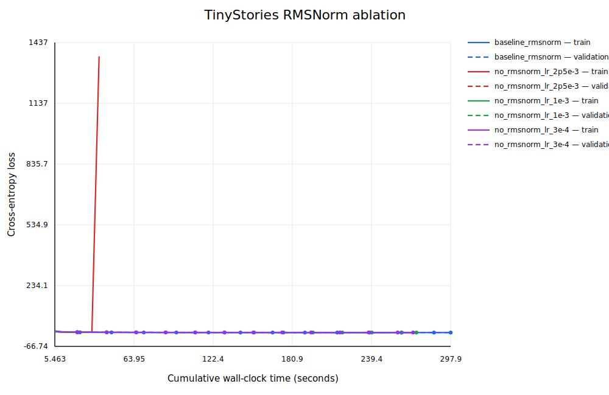

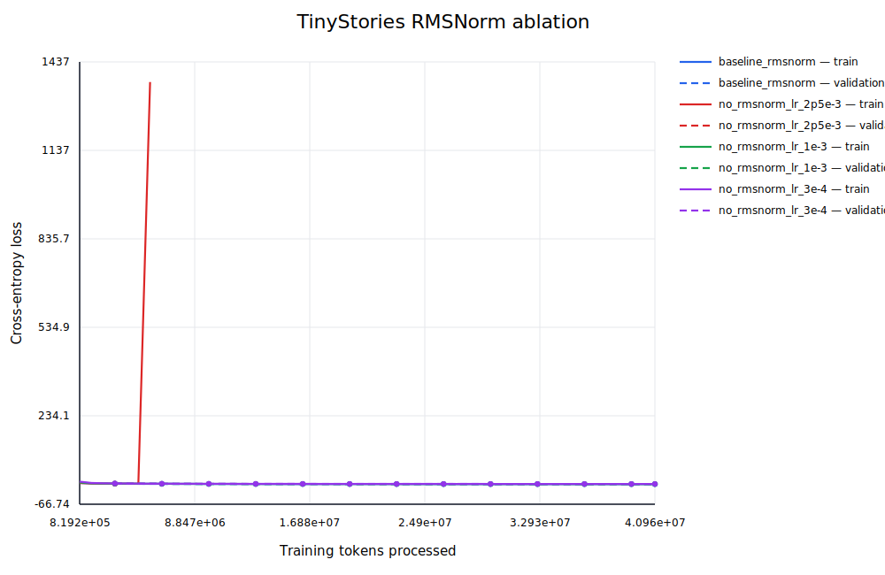

### 7.3.2 Pre-norm 与 Post-norm

基线 block 使用 pre-norm：

\[
z=x+\operatorname{Attention}(\operatorname{RMSNorm}(x)),\qquad
y=z+\operatorname{FFN}(\operatorname{RMSNorm}(z)).
\]

我在 `TransformerBlock` 中加入 `pre_norm` 开关；默认值为 `True`，`--post-norm` 则切换为：

\[
z=\operatorname{RMSNorm}(x+\operatorname{Attention}(x)),\qquad
y=\operatorname{RMSNorm}(z+\operatorname{FFN}(z)).
\]

两种模型使用完全相同的 22,696,448 参数、batch size 128、seed 336、固定 validation
windows、40.96M tokens、peak LR `2.5e-3`、100-step warmup 和 1,250-step cosine decay。

| Architecture | Step 100 val | Step 300 val | Step 600 val | Step 1,000 val | Final val |
| :--- | ---: | ---: | ---: | ---: | ---: |
| Pre-norm | 2.9863 | **2.1824** | **1.8911** | **1.7087** | **1.6635** |
| Post-norm | **2.8758** | 2.2074 | 1.9230 | 1.7254 | 1.6756 |

Post-norm 在前 200 steps 的 validation loss 略低，说明在这次短 warmup 和固定 seed 下它的
初期下降并不差；step 300 后 pre-norm 反超，并在最终点以 1.6635 对 1.6756 领先 0.0121。
两者都完成 1,250 steps，没有出现 NaN、inf 或梯度爆炸，因此本实验没有复现“post-norm
必然发散”的极端情形。结果支持更谨慎的结论：post-norm 在本模型和 40.96M-token 预算下
可以稳定训练，但 pre-norm 的后期收敛略好。

实现上的差异解释了这种行为。Pre-norm 的 residual stream 保留了更直接的 identity path：

\[
x_{l+1}=x_l+f_l(\operatorname{RMSNorm}(x_l)).
\]

Post-norm 则把 residual sum 放进 normalization：

\[
x_{l+1}=\operatorname{RMSNorm}(x_l+f_l(x_l)).
\]

因此 post-norm 的梯度还要经过每个 residual sum 后的 RMSNorm；pre-norm 更容易在深层网络
中保持稳定的梯度通路。我们的 4-layer TinyStories 模型较浅，post-norm 的差距只有 0.0121；
在更深的 Transformer 或更长训练中，梯度路径和初始化差异可能会被放大。这个实验也提醒我们，
不能只根据早期 validation loss 宣布某种 norm placement 更优，至少要比较完整 token 预算下的
曲线。

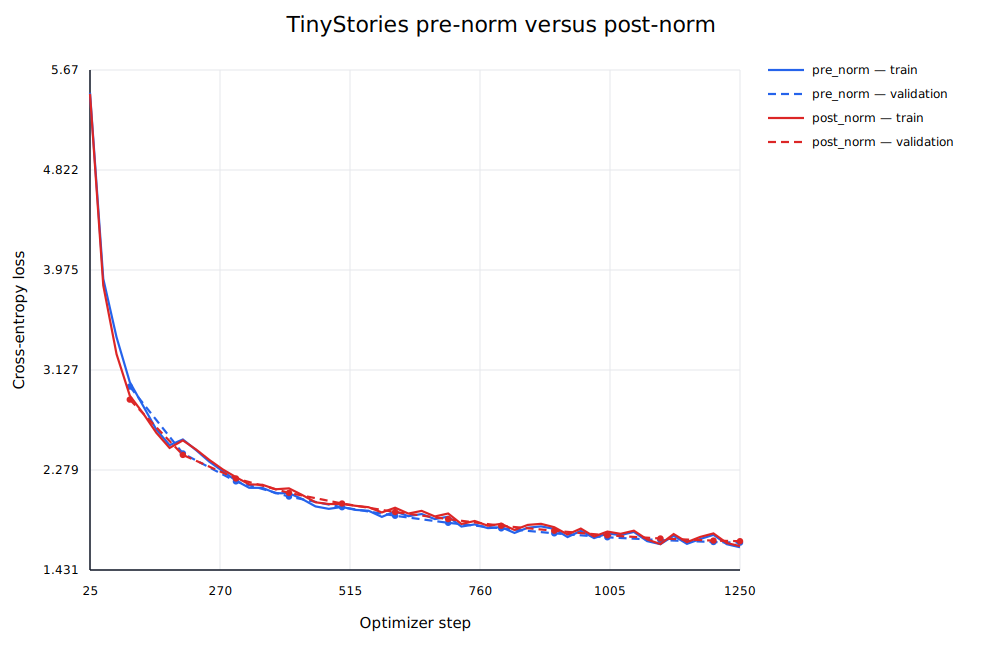

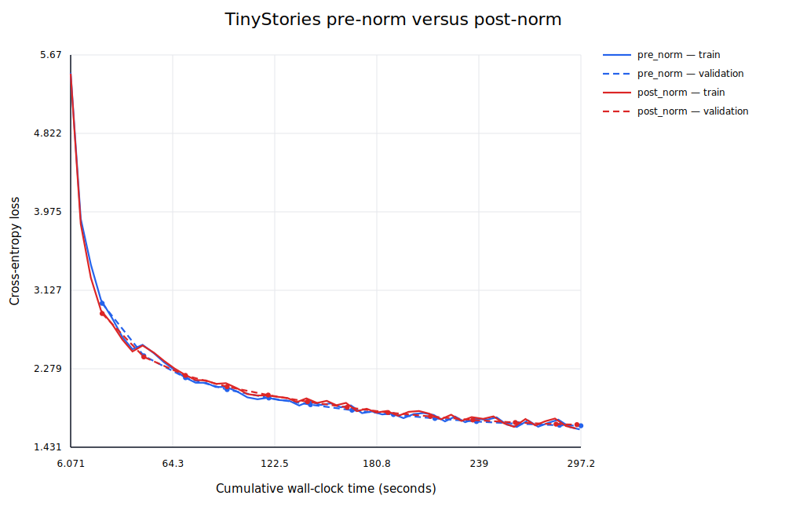

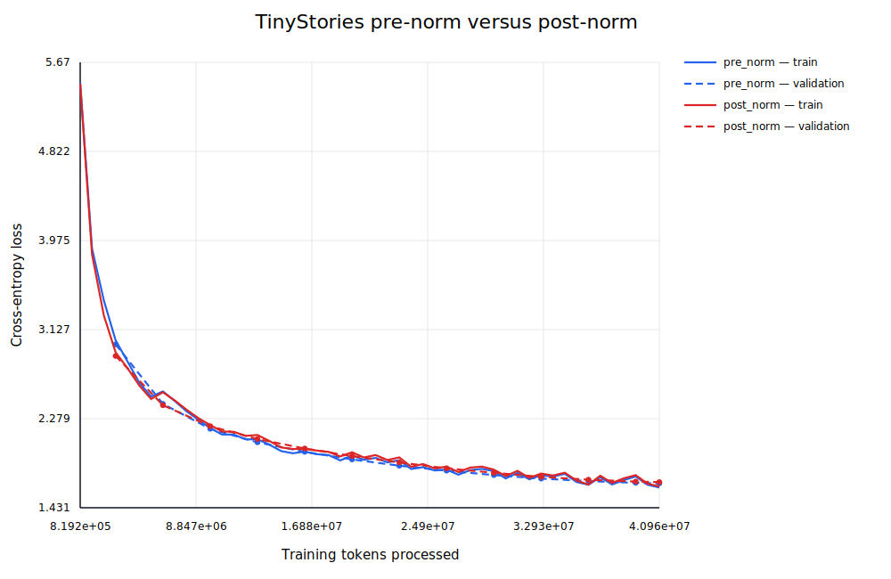

### 7.3.3 RoPE 与 NoPE

当前 attention 对 Q、K 应用 RoPE：

\[
Q'=\operatorname{RoPE}(Q,p),\qquad K'=\operatorname{RoPE}(K,p).
\]

NoPE 消融通过 `TransformerLM(..., use_rope=False)` 和训练脚本的 `--no-rope` 开关实现；
它只跳过 Q/K 的旋转，不删除 causal mask。因果 mask 仍然满足
`key_position <= query_position`，所以 NoPE 模型依旧不能看到未来 token。

我使用相同的 22,696,448 参数、batch size 128、seed 336、固定 validation windows、
40.96M tokens、peak LR `2.5e-3`、100-step warmup 和 1,250-step cosine decay 比较 RoPE
和 NoPE：

| Architecture | Step 100 val | Step 300 val | Step 600 val | Step 1,000 val | Final val |
| :--- | ---: | ---: | ---: | ---: | ---: |
| **RoPE** | **2.9863** | **2.1824** | **1.8911** | **1.7087** | **1.6635** |
| NoPE | 3.4416 | 2.4481 | 2.0265 | 1.8140 | 1.7637 |

NoPE 在 step 100 时比 RoPE 高 0.4553；随着训练进行，差距逐渐缩小到最终的 0.1003，
但在整个 40.96M-token budget 内都没有追平 RoPE。两组都稳定完成，没有 NaN/inf 或梯度
爆炸。NoPE 吞吐约 157k tokens/s，高于 RoPE 的约 146k tokens/s，因为它省去了 RoPE 的
缓存索引和旋转计算；这点速度收益没有抵消 validation loss 的差距。

NoPE 并非完全没有位置线索。Causal mask 使不同 query position 看到不同长度的历史：位置 0
只能关注自己，位置 10 可以关注 0--10。因此模型可以从可见前缀结构中间接推断部分位置信息，
这解释了 NoPE 仍然能够持续学习。RoPE 则在每个位置直接改变 Q/K 的二维旋转角度，attention
score 可以利用相对位置差异；它减少了模型自行从 mask 结构中恢复位置关系的负担，所以在本次
短训练中收敛更快、最终 loss 更低。

这个结果也说明“因果 mask 本身带有位置线索”与“显式位置编码有用”并不矛盾：NoPE 能训练，
证明 mask 提供了部分信息；RoPE 更低的 loss，说明显式相对位置信息仍然改善了 next-token
预测。TinyStories 的短故事让 NoPE 的损失差距没有扩大到完全失效，但在更长上下文或更复杂
的 OpenWebText 中，RoPE 的优势可能更明显。

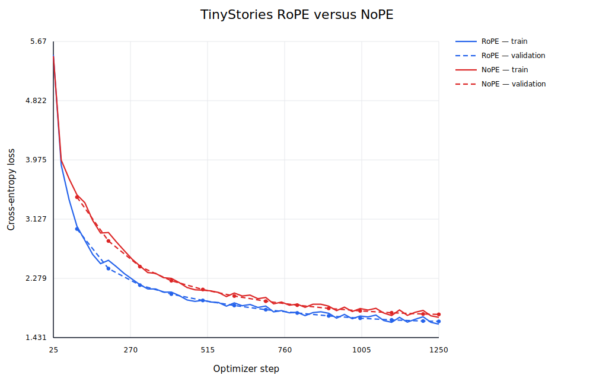

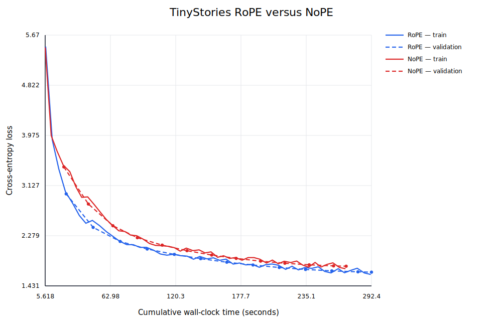

### 7.3.4 SwiGLU 与参数量匹配的 SiLU FFN

最后一个 7.3 消融比较 FFN 中的门控是否有用。当前 SwiGLU 为：

\[
\operatorname{SwiGLU}(x)=W_2\left(\operatorname{SiLU}(W_1x)\odot W_3x\right).
\]

对照模型去掉 gate，使用：

\[
\operatorname{FFN}_{\mathrm{SiLU}}(x)=W_2\operatorname{SiLU}(W_1x).
\]

如果两种模型直接使用相同的 `d_ff=1344`，SiLU 会因为只有两组矩阵而拥有更少参数，比较
会混合“门控作用”和“模型容量”两个因素。根据题面，我为 SiLU 设置
`d_ff=4*d_model=2048`，而 SwiGLU 保持 `d_ff=1344`：

| FFN | Internal d_ff | FFN 参数/层 | 完整模型参数 |
| :--- | ---: | ---: | ---: |
| SwiGLU | 1,344 | 2,064,384 | 22,696,448 |
| SiLU | 2,048 | 2,097,152 | 22,827,520 |

完整模型只相差 131,072 个参数（约 0.58%），因此 SiLU 对照实际上略宽，而不是因为参数少
而处于劣势。两种模型使用相同的 40.96M-token 预算、batch size 128、seed 336、固定
validation windows、peak LR `2.5e-3`、100-step warmup 和 1,250-step cosine decay。

| FFN | Step 100 val | Step 300 val | Step 600 val | Step 1,000 val | Final val |
| :--- | ---: | ---: | ---: | ---: | ---: |
| **SwiGLU** | **2.9863** | **2.1824** | **1.8911** | **1.7087** | **1.6635** |
| SiLU, `d_ff=2048` | 3.0866 | 2.2606 | 1.9299 | 1.7338 | 1.6859 |

SwiGLU 在所有记录点都略低，最终 validation loss 比 SiLU 低：

\[
1.6859-1.6635=0.0224.
\]

差距不大，但它不是参数量不足造成的：SiLU 的完整模型参数量反而多 0.58%。在相同训练
预算下，额外的 `W_3x` 分支为 SwiGLU 提供了输入依赖的 gate：一条分支产生候选特征，另一条
分支决定这些特征在每个维度上通过多少。普通 SiLU 只有固定的两层非线性变换，不能执行同样
的逐元素动态调制。

这个结果支持“gating 有实际收益”，但收益小于 RMSNorm 和 RoPE 消融中观察到的差异：
RMSNorm 被删除时原 LR 会在 step 193 发散，NoPE 的最终 loss 高 0.1003，而 SiLU 对照只高
0.0224。TinyStories 简单、模板化的文本使普通 SiLU 也能学到大部分模式；在更复杂数据或
更大模型中，SwiGLU 的条件化特征选择可能更有价值。这里的结论范围限定在当前参数匹配、
40.96M-token TinyStories 实验，不能直接推广为所有 FFN 设置下的固定收益。

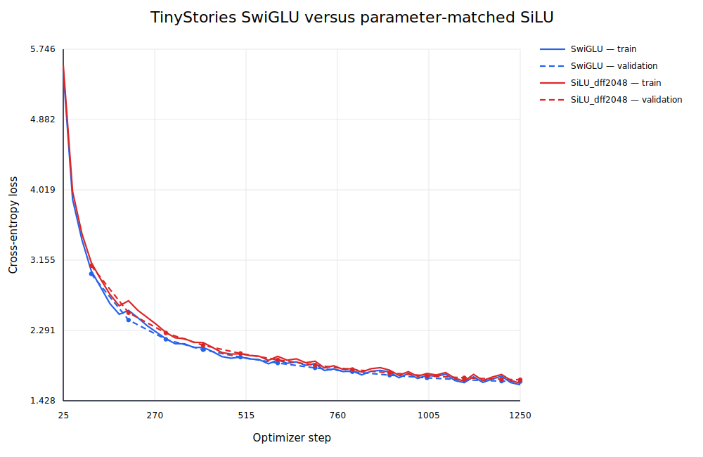

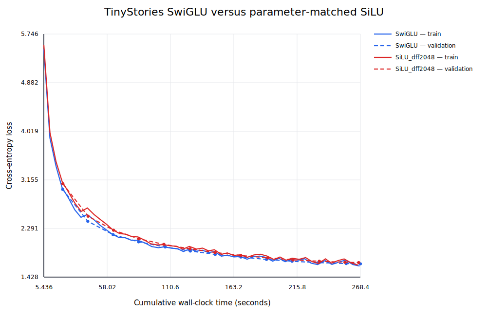

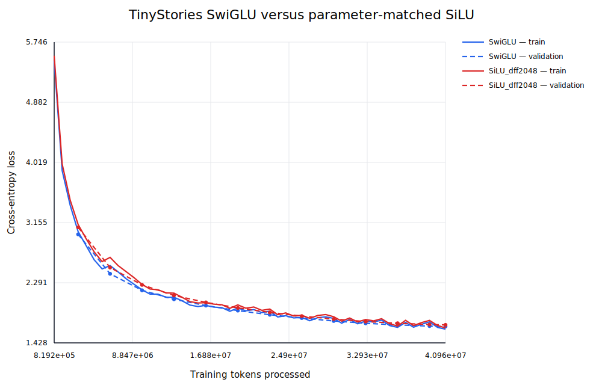

#### TinyStories 正式文本生成

我使用 step 10,000 的正式 checkpoint（最终 validation loss 1.3442）和训练集上学习的 10K
TinyStories tokenizer 进行自回归生成。三组实验固定 prompt、模型、checkpoint 和随机种子
336，只改变 temperature 与 top-p；每组最多生成 320 个新 tokens。三份样本都在达到上限前
采到 `<|endoftext|>`，分别生成 178、146 和 144 个新 tokens，符合题目允许的“生成至少
256 tokens，或在此之前遇到第一个 EOS”条件。

| Sampling | Temperature | Top-p | 新 tokens | 停止原因 | 观察 |
| :--- | ---: | ---: | ---: | :--- | :--- |
| Conservative | 0.6 | 0.85 | 178 | EOS | 句法稳定，但重复 `ball/balloon` 和 `up, up, up` |
| **Balanced** | **0.8** | **0.90** | **146** | **EOS** | 人物、地点、事件和结尾最一致 |
| Diverse | 1.0 | 0.95 | 144 | EOS | 更多措辞变化，但出现 hall/gym 场景漂移和不自然搭配 |

主交付采用平衡采样，prompt 共 13 tokens，输出如下：

> Once upon a time, there was a little girl named Lily. She was a happy girl who loved to play
> outside. One day, she went to the park with her mom and dad. They brought a big cooler with
> them. Lily was very excited to play on the swings and slide.
>
> While playing, Lily saw a new friend named Tim. Tim was also going to the park. They played
> together and had so much fun. Tim showed Lily his cooler, and they became best friends. They
> played all day and shared the snacks from the cooler.
>
> When it was time to go home, Lily and Tim said goodbye. They promised to play together again
> soon. Lily went home with her mom and dad, happy to have had a new friend and a fun day at the
> park.

这份文本在局部语法和整体结构上都较流畅：故事保持 Lily、Tim、park 和 cooler 四个核心
实体，依次完成“到公园—认识朋友—一起玩—告别回家”的事件链，并在 EOS 前形成自然结尾。
它仍有小模型特征，例如 “Tim was also going to the park” 信息量较低，cooler 被重复提及，人物
动机和冲突也很简单；但没有明显的语法崩坏或跨段实体冲突。

采样参数是第一个直接影响因素。降低 temperature 并收紧 top-p 会集中概率质量，保守样本的
句子更可预测，却反复生成 ball、balloon 和 “up, up, up”；提高到 temperature 1.0、top-p
0.95 后，候选集合扩大，文本引入 hall、catch 和 gym 等更多内容，同时出现 “did a good job on
the big hall” 这种不自然搭配和地点漂移。`0.8/0.9` 在本次固定 seed 对照中取得了较好的连贯性
与多样性平衡。

模型训练程度与数据域是第二个因素。该 checkpoint 处理了 327.68M TinyStories tokens，最终
validation loss 为 1.3442，因此已经掌握儿童故事中常见的人名、家庭成员、简单活动和收束式
结尾；训练语料本身句法简单、情节模板化，也限制了生成内容的复杂度。模型容量和 256-token
context window 进一步约束长程一致性。本次三份样本都在总长度达到 256 tokens 前遇到 EOS，
没有触发滑动窗口截断；若生成更长文本，最早的 prompt 和事件会离开模型输入，跨段一致性通常
会更难保持。

### 7.4 OpenWebText 正式训练

第 7.4 节要求在 OpenWebText（OWT）上使用与 TinyStories 相同的模型架构和总训练 iterations，
并比较两种数据分布下的 loss 与生成质量。OWT 使用独立训练的 32K byte-level BPE tokenizer；
因此模型的 `vocab_size` 从 TinyStories 的 10,000 改为 32,000，Transformer 主体保持不变：
`context_length=256`、`d_model=512`、4 层、16 heads、`d_ff=1344`、RoPE 和 SwiGLU。最终
实验使用 `batch_size=64` 的 micro-batch 和 2 次梯度累积，得到有效 batch size 128。每次
optimizer iteration 处理

\[
64\times 2\times 256=32{,}768
\]

个 token；10,000 次更新共处理 327,680,000 tokens，与 TinyStories 正式训练的 token budget
一致。梯度累积将每个 micro-batch 的 loss 除以 2 后反向传播，两个 micro-batch 完成后才进行
一次 gradient clipping 和 AdamW update，因此不会因为显存限制改变 optimizer iteration 的
定义。峰值学习率为 `2.5e-3`，前 100 steps 线性 warmup，随后 cosine decay 到 `2.5e-4`。

| 指标 | OWT 正式训练结果 |
| :--- | ---: |
| vocab size | 32,000 |
| optimizer steps | 10,000 |
| effective batch size | 128 |
| total tokens | 327,680,000 |
| 参数量 | 45,224,448 |
| 训练时间 | 2,945.27 s（49.09 min） |
| final train loss | 4.0004 |
| final validation loss | **3.9534** |
| validation perplexity | **52.1131** |

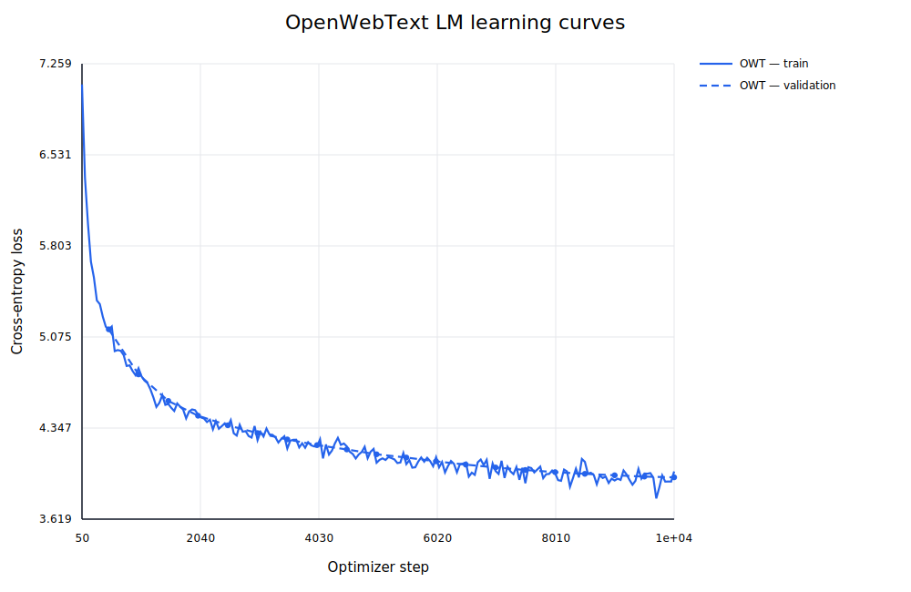

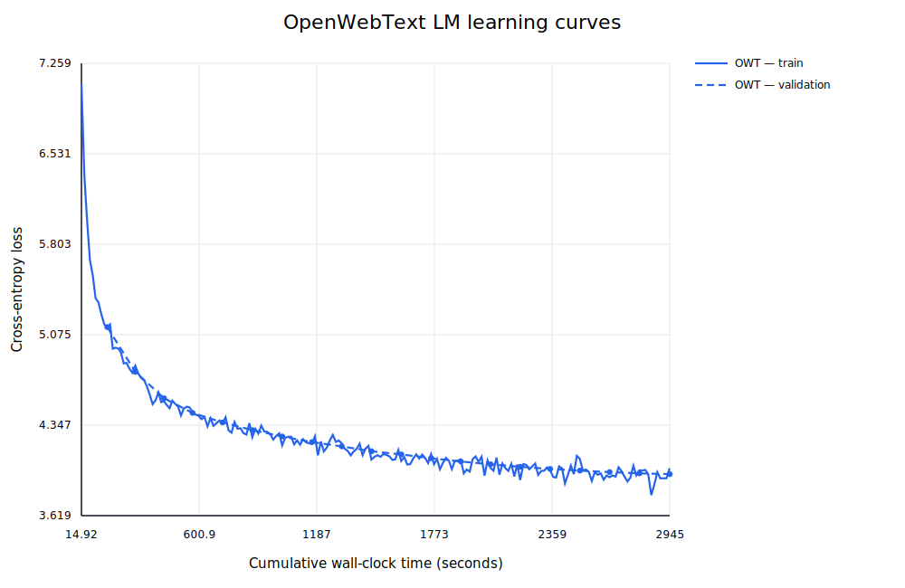

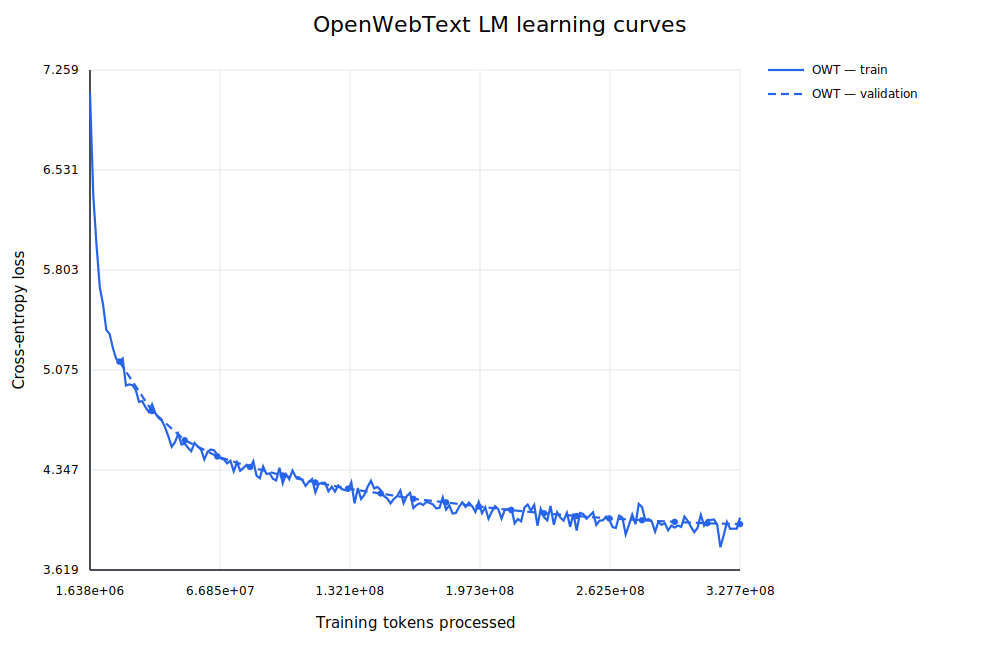

OWT 的 validation loss 从 step 500 的 5.1363 降至 step 10,000 的 3.9534，整个训练过程没有
出现 non-finite loss 或 gradient explosion。曲线在最终 step 仍有下降趋势，说明当前模型和
327.68M-token 预算尚未充分拟合 OWT。作为对照，TinyStories 正式训练的最终 validation loss
为 1.3442（最佳采样点为 step 9,500 的 1.3379）。两者的 loss 不能当作同一标尺下的绝对分数：
OWT 使用 32K tokenizer，TinyStories 使用 10K tokenizer，且网页文本包含更多主题、长程依赖
和抽取噪声。OWT 更高的 cross-entropy 反映 next-token prediction 更困难，而不单独说明实现
错误。

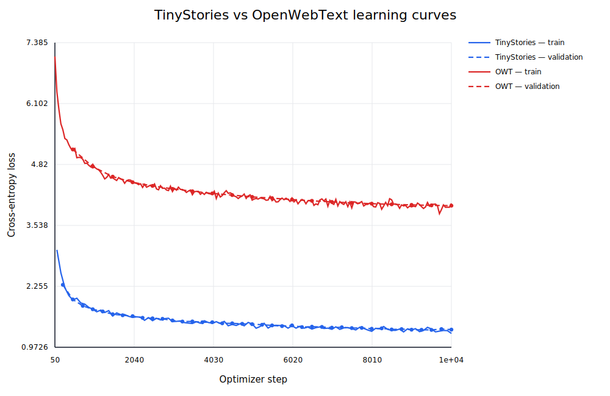

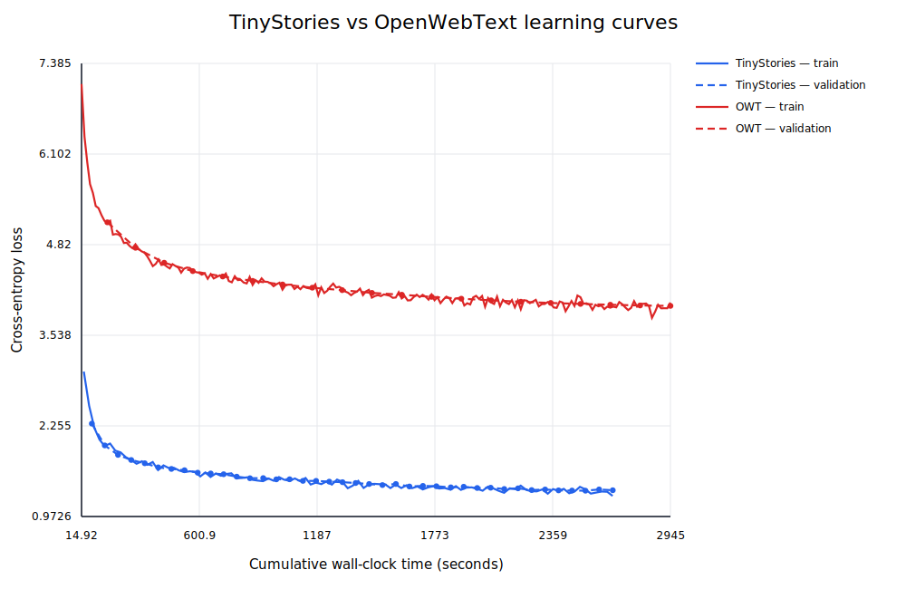

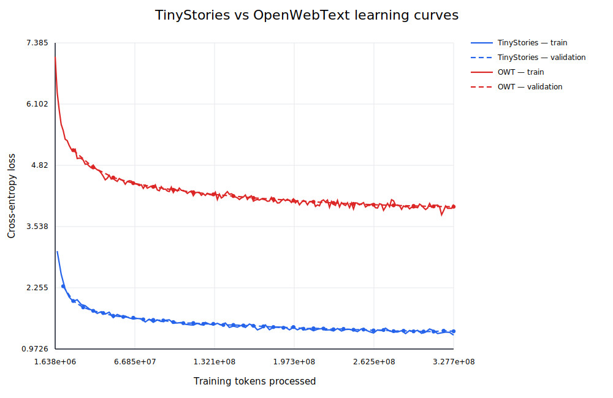

#### OWT 文本生成

我从 step 10,000 checkpoint 加载 OWT tokenizer 和模型，固定
`temperature=0.8`、`top_p=0.9`，每个 prompt 最多生成 256 个新 tokens。三个样本均在达到
上限前没有采到 `<|endoftext|>`，因此由 `max_new_tokens` 截止。完整输出如下：

- [历史主题生成样本，seed 336](assets/history_seed336.txt)
- [科研主题生成样本，seed 337](assets/research_seed337.txt)
- [城市议会主题生成样本，seed 338](assets/council_seed338.txt)

历史主题样本能够围绕 machine learning、IBM 和 engineering 组织局部句子，并产生
`Blueprints [ edit ]` 这类网页文本结构；但后半段出现事实关系混乱、伪实体和截断短语。科研
主题样本使用了 hippocampus、cell、genome、neuron 等相应词汇，局部句法像科普文章，然而
将 kerosene、biceps 和神经科学概念放入不合理关系。城市议会样本最明显地暴露了退化：模型
反复生成 council、proposal 和 approved，句子表面通顺，却没有推进议题，最后出现
`council, council and council`。

因此，OWT 模型已经学到网页语料的局部词法和句法模式，但长程语义一致性仍然较弱。它比随机
文本更像文章，却不能稳定维护事实、实体关系和段落主题。生成质量低于 TinyStories 的原因有
四点：OWT 覆盖新闻、论坛、博客和科普等更宽的分布；网页抽取包含格式残留和重复噪声；当前
4-layer、`d_model=512` 的模型容量不足以覆盖这些主题；相同 token budget 在 OWT 上看到的
可重复模式更少，训练仍处于未完全收敛阶段。32K 词表还扩大了每个位置的分类空间，使罕见
实体和网页字符串更难预测。TinyStories 的短句、有限词汇和模板化情节则让同一模型更容易
拟合，并自然地产生连贯的儿童故事。

OWT 正式训练和生成的配置、曲线与样本均可由本地实验复现；公开提交只保留小型 SVG 和文本
样本，不包含数据集、`.bin` 文件或模型 checkpoint。

## 复现说明

- 环境与依赖：Python 3.12--3.13，使用仓库 `uv.lock` 与 `uv sync --frozen` 安装锁定依赖
- 数据准备：从题面 README 指定的 Hugging Face TinyStories 数据源下载 train/valid 文本；数据文件不进入提交
- TinyStories 正式 tokenizer 命令：`uv run python scripts/train_bpe_tinystories.py --dataset train --vocab-size 10000 --run-name tinystories_train_10000_v1`
- OpenWebText 正式 tokenizer 命令：`uv run python scripts/train_bpe_tinystories.py --dataset owt-train --vocab-size 32000 --run-name owt_train_32000_v1`
- Tokenizer 样本实验：`uv run python scripts/tokenizer_experiments.py --sample-size 10 --seed 336 --throughput-bytes 5000000`
- 全量数据编码：`uv run python scripts/encode_datasets.py --datasets tinystories-train tinystories-valid owt-train owt-valid`
- SGD 学习率实验：`uv run python scripts/sgd_learning_rate_experiment.py --seed 336 --steps 10`
- 训练脚本参数：`uv run python scripts/train_lm.py --help`
- 文本生成脚本参数：`uv run python scripts/generate_text.py --help`
- TinyStories 正式生成配置：step 10,000 checkpoint，prompt `Once upon a time, there was a little girl named Lily.`，temperature 0.8，top-p 0.9，seed 336，最多 320 个新 tokens
- 学习曲线脚本参数：`uv run python scripts/plot_learning_curves.py --help`
- 基准性能脚本参数：`uv run python scripts/benchmark_lm_training.py --help`
- 正式 TinyStories 训练配置：batch size 128、10,000 steps、peak LR `2.5e-3`、minimum LR `2.5e-4`、100-step warmup、10,000-step cosine cycle
- Batch-size 实验配置：阶段一六个 batch 使用固定 `LR=2.5e-3` 和 8.192M tokens；阶段二仅对 batch 1 做 `1.25e-3/6.25e-4` scout；阶段三测试 batch 8/32 的 sqrt 与 linear scaling
- RMSNorm 消融配置：40.96M-token baseline/no-RMSNorm 对照；no-RMSNorm 在 peak LR `2.5e-3` 下发散，再测试 `1e-3` 和 `3e-4`
- Pre/post-norm 配置：40.96M-token、batch size 128、peak LR `2.5e-3`、100-step warmup、固定 validation windows，默认 pre-norm 与 `--post-norm` 对照
- NoPE 配置：40.96M-token、batch size 128、peak LR `2.5e-3`、100-step warmup、固定 validation windows，默认 RoPE 与 `--no-rope` 对照
- SwiGLU/SiLU 配置：40.96M-token、batch size 128、SwiGLU `d_ff=1344` 对比 SiLU `d_ff=2048=4*d_model`，通过 `--ffn-type silu` 切换
- Tokenizer 测试命令：`uv run pytest tests/test_tokenizer.py -q`
- 同步命令：`python3 scripts/sync_a1_submission.py --name '王昱邦'`
- 配置文件：无

## 代码与脚本

- 真实实现：`submission/cs336_basics/`
- 测试 adapter：`submission/tests/adapters.py`
- 训练、数据编码与生成脚本：`submission/scripts/`
- 实现说明：当前已实现 tokenizer 训练与编解码、流式数据编码、Transformer、交叉熵、AdamW、学习率调度、gradient clipping、随机 batch sampling、checkpoint、可恢复训练循环、temperature/top-p 文本生成，以及带累计时间、tokens、perplexity、gradient norm、发散记录、summary 和 SVG 曲线的实验追踪。

真实实现先在兄弟目录 `../assignment1-basics` 中完成并通过官方测试，再使用同步命令复制
到本目录。不要手工复制公共 tests、fixtures、数据、模型权重、虚拟环境或依赖锁。

## 实验日志

- 日志目录：`logs/`
- 文件与格式：见 [`assignments/A1/README.md` 的《实验日志格式》](../../../../assignments/A1/README.md#实验日志格式)
- 与报告中实验的对应说明：`logs/tokenizer_bpe.jsonl` 对应报告中的 tokenizer、数据编码、Transformer、optimizer、data loader、checkpoint、训练循环、decoder、第 7.1 节实验基础设施，第 7.2 节 learning-rate 粗扫、细扫、中程比较、正式 TinyStories 训练、batch-size 三阶段实验、正式文本生成，第 7.3.1 节 RMSNorm 消融、第 7.3.2 节 pre/post-norm 对照、第 7.3.3 节 RoPE/NoPE 对照、第 7.3.4 节 SwiGLU/SiLU 对照，以及第 7.4 节 OWT 正式训练和生成记录。

## 飞书补充文档

- 链接：[A1 飞书补充文档](https://fudan-nlp.feishu.cn/docx/XoFjdak2zoSKs8xSdlGcoAZRnED)
- 个人主页入口：详见 [`PROFILE.md`](../../PROFILE.md) 中登记的个人飞书文档主页。
- 公开性：飞书正文仅保存适合组织内审核的补充材料，不开启互联网公开访问；公开 README 不放置 checkpoint、数据集或密钥。

该文档设置为组织内公开，不得开启互联网公开访问，只保存不能公开到 GitHub 但确有
审核必要的最小差量材料。
