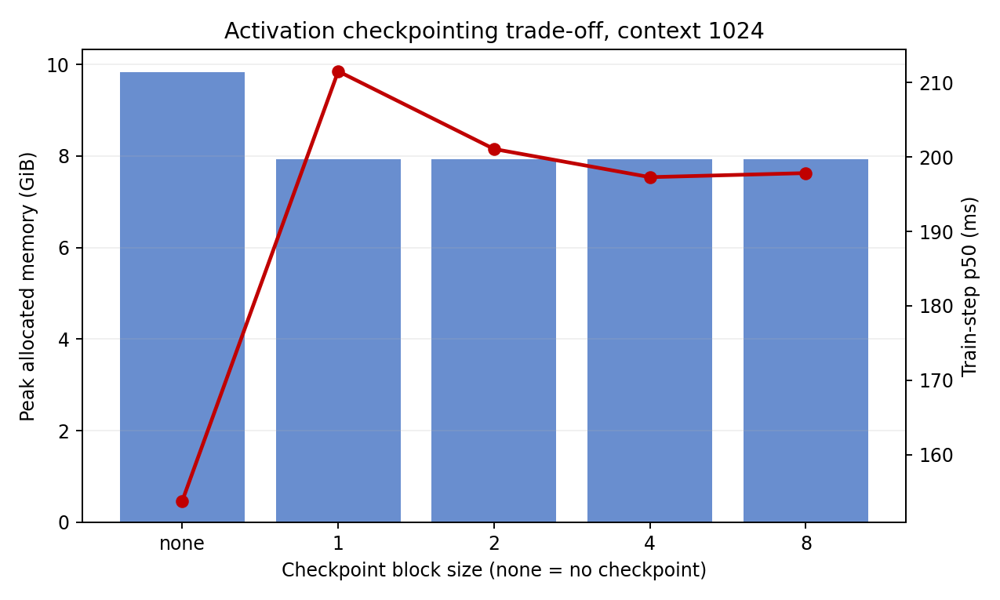
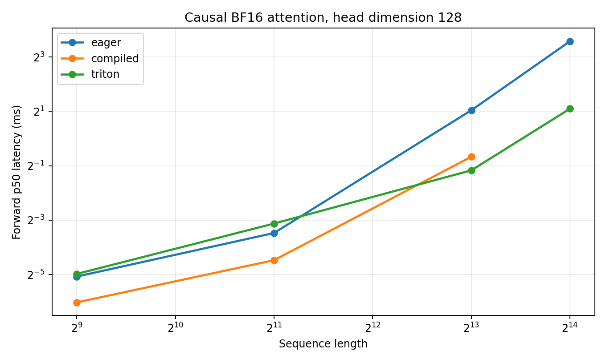

# A2-K 公开提交：王洋

> 本目录公开可见，只包含本人实现的代码、脱敏轻量结果和重建图。编译缓存、binary、完整日志
> 和上游仓库均不进入 GitHub。

正式要求见 [`assignments/A2-K/README.md`](../../../../assignments/A2-K/README.md)，评分说明见
[`assignments/A2-K/EVALUATION.md`](../../../../assignments/A2-K/EVALUATION.md)。

## 基本信息

- 作业题面版本：`26.1.4-k-rc.3`
- 完成范围：activation checkpointing、显式/compiled attention、pure PyTorch tiled 与学生 Triton FlashAttention-2、compiled 重计算 backward、正确性与性能矩阵
- 未完成项：无算法项；硬件环境未满足“物理 24GB”确认条件，见限制说明
- 上游 starter commit：`ca8bc81a59b70516f7ebb2da4808daade877c736`
- 上游固定快照：[stanford-cs336/assignment2-systems](https://github.com/stanford-cs336/assignment2-systems/tree/ca8bc81a59b70516f7ebb2da4808daade877c736)

## 环境与工具

| 项目 | 公开、脱敏的信息 |
| --- | --- |
| GPU | NVIDIA GeForce RTX 4090；单进程只见一张卡 |
| 开跑前显存 | 节点报告 total 48639.3 MiB、free 47782 MiB；不是可确认的标准 24GB 容量 |
| Driver / CUDA | 550.163.01 / CUDA runtime 12.8 |
| PyTorch / Triton / Python | 2.7.1+cu128 / 3.3.1 / 3.12.3 |
| power limit / P-state | 默认 450 W / P2，未超频或手工降功耗 |
| TF32 | FP32 correctness 与 performance 均关闭 |
| compile | `torch.compile(..., fullgraph=True)`；Inductor，cold-start 与 steady-state 分离 |
| allocator guard | 23552 MiB；fraction 0.484217（在首次 CUDA allocation 前设置） |

所有 checkpoint、compile、correctness 与 attention 配置均在独立 Python 进程中串行运行。
虽然 PyTorch peak reserved 最大只有 20192 MiB，且 23 GiB guard 全程通过，但 allocator guard
不约束 CUDA context/driver；因此本文不把约 48 GiB 开发节点冒充为物理 24GB 正式环境。

## 1. Activation Checkpointing

### 理论与代码骨架

忽略计算代价时，可递归二分序列并在每层递归只保留区间边界 activation；反向时递归重算对应
子区间。递归深度为 `O(log N)`，同一时刻保留的 dominant block residual 也是 `O(log N)`，
而最朴素的完整递归会产生约 `O(N log N)` 的 block forward 计算（加一次 `O(N)` backward）。
非嵌套、只允许一次重算时，把 `N` 层按 block size `k` 分组，峰值近似为
`O(N/k + k)`，在 `k ≈ sqrt(N)` 附近平衡 checkpoint 边界与组内物化 residual。

```python
def recursively_checkpoint(blocks, x):
    if len(blocks) == 1:
        return blocks[0](x)
    mid = len(blocks) // 2
    left = lambda z: recursively_checkpoint(blocks[:mid], z)
    right = lambda z: recursively_checkpoint(blocks[mid:], z)
    return checkpoint(right, checkpoint(left, x, use_reentrant=False), use_reentrant=False)
```

### 固定实验

Stanford medium、24 层、batch 1、BF16 autocast、FP32 参数与 AdamW；每行 3 warm-up、5
measurement，完整 raw samples 见 [`results/checkpointing.csv`](results/checkpointing.csv)。

| context | block size | p50 (ms) | peak allocated (MiB) | peak reserved (MiB) |
| ---: | --- | ---: | ---: | ---: |
| 1024 | none | 153.791 | 10065.2 | 10244 |
| 1024 | 1 | 211.541 | 8116.5 | 8170 |
| 1024 | 2 | 201.086 | 8116.5 | 8162 |
| 1024 | 4 | 197.303 | 8117.5 | 8220 |
| 1024 | 8 | 197.850 | 8117.5 | 8178 |
| 2048 | none | 431.445 | 19664.1 | 20192 |
| 2048 | 2 | 552.128 | 8569.2 | 9948 |

ctx1024 下所有 checkpoint 配置节省约 1.95 GiB allocated；block 2 与 block 1 同为最低
allocated，但 block 2 p50 更快，所以用它跑 ctx2048 边界。ctx2048 allocated 从 19.20 GiB
降到 8.37 GiB（56.4%），代价是 p50 增加 28.0%。相近显存并不矛盾：输入、参数、梯度和
optimizer state 占固定大头，block size 主要改变剩余 saved activation 与临时重算峰值。



## 2. PyTorch Attention 与 `torch.compile`

显式基线严格计算 `QK^T → scale → causal mask → softmax → PV`，未调用
`scaled_dot_product_attention` 或第三方 fused attention。batch 1、BF16、causal，输入生成
不计时；forward、backward 与 forward-backward 使用 `triton.testing.do_bench` 的
100 ms warm-up、300 ms repetition、p20/p50/p80。六个核心 shape 的 eager 结果见
[`results/attention_baseline.csv`](results/attention_baseline.csv)。

编译对照见 [`results/compile_comparison.csv`](results/compile_comparison.csv)。代表性 attention
中，compiled forward p50 相对 eager：512×64 为 0.0134 vs 0.0287 ms（2.14×），2048×128
为 0.0451 vs 0.0901 ms（2.00×），8192×128 为 0.6298 vs 2.0593 ms（3.27×）。

完整 small Transformer（batch 1/context 512/BF16）的 compiled cold-start 为 22.648 s；
steady-state p50 如下：

| phase | eager (ms) | compiled (ms) | speedup |
| --- | ---: | ---: | ---: |
| forward | 17.253 | 4.801 | 3.59× |
| forward + backward | 46.798 | 13.897 | 3.37× |
| train step | 54.431 | 22.750 | 2.39× |

`fullgraph=True` 在固定 shape 上没有 graph break；Inductor 会对 shape 专门化并缓存编译结果，
因此 cold-start 不能混入 steady-state。新 shape 或空缓存仍会重新编译，这也是短任务不一定受益
的原因。

## 3. FlashAttention-2 Forward

Pure PyTorch reference 按 query/key tile 64×64 遍历，不物化完整 attention matrix；每个 row
维护 FP32 running max、running sum 和 output accumulator，保存 Q/K/V/O 及唯一的
`[batch, n_queries]` FP32 LSE。PyTorch 与 Triton 两个 adapter 都返回对应的
`torch.autograd.Function` 类，并支持 causal/non-causal。

学生 Triton forward 的 grid 为 `(ceil_div(n_queries, query_tile), batch)`，一个 program 只负责
一个 batch 的一个 query tile，kernel 内只循环 key/value tiles。head dimension 64 使用
64×64 tile、4 warps、2 stages；dimension 128 使用 32×32、4 warps、1 stage，以避免 d=128
时过高的寄存器/共享资源压力。online softmax 的 max/sum、accumulator 均为 FP32，dot 使用
IEEE 输入精度；invalid 与 causal 元素在 softmax 前 mask，并在概率上再次置零，最终写出 O/L。

## 4. Backward 与正确性

Backward 用保存的 LSE 重算 `P = exp(S-L)`，先算 `D = rowsum(O ∘ dO)`，再用
`dS = P ∘ (dP-D)` 得到 `dQ/dK/dV`。该普通 PyTorch 函数由
`torch.compile(..., fullgraph=True)` 编译，并同时接入 PyTorch tiled 与 Triton forward 的
autograd path；causal mask 与 forward 完全一致。

官方真实 GPU 测试输出见 [`results/unit_tests.txt`](results/unit_tests.txt)：**6 passed，0
failed，0 skipped**，且 wrapper 在 pytest 收集前已应用 23 GiB allocator guard。扩展正确性
见 [`results/correctness.json`](results/correctness.json)：2 种实现 × 3 seeds × d=32/64/128 ×
causal/non-causal，共 **36/36 passed**，seed 2026 使用 FP32、其余使用 BF16。最大绝对误差为：
O 0.015625、LSE 0.006755、dQ/dK/dV 均 0.015625。极小参考值会令最大相对误差失真，因此判定
使用题面对应的 `abs_error <= atol or rel_error <= rtol`，并保留逐项原始误差。

## 5. 性能矩阵

核心矩阵覆盖 sequence 512/2048/8192、head dimension 64/128、eager/compiled/Triton 和
三种 phase；16384 边界覆盖 eager/Triton。共 66 行全部成功，p20/p50/p80、peak
allocated/reserved、cold-start、tile 和严格同 shape speedup 见
[`results/flash_benchmark.csv`](results/flash_benchmark.csv)。

| shape / phase | eager p50 (ms) | compiled p50 (ms) | Triton p50 (ms) | Triton vs eager |
| --- | ---: | ---: | ---: | ---: |
| 512×64 forward | 0.0287 | 0.0134 | 0.0236 | 1.22× |
| 2048×128 forward | 0.0901 | 0.0451 | 0.1147 | 0.79× |
| 8192×128 forward | 2.0593 | 0.6298 | 0.4454 | 4.62× |
| 16384×128 forward | 11.9613 | — | 2.1418 | 5.58× |
| 512×64 backward | 0.0338 | 0.0256 | 0.0430 | 0.79× |
| 8192×128 backward | 2.7288 | 1.3240 | 3.7824 | 0.72× |
| 16384×128 forward + backward | 27.1569 | — | 22.1281 | 1.23× |



短序列时 launch/包装开销主导，学生 Triton 不总是最快；长序列时 forward 不写二次方 attention
matrix，8192/16384 获得 4.62×/5.58×。当前 backward 虽已编译，但仍用普通 PyTorch 重算并
物化二次方中间量，所以 8192 backward 慢于 eager，16384 end-to-end 仅 1.23×；optional
Triton tiled backward 是最明确的后续优化方向。以 16384×128 forward 为例，eager peak
allocated 1820.4 MiB，Triton 276.1 MiB；但 Triton backward peak 为 3388.3 MiB，正好体现
forward kernel 和 backward 实现的显存边界不同。

## 6. 限制与复现

- 代码同步命令：`python3 scripts/sync_a2k_submission.py --name '王洋'`
- 23 GiB 证据：[`results/memory_evidence.json`](results/memory_evidence.json)；最高 allocated 19664.1 MiB、reserved 20192 MiB，`within_24gib=true`。
- 环境与全部复现命令：[`results/run_metadata.json`](results/run_metadata.json)。
- 最小测试：`python -m student_scripts.a2k.unit_tests --output local_results/a2k/unit_tests.txt`
- 最小 correctness：`python -m student_scripts.a2k.correctness --output local_results/a2k/correctness.json`
- 最小 benchmark：`python -m student_scripts.a2k.attention_benchmark --implementation triton --sequence-length 8192 --head-dimension 128 --seed 2026 --output local_results/a2k/flash_benchmark.csv --metadata local_results/a2k/attention_metadata.json`
- 未提交：Inductor/Triton cache、PTX/CUBIN、binary、完整终端日志和上游仓库。
- 硬件限制：节点实际暴露 48639.3 MiB，不满足“物理 24GB 已确认”；allocator guard 证明 PyTorch reserved 在 23 GiB 内，但不能独立证明 driver/context 后的整卡 24GB 可复现性。正式提交前需助教确认该虚拟化 4090 是否可作为标准环境，或在真实 24GB 4090 复跑正式矩阵。

## 飞书补充文档

- 链接：https://fudan-nlp.feishu.cn/wiki/KTU3wC1TaiFXjRkLF7vcAm3Lnid
- 状态说明：暂沿用已登记的组织内文档入口；正式发布前会确认是否需要新建 A2-K 专属补充文档。

## 自检

- [x] 本分支只修改王洋的 A2-K 目录，代码、结果和图均在题面 allowlist 内。
- [x] checkpoint、显式 baseline、compile、真实 Triton kernel、官方/扩展正确性与固定矩阵齐全。
- [x] 23 GiB guard 在首次 CUDA allocation 前设置，peak reserved 未超过 23552 MiB。
- [x] 两张图片均被正文引用，`results/` 与 `assets/` 合计低于 2 MiB。
- [x] 未提交缓存、binary、trace、权重、数据、内部地址或凭据。
- [ ] 节点显存容量与题面物理 24GB 不一致，未将其虚假勾选为标准正式环境。
- [ ] 题面状态仍为“发布候选、请勿提交”，因此当前分支未 push、未创建 PR。
