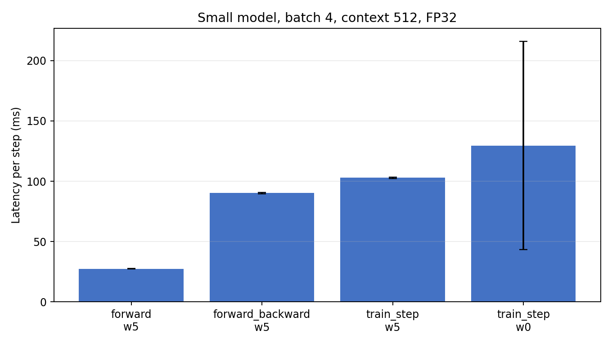
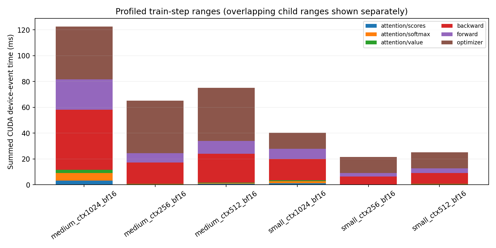
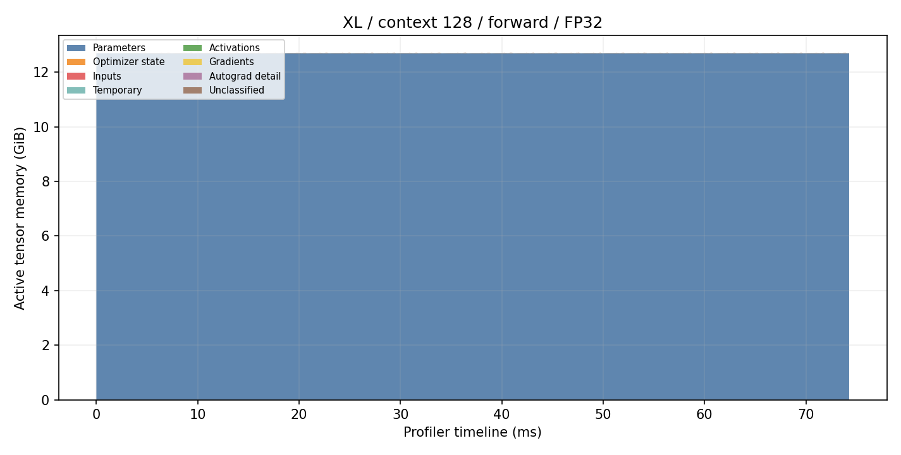
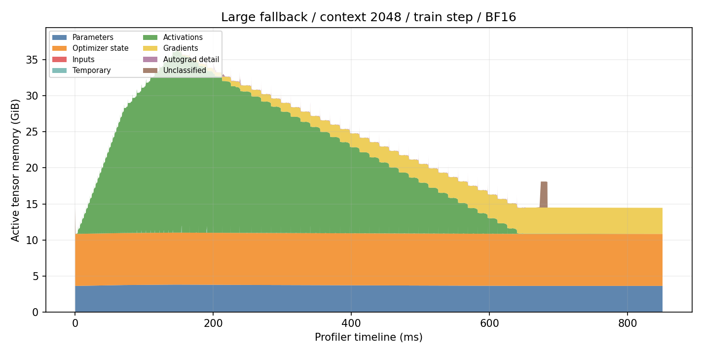
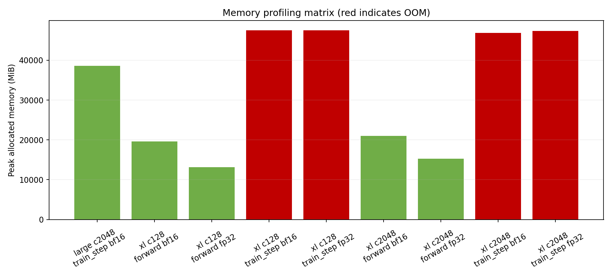

# A2-P 公开提交：王洋

> 本目录公开可见，只包含本人实现的 profiling 代码、脱敏的轻量汇总和压缩图。完整 Chrome
> trace 与 profiler 原始 timeline 保留在个人工作区，不进入 GitHub。

正式要求见 [`assignments/A2-P/README.md`](../../../../assignments/A2-P/README.md)，评分说明见
[`assignments/A2-P/EVALUATION.md`](../../../../assignments/A2-P/EVALUATION.md)。

## 基本信息

- 作业题面版本：`26.1.4-rc.3`
- 完成范围：End-to-End Benchmark、六个 Compute Profile、混合精度、Memory Profiling
- 未完成项：XL 完整 train step 在开发节点约 48 GiB 可见显存下仍 OOM；按题面保留失败行并完成 Large/context 2048/BF16 fallback
- 上游 starter commit：`ca8bc81a59b70516f7ebb2da4808daade877c736`
- 上游固定快照：[stanford-cs336/assignment2-systems](https://github.com/stanford-cs336/assignment2-systems/tree/ca8bc81a59b70516f7ebb2da4808daade877c736)

## 环境与工具

| 项目 | 公开、脱敏的信息 |
| --- | --- |
| GPU | NVIDIA GeForce RTX 4090；节点实际暴露约 48 GiB，因此不把它描述为标准 24GB 卡 |
| Driver / CUDA | 550.163.01 / CUDA runtime 12.8 |
| PyTorch / Python | 2.7.1+cu128 / 3.12.3 |
| Compute profiler | `torch.profiler`，CPU 与 CUDA activities、record shapes、Chrome trace |
| 精度设置 | TF32 关闭；profiling 使用 BF16 autocast，参数保持 FP32 |

## 1. End-to-End Benchmark

统一基线为 small、batch 4、context 512、FP32、seed 2026。脚本支持 `forward`、
`forward_backward` 与 `train_step`；数据和模型构造均在计时区间外，每个 warm-up 与
measurement step 后调用 `torch.cuda.synchronize()`，使用 `time.perf_counter()` 计时。
完整命令、10 个 raw timing、样本标准差和 CV 见 [`results/benchmark.csv`](results/benchmark.csv)。

| mode | warm-up | mean (ms) | sample std (ms) | CV |
| --- | ---: | ---: | ---: | ---: |
| forward | 5 | 27.438 | 0.154 | 0.00560 |
| forward + backward | 5 | 90.174 | 0.477 | 0.00529 |
| train step | 5 | 102.901 | 0.505 | 0.00490 |
| train step | 0 | 129.596 | 86.184 | 0.66502 |

无 warm-up 时第一个 step 为 374.878 ms，后续约 102–103 ms；这使均值上升 25.9%，CV
从 0.0049 增至 0.665。主要原因是首次 CUDA context、kernel/library 初始化、allocator
建池和缓存建立进入了正式计时区间。

## 2. Compute Profiling

六个 profile 固定为完整 `train_step`、batch 1、BF16、外部 warm-up 5、只捕获一个稳定
measurement step：small 与 medium 分别配 context 256、512、1024。每次 trace 都包含
`profile/warmup`、`profile/measure`、`forward`、`backward`、`optimizer` 和
`attention/{scores,softmax,value}`。轻量 op/range 与真实 CUDA kernel 的 Calls、CPU/CUDA
累计时间见 [`trace_summary.csv`](results/profile/trace_summary.csv)，区间 wall time 与区间内
device events 汇总见 [`stage_summary.csv`](results/profile/stage_summary.csv)，逐阶段 top CUDA
kernel 见 [`stage_kernel_summary.csv`](results/profile/stage_kernel_summary.csv)。

代表性的 medium/context 1024 trace 中，`profile/measure` CPU wall time 209.615 ms；forward、
backward 和 optimizer CPU ranges 分别为 57.128、108.097 和 7.131 ms。额外的五次 CUDA
event 稳态测量得到 forward/backward/optimizer/train-step 中位数 33.226/52.992/41.896/
128.133 ms；event 计时排除了 profiler instrumentation 的 CPU 开销。device-event 累计时间
不能与 wall time直接相加，因为子区间重叠且多个 stream 可并行；按关联 launch 统计，完整
measurement 的 device events 跨度约 207.374 ms。attention 前向的 scores、softmax、value
在 24 层中各调用 24 次，device-event 累计分别为 3.284、5.716 和 2.556 ms。整个 train step
的高累计 kernel 还包括 AdamW multi-tensor kernels、dtype copy、
elementwise 和 BF16 GEMM；这说明 FLOPs 主要来自 matmul，但 kernel launch、copy、softmax
与 optimizer 仍占据不可忽略的端到端时间。

本作业选择 `torch.profiler` 而不是 Nsight Systems。它可以导出 Perfetto 可读的 CPU op、
CUDA kernel、stream 和自定义 range，但不提供 nsys 完全等价的系统级 CUDA API 视图；报告
因此不使用 nsys 专属字段，也不把框架 op aggregate 当作独立 wall time。

## 3. Mixed Precision

四种累加实验的实际输出为：FP32 输入/FP32 累加器 `10.0001335`，FP16 输入/FP16 累加器
`9.953125`，FP16 输入/FP32 隐式与显式累加均为 `10.0021362`。FP16 输入先量化造成的误差
即使换 FP32 accumulator 也无法消除；低精度 accumulator 还会在约一万次加法中继续舍入，
所以误差显著放大。完整结构化数据见 [`results/mixed_precision.json`](results/mixed_precision.json)。

ToyModel 在 CUDA BF16 autocast 下的参数、LayerNorm 输出、loss 和 gradient 均为 FP32，
第一层输出与 logits 为 BF16。LayerNorm/reduction 保留 FP32 有助于数值稳定；BF16 的指数
动态范围与 FP32 接近，Tensor Core 则加速主要矩阵乘。

| 模型 | FP32 time (ms) | BF16 time (ms) | speedup | FP32 peak alloc (MiB) | BF16 peak alloc (MiB) |
| --- | ---: | ---: | ---: | ---: | ---: |
| small | 88.380 | 51.368 | 1.72× | 4157.6 | 3279.4 |
| medium | 258.080 | 137.119 | 1.88× | 10816.5 | 8585.0 |
| large | 573.641 | 294.452 | 1.95× | 20715.1 | 16987.2 |
| xl | 1426.187 | 716.610 | 1.99× | 41059.4 | 38124.8 |

模型变大后 BF16 speedup 接近 2×，说明矩阵乘逐渐占主导；峰值显存下降小于 2×，因为参数、
梯度、loss/reduction、allocator reservation 等并不会全部变成 BF16。

## 4. Memory Profiling

所有 peak 和 OOM 记录见 [`results/memory/peaks.csv`](results/memory/peaks.csv)。这里 active 是
活动 tensor memory，allocated 是 PyTorch allocator 当前分配，reserved 是 allocator 从 CUDA
保留的块；reserved 通常高于 allocated，不能混用。

| 配置 | status | peak active/allocated (MiB) | peak reserved (MiB) | 最大单次 allocation (MiB) |
| --- | --- | ---: | ---: | ---: |
| XL ctx128 forward FP32 | ok | 13154.1 | 13168 | 5.625 |
| XL ctx2048 forward FP32 | ok | 15305.7 | 15858 | 512 |
| XL ctx128 forward BF16 | ok | 19587.4 | 19798 | 50 |
| XL ctx2048 forward BF16 | ok | 21021.7 | 22032 | 512 |
| XL ctx128 train FP32 / BF16 | OOM | 47552.5 / 47484.7 allocated at failure | 47616 / 47558 | — |
| XL ctx2048 train FP32 / BF16 | OOM | 47369.2 / 46890.6 allocated at failure | 47636 / 47446 | — |
| Large ctx2048 train BF16 fallback | ok | 38626.6 | 39368 | 320 |

XL/context 2048/FP32 的 512 MiB 最大 allocation 来自显式 attention 的二次方 score 类张量；
它与 `1 × 32 heads × 2048 × 2048 × 4 bytes = 512 MiB` 一致。XL residual stream 的单个
FP32 tensor 为 `batch × context × d_model × 4`：ctx128 是 1.25 MiB，ctx2048 是 20 MiB。
train-step timeline 中 forward 会逐层保存 backward residual，backward 再释放 activation 并
产生 gradient，optimizer 阶段还需访问参数、梯度和状态，因此峰值远高于 forward-only。

BF16 forward 的峰值反而高于 FP32，是因为 autocast 保留 FP32 参数并产生低精度 cast cache；
这证明“activation 变小”不等于“端到端峰值必然减半”。XL train step 在本开发环境仍 OOM，
没有将 fallback 静默标成 XL；成功的 Large fallback 只用于展示完整 forward/backward/optimizer
时间线。

## 5. 限制与复现

- 代码同步命令：`python3 scripts/sync_a2p_submission.py --name '王洋'`
- 最小 benchmark：`python profiling/benchmark.py --model-size small --batch-size 4 --context-length 512 --mode train_step --warmup 5 --steps 10 --dtype fp32 --seed 2026 --output local_results/a2p/benchmark.jsonl`
- 最小 profile：`python profiling/compute_profile.py --model-size medium --context-length 1024 --batch-size 1 --dtype bf16 --warmup 5 --seed 2026 --output-dir local_results/a2p/profile`
- 最小 memory profile：`python profiling/memory_snapshot.py --model-size xl --context-length 2048 --mode forward --dtype fp32 --batch-size 1 --warmup 1 --seed 2026 --output-dir local_results/a2p/memory`
- timeline 渲染：`python profiling/render_timeline.py --source local_results/a2p/memory/xl_ctx128_forward_fp32.timeline.json --output memory_timeline.png --title 'XL context 128 forward FP32'`
- 未提交：完整 Chrome trace、profiler 原始 timeline、op 全量表和运行日志，只保留本地供抽查。
- 已知限制：开发节点对 RTX 4090 暴露约 48 GiB，且 XL train step 仍 OOM；上述事实均在结果中如实保留。

## 飞书补充文档

- 链接：https://fudan-nlp.feishu.cn/wiki/KTU3wC1TaiFXjRkLF7vcAm3Lnid
- 文档用途：A2-P 组织内公开的补充材料；不重复 GitHub 主报告，只保存确有审核必要的差量证据。

## 自检

- [x] 本分支只修改王洋的 A2-P 目录，数字均可回到 `results/` 或 metadata。
- [x] 六个 `train_step` trace、三种 benchmark mode、mixed precision 与 memory fallback 齐全。
- [x] 五张图片均被正文引用，`results/` 与 `assets/` 合计低于 2 MiB。
- [x] 未提交 trace、snapshot、权重、数据、压缩包、内部地址或凭据。
- [x] 题面已发布；分支已合并最新 `upstream/main` 并 push，PR 待创建。
