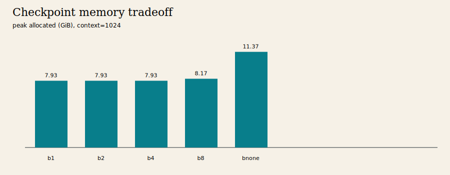
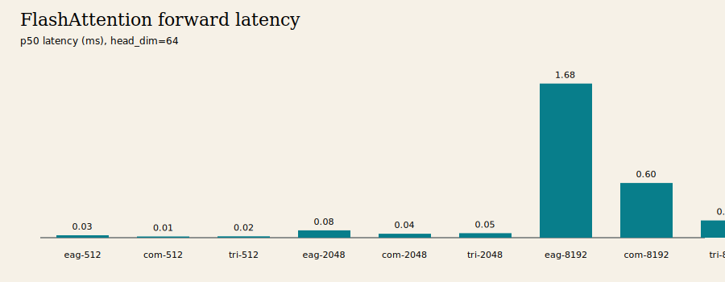

# A2-K 公开提交：王琪琦

> 本报告覆盖 Single-GPU Memory 与 GPU Kernels。正式要求见
> [`assignments/A2-K/README.md`](../../../../assignments/A2-K/README.md)，评分说明见
> [`EVALUATION.md`](../../../../assignments/A2-K/EVALUATION.md)。编译缓存、PTX/CUBIN 和大型
> 原始材料不进入公开仓库。

## 基本信息

- 题面版本：`26.1.4-k-rc.3`
- 完成范围：activation checkpointing、显式 PyTorch attention、`torch.compile`、纯
  PyTorch tiled reference、本人 Triton FlashAttention-2 forward、重计算 backward、官方
  GPU tests、扩展正确性、核心和 16384 边界性能矩阵。
- 未完成项：没有定制 Triton backward；性能开发机为物理 48 GiB RTX 4090，而题面正式环境
  要求物理 24GB RTX 4090。所有进程已施加 23552 MiB allocator guard，但当前性能数字仍需
  在标准 24GB 卡复核，本文不把它们伪称为正式 24GB 结果。
- starter：[`ca8bc81a59b70516f7ebb2da4808daade877c736`](https://github.com/stanford-cs336/assignment2-systems/tree/ca8bc81a59b70516f7ebb2da4808daade877c736)

## 环境与工具

| 项目 | 公开、脱敏的信息 |
| --- | --- |
| GPU | NVIDIA GeForce RTX 4090，物理 48 GiB（开发环境） |
| 开跑前显存 | total 49140 MiB / free 48605 MiB |
| Driver / CUDA | 550.163.01 / 12.8 |
| Python / PyTorch / Triton | 3.12.13 / 2.10.0+cu128 / 3.6.0 |
| power limit / P-state | 450 W / P8，默认设置 |
| TF32 | performance 与 FP32 correctness 均关闭 |
| compile | `torch.compile(fullgraph=True)` 用于 attention；模型为 `fullgraph=False` |
| allocator | 23552 MiB / fraction `0.48421737046550567` |
| benchmark | `do_bench(warmup=100, rep=300, quantiles=[0.2,0.5,0.8])` |

完整脱敏信息和命令登记在
[`results/run_metadata.json`](results/run_metadata.json)。每个正式脚本在首次 CUDA allocation
前设置 allocator fraction，矩阵在单进程、单 GPU 上串行运行。

## 1. Activation Checkpointing

### 理论与边界

对 `N` 个相同 block，一层非嵌套方案每隔 `K` 层保存边界 activation，backward 时逐段重算；
峰值约为 `O(N/K + K)` 个 block activation，取 `K≈sqrt(N)` 得 `O(sqrt(N))` 峰值和
`O(N)` 级额外重算。若完全忽略计算代价，可递归嵌套 checkpoint，将 activation memory
进一步压到 `O(log N)`，代价上升为 `O(N log N)` 量级重算。固定实验按题面使用非嵌套方案。

```python
hidden = embed(tokens)
for start in range(0, N, block_size):
    group = blocks[start : start + block_size]
    def recompute(x, group=group):
        for block in group:
            x = block(x)
        return x
    hidden = checkpoint(recompute, hidden, use_reentrant=False)
loss(head(hidden)).backward()
```

medium、24 层、batch 1、BF16 autocast、FP32 参数和 AdamW；3 次 warm-up、5 次 measurement。
raw samples 和完整字段位于 [`checkpointing.csv`](results/checkpointing.csv)。

| context | block | status | p50 ms | peak allocated MiB | peak reserved MiB |
| ---: | --- | --- | ---: | ---: | ---: |
| 1024 | none | success | 162.911 | 11639.642 | 11778 |
| 1024 | 1 | success | 221.768 | 8123.098 | 8156 |
| 1024 | 2 | success | 220.161 | 8122.629 | 8210 |
| 1024 | 4 | success | 221.774 | 8123.223 | 8224 |
| 1024 | 8 | success | 223.525 | 8368.556 | 8586 |
| 2048 | none | OOM | - | 23372.145 | 23504 |
| 2048 | 2 | success | 679.830 | 9102.919 | 10220 |



block size 2 的 peak allocated 最低：相对 1024 baseline 降低约 30.2%，p50 增加约 35.1%。
block size 1/2/4 的峰值接近，说明峰值还受参数、gradient、AdamW state、临时张量和 allocator
生命周期影响，不只由 checkpoint 数量决定。2048 baseline 触及 23 GiB guard 后 OOM，而
block size 2 成功，展示了以重计算换显存的边界价值。

## 2. PyTorch Attention 与 `torch.compile`

显式基线依次执行 `QK^T`、`1/sqrt(d)` scale、causal mask、softmax、`PV`，没有调用
`scaled_dot_product_attention` 或第三方 fused attention。sequence 512/2048/8192 ×
head dimension 64/128 × forward/backward/forward-backward 共 18 行全部成功，详见
[`attention_baseline.csv`](results/attention_baseline.csv)。输入创建不在计时区间内。

attention 的 3 个代表 shape 和 small Transformer 三阶段结果统一在
[`compile_comparison.csv`](results/compile_comparison.csv)。完整模型结果：

| phase | eager p50 ms | compiled p50 ms | eager cold ms | compiled cold ms |
| --- | ---: | ---: | ---: | ---: |
| forward | 15.739 | 9.599 | 353.619 | 5828.637 |
| forward-backward | 42.327 | 29.614 | 133.873 | 8679.303 |
| train step | 54.374 | 41.995 | 138.407 | 62.901 |

compiled steady-state 更快，但首次 graph capture、code generation、shape specialization 和
Triton/CUDA 编译可达数秒，不能混入 steady-state。attention 使用固定 shape 的 full graph；
完整 Transformer 允许 `fullgraph=False`，Python layer loop 在当前固定配置未导致失败，但新
shape 会重新 specialization，跨进程缓存状态也会影响 cold-start。

## 3. FlashAttention-2 Forward

### Pure PyTorch tiled reference

参考实现按 query tile 和 key/value tile 循环，不物化完整 score matrix。每个 query tile
维护 FP32 running maximum `m`、normalizer `l` 和 output accumulator；新 key tile 到来时用
`exp(m_old-m_new)` 修正历史状态。autograd context 保存 `Q/K/V/O/LSE`，其中唯一一个
`[batch, n_queries]` tensor 是 FP32 LSE。adapter 返回类对象而非实例。

### Triton kernel

本人实现的 `@triton.jit` kernel 使用 grid
`(ceil_div(n_queries, BLOCK_Q), batch)`，每个 program 负责 64-row query tile，并在 kernel
内遍历 64-row K/V tiles。pointer 由 batch/sequence/head-dim strides 计算；越界和 causal
位置使用 mask，causal 条件为绝对 `query_offset >= key_offset`。dot 输入使用原 dtype，
online-softmax 状态和 accumulator 使用 FP32，最后归一化并写回输入 dtype，同时保存 FP32
LSE。正式配置为 query/key tile 64、4 warps、2 stages。

## 4. Backward 与正确性

必做 backward 在 `torch.enable_grad()` 下重建显式 attention 图，并通过
`torch.autograd.grad` 得到 `dQ/dK/dV`；PyTorch tiled 和 Triton 两个 `autograd.Function`
共用该路径，causal/non-causal 均支持。它满足普通 PyTorch 重计算式 backward 要求，但不是
性能优化的 Triton backward，这也是长序列 backward 较慢的原因。

官方命令与脱敏输出见 [`unit_tests.txt`](results/unit_tests.txt)：

```bash
python -m pytest tests/test_attention.py -v
```

结果为 **6 passed、0 failed、0 skipped**；Triton causal/non-causal forward/backward 均在
真实 CUDA 上执行。扩展 [`correctness.json`](results/correctness.json) 覆盖 3 seeds、
head dimension 32/64/128、causal/non-causal、FP32/BF16，以及 output、LSE、`dQ/dK/dV`，
结果 **18 passed、0 failed**。最大 output 绝对误差 0.015625，最大 LSE 绝对误差约
`4.77e-7`；统一容差为 rtol/atol 0.02。

## 5. 性能矩阵

核心矩阵使用 batch 1、BF16、causal：sequence 512/2048/8192 × head dimension 64/128 ×
三种 phase，eager/compiled/Triton 全部参加；16384 边界的两种 head dimension 和三种 phase
比较 eager/Triton。共 66 行，详见
[`flash_benchmark.csv`](results/flash_benchmark.csv)：61 success，5 个 compiled-only
standalone backward 为 RuntimeError，失败行未删除；只有相同 shape/dtype/causal/phase 且
双方成功时才计算 speedup。

| seq | dim | eager fwd p50 | compiled fwd p50 | Triton fwd p50 | Triton speedup | eager/Triton peak allocated |
| ---: | ---: | ---: | ---: | ---: | ---: | ---: |
| 8192 | 64 | 1.682 ms | 0.597 ms | 0.188 ms | 8.93× | 790.4 / 278.3 MiB |
| 8192 | 128 | 1.706 ms | 0.628 ms | 0.373 ms | 4.58× | 796.4 / 284.3 MiB |
| 16384 | 64 | 6.656 ms | - | 0.518 ms | 12.85× | 2332.5 / 284.4 MiB |
| 16384 | 128 | 6.708 ms | - | 1.440 ms | 4.66× | 2344.5 / 296.4 MiB |



短序列中 launch、tile padding 和循环固定成本占比高；长序列中不物化 `O(N²)` score matrix
显著减少 HBM 流量和峰值显存。head dimension 128 需要更多 dot/accumulator 工作，speedup
低于 dimension 64。当前 backward 会重建完整 PyTorch score，因此 16384/dim 128 的
Triton-path backward p50 16.550 ms，慢于 eager 9.897 ms；这是普通重计算 backward 的限制，
不能错误归因到 Triton forward。

## 6. 显存证据、限制与复现

[`memory_evidence.json`](results/memory_evidence.json) 汇总所有公开矩阵：

| 字段 | 值 |
| --- | ---: |
| allocator limit | 23552 MiB |
| allocator fraction | 0.4842173705 |
| hard limit | 24576 MiB |
| max allocated | 23372.145 MiB |
| max reserved | 23504.000 MiB |
| `within_24gib` | true |

最高峰来自 context 2048 无 checkpoint 的 OOM 边界；reserved 未超过 allocator limit。物理
48 GiB GPU 仍不满足题面“正式结果来自 24GB 卡”的硬条件，因此这些是 allocator 受限开发
证据，需要在标准机器复核后才能作为正式性能提交。

- 同步：`python3 scripts/sync_a2k_submission.py --name '王琪琦'`。
- 官方测试：`python -m pytest tests/test_attention.py -v`。
- 实验示例：`python -m student_scripts.a2k.experiments flash --output local_results/a2k/flash_benchmark.csv`。
- 本地留存：compile cache 和逐进程原始文件；不提交 PTX/CUBIN、binary、trace、snapshot、
  权重、数据、依赖环境或内部信息。

## 飞书补充文档

- 链接：https://fudan-nlp.feishu.cn/wiki/DzylwdHPViBYbVkL6M0cRWAjn5e
- 文档保持组织内可见，不开启互联网公开访问，只登记复核所需的最小差量材料。

## 自检

- [x] checkpoint、baseline、compile、正确性和 Flash 必交结果齐全。
- [x] 显式基线未调用已有 fused attention；提交含本人 `@triton.jit` forward kernel。
- [x] 官方 CUDA tests 的 pass/fail/skip 如实记录。
- [x] 每个正式脚本设置 23552 MiB allocator guard，失败/OOM 行未隐藏。
- [x] 两张图片使用相对路径和有意义的 alt text，可回溯到 CSV。
- [x] 未提交 cache、PTX/CUBIN、binary、trace、snapshot、权重、环境或凭据。
- [ ] 在物理 RTX 4090 24GB 标准环境复核性能矩阵。
