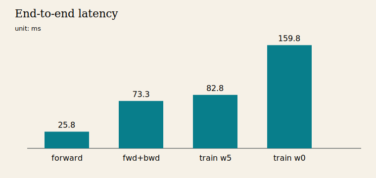
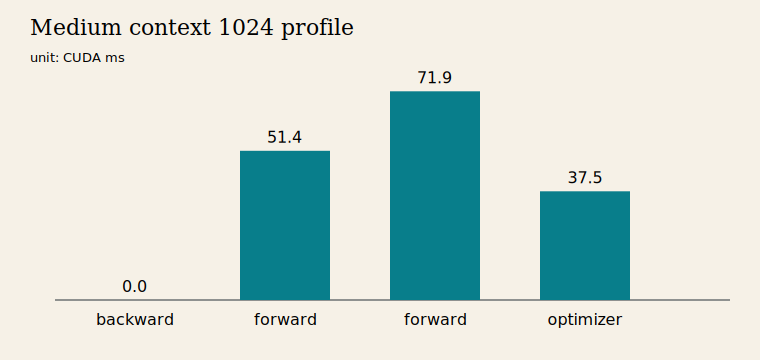
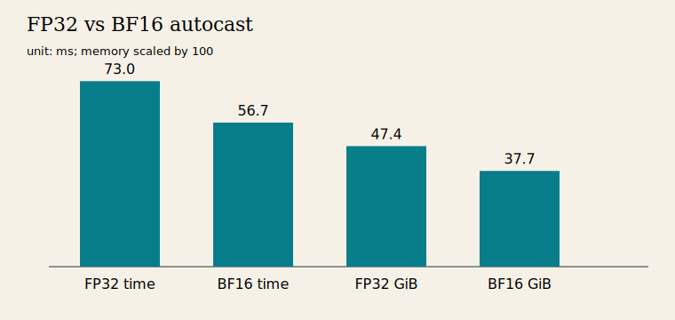
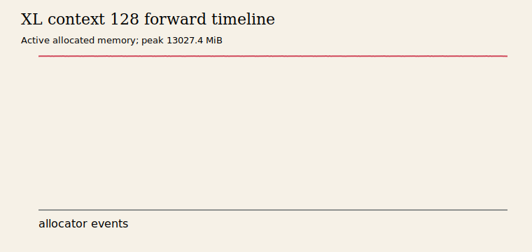
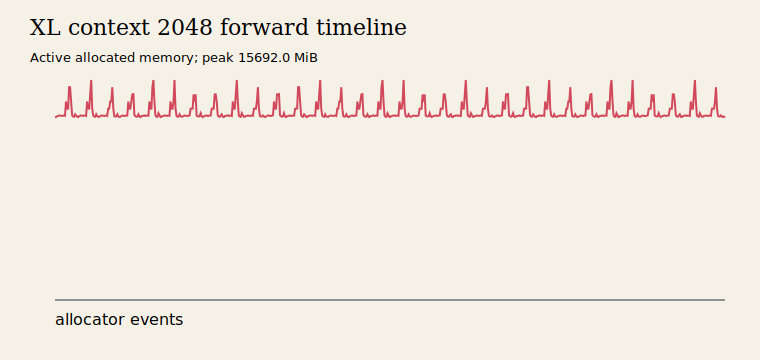
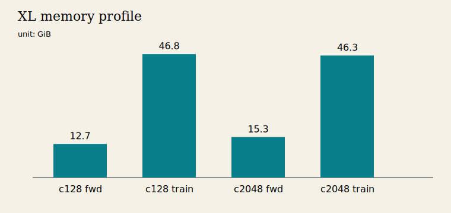

# A2-P 公开提交：王琪琦

> 本报告只覆盖 Profiling 子作业。大型 Chrome trace、memory snapshot 和运行日志保留在
> 受控工作区，不进入公开仓库。题面与评分标准见
> [`assignments/A2-P/README.md`](../../../../assignments/A2-P/README.md) 和
> [`EVALUATION.md`](../../../../assignments/A2-P/EVALUATION.md)。

## 基本信息

- 题面版本：`26.1.4-rc.3`
- 完成范围：End-to-End Benchmark、六个 Compute Profile、四种累加实验、ToyModel BF16
  dtype、FP32/BF16 benchmark、XL Memory Profiling 与规定 fallback。
- 未完成项：XL 与 Large 的完整 train step 因 48 GiB 显存限制 OOM；原配置、异常类型与
  峰值均如实保留，没有把缩小后的配置标成成功。
- 上游 starter：[`ca8bc81a59b70516f7ebb2da4808daade877c736`](https://github.com/stanford-cs336/assignment2-systems/tree/ca8bc81a59b70516f7ebb2da4808daade877c736)
- 本地工作仓库：与 SummerQuest 同级的 `assignment2-systems`，大型原始文件仅在本地留存。

## 环境与工具

| 项目 | 公开、脱敏的信息 |
| --- | --- |
| GPU | NVIDIA GeForce RTX 4090，48 GiB |
| Driver / CUDA | 550.163.01 / CUDA runtime 12.8 |
| Python / PyTorch | 3.12.13 / 2.10.0+cu128 |
| Compute profiler | `torch.profiler`，CPU + CUDA activities |
| Memory profiler | PyTorch CUDA memory history |
| 模型 | 本人 A1 `TransformerLM`；正式随机种子为 2026 |

## 1. End-to-End Benchmark

统一基线为 small、batch 4、context 512、FP32。模型初始化和随机数据生成均在计时区间外；
每个 measurement step 在 `time.perf_counter()` 前后调用 `torch.cuda.synchronize()`。
`forward` 在 `no_grad` 下只做 forward；`forward_backward` 每步清梯度后做 forward、loss、
backward；`train_step` 的边界还包含 zero grad 与 AdamW step。

```bash
python -m profiling.benchmark \
  --model-size small --batch-size 4 --context-length 512 \
  --mode train_step --warmup 5 --steps 10 --dtype fp32 \
  --seed 2026 --device cuda --output results/benchmark/train_step.json
```

完整 10 个 raw timing 位于 [`results/benchmark.csv`](results/benchmark.csv)。

| mode | warm-up | mean ms | sample std ms | CV | peak allocated MiB |
| --- | ---: | ---: | ---: | ---: | ---: |
| forward | 5 | 25.790 | 0.403 | 0.01563 | 772.944 |
| forward_backward | 5 | 73.334 | 0.835 | 0.01138 | 4743.941 |
| train_step | 5 | 82.800 | 0.321 | 0.00388 | 5739.713 |
| train_step | 0 | 159.786 | 239.479 | 1.49875 | 5739.713 |



无 warm-up 的第一个 train step 为 841.343 ms，之后回到约 83–88 ms。首次 step 同时承担
CUDA context、kernel lazy loading、allocator 和 optimizer state 初始化，因此污染均值并将
CV 推高到 1.499；5 次 warm-up 后 train-step CV 降到 0.39%。

## 2. Compute Profiling

六个 trace 全部使用 batch 1、FP32、5 个 profiler 外 warm-up 和一个稳定的完整
`train_step`。主工具是 `torch.profiler`；trace 内包含 `profile/warmup`、
`profile/measure`、`forward`、`backward`、`optimizer`，以及真实执行计算的
`attention/scores`、`attention/softmax`、`attention/value` 范围。

| model | context | mode | dtype | status | 本地 trace 名 |
| --- | ---: | --- | --- | --- | --- |
| small | 256 | train_step | FP32 | success | `small_256.trace.json` |
| small | 512 | train_step | FP32 | success | `small_512.trace.json` |
| small | 1024 | train_step | FP32 | success | `small_1024.trace.json` |
| medium | 256 | train_step | FP32 | success | `medium_256.trace.json` |
| medium | 512 | train_step | FP32 | success | `medium_512.trace.json` |
| medium | 1024 | train_step | FP32 | success | `medium_1024.trace.json` |

```bash
python -m profiling.profile \
  --model-size medium --context-length 1024 --batch-size 1 --warmup 5 \
  --output results/profile/medium_1024.json \
  --trace results/profile/medium_1024.trace.json \
  --table results/profile/medium_1024.csv
```

六次运行的配置在 [`run_metadata.json`](results/profile/run_metadata.json)，完整轻量事件表在
[`trace_summary.csv`](results/profile/trace_summary.csv)。以 medium/context 1024 为例：

| range / op | Calls | CPU total ms | CUDA total ms |
| --- | ---: | ---: | ---: |
| `profile/measure` | 1 | 208.151 | 88.903 |
| `forward` CPU range | 1 | 73.309 | 51.393 |
| `optimizer` | 1 | 7.984 | 37.452 |
| `aten::mm` | 507 | 10.264 | 32.322 |
| `attention/scores` | 24 | 5.745 | 11.512 |
| `attention/softmax` | 24 | 10.063 | 23.597 |
| `attention/value` | 24 | 2.240 | 1.454 |



`aten::mm` 是主要 CUDA 工作；softmax 虽 FLOPs 少于矩阵乘法，但要读写二次方 score
张量并执行 mask、max、exp、sum reduction，所以不能仅按 FLOPs 判断耗时。每个 attention
范围 Calls=24，对应 medium 的 24 个 TransformerBlock。导出的 Chrome trace 可用 Perfetto
查看 operator、kernel、线程、stream 与上述范围；公开仓库不提交 9–20 MiB 的完整 trace。
`torch.profiler` 不提供 Nsight Systems 完整的 CUDA API 到 kernel 系统级关联，本报告不声称
具有 nsys 专属证据。backward CPU range 与异步 CUDA event 的归属方式不同，因此归因时同时
参考 `profile/measure`、operator/device events，而不把单一 range 的 device 值当作总耗时。

## 3. Mixed Precision

固定执行 1000 次 `+0.01` 的实际结果来自
[`results/mixed_precision.json`](results/mixed_precision.json)：

| accumulator | input | output |
| --- | --- | ---: |
| FP32 | FP32 | 10.0001335 |
| FP16 | FP16 | 9.9531250 |
| FP32 | FP16 | 10.0021362 |
| FP32 | FP16 后显式 cast 到 FP32 | 10.0021362 |

FP16 accumulator 每次都把部分和舍入回低精度网格，因而产生累积误差；FP32 accumulator
避免重复舍入，却无法恢复 FP16 输入在首次量化时已经损失的信息，所以后两行相同。

ToyModel 使用 CUDA BF16 autocast。参数为 FP32，第一层输出为 BF16，LayerNorm 输出为
FP32，logits 为 BF16，loss 和全部 gradient 为 FP32。LayerNorm、loss 和 reduction 保持
FP32 有利于累加精度及动态范围；较大矩阵乘法则能使用 BF16 Tensor Core。

同一 small、batch 4、context 512、forward-backward、warm-up 5、measurement 10 的结果：

| dtype | mean ms | sample std ms | CV | peak allocated MiB |
| --- | ---: | ---: | ---: | ---: |
| FP32 | 73.004 | 0.510 | 0.00699 | 4744.880 |
| BF16 autocast | 56.698 | 1.841 | 0.03247 | 3768.582 |



BF16 在此配置约快 1.29 倍，peak allocated 降低约 20.6%。BF16 的指数动态范围接近
FP32，但尾数更短，因此适合作为 activation 与 Tensor Core 计算 dtype，同时保留 FP32
参数、gradient 和关键 reduction。

## 4. Memory Profiling

memory history 在 forward warm-up 后开启，每个配置独立运行并保存独立 snapshot。轻量峰值
位于 [`peaks.csv`](results/memory/peaks.csv)，运行口径位于
[`run_metadata.json`](results/memory/run_metadata.json)。

| model | context | mode | status | peak allocated MiB | peak reserved MiB | peak active MiB |
| --- | ---: | --- | --- | ---: | ---: | ---: |
| XL | 128 | forward | success | 13027.419 | 13080.000 | 13027.419 |
| XL | 128 | train_step | OOM | 47958.327 | 48078.000 | - |
| XL | 2048 | forward | success | 15692.025 | 15758.000 | 15692.025 |
| XL | 2048 | train_step | OOM | 47401.955 | 47558.000 | - |
| XL | 1024 | train_step fallback | OOM | 46671.200 | 48028.000 | - |
| Large | 2048 | train_step fallback | OOM | 47754.771 | 47864.000 | - |







`allocated` 是 tensor 实际占用，`active` 是 allocator 中仍活跃的 block，`reserved` 还包括
缓存但当前未被 tensor 使用的 block；表中不混用三种口径。时间线由本地 snapshot 的
allocator alloc/free events 重建，图片仅保留脱敏后的 active allocated 曲线。

XL 的 `d_model=2560`，所以 batch 1、FP32 单个 residual stream tensor 理论大小为
`1 × context × 2560 × 4 bytes`：context 128 为 1.25 MiB，context 2048 为 20 MiB。
context 2048 的 attention score 理论大小为
`32 heads × 2048 × 2048 × 4 bytes = 512 MiB`，与 snapshot 中的大块 allocation 量级一致。
forward 后各 TransformerBlock 为 backward 保存 residual 和中间 activation；backward 又产生
gradient 和临时张量，optimizer 还需要 state，叠加后使 48 GiB 设备 OOM。题面规定的
XL/context 1024、Large/context 2048 fallback 也已按原标签运行并记录为 OOM。

## 5. 限制与复现

- 同步代码：`python3 scripts/sync_a2p_submission.py --name '王琪琦'`。
- 最小复现：设置本人 A1 submission 为 `PYTHONPATH`，再运行上文各模块命令；正式汇总可运行
  `python -m profiling.summarize`。
- 本地留存：六个 Chrome trace、两个成功 forward 的 memory snapshot 与 OOM 日志；不提交
  trace、snapshot、权重、数据、环境或压缩包。
- 已知限制：主工具不是 nsys；XL 与规定 fallback 的完整 train step 在 48 GiB 上均 OOM。

## 飞书补充文档

- 链接：https://fudan-nlp.feishu.cn/wiki/UNutwXsrHibXC1kCNaFcO7JIn9d
- 文档保持组织内可见，不开启互联网公开访问；用于登记大型原始材料和复核步骤。

## 自检

- [x] 三种 mode、同步、raw timings、样本标准差、CV 与 warm-up 对照齐全。
- [x] 六个完整 train-step trace 使用同一工具，阶段和 attention 子阶段可检索。
- [x] 四种累加、ToyModel BF16 dtype、FP32/BF16 时间和显存齐全。
- [x] XL memory 主矩阵和规定 fallback 已真实运行，OOM 未被隐藏或改名。
- [x] 所有六张图片均使用相对路径、有意义的 alt text，并可回溯到轻量结果或 snapshot。
- [x] 未提交完整 trace、snapshot、日志、权重、数据、压缩包、内部路径或凭据。
