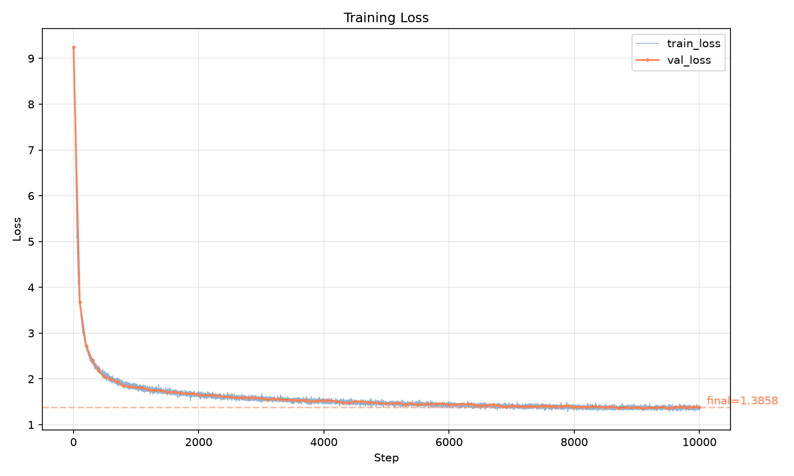
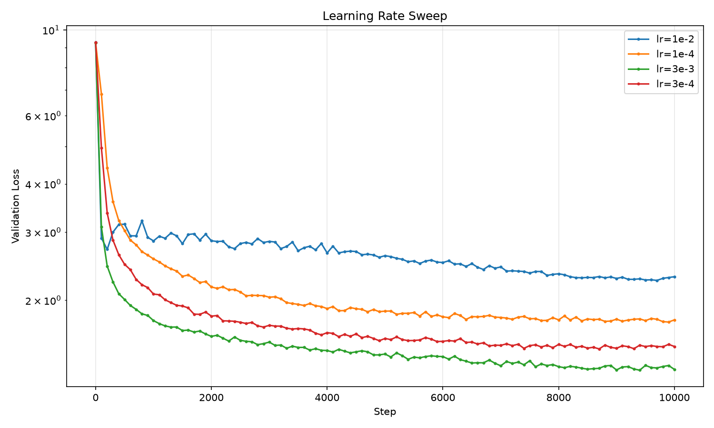
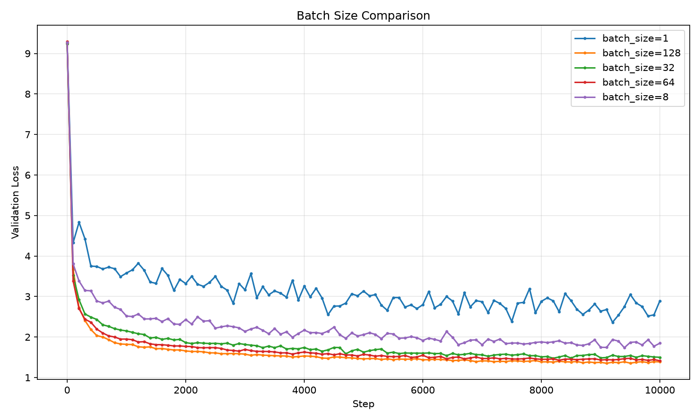
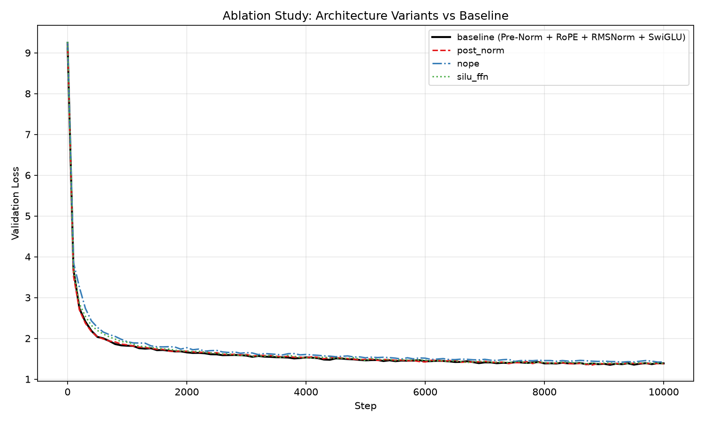

# A1 公开提交：王群超


## 基本信息

- 作业题面版本：26.0.3
- 完成范围：21 个公开 adapter、Tokenizer、Transformer、训练组件、完整训练流水线、TinyStories/OWT 实验、学习率与 batch size 扫描、四项架构消融、文本生成和公开实验报告
- 上游 starter commit：`a158843b20107949f1a8d7df1b05cd33b9166712`
- 本地工作仓库：`../assignment1-basics`

## Markdown 报告
  
### Unicode   
unicode_1  
(a) chr(0) 返回什么Unicode字符？  
返回空字符NULL  
(b) 该字符的字符串表示（repr()）与其打印表示有何不同？  
字符串表示是\x00，打印表示是空内容。    
(c) 当此字符出现在文本中时会发生什么？ 
可能导致文本被异常截断。  
Unicode_2  
(a) 选择在UTF-8编码的字节上训练我们的分词器，而不是UTF-16或UTF-32，有哪些原因？比较这些编码在各种输入字符串上的输出可能会有所帮助。    
一、utf-8最常用。   
二、UTF-8是变长编码，单个字符的字节长度为1-4，对于常见的英文字符和符号UTF-8使用1字节表示，对于其他字符UTF-8使用2-4字节表示。而UTF-16固定使用2字节表示，UTF-32固定使用4字节表示，相同的字符串转换为bytes时，UTF-8是字节数最少的，也就可以分出更少的token，提高计算效率。  
(b) 考虑以下（错误的）函数，它旨在将UTF-8字节字符串解码为Unicode字符串。为什么这个函数不正确？给出一个输入字节字符串示例，该示例会产生错误结果。  
```
python
def decode_utf8_bytes_to_str_wrong(bytes):
    return "".join([bytes([b]).decode("utf-8") for b in bytesstring])

>>> decode_utf8_bytes_to_str_wrong("hello".encode("utf-8"))
'hello'
```  
因为这个函数将每个字节单独解码，但是UTF-8是变长编码，例如中文“牛”是由三个字节编码，应该整体解码而不是单独解码。
(c) 给出一个无法解码为任何Unicode字符的两字节序列。  
UTF-8编码有严格的规则，比如起始字节（Leader Byte） 的高位（如 110、1110）告诉解码器“这个字符总共占几个字节”，而后续字节（Continuation Byte） 的高位必须是 10，  
如果破坏这个罪责，比如传入的序列[200, 63]，它是 1100 1000 0011 1111，其作为2字节字符，第二个字节的前缀却不是10xx xxxx，因此无法解码。  

### AdamW 显存、FLOPs 与训练时间核算

GPT-2 XT 配置：vocab_size=50257, context_length=1024, L=48, d_model=1600, h=25, d_ff=4288。

#### 可训练参数复核

| 组件 | 计算公式 | 参数量 (M) |
|---|---|---|
| Token Embedding | V × d | 80.41 |
| LM Head | V × d | 80.41 |
| Attention（Q/K/V/Out） | 4 × d² × L | 491.52 |
| SwiGLU | 3 × d × d_ff × L | 987.96 |
| RMSNorm | 2 × d × L | 0.15 |
| **总计** | 求和 | **≈ 1640** |

- **模型权重显存（FP32）**：1640 M × 4 B ≈ **6.56 GB**。

#### 前向传播 FLOPs

按单序列（batch=1, T=1024）估算一次前向的矩阵乘法 FLOPs：

| 模块 | 公式 | 单序列 FLOPs |
|---|---|---|
| Attention 投影 | 2 × 4d² × L × T | 1.00 × 10¹² |
| Attention 计算（QKᵀ + Softmax×V） | 4 × T² × d × L | 3.17 × 10¹¹ |
| SwiGLU | 6 × d × d_ff × L × T | 2.02 × 10¹² |
| LM Head | 2 × d × V × T | 1.64 × 10¹¹ |
| **合计（≈）** | | **3.50 × 10¹²** |

- **单序列前向 FLOPs**（batch=1, T=1024）：≈ **3.50 × 10¹² FLOPs/sequence**。

#### 训练总 FLOPs

训练时反向传播约为前向的 2 倍，因此单步总 FLOPs 约为前向的 3 倍：

- **单步训练 FLOPs** ≈ 3 × 3.50 × 10¹² ≈ **1.05 × 10¹³ FLOPs/step**。

若总训练 token 数为 D，则：

```
总训练 FLOPs ≈ 6 × N × D
```

其中 N ≈ 1.64 × 10⁹。以 D = 100 B token 为例：

- **总训练 FLOPs** ≈ 6 × 1.64 × 10⁹ × 1 × 10¹¹ ≈ **9.8 × 10²⁰ FLOPs**。

#### AdamW 优化器状态显存

AdamW 为每个参数维护一阶矩 m 与二阶矩 v（均为 FP32）：

- 一阶矩 + 二阶矩：2 × N × 4 B ≈ **13.12 GB**
- 模型参数：N × 4 B ≈ **6.56 GB**
- 梯度：N × 4 B ≈ **6.56 GB**
- **参数/梯度/优化器状态合计** ≈ **26.24 GB**（不含激活值）。

#### 训练时间估算

以 A100 80GB 为例，峰值 BF16 算力约 312 TFLOPS，按 40% 利用率估算：

- **有效算力** = 312 × 0.40 = **124.8 TFLOPS** ≈ **1.25 × 10¹⁴ FLOPS**

计算过程（以 100 B token 为例）：

```
总 FLOPs = 9.8 × 10²⁰
时间（秒） = 9.8 × 10²⁰ / 1.25 × 10¹⁴ = 7.84 × 10⁶ s
时间（小时） = 7.84 × 10⁶ / 3600 ≈ 2178 h
时间（天） = 2178 / 24 ≈ 90.7 天
```

| 训练 token 数 | 总 FLOPs | 单卡 A100 时间 | 8 卡数据并行 |
|---|---|---|---|
| 100 B | 9.8 × 10²⁰ | **≈ 2178 小时（≈ 91 天）** | **≈ 272 小时（≈ 11 天）** |
| 300 B | 2.95 × 10²¹ | **≈ 6533 小时（≈ 272 天）** | **≈ 817 小时（≈ 34 天）** |

> 8 卡数据并行按理想线性加速（除以 8）估算，未考虑通信开销。

### Tokenizer 实验

本作业训练了两个 BPE tokenizer：

|分词器 | 训练语料 | 目标词表大小 |
|---|---|---|---|
| TinyStories_10K | `tinystories_train.txt` | 10,000 |
| OWT_32K | `owt_train.txt` | 32,000 |

两个词表均 ≤ 65535，编码后的 `.npy` 使用 `uint16` 存储。

#### Tokenizer 对比

本作业使用 `scripts/compare_tokenizers.py` 进行公平对比：从 TinyStories 和 OpenWebText 验证集中各随机采样 10 篇文档，合并成一份混合语料（共 79,157 bytes），然后用两个 tokenizer 分别编码同一份文本，比较压缩率、吞吐和最长 token。

| 指标 | TinyStories_10K | OWT_32K |
|---|---|---|
| 词表大小 | 10,000 | 32,000 |
| 总 token 数 | 23,717 | 18,167 |
| 压缩率（B/tok） | 3.3376 | **4.3572** |
| 编码时间（s） | 0.1014 | 0.1222 |
| 编码吞吐（tok/s） | **233,793.82** | 148,698.43 |
| 最长 token（bytes） | 15 | **64** |
| 最长 token 预览 | ` accomplishment` | `ÃÂÃÂÃÂÃÂÃÂÃÂÃÂÃÂÃÂÃÂÃÂÃÂÃÂÃÂÃÂÃÂ` |

**分析：**

- **压缩率**：在混合语料上，OWT_32K（4.36 B/tok）显著优于 TinyStories_10K（3.34 B/tok）。这说明更大词表能捕获更多子词和跨域片段，用更少的 token 表示相同字节。TinyStories_10K 的词表主要针对儿童故事高频词，面对 OWT 中的复杂词汇时只能拆成更多 token。
- **吞吐**：TinyStories_10K 编码更快，因为其词表小、BPE 合并次数少、平均 token 长度短；OWT_32K 词表大，查找和合并开销更高。
- **最长 token**：TinyStories_10K 的最长 token 是英文单词 `accomplishment`（15 bytes）；OWT_32K 的最长 token 是一串乱码字节（64 bytes），这是 BPE 在网页文本中把非法 UTF-8 序列或重复字符模式合并成了单个 token，反映 OWT 数据质量噪声较大。

#### 各域编码指标

各 tokenizer 在自己训练/验证语料上的详细编码指标如下：

| 分词器 | 数据集 | Bytes | Tokens | B/tok | tok/s |
|---|---|---|---|---|---|
| TinyStories_10K | train | 2,227,753,162 | 541,229,347 | 4.1161 | 176,187.41 |
| TinyStories_10K | val | 22,502,601 | 5,465,883 | 4.1169 | 173,688.68 |
| OWT_32K | train | 11,920,511,059 | 2,727,120,452 | 4.3711 | 139,180.45 |
| OWT_32K | val | 289,998,753 | 66,401,098 | 4.3674 | 154,810.35 |

分析：

- **压缩率（B/tok）**：OWT_32K 的 B/tok（~4.37）高于 TinyStories_10K（~4.12）。这符合预期：OWT 语料覆盖领域更广、词汇多样性更高，32K 词表能学到更长的子词/词片段，从而用更少的 token 表示相同字节；而 TinyStories 面向儿童故事，高频短词集中，10K 词表已足够高效。
- **吞吐**：TinyStories_10K 编码速度更快，原因在于其平均 token 长度更短、BPE 合并次数更少，且训练文件总 token 数虽然少但单位时间处理量高。
- **存储**：两个数据集均使用 `uint16` 存储 ids（最大 65535），词表大小均在其范围内，没有空间浪费。

> 注：tokenizer 训练产物（`tokenizer.pkl` / `vocab.json` / `merges.txt` / `config.json`）属于运行时产物，未纳入本次公开提交；上述指标可通过「复现说明」中的命令在本地重新生成。

### 训练结果

统一模型架构（消融实验除外）：d_model=512, num_layers=4, num_heads=16, d_ff=1344, context_length=256, rope_theta=10000, weight_decay=0.01。

#### TinyStories Baseline

| 指标 | 数值 |
|---|---|
| 词表大小 | 10,000 |
| Batch size | 128 |
| 训练步数 | 10,000 |
| 学习率 | 0.001 |
| Warmup | 200 steps |
| 参数量 | 22.70 M |
| 最终验证 Loss | **1.3831** |
| 总训练时间 | 2815.4 s（≈ 46.9 min） |
| 处理 token 总数 | 327.68 M |



分析：

- **warmup 阶段（step 0-200）**：lr 从 0 线性升至 1e-3，此时 loss 下降缓慢，因为参数更新幅度小，模型主要在稳定激活分布。
- **快速收敛期（step 200-4000）**：lr 达到峰值后，loss 从约 9.2 快速下降到 1.6 左右，说明 cosine decay 初期的大学习率有效跨越了平坦区域。
- **精细收敛期（step 4000-10000）**：lr 持续下降，loss 缓慢从 1.6 降到 1.38，最终在 val_loss=1.3831 处平稳。这验证了 22.7M 参数在 327M token 上足以拟合 TinyStories 的简单叙事模式，但继续训练收益有限。

#### 学习率扫描（LR Sweep）

固定 batch_size=128，训练 10,000 步：

| 学习率 | 最终 Val Loss | 训练时间 (s) | 备注 |
|---|---|---|---|
| 1e-4 | 1.7897 | 2812.9 | 学习率过低，收敛不足 |
| 3e-4 | 1.5116 | 2808.5 | 收敛明显，但仍非最优 |
| **3e-3** | **1.3332** | 2806.9 | **LR sweep 中最佳** |
| 1e-2 | 2.2627 | 2808.8 | 学习率过大，优化震荡发散 |

> 注：baseline 训练单独采用 **lr=1e-3**（val_loss=1.3831），它并非 LR sweep 中的最优值，但位于“可接受区间”。



分析：

- **1e-4**：学习率太小，10000 步内未能充分收敛，验证 loss 最高。
- **3e-4**：已进入有效优化区间，但仍在损失曲面的中后段。
- **3e-3**：在 sweep 中表现最好。该学习率配合 200 步 warmup 和 cosine decay，能在训练初期快速下降，并在后期缓慢精细收敛。
- **1e-2**：超出稳定区间，参数更新步长过大，导致 loss 震荡甚至发散。


#### Batch Size 扫描

固定 lr=0.001，训练 10,000 步：

| Batch Size | Tokens/Step | 最终 Val Loss | 训练时间 (s) |
|---|---|---|---|
| 1 | 256 | 2.9042 | 360.9 |
| 8 | 2,048 | 1.8129 | 437.8 |
| 32 | 8,192 | 1.5126 | 718.0 |
| 64 | 16,384 | 1.4668 | 1394.2 |
| 128 | 32,768 | 1.3831 | 2815.4 |



分析：

- **梯度噪声与泛化**：batch size=1 时梯度噪声极大，优化方向随机，模型无法稳定收敛到好 basin；增大到 128 后，梯度估计方差显著降低，参数更新方向更一致，验证 loss 从 2.90 单调下降到 1.38。
- **计算效率**：单步时间随 batch size 增加而增加（bs=1 每步约 0.07s，bs=128 每步约 0.27s），但每步处理的 token 数从 256 增加到 32768。因此 **总训练时间 bs=128 是 bs=1 的 7.8 倍**，但每个 epoch 看到的 token 总量相同；这里总步数固定为 10000，所以 bs=128 实际消耗了更多总计算量。


#### 四项架构消融

| 变体 | 说明 | 最终 Val Loss | 训练时间 (s) |
|---|---|---|---|
| none（baseline）| 标准 Pre-Norm + RoPE + SwiGLU + RMSNorm | 1.3831 | 2815.4 |
| no_rmsnorm | 移除所有 RMSNorm | **NaN（发散）** | 2611.9 |
| nope | 移除 RoPE，仅靠因果 mask | 1.4342 | 2636.8 |
| post_norm | 残差后做 RMSNorm | 1.3915 | 2805.8 |
| silu_ffn | SwiGLU 替换为 SiLU FFN（参数量近似） | 1.3836 | 2766.0 |



分析：

- **移除 RMSNorm（no_rmsnorm）**：训练发散（NaN），说明归一化对 22.7M 模型的稳定训练至关重要；没有归一化时激活值会指数级放大。
- **移除 RoPE（nope）**：loss 从 1.3831 上升到 1.4342，说明绝对位置信息在短上下文上仍有帮助，但差距不大。
- **Post-Norm（post_norm）**：与 Pre-Norm 几乎持平（1.3915 vs 1.3831），在小模型/短训练下差距不显著。
- **SiLU FFN 替代 SwiGLU（silu_ffn）**：参数量近似时效果几乎相同（1.3836 vs 1.3831），SwiGLU 略好但可忽略。

#### OpenWebText（OWT）训练

| 指标 | 数值 |
|---|---|
| 词表大小 | 32,000 |
| Batch size | 64 |
| 训练步数 | 10,000 |
| 学习率 | 0.001 |
| 参数量 | 45.22 M |
| 最终验证 Loss | **4.1516** |
| 总训练时间 | 1773.1 s（≈ 29.6 min） |
| 处理 token 总数 | 163.84 M |

> 注：Batch sizes使用64而不是128，因为128会 OOM。

分析：

- **loss 差距的来源**：OWT 验证 loss（4.15）显著高于 TinyStories（1.38），核心原因是数据分布复杂度不同。TinyStories 是高度结构化的儿童故事，词汇有限、句式重复、主题单一；OWT 覆盖网页文本、新闻、论坛、代码等多种领域，词汇多样性高、长距离依赖复杂、事实知识密集。

- **容量不足**：4 层 512-d 模型只有 45.22M 参数，对 OWT 这种广分布语料严重不足。TinyStories 上 22.7M 参数已接近饱和，但 OWT 上 45.22M 仍远未充分利用其 1.6B 训练 token。

- **训练时间差异**：OWT 训练时间（29.6 min）短于 TinyStories（46.9 min），因为 OWT 的 batch_size=64（vs 128），每步处理 token 数减半，但模型参数量更大（词表 32K vs 10K），总体时间反而更短是因为只跑了同样 10000 步，而每步数据加载和计算延迟的差异。

- **改进方向**：若要在 OWT 上取得更好效果，需要扩大模型容量、延长训练时间、增大 batch size。

### 文本生成样例

使用训练后的 TinyStories 模型，prompt 为空，生成参数：temperature=0.7, top_p=0.9, max_tokens=256。

**TinyStories 生成样例：**

```text
Once upon a time, there was a little boy named Tim. He loved to play with his toy car. One day, Tim's mom told him, "Tim, you need to clean your room. It is dirty."
Tim did not want to clean his room. He wanted to play with his toy car. So, he went to his mom and asked, "Mom, can I clean my room?" His mom said, "No, Tim. You must clean your room."
Tim was sad and did not want to clean. He wanted to play with his toy car. So, he went to his room and started to clean his room. He found a big box of toys. Tim was very happy.
But then, something unexpected happened. A big, soft pillow fell from the sky. Tim was surprised and laughed. He did not know that his mom would be mad. The pillow helped Tim clean his room.
In the end, Tim learned that cleaning his room was not always fun. He promised to clean his room and keep his room clean from now on. And he never cleaned his room again.
<|endoftext|>
```

**OWT 生成样例：**

```text
Once upon a time, I began to struggle with this simple example of the “aggressive” form of government-sponsored action. I began to feel, to be honest, for the sake of a government-led organization. The full letter of the Constitution was written in the late 17th century, and in the early 18th century, I thought of it as “my first step.” The world was always “bad” to the first, in the 1800s and the founding of the country.

It was the first time the government was in power, and the economy was not only a good thing. The government had to be able to be a high-tech company, and I have to wait for that to happen.

In 1818, the government was founded in 1889 by the government to declare the government of the constitution and the government of the people. The government was not meant to be a new government of the government. The government has been appointed to the power of the government.

In 1891, the government had to pay the government of the government and the government of the government. That was when the government had to buy a small portion of the power of government and then do a dissertation to deal with the corrupt and corrupting corrupt people.
```

**生成质量分析：**

- **TinyStories**：模型能生成连贯的儿童故事结构（"Once upon a time"、角色引入、冲突、结局），语法基本正确，甚至出现了预期的 "But then, something unexpected happened"。但结尾存在逻辑矛盾（"promised to clean... And he never cleaned his room again"），说明模型对长程因果一致性掌握有限。

- **OWT**：模型学到了正式书面语的句式（"the government of the government"），但内容高度重复、事实错误（1818 vs 1889 时间矛盾）、语义空洞。这与 OWT 上较高的验证 loss（4.15）一致，模型容量不足以记住和组织开放式网页文本中的事实与论点。

## 复现说明

### 环境与依赖

- 环境构建：
  - 进入工作目录：`cd ../assignment1-basics`
  - 首次创建环境：`uv sync --frozen`
  - 由于官方 lock 的 torch（2.11.0+cu130）与集群 NVIDIA 驱动（CUDA 12.6）不兼容，需将 venv 中的 torch 替换为 CUDA 12.1 构建版（不改配置文件）：
    ```bash
    uv pip install --force-reinstall "torch==2.5.1" --index-url https://download.pytorch.org/whl/cu121 --no-deps
    ```
  - 之后所有训练和扫描命令均用 `uv run --no-sync python3` 执行，避免 uv 自动恢复 cu130 版本。

### 数据准备

公开数据下载方式：

```bash
mkdir -p data
cd data

wget https://huggingface.co/datasets/roneneldan/TinyStories/resolve/main/TinyStoriesV2-GPT4-train.txt
wget https://huggingface.co/datasets/roneneldan/TinyStories/resolve/main/TinyStoriesV2-GPT4-valid.txt

wget https://huggingface.co/datasets/stanford-cs336/owt-sample/resolve/main/owt_train.txt.gz
gunzip owt_train.txt.gz
wget https://huggingface.co/datasets/stanford-cs336/owt-sample/resolve/main/owt_valid.txt.gz
gunzip owt_valid.txt.gz

cd ..
```

将上述文件放在 `../assignment1-basics/data/` 下，不进入提交。

### Tokenizer 复现命令

训练两个 BPE tokenizer：

```bash
cd ../assignment1-basics

# TinyStories 10K
uv run --no-sync python3 scripts/train_tokenizer.py \
  --input data/TinyStoriesV2-GPT4-train.txt \
  --vocab-size 10000 \
  --special-tokens "<|endoftext|>" \
  --out-dir outputs/tokenizer_tinystories_10k

# OWT 32K
uv run --no-sync python3 scripts/train_tokenizer.py \
  --input data/owt_train.txt \
  --vocab-size 32000 \
  --special-tokens "<|endoftext|>" \
  --out-dir outputs/tokenizer_owt_32k
```

编码数据集：

```bash
uv run --no-sync python3 scripts/encode_dataset.py \
  --tokenizer outputs/tokenizer_tinystories_10k/tokenizer.pkl \
  --input data/tinystories_train.txt \
  --output outputs/tinystories_train.npy

uv run --no-sync python3 scripts/encode_dataset.py \
  --tokenizer outputs/tokenizer_tinystories_10k/tokenizer.pkl \
  --input data/tinystories_valid.txt \
  --output outputs/tinystories_valid.npy

uv run --no-sync python3 scripts/encode_dataset.py \
  --tokenizer outputs/tokenizer_owt_32k/tokenizer.pkl \
  --input data/owt_train.txt \
  --output outputs/owt_train.npy

uv run --no-sync python3 scripts/encode_dataset.py \
  --tokenizer outputs/tokenizer_owt_32k/tokenizer.pkl \
  --input data/owt_valid.txt \
  --output outputs/owt_valid.npy
```

Tokenizer 对比：

```bash
uv run --no-sync python3 scripts/eval_tokenizer.py \
  --corpus data/tinystories_valid.txt \
  --tokenizer "TinyStories_10K=outputs/tokenizer_tinystories_10k/tokenizer.pkl" \
  --tokenizer "OWT_32K=outputs/tokenizer_owt_32k/tokenizer.pkl" \
  --out-json outputs/tokenizer_comparison.json
```

### 语言模型训练复现命令

TinyStories baseline：

```bash
uv run --no-sync python3 scripts/train_lm.py \
  --train-data outputs/tinystories_train.npy \
  --val-data outputs/tinystories_valid.npy \
  --vocab-size 10000 \
  --context-length 256 --d-model 512 --d-ff 1344 \
  --num-layers 4 --num-heads 16 --rope-theta 10000 \
  --batch-size 128 --num-steps 10000 \
  --lr 0.001 --warmup-iters 200 --cosine-cycle-iters 10000 \
  --weight-decay 0.01 --max-grad-norm 1.0 \
  --out-dir outputs/lm_tinystories_baseline \
  --device cuda
```

OWT 训练：

```bash
uv run --no-sync python3 scripts/train_lm.py \
  --train-data outputs/owt_train.npy \
  --val-data outputs/owt_valid.npy \
  --vocab-size 32000 \
  --context-length 256 --d-model 512 --d-ff 1344 \
  --num-layers 4 --num-heads 16 --rope-theta 10000 \
  --batch-size 64 --num-steps 10000 \
  --lr 0.001 --warmup-iters 200 --cosine-cycle-iters 10000 \
  --weight-decay 0.01 --max-grad-norm 1.0 \
  --out-dir outputs/lm_owt \
  --device cuda
```

扫描与消融：

```bash
# 学习率扫描
uv run --no-sync python3 scripts/lr_sweep.py \
  --lr-list 1e-4 3e-4 3e-3 1e-2 \
  --train-data outputs/tinystories_train.npy \
  --val-data outputs/tinystories_valid.npy \
  --vocab-size 10000 \
  --batch-size 128 --num-steps 10000 \
  --device cuda \
  --out-dir outputs/lr_sweep

# Batch size 扫描
uv run --no-sync python3 scripts/batch_size_sweep.py \
  --batch-size-list 1 8 32 64 128 \
  --train-data outputs/tinystories_train.npy \
  --val-data outputs/tinystories_valid.npy \
  --vocab-size 10000 \
  --num-steps 10000 \
  --device cuda \
  --out-dir outputs/batch_size_sweep

# 消融实验（以 no_rmsnorm 为例，其余同理）
uv run --no-sync python3 scripts/train_lm.py \
  --train-data outputs/tinystories_train.npy \
  --val-data outputs/tinystories_valid.npy \
  --vocab-size 10000 \
  --batch-size 128 --num-steps 10000 --lr 0.001 \
  --ablation no_rmsnorm \
  --out-dir outputs/ablation_no_rmsnorm \
  --device cuda
```

### 文本生成

```bash
uv run --no-sync python3 scripts/generate.py \
  --checkpoint outputs/lm_tinystories_baseline/checkpoint.pt \
  --tokenizer outputs/tokenizer_tinystories_10k/tokenizer.pkl \
  --vocab-size 10000 \
  --prompt "Once upon a time" \
  --max-tokens 256 --temperature 0.7 --top-p 0.9 \
  --device cuda
```

### 同步命令

在 `../assignment1-basics` 完成实现并通过 `uv run pytest` 后：

```bash
cd ../SummerQuest-2026
python3 scripts/sync_a1_submission.py --name '王群超'
```

### 配置文件

无。

## 代码与脚本

- 真实实现：`submission/cs336_basics/`
- 测试 adapter：`submission/tests/adapters.py`
- 训练、数据编码与生成脚本：`submission/scripts/`
- 实现说明：
  - `bpe_tokenizer.py`：BPE 训练与 `BPETokenizer` 编码/解码实现，支持特殊 token 与流式 `encode_iterable`。
  - `nn_utils.py`：自定义 `Linear`、`Embedding`、`RMSNorm`、`SiLU`、 `SwiGLU`、 `Softmax`、 `cross_entropy`、 `gradient_clipping` 等基础算子。
  - `transformer.py`：RoPE、 scaled dot-product attention、 MHA、 Transformer Block 与 `TransformerLM`。
  - `optimizer.py`：AdamW 与 cosine learning rate schedule。
  - `data.py`：`get_batch` 从 `.npy` 中随机采样 batch。
  - `checkpoint.py`：训练 checkpoint 的保存与加载。
  - `scripts/train_tokenizer.py`、`encode_dataset.py`、`eval_tokenizer.py`：Tokenizer 训练、编码、评估三件套。
  - `scripts/train_lm.py`：语言模型训练主脚本，支持 baseline / lr 扫描 / batch size 扫描 / 四种架构消融。
  - `scripts/generate.py`：基于训练好的 checkpoint 进行自回归文本生成（temperature + top-p 采样）。

真实实现先在兄弟目录 `../assignment1-basics` 中完成并通过官方测试，再使用同步命令复制到本目录。不要手工复制公共 tests、fixtures、数据、模型权重、虚拟环境或依赖锁。

## 实验日志

- 日志目录：`SummerQuest-2026/logs/`
- 文件与格式：
  - `summary.json`：每个实验的最终配置与结果（val_loss、训练时间、处理 token 数等）。
  - `train_log.jsonl`：每步的训练/验证 loss、学习率、wall clock 时间。
  - `sweep_summary.json`：扫描实验的汇总表格。
- 与报告中实验的对应说明：

| 报告实验 | 日志目录 |
|---|---|
| TinyStories baseline | `logs/tinystories/` |
| 学习率扫描 | `logs/lr_sweep/lr_*` + `logs/lr_sweep/sweep_summary.json` |
| Batch size 扫描 | `logs/batch_size/bs_*` + `logs/batch_size/sweep_summary.json` |
| 消融：no_rmsnorm | `logs/ablation_no_rmsnorm/` |
| 消融：nope | `logs/ablation_nope/` |
| 消融：post_norm | `logs/ablation_post_norm/` |
| 消融：silu_ffn | `logs/ablation_silu_ffn/` |
| OWT 训练 | `logs/owt/` |
