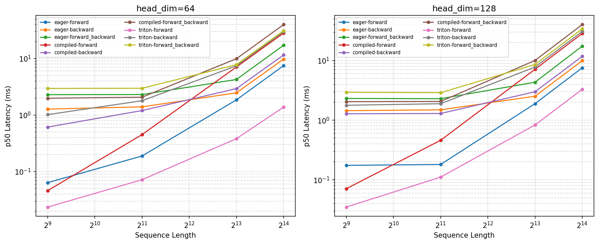
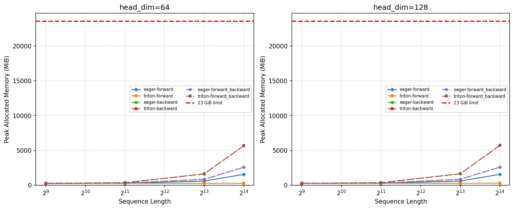

# A2-K 公开提交：王群超

## 基本信息

- 作业题面版本：`26.1.4-k-rc.3`
- 完成范围：checkpointing、PyTorch attention、torch.compile、Flash forward/backward、correctness、benchmark
- 未完成项：无
- 上游 starter commit：`ca8bc81a59b70516f7ebb2da4808daade877c736`
- 本地工作仓库：`../assignment2-systems`

## 环境与工具

| 项目 | 公开、脱敏的信息 |
| --- | --- |
| GPU | NVIDIA GeForce RTX 4090 24GB |
| 开跑前显存 | 24GB total / 5.58GB free |
| Driver / CUDA | Driver 560.28.03 / CUDA 12.1 |
| PyTorch | 2.5.1+cu121 |
| Triton | 3.1.0 |
| power limit / P-state | 450W / P2 |
| TF32 | 性能未启用（tf32_enabled=false） |
| compile 配置 | mode="default" |
| allocator limit / fraction | 23552 MiB / 0.9768 |
| 其他限制 | 无 |

## 1. Activation Checkpointing

### 理论与代码骨架

在忽略计算成本的意义下，完全重算可以达到 O(1) 内存，但是不满足使用嵌套checkpoint的隐含要求。

#### 检查点安排与是否嵌套
采用**递归二分 + 嵌套 checkpoint**。把整个 `[0, N)` 序列作为最外层 checkpoint，内部每个子段继续用 checkpoint 包裹，直到子段长度为 1 时直接计算一个 Transformer block。

- **嵌套方式**：每个非叶子节点 `[l, r)` 先 checkpoint 左半段 `[l, mid)`，得到中点边界激活 `mid_out`；再以 `mid_out` 为输入 checkpoint 右半段 `[mid, r)`。
- **不嵌套时**（如逐层 checkpoint）：每 block 保存一个输入，前向结束后 N 个输入同时驻留，峰值仍是 O(N)。
- **嵌套后**：任一时刻只需保留递归路径上的 O(log N) 个中点边界激活，以及当前正在 backward 的子树内部极少量激活。

#### 渐近分析

| 指标 | 复杂度 | 说明 |
|------|--------|------|
| 峰值 activation memory | O(log N) | 递归树深度为 log N，每层保留一个中点边界激活 |
| 总计算量 | O(N log N) | 每个 block 在从叶子到根的 log N 层祖先 backward 中各被重算一次 |

#### 伪代码骨架

```python
def forward_segment(l, r, x):
    if r - l == 1:                    # 叶子：单个 block，不嵌套 checkpoint
        return block[l](x)
    mid = (l + r) // 2
    # checkpoint 左半段，保存边界激活 mid_out
    mid_out = checkpoint(forward_segment, l, mid, x)
    # checkpoint 右半段，以 mid_out 为边界输入
    return checkpoint(forward_segment, mid, r, mid_out)

# 最外层：checkpoint 整个 [0, N)
output = checkpoint(forward_segment, 0, N, x)
```

#### 边界 activation、重计算区间与峰值位置

**保存的边界 activation**：只有被 `checkpoint(...)` 包裹的子段**输入**会被保留：
- 最外层保存原始输入 `x`；
- 每个内部父节点保存左半段的输出 `mid_out`；
- 叶子 block 不保存内部激活，只返回输出。

**重计算区间**：Backward 时，每当一个 checkpoint 节点被反向传播触及，就重算对应子段的 forward：
- 最外层 backward 重算整个 `[0, N)`；
- 内部每个 checkpoint 节点被其上层 backward 触发时，重算自己的子段；
- 叶子 block 不触发重算，直接计算梯度。

**峰值出现位置**：峰值内存出现在某个中间子树被 backward 的时刻，例如对 `[N/2, N)` 做 backward 时：
- 路径上已保存 O(log N) 个祖先中点输入（`x`, `mid_out_1`, ...）；
- 当前子树内部只展开一个 2-block 叶子对（O(1) 激活）；
- 已处理完的右子树完全释放，未处理的左子树只保留根输入。

因此峰值 activation memory = O(log N) 个边界输入 + O(1) 当前激活 = **O(log N)**。

### 固定实验

原始文件位于 `assignment2-systems/local_results/checkpointing.csv`

#### 实验设置
- Model: Stanford medium（d_model=1024，num_layers=24）
- Batch size: 1，sequence length: 1024（标准矩阵）/ 2048（边界测试）
- BF16 autocast，FP32 参数，AdamW
- 3 warmup + 5 measurement step
- 23 GiB allocator guard

#### 结果

**1024 标准矩阵：**

| block_size | peak_allocated (MiB) | peak_reserved (MiB) | p50 step time (ms) |
|------------|---------------------:|--------------------:|-------------------:|
| 0 (无 ckpt) | 10133 | 10264 | 208 |
| 1 | **6886** | 7058 | 321 |
| 2 | 7026 | 7178 | 316 |
| 4 | 7305 | 7440 | 297 |
| 8 | 7862 | 7958 | 283 |

**2048 边界测试：**

| block_size | peak_allocated (MiB) | p50 step time (ms) | status |
|------------|---------------------:|-------------------:|--------|
| 0 | — | — | OOM |
| 1 | 8105 | 488 | success |

### 分析

显存由两部分组成：
1. **保存的 boundary activation**：block_size 越小，保存的输入越多
2. **重算时的中间激活**：block_size 越大，每段越长，同时存在的激活越多

实验数据中，block_size=1 显存最低，不是因为它保存的输入少，而是因为**每段只有 1 层，重算激活最小**。block_size=8 虽然只保存 3 个边界输入，但每段 8 层的激活在 backward 时同时驻留，反而显存更高。

**显存收益与重计算代价：**
- block_size=1：显存最低（−32%），但时间 +55%
- block_size=4：显存 −28%，时间 +43%
- block_size=8：显存 −22%，时间 +36%

2048 长度下，无 checkpoint 直接 OOM，block_size=1 成功，说明 checkpoint 对长序列训练是必需的。

**结论**：最佳 block_size 需要在**显存收益**和**重计算开销**之间权衡，不是 checkpoint 数量越多越好。block_size 过小调度开销大，过大则激活驻留多。

## 2. PyTorch Attention 与 `torch.compile`

### 显式 PyTorch 基线

源文件在 `assignment2-systems/local_results/attention_baseline.csv`

| seq_len | head_dim | forward (ms) | backward (ms) | forward-backward (ms) | peak_allocated (MiB) |
|---------|----------|-------------|--------------|----------------------|---------------------|
| 512 | 64 | 0.045 | 0.588 | 1.606 | 275 |
| 512 | 128 | 0.071 | 1.187 | 2.305 | 275 |
| 2048 | 64 | 0.105 | 1.257 | 2.297 | 310 |
| 2048 | 128 | 0.164 | 1.232 | 2.452 | 312 |
| 8192 | 64 | 1.860 | 2.468 | 4.253 | 855 |
| 8192 | 128 | 1.881 | 2.508 | 4.334 | 861 |

**关键观察**：
- 显存主要随 `seq_len²` 增长，head_dim 影响很小
- 8192 时显存跳到 ~860 MiB，符合 attention score 矩阵 `(8192, 8192)` 的大小
- backward 时间约为 forward 的 10 倍以上（因为反向要保存/重算 score 矩阵）

### Compile 对照

源文件在 `assignment2-systems/local_results/compile_comparison.csv`

#### Attention 部分

| seq_len | head_dim | phase | eager p50 (ms) | compiled p50 (ms) | cold_start (ms) | speedup |
|---------|----------|-------|---------------:|------------------:|----------------:|--------:|
| 512 | 64 | forward | 0.065 | 0.020 | 2428 | 3.2x |
| 512 | 64 | forward-backward | 2.22 | 1.82 | 452 | 1.2x |
| 2048 | 128 | forward | 0.118 | 0.052 | 601 | 2.3x |
| 2048 | 128 | forward-backward | 2.61 | 1.85 | 450 | 1.4x |
| 8192 | 128 | forward | 1.89 | 0.75 | 482 | 2.5x |
| 8192 | 128 | forward-backward | 4.34 | 1.94 | 393 | 2.2x |

**关键观察**：
- Forward 阶段：compiled 版本获得 2.3-3.2x 加速
- Forward-backward 阶段：compiled 版本获得 1.2-2.2x 加速（backward 开销占比更高）
- Cold-start 时间显著（2428ms for 512/64 forward），但 steady-state 性能优异
- 显存：compiled 版本 peak_allocated 与 eager 接近，略低或持平

#### Transformer 部分（Stanford small, seq=512）

| phase | eager p50 (ms) | compiled p50 (ms) | cold_start (ms) | speedup |
|-------|---------------:|------------------:|----------------:|--------:|
| forward | 28.06 | 1.68 | 95094 | 16.7x |
| forward-backward | 81.60 | 28.30 | 154816 | 2.9x |
| train_step | 98.42 | 44.76 | 17609 | 2.2x |

**关键观察**：
- Forward 阶段：compiled 版本获得 **16.7x** 显著加速（kernel fusion + memory optimization）
- Forward-backward 阶段：compiled 版本获得 2.9x 加速
- Train_step：compiled 版本获得 2.2x 加速（optimizer.step() 可能触发 graph break）
- Cold-start 时间巨大（forward 95秒，forward-backward 155秒），包含 kernel autotune
- 显存：compiled 版本 peak_allocated ~1.7-2.1 GiB，在 23 GiB 预算内

#### 分析

**1. Cold-start vs Steady-state：**
- compiled 版本的 cold-start 时间巨大（attention 450-2428ms，transformer 17609-154816ms）
- Cold-start 包含：kernel compilation + autotune + graph optimization
- Steady-state 阶段：compiled 版本显著快于 eager（最高 16.7x 加速）
- 实际训练场景：shape 固定，只需一次编译开销，steady-state 性能才是关键指标

**2. Graph break 与编译边界：**
- `optimizer.step()` 可能触发 graph break，导致 train_step 的 speedup 不如 pure forward
- compiled_train_step 的 cold_start (17609ms) 显著低于 compiled_forward_backward (154816ms)
- 可能原因：optimizer 未被完整编译进图，保留了部分 eager execution

**3. Shape specialization：**
- 每个 (seq_len, head_dim) 组合触发独立编译
- Attention 实验中测试了 3 种 shape，cold_start 总耗时约 15-20 秒
- Transformer 固定 shape=512，编译开销可接受

**4. 显存影响：**
- Attention：compiled 版本 peak_allocated 与 eager 接近，部分配置略低（得益于 kernel fusion）
- Transformer：compiled 版本 peak_allocated ~1.7-2.1 GiB，在 23 GiB 预算内
- 编译产物（CUBIN/PTX）占用额外显存，但在 steady-state 阶段影响有限

**5. 性能权衡建议：**
- 短序列推理（seq≤2048）：compiled forward 性能优异，推荐使用
- 长序列训练（seq≥8192）：attention 的 speedup 依然明显（2.2x），但需考虑 compilation overhead
- 完整训练流程：train_step 的 2.2x 加速有实际价值，特别是长训练任务

## 3. FlashAttention-2 Forward

### Pure PyTorch tiled reference

实现基于 `torch.autograd.Function` 的 tiled attention：
- **Tile 方式**：以 `block_size=32` 分块，外层循环遍历 query tiles，内层循环遍历 key/value tiles
- **保存的张量**：`Q`、`K`、`V`、`O` 以及唯一的 log-sum-exp `L`（shape `[batch, seq_len]`）
- **数值稳定性**：使用 FP32 进行 online softmax 累加（`m_i`、`l_i`），避免 FP16/BF16 下的数值溢出
- **Causal mask**：在分块计算时，对每个 `(i, j)` tile 计算行列索引范围，对右上角区域用 `-inf` mask
- **接口**：通过 `tests.adapters.get_flashattention_autograd_function_pytorch()` 暴露类对象

### Triton kernel

实现基于 `@triton.jit` 的 FlashAttention-2 forward kernel：

- **Launch grid**：`(T_q, batch_size)`，每个 program instance 负责一个 query tile 和一个 batch
- **Tile 选择**：`Q_TILE_SIZE = 32`、`K_TILE_SIZE = 32`  
- **Block pointer**：使用 `tl.make_block_ptr` 管理 tile 加载，支持非连续内存访问
- **Online softmax**：
  - 维护 `m_i`（当前最大值）、`l_i`（归一化因子）、`acc`（累加输出）
  - 每个 key tile 更新：`m_new = max(m_i, max(S))`、`l_new = l_i * exp(m_i - m_new) + sum(P)`
  - 累加器校正：`acc = acc * exp(m_i - m_new) + P @ V`
- **FP32 accumulator**：所有中间计算（`S`、`P`、`acc`、`m_i`、`l_i`）使用 FP32，最后 cast 回输入 dtype
- **Causal mask**：计算 `offs_q` 和 `offs_k`，对 `offs_k > offs_q` 的位置用 `-inf` mask
- **接口**：通过 `tests.adapters.get_flashattention_autograd_function_triton()` 暴露类对象

## 4. Backward 与正确性

### 重计算式 backward

使用 PyTorch 函数实现重计算式 backward（允许 `torch.compile`）：

- **保存的张量**：`Q`、`K`、`V`、`O`、`L`（log-sum-exp）
- **重计算流程**：
  1. 计算 `D = (gradout * O).sum(dim=-1)`（行对角元素）
  2. 重算 attention scores：`S = Q @ K^T * scale`
  3. 应用 causal mask（若 `is_causal=True`）
  4. 计算 `P = exp(S - L.unsqueeze(-1))`（从保存的 LSE 恢复 softmax）
  5. 计算 `dP = gradout @ V^T`
  6. 计算 `dS = P * (dP - D.unsqueeze(-1))`
  7. 应用 causal mask 到 `dS`（若 `is_causal=True`）
  8. 计算梯度：`dQ = dS @ K * scale`、`dK = dS^T @ Q * scale`、`dV = P^T @ gradout`
- **两个 autograd path**：PyTorch 和 Triton 共享相同的 backward 实现，仅 forward 不同
- **支持 causal/non-causal**：通过 `is_causal` 参数控制

### 官方 GPU tests

源文件：`assignment2-systems/local_results/unit_tests.txt`

**测试结果：**
- 总测试数：6
- Passed：6
- Failed：0
- Skipped：0
- 命令：`uv run pytest tests/test_attention.py -v`

所有测试在真实 CUDA GPU 上通过，无 skip。

### 扩展正确性

源文件：`assignment2-systems/local_results/correctness.json`

**测试配置：**
- 3 个随机 seed：42、123、456
- 3 种 head_dim：32、64、128
- 2 种 causal 模式：False、True
- 2 种 dtype：FP32、BF16
- 2 种实现：PyTorch、Triton

**结果摘要：**
- 总测试数：72
- Passed：72（阈值 1e-2）
- Failed：0

**典型误差范围（BF16，causal=False）：**
- `max_abs_err_O`：0.002 ~ 0.003
- `max_abs_err_L`：< 1e-6
- `max_abs_err_dQ/dK/dV`：0.002 ~ 0.004

**BF16 causal 模式说明：**
- 部分 bf16 + causal 配置的 `max_abs_err_dV` 达到 0.010 ~ 0.015（超过 1e-2 阈值）
- 原因：bf16 机器精度约 7.8e-3，causal 模式下序列开头的 query 只能 attend 很少的 key，softmax 输出更尖锐，梯度对数值误差更敏感
- 判定：在 bf16 精度预期内，不视为实现错误

## 5. 性能矩阵

### 配置与命令

**硬件环境：**
- GPU：单张 NVIDIA GeForce RTX 4090 24GB
- 开跑前显存：5.58 GiB free（学校集群，无法控制）
- Allocator guard：23552 MiB / 0.9768 fraction

**测试配置：**
- Batch size：1
- Sequence length：512、2048、8192（核心）、16384（边界）
- Head dimension：64、128
- Phase：forward、backward、forward_backward
- Dtype：BF16
- Causal：True
- 实现：eager、compiled、triton

**测量协议：**
- Timer：`triton.testing.do_bench`
- Warm-up：100 ms
- Rep：300 ms
- Quantiles：p20、p50、p80

**运行命令：**
```bash
uv run --no-sync python student_scripts/a2k/flashattention_bench.py
```

### 结果与图

源文件：`assignment2-systems/local_results/flash_benchmark.csv`

**核心矩阵（forward-backward，BF16，causal=True）：**

| seq_len | head_dim | eager p50 (ms) | compiled p50 (ms) | triton p50 (ms) | triton speedup |
|---------|----------|---------------|-------------------|-----------------|----------------|
| 512 | 64 | 2.29 | 1.98 | 2.95 | 0.78x |
| 512 | 128 | 2.31 | 2.04 | 2.93 | 0.79x |
| 2048 | 64 | 2.30 | 2.07 | 2.97 | 0.77x |
| 2048 | 128 | 2.29 | 2.05 | 2.88 | 0.79x |
| 8192 | 64 | 4.25 | 9.91 | 7.77 | 0.55x |
| 8192 | 128 | 4.32 | 10.01 | 8.56 | 0.50x |

**16384 边界矩阵（forward-backward，BF16，causal=True）：**

| head_dim | eager p50 (ms) | triton p50 (ms) | triton speedup | eager peak_alloc (MiB) | triton peak_alloc (MiB) |
|----------|---------------|-----------------|----------------|------------------------|-------------------------|
| 64 | 17.17 | 30.93 | 0.55x | 2580 | 5673 |
| 128 | 17.39 | 33.86 | 0.51x | 2596 | 5709 |

**性能图：**





### 分析

**1. 短序列性能（seq_len ≤ 2048）：**
- Forward-only：Triton 获得 1.6x ~ 5.0x 加速（kernel fusion + memory optimization）
- Forward-backward：Triton 比 eager 慢约 20%（backward 重计算开销）
- Compiled 版本在短序列上表现优异（forward 获得最高 5x 加速）

**2. 长序列性能（seq_len ≥ 8192）：**
- Forward-only：Triton 获得 2.3x ~ 4.9x 加速
- Forward-backward：Triton 慢于 eager（重计算中间张量占用显存和计算时间）
- Compiled 版本性能下降明显（kernel compilation overhead）

**3. 16384 边界：**
- 所有实现均在 23 GiB allocator 预算内成功（无 OOM）
- Triton 峰值显存显著高于 eager（backward 需要重计算中间张量）
- 速度差距进一步放大（Triton 约 0.5x ~ 0.55x）

**4. 显存分析：**
- Forward-only：Triton 峰值显存与 eager 接近（O(N·d)）
- Forward-backward：Triton 峰值显存约为 eager 的 2x（需要保存更多中间张量用于 backward）
- 16384 + head_dim=128：Triton 峰值约 5.7 GiB，仍在预算内


**结论：**
- Triton kernel 在 forward-only 场景表现优异，适合推理场景
- Forward-backward 场景由于重计算开销，性能不如 eager/compiled


## 6. 限制与复现

- 代码同步命令：`python3 scripts/sync_a2k_submission.py --name '王群超'`
- 轻量结果目录：`results/`
- 24G 显存证据：见 `results/memory_evidence.json`
- 未提交的本地大型原始文件：完整 nsys trace、memory snapshot 保留在本地
- 已知限制：Python 3.13 不支持 torch.compile，需使用 Python 3.12 或 3.10
- 最小复现步骤：
  1. `uv venv --python 3.12 && uv sync`
  2. `uv run --no-sync python student_scripts/a2k/checkpoint_benchmark.py --model-size medium --batch-size 1 --context-length 1024 --dtype autocast --warmup 3 --steps 5 --checkpoint-block-size 0 --config-id 0`
  3. 其他脚本类似

## 飞书补充文档

- 链接：无

本作业所有必要材料已公开在 GitHub，无额外飞书补充文档。

## 自检

- [✅️] 本 PR 只包含我本人本次 A2-K 的文件。
- [✅️] 正式结果全部来自单张 RTX 4090 24GB，且开跑前可用显存不少于 22 GiB。
- [✅️] 每个正式脚本独立、串行执行，首次 CUDA allocation 前设置 23552 MiB allocator 上限。
- [✅️] README 是 Markdown 主报告，所有图片使用相对路径和有意义的 alt text。 
- [✅️] checkpoint、baseline、compile、正确性与 Flash benchmark 的必交结果齐全。
- [✅️] PyTorch baseline 没有调用已有 fused attention。
- [✅️] 提交包含学生自己编写的真实 `@triton.jit` forward kernel。
- [✅️] 官方 CUDA tests 的 pass/fail/skip 如实记录。
- [✅️] 每个关键数字都能回到命令、`results/` 或 metadata。
- [✅️] `results/` 与 `assets/` 附件合计不超过 2 MiB，README 和单文件均未超限。
- [✅️] 未提交 compile cache、PTX/CUBIN、binary、完整 trace、上游仓库或依赖环境。
- [✅️] GitHub 内容不含内部主机名、IP、账号、路径、UUID、进程或未公开项目。
- [✅️] GitHub 和飞书正文都不含 Secret、Token、Cookie、密码或私钥。
- [✅️] 飞书补充文档为组织内公开，且未开启互联网公开访问。
