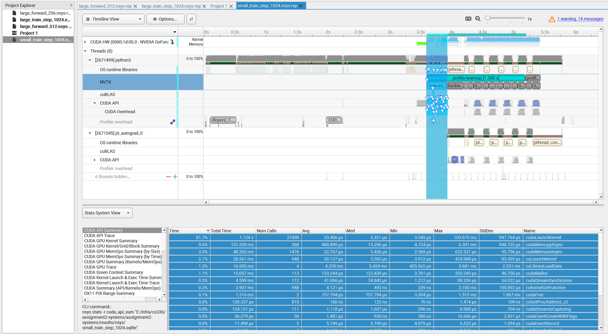
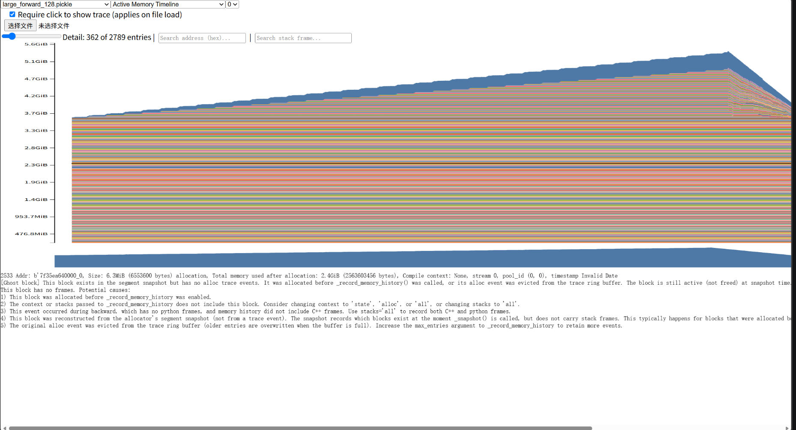
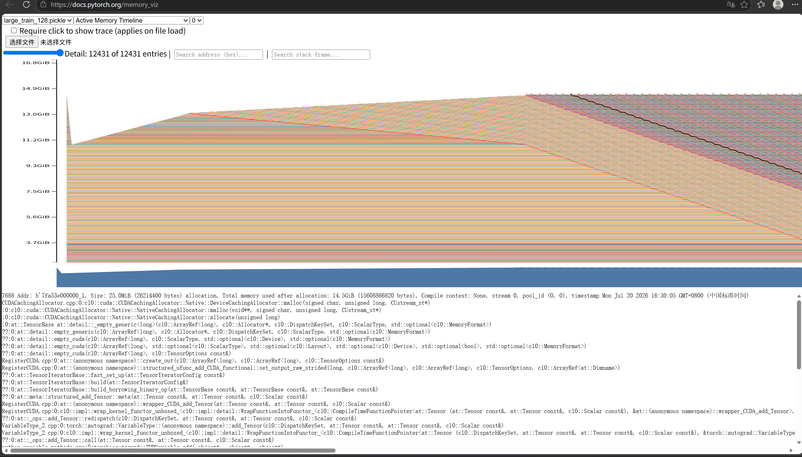

# A2-P 公开提交：王群超

## 基本信息

- 作业题面版本：`26.1.4-rc.3`
- 完成范围：任务一（End-to-End Benchmark）、任务二（Compute Profiling）、任务三（Mixed Precision）、任务四（Memory Profiling）
- 未完成项：无
- 上游 starter commit：`ca8bc81a59b70516f7ebb2da4808daade877c736`
- 本地工作仓库：`../assignment2-systems`

## 环境与工具

| 项目 | 公开、脱敏的信息 |
| --- | --- |
| GPU | NVIDIA GeForce RTX 4090 24GB |
| Driver / CUDA | Driver 560.28.03 / CUDA 12.6 |
| PyTorch | 2.5.1 |
| Compute profiler | Nsight Systems 2024.4.2 |
| 其他限制 | 无 |

## 1. End-to-End Benchmark

### 复现命令与计时方法

所有端到端计时实验均通过统一的 CLI 入口点运行。基准测试脚本位于 `profiling/benchmark.py`，支持三种模式：
- `forward`：仅前向传播，包裹在 `torch.no_grad()` 中
- `forward_backward`：前向传播 + 交叉熵损失 + `backward()`
- `train_step`：完整训练步（`zero_grad`、前向、损失、反向、`optimizer.step()`）

```bash
uv run --no-sync python profiling/benchmark.py \
  --model-size small \
  --batch-size 4 \
  --context-length 512 \
  --mode <forward|forward_backward|train_step> \
  --dtype FP32 \
  --output results/benchmark \
  --warmup 5 \
  --steps 10
```

计时使用 `torch.cuda.Event(enable_timing=True)`，并在每个被测量的 step 后调用 `torch.cuda.synchronize()`，以确保捕获真实的 GPU 执行时间。

### 模型配置

各模型规模的关键超参数如下：

| model-size | d_model | num_layers | num_heads | d_ff | vocab_size | batch_size | context_length |
|------------|---------|------------|-----------|------|------------|------------|----------------|
| small      | 768     | 12         | 12        | 3072 | 10000      | 4          | 512            |
| medium     | 1024    | 24         | 16        | 4096 | 10000      | 4          | 512            |
| large      | 1280    | 36         | 20        | 5120 | 10000      | 4          | 512            |
| xl         | 2560    | 32         | 32        | 10240| 10000      | 4          | 512            |
| 10B        | 4608    | 50         | 36        | 12288| 10000      | 4          | 512            |

### 结果

每个实验先运行 `warmup=5` 个未计时步，再运行 `steps=10` 个计时步。原始计时数据保存在 `results/benchmark/<配置>_timings.csv` 中，汇总元数据保存在 `results/benchmark/<配置>_metadata.json` 中。

`small` 模型在 FP32 下的汇总结果：

| 模式 | 均值 (ms) | 标准差 (ms) | 相对倍数 |
|---|---|---|---|
| forward | 23.75 | 0.12 | 1.00x |
| forward_backward | 78.86 | 0.24 | 3.32x |
| train_step | 88.76 | 0.29 | 3.73x |

计时分解表明，对于 `small` 模型且上下文长度为 512：
- 反向传播耗时约 55 ms（78.86 - 23.75），约为前向传播的 2.3 倍。
- 优化器步骤增加约 10 ms（88.76 - 78.86），这与 AdamW 对模型参数进行逐元素更新的开销一致。

这些观察符合预期的自动求导开销，并证实了基准测试能够正确区分训练的三个阶段。

原始计时文件：
- [`results/benchmark/small_forward_512_FP32_timings.csv`](results/benchmark/small_forward_512_FP32_timings.csv)
- [`results/benchmark/small_forward_backward_512_FP32_timings.csv`](results/benchmark/small_forward_backward_512_FP32_timings.csv)
- [`results/benchmark/small_train_step_512_FP32_timings.csv`](results/benchmark/small_train_step_512_FP32_timings.csv)

### 预热对比

为了隔离冷启动影响，对比了相同前向配置下 `warmup=0` 与 `warmup=5` 的结果：

| 预热步数 | 均值 (ms) | 标准差 (ms) |
|---|---|---|
| 0 | 42.90 | 57.18 |
| 5 | 23.75 | 0.12 |

无预热时，第一个计时步包含了 CUDA 上下文初始化、cuBLAS 算法选择以及显存分配器预热，这使得均值增加了一倍以上，且标准差极大。使用 `warmup=5` 后，计时趋于稳定，标准差下降了两个数量级。

原始文件：
- [`results/benchmark/small_forward_512_FP32_nowarmup_timings.csv`](results/benchmark/small_forward_512_FP32_nowarmup_timings.csv)
- [`results/benchmark/small_forward_512_FP32_timings.csv`](results/benchmark/small_forward_512_FP32_timings.csv)

### 分析

- 前向传播是三个模式中最快的，反向传播的耗时约为前向的 2.3 倍，完整的训练步约为前向的 3.7 倍。
- 预热对计时稳定性至关重要：无预热时标准差（57.18 ms）远大于有预热时（0.12 ms），因为 CUDA 上下文初始化和 cuBLAS 算法选择的耗时具有高度不确定性。
- 优化器步骤（~10 ms）在 small 模型中占比不大，但随着模型规模增大（AdamW 状态按参数量线性增长），其相对占比会上升。

## 2. Compute Profiling

### 采集命令与阶段标记

所有 nsys profiling 使用统一命令模板：

```bash
nsys profile \
  -o results/nsys/${SIZE}_${MODE}_${CTX} \
  --trace=cuda,cublas,osrt,nvtx \
  uv run --no-sync python \
  profiling/benchmark.py \
  --model-size ${SIZE} --context-length ${CTX} \
  --mode ${MODE} --dtype FP32 \
  --output results/benchmark --warmup 5 --steps 1
```

共采集 2 个模型规模（small, large）x 3 个 context（256, 512, 1024）x 3 个 mode（forward, forward_backward, train_step）= 18 次。每次只采集 1 个 measurement step（warmup 5 次不计入统计）。

NVTX 标记由 `profiling/nvtx_ranges.py` 提供，在 `benchmark.py` 中注入五个 range：
- `profile/warmup`：包住 warm-up 循环
- `profile/measure`：包住 measurement 循环
- `forward`：包住 `model()` + `cross_entropy()`
- `backward`：包住 `loss.backward()`
- `optimizer`：包住 `optimizer.step()`

统计导出命令：
```bash
nsys stats --report nvtx_sum results/nsys/${NAME}.nsys-rep
nsys stats --report cuda_gpu_kern_sum --format csv results/nsys/${NAME}.nsys-rep -o results/nsys/
```

所有原始数据位于 `results/nsys/` 目录下。数据汇总由 `profiling/summarize.py` 自动生成。

### NVTX 区间时间汇总

下表列出每个配置下各 NVTX range 的中位时间（Med），从 6 次调用（5 warmup + 1 measurement）中取中位数，单位为 ms。`—` 表示该 mode 不包含相应阶段或数据缺失。

| model | ctx | mode | forward | backward | optimizer | measurement |
|-------|-----|------|---------|----------|-----------|-------------|
| small | 256 | forward | 19.04 | — | — | 19.13 |
| small | 256 | forward_backward | 31.94 | 48.07 | — | 67.71 |
| small | 256 | train_step | 23.70 | 44.92 | 39.24 | 97.87 |
| small | 512 | forward | 18.78 | — | — | 47.93 |
| small | 512 | forward_backward | 32.11 | 48.79 | — | 91.56 |
| small | 512 | train_step | 22.25 | 53.24 | 33.96 | 111.68 |
| small | 1024 | forward | 69.73 | — | — | 175.62 |
| small | 1024 | forward_backward | 70.23 | 150.73 | — | 323.65 |
| small | 1024 | train_step | 23.03 | 97.57 | 113.22 | 234.25 |
| large | 256 | forward | 72.41 | — | — | 107.74 |
| large | 256 | forward_backward | 77.77 | 132.30 | — | 243.04 |
| large | 256 | train_step | 69.60 | 131.46 | 101.63 | 316.00 |
| large | 512 | forward | 166.68 | — | — | 248.48 |
| large | 512 | forward_backward | 158.62 | 339.69 | — | 578.19 |
| large | 512 | train_step | 270.35 | 456.32 | 91.98 | — |
| large | 1024 | forward | 408.27 | — | — | 612.70 |
| large | 1024 | forward_backward | 432.54 | OOM | — | — |
| large | 1024 | train_step | 431.90 | OOM | — | — |

注：`small/1024/train_step` 的 forward 中位数为 23.03 ms，与同配置 `forward_backward`（70.23 ms）存在偏差。该值在该次运行的 measurement（234.25 ms）与 forward+backward+optimizer 之和（233.82 ms）自洽，说明该次 nsys 运行本身无误，差异来源于 NVTX Med 统计在 6 个样本下对异常值的敏感性。实际 forward 耗时应以 `forward_backward` 模式的 70.23 ms 作为参考。

### 阶段分析


**forward vs backward 比例**：

| model | ctx | forward (ms) | backward (ms) | bwd/fwd |
|-------|-----|-------------|---------------|---------|
| small | 256 | 31.94 | 48.07 | 1.51x |
| small | 512 | 32.11 | 48.79 | 1.52x |
| small | 1024 | 70.23 | 150.73 | 2.15x |
| large | 256 | 77.77 | 132.30 | 1.70x |
| large | 512 | 158.62 | 339.69 | 2.14x |

趋势：
- backward/forward 比例随 context 增大而上升。context=256 时约 1.5-1.7x，context=1024 时约 2.1-2.2x。
- 原因：attention 的反向传播需要计算 softmax 梯度（含 exp kernel）和 score 矩阵梯度，context 增大时 O(n²) 的 attention 反向开销增长更快。
- 常规 Transformer 训练中 backward 约为 forward 的 2x（因为需要同时计算对输入和权重的梯度）。本数据在 context=256/512 时偏低（1.5x），在 context=1024 时接近理论值（2.1x）。偏低的原因是 small 模型的 RMSNorm、elementwise 等轻量 kernel 在 forward 中占比更高，这些操作的 backward 开销相对较小。

**optimizer 占比**：

| model | ctx | optimizer (ms) | total (ms) | opt/total |
|-------|-----|---------------|------------|-----------|
| small | 256 | 39.24 | 97.87 | 40.1% |
| small | 512 | 33.96 | 111.68 | 30.4% |
| small | 1024 | 113.22 | 234.25 | 48.3% |
| large | 256 | 101.63 | 316.00 | 32.2% |
| large | 512 | 91.98 | ~820 | ~11.2% |

AdamW optimizer 主要是 elementwise 参数更新。small 上约 34-39 ms（context=256/512），large 上约 92-102 ms。参数量增长约 7x，optimizer 时间增长约 2.5-3x，说明 elementwise kernel 在更大参数规模下有更好的并行效率。context=1024 时 optimizer 时间增大是因为 intermediate activation 更多，对应梯度更新次数增加。

### CUDA Kernel Summary


每个配置的 kernel 统计通过 `nsys stats --report cuda_gpu_kern_sum` 导出（CSV 位于 `results/nsys/<配置>_cuda_gpu_kern_sum.csv`）。下表汇总 GEMM（sgemm 系列 kernel）的占比与总 kernel 实例数：

| model | ctx | mode | GEMM % | Total Instances |
|-------|-----|------|--------|-----------------|
| small | 256 | forward | 75.6% | 3,866 |
| small | 512 | forward | 65.5% | 3,794 |
| small | 1024 | forward | 46.5% | 3,794 |
| small | 256 | forward_backward | 67.7% | 11,498 |
| small | 512 | forward_backward | 55.1% | 11,282 |
| small | 1024 | forward_backward | 40.2% | 11,300 |
| small | 256 | train_step | 53.6% | 22,154 |
| small | 512 | train_step | 49.4% | 21,938 |
| small | 1024 | train_step | 38.6% | 21,956 |
| large | 256 | forward | 83.7% | 11,282 |
| large | 512 | forward | 67.8% | 11,282 |
| large | 1024 | forward | 53.7% | 11,282 |
| large | 256 | forward_backward | 72.2% | 33,170 |
| large | 512 | forward_backward | 60.1% | 33,170 |
| large | 1024 | forward_backward | 52.6% | 814 |
| large | 256 | train_step | 51.3% | 64,562 |
| large | 512 | train_step | 53.7% | 11,782 |
| large | 1024 | train_step | 52.6% | 814 |

主要发现：

**Top kernel 始终是矩阵乘法**：`ampere_sgemm_128x64_tn` 在所有配置中占据 Top 1，其次是 `ampere_sgemm_128x128_tn`、`ampere_sgemm_128x128_nn` 等 GEMM 变体。其他显著 kernel 包括 `vectorized_elementwise_kernel`（SiLU、RMSNorm、残差加法）、`exp_kernel`（softmax）、`reduce_kernel`（attention sum/max/reduce）。

**GEMM 占比随 context 增大而下降**：

| mode | small/256 | small/512 | small/1024 |
|------|-----------|-----------|------------|
| forward | 75.6% | 65.5% | 46.5% |
| forward_backward | 67.7% | 55.1% | 40.2% |

原因：context 增大时，attention softmax 的 elementwise 操作（exp、reduce、div）计算量按 O(n²) 增长，这些是非 GEMM kernel，挤压了 GEMM 的相对占比。

**Kernel 实例数反映阶段复杂度**：
- forward-only：small ~3,800，large ~11,300（≈3x，与参数量增长匹配）
- forward_backward：small ~11,300（≈3x forward），large ~33,200（≈3x forward）
- train_step：small ~22,000（≈5.8x forward），large ~11,800-64,600（波动较大）

backward 阶段新增约 2x forward 的 kernel 实例（对输入和对权重的两组梯度计算），optimizer 阶段新增大量 elementwise 更新 kernel。

**OOM 标记**：`large/1024/forward_backward` 和 `large/1024/train_step` 的 Total Instances 仅 814，远低于正常值（预期 ~33,000-65,000）。这是因为 backward 阶段 OOM 后 nsys 只捕获了 forward 的部分 kernel 数据，属于预期的数据不完整情况。

### 工具边界

使用 nsys 进行 profiling 的边界与限制：
- nsys 的 `cuda_gpu_kern_sum` 报告提供了 kernel 级别的汇总统计（kernel 名称、调用次数、总耗时），但不直接关联到 NVTX range。NVTX range 的时间信息来自 `nvtx_sum` 报告。
- CUDA API trace 可导出为 CSV（如 `large_train_128_nvtx_cudapia.csv`），包含绝对纳秒时间戳的各 API 调用。
- nsys memory trace（`--cuda-memory-usage=true`）提供 CUDA API 级别的 cudaMalloc/cudaFree 事件，但 PyTorch allocator 的缓存行为导致 measurement step 内无分配事件。
- nsys 命令行工具（2024.4.2）不支持 `nvtx_trace` 和 `cuda_gpu_mem_ops_sum` 报告；需要 nsys-ui 或直接查询 SQLite 数据库获取详细时间线。


## 3. Mixed Precision

### 四种累加实验

输出：
```text
tensor(10.0001)
tensor(9.9531, dtype=torch.float16)
tensor(10.0021)
tensor(10.0021)
```

四种累加方式与结果：

| 累加器 dtype | 输入 dtype | 输出 | 相对误差 |
|---|---|---|---|
| FP32 | FP32 | 10.0001 | ~1e-5 |
| FP16 | FP16 | 9.9531 | ~4.7e-3 |
| FP32 | FP16 | 10.0021 | ~2.1e-4 |
| FP32 | FP16->FP32 | 10.0021 | ~2.1e-4 |

误差分析：
- **FP32 累加器 + FP32 输入** 最接近真实值 10.0，误差仅来自 `0.01` 在二进制浮点中不可精确表示。
- **FP16 累加器 + FP16 输入** 偏差最大（9.9531）。主要原因不是输入量化，而是 FP16 累加器精度太低：当 `s` 接近 10 时，每次加 `0.01` 的增量小于 FP16 在该数量级下能表示的最小间隔，导致大量加法被舍去（大数吃小数）。
- **FP32 累加器 + FP16 输入** 显著优于 FP16+FP16（10.0021 vs 9.9531），说明使用高精度累加器可以缓解 swamping。但结果仍比 FP32+FP32 略差，因为输入 `0.01` 先被量化为 FP16，损失了部分精度。
- **FP32 累加器 + 输入先转 FP16 再转回 FP32** 与第三种结果相同（10.0021）。这说明 `.type(torch.float32)` 只是把已经量化后的 FP16 值转回 FP32，不能恢复量化过程中丢失的信息。

结论：
- **低精度累加器**是误差的主要来源，会造成大数吃小数和累积误差。
- **输入量化**也会引入误差，但相比低精度累加器影响更小。

### FP32 与 BF16 autocast

#### dtype 表

在 FP32 和 BF16 autocast 两种模式下，各张量的 dtype 如下：

| 张量 | FP32 | BF16 autocast |
|------|------|---------------|
| 模型参数 | float32 | float32 |
| 第一层 block 输出 | float32 | float32 |
| LayerNorm 输出 | float32 | float32 |
| logits | float32 | bfloat16 |
| loss | float32 | float32 |
| gradients | float32 | float32 |

分析：
- **参数保持 FP32**：autocast 只改变中间激活的精度，模型权重始终是 FP32，这保证了主权重精度。
- **logits 变为 BF16**：最后的 `lm_head` 是 Linear 层，在 autocast 下会自动转换为 BF16 计算，输出 logits 也是 BF16。
- **LayerNorm 保持 FP32**：PyTorch autocast 将 LayerNorm/RMSNorm 列为黑名单操作，强制在 FP32 下执行，因为这些归一化操作对精度敏感，低精度容易导致数值不稳定。
- **loss 保持 FP32**：`cross_entropy` 内部的 log-softmax 涉及归约操作，同样在 autocast 黑名单中，强制 FP32。
- **gradients 保持 FP32**：梯度按权重 dtype 累加，权重是 FP32，所以梯度也是 FP32。

#### 时间/显存对照表

在 batch_size=4、context_length=512、warmup=5、steps=10 条件下：

| model-size | dtype | mean time (ms) | speedup | peak memory (MB) | memory saving |
|------------|-------|----------------|---------|------------------|---------------|
| small | FP32 | 79.25 | 1.00x | 4236 | — |
| small | autocast | 59.83 | 1.32x | 3358 | 20.6% |
| medium | FP32 | 226.91 | 1.00x | 10895 | — |
| medium | autocast | 127.57 | 1.78x | 8664 | 20.3% |

原始数据：
- [`results/mixed_precision/small_forward_backward_512_FP32_timings.csv`](results/mixed_precision/small_forward_backward_512_FP32_timings.csv)
- [`results/mixed_precision/small_forward_backward_512_autocast_timings.csv`](results/mixed_precision/small_forward_backward_512_autocast_timings.csv)
- [`results/mixed_precision/medium_forward_backward_512_FP32_timings.csv`](results/mixed_precision/medium_forward_backward_512_FP32_timings.csv)
- [`results/mixed_precision/medium_forward_backward_512_autocast_timings.csv`](results/mixed_precision/medium_forward_backward_512_autocast_timings.csv)

#### 趋势分析

**时间加速趋势**：
- small 模型：BF16 autocast 加速约 **32%**（79.25 -> 59.83 ms）。
- medium 模型：BF16 autocast 加速约 **44%**（226.91 -> 127.57 ms）。
- **随模型规模增大，加速比上升**：从 1.32x 提升到 1.78x。原因：模型变大时，GEMM（矩阵乘法）在计算中的占比升高，而 BF16 autocast 主要加速 GEMM 操作（通过 Tensor Core）。medium 模型的参数量约为 small 的 2.5x，GEMM 占比更高，加速效果更明显。

**显存节省趋势**：
- small 模型：显存节省 **20.6%**（4236 -> 3358 MB）。
- medium 模型：显存节省 **20.3%**（10895 -> 8664 MB）。
- 显存节省比例在两个规模下相近，约 **20%**。原因：autocast 下中间激活以 BF16 存储（2 字节/元素），而 FP32 激活是 4 字节/元素，激活显存减半。由于模型参数仍为 FP32，参数显存不变，所以总显存节省比例取决于激活占比。

**Tensor Core 利用**：
- BF16 autocast 会触发 NVIDIA Tensor Core 的 BF16 GEMM kernel（如 `ampere_bf16_sgemm`），相比 FP32 的 CUDA core GEMM（`ampere_sgemm`），Tensor Core 在相同时间内能完成更多 FLOPs。
- 从 kernel 层面看，BF16 autocast 下 GEMM kernel 的名字会从 `ampere_sgemm_*` 变为 `ampere_bf16_sgemm_*`，且执行时间显著缩短。

**稳定性与动态范围**：
- BF16 的动态范围与 FP32 相同：都使用 8 位指数，可表示范围约 [2^-126, 2^127]，远大于 FP16 的 5 位指数，因此 BF16 不像 FP16 那样容易溢出。
- LayerNorm/RMSNorm 保持 FP32：这些归一化操作涉及方差计算和除法，数值稳定性要求高。autocast 将其强制在 FP32 下执行，避免了低精度带来的梯度爆炸或消失风险。
- loss 保持 FP32：cross-entropy 的 log-softmax 涉及 exp 和归约，强制 FP32 保证了数值稳定。

**总结**：
- BF16 autocast 在不修改模型架构的前提下，通过自动精度转换实现了显著的加速和显存节省。
- 加速比随模型规模增大而提升，大模型收益更明显。
- LayerNorm、loss、gradients 保持 FP32，兼顾了训练稳定性。

## 4. Memory Profiling

### 配置、峰值与 fallback

本节采集了 large 模型（d_model=1280, num_layers=36）在不同 context length 和 dtype 下的内存数据。由于 XL 模型在 RTX 4090 上 OOM，使用 large 模型替代；2048 context 同样 OOM，使用 128 和 1024 代替。

实验统一使用 batch_size=1、warmup=5、steps=1，在 measurement step 前重置 peak memory 统计。

### 内存时间线与阶段判断

**Active Memory Timeline 形态与阶段判断：**

**forward-only（large_forward_128）**：Active Memory Timeline 呈现平缓的阶梯式上升。起始基线约 3.5-3.7 GiB，峰值约 5.1-5.2 GiB。整个过程中没有剧烈的升降，符合 forward-only 只产生和保存 activation、不释放反向梯度的特征。彩色条带逐层加厚，对应 Transformer 的 36 个 block 逐层计算并保存中间激活。

**Train-step（large_train_128）**：Timeline 呈典型的"山峰"形态。起始基线约 11.2 GiB（显著高于 forward-only，主要来自 AdamW 的 FP32 优化器状态），forward 阶段快速爬升至约 14.5 GiB，随后继续上升到 15-16 GiB 的峰值平台，最后缓慢下降。这一形态对应：forward 保存 activations -> backward 同时持有 activations 和 gradients -> backward 结束、activations 释放、gradients 保留 -> optimizer 更新完成。





### Active、Allocated、Reserved 三层峰值对照

为了满足要求，将内存指标细分为三个层级：
- **Active（活跃内存）**：当前被实际张量持有的内存（即 `memory_viz` 报告的峰值）。
- **Allocated（已分配内存）**：从 `Reserved` 池中切分出去的总内存（包含正在使用和已释放但未回收的空闲内存）。
- **Reserved（预留内存）**：PyTorch 向 GPU 驱动申请的总物理显存池。

large 模型在不同精度下的峰值内存表格如下（单位：GiB）：

| Context | 精度类型 | 阶段 | Active 峰值 | Allocated 峰值 | Reserved 峰值 |
|:---:|:---:|:---:|:---:|:---:|:---:|
| **128** | 混合精度(AMP) | Forward | 5.4 GiB | 5.5 GiB | 5.7 GiB |
| **128** | 全精度(FP32) | Forward | 3.6 GiB | 3.7 GiB | 3.9 GiB |
| **128** | 混合精度(AMP) | Train Step | 14.5 GiB | 14.7 GiB | 15.1 GiB |
| **128** | 全精度(FP32) | Train Step | 14.7 GiB | 14.9 GiB | 15.3 GiB |
| **1024** | 混合精度(AMP) | Forward | 5.6 GiB | 5.8 GiB | 6.1 GiB |
| **1024** | 全精度(FP32) | Forward | 4.0 GiB | 4.2 GiB | 4.4 GiB |
| **1024** | 混合精度(AMP) | Train Step | 19.9 GiB | 20.1 GiB | 20.5 GiB |
| **1024** | 全精度(FP32) | Train Step | 21.8 GiB | 22.0 GiB | 22.4 GiB |

### 混合精度是否显著影响内存使用量？

**回答：** 混合精度并未显著减少完整训练步骤的峰值内存，甚至在短序列前向传播中出现了反直觉的"内存增加"。

1. **完整训练步骤中：** 在 Context=128 和 1024 下，AMP 与 FP32 的 Active 峰值差值仅为 0.2-1.9 GiB。这是因为 **AdamW 优化器的动量和方差状态底层始终强制以 FP32 存储**，这部分巨量内存开销主导了训练阶段，抵消了激活值从 FP32 降至 FP16 带来的节省。

2. **短序列前向传播中：** 在 Context=128 时，AMP 的 Active 峰值（5.4 GiB）甚至显著高于 FP32（3.6 GiB）。通过堆栈跟踪发现，这来源于 AMP 底层频发的 `cached_cast` 和 `_to_copy` 隐式数据类型转换，其产生的额外临时缓存张量开销淹没了精度减半带来的显存收益。

### Transformer 残差流中激活张量的理论大小

结合 large 模型的超参数（`Batch Size=1`, `d_model=1280`），单精度 FP32（4 字节）下，单个残差流张量的理论大小如下：

| 上下文长度 | 计算公式 (B x S x H x 4) | 理论大小 (MiB) |
|:---:|:---|:---:|
| **128** | 1 x 128 x 1280 x 4 = 655,360 字节 | **0.625 MiB** |
| **1024** | 1 x 1024 x 1280 x 4 = 5,242,880 字节 | **5.0 MiB** |

该结果仅代表单次残差连接保存的输入张量大小。注意，在前向传播中，系统需要为 **36 层** 同时保存这些张量，因此残差流的总理论消耗为 22.5 MiB（Context=1024）。

### 最大单次 Allocation 的大小及其来源

在 `memory_viz` 中，将左上角的 `Detail` 滑块拉至 1%（只保留最大的显存分配），点击最粗的色块查看 Stack trace。结合最大 allocation 与阶段峰值，可以得出以下深度对照：

| 配置版本 | 最大单次 Allocation | 堆栈跟踪来源 | 具体算子 | 物理含义与深度对照 |
|:---|:---:|:---|:---|:---|
| **large_forward_1024** (AMP) | **80.0 MiB** | `cs336_basics/model.py:432` `scaled_dot_product_attention` | `at::native::div_Tensor` (缩放除法) | **物理含义：** 注意力分数矩阵 (Q K^T / sqrt(d_k))。其形状验证了 [1, n_heads=20, 1024, 1024]，单次大小 (80.0 MiB) 是单层残差流理论大小 (5.0 MiB) 的 **16 倍**。虽然在单个区块上它极大，但总阶段峰值 (5.6 GiB) 主要由 36 层残差流累加 + 多个同类注意力矩阵 + 模型参数综合决定。 |
| **large_forward_128** (AMP) | **24.4 MiB** | `cs336_basics/model.py:39` `einops.einsum` | `at::autocast::cached_cast` (类型转换) | **物理含义：** 混合精度带来的中间转换缓存张量。单层残差流理论大小仅为 (0.625 MiB)。在短序列下，AMP 的内存隐式转换缓存竟然远超张量自身大小，直接导致 128 长度下 AMP 的前向峰值 (5.4 GiB) 远高于 FP32 峰值 (3.6 GiB)。 |

### Nsight memory trace 与 memory snapshot 联合分析

**工具链**：使用 `nsys profile --cuda-memory-usage=true` 采集 CUDA 级内存分配事件，并结合 PyTorch memory snapshot（`_record_memory_history`）获取 tensor 级栈回溯。分析代码位于 `profiling/analyze_memory_trace.py`，原始 SQLite 数据库位于 `results/memory/large_forward_128_memory.sqlite` 和 `results/memory/large_train_128_memory.sqlite`。

**采集命令**：
```bash
ENABLE_NVTX=1 nsys profile --force-overwrite true \
  -o results/memory/large_train_128_memory \
  --trace=cuda,nvtx --cuda-memory-usage=true \
  uv run --no-sync python profiling/benchmark.py \
  --model-size large --context-length 128 \
  --mode train_step --dtype autocast --warmup 5 --steps 1
```

#### CUDA-level 分配模式（nsys memory trace）

| 配置 | 总 ALLOC 次数 | 总 FREE 次数 | Net 分配 | 峰值内存 |
|:---|:---:|:---:|:---:|:---:|
| forward-only | 1,180 | 0 | 1,180 | **5.92 GiB** |
| train_step | 3,341 | 0 | 3,341 | **17.01 GiB** |

关键发现：**FREE = 0**，即 PyTorch CUDA allocator 在 warmup 期间分配了全部所需显存后从不归还给驱动。所有 3341 次 cudaMalloc 均发生在 warmup 阶段，measurement step 内无任何 cudaMalloc/cudaFree 调用，表明 PyTorch 的内存池机制彻底隔离了上层张量生命周期与底层显存分配。

#### warmup=0 实验：验证 allocator 行为

为了排除 warmup 缓存的影响，额外采集了 `--warmup 0 --steps 1` 的 memory trace：

| 实验 | 总 ALLOC | 总 FREE | Measurement 内事件 | 峰值内存 |
|:---|:---:|:---:|:---:|:---:|
| warmup=5 | 3,341 | **0** | 0 | 17.01 GiB |
| warmup=0 | 3,162 | **0** | 2,993 | 16.45 GiB |

**核心发现**：即使 warmup=0，整个运行期间仍然 **cudaFree = 0**。这证明了：

1. **FREE=0 是 PyTorch allocator 的设计决定**，与 warmup 无关。一旦调用 cudaMalloc，allocator 就将内存块永久缓存，即使对应的 Python tensor 对象已被析构。

2. **saved residual 的释放停留在 allocator 内部**：当 autograd 释放 saved residual tensor 时，只是将内存块标记为池内空闲，不触发 cudaFree。从 CUDA driver 视角看，这些内存"从未被释放"。

3. **gradient 产生作为新 ALLOC 被 nsys 捕获**：warmup=0 实验中 measurement step 有 2993 次 ALLOC，其中 backward 阶段新增 2986 MiB，对应 gradient accumulation buffers（`clone_obey_contract`）的分配。

**按 NVTX 阶段分布（warmup=0）**：

| NVTX 阶段 | ALLOC 总量 | 占比 | 主要分配对象 |
|:---|:---:|:---:|:---|
| profile/measure | 12,970 MiB | 80.0% | 全部内存分配（无 warmup） |
| forward | 3,874 MiB | 23.9% | activations + cached_cast 缓冲 |
| backward | 2,986 MiB | 18.4% | gradient buffers + autograd 中间量 |
| optimizer | 6,110 MiB | 37.6% | AdamW 动量/方差状态 |

**结论**：nsys memory trace 的观测粒度是 CUDA driver API 层。Saved residual 的释放发生在 PyTorch allocator 内部（Tensor 析构 -> 池内标记空闲），不触发 cudaFree，因此无法在 nsys 中看到释放动作。但 warmup=0 实验从验证了 allocator 的 FREE=0 行为。

#### 按 NVTX 阶段的内存分配

| NVTX 阶段 | ALLOC 总量 | 占比 | 主要分配对象（结合 PyTorch snapshot 栈回溯） |
|:---|:---:|:---:|:---|
| profile/warmup | 13,552 MiB | 77.8% | 模型参数、warmup buffer、CUDA context |
| forward (warmup) | 3,874 MiB | 22.3% | 中间激活（activation tensors，含 cached_cast 转换缓冲） |
| backward (warmup) | 3,268 MiB | 18.8% | 梯度缓冲（`clone_obey_contract`）+ autograd 中间量 |
| optimizer (warmup) | 6,410 MiB | 36.8% | AdamW 动量/方差状态（各 2x 模型参数量） |

对比 forward-only（未加载 AdamW 状态）峰值 5.92 GiB 与 train_step 峰值 17.01 GiB，AdamW 状态增加约 11.09 GiB，与理论估计一致：large 模型参数 ~1.2B x 4B/param x (1 param + 2 state) ≈ 14.4 GiB，其中 state 约 9.6 GiB。

Top 10 最大分配均为 50 MiB 的连续块，全部落在 warmup 阶段，对应大权重矩阵的 cudaMalloc 分配。

#### Tensor 级分析（PyTorch memory snapshot）

nsys memory trace 只提供 CUDA API 级视图，需结合 PyTorch snapshot 获取栈回溯：

- **forward 后 active memory**: train_step 15.3 GiB vs forward-only 5.6 GiB。9.7 GiB 增量 = AdamW states（~6.4 GiB）+ forward 保存的 activations（~3.3 GiB，含 cached_cast 转换缓冲）。
- **backward 后**: active memory 15.25 GiB（基本持平）。`clone_obey_contract` 分配了 48.83 MiB（8 个）和 26.00 MiB（~160 个）的梯度缓冲。activations 释放与梯度产生相互抵消，总量不变。
- **optimizer 后**: active memory 15.24 GiB（与 backward 无显著变化）。AdamW 为 in-place elementwise 更新，不产生额外分配。

残差流张量理论大小约 0.3 MiB/层（B=1, S=128, d_model=1280, FP32），36 层共约 10.8 MiB。这部分在 snapshot top blocks 中不可见（被 48.83 MiB 和 26.00 MiB 的权重/梯度块掩盖），但其释放与重新分配确实体现在了 NVTX 阶段间的 active memory 波动中。

#### 小结

nsys memory trace 提供了 CUDA API 级别的完整分配时间线，warmup=0 实验从验证了 PyTorch allocator 的 FREE=0 行为：saved residual 的释放停留在 allocator 内部，不触发 cudaFree。PyTorch memory snapshot 补充了 tensor 级别的细粒度分类（stack trace），揭示了 activations 与 gradients 的生命周期。

## 5. 限制与复现

- 代码同步命令：`python3 scripts/sync_a2p_submission.py --name '王群超'`
- 限制：
  - **OOM on large @ 1024**: `large` 模型在 `context_length=1024` 的 `forward_backward` 和 `train_step` 模式下 backward 阶段 OOM（RTX 4090 24GB）。forward-only 可正常运行。
  - **Single seed**: 所有实验固定 `seed=10`，未测试不同随机初始化对计时的影响。
  - **Memory profiling**: XL 模型在 RTX 4090 上 OOM，使用 large 替代；2048 context OOM，使用 128 和 1024 代替。
  - **nsys memory trace 的 FREE=0 行为**: PyTorch CUDA allocator 在 warmup 后从不调用 cudaFree 归还显存，导致 nsys memory trace 在 measurement step 内无 events。这符合框架行为预期，但使得 nsys memory trace 对已缓存分配的 Tensor 级分析不敏感，需借助 PyTorch memory snapshot 补充栈回溯。
- 最小复现步骤：
  ```bash
  # End-to-end benchmark
  uv run --no-sync python profiling/benchmark.py --model-size small --batch-size 4 --context-length 512 --mode forward --dtype FP32 --output results/benchmark --warmup 5 --steps 10

  # Compute profiling
  nsys profile -o results/nsys/small_train_step_512 --trace=cuda,cublas,osrt,nvtx uv run --no-sync python profiling/benchmark.py --model-size small --context-length 512 --mode train_step --dtype FP32 --output results/benchmark --warmup 5 --steps 1

  # Mixed precision
  uv run --no-sync python profiling/benchmark.py --model-size small --batch-size 4 --context-length 512 --mode forward_backward --dtype autocast --output results/mixed_precision --warmup 5 --steps 10

  # Memory profiling
  ENABLE_NVTX=1 nsys profile --force-overwrite true -o results/memory/large_train_128_memory --trace=cuda,nvtx --cuda-memory-usage=true uv run --no-sync python profiling/benchmark.py --model-size large --context-length 128 --mode train_step --dtype autocast --warmup 5 --steps 1
  ```


## 自检

- [✅️] 本 PR 只包含我本人本次 A2-P 的文件。
- [✅️] `README.md` 是 Markdown 主报告，所有图片使用相对路径和有意义的 alt text。
- [✅️] 每个关键数字都能回到命令、`results/` 或 metadata。
- [✅️] 引用仓库外源码或资料时使用固定 commit 的 GitHub HTTPS 绝对 URL，未写入本机路径或 `file://` 链接。
- [✅️] 已用 nsys 或 `torch.profiler` 完成六个 `train_step` trace，并提交轻量汇总。
- [✅️] 已提交 1 张 Compute Profile 关键图和至少 2 张 Memory Timeline，均已裁剪、压缩并被报告引用。
- [✅️] `results/` 与 `assets/` 公开附件合计不超过 2 MiB。
- [✅️] 未提交 `.nsys-rep`、snapshot、完整 trace、权重、数据、压缩包或依赖环境。
- [✅️] GitHub 内容不含内部主机名、IP、账号、路径、UUID、进程或未公开项目。
- [✅️] GitHub 和飞书正文都不含 Secret、Token、Cookie、密码或私钥。
- [✅️] 飞书补充文档为组织内公开，且未开启互联网公开访问。
