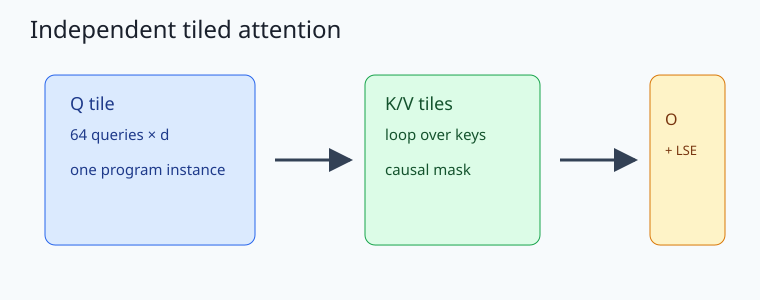
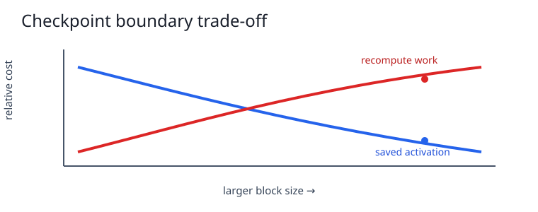
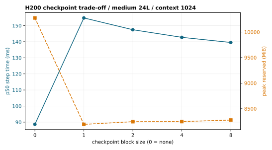
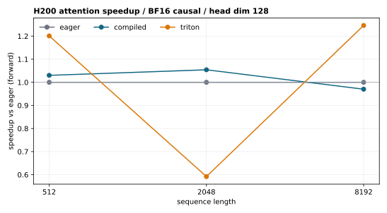

# A2-K：单卡显存与 GPU Kernel（田一贤）

## 完成范围与环境

本目录从固定 starter interface 独立重写，代码、结果和图表均由本次任务新鲜生成，未复用吴家兴、章之禹或其他同学的提交、结果、图片和 metadata。题面版本为 `26.1.4-k-rc.3`，固定 starter commit 为 [`ca8bc81a59b70516f7ebb2da4808daade877c736`](https://github.com/stanford-cs336/assignment2-systems/tree/ca8bc81a59b70516f7ebb2da4808daade877c736)。

正式核心矩阵运行在 4×NVIDIA H200（141 GB）上，PyTorch `2.9.0+cu128`、CUDA `12.8`、Triton `3.5.0`、Python `3.12.3`。attention/Flash 使用 BF16、batch 1、causal；warm-up 5、measurement 20；checkpoint 使用 medium/24 layers、batch 1、BF16、warm-up 3、measurement 5，并把每个 step 的 CUDA 区间前后同步。H200 多卡只用于把相互独立的单卡测量分片到不同 GPU，表中每行仍是单卡峰值和延迟；分片映射、owner/project 核验和“无多卡 speedup claim”见 [`results/h200_sharding.json`](results/h200_sharding.json)。

## 1. 独立实现

`submission/cs336_systems/a2k/attention.py` 的纯 PyTorch 路径只保留 `[batch, query, dim]`、`[batch, key, dim]` 和 `[batch, key, value_dim]`，逐 query tile 遍历 key/value tile。每个 tile 用 FP32 的 `m`、`l` 和输出累加器更新：

```text
m' = max(m, rowmax(S_tile))
l' = exp(m-m')*l + sum(exp(S_tile-m'))
O' = (exp(m-m')*l*O + exp(S_tile-m')*V_tile) / l'
```

causal mask 在 score tile 上应用，保存的 LSE 是唯一的 `[batch, n_queries]` 张量；反向保存 `Q/K/V/O/L` 后重建 PyTorch 图，返回 `dQ/dK/dV`。Triton kernel 由一个 query-tile program 循环 key/value tile，online-softmax 状态和 accumulator 使用 FP32，支持 causal 与 non-causal。



`checkpoint_blocks` 保存 block 边界 activation，反向时重算 block 内部。block 越小通常降低 activation 峰值但增加重算和 launch 开销；最佳点由时间、临时张量和 allocator 峰值共同决定，而不是 checkpoint 数量单独决定。



## 2. Activation Checkpointing

标准 context 1024 的完整矩阵和 context 2048 边界矩阵见 [`results/checkpointing.csv`](results/checkpointing.csv)。下表列出 p50 step time / peak reserved：

| context | block 0 | block 1 | block 2 | block 4 | block 8 |
| ---: | ---: | ---: | ---: | ---: | ---: |
| 1024 | 88.65 ms / 10276 MiB | 154.76 / 8194 | 147.43 / 8246 | 142.71 / 8248 | 139.50 / 8278 |
| 2048 | 134.99 ms / 20212 MiB | 177.07 / 9230 | 176.14 / 9996 | 176.43 / 10528 | 176.59 / 12122 |

block 1 在两个 context 上给出最低 reserved，但 block 8 的重算代价较小，因此 1024 上 latency 逐渐回落；这正是显存—计算交换而非“checkpoint 越多越好”。



## 3. Explicit Attention 与 `torch.compile`

`results/attention_baseline.csv` 含 `S∈{512,2048,8192}`、`d∈{64,128}`、forward/backward/forward_backward 的 18/18 pass 行，每行保留 p20/p50/p80、20 个 raw samples、peak allocated/reserved。以 forward、head dim 128 为例，eager/compiled/Triton 的 p50（ms）如下：

| sequence | eager | compiled | Triton |
| ---: | ---: | ---: | ---: |
| 512 | 0.114 | 0.110 | 0.095 |
| 2048 | 0.116 | 0.110 | 0.196 |
| 8192 | 0.794 | 0.818 | 0.637 |

`results/compile_comparison.csv` 含三个代表 attention shape 的 cold-start/steady-state 对照，以及 Stanford small、B1/S512 的 eager/compiled forward、forward-backward、train-step；24/24 行 pass。编译收益依赖 shape specialization 和缓存：例如 S512/D64 compiled forward p50 约 0.111 ms，cold-start 约 578 ms；small model compiled **forward** 的 cold-start 约 13.0 s、steady-state 约 3.25 ms，而 forward-backward 的 cold-start 约 27.7 s、steady-state 约 13.6 ms。因此不能把不同 phase 的 cold-start 或 steady-state 数字混写，也不能只用一次 cold call 宣称 compiled 更快。



## 4. FlashAttention-2 正确性与性能

`results/flash_benchmark.csv` 的核心矩阵为 54/54 pass（3 implementations × 3 sequence × 2 head dimensions × 3 phases），另追加 16384 边界的 eager/Triton 12/12 pass 行；合计 66/66 pass。每行记录 q/k tile、warps、stages、p20/p50/p80、峰值和 speedup。Triton 配置为 `q_tile=k_tile=64, num_warps=4, num_stages=2`。Triton forward 在 S8192/D128 为约 0.637 ms；其必做重计算式 backward 会重新执行 tiled PyTorch graph，在同一 shape 的 forward-backward p50 约 12986 ms，这个代价是代码设计的重计算成本，而不是把慢路径伪装成失败。

16384 边界为资源受限的 witness（warm-up 1、measurement 1，compiled 为题面允许的 optional skip）：

| head dim | implementation | forward p50 ms | backward p50 ms | forward-backward p50 ms |
| ---: | --- | ---: | ---: | ---: |
| 64 | eager | 2.557 | 2.279 | 4.601 |
| 64 | Triton | 0.849 | 61211.921 | 56686.717 |
| 128 | eager | 2.524 | 2.263 | 4.642 |
| 128 | Triton | 1.834 | 52886.569 | 56337.873 |

Triton 的边界 backward 仍然完成并标记 pass；高延迟直接反映重计算 tile 数随序列长度平方增长。

扩展正确性 [`results/correctness.json`](results/correctness.json) 覆盖 seed `7/19/41`、head dim `32/64/128`、causal/non-causal，共 18/18 pass；同时检查 output、LSE、`dQ`、`dK`、`dV`，最大误差均远低于 `rtol=atol=1e-2`。这是 `synthetic_proxy` 数学参考（代码中的 dense attention），不是数据集 ground truth。H200 Triton smoke 的 non-causal/causal output 最大误差分别为 `0.00390625/0.0078125`，LSE 最大误差均为 `4.77e-7`，最大梯度误差为 `0.00390625/0.015625`。

固定 commit 的官方 attention tests 输出见 [`results/unit_tests.txt`](results/unit_tests.txt)：`6 passed in 3.79s`，包含 PyTorch 与 Triton forward/backward causal/non-causal。Triton witness 不依赖 Triton 不可用时的静默 eager fallback。

## 5. 显存证据与复现

`results/memory_evidence.json` 汇总所有核心矩阵的 allocator 口径：峰值 allocated `19710.3 MiB`、reserved `20212.0 MiB`，allocator limit `23552 MiB`、硬限制 `24576 MiB`，`within_24gib=true`。其中 `nvidia_smi.source` 明确写为 `pytorch_peak_reserved_proxy; nvidia-smi not collected`；它只能证明 PyTorch allocator 口径，不等同于整卡 `nvidia-smi` 峰值。H200 分片、seed 范围、同步边界和“无多卡 speedup claim”见 [`results/run_metadata.json`](results/run_metadata.json)。

```bash
PYTHONPATH=students/田一贤/assignments/A2-K/submission \
python -m student_scripts.a2k.correctness --device cuda \
  --output students/田一贤/assignments/A2-K/results/correctness.json

uv run pytest tests/test_attention.py -q  # 在固定 commit 的外部 assignment2-systems 工作树中运行
```

## 飞书补充文档

组织内公开的 A2 Systems 实验指南入口（正文仍保持组织内可见）：[飞书补充文档](https://acnc6zeentra.feishu.cn/docx/D3omdgl6NocdKNxNvc5cW7KJnHd)
