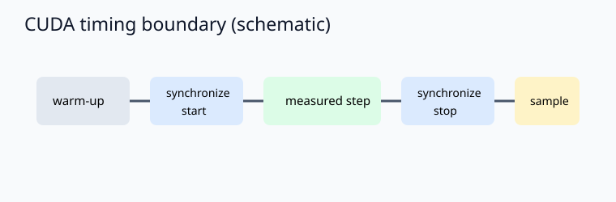
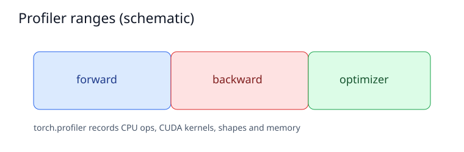
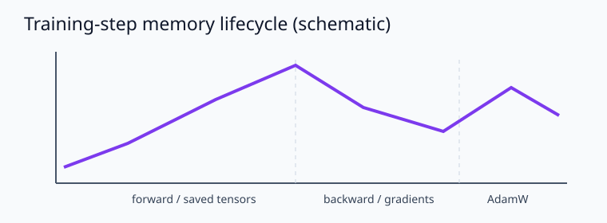
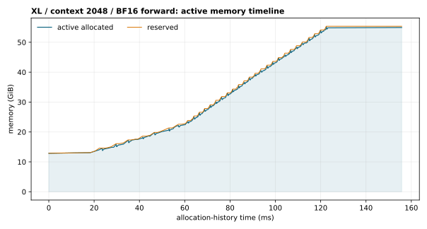
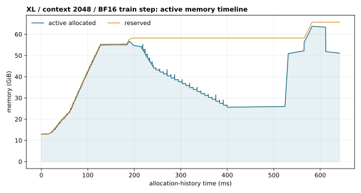

# A2-P：Profiling 与性能分析（田一贤）

## 完成范围与环境

本目录的代码从固定 starter interface 独立重写，review 复跑结果由田一贤本人提交的 1×H100 任务新鲜采集，未使用吴家兴、章之禹或其他同学的提交、数字、图和 metadata。题面版本为 `26.1.4-rc.3`，固定 starter commit 为 [`ca8bc81a59b70516f7ebb2da4808daade877c736`](https://github.com/stanford-cs336/assignment2-systems/tree/ca8bc81a59b70516f7ebb2da4808daade877c736)。

公开环境信息：既有 end-to-end/memory 结果来自 H200；本次六配置 compute profiling review 复跑来自 H100（80 GB）。两者均使用 PyTorch `2.9.0+cu128`、CUDA `12.8`、Python `3.12.3`，硬件口径不混写。原始 Chrome trace 与 memory-history pickle 只保留在运行工作区，没有提交。

## 1. End-to-End Benchmark

入口是 `submission/profiling/benchmark.py`。模型和随机 token 在计时区间外创建；`forward` 只计 no-grad forward，`forward_backward` 计 zero-grad、forward、loss 和 backward，`train_step` 还计 AdamW step。正式命令为：

```bash
PYTHONPATH=students/田一贤/assignments/A2-P/submission \
python -m profiling.benchmark --model-size small --batch-size 4 \
  --context-length 512 --mode train_step --warmup 5 --steps 10 \
  --dtype fp32 --device cuda --output results/benchmark.csv
```

所有配置都为 small / batch 4 / context 512；每种 dtype 有三种 mode，并额外测量 warm-up 0 的 train step。下表给出 mean、sample stdev、CV、峰值；`raw samples` 列在 CSV 中逐行保存。

| dtype | mode | warm-up | raw sample 数 | mean ms | stdev ms | CV | peak allocated / reserved MiB |
| --- | --- | ---: | ---: | ---: | ---: | ---: | ---: |
| FP32 | forward | 5 | 10 | 11.174 | 0.963 | 0.086 | 752.6 / 906 |
| FP32 | forward_backward | 5 | 10 | 39.532 | 2.741 | 0.069 | 4206.0 / 4360 |
| FP32 | train_step | 5 | 10 | 40.954 | 0.634 | 0.015 | 5189.0 / 5472 |
| FP32 | train_step | 0 | 10 | 74.644 | 106.969 | 1.433 | 5189.0 / 5424 |
| BF16 | forward | 5 | 10 | 11.907 | 0.084 | 0.007 | 934.1 / 970 |
| BF16 | forward_backward | 5 | 10 | 43.045 | 4.716 | 0.110 | 3289.3 / 3576 |
| BF16 | train_step | 5 | 10 | 44.167 | 0.244 | 0.006 | 4259.3 / 4496 |
| BF16 | train_step | 0 | 10 | 80.186 | 110.696 | 1.380 | 4259.3 / 4496 |

例如 FP32 warm-up 5 的 train samples 为 `[40.752764, 40.469266, 40.319959, 40.515016, 42.211454, 40.566004, 41.422161, 41.470985, 41.415920, 40.394993]` ms；warm-up 0 的首个样本为 379.04 ms，说明首次 CUDA/module loading 不应混入 steady-state。BF16 降低了 activation/gradient 峰值，但在这个小矩阵上并未必然降低 wall-clock；Tensor Core、kernel 选择和首次加载共同影响结果。

## 2. Compute Profiling

`compute_profile.py` 使用 `torch.profiler` 的 CPU/CUDA activities、shape 和 memory，并在真实 train-step 路径中用 `record_function` 标记 9 个阶段：`profile/warmup`、`profile/measure`、`forward`、`attention`、`attention/scores`、`attention/softmax`、`attention/value`、`backward`、`optimizer`。本次复跑覆盖 `small/medium × context {256,512,1024}` 的 6 个 FP32 配置，每个配置均为 1 个完整 warm-up train step + 1 个完整 profiled train step，即 6×9=54 个阶段行。矩阵清单见 [`results/profile_matrix/matrix_manifest.json`](results/profile_matrix/matrix_manifest.json)，算子级汇总见 [`results/profile_matrix/trace_summary.csv`](results/profile_matrix/trace_summary.csv)，阶段级汇总见 [`results/profile_matrix/stage_summary.csv`](results/profile_matrix/stage_summary.csv)；raw trace 只保留在 H100 执行工作区。

代表配置 small/context 512 的阶段表（CUDA 列为阶段时间窗内 kernel duration 之和）为：forward `33.682 ms CPU / 8.133 ms CUDA kernels`、attention `21.399 / 5.383 ms`、backward `47.539 / 20.176 ms`、optimizer `3.729 / 2.570 ms`；attention 下的 scores、softmax、value 子阶段也分别记录在汇总表中。所有 6 配置的 54 个阶段行状态均为 `measured_from_raw_trace`；原始 trace 不提交，但 SHA-256 和文件名记录在 manifest 的逐配置 metadata 中。





## 3. Mixed Precision

四种累加结果见 [`results/mixed_precision.json`](results/mixed_precision.json)：FP32 accumulator/FP32 addend `10.0001335`，FP16 accumulator/FP16 addend `9.953125`，FP32 accumulator/FP16 addend `10.0021362`，显式 cast 版本同为 `10.0021362`。FP16 accumulator 每一步舍入都会累积误差；FP32 accumulator + FP16 addend 主要保留输入量化误差，不能把两类误差混为一谈。

BF16 ToyModel hooks 记录：参数和 gradient 为 FP32，第一层输出和 logits 为 BF16，LayerNorm 输出与 loss 为 FP32。相同 small 基线的 FP32/BF16 `train_step` 分别为 40.954/44.167 ms，峰值 reserved 分别为 5472/4496 MiB；BF16 节省约 18%，但此配置的时间略高，不能只根据 dtype 推断速度。



## 4. Memory Profiling

`memory_snapshot.py` 在 warm-up 后才开启 `_record_memory_history`，对 XL、context 128/2048、forward/train_step、FP32/BF16 八个配置分别保存 snapshot，并把 active/reserved history 降采样为轻量 CSV。`profiling.summarize` 对 per-shard peaks 做去重、排序和 SHA-256 汇总，生成 [`results/memory/peaks.csv`](results/memory/peaks.csv) 与 `run_metadata.json`；原始 snapshot 不提交。完整峰值见：

| context | dtype | mode | peak allocated MiB | peak reserved MiB | largest active allocation MiB |
| ---: | --- | --- | ---: | ---: | ---: |
| 128 | FP32 | forward | 14526.6 | 14542 | 100 |
| 128 | FP32 | train_step | 65561.1 | 66982 | 100 |
| 128 | BF16 | forward | 20526.1 | 20560 | 100 |
| 128 | BF16 | train_step | 65493.3 | 68044 | 100 |
| 2048 | FP32 | forward | 65821.8 | 66610 | 512 |
| 2048 | FP32 | train_step | 67398.6 | 68660 | 100 |
| 2048 | BF16 | forward | 56539.8 | 56688 | 512 |
| 2048 | BF16 | train_step | 65285.5 | 67302 | 100 |

`peak allocated`、`peak reserved` 与 largest allocation 是不同口径：前两者是 allocator 峰值，后者是 snapshot 中单个 active block。context 2048 的 forward 会出现约 512 MiB 的大块 attention/logit allocation；train step 的峰值还包括参数、gradient、AdamW state 和临时张量。残差流理论大小为 `batch × context × d_model × bytes`，因此 context 从 128 增至 2048 会线性放大 residual 保存和 attention 工作集；反向阶段则叠加 gradient/optimizer state。独立的 H200 `nvidia-smi` 1 GiB allocation probe 不参与这些八行结果；其排队/完成状态只记录在 `h200_provenance.json`，避免把 proxy 误写成现场整卡峰值。





## 5. 复现与公开性

```bash
PYTHONPATH=students/田一贤/assignments/A2-P/submission \
python -m profiling.preflight
```

结果和图均为轻量、脱敏文件；主报告不包含主机名、IP、用户名、内部资源编号、凭据或原始 trace/snapshot。组织内补充指南仍通过组织内公开的[飞书补充文档](https://acnc6zeentra.feishu.cn/docx/D3omdgl6NocdKNxNvc5cW7KJnHd)提供。
