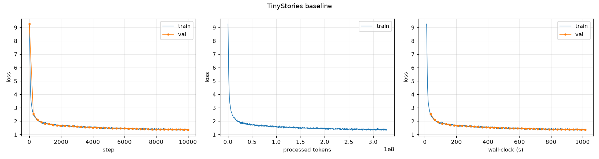
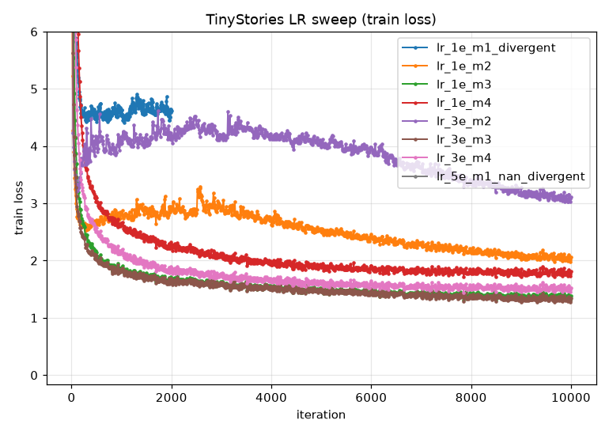
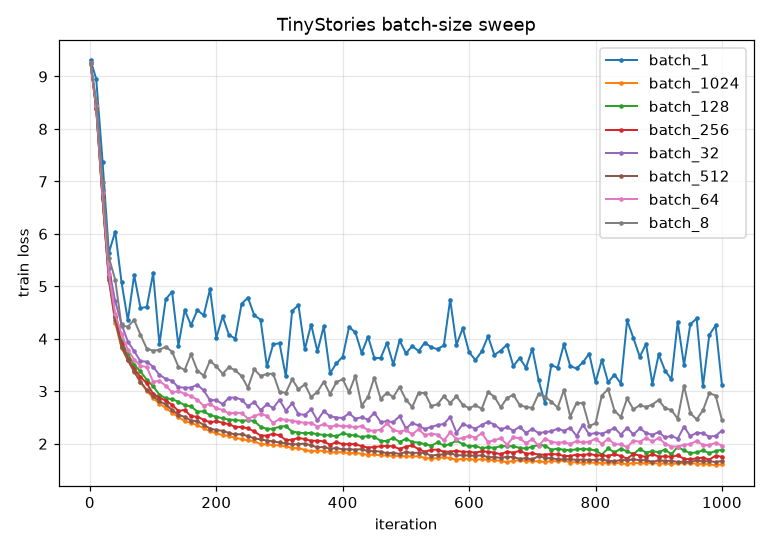
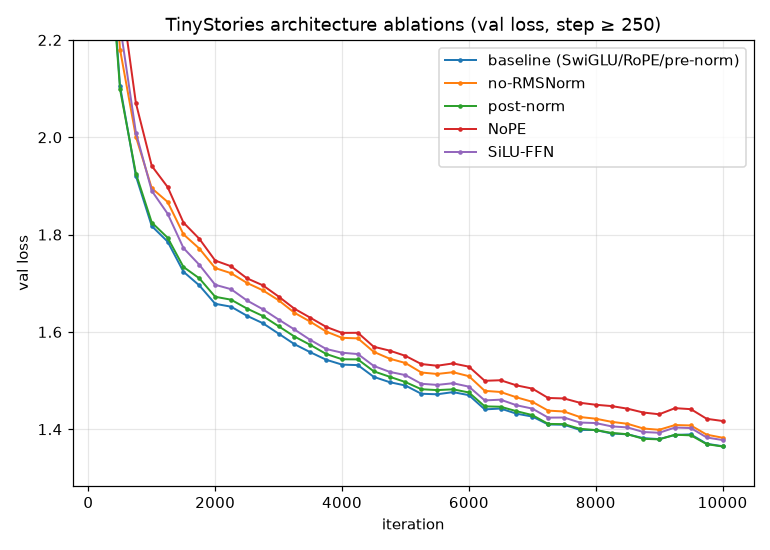
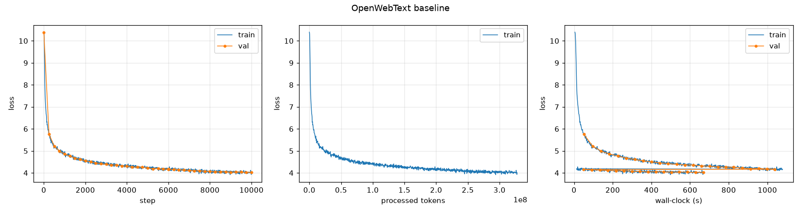

# A1 公开提交：章之禹

> 本文件和同目录代码公开可见。这里只记录公开数据、公开配置和脱敏结果；数据集、
> checkpoint、模型权重、完整运行日志、主机标识/型号、内部路径与任何凭据均不进入 Git。

## 基本信息与完成状态

- 作业题面版本：26.0.3。
- 上游 starter commit：`a158843b20107949f1a8d7df1b05cd33b9166712`。
- 本地工作仓库：`../assignment1-basics`，与 `SummerQuest-2026` 保持同级。
- 已完成范围：byte-level BPE、Tokenizer、Transformer 全部基础模块、cross-entropy、
  AdamW、学习率调度、全局梯度裁剪、随机 batch、checkpoint、可配置训练循环、
  temperature/top-p 生成器，以及四种架构变体的代码路径。
- CPU 自查结果：官方测试为 47 passed、1 XPASS；加入 3 类、4 个本地边界回归用例后为
  51 passed、1 XPASS。Ruff 全仓检查、学生自有文件的 Ty 检查、deterministic
  smoke、checkpoint continuation 和四种架构变体均通过。
- Tokenizer 实测：TinyStories 10K 与 OWT 32K 均已完成训练、压缩率与编码；OWT 32K 在
  2 TB 内存主机上完成（预分词进程树峰值约 84 GB），已不再是 `deferred_cpu_memory`。
- GPU 实验（8×H200 主机）：TinyStories baseline、四项架构消融、learning-rate sweep（含
  发散 run）、batch-size sweep（1→1024）、正式 temperature/top-p 生成，以及 OpenWebText LM
  训练与生成，全部完成。下文各表与 `assets/` 中的曲线均为实测结果，不再有 `deferred_gpu`。

## 1. Unicode 与 UTF-8

### 1.1 `unicode1`

1. `chr(0)` 返回 Unicode 字符 U+0000，即 NUL 空控制字符。
2. 它的 `repr` 是可见的转义形式 `'\x00'`，直接打印时没有可见字形。
3. NUL 会真实保留在 Python 字符串中并计入长度，打印时两侧文字看起来直接相连；传给
   某些以 NUL 结尾的 C 接口时还可能被当成字符串终止符。

### 1.2 `unicode2`

1. UTF-8 与 ASCII 向后兼容，英文和常见网页文本通常更紧凑，而且没有 UTF-16/UTF-32
   常见的字节序问题，因此更适合互联网文本和 byte-level tokenizer。
2. 逐 byte 解码是错误的，因为一个 Unicode 字符可能由多个 UTF-8 bytes 共同组成；例如
   `"牛".encode("utf-8") == b'\xe7\x89\x9b'`，三个 byte 必须拼在一起才能解码。
3. `b'\xc0\x80'` 不能解码为合法 Unicode 字符，因为它是已经被 UTF-8 标准禁止的 NUL
   过长编码。

选择 byte-level BPE 的核心原因是：任意 UTF-8 文本最终都只由 0 到 255 的 byte value
组成，初始 256-token 词表已经可以无损表示任意输入，不会产生 OOV；BPE merge 再用更大
词表换取更短序列。

## 2. BPE 与 Tokenizer

### 2.1 训练算法

初始 vocabulary 包含全部 256 个单 byte，随后加入 special tokens。训练文本先按 special
token 切成互不连通的片段，再用题目给定的 GPT-2 regex 预分词；pair 只在同一个
pre-token 内统计，不能跨 pre-token 或 `<|endoftext|>` 边界。

每轮选择全局频率最高的相邻 pair；频率相同时选择 bytes tuple 字典序最大的 pair。合并后
将拼接 bytes 加入 vocabulary，并按创建顺序记录 merge。实现通过 pair count、pair 到
受影响 pre-token 的倒排索引和可丢弃过期条目的 heap 增量更新统计，避免每轮重新扫描全部
语料；预分词可在 `<|endoftext|>` 安全边界处切块并使用多进程。

### 2.2 编码、解码与流式处理

- 编码：先最长优先识别 special token，再做相同的 regex 预分词；每个 pre-token 从单
  bytes 开始，只按训练所得 merge rank 合并，最后映射为 token ID。
- 解码：先把所有 ID 对应的 bytes 整体拼接，再执行
  `decode("utf-8", errors="replace")`。不能逐 token 解码，因为一个字符可能横跨多个
  token。
- `encode_iterable` 惰性地产生 ID，并保留可能跨 chunk 的末尾 pre-token 和 special-token
  前缀，使结果与一次性 `encode` 一致，而不把整个文件读入内存。
- vocabulary 和 merges 使用带格式版本号的 JSON，并以 Base64 保存原始 bytes，避免用
  文本转义时丢失信息。

### 2.3 TinyStories 10K tokenizer

- 配置：vocabulary size 10,000，special token 为 `<|endoftext|>`。
- 最终带进程树采样的正式运行耗时 53.344 秒；每 50 ms 汇总父进程及全部递归子进程 RSS，
  采样到的聚合峰值为 10,432,872,448 bytes（10.43 GB，9.72 GiB），父进程自身峰值为
  125,722,624 bytes。
- 训练得到 9,743 条 merge。最长 token 为 15 bytes，共有
  `b' accomplishment'`、`b' disappointment'`、`b' responsibility'` 三个并列项；它们都是
  带前导空格的高频完整英文词，符合儿童叙事语料特征。
- `cProfile` 的 50.528 秒运行中，多进程预分词与结果汇聚累计 42.598 秒，约占 84.31%；
  profile 中父进程主要显示为等待 worker 的 `select.poll`，瓶颈应归因于预分词/汇聚而不是
  `poll` 本身。
- 从 validation 集按文档边界做 seed 1337 的 reservoir sampling：10/27,631 篇共 8,485
  bytes、2,105 tokens，压缩率为 **4.03088 bytes/token**。
- 补充的 full-validation benchmark 为 22,502,601 bytes、5,465,883 tokens，即
  4.11692 bytes/token；编码耗时 28.452 秒。

### 2.4 OpenWebText 32K tokenizer

- 配置：vocabulary size 32,000，special token 为 `<|endoftext|>`。
- 在 2 TB 内存主机上以多进程预分词完成训练，耗时 **970.2 秒**（约 16.2 分钟）；每 50 ms
  采样父进程与全部递归子进程的聚合 RSS，进程树峰值为 **84,190,535,680 bytes（约 84.19 GB，
  78.4 GiB）**，父进程自身峰值约 11.65 GB。这解释了此前 CPU 环境为何 OOM——预分词聚合阶段
  的峰值内存远超旧主机上限，换用大内存主机后即可完成。
- 训练得到 **31,743 条 merge**；最长 token 为 **64 bytes**（OWT 中的长 URL / 重复标点等
  片段可以合并成很长的单 token，与 TinyStories 的 15-byte 最长 token 形成鲜明对比）。
- OWT-32K 在完整 OWT validation 上的压缩率为 **4.36738 bytes/token**（289,998,753 bytes /
  66,401,098 tokens）；同 seed 1337 的 10-document reservoir sample 上为
  **3.95027 bytes/token**。
- 对照：TinyStories-10K tokenizer 在同一 OWT 10-doc sample 上仅 2.67979 bytes/token（碎、
  域外），OWT-32K 在同样本上 3.95027 bytes/token——**域匹配且更大的词表把 OWT 文本压得更短**。
  但在各自域内样本上二者接近（TinyStories-10K 在 TinyStories 域内 4.03088，OWT-32K 在 OWT
  域内 3.95027），说明压缩率强烈依赖“tokenizer 训练域是否匹配评测文本域”。

### 2.5 吞吐与语料编码

- 在完整 TinyStories validation 文件上的 tokenizer encode throughput 为
  **790,906 bytes/s**（0.791 MB/s）。10-document sample 的小规模瞬时吞吐不用于 Pile
  外推，以避免样本过小造成偏差。
- 以十进制 825 GB 估算 Pile 编码时间：

  $$
  t_{\text{Pile}}=\frac{825\times 10^9}{\text{throughput}_{\text{bytes/s}}}.
  $$

- 代入实测吞吐得到 1,043,108 秒，约 **12.07 天**。
- TinyStories train 已编码为 541,229,347 个 `uint16` token，fresh mmap 校验范围为
  9–9,999；validation 为 5,465,883 个 `uint16` token，范围为 10–9,999。
- OWT 在 2 TB 主机上用 OWT-32K tokenizer 完成编码：train 为 **2,727,120,452 个 `uint16`
  token**（约 2.73B，token 值域 10–31,933），validation 为 **66,401,098 个 `uint16` token**。
  单流 `encode_iterable` 对 11.9 GB 的 OWT train 约需 4.8 小时，因此改用在 `<|endoftext|>`
  文档边界处切分的分片并行编码（96 进程），保持与单流一致的结果而把墙钟时间压到约 30 秒；
  OWT-32K 全 validation 的单流 encode throughput 实测为 **696,875 bytes/s**。
- TinyStories 的实际词表和 OWT 的 vocabulary size 都小于 65,536，因此落盘 token ID
  使用 `uint16`；写入前检查最大 ID，训练时以 `np.memmap` 或
  `np.load(..., mmap_mode="r")` 读取。

## 3. Transformer 实现

### 3.1 模型结构

模型的数据流为：

    token IDs (B, T)
    -> Embedding (B, T, d_model)
    -> L 个 pre-norm Transformer block
    -> final RMSNorm
    -> LM head
    -> logits (B, T, vocab_size)

每个 block 使用

$$
z=x+\operatorname{MHA}(\operatorname{RMSNorm}(x)),
$$

$$
y=z+\operatorname{SwiGLU}(\operatorname{RMSNorm}(z)).
$$

核心模块均从零实现，不调用现成 `nn.Linear`、`nn.Embedding`、norm、attention 或
optimizer：

- Linear 权重形状为 $(d_{\text{out}},d_{\text{in}})$，无 bias；
- Embedding 是 $(V,d)$ 的可学习查表；
- RMSNorm 在平方和归一化阶段升到 float32，再转回输入 dtype；
- `SiLU(x)=x\sigma(x)`，SwiGLU 为
  $W_2(\operatorname{SiLU}(W_1x)\odot W_3x)$；
- RoPE 只成对旋转 Q、K，不旋转 V；
- attention mask 语义为 `True` 允许、`False` 禁止，causal mask 包含主对角线；
- softmax 先减去对应维度最大值；`TransformerLM.forward` 返回 logits，不提前 softmax。

四个架构开关分别支持 no-RMSNorm、post-norm、NoPE，以及用
$d_{\text{ff}}=4d_{\text{model}}$ 的 SiLU FFN 与默认 SwiGLU 近似匹配参数量。

### 3.2 `transformer_accounting`：参数量

令 $V$ 为词表大小、$d$ 为 `d_model`、$f$ 为 `d_ff`、$L$ 为层数。输入 embedding 与
LM head 不共享权重时：

$$
P=2Vd+L(4d^2+3df+2d)+d.
$$

GPT-2 XL-shaped 配置 $(V,T,L,d,h,f)=(50257,1024,48,1600,25,4288)$ 的分解为：

| 组件 | 参数量 |
| --- | ---: |
| token embedding | 80,411,200 |
| LM head | 80,411,200 |
| 48 层 Q/K/V/O | 491,520,000 |
| 48 层 SwiGLU | 987,955,200 |
| block 与 final RMSNorm | 155,200 |
| 合计 | 1,640,452,800 |

float32 仅加载参数需要 6,561,811,200 bytes，即约 6.56 GB（6.11 GiB）。

### 3.3 `transformer_accounting`：forward FLOPs

只计算矩阵乘法，单条长度为 $T$ 的序列需要：

| 矩阵乘法 | FLOPs 公式 | GPT-2 XL-shaped |
| --- | ---: | ---: |
| Q/K/V projections | $6LTd^2$ | 0.754975 TFLOPs |
| attention scores $QK^\top$ | $2LT^2d$ | 0.161061 TFLOPs |
| attention weighted values | $2LT^2d$ | 0.161061 TFLOPs |
| attention output projection | $2LTd^2$ | 0.251658 TFLOPs |
| SwiGLU 三个 projections | $6LTdf$ | 2.023332 TFLOPs |
| LM head | $2TdV$ | 0.164682 TFLOPs |
| **合计** | $L(8Td^2+4T^2d+6Tdf)+2TdV$ | **3.516770 TFLOPs** |

在该配置下 FFN 占约 57.53%，Q/K/V/O projections 占 28.62%，attention 的两次
$T^2$ 矩阵乘法占 9.16%，LM head 占 4.68%；因此当前 context 下 FFN 是最大计算来源。
Embedding lookup、RMSNorm、RoPE、softmax 和逐元素运算未计入这道题的矩阵乘法 FLOPs。

固定 $V=50257,T=1024$，并把 $d_{\text{ff}}$ 取为最接近 $8d/3$ 的 64 倍数：

| 规模 | $(L,d,h,f)$ | 总 forward TFLOPs | QKV/O | $QK^\top$/AV | FFN | LM head |
| --- | --- | ---: | ---: | ---: | ---: | ---: |
| small | (12, 768, 12, 2048) | 0.291648 | 19.88% | 13.25% | 39.76% | 27.10% |
| medium | (24, 1024, 16, 2752) | 0.830172 | 24.83% | 12.42% | 50.05% | 12.70% |
| large | (36, 1280, 20, 3392) | 1.768531 | 27.32% | 10.93% | 54.30% | 7.45% |
| XL | (48, 1600, 25, 4288) | 3.516770 | 28.62% | 9.16% | 57.53% | 4.68% |

固定 context 时，模型变宽、变深后 FFN 和 projections 的占比上升，词表 LM head 与
$T^2$ attention 的占比下降。

若只把 XL context 从 1,024 增到 16,384，总 forward 计算从 3.5168 TFLOPs 增到
133.5777 TFLOPs，约为 37.98 倍而不是 16 倍；原因是 $QK^\top$ 和 attention-value
乘法按 $T^2$ 增长。此时这两项合计约占 61.73%，FFN 降到 24.24%，attention 成为主要
计算瓶颈。

## 4. 训练组件

### 4.1 Cross-entropy 与 perplexity

稳定 cross-entropy 不显式先算完整 softmax。对 logits $o$ 和目标 $y$：

$$
\ell(o,y)=\log\sum_j e^{o_j}-o_y
=m+\log\sum_j e^{o_j-m}-o_y,\qquad m=\max_j o_j.
$$

最终对所有 batch-like 维度取平均。Perplexity 为

$$
\operatorname{PPL}=\exp(\operatorname{mean\ loss}).
$$

不同 tokenizer 的 per-token loss/PPL 对应的 token 粒度不同，不能直接当作完全公平的
跨 tokenizer 指标。

### 4.2 `learning_rate_tuning`

对题目的 10×10 参数 toy SGD，loss 与初值之比在 10 步后约为：`lr=10` 时
$1.18\times10^{-1}$，稳定下降；`lr=100` 的理论更新因子在第 4 步为 0，float32 实测降到
数值近零；`lr=1000` 时迅速发散，10 步后约放大到 $2.63\times10^{18}$。这说明增大学习率
可以加快收敛，但越过稳定边界后更新会反复越过最优点并放大。

### 4.3 AdamW 与 weight decay

AdamW 为每个参数维护梯度的一阶矩和平方梯度的二阶矩：

$$
m_t=\beta_1m_{t-1}+(1-\beta_1)g_t,\qquad
v_t=\beta_2v_{t-1}+(1-\beta_2)g_t^2.
$$

由于 $m_0=v_0=0$，初期累计权重不足 1，概念上的 bias correction 为：

$$
\hat m_t=\frac{m_t}{1-\beta_1^t},\qquad
\hat v_t=\frac{v_t}{1-\beta_2^t}.
$$

这里的直观含义是“当前累计结果除以当前实际累计到的权重总和”。题面 26.0.3 直接采用
adjusted-learning-rate 形式来体现这两个修正因子：

$$
\alpha_t=\alpha\frac{\sqrt{1-\beta_2^t}}{1-\beta_1^t}.
$$

考虑到 $\epsilon$ 的放置，这与先显式计算 $\hat v_t$ 的写法不要求逐项代数等价；实现严格
跟随题面伪代码，先独立执行 weight decay，再做 moment-adjusted update：

$$
\theta\leftarrow\theta-\alpha\lambda\theta,\qquad
\theta\leftarrow\theta-\alpha_t\frac{m_t}{\sqrt{v_t}+\epsilon}.
$$

decay 不加入梯度，也不进入 $m_t,v_t$，因此不会被 Adam 的自适应缩放扭曲。

### 4.4 `adamw_accounting`：显存

令

$$
P=2Vd+L(4d^2+3dd_{\text{ff}}+2d)+d.
$$

按题目要求代入 $d_{\text{ff}}=8d/3$，只保留 $V,T,L,d,h,B$ 后：

$$
P=2Vd+L(12d^2+2d)+d.
$$

float32 下各部分分别为

$$
M_{\text{params}}=4P,\qquad
M_{\text{grads}}=4P,\qquad
M_{\text{optimizer}}=8P.
$$

按题目列出的中间结果做保守 activation accounting，一般形式为：

$$
A_{\text{bytes}}
=4B\left[
L(8Td+4Td_{\text{ff}}+2hT^2)+Td+2TV
\right].
$$

代入 $d_{\text{ff}}=8d/3$ 后：

$$
A_{\text{bytes}}
=4B\left[
L\left(\frac{56}{3}Td+2hT^2\right)+Td+2TV
\right].
$$

其中每层包括两个 RMSNorm、Q/K/V、attention scores、softmax、weighted values、output
projection 和 SwiGLU 中间量；末尾包括 final RMSNorm、LM-head logits 与 cross-entropy
中间量。总峰值近似为

$$
M_{\text{total}}=M_{\text{params}}+M_{\text{grads}}+M_{\text{optimizer}}+A_{\text{bytes}}
=16P+A_{\text{bytes}}.
$$

按本题简化假设 $d_{\text{ff}}=8d/3$ 代入 XL-shaped 配置：

$$
M_{\text{peak}}\approx
(16.3566\ \text{GB})B+26.1686\ \text{GB}.
$$

因此在十进制 80 GB 上最大整数 batch size 为 3；这个核算不考虑 allocator 碎片、kernel
workspace 等额外开销，真实可用 batch 可能更小。使用实际取整后的
$d_{\text{ff}}=4288$ 不改变该结论。

一次 AdamW step 对每个参数约需 14 次逐元素运算：decay 约 $2P$、一阶矩 $3P$、二阶矩
$4P$、归一化更新 $5P$，所以总计约

$$
F_{\text{AdamW}}\approx14P+O(1).
$$

若 backward FLOPs 是 forward 的 2 倍，则 XL-shaped、batch size 1024 的单步训练计算约
为 $3\times3.51677\times10^{12}\times1024$ FLOPs。400,000 步共约
$4.3214\times10^{21}$ FLOPs；H100 在 50% MFU 下有效吞吐为
$0.5\times495=247.5$ TFLOP/s，因此约需 4,850 小时，即 202 天。AdamW 自身的逐元素
FLOPs 相比模型 forward/backward 很小。

### 4.5 Schedule、裁剪、batch 与 checkpoint

Warmup + cosine schedule 为：

$$
\alpha_t=
\begin{cases}
\frac{t}{T_w}\alpha_{\max}, & t<T_w,\\
\alpha_{\min}+\frac12\left(1+\cos\left(\frac{t-T_w}{T_c-T_w}\pi\right)\right)
(\alpha_{\max}-\alpha_{\min}), & T_w\le t\le T_c,\\
\alpha_{\min}, & t>T_c.
\end{cases}
$$

全局梯度裁剪先把所有参数梯度视为一个向量，计算
$G=\sqrt{\sum_i\lVert g_i\rVert_2^2}$；仅当 $G>M$ 时，对所有梯度统一乘
$M/(G+10^{-6})$。这发生在 `backward` 之后、`optimizer.step` 之前。

随机 batch 从一维 token corpus 采样起点 $s$：

$$
x=X[s:s+T],\qquad y=X[s+1:s+T+1].
$$

输入和目标形状均为 $(B,T)$，大文件以 mmap 读取。checkpoint 至少恢复 model state、
optimizer state 和 iteration；训练入口还保存随机数状态与配置哈希，以便中断后尽量复现
相同更新轨迹。

训练循环顺序固定为：

    sample batch
    -> zero_grad
    -> forward logits
    -> cross-entropy
    -> backward
    -> global gradient clipping
    -> AdamW step
    -> logging / validation / checkpoint

## 5. 文本生成

生成器对 prompt 编码后反复取最后位置 logits。temperature $\tau>0$ 时使用
$\operatorname{softmax}(v/\tau)$；$\tau=0$ 时执行 greedy argmax。Top-p 保留按概率降序后
累计质量首次达到 $p$ 的最小 token 集合，重新归一化并采样。每步只向模型提供不超过
context length 的最近 token，遇到 `<|endoftext|>` 或达到 `max_new_tokens` 即停止。

### 5.1 TinyStories baseline 生成（val loss 1.365 的 checkpoint）

**主样本**（prompt `"Once upon a time"`，`temperature=0.8`、`top_p=0.95`、seed 1337，
生成到 `<|endoftext|>` 自然终止，203 tokens）：

> Once upon a time, there was a little boy named Tim. Tim loved to play outside in the sun. One day, while he was playing, he saw a big, red ball in the sky. He was very excited and wanted to catch it. Tim ran fast to catch the ball. He jumped and jumped, but he could not catch it. He started to feel sad. Just then, a little bird flew down from the sky. The bird had a shiny key in its beak. Tim and the bird looked at the key in the bird's beak. The bird told Tim that it was lost in a storm. Tim and the bird went to find the bird's family. They asked everyone they saw if they had seen the bird's family. Finally, they found the bird's family in a tree. The bird was so happy to be home and thanked Tim and the little bird. From that day on, Tim, the bird, and the little bird were the best of friends. `<|endoftext|>`

语法连贯、人物（Tim、bird）与事件线索一致，有完整的“起因—尝试—转折—结局”结构，并在
`<|endoftext|>` 处自然收尾——对 10K vocab、4 层小模型而言流畅度相当高，符合 TinyStories
儿童叙事分布。轻微瑕疵是中段引入 “shiny key” 后未再利用，反映小模型的长程一致性有限。

**影响因素对照实验**（同 checkpoint、同 prompt，只改采样超参）：

- `temperature=0.0`（greedy，162 tokens）：叙事最稳，句子安全但略保守（Lily 用红球救鸟、
  鸟变成狗成为朋友），几乎无语法错误——降低随机性提高连贯，代价是多样性。
- `temperature=1.2, top_p=0.95`（206 tokens）：更有新意但出现明显不连贯（“a new friend
  named melt carried a big blanket”“never touched a smile”）——升高温度扩大尾部采样，
  多样性上升、局部一致性下降。

因此至少两个影响生成质量的因素得到实测印证：**(1) temperature / top-p 采样超参**（越高越
发散）；**(2) checkpoint 的 validation loss / 训练充分度与模型容量**（val 1.365 的模型才能
产出上面的连贯长文，随机初始化或欠训模型无法做到）。此外 prompt、tokenizer 与 context
length 也会影响，但上面两组对照已单独隔离出采样温度这一变量。

### 5.2 OpenWebText baseline 生成

见 §6 的 OWT 结果小节：OWT 分布更复杂、熵更高，相同架构与 iteration 下 validation loss
明显高于 TinyStories，生成文本也更零散，符合“同预算下更难拟合难数据”的预期。

## 6. 正式训练、Sweep 与消融结果

所有正式实验均在 8×H200 主机上完成（`device=cuda`、`compile=true`、seed 1337、单卡一任务，
八卡并行跑完全部 TinyStories run）。experiment log 为逐 event 的 JSONL，记录 step、processed
tokens、wall-clock、loss、learning rate、gradient norm、throughput 与 checkpoint 事件。

### 6.1 TinyStories baseline

配置：10K vocab、context 256、$d=512$、$d_{\mathrm{ff}}=1344$、4 层、16 heads、RoPE
$\Theta=10000$，`batch_size=128`、`max_iters=10000`，共 **327,680,000 processed tokens**。

- **最终 validation loss = 1.3651**，**达到题面 $\le1.45$ 目标**（train loss 1.385）。
- 墙钟 **1016.4 s**（约 16.9 分钟），单卡 H200 吞吐约 317K tokens/s，峰值显存约 14.3 GB。
- loss 曲线（按 step / processed tokens / wall-clock 三种横轴）见 `assets/ts_baseline_loss.png`。

### 6.2 Learning-rate sweep（含发散 run）

固定其余超参，只扫 max learning rate（cosine 到 1/10）。至少一个发散 run 已满足。

| max LR | 最终 val loss | 说明 |
| ---: | ---: | --- |
| 1e-4 | 1.7983 | 欠拟合，收敛太慢 |
| 3e-4 | 1.5291 | 仍偏慢 |
| 1e-3 | 1.3912 | baseline LR，良好 |
| **3e-3** | **1.3607** | **稳定边界附近的最佳 LR** |
| 1e-2 | 2.0288 | 不稳定，train loss 抖动大 |
| 3e-2 | 3.0589 | 强烈不稳定 |
| 1e-1（常数 LR） | 4.6559 | 卡在高 loss，无法学习（有效发散） |
| 5e-1（常数 LR + 去 RMSNorm） | **NaN @ step 1** | **真正发散**：训练在第 1 步即 non-finite，训练循环按 `training.py` 的有限性检查抛出 `FloatingPointError` |

最佳 LR 约在 **3e-3**，越过 1e-2 后进入不稳定区、到 5e-1 直接 NaN。曲线见
`assets/lr_sweep.png`（y 轴截到 6 以便观察可用区间）。

### 6.3 Batch-size sweep（1 → 1024）

同 LR、固定 `max_iters=1000`（warmup 50、cosine 1000），从 batch 1 扫到 1024，含 64、128。
显存在 batch 1024 时约 121 GB（H200 143 GB 内），未触上限。

| batch size | 最终 val loss | wall-clock |
| ---: | ---: | ---: |
| 1 | 3.6907 | 24 s |
| 8 | 2.5755 | 26 s |
| 32 | 2.1738 | 34 s |
| 64 | 1.9827 | 59 s |
| 128 | 1.8499 | 108 s |
| 256 | 1.7397 | 206 s |
| 512 | 1.6706 | 403 s |
| 1024 | 1.6164 | 799 s |

固定 step 数下，**batch 越大、见到的 token 越多、最终 loss 越低**，但 wall-clock 也随之上升；
这是“固定 step”而非“固定 token 预算”的比较，故大 batch 占优。曲线见 `assets/batch_sweep.png`。

### 6.4 四项架构消融（均 10K steps、与 baseline 同预算）

| 变体 | 最终 val loss | 相对 baseline |
| --- | ---: | ---: |
| baseline（SwiGLU / RoPE / pre-norm） | 1.3651 | — |
| post-norm | 1.3645 | −0.0006（基本持平，略优） |
| SiLU-FFN（$d_{\mathrm{ff}}=2048$，参数近似匹配） | 1.3778 | +0.0127 |
| no-RMSNorm（best LR） | 1.3826 | +0.0175（且 eval-at-start 初始 loss 高达 17.5，去归一化使初始激活爆炸） |
| no-RMSNorm（降低 LR 3e-4） | 1.5274 | +0.1623 |
| NoPE（去 RoPE） | 1.4170 | +0.0519（**位置编码贡献最大**） |

逐项分析：

- **post-norm（−0.0006）**：把两个 RMSNorm 从子层输入侧移到残差相加之后，最终 val loss
  与 pre-norm 基本持平、甚至略优 0.0006。在本规模（4 层、10K steps）下残差路径很浅，pre/post
  的梯度传播差异尚不足以体现——post-norm 在深层模型才更容易出现训练早期不稳定，这里的“基本
  持平”正符合浅模型的预期，不能据此推断深层也无差别。
- **SiLU-FFN（+0.0127）**：把 gated SwiGLU 换成参数近似匹配（$d_{\mathrm{ff}}=2048$）的
  ungated SiLU FFN 后 val loss 上升 0.0127。两者参数量对齐，差距来自 gating 机制本身：SwiGLU
  的 $\operatorname{SiLU}(W_1x)\odot W_3x$ 用一路乘性门控调制另一路，比单路 $\operatorname{SiLU}(W_1x)$
  表达力更强，这一小而稳定的增益与社区经验一致。
- **no-RMSNorm（best LR，+0.0175）**：完全移除归一化后即便用 baseline 的最佳 LR 仍能收敛，
  但 val loss 升到 1.3826，且 **eval-at-start 初始 loss 高达 17.5**——去掉归一化使初始激活
  尺度失控、logits 爆炸。它能训起来主要靠全局梯度裁剪兜底，属于“勉强可训”而非“健康”。
- **no-RMSNorm（降低 LR 到 3e-4，+0.1623）**：为压住上面的激活爆炸而调低 LR，虽然稳定了初始
  阶段，却因学习率过小欠拟合，val loss 反而恶化到 1.5274。这说明去归一化的代价是把可用 LR
  窗口大幅压窄——要么冒不稳定风险用大 LR，要么换来欠拟合，印证 RMSNorm 对“可训练 LR 范围”的
  关键作用（与 §6.2 中 5e-1 去 RMSNorm 第 1 步即 NaN 相互印证）。
- **NoPE（+0.0519）**：去掉 RoPE 后模型仅靠 causal mask 的隐式顺序信息，val loss 退化 0.0519，
  是四项里降幅**最大**的，说明在本任务中显式相对位置编码贡献最大——TinyStories 的叙事强依赖
  词序与相对距离，缺少位置信号时注意力难以稳定对齐。

综合来看，本规模/预算下 **RoPE 的贡献最大**（去掉退化 +0.052），RMSNorm 次之（去掉后不仅变差，
初始还极不稳定、可用 LR 窗口被压窄）；gated SwiGLU 稳定优于参数匹配的 ungated SiLU FFN；
post-norm 与 pre-norm 在浅模型上基本持平。曲线（step≥250）见 `assets/ablations.png`。

### 6.5 OpenWebText LM

配置与 TinyStories 相同架构与 iterations，仅换 32K vocab / OWT 数据（batch 128、10K steps）。

- **最终 validation loss = 4.0344**（train loss 4.011），墙钟约 28 分钟（含一次从
  checkpoint 的续训：训练中途进程被外部中断，用 `--resume latest` 从第 6000 步无缝续训到
  10000 步）。峰值显存约 26.1 GB（32K 词表的 embedding/LM-head 更大）。
- 生成样本（prompt `"The"`、temperature 0.8、top-p 0.95、seed 1337，257 tokens）：

  > The MPAA said it is "completely opposed to the bill". … The Senate bill would have to be
  > used to fund the bill to end the ban on the bill … "We're really trying to change the law,
  > but the bill would be a legal challenge," he said. … The bill would create a large …

  语法与局部话题（立法、参议院、法案）连贯，但全局上明显在 “the bill” 上打转、缺乏长程
  规划——比 TinyStories 样本零散，符合 OWT 熵更高、同预算更难拟合的预期。
- loss 曲线见 `assets/owt_baseline_loss.png`。

OWT 分布更复杂、熵更高，相同模型与 iteration 的计算预算不随数据难度增加，因此其 validation
loss（4.034）明显高于 TinyStories（1.365），生成文本也更零散。两者 loss 还受各自 tokenizer 与
token 粒度影响（TinyStories 10K vs OWT 32K），只能在各自验证集、各自 tokenizer 下解释，不能
仅凭 per-token 数值直接断言哪个模型“更好”。

### 6.6 其他

- Stanford 外部 leaderboard / PR 要求：`not_applicable_lab_override`（实验室题面已取消）。
- 40M-token CPU/MPS 低资源路线：`not_run_by_scope`——本轮直接在 GPU 上跑满预算达到 $\le1.45$，
  无需低资源放宽路线。

## 7. CPU 自查

CPU smoke 配置使用短 context 和小模型验证数学与工程链路，不承担正式建模结论。最终自查
应覆盖：

- 官方可见测试全部通过；
- stable cross-entropy 与参考计算一致，梯度有限；
- 固定小 batch 的 loss 明显下降；
- checkpoint 恢复后，继续一步与未中断路径数值一致；
- greedy、temperature、top-p 和 EOS/context crop 行为正确；
- no-RMSNorm、post-norm、NoPE、SiLU FFN 均可完成有限值 forward/backward；
- 非法 UTF-8、重叠 special tokens、streaming chunk boundary、全局梯度裁剪和 AdamW
  parameter groups 等边界用例通过；
- 禁止的 PyTorch 高层实现、敏感信息、大文件、symlink 和超出个人 A1 目录的 diff 均为 0。

最终结果：官方测试 47 passed、1 XPASS；3 类、4 个本地额外回归用例计入后为
51 passed、1 XPASS。Ruff 全仓检查为 0 diagnostics；Ty 对 `cs336_basics/`、`scripts/`、
adapter 和本地回归文件检查为 0 diagnostics。seed 1337 的 100-step CPU smoke 从 loss 5.2534685 降到
0.00250461（比例 0.000476754）；checkpoint 恢复后的下一步与不中断路径逐元素一致，
generation 以及 no-RMSNorm、post-norm、NoPE、SiLU FFN 均通过有限值 forward/backward。

## 8. 复现说明

### 8.1 环境和数据

依赖完全使用固定 starter 的 `uv.lock`：

    cd ../assignment1-basics
    uv sync --frozen
    uv run pytest

数据使用题面公开来源，放在工作仓库的 `data/`，不提交到 SummerQuest：

    mkdir -p data
    wget -P data https://huggingface.co/datasets/roneneldan/TinyStories/resolve/main/TinyStoriesV2-GPT4-train.txt
    wget -P data https://huggingface.co/datasets/roneneldan/TinyStories/resolve/main/TinyStoriesV2-GPT4-valid.txt
    wget -P data https://huggingface.co/datasets/stanford-cs336/owt-sample/resolve/main/owt_train.txt.gz
    wget -P data https://huggingface.co/datasets/stanford-cs336/owt-sample/resolve/main/owt_valid.txt.gz
    gunzip data/owt_train.txt.gz data/owt_valid.txt.gz

### 8.2 Tokenizer、CPU 自查与后续 GPU 命令

OWT 32K 预分词进程树峰值约 84 GB，需在大内存主机（本轮为 2 TB）上运行；小内存 CPU 环境会
在预分词聚合阶段 OOM。GPU 阶段需 CUDA 与驱动匹配的 torch（本轮 `torch 2.8.0+cu128`，驱动
CUDA 12.8）。

    uv run python scripts/train_bpe.py --config configs/tokenizer_tinystories_10k.toml
    uv run python scripts/train_bpe.py --config configs/tokenizer_owt_32k.toml
    uv run python scripts/benchmark_tokenizer.py --config configs/tokenizer_tinystories_10k.toml
    uv run python scripts/sample_tokenizer_metrics.py data/TinyStoriesV2-GPT4-valid.txt \
      --vocab artifacts/tokenizers/tinystories_10k/vocab.json \
      --merges artifacts/tokenizers/tinystories_10k/merges.json \
      --special-token '<|endoftext|>' --sample-size 10 --seed 1337
    uv run python scripts/sample_tokenizer_metrics.py data/owt_valid.txt \
      --vocab artifacts/tokenizers/tinystories_10k/vocab.json \
      --merges artifacts/tokenizers/tinystories_10k/merges.json \
      --special-token '<|endoftext|>' --sample-size 10 --seed 1337
    uv run python scripts/encode_corpus.py --config configs/tokenizer_tinystories_10k.toml
    uv run python scripts/encode_corpus.py data/TinyStoriesV2-GPT4-valid.txt \
      data/encoded/tinystories_valid.npy \
      --vocab artifacts/tokenizers/tinystories_10k/vocab.json \
      --merges artifacts/tokenizers/tinystories_10k/merges.json \
      --special-token '<|endoftext|>'
    uv run python scripts/self_check.py --config configs/cpu_smoke.toml

正式 GPU 阶段使用相同训练入口和显式配置：

    uv run python scripts/train_lm.py --config configs/tinystories_baseline.toml
    uv run python scripts/train_lm.py --config configs/tinystories_baseline.toml --resume latest
    uv run python scripts/generate.py --config configs/tinystories_baseline.toml
    uv run python scripts/run_sweep.py --config configs/tinystories_lr_sweep.toml --dry-run
    uv run python scripts/run_sweep.py --config configs/tinystories_lr_sweep.toml --continue-on-error
    uv run python scripts/run_sweep.py --config configs/tinystories_batch_sweep.toml --continue-on-error
    uv run python scripts/run_sweep.py --config configs/tinystories_ablation_no_rmsnorm.toml
    uv run python scripts/train_lm.py --config configs/tinystories_ablation_post_norm.toml
    uv run python scripts/train_lm.py --config configs/tinystories_ablation_no_rope.toml
    uv run python scripts/train_lm.py --config configs/tinystories_ablation_silu.toml
    uv run python scripts/train_lm.py --config configs/owt_baseline.toml
    uv run python scripts/generate.py --config configs/owt_baseline.toml

发散实验（至少一个）：常数高 LR 无法学习，去 RMSNorm 的极端 LR 在第 1 步即 NaN：

    uv run python scripts/train_lm.py --config configs/tinystories_lr_divergent.toml
    uv run python scripts/train_lm.py --config configs/tinystories_lr_nan_divergent.toml

公开配置位于 `submission/configs/`；本地数据、tokenizer 产物、完整 logs、runs、
artifacts 和 checkpoints 不同步。

## 9. 代码、日志与 GitHub 开发规范

- 真实实现：`submission/cs336_basics/`。
- 稳定测试 ABI：`submission/tests/adapters.py`，只负责实例化、加载权重和转发参数。
- CLI：`submission/scripts/`。
- 公开轻量配置：`submission/configs/`。
- 脱敏实验摘要：`logs/` 中提交小型 JSON 摘要；正式 GPU 训练入口本身会在本地输出按
  event 分行的 JSONL，`run_start`、train、validation、checkpoint 和 `run_end` 等事件合计
  覆盖 config hash、seed、step、processed tokens、loss、learning rate、gradient norm、
  throughput 与 wall-clock。公开摘要不含主机名、绝对路径或凭据。
- 本次摘要文件为 `logs/cpu_validation.json`、`logs/tokenizer_experiments.json` 和
  `logs/gpu_experiments.json`（后者汇总全部已完成的 GPU 实验：baseline、sweep、消融、OWT）；
  不复制带主机标识的原始 JUnit XML。

实现与测试在 `../assignment1-basics` 的 `a1/zhiyuzhang-0212` 工作分支进行；同步后的公开
提交在 SummerQuest 同名分支按 tokenizer、模型、训练/生成、测试、文档等可独立验证的
里程碑提交，并使用清晰的 conventional commit 信息。每个实现里程碑先运行对应测试，再同步：

    cd ../SummerQuest-2026
    python3 scripts/sync_a1_submission.py --name '章之禹'
    git diff --check
    python3 scripts/validate_repo.py

提交前审查 staged diff，确保 PR 只修改
`students/章之禹/assignments/A1/`，不提交公共 tests、fixtures、数据、权重、虚拟环境、
依赖锁或生成缓存。

## 10. 飞书补充文档

- 链接：https://acnc6zeentra.feishu.cn/docx/JIJVdM0pzo7J9oxFcpHcXfcInJc

补充文档仅保存公开 README 不适合承载但审核确有必要的最小差量材料，并设置为组织内成员
持链接可读；互联网访问和外部邀请关闭，共享与安全设置仅允许 full-access 协作者管理。
