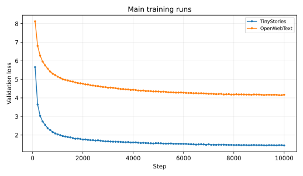
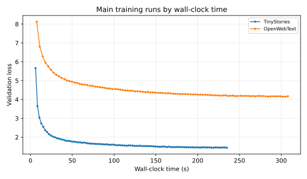
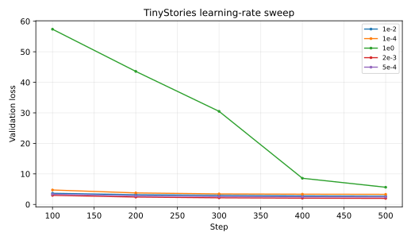
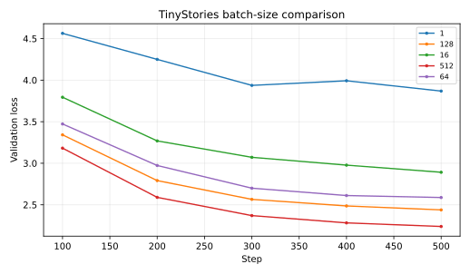
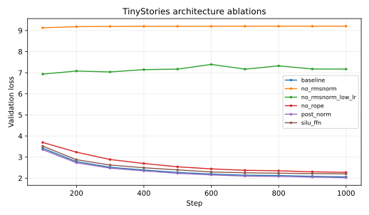

# A1 作业报告

## 基本信息

- 姓名：袁宇成
- 题面版本：26.0.4
- Starter commit：`a158843b20107949f1a8d7df1b05cd33b9166712`

## 书面题

### Unicode

`chr(0)` 得到 Unicode 码点 U+0000（NUL）。`repr` 会把它显示为 `'\x00'`，直接 `print` 时则看不到字形。它在 Python 字符串中仍会被正常计入长度，但传给使用 C 风格零结尾字符串的程序时可能被当成结束符。

UTF-8 与 ASCII 兼容，ASCII 字符只占一个 byte，也没有字节序问题，很适合 byte-level tokenizer。不能逐 byte 解码 UTF-8，因为一个字符可能由多个 byte 组成。例如 `"牛".encode("utf-8") == b'\xe7\x89\x9b'`，任取其中一个 byte 都不能单独还原这个字。`b'\x80\x80'` 同样无法解码：两个 byte 都是 continuation byte，前面却没有 leading byte。

SGD 小实验里，学习率 10 比 1 收敛快；100 虽然第一次更新会跨过最优点，但后面仍能收敛；1000 则直接发散。

### AdamW 资源核算

记 batch size 为 $B$，序列长度为 $S$，层数为 $L$，隐藏维度为 $D$，头数为 $H$，词表大小为 $V$，并令 $F=d_{ff}=8D/3$。输入和输出 embedding 不共享权重时，参数量为

$$
P=2VD+L(4D^2+3DF+2D)+D=2VD+L(12D^2+2D)+D.
$$

float32 下，参数、梯度和 AdamW 的一阶/二阶矩分别占 $4P$、$4P$ 和 $8P$ bytes。按题目列出的中间量计数，每个 Transformer block 保存

$$
8BSD+4BSF+2BHS^2
$$

个浮点数；再加 final RMSNorm 的 $BSD$、LM head 的 $BSV$，以及未融合 cross-entropy 的一个 logits 大小中间量 $BSV$。因此 activation memory 为

$$
M_{act}=4\left[L(8BSD+4BSF+2BHS^2)+BSD+2BSV\right],
$$

总峰值近似为

$$
M_{total}=M_{act}+16P.
$$

如果 cross-entropy 和 logits 投影做融合，可以少保存一个 $BSV$ 中间量。

代入 GPT-2 XL 的 $V=50257,S=1024,L=48,D=1600,H=25$，有 $P=1,635,537,600$。参数、梯度和 optimizer state 分别占 6.542 GB、6.542 GB 和 13.084 GB，总内存约为

$$
(16.357B+26.169)\ \text{GB}.
$$

所以 80 GB 内最多放下 batch size 3。

忽略逐 tensor 的标量计算，AdamW 每个参数的 weight decay、两个 moment 更新和最终参数更新约需 $2+3+4+5=14$ FLOPs，因此 optimizer step 约为 $14P$ FLOPs。模型一次前向的主要矩阵乘 FLOPs 为

$$
F_{fwd}=L(24BSD^2+4BS^2D)+2BSDV.
$$

反向取前向的两倍，则一次训练迭代约为 $3F_{fwd}+14P$。代入 batch size 1024，单步约 $1.0773\times10^{16}$ FLOPs；400K 步在 50% MFU 的 H100（有效 247.5 TFLOP/s）上约需 4836 小时，即约 201.5 天。

## 实现

我实现了 byte-level BPE、Transformer 的各个模块、loss、AdamW、学习率调度、梯度裁剪、checkpoint 和文本生成。核心网络和优化器没有调用现成的 `nn.Linear`、`nn.Embedding`、attention 或 AdamW。

BPE 训练时先并行统计 pre-token，合并过程中增量更新 pair count。编码大文件时按 `<|endoftext|>` 边界分成 8 份，再顺序合并成 `uint16` 文件。公共测试结果是 47 passed、1 xpassed。

## Tokenizer 实验

两个 tokenizer 分别用 TinyStories train 和 OWT train 训练，词表大小是 10K 和 32K。下表测的是两个验证集开头的 10 个完整文档，throughput 是单进程 Python 编码速度。

| Tokenizer | 文档 | bytes | tokens | bytes/token | throughput |
| --- | --- | ---: | ---: | ---: | ---: |
| TinyStories 10K | TinyStories | 10,908 | 2,697 | 4.044 | 1.275 MB/s |
| TinyStories 10K | OWT | 50,590 | 14,831 | 3.411 | 0.951 MB/s |
| OWT 32K | TinyStories | 10,908 | 2,797 | 3.900 | 1.157 MB/s |
| OWT 32K | OWT | 50,590 | 11,211 | 4.513 | 0.842 MB/s |

TinyStories tokenizer 的最长 token 是 15-byte 的 ` accomplishment`。OWT tokenizer 的最长 token 有 64 bytes，内容是语料中重复出现的乱码。在 OWT 文档上换用 TinyStories tokenizer 后，压缩率从 4.513 降到 3.411 bytes/token，token 数多了约 32.3%，可见 BPE 对训练语料很敏感。按单进程速度估算，编码 825 GB 文本需要约 11.3 天。我实际用了 8 进程，OWT train 的速度约为 432 万 tokens/s。

TinyStories train/valid 分别编码为 540,796,778 和 5,461,210 个 token；OWT train/valid 分别为 2,727,120,452 和 66,401,098 个 token。两个词表都小于 $2^{16}$，所以 `uint16` 能覆盖全部 token id，并且比 `uint32` 节省一半磁盘与内存带宽。

## 训练设置

主模型的 context length 为 256，$d_{model}=512$、$d_{ff}=1344$，共 4 层、16 个 attention heads，使用 RoPE（$\Theta=10000$）。TinyStories 和 OWT 的词表分别是 10K 和 32K。全局 batch size 是 128，训练 10,000 steps，每次主训练共处理 327,680,000 tokens。AdamW 的 $\beta=(0.9,0.95)$，weight decay 为 0.1，gradient clipping 为 1.0。学习率 warmup 500 steps，再从 $5\times10^{-4}$ cosine decay 到 $5\times10^{-5}$。训练使用 bfloat16 autocast，优化器状态使用 float32。

下文表格中的 final validation loss 来自训练结束后单独抽取的 10 个 validation batches；曲线中的 validation 点是在训练过程中抽取的另一组 batches，因此两者会有少量波动。

### TinyStories 主训练

模型有 22,696,448 个参数。10,000 steps 后 train loss 为 1.445，validation loss 为 **1.439**（perplexity 4.217），8 卡训练用时 235.4 秒。从曲线上看，warmup 结束后 loss 一直平稳下降，train loss 和 validation loss 也没有明显分开。

### 学习率

学习率 sweep 固定 batch 128、500 steps，其余配置不变：

| max LR | final val loss | 现象 |
| ---: | ---: | --- |
| $10^{-4}$ | 3.290 | 稳定但收敛慢 |
| $5\times10^{-4}$ | 2.437 | 稳定 |
| $2\times10^{-3}$ | **1.983** | 短程最优 |
| $10^{-2}$ | 2.691 | 越过短程最优点，波动增大 |
| $1$ | 5.625 | 发散；中途 train loss 一度超过 70，后段仅因 cosine decay 降低学习率而部分恢复 |

500 steps 内 $2\times10^{-3}$ 最好，到 $10^{-2}$ 已经开始变差，$1$ 则明显发散。短实验的最优学习率不一定适合直接跑 10,000 steps，所以主训练仍用 $5\times10^{-4}$。

### Batch size

所有 batch run 使用相同学习率和 500 steps；短测没有发现需要为稳定性单独降低学习率的点。

| batch size | final val loss | time | 训练 tokens |
| ---: | ---: | ---: | ---: |
| 1 | 3.809 | 12.2 s | 0.128M |
| 16 | 2.933 | 14.2 s | 2.048M |
| 64 | 2.582 | 37.5 s | 8.192M |
| 128 | 2.437 | 70.0 s | 16.384M |
| 512 | **2.243** | 256.6 s | 65.536M |
| 1024 | 3.143（step 100） | 100.0 s | 26.214M（随后 OOM） |

batch 1024 能跑完单步，但连续训练到 step 100 验证后会 OOM，所以我把可稳定运行的上限记为 512。这组实验固定的是 steps，batch 越大实际看到的 token 也越多，因此不能只用 final loss 判断 batch size 的优劣。batch 1 虽然单步快，但吞吐最低，曲线也最抖。

### 架构消融

消融均在 TinyStories 上训练 1,000 steps；SiLU FFN 使用 $d_{ff}=2048=4d_{model}$，参数量 22.83M，与 SwiGLU 的 22.70M 近似匹配。

| 模型 | max LR | final val loss |
| --- | ---: | ---: |
| Pre-Norm + RoPE + SwiGLU baseline | $5\times10^{-4}$ | 2.086 |
| 删除 block RMSNorm | $5\times10^{-4}$ | 9.205 |
| 删除 block RMSNorm | $10^{-4}$ | 7.169 |
| Post-Norm | $5\times10^{-4}$ | **2.046** |
| NoPE | $5\times10^{-4}$ | 2.297 |
| SiLU FFN | $5\times10^{-4}$ | 2.190 |

去掉 RMSNorm 后基本学不动，学习率降五倍也只是稍有改善。Post-Norm 在这 1,000 steps 里比 baseline 低 0.040，但差距很小，不足以判断长训练也会更好。NoPE 高了 0.211，显式位置信息还是有用。参数量接近时，SwiGLU 比普通 SiLU FFN 低 0.104。

### OpenWebText

OWT 模型有 45,224,448 个参数，比 TinyStories 模型多出的部分主要来自 32K 词表。训练 10,000 steps 后，train loss 为 4.131，validation loss 为 **4.171**（perplexity 64.79），用时 308.8 秒。

OWT 和 TinyStories 的数据难度、词表都不同，loss 不适合直接横向比。OWT 内容更杂，而且相同 token budget 只覆盖了训练集的小部分，最后生成的文本只在局部像网页或新闻，整体上还不连贯。

## 文本生成

### TinyStories

温度 0.8、top-p 0.95；模型在第 155 个 token 生成 `<|endoftext|>`：

> Once upon a time, there was a big, round basketball. It was very pretty and bright. The basketball lived in a small house with a nice family. The family loved to play with the basketball.
>
> One sunny day, the basketball was playing with the basketball in the yard. The basketball was very happy. But then, the basketball got lost. It began to panic. The basketball began to panic. It was scared that the ball would get lost.
>
> The basketball stopped and looked around. It saw a big tree and decided to be brave. It rolled and rolled until it found a small hill. The basketball climbed the hill and found a big, soft hill. The basketball was so happy to be back home. They played with the basketball all day long.
>
> `<|endoftext|>`

这段文本有开头、遇到问题和结尾，句子基本通顺，但 `basketball` 和 `hill` 的重复比较明显。TinyStories 本身的简单童话风格决定了生成文本的大致结构，模型大小和训练量则限制了情节变化。temperature 和 top-p 也会影响重复程度和随机性。

### OpenWebText

同样使用温度 0.8、top-p 0.95，共生成 256 个新 token：

> The National Science Institute at the Centre for Research Research at the University of Pennsylvania, published in 2009 in the journal Proceedings of the National Academy of Sciences in the journal of Science and Technology.
>
> The research found that the reason for the lack of money was because it found that the most in-person, the science community, is remarkably certain.
>
> The results are based on scientists' findings and the results of the study published in Nature Neuroscience.
>
> The study found that researchers, as a result of their learning and research in a study at the University of Texas, found that the study found some 60 percent of cancer patients were in the A.D. for the first time, and the participants were at a high level of information.
>
> "This can be a good idea," said Science Institute senior professor Dr. Johns Hopkins Professor of Politics at the University of California, Berkeley.
>
> "The authors of the study showed that the studies found that people who were sick with an illness were more likely to get those symptoms than that of women who did not come from that patients.
>
> "We used the same dose as their peers with their normal drug use, and they used the best research findings in this study in our study, because of the general effects

句子的样子比较像科研新闻，但 `study found` 重复很多，机构、人物和引用之间的关系也不可信。OWT 的内容比 TinyStories 杂得多，而这个模型的容量和训练 token 数都不大，所以它学到了局部文体，没有学好长距离的内容一致性。

## 复现

- 环境：Python 3.12、PyTorch 2.8.0；训练使用 bfloat16，最多使用 8 张加速卡。
- 数据：题面提供的 TinyStories 和 OpenWebText train/valid 文本；数据和 checkpoint 不进入提交目录。
- 训练 TinyStories tokenizer：`python3 scripts/train_tokenizer.py --input data/TinyStoriesV2-GPT4-train.txt --vocab-size 10000 --output-prefix artifacts/tokenizers/tinystories`
- 编码 TinyStories train：`python3 scripts/encode_dataset.py --input data/TinyStoriesV2-GPT4-train.txt --vocab artifacts/tokenizers/tinystories.vocab.json --merges artifacts/tokenizers/tinystories.merges.txt --output data/tinystories_train.bin`
- 生成短实验配置：`python3 scripts/create_experiment_configs.py --max-batch-size 512`
- 并行运行短实验：`python3 scripts/run_short_experiments.py --max-gpus 8`
- TinyStories 主训练：`torchrun --standalone --nproc-per-node=8 scripts/train_lm.py --config configs/tinystories_baseline.json --train-data data/tinystories_train.bin --val-data data/tinystories_valid.bin --output-dir artifacts/runs/tinystories_baseline`
- TinyStories 文本生成：`python3 scripts/generate.py --config configs/tinystories_baseline.json --checkpoint artifacts/runs/tinystories_baseline/checkpoint.pt --vocab artifacts/tokenizers/tinystories.vocab.json --merges artifacts/tokenizers/tinystories.merges.txt --max-new-tokens 256`
- 配置：`submission/configs/tinystories_baseline.json`、`submission/configs/owt_baseline.json`

## 文件说明

- 真实实现：`submission/cs336_basics/`
- 测试 adapter：`submission/tests/adapters.py`
- 训练、编码、分析、绘图与生成脚本：`submission/scripts/`
- 实验日志：`logs/`
- 报告图表：`assets/`

## 飞书补充文档

- 链接：https://fudan-nlp.feishu.cn/docx/LzlTd0xC3oNdkexmN92cQYb0nib
