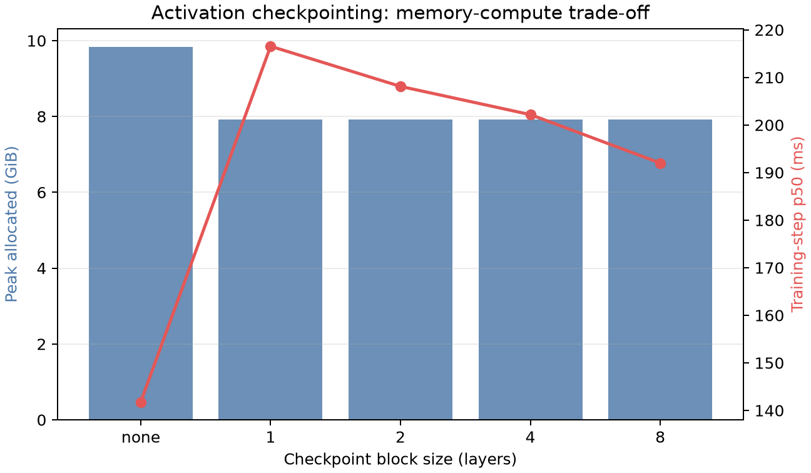
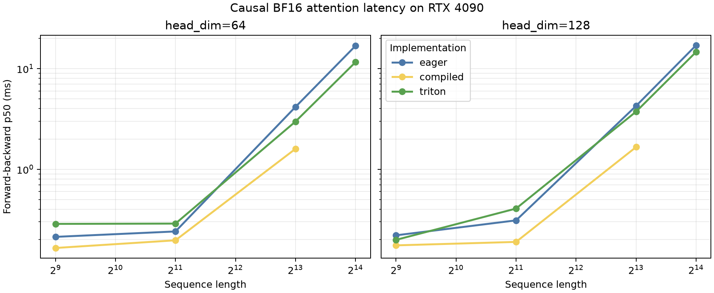

# A2-K：单卡显存优化与 GPU Kernels

> 本报告只引用同目录下的脱敏结果文件和图片。服务器主机名、用户名、内部路径、UUID、进程信息和凭据均未提交。

## 基本信息

- 题面版本：`26.1.4-k-rc.3`
- starter commit：`ca8bc81a59b70516f7ebb2da4808daade877c736`
- 正式 benchmark 产生时的工作版本：`63b86f0072663ef777425b0f835bc6d83f5632e4`
- correctness 结果与公开代码收尾版本：`0369c94eb51bcfe86b997a52cb1133a9233825aa`
- 代码公开复核入口：[我的 fork 分支](https://github.com/Kevin589981/assignment2-systems/tree/a2-k/Kevin589981)
- 完成范围：Activation Checkpointing、显式 PyTorch attention、`torch.compile` 对照、纯 PyTorch tiled FlashAttention-2、学生 Triton forward、重计算式 backward、扩展 correctness 和 Flash 性能矩阵。
- 未完成项：optional Triton backward 和后续分布式训练内容不属于本 A2-K 提交。

## 环境与测量协议

正式结果来自单张 NVIDIA GeForce RTX 4090。开跑前 `nvidia-smi` 报告如下：

| 项目 | 值 |
| --- | --- |
| GPU | NVIDIA GeForce RTX 4090 |
| `memory.total` | 49140 MiB（服务器报告值；实验使用 23 GiB allocator budget） |
| formal worker `memory.free` at start | 48126 MiB |
| Driver | 570.124.06 |
| Power limit / P-state | 450.00 W / P8 |
| PyTorch | 2.11.0+cu128 |
| CUDA build | 12.8 |
| Triton | 3.6.0 |
| TF32 | correctness code explicitly sets CUDA matmul/cuDNN TF32 to disabled and records `tf32_enabled=false`; performance workers use the benchmark defaults |
| Allocator limit | 23552 MiB |
| Flash timer | `triton.testing.do_bench` |
| Flash measurement | warmup 100 ms、measurement 300 ms、quantiles `[0.2, 0.5, 0.8]` |

预检阶段单独执行的 `nvidia-smi` 曾报告 `memory.free=48518 MiB`；正式 benchmark worker 的
metadata 统一记录约 `48126 MiB` 作为起始可用显存，差异来自采样时刻和测量路径不同。正文和
结果解释以 worker metadata 的 `48126 MiB` 为正式矩阵基准；两者都远高于教师要求的
`22528 MiB` 最低可用显存。所有正式进程都使用 `23552 MiB` PyTorch allocator 上限，以保证
结果不依赖大于题面 24 GiB 的可用预算。

## 1. Activation Checkpointing

### 理论与代码骨架

设 Transformer 有 `N` 个相同 block，每个 block 的边界 activation 大小为 `A`。不使用
checkpoint 时，反向需要保留所有 block 的 residual，峰值 activation memory 为 `Theta(N A)`，
前向和反向计算量为 `Theta(N)` 倍单 block 计算量。递归嵌套 checkpoint 可以把同时 materialize
的 residual 数量压到常数级，峰值接近 `Theta(A)`，代价是重计算，最坏总计算量为 `Theta(N log N)`。

本实现采用非嵌套、按 block group 切分的 checkpoint：

```python
hidden = model.token_embeddings(tokens)
for start in range(0, len(model.layers), block_size):
    group = model.layers[start:start + block_size]

    def run_group(x, group=group):
        for layer in group:
            x = layer(x)
        return x

    hidden = checkpoint(run_group, hidden, use_reentrant=False)
logits = model.lm_head(model.ln_final(hidden))
```

### 固定实验

脚本使用 Stanford medium 配置、24 层、batch size 1、BF16 autocast、FP32 参数和 AdamW。
1024 context 完成 baseline 与 block size `1/2/4/8`；2048 context 完成 baseline 和 1024
矩阵中峰值显存最低的 block size 1。结果文件为 `results/checkpointing.csv`。

| context | 配置 | step p50 (ms) | peak allocated (MiB) | peak reserved (MiB) | status |
| ---: | --- | ---: | ---: | ---: | --- |
| 1024 | baseline | 141.765 | 10064.720 | 10172 | success |
| 1024 | block 1 | 216.546 | 8116.536 | 8170 | success |
| 1024 | block 2 | 208.109 | 8117.473 | 8202 | success |
| 1024 | block 4 | 202.180 | 8117.473 | 8220 | success |
| 1024 | block 8 | 191.994 | 8117.473 | 8178 | success |
| 2048 | baseline | 385.626 | 19664.388 | 20240 | success |
| 2048 | block 1 | 492.185 | 8136.801 | 9690 | success |

在 context 1024 上，checkpoint 将 peak allocated 从 10064.720 MiB 降到约 8116.536 MiB，
代价是 step p50 上升；context 2048 的 block 1 也把峰值控制在 8136.801 MiB。block size 越小，
通常越省 activation 显存，但 checkpoint 边界、调度和重计算开销会增加；最佳配置由这些因素与
allocator 碎片共同决定。

## 2. 显式 PyTorch Attention 与 `torch.compile`

### 显式 PyTorch 基线

显式 baseline 依次计算 `S = QK^T / sqrt(d)`、causal mask、softmax 和 `O = PV`，没有调用
`scaled_dot_product_attention`、第三方 FlashAttention、xFormers 或其它 fused attention API。
固定矩阵为 batch size 1、BF16、causal，sequence length `512/2048/8192`，head dimension
`64/128`，分别记录 forward、backward 和 forward-backward。18 行全部成功，结果在
`results/attention_baseline.csv`，每行使用 100 warmup steps 和 300 measurement steps。

### Compile 对照

attention 对照覆盖 `(sequence, head_dim) = (512,64), (2048,128), (8192,128)`；small model
覆盖 context 512 下的 forward、forward-backward 和 train step。下表是 `results/compile_comparison.csv`
中的 cold-start / steady-state p50，单位为 ms。

| target / shape | phase | eager | compiled |
| --- | --- | ---: | ---: |
| attention 512×64 | forward | 263.379 / 0.158 | 6599.788 / 0.168 |
| attention 2048×128 | forward | 251.838 / 0.154 | 4973.830 / 0.162 |
| attention 8192×128 | forward | 253.543 / 1.831 | 6299.009 / 0.655 |
| model small, ctx 512 | forward | 510.848 / 14.413 | 23564.637 / 6.029 |
| model small, ctx 512 | forward-backward | 576.740 / 41.749 | 26305.793 / 19.660 |
| model small, ctx 512 | train step | 472.276 / 52.748 | 17614.540 / 31.079 |

首次调用包含 graph capture、shape specialization、Inductor/Triton code generation 和缓存建立，
不能与稳态 latency 直接混为一个数字。例如 small-model forward 的 compiled cold-start 约 23.6 s，
但稳态 p50 约为 eager 的 0.42 倍。

## 3. FlashAttention-2 Forward

### Pure PyTorch tiled reference

实现对 query 和 key/value 两个维度分 tile。对每个 query tile，维护 FP32 running maximum `m`、
running sum `l` 和 output accumulator。处理新的 key tile 时使用 online softmax 合并：

```text
m_new = max(m_old, rowmax(S_tile))
l_new = exp(m_old - m_new) * l_old + rowsum(exp(S_tile - m_new))
O_new = exp(m_old - m_new) * O_old + exp(S_tile - m_new) @ V_tile
```

最后输出 `O = O_acc / l`，保存 `L = m + log(l)`。autograd context 保存 `Q/K/V/O/L`，而不是完整
的 attention probability matrix。

### Triton kernel

学生 Triton kernel 使用二维 launch grid：一个 program instance 负责一个 batch 中的 query tile，
kernel 内部循环遍历所有 key/value tiles。online softmax 状态和 output accumulator 均为 FP32，写回
output 时转换为输入 dtype。causal 模式通过 query/key index 比较生成 tile mask；无效 score 使用
`-1e6` 处理。

| head dimension | query tile | key tile | warps | stages |
| ---: | ---: | ---: | ---: | ---: |
| 16/32/64 | 64 | 64 | 4 | 2 |
| 128 | 64 | 32 | 8 | 2 |

官方 CUDA tests 已验证 PyTorch 和 Triton 两个 forward path 的 causal/non-causal 行为。

## 4. Backward 与正确性

### 重计算式 backward

backward 使用保存的 `Q/K/V/O/L` 和当前 `dO` 重计算：

```text
D = rowsum(O ∘ dO)
P = exp(QK^T / sqrt(d) - L)
dV = P^T dO
dP = dO V^T
dS = P ∘ (dP - D)
dQ = dS K / sqrt(d)
dK = dS^T Q / sqrt(d)
```

PyTorch 和 Triton autograd.Function 都调用这一套重计算式 backward；Triton forward 本身仍是学生
实现的真实 `@triton.jit` kernel。optional Triton backward 不属于必做内容。

### 官方 GPU tests

`results/unit_tests.txt` 记录：`6 passed in 22.07s`，failed 为 0，skipped 为 0。测试覆盖
PyTorch/Triton forward 和 backward，causal/non-causal Triton cases 均实际执行。

### 扩展 correctness

矩阵覆盖 3 个随机 seed（42/43/44）、head dimension `32/64/128`、FP32/BF16、causal/non-causal，
以及 output、LSE、`dQ`、`dK`、`dV` 五个 field，共 360 条 field-level 结果。最终结果为 360/360 pass。

| implementation | dtype | max absolute error | max relative error |
| --- | --- | ---: | ---: |
| PyTorch | fp32 | 1.636e-3 | 1.088e-1 |
| Triton | fp32 | 7.701e-3 | 3.734e-1 |
| PyTorch | bf16 | 2.693e-2 | 1.056 |
| Triton | bf16 | 2.693e-2 | 1.056 |

FP32 使用 `atol=rtol=1e-2`，BF16 使用 `atol=rtol=2e-2`；相对误差分母设置 `clamp_min(1e-2)`，
避免接近零的梯度元素制造没有解释意义的巨大 relative error。最终校验输出为：
`valid A2-K result set: results`。

## 5. 性能矩阵

Flash benchmark 使用同一张 RTX 4090、batch size 1、BF16、causal，比较 eager explicit PyTorch
attention、compiled PyTorch attention 和学生 Triton FlashAttention-2。核心矩阵包含
`seq=512/2048/8192`、`head_dim=64/128`、forward/backward/forward-backward 三种 phase；
16384 边界矩阵包含 `head_dim=64/128` 三种 phase，至少比较 eager 与 Triton。共 66 个 worker，
全部成功。整个正式矩阵没有 OOM 行，也没有 compile failure 行；16384 compiled 没有纳入，因为
它是教师定制要求中的可选边界项，而不是一次失败的运行。

下表给出 `results/flash_benchmark.csv` 中代表性 p50，单位为 ms；显存为 Triton peak allocated，
speedup 为 eager p50 / Triton p50。

| shape | phase | eager / Triton p50 | Triton speedup | Triton peak allocated (MiB) |
| --- | --- | ---: | ---: | ---: |
| 512×64 | forward | 0.02765 / 0.01763 | 1.568× | 256.31 |
| 2048×64 | forward | 0.08397 / 0.06144 | 1.367× | 257.26 |
| 8192×64 | forward | 1.80326 / 0.23347 | 7.724× | 261.03 |
| 16384×64 | forward | 7.22984 / 0.57139 | 12.653× | 266.06 |
| 8192×128 | forward-backward | 4.26086 / 3.73658 | 1.140× | 1054.19 |
| 16384×128 | forward-backward | 17.07008 / 14.65242 | 1.165× | 3380.25 |

短序列上 Triton backward 受 kernel 启动和重计算开销影响，可能慢于 eager；长序列 forward 则明显
受益于避免显式 `S` 矩阵的物化。完整 p20/p50/p80、所有 shape、compiled 对照、peak reserved
和 launch configuration 均保留在 CSV；图片提供矩阵级可视化。





## 6. 显存证据与复现

`results/memory_evidence.json` 记录：allocator fraction `0.4854174583`、allocator limit
23552 MiB、hard limit 24576 MiB、PyTorch peak allocated `19664.388` MiB、peak reserved
`20240` MiB，以及 `within_24gib=true`。结果与图片总大小约 1 MiB，低于 2 MiB 附件限制。

本提交不包含完整终端日志、编译缓存、trace、memory snapshot、pickle、模型权重、虚拟环境或
内部路径。下面命令是在仓库根目录、已准备好题目要求的 CUDA 12.8/PyTorch/Triton 环境时的
完整最小复现流程；矩阵命令会写入 `results/`，最终校验和图片命令使用这些结果。

```bash
export PY="$PWD/.venv-cu128/bin/python"
mkdir -p results assets

PYTHONDONTWRITEBYTECODE=1 "$PY" -m pytest tests/test_attention.py -v

"$PY" -m student_scripts.a2k.checkpoint_benchmark matrix \
  --device cuda \
  --output results/checkpointing.csv \
  --metadata-output results/checkpointing_metadata.json

"$PY" -m student_scripts.a2k.attention_baseline matrix \
  --device cuda \
  --output results/attention_baseline.csv \
  --metadata-output results/attention_baseline_metadata.json

"$PY" -m student_scripts.a2k.compile_comparison matrix \
  --device cuda \
  --output results/compile_comparison.csv \
  --metadata-output results/compile_comparison_metadata.json

"$PY" -m student_scripts.a2k.correctness \
  --device cuda \
  --output results/correctness.json \
  --metadata-output results/correctness_metadata.json

"$PY" -m student_scripts.a2k.flash_benchmark matrix \
  --device cuda \
  --output results/flash_benchmark.csv \
  --metadata-output results/flash_benchmark_metadata.json

"$PY" -m student_scripts.a2k.flash_benchmark finalize \
  --csv results/flash_benchmark.csv

"$PY" -m student_scripts.a2k.finalize_results \
  --results-dir results

"$PY" -m student_scripts.a2k.validate_results --results-dir results
"$PY" -m student_scripts.a2k.plot_results --results-dir results --output-dir assets
```

本次实际提交结果为：官方 GPU attention tests `6 passed`；checkpoint `7/7`、attention baseline
`18/18`、compile 对照 `12/12`、Flash benchmark `66/66` 均为 `success`；correctness 为
`360/360 pass`。因此在教师给定的 allocator 和显存门槛下，没有 OOM、编译失败或 correctness
失败。

## 飞书补充文档

- [A2-K 单卡显存优化与 GPU Kernels 补充记录](https://fudan-nlp.feishu.cn/docx/QIGvdOsbao2i0MxGFSac2XKvn3b)（组织内公开）
