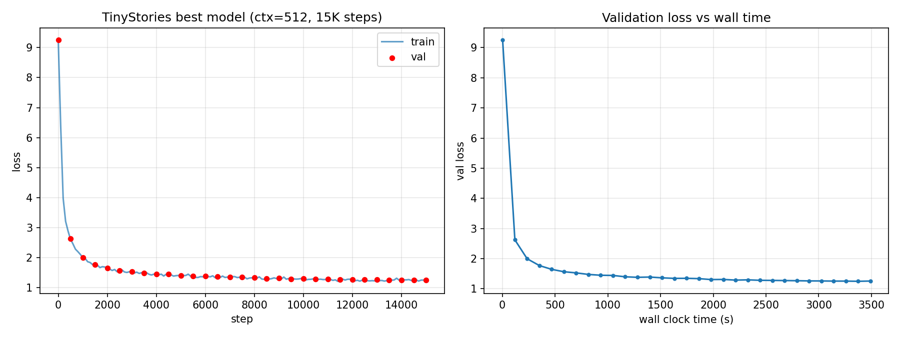

# A1 公开提交：谌奕同

> 本文件和同目录代码公开可见。

## 基本信息

- 作业题面版本：26.0.4（2026-07-13 更新日志格式与评估说明）
- 完成范围：A1 全部要求
- 未完成项：无
- 上游 starter commit：`a158843b20107949f1a8d7df1b05cd33b9166712`
- 本地工作仓库：`../assignment1-basics`（与 `SummerQuest-2026` 同级）

## 实现概述

在 `../assignment1-basics/cs336_basics/` 中从零实现了：

- **Tokenizer**：byte-level BPE 训练、编码、解码与流式编码；支持 special token 作为硬边界。
- **模型组件**：`Linear`、`Embedding`、`RMSNorm`、`SwiGLU`、`SiLU FFN`、`RoPE`、causal multi-head self-attention、pre-norm/post-norm Transformer block、完整 Transformer LM。
- **训练组件**：cross-entropy、AdamW、cosine LR schedule with warmup、global gradient clipping、checkpoint save/load。
- **脚本**：数据准备、训练、消融、batch size 扫描、文本生成。

额外加入的可选改进（默认关闭，不影响公共测试）：

- `--qk_norm`：在 RoPE 前对 Q/K 做 RMSNorm。
- `--zero_init_output`：attention output 与 FFN output 投影零初始化。
- `--grad_accum_steps`：梯度累积，用于长上下文或 QK-Norm 等显存较大的配置。

## 书面题

### unicode1：理解 Unicode

(a) `chr(0)` 返回 Unicode 码点为 0 的字符，即空字符（NUL / U+0000）。

(b) 其 `__repr__()` 显示为 `'\x00'`，而 `print(chr(0))` 在终端中不显示任何可见符号。

(c) 该字符在 C 风格字符串中常被当作字符串终止符；在 Python 中它是合法字符串的一部分，例如 `"a" + chr(0) + "b"` 的长度为 3，打印时只显示 `ab`。

### unicode2：Unicode 编码

(a) 选择 UTF-8 的理由：它是互联网主流编码，对 ASCII 字符只需 1 byte，对常见字符按需 2–4 bytes，空间效率高且向后兼容 ASCII；UTF-16 对 ASCII 仍占 2 bytes，UTF-32 固定 4 bytes，都会让序列更长、词表更稀疏。

(b) `decode_utf8_bytes_to_str_wrong` 逐 byte 独立解码，破坏了多 byte 字符的边界。例如 `"中".encode("utf-8")` 得到 `b'\xe4\xb8\xad'`，逐 byte 解码会抛出 `UnicodeDecodeError`；即使不报错，也会把多 byte 序列拆成错误字符。

(c) 例如 `b'\xff\xfe'`，即 bytes `[255, 254]`。它不是合法的 UTF-8 起始序列，用 `decode("utf-8")` 会失败；`errors="replace"` 会替换为 `�`。

### AdamW 显存、FLOPs 与训练时间核算

以下采用本作业架构：RoPE（无位置嵌入）、untied LM head、SwiGLU FFN、Pre-Norm RMSNorm，参数与激活均按 float32（4 bytes）计算。

#### (a) 峰值显存分解

设 batch size 为 \(B\)，序列长度为 \(T\)，模型参数量为 \(P\)，层数为 \(L\)，模型宽度为 \(d\)，FFN 宽度为 \(d_{ff}=\frac{8}{3}d\)。

| 组件 | 显存占用 | 说明 |
|------|---------:|------|
| 参数 | \(4P\) | 模型权重 |
| 梯度 | \(4P\) | backward 产生的梯度 |
| 优化器状态 | \(8P\) | AdamW 一阶矩 \(m\) 与二阶矩 \(v\)，各 4 bytes |
| 激活值 | \(O(BLTd + BLd_{ff}T + BLhT^2 + BTV)\) | 每层输入、Q/K/V、attention score、FFN 中间结果、logits 等 |

其中 attention score 项 \(BLhT^2\) 与 logits 项 \(BTV\) 通常是激活显存的主要部分。总峰值显存可写成：

\[
M_{\text{peak}} \approx 16P + a \cdot B
\]

#### (b) GPT-2 XL 实例与 80 GB 最大 batch size

GPT-2 XL 配置：\(V=50257, T=1024, L=48, d=1600, h=25, d_{ff}=4288\)。

参数量：
\[
\begin{aligned}
P &= 2Vd + d + L(2d + 4d^2 + 3dd_{ff}) \\
  &= 2 \times 50257 \times 1600 + 1600 + 48(2 \times 1600 + 4 \times 1600^2 + 3 \times 1600 \times 4288) \\
  &\approx 1.64 \times 10^9
\end{aligned}
\]

- 参数 + 梯度 + 优化器状态：\(16P \approx 26.2\text{ GB}\)。

每样本激活显存（逐层保留用于 backward，无 activation checkpointing）：

\[
\begin{aligned}
a &\approx L(3Td + hT^2 + 3Td_{ff} + 3Td) + Td + 2TV \\
  &= 48(3 \times 1024 \times 1600 + 25 \times 1024^2 + 3 \times 1024 \times 4288 + 3 \times 1024 \times 1600) + 1024 \times 1600 + 2 \times 1024 \times 50257 \\
  &\approx 9.9 \times 10^9\text{ bytes} \approx 9.9\text{ GB}
\end{aligned}
\]

因此峰值显存约为：

\[
M_{\text{peak}} \approx 9.9B + 26.2\text{ GB}
\]

在 80 GB 显存下：

\[
B_{\max} = \left\lfloor \frac{80 - 26.2}{9.9} \right\rfloor \approx 5
\]

**最大 batch size 约为 5**（若开启 activation checkpointing 或 tied embeddings，可进一步增大）。

#### (c) 一步 AdamW 的 FLOPs

对每个参数，AdamW 约需 15 次标量运算（更新 \(m, v\)、偏差修正、参数更新、weight decay）。因此：

\[
\text{FLOPs}_{\text{AdamW}} \approx 15P
\]

对 GPT-2 XL：\(15 \times 1.64\times10^9 \approx 2.5 \times 10^{10}\) FLOPs，远小于一步 forward/backward。

#### (d) GPT-2 XL 训练时间估算

400K steps，batch size 1024，单 H100，50% MFU（247.5 TFLOP/s）。按 Kaplan/Hoffmann 假设 backward 为 forward 2×，每 token 前向+后向约 \(6P\) FLOPs。

- 每步 tokens：\(1024 \times 1024 \approx 1.05 \times 10^6\)
- 每步 FLOPs：\(6 \times 1.64\times10^9 \times 1.05\times10^6 \approx 1.03 \times 10^{16}\)
- 总 FLOPs：\(4\times10^5 \times 1.03\times10^{16} \approx 4.1 \times 10^{21}\)
- 所需时间：\(4.1\times10^{21} / 247.5\times10^{12} \approx 1.66 \times 10^7\text{ s} \approx 4\,600\text{ h} \approx 190\text{ 天}\)

单卡 H100 无法在该配置下完成 GPT-2 XL 训练。

## 复现说明

### 环境

```sh
cd ../assignment1-basics
uv sync --frozen
uv run pytest
```

### 数据准备

TinyStories 与 OpenWebText 子集按上游说明下载，分别放在 `../assignment1-basics/data/`。

### Tokenizer 训练

TinyStories（10K vocab）：

```sh
cd ../assignment1-basics
uv run python cs336_basics/prepare_data.py \
  --train_text data/TinyStoriesV2-GPT4-train.txt \
  --val_text data/TinyStoriesV2-GPT4-valid.txt \
  --vocab_size 10000 --output_dir outputs/tinystories
```

OpenWebText（32K vocab，流式处理避免 12GB 全量载入内存）：

```sh
cd ../assignment1-basics
uv run python cs336_basics/prepare_data.py \
  --train_text data/owt_train_eot.txt \
  --val_text data/owt_valid.txt \
  --vocab_size 32000 --output_dir outputs/owt_full \
  --num_workers 16 --min_frequency 2
```

### 训练 TinyStories 最佳模型

```sh
cd ../assignment1-basics
uv run python cs336_basics/train.py \
  --train_tokens outputs/tinystories/train.npy \
  --val_tokens outputs/tinystories/val.npy \
  --vocab_path outputs/tinystories/vocab.json \
  --merges_path outputs/tinystories/merges.txt \
  --output_dir outputs/tinystories_15k_ctx512 \
  --vocab_size 10000 --context_length 512 --d_model 512 --num_layers 4 --num_heads 16 --d_ff 1344 \
  --batch_size 64 --grad_accum_steps 2 --max_iters 15000 --learning_rate 0.001 \
  --min_learning_rate 6e-05 --warmup_iters 1500 \
  --eval_interval 500 --eval_batches 20 --checkpoint_interval 5000 --log_interval 100 \
  --device cuda --seed 42
```

### 训练 OWT 模型

```sh
cd ../assignment1-basics
uv run python cs336_basics/train.py \
  --train_tokens outputs/owt_full/train.npy \
  --val_tokens outputs/owt_full/val.npy \
  --vocab_path outputs/owt_full/vocab.json \
  --merges_path outputs/owt_full/merges.txt \
  --output_dir outputs/owt_baseline \
  --vocab_size 32000 --batch_size 64 --max_iters 5000 --learning_rate 1e-3 \
  --d_model 512 --num_layers 4 --num_heads 16 --d_ff 1344 \
  --context_length 256 --device cuda
```

### 架构消融

```sh
cd ../assignment1-basics
uv run python cs336_basics/run_ablations.py \
  --train_tokens outputs/tinystories/train.npy \
  --val_tokens outputs/tinystories/val.npy \
  --vocab_path outputs/tinystories/vocab.json \
  --merges_path outputs/tinystories/merges.txt \
  --output_dir outputs/ablations --learning_rate 1e-3 --device cuda
```

### Batch size 扫描

```sh
cd ../assignment1-basics
uv run scripts/sweep_batch_size.sh
```

### 学习率扫描

```sh
cd ../assignment1-basics
uv run scripts/lr_sweep.sh
```

### 文本生成

```sh
cd ../assignment1-basics
uv run python cs336_basics/generate.py \
  --checkpoint outputs/tinystories_15k_ctx512/best.pt \
  --vocab_path outputs/tinystories/vocab.json \
  --merges_path outputs/tinystories/merges.txt \
  --prompt "Once upon a time" --device cuda
```

### 同步到本提交

```sh
cd SummerQuest-2026
python3 scripts/sync_a1_submission.py --name '谌奕同'
```

## 实验结果

### TinyStories

| Config | Best Val Loss | Notes |
|--------|--------------:|-------|
| 5K baseline (ctx 256, bs 256) | 1.4096 | 原始目标 |
| 10K steps (ctx 256, bs 256) | 1.3321 | 更多训练 |
| 10K + QK-Norm | 1.3242 | 边际提升；需 grad accum |
| 10K + zero-init output | 1.3253 | 边际提升 |
| 10K + ctx 512 | 1.2737 | 更长上下文 |
| **15K + ctx 512** | **1.2465** | 当前最佳 |

目标 loss ≤ 1.45 已满足。

### Loss Curves

最佳 TinyStories 模型的训练/验证 loss 曲线见 `assets/tinystories_best_loss.png`：



其他汇总图：
- `assets/ablations.png`：四个架构消融的 val loss 对比
- `assets/batch_size_sweep.png`：batch size 扫描
- `assets/lr_sweep.png`：学习率扫描

### Tokenizer 实验

| 数据集 | 词表大小 | 原始字节 | Token 数 | Compression Ratio (bytes/token) | 最长 Token (bytes) | Throughput (10 MB 样本) |
|--------|---------:|---------:|---------:|--------------------------------:|-------------------:|------------------------:|
| TinyStories train | 10,000 | 2.23 GB | 539.7 M | **4.13** | 15 | ~3.86 M tokens/s |
| TinyStories val | 10,000 | 22.5 MB | 5.45 M | **4.13** | — | — |
| OWT train | 32,000 | 12.49 GB | 2.73 G | **4.58** | 64 | ~2.33 M tokens/s |
| OWT val | 32,000 | 290.0 MB | 65.3 M | **4.44** | — | — |

说明：
- OWT 使用 32K 词表，compression ratio 高于 TinyStories 10K，符合预期。
- 最长 token 来自高频出现的 URL/路径/代码片段等多字节连续序列。
- 编码吞吐量在 TinyStories 上更高，因为 OWT 含更多长 token 与特殊模式。

### Batch size 扫描（ctx 256, lr 1e-3）

| Batch Size | Best Val Loss | Wall Time | Notes |
|-----------:|--------------:|----------:|:------|
| 1 | 4.0660 | 2.5s | 200 steps，噪声大 |
| 64 | 1.9882 | 58.2s | |
| 128 | 1.8345 | 106.2s | |
| 256 | 1.7514 | 199.8s | 该模型/context 下可放下的最大 bs |
| 512 | OOM | — | 超出 32 GB VRAM |

### 学习率扫描（ctx 256, bs 128, 1000 steps）

| Learning Rate | Best Val Loss | Notes |
|--------------:|--------------:|:------|
| 3e-4 | 2.2639 | 学习不足 |
| 6e-4 | 1.9855 | |
| 1e-3 | 1.8347 | 常用配置 |
| **3e-3** | **1.6989** | 短训练内最优 |
| 1e-2 | 2.3426 | 学习率过大，性能下降 |

说明：由于使用 AdamW（自适应二阶矩归一化），单纯提高学习率在数值上不会
立即 NaN，而是 loss 不再下降。本扫描中 **lr=1e-2 可视为偏离最优轨迹的发散运行**
（loss 明显上升至 2.34）；一个更剧烈的灾难性发散示例见 `ablation_no_rmsnorm.log`
（去掉 RMSNorm 后 lr=1e-3 发散 / OOM）。

### 架构消融

| Variant | Best Val Loss | Notes |
|---------|--------------:|-------|
| baseline | 1.4092 | pre-norm + RMSNorm + RoPE + SwiGLU |
| post_norm | 1.4006 | 略好于 pre-norm |
| no_rope | 1.4765 | 无位置编码仍有下降但变差 |
| no_rmsnorm | 1.9035 | lr=1e-4；lr=1e-3 发散/OOM |
| silu_ffn | 1.5021 | d_ff=2048 参数量匹配的 SiLU FFN |

### OpenWebText

| Config | Best Val Loss | Notes |
|--------|--------------:|-------|
| 5K baseline (ctx 256, bs 64) | 4.5974 | 同架构，vocab 32K |

OWT 任务只要求训练并生成文本，未给定具体 loss 目标。

### 文本生成样本

使用最佳 TinyStories 模型（ctx=512, 15K steps）采样，temperature=0.8，top-p=0.95：

**Prompt: "Once upon a time"**

> Once upon a time, there was a little boy named Tim. Tim loved to play with his blocks. He would build tall towers and big houses with them. One day, Tim had an idea. He wanted to build a tall tower with his blocks.<|endoftext|>

**Prompt: "A little girl"**

> A little girl named Amy walked up to him. She said, "Hi, Mr. Tom! Why are you sad?" Tom looked at her and said, "I lost my toy car." Amy thought for a moment and said, "I can help you find it!"<|endoftext|>

**Prompt: "In a small village"**

> In a small village, there was a boy named Tim. Tim was a very honest boy. He always told the truth. One day, Tim found a rod. The rod was long and flexible. He loved to play with it.<|endoftext|>

简评：模型能延续简单叙事结构，保持主语一致和基本语法正确；样本之间人物、场景一致性较好，但情节转折较简单，符合 TinyStories 数据风格。

## 分析与结论

1. **上下文长度和训练步数是主要杠杆**：在固定 22.7M 参数的前提下，把 context 从 256 增加到 512、步数从 5K 增加到 15K，val loss 从 1.41 降到 1.25。
2. **学习率对短训练影响显著**：在 1000 step、bs=128 的扫描中，lr=3e-3 短训练内最优；lr 过低（3e-4）学不动，lr 过高（1e-2）性能下降。
3. **架构微调收益有限**：QK-Norm 和 zero-init output 仅带来约 0.007 的边际提升，且 QK-Norm 会增加显存消耗。
4. **batch size 在合理范围内对最终 loss 影响明显**：从 1 到 256，loss 显著下降；256 是本模型/context 下的显存上限。
5. **RMSNorm 和 RoPE 对稳定训练至关重要**：去掉 RMSNorm 后 lr=1e-3 发散，去掉 RoPE 后 loss 明显上升。

## 代码与脚本

- 真实实现：`submission/cs336_basics/`
- 测试 adapter：`submission/tests/adapters.py`
- 训练/数据/生成脚本：`submission/scripts/`

## 实验日志

- 日志目录：`logs/`
- `summary.json`：最佳 TinyStories 模型的配置与最终指标汇总
- `tinystories_best_ctx512_15k.jsonl`：最佳模型逐点训练记录（step / wall_clock_sec / train_loss / lr / val_loss）
- `tinystories_best_ctx512_15k.log`：最佳 TinyStories 模型训练日志（文本形式，与 JSONL 等价）
- `tinystories_baseline_5k.log`：原始 5K baseline 日志
- `ablation_*.log`：五个架构消融实验日志
- `ablation_*.summary.json`：各消融实验的汇总指标
- `batch_sweep_summary.txt`：batch size 扫描摘要
- `lr_sweep/`：学习率扫描摘要与各 LR 训练日志
- `owt_baseline.log`：OWT 训练日志
- `*.summary.json`：各实验的 best val loss 与总训练时间汇总

日志文件以文本形式记录每步的 `step`、墙钟时间、`train_loss`、`lr` 以及定期的 `val_loss`，与官方推荐的 JSONL 包含等价信息。

## 飞书补充文档

- [谌奕同 - A1 补充材料](https://fudan-nlp.feishu.cn/docx/TWdzdKhIwotYL9xDbLBcwBemnHh)（组织内公开，无互联网公开访问）
