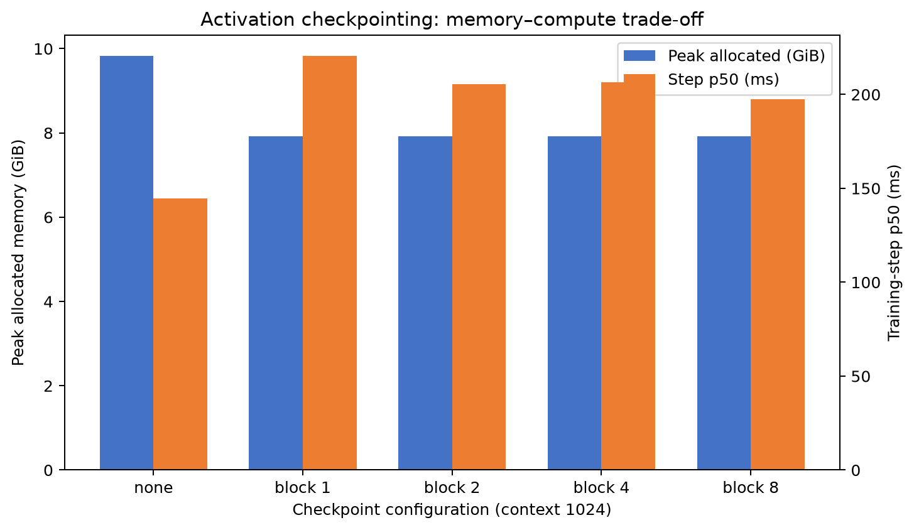
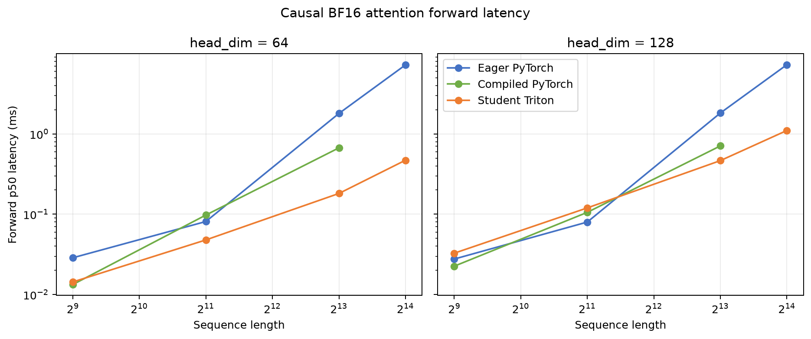
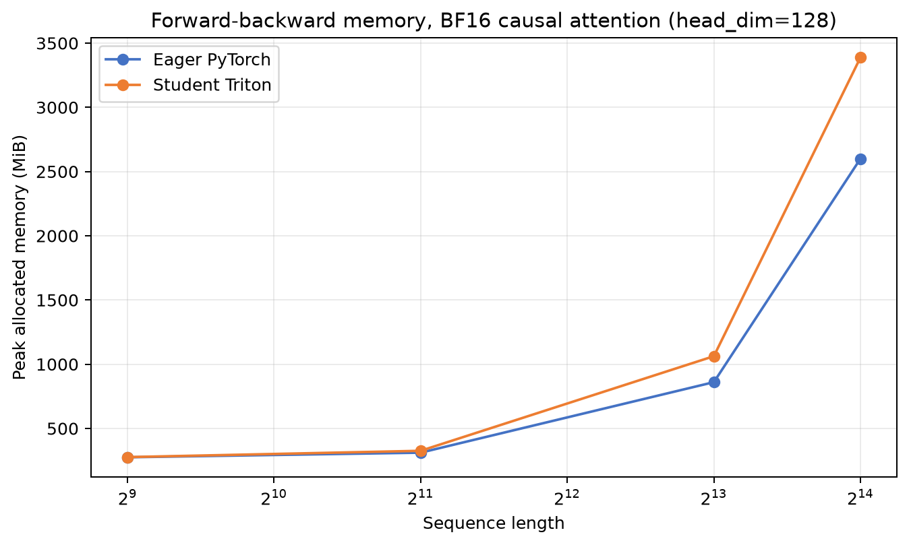

# A2-K 公开提交：金罗智杰

> 本文件和同目录代码、汇总、图片公开可见。只提交允许公开且已经脱敏的内容；上游仓库、
> 编译缓存和完整运行日志保留在个人工作区，未进入公开仓库。

> 正式要求见
> [`assignments/A2-K/README.md`](../../../../assignments/A2-K/README.md)，评分说明见
> [`assignments/A2-K/EVALUATION.md`](../../../../assignments/A2-K/EVALUATION.md)。

## 基本信息

- 作业题面版本：`26.1.4-k-rc.3`
- 完成范围：activation checkpointing、显式 PyTorch attention、`torch.compile` 对照、
  pure PyTorch tiled reference、学生 Triton FlashAttention-2 forward、重计算 backward、
  官方 CUDA tests、扩展正确性与固定性能矩阵。
- 未完成项：无。
- 可选扩展：未实现自定义 Triton backward；必做 backward 使用 PyTorch 重计算与
  `torch.compile`。
- 上游 starter commit：`ca8bc81a59b70516f7ebb2da4808daade877c736`

## 环境与工具

完整的脱敏环境和命令见
[`results/run_metadata.json`](results/run_metadata.json)。

| 项目 | 公开、脱敏的信息 |
| --- | --- |
| GPU | NVIDIA GeForce RTX 4090，49140 MiB；助教确认使用 23552 MiB allocator cap |
| 开跑前显存 | 最低记录 48625 MiB free；每个进程限制为 23552 MiB |
| Driver / CUDA | 550.163.01 / CUDA runtime 12.8 |
| PyTorch | 2.11.0+cu128 |
| Triton | 3.6.0 |
| power limit / P-state | 450 W，默认设置；采集时 P8 |
| TF32 | 性能实验开启；36 个 FP32 correctness case 使用 `fp32_precision=ieee` 关闭 |
| compile 配置 | attention 使用 `fullgraph=True`；backward-only 测量设置 `donated_buffer=False` |
| allocator limit / fraction | 23552 MiB / 0.484217370466 |
| 测量 | attention 使用 `do_bench`，warm-up 100 ms、rep 300 ms、p20/p50/p80 |
| 其他限制 | 无 |

所有实验串行运行；输入、模型、optimizer 与随机数据在计时区间外创建。正式计时边界前后
同步 CUDA，显存测量前重置 peak statistics。

## 1. Activation Checkpointing

### 理论与代码骨架

在忽略计算代价时，可以对连续 block 做平衡的递归二分，并在每一层递归外使用嵌套
checkpoint。外层只保存分段入口 activation；反向到达一段时重新执行该段，内层 checkpoint
继续抑制更细粒度 residual。递归深度为 `O(log N)`，任一时刻仅保留递归路径上的边界
activation 和一个叶子 block 的 residual，因此峰值 activation memory 为 `O(log N)`；
每层递归会重算覆盖 `N` 个 block 的工作，总计算量为 `O(N log N)`。

```python
def run(lo, hi, x):
    if hi - lo == 1:
        return blocks[lo](x)
    mid = (lo + hi) // 2
    x = checkpoint(
        lambda y: run(lo, mid, y), x,
        use_reentrant=False,
    )
    return checkpoint(
        lambda y: run(mid, hi, y), x,
        use_reentrant=False,
    )
```

固定实验没有使用嵌套策略，而是按题面比较非嵌套 block size `1/2/4/8`。实现见
[`submission/cs336_systems/a2k/checkpointing.py`](submission/cs336_systems/a2k/checkpointing.py)，
5 个原始 step 样本均保存在
[`results/checkpointing.csv`](results/checkpointing.csv)。

### 固定实验

模型为 Stanford medium、24 层、batch size 1、BF16 autocast、FP32 参数和 AdamW；每组
3 次 warm-up、5 次 measurement。

| Context | Checkpoint block | p50 step（ms） | Peak allocated（MiB） | Peak reserved（MiB） | 状态 |
| ---: | ---: | ---: | ---: | ---: | --- |
| 1024 | none | 144.696 | 10064.720 | 10172 | success |
| 1024 | 1 | 220.530 | 8117.348 | 8174 | success |
| 1024 | 2 | 205.550 | 8116.411 | 8162 | success |
| 1024 | 4 | 206.499 | 8117.348 | 8200 | success |
| 1024 | 8 | 197.294 | 8117.348 | 8230 | success |
| 2048 | none | 386.609 | 19660.513 | 20164 | success |
| 2048 | 2 | 493.871 | 8568.185 | 9696 | success |



### 分析

context 1024 下，block size 2 的 peak allocated 最低，但它只比 block size 1/4/8 低约
1 MiB；完整 training step 的峰值在这里更多受参数、梯度和 optimizer state 支配，所以不能
把这个细小差异解释成普遍最优 tile。context 2048 下，block size 2 相对 baseline 将 peak
allocated 降低约 56.4%，同时 p50 增加约 27.7%。checkpoint 数量越多会保存更多边界
activation，checkpoint 范围越大又会在重计算时同时物化更多 residual，因此最佳点由两者和
非 activation 峰值共同决定。

## 2. PyTorch Attention 与 `torch.compile`

### 显式 PyTorch 基线

[`submission/cs336_systems/a2k/attention.py`](submission/cs336_systems/a2k/attention.py)
中的 baseline 明确执行 `QK^T`、scale、causal mask、softmax 和 `PV`，没有调用
`scaled_dot_product_attention`、第三方 FlashAttention 或其他 fused attention。backward-only
使用同一计算图上的 `torch.autograd.grad(..., retain_graph=True)`，输入生成与 cold call 不在
steady-state 计时内。完整 18 行及 p20/p50/p80 见
[`results/attention_baseline.csv`](results/attention_baseline.csv)。

| Sequence | Head dim | Forward p50（ms） | Backward p50（ms） | F+B p50（ms） | F+B peak allocated / reserved（MiB） |
| ---: | ---: | ---: | ---: | ---: | ---: |
| 512 | 64 | 0.028768 | 0.031744 | 0.218576 | 274.88 / 280 |
| 512 | 128 | 0.027648 | 0.034816 | 0.196608 | 275.25 / 280 |
| 2048 | 64 | 0.081920 | 0.089088 | 0.199680 | 309.75 / 320 |
| 2048 | 128 | 0.083968 | 0.105472 | 0.243712 | 311.25 / 322 |
| 8192 | 64 | 1.795072 | 2.452480 | 4.171776 | 854.25 / 926 |
| 8192 | 128 | 1.824512 | 2.488320 | 4.248576 | 860.25 / 938 |

对于 sequence 8192，单个 BF16 `N × N` 矩阵已经约 128 MiB；score、probability、mask 和
backward 中间量使峰值进一步增加，符合显式 attention 的二次方扩展趋势。

### Compile 对照

首次调用与 steady-state 分开记录在
[`results/compile_comparison.csv`](results/compile_comparison.csv)。下表的 speedup 均为相同
shape、phase 下 `eager p50 / compiled p50`。

| Scope / shape | Phase | Compiled first-call（ms） | Eager p50（ms） | Compiled p50（ms） | Speedup |
| --- | --- | ---: | ---: | ---: | ---: |
| attention 512/64 | forward | 2142.866 | 0.028672 | 0.014336 | 2.000× |
| attention 512/64 | backward | 327.133 | 0.031744 | 0.023552 | 1.348× |
| attention 2048/128 | forward | 657.971 | 0.084992 | 0.105472 | 0.806× |
| attention 2048/128 | backward | 995.012 | 0.101376 | 0.130048 | 0.780× |
| attention 8192/128 | forward | 1.788 | 1.819648 | 0.709632 | 2.564× |
| attention 8192/128 | backward | 4.054 | 2.486272 | 1.157120 | 2.149× |
| small Transformer | forward | 6959.766 | 13.001728 | 3.104832 | 4.188× |
| small Transformer | forward-backward | 16219.761 | 51.001343 | 12.758656 | 3.997× |
| small Transformer | train step | 43.646 | 54.910976 | 20.130816 | 2.728× |

compile 并非对所有 shape 都更快：2048/128 的单独 forward 和 backward 均变慢。attention
使用 `fullgraph=True` 且所有配置成功，因此被测 attention 区间没有被 graph break 静默拆分；
完整模型使用默认 compile 模式，没有额外导出 graph-break counter。不同 shape 会触发
specialization，但同一进程内也会复用内存和磁盘 compile cache，因此后运行配置的 first-call
不能解释为完全冷缓存编译时间。`donated_buffer=False` 只用于允许 backward-only 对同一图
反复求梯度，设置和原因均写入 metadata。

## 3. FlashAttention-2 Forward

### Pure PyTorch tiled reference

pure PyTorch reference 分别遍历 query tile 和 key/value tile，不物化完整 attention matrix。
每个 query tile 维护 FP32 running maximum、running normalizer 和 output accumulator；合并
新 key tile 时先用新旧最大值差重标定已有状态，再加入当前 tile。causal 模式用全局 query/key
位置生成 mask。forward 保存 `L`、`Q`、`K`、`V`、`O`，其中仅有一个
`[batch, n_queries]` 张量，即 FP32 log-sum-exp `L`。

### Triton kernel

学生实现包含真实 `@triton.jit` kernel。launch grid 为
`(ceil(n_queries / 64), batch_size)`，每个 program 只负责一个 batch 中的一个 query tile，
并在 kernel 内循环 key/value tile。`head_dim <= 64` 使用 `Bq=64, Bk=64`，
`head_dim=128` 使用 `Bq=64, Bk=32`；两者均使用 `num_warps=4, num_stages=2`。

Q/K/V 通过显式 stride pointer arithmetic 加载。score tile 由 `tl.dot` 计算；causal 与
边界 mask 在写入 online softmax 前应用。running max、normalizer 和 accumulator 均为
FP32，probability 在与 V 相乘前转换到 V 的 dtype，最终 O 转回输入 dtype，L 保持 FP32。
kernel 从未调用已有 fused attention。

## 4. Backward 与正确性

### 重计算式 backward

backward 从保存的 `Q/K/V/O/L` 重算
`P = exp(QK^T / sqrt(d) - L)`，并计算
`D = rowsum(O * dO)`。随后使用
`dS = P * (dP - D)` 得到 `dQ = dS K / sqrt(d)`、
`dK = dS^T Q / sqrt(d)` 和 `dV = P^T dO`。两个 autograd path 共用这个
`torch.compile` backward，并按输入顺序返回 `dQ/dK/dV`；causal mask 与 forward 一致。
自定义 Triton backward 是可选扩展，本提交未实现。

### 官方 GPU tests

脱敏输出见 [`results/unit_tests.txt`](results/unit_tests.txt)。测试在真实 CUDA GPU 上运行，
固定 starter commit 为 `ca8bc81`：

- collected：6
- passed：6
- failed：0
- skipped：0

通过项覆盖 pure PyTorch forward/backward，以及 Triton causal/non-causal
forward/backward。由于离线 GPU 机器直接使用共享本地环境，记录入口为
`python student_scripts/a2k/run_official_attention_tests.py`，脚本在同一已施加 allocator
上限的进程内调用官方 pytest。

### 扩展正确性

[`results/correctness.json`](results/correctness.json) 包含 3 个 seed、head dimension
32/64/128、causal/non-causal、FP32/BF16，以及 pure PyTorch/Triton 两种实现，共 72 行，
全部通过。36 个 FP32 case 明确关闭 TF32。

| 张量 | 最大绝对误差 | 最大相对误差 |
| --- | ---: | ---: |
| O | 0.015625 | 2532.959 |
| L | 0.008202 | 0.008714 |
| dQ | 0.015625 | 4108.343 |
| dK | 0.019531 | 1434.326 |
| dV | 0.015625 | 482.236 |

最大相对误差来自参考值接近零，不能单独代表数值质量；pass/fail 使用逐元素
`atol + rtol * abs(reference)` 判定。FP32 与 BF16 的容差和每一项误差均保留在 JSON 中。

## 5. 性能矩阵

### 配置与命令

固定 batch size 1、BF16、causal；核心矩阵覆盖 sequence 512/2048/8192、head dimension
64/128、forward/backward/forward-backward，以及 eager、compiled 和学生 Triton。
sequence 16384 边界覆盖两个 head dimension、三个 phase、eager 与 Triton。每行采用
`do_bench(warmup=100, rep=300, quantiles=[0.2, 0.5, 0.8])`，完整 66 行见
[`results/flash_benchmark.csv`](results/flash_benchmark.csv)。

最小复现入口：

```bash
python student_scripts/a2k/benchmark_flash.py
```

### 结果与图

下表汇总 forward p50；括号内为相对同 shape eager 的 speedup。compiled 16384 是题面可选项，
本次没有采集。

| Sequence | Head dim | Eager p50（ms） | Compiled p50（ms） | Triton p50（ms） |
| ---: | ---: | ---: | ---: | ---: |
| 512 | 64 | 0.028672（1.000×） | 0.013312（2.154×） | 0.014336（2.000×） |
| 512 | 128 | 0.027648（1.000×） | 0.022528（1.227×） | 0.032704（0.845×） |
| 2048 | 64 | 0.081088（1.000×） | 0.097600（0.831×） | 0.047840（1.695×） |
| 2048 | 128 | 0.079872（1.000×） | 0.105472（0.757×） | 0.119808（0.667×） |
| 8192 | 64 | 1.796096（1.000×） | 0.669696（2.682×） | 0.181248（9.910×） |
| 8192 | 128 | 1.819648（1.000×） | 0.708608（2.568×） | 0.464896（3.914×） |
| 16384 | 64 | 7.222256（1.000×） | — | 0.470016（15.366×） |
| 16384 | 128 | 7.266304（1.000×） | — | 1.102528（6.591×） |



16384 边界的三种 phase 如下。显存列为 peak allocated；完整 CSV 同时保存 peak reserved。

| Head dim | 实现 | Phase | p20 / p50 / p80（ms） | Peak allocated（MiB） | Speedup |
| ---: | --- | --- | --- | ---: | ---: |
| 64 | eager | forward | 7.219 / 7.222 / 7.224 | 1816.5 | 1.000× |
| 64 | Triton | forward | 0.468 / 0.470 / 0.472 | 282.3 | 15.366× |
| 64 | eager | backward | 9.728 / 9.731 / 9.735 | 2588.3 | 1.000× |
| 64 | Triton | backward | 12.182 / 12.191 / 12.198 | 3366.4 | 0.798× |
| 64 | eager | forward-backward | 16.889 / 16.892 / 16.897 | 2588.3 | 1.000× |
| 64 | Triton | forward-backward | 12.646 / 12.655 / 12.660 | 3366.4 | 1.335× |
| 128 | eager | forward | 7.263 / 7.266 / 7.269 | 1824.5 | 1.000× |
| 128 | Triton | forward | 1.101 / 1.103 / 1.104 | 292.3 | 6.591× |
| 128 | eager | backward | 9.871 / 9.875 / 9.879 | 2600.3 | 1.000× |
| 128 | Triton | backward | 11.920 / 11.928 / 11.940 | 3388.4 | 0.828× |
| 128 | eager | forward-backward | 17.097 / 17.103 / 17.105 | 2600.3 | 1.000× |
| 128 | Triton | forward-backward | 12.996 / 13.000 / 13.017 | 3388.4 | 1.316× |



### 分析

短序列下，launch 和 tiled online-softmax 开销可超过节省的 HBM 流量，因此 Triton 在
512/128 和 2048/128 forward 慢于 eager。序列增长后，显式 attention 的 `N × N` 中间量和
HBM traffic 主导；Triton forward 不物化该矩阵，因此 16384/64 达到 15.366×，peak
allocated 从 1816.5 MiB 降到 282.3 MiB。

当前 backward 是必做的 compiled PyTorch 重计算，不是 fused Triton backward。它会物化
FP32 score/probability/gradient 中间量，所以 backward-only 在所有展示的 16384 配置中慢于
eager，且完整 F+B 的 Triton path peak allocated 高于 eager。forward 的显存优势不能直接
推广到当前 backward；自定义 tiled Triton backward 才可能消除这部分二次方中间量。固定
矩阵 66 行全部 success，没有 OOM 或 compile failure。

## 6. 限制与复现

- 代码同步命令：`python3 scripts/sync_a2k_submission.py --name '金罗智杰'`
- 轻量结果目录：`results/`
- 24 GiB 预算证据：
  [`results/memory_evidence.json`](results/memory_evidence.json) 记录
  allocator fraction `0.484217370466`、limit 23552 MiB、最高 peak allocated
  19660.513 MiB、最高 peak reserved 20164 MiB、`within_24gib=true`。
- 未提交的本地材料：compile cache、Triton cache、完整 benchmark 控制台日志和临时诊断
  结果仅保留在个人工作区，不进入公开仓库。
- 硬件口径：使用 48GB RTX 4090，并在首次 CUDA allocation 前设置 23552 MiB allocator
  cap；该等价运行方式已由助教确认可用。
- compile first-call 受同进程 shape specialization 和既有 cache 影响；报告将其称为观察到的
  first-call，而不是完全清空所有编译缓存后的构建时间。
- 自定义 Triton backward 是可选项，本次未实现；这解释了 backward 的性能和显存边界。

从固定 starter commit 复现的最小顺序：

```bash
python student_scripts/a2k/run_official_attention_tests.py
python student_scripts/a2k/run_correctness.py
python student_scripts/a2k/benchmark_checkpointing.py
python student_scripts/a2k/benchmark_attention_baseline.py
python student_scripts/a2k/benchmark_compile.py
python student_scripts/a2k/benchmark_flash.py
python student_scripts/a2k/finalize_results.py
```

## 飞书补充文档

- 链接：https://fudan-nlp.feishu.cn/wiki/C1BKw664Riik5WklOJ1cmR15nuf
- 权限：组织内公开；匿名访问返回重定向，未直接暴露互联网正文。

补充文档只应保存组织内核验所需的差量信息：GPU 资源规格与 24GB 要求的偏差、运行确认、
问题排查记录和助教确认结论。它不是第二份公开报告，不复制本 README 的完整表格。

## 自检

- [x] 本分支只包含我本人本次 A2-K 的文件。
- [x] 正式结果来自单张 RTX 4090；48GB 卡使用 23552 MiB allocator cap 的方式已由助教确认，
  且开跑前可用显存不少于 22 GiB。
- [x] 每个正式脚本独立、串行执行，首次 CUDA allocation 前设置 23552 MiB allocator 上限。
- [x] README 是 Markdown 主报告，所有图片使用相对路径和有意义的 alt text。
- [x] checkpoint、baseline、compile、正确性与 Flash benchmark 的必交结果齐全。
- [x] PyTorch baseline 没有调用已有 fused attention。
- [x] 提交包含学生自己编写的真实 `@triton.jit` forward kernel。
- [x] 官方 CUDA tests 的 pass/fail/skip 如实记录。
- [x] 每个关键数字都能回到命令、`results/` 或 metadata。
- [x] `results/` 与 `assets/` 附件合计不超过 2 MiB，README 和单文件均未超限。
- [x] 未提交 compile cache、PTX/CUBIN、binary、完整 trace、上游仓库或依赖环境。
- [x] GitHub 内容不含内部主机名、IP、账号、路径、UUID、进程或未公开项目。
- [x] GitHub 和飞书正文都不含 Secret、Token、Cookie、密码或私钥。
- [x] 飞书补充文档为组织内公开，且未开启互联网公开访问。
