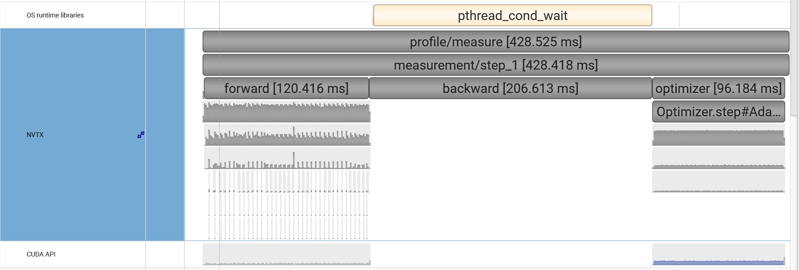
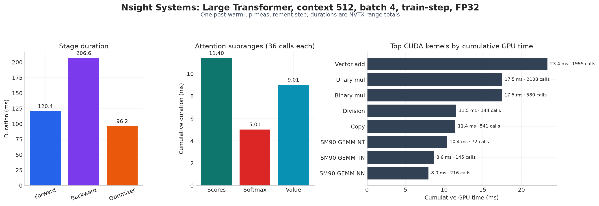
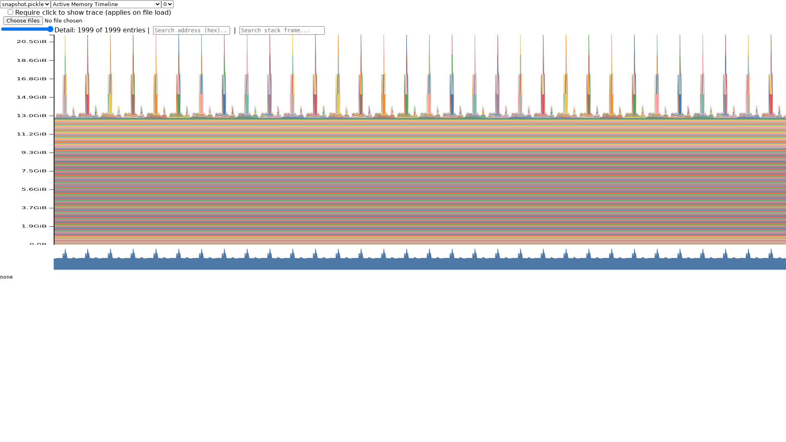
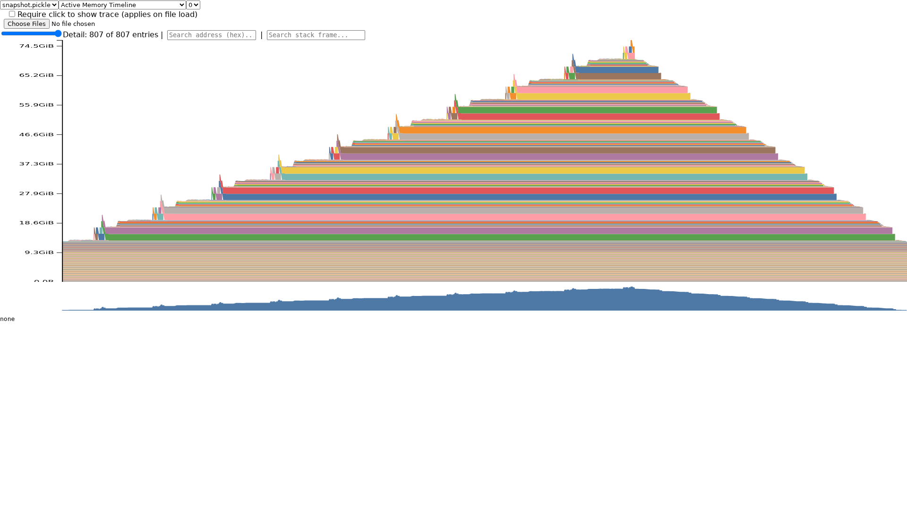
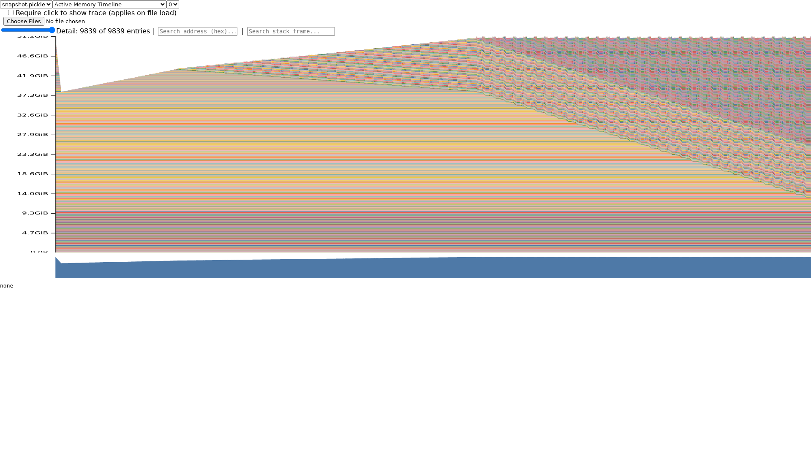
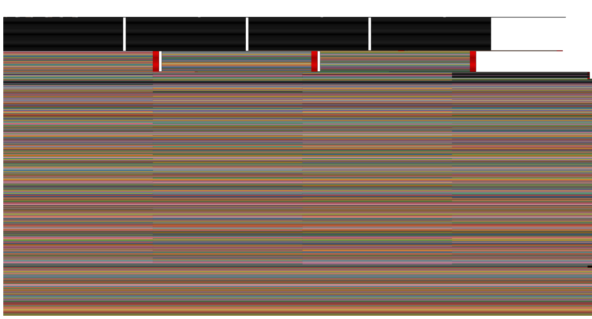

# A2-P 公开提交：金罗智杰

> 本目录公开可见，只包含自己编写的 profiling 代码、脱敏轻量结果和裁剪后的关键图片。
> `.nsys-rep`、SQLite、完整 Chrome trace、memory snapshot、运行环境和凭据均不提交。

## 基本信息

- 作业题面版本：`26.1.4-rc.3`
- 完成范围：End-to-End Benchmark、六个 Compute Profile、Mixed Precision Accumulation、
  BF16 autocast benchmark、Memory Profiling 与规定 fallback
- 未完成项：无
- 上游 starter commit：`ca8bc81a59b70516f7ebb2da4808daade877c736`
- 上游固定来源：[stanford-cs336/assignment2-systems@ca8bc81](https://github.com/stanford-cs336/assignment2-systems/tree/ca8bc81a59b70516f7ebb2da4808daade877c736)
- 本地工作仓库：`../assignment2-systems`

## 环境与工具

| 项目 | 公开、脱敏的信息 |
| --- | --- |
| GPU | NVIDIA H100 80GB HBM3，compute capability 9.0 |
| Driver / CUDA | Driver 570.124.06；PyTorch CUDA runtime 12.8 |
| Python / PyTorch | Python 3.12.12；PyTorch 2.11.0+cu128；`torch.backends.cudnn.version() = 91900` |
| Compute profiler | Nsight Systems 2025.3.1.90；PyTorch Profiler 作为框架级交叉检查 |
| 随机性 | seed 0；随机 input/target 在计时区间外提前生成 |
| 资源限制 | 单卡实验；运行时 GPU 独占性未单独核验 |

## 1. End-to-End Benchmark

### 1.1 入口与测量方法

统一入口为 `submission/profiling/benchmark.py`，支持 `forward`、
`forward_backward` 和 `train_step`。基线配置为 small、batch size 4、context 512、
vocabulary 10,000 和 FP32：

```bash
python profiling/benchmark.py \
  --model-size small --batch-size 4 --context-length 512 \
  --mode train_step --warmup 5 --steps 10 --dtype fp32 \
  --output results/timings_small_train_step_fp32.csv
```

- `forward` 在 `torch.no_grad()` 下只产生 logits。
- `forward_backward` 在计时区间外清空梯度，再测 forward、cross-entropy 和 backward。
- `train_step` 测量 zero grad、forward、loss、backward 和 optimizer step。
- 计时器为 `timeit.default_timer()`；总 step 和每个子阶段均在开始前、结束后调用
  `torch.cuda.synchronize()`。
- 模型初始化、随机数据生成及 host/device 准备不进入 measurement。
- 表中 `±` 后为 10 次 measurement 的**样本标准差**；CV 为样本标准差除以均值。
- 所有逐次 raw timing 和重新计算的统计量位于
  [`results/benchmark.csv`](results/benchmark.csv)。

### 1.2 三种 mode

| Mode | Forward (ms) | Backward (ms) | Optimizer (ms) | Total (ms) | CV | Peak allocated |
| --- | ---: | ---: | ---: | ---: | ---: | ---: |
| forward | 11.517 ± 0.087 | — | — | 11.541 ± 0.087 | 0.76% | 0.73 GiB |
| forward+backward | 13.916 ± 0.080 | 23.674 ± 0.065 | — | 37.629 ± 0.110 | 0.29% | 4.11 GiB |
| train-step | 14.612 ± 0.055 | 24.506 ± 0.134 | 14.414 ± 1.294 | 53.812 ± 1.212 | 2.25% | 5.08 GiB |

Backward 需要保存并使用 activation 计算梯度，因此比 forward 更慢、峰值显存也更高。
完整 train-step 还需更新 128.6M 个参数，optimizer 阶段进一步增加约 14 ms。该次
train-step 的主要波动来自一次较慢的 optimizer measurement，原始值未被删除。

### 1.3 Warm-up 0 与 5

两组都使用 small/FP32/train-step、batch 4、context 512 和 10 个 measurement，只改变
warm-up 数量。

| Warm-up | Total mean ± sample std (ms) | CV | Min (ms) | Max (ms) |
| ---: | ---: | ---: | ---: | ---: |
| 0 | 115.134 ± 188.907 | 164.08% | 54.027 | 652.744 |
| 5 | 53.812 ± 1.212 | 2.25% | 53.026 | 57.230 |

没有 warm-up 时，第一步包含 CUDA context、allocator 和 kernel 路径的首次初始化，
总时间达到 652.744 ms，显著抬高均值与方差。五步 warm-up 后，正式 measurement
反映稳定状态，CV 从 164.08% 降至 2.25%。

## 2. Compute Profiling

### 2.1 六个正式 `train_step` trace

主工具为 Nsight Systems。选择 small、large 两个模型，以及 256、512、1024 三个均大于
128 的二次幂 context；六个配置均为 batch 4、FP32、完整 `train_step`。代码同时标记
`profile/warmup`、`profile/measure`、forward、backward、optimizer、
`attention/scores`、`attention/softmax` 和 `attention/value`。

代表性采集命令如下；capture range 只保存五步 warm-up 后的一个 measurement：

```bash
nsys profile \
  --trace=cuda,cudnn,cublas,osrt,nvtx \
  --pytorch=autograd-shapes-nvtx \
  --capture-range=nvtx --capture-range-end=stop \
  --nvtx-capture='profile/measure@*' \
  --env-var=NSYS_NVTX_PROFILER_REGISTER_ONLY=0 \
  --output=results/nsys/large_ctx512_train_step_fp32 \
  -- python profiling/benchmark.py \
    --model-size large --batch-size 4 --context-length 512 \
    --mode train_step --warmup 5 --steps 1 --dtype fp32 \
    --nvtx-attention \
    --output results/nsys/large_ctx512_train_step_fp32.timings.csv
```

| Model | Context | Measure (ms) | Forward (ms) | Backward (ms) | Optimizer (ms) |
| --- | ---: | ---: | ---: | ---: | ---: |
| small | 256 | 137.211 | 36.800 | 67.180 | 31.804 |
| small | 512 | 143.899 | 40.514 | 69.489 | 32.088 |
| small | 1024 | 143.328 | 38.909 | 70.035 | 32.286 |
| large | 256 | 432.408 | 128.871 | 202.268 | 95.381 |
| large | 512 | 428.525 | 120.416 | 206.613 | 96.184 |
| large | 1024 | 500.360 | 114.254 | 211.866 | 98.475 |

`.nsys-rep` 只保留在本地。公开的六个 run 配置、命令和本地 trace 文件名在
[`results/profile/run_metadata.json`](results/profile/run_metadata.json)，NVTX、
CUDA API、主要 kernel、Calls、累计 CPU/CUDA 时间在
[`results/profile/trace_summary.csv`](results/profile/trace_summary.csv)。

### 2.2 代表性时间线与归因



large/context 512 的 backward 为 206.613 ms，是最长阶段；forward 为 120.416 ms，
optimizer 为 96.184 ms。Attention 子区间各调用 36 次，scores、softmax 和 value
累计分别为 11.396、5.009 和 9.010 ms。scores/value 包含矩阵乘，累计时长均超过
reduction 与 elementwise 主导的 softmax。



该 run 中，累计 CUDA 时间最多的 vector-add kernel 调用 1,995 次、累计 23.372 ms；
随后两个 multiplication kernel 分别调用 2,108 和 580 次、累计约 17.5 ms。
CPU 侧 `cudaLaunchKernel` 调用 9,784 次、累计 API 时间 40.767 ms。高频 elementwise
kernel 来自反向传播和 AdamW 参数更新；GEMM kernel 单次工作更重，但调用数更少。
Nsight 的 CUDA correlation 将 CPU API launch 与 GPU kernel 对应，NVTX 再给出其所属
forward、backward、optimizer 和 attention 阶段。

Nsight instrumentation 会引入明显的 CPU/tracing 开销，因此这里的阶段时间只用于归因，
不替代第 1 节的低开销稳定态 benchmark。另以 `torch.profiler` 的
`wait=1, warmup=1, active=1` schedule、CPU/CUDA activities、shape、stack 和 memory
记录做过框架级交叉检查；Chrome trace 只在本地使用。`torch.profiler` 适合解释 PyTorch
operator/autograd，Nsight 则提供系统级 CUDA API、kernel 与 NVTX 关联。

## 3. Mixed Precision

### 3.1 四种累加实验

实际输出保存在 [`results/mixed_precision.json`](results/mixed_precision.json)。

| Accumulator | Input | Result | Absolute error from 10 |
| --- | --- | ---: | ---: |
| FP32 | FP32 | 10.0001335144 | 0.0001335144 |
| FP16 | FP16 | 9.9531250000 | 0.0468750000 |
| FP32 | FP16 | 10.0021362305 | 0.0021362305 |
| FP32 | FP16→显式转 FP32 | 10.0021362305 | 0.0021362305 |

FP16 accumulator 随累计值增大而不断丢失较小增量，误差最大。FP32 accumulator 避免了
反复低精度舍入，却无法恢复输入 `0.01` 在转换为 FP16 时已经丢失的信息，因此后两种写法
结果相同，但仍不如纯 FP32 准确。

### 3.2 ToyModel BF16 autocast dtype

| Component | Observed dtype |
| --- | --- |
| Parameters（autocast 内外） | FP32 |
| Input | FP32 |
| First linear output | BF16 |
| LayerNorm output | FP32 |
| Logits | BF16 |
| Loss | FP32 |
| Parameter gradients | FP32 |

ToyModel 明确使用 CUDA BF16 autocast。eligible matrix multiplication 使用 BF16，
LayerNorm 和 loss reduction 保持 FP32；参数与累计梯度也保持 FP32，以兼顾 Tensor Core
吞吐、reduction 稳定性和动态范围。

### 3.3 FP32 与 BF16 benchmark

所有对照保持 batch 4、context 512、warm-up 5 和 10 个 measurement 不变。Speedup 定义为
`FP32 total / BF16 total`。

| Model | Mode | FP32 (ms) | BF16 (ms) | Speedup | FP32/BF16 peak allocated |
| --- | --- | ---: | ---: | ---: | ---: |
| small | forward | 11.541 | 12.337 | 0.94× | 0.73 / 0.91 GiB |
| small | forward+backward | 37.629 | 42.561 | 0.88× | 4.11 / 3.29 GiB |
| medium | forward | 23.706 | 25.889 | 0.92× | 1.91 / 2.57 GiB |
| medium | forward+backward | 85.198 | 81.817 | 1.04× | 10.61 / 8.47 GiB |
| large | forward | 45.294 | 41.735 | 1.09× | 4.12 / 5.76 GiB |
| large | forward+backward | 164.391 | 133.160 | 1.23× | 20.31 / 16.65 GiB |
| XL | forward | 84.817 | 73.318 | 1.16× | 13.47 / 19.43 GiB |
| XL | forward+backward | 321.376 | 243.211 | 1.32× | 40.20 / 37.33 GiB |
| 10B configuration | forward | 242.174 | 191.225 | 1.27× | 48.81 / 72.02 GiB |

small workload 无法摊薄 autocast 和转换开销，BF16 反而略慢；随着 GEMM 增大，H100 BF16
Tensor Core 的收益显现，XL forward+backward 达到 1.32×。Forward-only 中 FP32 参数与
autocast 的低精度 weight cache 同时存在，所以 BF16 peak 可能更高；反向传播较大的配置中，
activation 节省使总体峰值下降。BF16 较 FP16 有更大动态范围，但敏感 reduction 仍保持
FP32。

## 4. Memory Profiling

### 4.1 Snapshot 方法与峰值

每个配置先完成 warm-up，再开启 PyTorch memory history，采集一个独立 forward 或
train-step，并在本地保存 snapshot：

```bash
python profiling/memory_snapshot.py \
  --model-size xl --batch-size 4 --context-length 128 \
  --mode train_step --warmup 1 --dtype fp32 \
  --output results/memory/xl_ctx128_train_step_fp32.pickle
```

`allocated` 是活跃 PyTorch tensor 占用，`reserved` 是 CUDA caching allocator 已向驱动
取得的内存，包含可复用但当前未活跃的块。公开峰值和 fallback 记录位于
[`results/memory/peaks.csv`](results/memory/peaks.csv)。

| Context | Batch | Mode | Dtype | Status | Peak allocated | Peak reserved |
| ---: | ---: | --- | --- | --- | ---: | ---: |
| 128 | 4 | forward | FP32 | success | 12.93 GiB | 12.95 GiB |
| 128 | 4 | forward | BF16 | success | 19.17 GiB | 19.40 GiB |
| 128 | 4 | train-step | FP32 | success | 51.46 GiB | 57.36 GiB |
| 128 | 4 | train-step | BF16 | success | 51.45 GiB | 58.39 GiB |
| 2048 | 4 | forward | FP32 | success | 21.32 GiB | 23.48 GiB |
| 2048 | 4 | forward | BF16 | success | 25.38 GiB | 27.48 GiB |
| 2048 | 4 | train-step | FP32 | OOM | 76.48 GiB | 77.56 GiB |
| 2048 | 4 | train-step | BF16 | OOM | 75.94 GiB | 76.69 GiB |
| 2048 | 1 | train-step | FP32 | OOM | 77.06 GiB | 78.05 GiB |
| 1024 | 1 | train-step | FP32 | success fallback | 56.41 GiB | 57.30 GiB |

XL/context 2048 按题面降至 batch 1 后仍 OOM，因此继续按规定顺序尝试 XL/context 1024、
batch 1 并成功。所有失败配置保留准确的配置、阶段、异常类型和局部 snapshot，没有将
fallback 标成原配置。

### 4.2 Timeline、最大 allocation 与理论大小



XL 有 32 个 TransformerBlock。Context 2048 forward 图中出现 32 组大幅临时峰值，参数
基线约 13 GiB，峰值约 21 GiB。对 FP32 residual stream，

```text
size = batch × context × d_model × 4 bytes
```

在 batch 4、`d_model=2560` 时，context 128 和 2048 分别为 5 MiB 与 80 MiB，只随
context 线性增长。Dense attention matrix 的大小为
`batch × heads × context² × 4 bytes`；context 2048 时正好为 2 GiB。

[`results/memory/allocation_summary.csv`](results/memory/allocation_summary.csv) 显示，
context 128 forward 的最大单次 allocation 为 20 MiB，对应 MLP 中间量
`4×128×10240×4 bytes`，stack 类别包括 sigmoid/mul 和 bmm；context 2048 forward
的最大 allocation 增至 2,048 MiB，stack 类别为 attention bmm/div。后者的二次增长是
长 context 显存峰值和 OOM 的主要原因。



OOM 部分轨迹显示 saved activations 随 block 逐步累积；失败后的下降段是异常清理，而不是
完成了 backward。即使 BF16 或 batch 1 降低部分 activation，参数、梯度、optimizer state
与 dense attention 的组合仍超过可用显存。

### 4.3 Saved residual、gradient 与 allocator



Context 128 完整训练步在 forward 中逐层保存 backward 所需 tensor；backward 按
block 31 到 0 的反向顺序消费并释放 saved tensor，同时产生参数 gradient。由于 memory
history 在一次 warm-up 后开启，Adam 状态已存在于基线；measurement 开始的
`zero_grad(set_to_none=True)` 清除旧 gradient，随后 backward 重新建立 gradient。

为观察首次 optimizer state 创建，另采集了一个明确标记为 warm-up 0 的 Nsight CUDA
memory trace；它不作为稳定态 latency。脱敏汇总位于
[`results/memory/block_summary.csv`](results/memory/block_summary.csv)：

| Phase | CUDA allocation calls | Newly requested | Largest request |
| --- | ---: | ---: | ---: |
| forward | 1,529 | 5.53 GiB | 64 MiB |
| backward | 1,428 | 12.88 GiB | 100 MiB |
| optimizer | 267 | 26.06 GiB | 100 MiB |

XL 的 FP32 参数 gradient 理论大小为 `3.407B × 4 bytes = 12.69 GiB`，与 backward
请求的 12.88 GiB 接近；Adam 的两个 FP32 moment 理论大小为 25.38 GiB，与首次 optimizer
请求的 26.06 GiB 接近。Forward block 1–31 各请求约 160–182 MiB，最大单次 20 MiB；
block 0 还包含首次 capture 初始化，不能直接与后续 block 比较。PyTorch caching allocator
会保留释放的 block，所以 active tensor 下降时 reserved 不一定同步下降。



该 allocator 视图展示 live allocation、cached segment 与未使用空隙，支持区分 active、
allocated 和 reserved 三种口径；截图已移除地址、stack path 和机器信息。

## 5. 限制与复现

- 所有时间来自一张 H100；运行时 GPU 独占性未单独核验，跨设备结论需要重新测量。
- Nsight NVTX 时间包含 profiler 开销，只用于阶段与 kernel 归因。
- 当前模型使用显式 dense attention，context 2048 的注意力矩阵呈二次显存增长。
- 10B configuration 的 FP32/BF16 forward+backward，以及 XL/context 2048 完整训练步
  在本次 80 GB 单卡上真实 OOM。
- 大型 `.nsys-rep`、SQLite、Chrome trace 和 snapshot 只保留在本地工作目录；公开仓库
  只提供轻量、机器可读的 CSV/JSON 与关键截图。

最小复现顺序：

```bash
python profiling/benchmark.py --model-size small --batch-size 4 \
  --context-length 512 --mode train_step --warmup 5 --steps 10 \
  --dtype fp32 --output results/timings_small_train_step_fp32.csv

python profiling/mixed_precision.py --output results/mixed_precision.json

python profiling/memory_snapshot.py --model-size xl --batch-size 4 \
  --context-length 128 --mode train_step --warmup 1 --dtype fp32 \
  --output results/memory/xl_ctx128_train_step_fp32.pickle
```

- 代码同步命令：`python3 scripts/sync_a2p_submission.py --name '金罗智杰'`
- 轻量结果目录：`results/`
- 图片目录：`assets/`

## 飞书补充文档

- 链接：https://fudan-nlp.feishu.cn/wiki/LUvWwgg8aiIouCkk51cc1qMJnUd
- 权限：组织内公开，未开启互联网公开访问

飞书只保存组内执行方式、原始证据保留情况、OOM/fallback 与采集排查等最小差量信息，
不复制本公开主报告，也不保存凭据或大型 profiler 原始文件。

## 自检

- [x] 本 PR 只包含我本人本次 A2-P 的文件。
- [x] `README.md` 是 Markdown 主报告，所有图片使用相对路径和有意义的 alt text。
- [x] 每个关键数字都能回到命令、`results/` 或 metadata。
- [x] 仓库外源码使用固定 commit 的 GitHub HTTPS 链接，未写入本机路径或 `file://`。
- [x] 已用 Nsight Systems 完成两个模型、三个 context 的六个 `train_step` trace。
- [x] 已提交 Compute Profile 关键图和至少两张 Memory Timeline。
- [x] `results/` 与 `assets/` 公开附件合计不超过 2 MiB。
- [x] 未提交 `.nsys-rep`、snapshot、完整 trace、权重、数据、压缩包或依赖环境。
- [x] GitHub 内容不含内部主机名、IP、账号、路径、UUID、进程或未公开项目。
- [x] GitHub 和飞书正文不含 Secret、Token、Cookie、密码或私钥。
- [x] 飞书补充文档为组织内公开，且未开启互联网公开访问。
